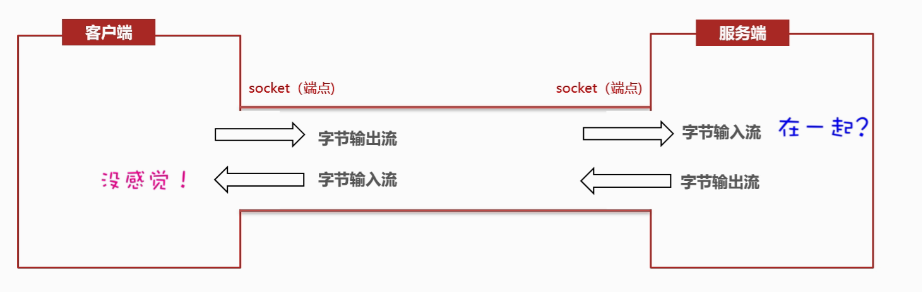
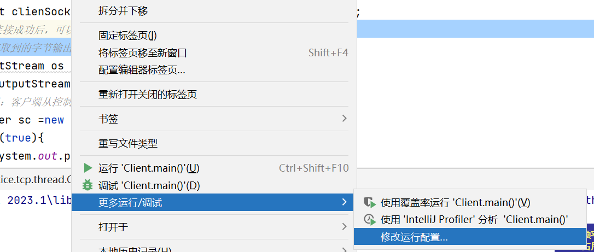

# 网络通信

​	学习重点

​	总计4个类，两个重要的类 Socket ServerSocket

## 网络通信三要素

### IP地址：设备在网络中的地址，是唯一的标识（字符串）

IP（Internet Protocol）地址

​	IPv4（32bit，4字节） 点分十进制，每八位转为一个十进制数字

​	NAT端口映射技术，怎么做内网穿透？国内是不是限制这个技术？

​	IPv6 （128位，16字节）冒分十六进制  每十六个字节自组，每段之间用冒号：分开 共8个数字

IP域名（DNS劫持，自己修改hosts文件也算是DNS劫持吧？）

​	域名解析优先级流程

公网IP：可以连接互联网的IP地址

内网IP：也叫局域网IP，只能组织机构内部使用

特殊IP地址：127.0.0.1、localhost(不经网卡？？？)两种区别？

ipconfig：查看本机IP地址

ping：检查网络是否联通 pong，死亡之ping的具体实现

InetAddress（Java中的代表类，对象）Inet4Address与Innt6Address

常用方法

​	public static InetAddress getLocalHost() 获取本机IP，会以一个InetAddress的对象返回

​	public static InetAddress getByName(String host)根据ip地址或者域名，返回一个InetAddress对象

### 端口号：应用程序在设备中的唯一标识（数字）

端口：标记计算设备上运行的应用程序的，16位，0-65535(实际开发中的集群配置会先分好段，避免端口冲突)

周知端口：0-1023（HTTP：80，FTP：？）

注册端口：1027-49151

动态端口：49152-65535

### 	协议：链接和数据在网络中传输的规则（JAVA已经编写好的类）

协议：事先规定的规则，传输数据的规则成为网络通信协议

OSI模型（三种网络模型）

UDP：语音通话/视频直播/会议，不可靠传输，通信效率高

TCP：网页/文件下载/支付面向，连接，可靠通信，在不可靠信道的上实现可靠传输，三步握手，四次挥手图（全双工？？）

UDP一次最多64kb的数字，TCP发生数字的大小不限制（基于IO流发送）

最终目的：基于Java完成UDP

重点：Java的类底层已经遵守了协议，重点在于怎么用

## UDP通信-快速入门

不事先建立连接，发送端每次将要发送的数据（限制64内）、接收端IP等信息封装成一个数据包，发出去

java.net.DatagramSocket实现UDP通信

DategramScoket的方法

| public DatagramSocket () | 创建客户端的Scoket对象，系统随机分配一个端口号 |      |
| ------------------------ | ---------------------------------------------- | ---- |
|                          |                                                |      |
|                          |                                                |      |
|                          |                                                |      |

方法

## TCP通信-快速入门

java提供了一个java.net.Socket类来实现TCP通信

两个Socket端点之间有一个管道（输入流默认绑定管道，向管道中写数据，输出流默认绑定了管道，从管道里读数据）

基于Socket获取的输入流（读数据）

默认所有的读取方法都是阻塞的【尝试从通道中读数据】没有就死等

除非【另一方关闭了Socket】

Socket类

构造方法

public Socket(String port,int port)指定服务器的ip、端口号请求与服务端建立连接，连接通过后，就获得了可客户端Socket

方法

public OutputStream getOutputStream 获得字节流输出对象

public InputSream getInputStream 获得字节流输入对象

Server Socket类（服务端的管理者【监听客户端的连接】本身并不具备收发数据的能力）

（服务器端得等到客户端发起请求后才能创建出来与之通信的Server Socket）

public ServerSocket(int port) 位服务端注册端口

public Socket accpet() 【阻塞（没有客户端就一直的等待）方法】阻塞等待客户端的连接请求，一旦与某个客户端成功连接，则返服务器端这边的Socket对象

## TCP通信-多收多收

## TCP通信-同时接收多个客户端

## TCP-综合案例

web响应（少量响应）是否单线程一样能够完成？

## 网络编程

​	可以让设备中的程序与网络上其他设备中的程序进行数据交互的技术（实现网络通信）

java.net.*提供了网络编程的解决方案

CS架构（Client客户端/Server服务端）与BS架构（Browser浏览器/Server服务端）

CS优点：预加载，效率高，更安全

CS缺点：开发量大，用户需要更新

BS优点：开发量小，

BS缺点：可以抓包，导致不安全，效率低，服务端压力更大

properties

map

多线程
