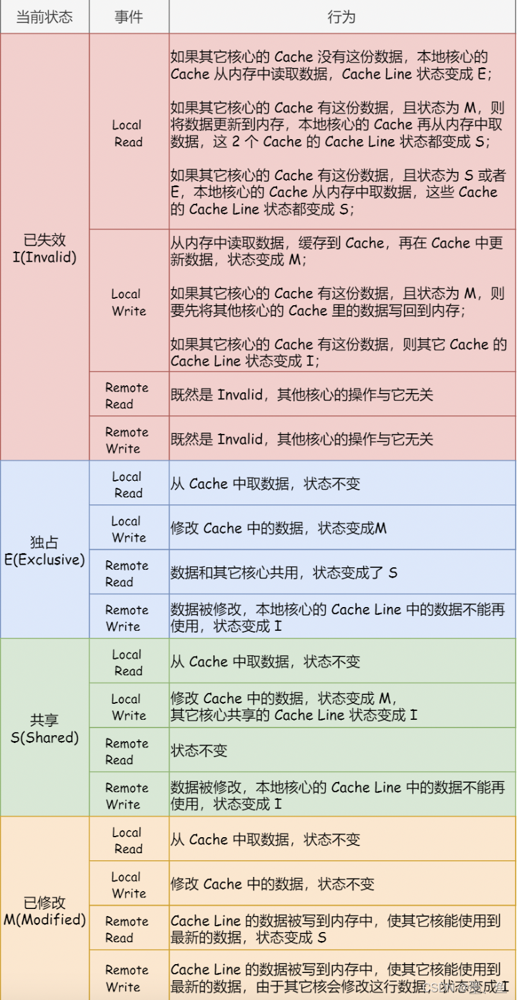

# 问题记录

<font color='blue'>整理下浪潮的常用服务器解决方案，拳头服务器产品</font>

我们定位渠道经理，系统集成商。

时钟，NTP协议跳变与渐变（128ms内渐变）

DRAM与SRAM


# 待归档区

业务=>流程图

并发=>时序图


读与写是计算机领域一个源远流长的问题。读有效，写传播

一致性问题也是计算机领域涉及面广，源远流长的问题（CPU的高速缓存【异步变同步的写屏障】，缓存集群，同步变异步的解耦合，提高性等等，）


BMC：BMC（Baseboard Management Controller，基板管理控制器）支持行业标准的 IPMI 规范。该规范描述了已经内置到主板上的管理功能。这些功能包括：本地和远程诊断、控制台支持、配置管理、硬件管理和故障排除。

BMC管理平台中进行固件升级，也使用了看门狗机制，避免刷新异常后程序停留在刷写模式无法恢复，看门狗时间为20 分钟；当进入刷写模式时，看门狗将被激活，20 分钟超时将自动重置BMC。当开始刷写镜像时，看门狗超时时间重新更新为20 分钟。

Redfish:

Redfish 是一种新的管理标准，它利用RESTful 接口表达数据。它面向模型，能够表达现代系统组件之间的关系以及服务和组件的语义，容易扩展。对于提供Redfish 的服务器, 客户可以通过发送HTTP 请求来获取BMC 信息, 并且对BMC 进行指定的操作。IPMI是一种较早的带外管理标准，仅限于“最小公共集”命令集（例如，开机/关机/重启、温度值、文本控制台等），由于供应商扩展在所有平台上并不常见，导致了客户常用的功能集减少。许多用户开发了自己的紧密集成工具，但是也不得不依赖带内管理软件。
而对于企业级用户来说，设备都是上千台，其需要统一的管理界面，就要对接不同供应商的API。当基本IPMI功能已经不太好满足大规模Scale-out环境时，
Redfish可扩展平台管理API（The Redfish Scalable Platforms Management API）是一种新的规范，其使用RESTful接口语义来访问定义在模型格式中的数据，用于执行带外系统管理 （out of band systems management）。其适用于大规模的服务器，从独立的服务器到机架式和刀片式的服务器环境，而且也同样适用于大规模的云环境。


```
服务器硬件介绍;培训内容：1、基础概念2、常用服务器简介3、存储设备简介4、服务器配件简介;一、基本概念;易混淆的地方 CPU主频、外频、倍频、前端总线频率 1、主频是CPU的时钟频率，简单说是CPU运算时的工作频率(1秒内发生的同步脉冲数)的简称 2、外频是CPU乃至整个计算机系统的基准频率，外频和内存总线频率相关，影响两者之间数据交换速度 3、倍频即主频与外频之比的倍数。主频、外频、倍频，其关系式：主频＝外频×倍频。 4、外频与前端总线(FSB)频率很容易被混为一谈。前端总线的速度指的是CPU和北桥芯片间总线的速度，更实质性的表示了CPU和外界数据传输的速度。而外频的概念是建立在数字脉冲信号震荡速度基础之上的，也就是说，100MHz外频特指数字脉冲信号在每秒钟震荡一万万次，它更多的影响了PCI及其他总线的频率 ;DDR(2) SDRAM “Double?Data?Rate (2) SDRAM”的简写，是双倍速率同步动态随机存储器的意思，DDR(2)采用在时钟的上升/下降延同时进行数据传输的基本方式，但DDR2内存却拥有两倍于上一代DDR内存预读取能力(即：4bit数据读预取) 通常说的“内存频率”其实是一个笼统的说法，内存频率实际上应细分为数据频率、时钟频率和DRAM核心频率三种。数据频率指的是内存模组与系统交换数据的频率；时钟频率则是指内存与系统协调一致的频率；而DRAM核心频率指的是DRAM内部组件的工作频率，它只与内存自身有关而不受任何外部因素影响。对SDRAM来说，这三者在数字上是完全等同的，也就是数据频率=时钟频率=核心频率；而DDR技术却不是如此，它要在一个时钟周期内传输两次数据，数据频率就等于时钟频率的两倍，但核心频率还是与时钟频率相等。由于数据传输频率翻倍(传输的数据量也翻倍)，而内部核心的频率并没有改变，这意味着DDR芯片核心必须在一个周期中供给双倍的数据量才行，实现这一任务的就是所谓的两位预取(2bit Prefect)技术；这项技术的原理是将DRAM存储矩阵的位宽增加一倍，这样在一个时钟周期内就可以传输双倍的数据，这些数据接着被转化为宽度为1/2的两道数据流、分别从每个时钟周期的上升沿和下降沿传送出去。这样从外部看，DDR可以在一个时钟周期内实现两次数据传输，带宽就提升为原来的两倍。

; 内存频率是指内存的数据频率，例如DDR266的数据频率即为266MHz，根据内存带宽的算法：带宽＝总线宽度×一个时钟周期内交换的数据包个数×总线频率，DDR266的带宽=2×8×133=2128，它的传输带宽为2.1G/s，因此DDR266又俗称为PC2100。同理，DDR333的工作频率为333MHz，传输带宽为2.7G/s，俗称PC2700；DDR400的工作频率为400MHz，传输带宽为3.2G/s，俗称PC3200。 ECC ECC是“Error Checking and Correcting”的简写， “错误检查和纠正”的意思。ECC是一种能够实现“错误检查和纠正”的技术，与传统的针对8位数据的1位奇偶校验相比，其使用4位来检查8位数据的正确性。

;SCSI：Small computer systems interface(小型计算机系统接口)缩写,它是一种工业标准的总线接口 硬盘数据传输率硬盘数据传输率的英文拼写为Data?Transfer?Rate，简称DTR。硬盘数据传输率表现出硬盘工作时数据传输速度，是硬盘工作性能的具体表现，它并不是一成不变的而是随着工作的具体情况而变化的。在读取硬盘不同磁道、不同扇区的数据；数据存放的是否连续等因素都会影响到硬盘数据传输率。因为这个数据的不确定性，所以厂商在标示硬盘参数时，更多是采用外部数据传输率(External?Transfer?Rate)和内部数据传输率(Internal?Transfer?Rate)。 外部数据传输率(External?Transfer?Rate)，一般也称为突发数据传输或接口传输率。是指硬盘缓存和电脑系统之间的数据传输率，也就是计算机通过硬盘接口从缓存中将数据读出交给相应的控制器的速率。 内部数据传输率(Internal?Transfer?Rate)是指硬盘磁头与缓存之间的数据传输率，简单的说就是硬盘将数据从盘片上读取出来，然后存储在缓存内的速度。内部传输率可以明确表现出硬盘的读写速度，它的高低才是评价一个硬盘整体性能的决定性因素，它是衡量硬盘性能的真正标准 ;Raid：Redundant Array of Inexpensive(或Independent) Disks (廉价(独立)磁盘
```


# 1-概述


# 2-CPU技术

<font color='blue'>现在常用的CPU的MIPS是多少？？？服务器选型问题</font>

## 2.1-概述

中央处理器（CPU）的功能主要是解释计算机指令以及处理计算机软件中的数据。CPU是计算机中负责读取指令，对指令译码并执行指令的核心部件。中央处理器主要包括两个部分，即控制器、运算器，其中还包括高速缓冲存储器及实现它们之间联系的数据、控制的总线。电子计算机三大核心部件就是CPU、内部存储器、输入/输出设备。CPU的功效主要为处理指令、执行操作、控制时间<font color='blue'>（有这个吗？有，时钟频率还是很关键的点）</font>、处理数据。 

在计算机体系结构中，CPU 是对计算机的所有硬件资源（如存储器、输入输出单元） 进行控制调配、执行通用运算的核心硬件单元。CPU 是计算机的运算和控制核心。计算机系统中所有软件层的操作，最终都将通过指令集映射为CPU的操作。

了解CPU之前我们先了解下指令集。

## 2.2-指令集

### 2.3.1-复杂指令集(CISC)

CISC（Complex Instruction Set Computer）：指令更多，指令非等长，编程简单，CPU设计复杂

- CISC架构采用复杂的指令集，指令可以执行较为复杂的操作，涵盖多个操作数和多个寻址模式。这使得单条指令能够完成较多的工作，包括内存操作、算术运算和高级控制流等。常见的CISC架构包括x86
- CISC架构的指令在执行过程中可能涉及多个时钟周期，并且不同指令的执行时间可能不同。CISC处理器通常采用复杂的微指令集，有专门的硬件或微码实现指令的流水线处理。
- CISC架构的处理器通常具有更为复杂的硬件结构，包括解码器和复杂的控制逻辑。这是由于CISC指令的复杂性和变长指令格式所决定的。处理器需要更多的硬件资源来解码和执行各种不同的指令。
- CISC架构的处理器由于其复杂的指令集和相关硬件，有时能够在单条指令中完成更多的工作，但是复杂性和功耗较高，适用于有大量复杂操作需求的应用，复杂运算高性能。

### 2.3.2-精简指令集（RISC）

RISC（Reduced Instruction-Set Computer）：指令更少，指令等长，编程麻烦，CPU设计简单，RISC架构采用精简的指令集，每条指令只执行一项简单的操作。指令集设计精简一致，操作数来源主要集中在寄存器中。RISC指令集通常较小，只包含基本的操作，如加载/存储、算术运算和逻辑运算等。常见的RISC架构包括ARM和PowerPC。

- RISC架构的指令通常可在一个时钟周期内执行完成，并且所有指令的执行时间相对一致。RISC处理器倾向于使用简单的流水线结构，使得每个阶段的指令处理能够更高效地进行。
- RISC架构的处理器倾向于使用更简单、规则和统一的硬件结构，指令格式相对固定。这样可以减少解码复杂性，提高指令执行的效率。
- RISC架构的处理器由于其精简的指令集和简单的硬件结构，在性能和功耗方面通常表现出色。流水线执行和优化编译使得RISC处理器具有较高的执行效率和低功耗特性，简单指令高性能。

> RISC-V（发音为“risk-five”）是一个基于精简指令集（RISC）原则的开源、免版税指令集架构。国内炒作。

### 2.2.3-复杂指令集与精简指令集区别

CISC和RISC之间的主要区别在于指令集的复杂度、执行方式和硬件复杂度等方面。CISC架构以复杂的指令集为特征，可以完成较复杂的操作，而RISC架构则采用精简的指令集和流水线执行方式，追求高效的指令执行和低功耗。实际上，现代处理器往往采用混合的架构，融合了CISC和RISC的特点，以平衡性能和功耗需求。

## 2.2-CPU架构

### 2.2.1-X86/X86-64 CPU架构

1978年6月8日，Intel发布了史诗级的CPU处理器8086，由此X86架构传奇正式拉开帷幕。首次为8086引入X86作为计算机语言的指令集，定义了一些基本使用规则，X86架构使用的是CISC复杂指令集。同时8086处理器的大获成功也直接让Intel成为了CPU巨头。

- 简介：x86架构最初由Intel推出，并成为个人计算机中最为常见的架构。x86-64是x86架构的64位扩展。
- 特点：x86 / x86-64架构具有广泛的软件支持和兼容性，适合于通用计算任务。它们提供了丰富的指令集并支持复杂的操作，具有强大的处理性能和内存管理能力。
- 个人计算机、工作站、服务器市场：x86 / x86-64架构在服务器市场占有很大份额。它们提供了强大的性能和广泛的软件支持，在企业级服务器和云计算领域广泛应用。

> x86-64：首先由AMD推出，并得到了英特尔的支持。x86-64架构扩展了x86架构的寻址空间和寄存器宽度，使其能够支持更大的内存容量和64位操作。x86-64架构兼容32位的x86代码，因此可以运行既支持32位操作系统和应用程序，又支持64位操作系统和应用程序。

### 2.2.2-ARM CPU架构

- ARM（Advanced RISC Machines）架构最初是用于嵌入式系统，后来成为移动设备市场的主流架构。
- 特点：ARM架构以其低功耗和高能效而著名，适合移动设备和物联网应用。它们采用精简指令集计算（RISC）的设计理念，具有较小的芯片面积和低功耗要求。
- 主要用于移动设备和物联网领域：ARM架构在移动设备市场占有率最高，如智能手机、平板电脑和可穿戴设备。许多主流移动设备处理器采用ARM架构，因为它提供了高效的能耗和性能比。ARM架构在物联网设备市场也占有一定的市场份额。由于其低功耗和小尺寸要求，许多物联网设备选择了ARM架构。
- Qualcomm （高通骁龙）、MediaTek （联发科，ARM的IP核）、Apple（苹果，ARM架构，但是自研）

> IP核：知识产权核或知识产权模块，在集成电路中可以独立使用或集成到其他电路中的一种模块化设计单元。IP核可以是硬件 IP（例如基于硬件描述语言的逻辑电路）或软件 IP（例如嵌入式处理器或通信协议的软件库）。

### 2.2.3-MIPS CPU架构

- 简介：MIPS架构（Microprocessor without Interlocked Pipeline Stages）是一种经典的RISC架构。
- 特点：MIPS架构具有简单、规范的设计和编码格式，适用于嵌入式系统和网络设备。它们注重高性能和高效率。
- MIPS架构在嵌入式系统市场上有一定应用，如网络设备、路由器、工业自动化系统等。它在市场上的份额相对较小。

在2007年，中科院计算机研究所的龙芯处理器获得了MIPS的全部专利、指令集授权，中国开始走上了以MIPS为基础的CPU研发道路。

### 2.2.4-PowerPC CPU架构

- PowerPC（Performance Optimization With Enhanced RISC Performance Computing）是一种RISC架构的处理器架构，PowerPC架构最初由IBM、Motorola和Apple共同开发，用于服务器和高性能计算领域。
- 特点：PowerPC架构具有高性能和可扩展性，适用于大型服务器和超级计算机。它们在高性能计算、多处理器系统和嵌入式系统中，以其强大的处理能力和可靠性而闻名。
- 服务器和超级计算机市场：PowerPC架构在高性能计算和服务器领域有一定市场份额，尤其是IBM的Power系列处理器。它们在超级计算机、大型企业级服务器和高性能存储等领域应用较多。

> IBM小型机是指IBM的System z系列，这是一种专为企业级应用设计的大型机器。它们具有高度可靠性、高可用性和扩展性，广泛应用于金融、航空航天、公共事业等行业。

> 浪潮K1 POWER服务器系列，该系列采用IBM Power架构，运行IBM的Power处理器。安装Power9/10CPU。这些服务器具有高性能、可靠性和可扩展性，适用于企业级应用、大数据处理等各种工作负载。


## 2.3-CPU的基本功能

- 指令执行（Instruction Execution）：CPU能够解析和执行指令集中的指令。它能够从内存中读取指令、解码指令的操作码，并根据指令执行相应的操作。
- 算术运算（Arithmetic Operations）：CPU包含算术逻辑单元（ALU），能够执行各种算术运算，如加法、减法、乘法和除法等。ALU还能执行逻辑运算，如逻辑与、逻辑或和逻辑非等。
- 控制流管理（Control Flow Management）：CPU的控制单元负责控制程序的执行流程。它通过程序计数器（PC）记录当前执行的指令位置，从而使程序按照正确的顺序执行。
- 寄存器操作（Register Operations）：CPU中包含多个寄存器，用于存储临时数据、地址和中间结果。寄存器可以快速访问和存储数据，提高了计算速度和效率。
- 内存管理（Memory Management）：CPU可以与内存进行交互，读取和写入数据。它通过地址总线和数据总线与内存通信，可以从内存中获取指令和数据，并将计算结果写回内存。
- 中断处理（Interrupt Handling）：CPU能够响应来自外部设备或软件的中断信号。当发生中断时，CPU会暂停当前的任务，保存上下文，并跳转到中断处理程序来处理中断事件。
- 分支预测（Branch Prediction）：为了提高指令执行的效率，一些CPU具备分支预测功能。它能够预测分支指令（如条件跳转）的执行路径，从而提前加载相关的指令，减少延迟。

## 2.4-CPU的基本组成

1. 控制单元（Control Unit）：控制单元指挥和协调CPU的操作。它包括指令寄存器（Instruction Register，IR）、程序计数器（Program Counter，PC）和指令译码器（Instruction Decoder，ID）地址寄存器（Address Register/AR）等组件，用于解析和执行指令。
2. 算术逻辑单元（Arithmetic Logic Unit，ALU）：ALU执行各种算术（如加法、减法）和逻辑（如与、或、非）操作。它是计算和比较数据的核心。
3. 寄存器（Registers）：寄存器是CPU内部的小而快速的存储器单元。它们用于存储指令、数据和中间结果。常见的寄存器包括累加器（Accumulator/AC）、数据寄存器（Data Register/DR）程序状态字（Program Status Word，PSW）等。
4. 数据通路（Data Path）：数据通路是连接控制单元、ALU和寄存器的路径，用于传输数据和指令。
5. 高速缓存（Cache）：高速缓存是位于CPU内部的快速存储器，用于加速对内存的访问。它通过存储最近使用的数据和指令，提高了数据的读取和写入效率。<font color='blue'>L1/L2（单核使用）/L3（多核共享）缓存</font>
6. 总线接口（Bus Interface）：总线接口负责与其他计算机组件进行通信。它包括地址总线、数据总线和控制总线，用于传输指令、数据和控制信号。


## 2.5-性能指标

CPU性能指标概述


## 2.6-高速缓存（Cache）

> **Cache:** **A smaller, faster storage device that acts as a staging area for a subset of the data in a larger, slower device.**
>
> **Fundamental idea of a memory hierarchy:**
>
> For each k, the faster, smaller device at level k serves as a cache for the larger, slower device at level k+1.
>
> **Why do memory hierarchies work?**
>
> Because of locality, programs tend to access the data at level k more often than they access the data at level k+1. 
>
> Thus, the storage at level k+1 can be slower, and thus larger and cheaper per bit.
>
> **Big Idea:** **The memory hierarchy creates a large pool of storage that costs as much as the cheap storage near the bottom, but that serves data to programs at the rate of the fast storage near the top**
>
> 【内存体系的设计初衷】这个内存层次结构创建了一个大的存储池，其成本与底部附近的廉价存储相同近似，但是以顶部附近的快速存储的速度为程序提供数据。


### 2.6.1-Cache概念

#### 缓存是什么

缓存是指可以进行高速数据交换的存储器，它先于内存与CPU交换数据，因此速率很快。

设计者在CPU与内存之间引入了高速缓存。CPU中寄存器的存储容量小，访问速度极快；内存存储容量很大，但相对寄存器而言访问速度很慢。而高速缓存的存储大小和访问速度都介于二者之间，作为一个缓冲桥梁来填补寄存器与主存间访问速度过大的差异。


#### 缓存命中

所谓缓存命中(hit)，表示的CPU核需要读取的数据或者指令在缓存中可以找到，这个过程就叫缓存命中。对于CPU核来说，如果缓存不命中，CPU核不得不去访问内存取出相关数据或者指令，这么看，所以缓存命中的概率应该越大越好。3级缓存(L1，L2，L3)的访问延时逐渐增加，所以对于核心来讲，最希望即将执行的指令和数据在L1就命中，其次L2，再其次L3。如果L1，L2，L3都没有命中，则CPU就只能去内存中取数据了。而由于<font color='blue'>分支预测</font>，路预测等技术，Intel与AMD的CPU的缓存命中率通常可以达到95%以上，这可以保证CPU运行过程中不会空转，保证了程序的运行效率。

### 2.6.2-L1/L2/L3三级缓存

都统称为片内缓存，

#### （1）缓存的分级

通常情况下，缓存被分为三级，L1，L2，L3。那么为什么分为三级呢，为什么不是只有一级缓存，为什么不设置四级缓存呢？我们来一个一个搞清楚。

这里就要涉及到CPU三级缓存的区别了。这里我们需要明确私有缓存与共享缓存的概念，对于一个完整的CPU，里面会有若干个核，比如四核八核等等，对于CPU多核心的场景下，每个核心的L1,L2缓存都只能被这个核访问，别的核无法访问，L1，L2是这个核的私有缓存。而相对应的，L3缓存被以某种协议或者方式链接到CPU内的一种总线上，供所有Core访问，所以，L3为共享缓存。(从上述的Cache架构图就可以看出这种区别)

> L3缓存是挂到总线（BUS）上的


#### （2）L1数据缓存与L1指令缓存（分离缓存）

将数据缓存和指令缓存分开，可以提高缓存系统的效率。由于数据和指令在程序执行过程中的访问特点不同，将其分开存储可以充分利用缓存的空间和时间局部性原理，更符合DDR内存中数据的组织形式提高缓存的命中率，从而提高cache命中率。

 在CPU中，取指令和取数据指令是由两个不同的单元完成的，也就是说在<font color='blue'>流水线控制</font>中**取指**和**访存**是分开的。如果使用统一缓存，当CPU使用超前控制或流水线控制（并行执行）的控制方式时，会存在取指令操作和取数据操作，同时争用同一个缓存的情况，这会降低CPU运行效率.

数据缓存的访问特点：

1. 数据的读取和写入：数据缓存用于存储CPU需要处理的数据，包括变量、数组等。在程序执行过程中，CPU经常需要读取和写入数据。因此，数据缓存更注重加速数据的读取和写入操作。
2. 内存操作模式：数据缓存通常根据内存操作的局部性原理，采用缓存行（cache line）的方式进行数据的加载和存储。当CPU访问一个地址时，数据缓存会将相邻的数据也加载到缓存中，以便在近期可能再次访问这些数据。

指令缓存的访问特点：

1. 指令顺序的保持：指令缓存需要保持指令的顺序，以确保程序的正确执行。缓存中的指令按照程序中的顺序存储，当CPU需要执行一条指令时，可以直接从缓存中读取，无需重新从内存中获取指令。

#### （3）L1缓存与L2缓存区别

因为缓存在L1缓存中分为一级指令缓存（L1 D-cache）与一级数据缓存（L1 I-cache）。L1缓存是直接与CPU数据总线相连的，指令缓存是专门用来给CPU提供指令的，而数据缓存是专门给CPU提供数据的。虽然指令缓存中偶尔也会存入数据，数据缓存中也偶尔存入指令。但是存归存，CPU核心不会在指令缓存中读取数据，也不会在数据缓存里读取指令，而指令缓存与数据缓存的区别只会在L1存在。L2缓存是同时存储指令和数据的。

#### （4）为什么不需要四级缓存

对于CPU而言，L1,L2是专门给一个核设计的，L3是给一个CPU内的多核设计的。L1,L2,L3各司其职，以及满足了一颗CPU的需求了，如果缓存容量缺的话，加大一下各级的大小是个不错的方案，况且，对于一个CPU而言，缓存实在是太占有CPU的单元面积了，同样的晶圆，原本能生产32块CPU，加上四级缓存可能10块都生产不了。


> Power系列（Power9处理器）有L4缓存，英特尔的Meteor Lake也有（2023消息）

#### （5）缓存的容量频率与延迟

对于L1缓存来说，作为最靠近Core的部件，它的频率是与CPU核同频的，以Ghz为单位，同时它的容量是比较小的，一般情况下只有几十kB到几百kB不等。而对于L2,L3，缓存的容量不断加大，一般L2的容量是几百KB到几MB不等，而L3一般是十几MB。访问延时也在不断增高。Core访问需要等待的时钟周期也不断增加。这里列出来某款处理器的CPU核访问三级缓存与内存需要占有的时钟周期与延迟。


表中可以看到，访问内存所占有的时间是访问L1缓存的30~50倍。缓存的存在大大提高了CPU的执行效率。

#### （6）三级缓存的协作

既然缓存分为三级，那么要考虑一下三级缓存直接是怎么协作的。对于缓存的协作方法上，Intel与AMD很有默契的分成了两种阵营。Inclusive模式与Exclusive模式。

- Inclusive(包含)模式：这种模式下，L3的缓存包含了缓存的所有内容。也就是说L2缓存的内容是L3的子集，L1的内容又是L2的子集。内存中被缓存的内容会首先进入到L3中。这种模式的好处就是，当一个CPU核发现L3缓存没有命中后，完全可以确定别的CPU核的缓存也没有命中。而且上层的Cache与底层Cache的数据交换更快。因为假设L1发现L2有需要的数据，直接从底层Cache复制一份上来就可以了，无需做别的操作。但是缺点就是会空间浪费，也会产生缓存一致性问题，例如一个CPU核修改了某个缓存行的内容，那么别这个Cacheline在别的Cache中的数据就是过时的，需要进行额外的操作。
- 而AMD选择的Exclusive(互斥)模式下，L1,L2,L3是一个大的整体。也就是所有的缓存中，每一份数据都是唯一的，这个好处就是，首先不会造成空间浪费，所有缓存没有副本，而且也不会存在上文所说的一个核更改缓存行，别的数据副本过时的问题，因为数据只有一份。但是缺点也比较明显，更改一份数据需要更多的操作，同样假设L1发现L2有需要的缓存数据，不仅仅需要复制，还需要把L2的该数据的缓存行设为无效。而且内存中被缓存的内容会首先进入到L1缓存中，当L1的缓存占满后，会把优先级可能没那么高的数据放入L2，如果L2也被占满，就移到L3，如果L3也满了，直接淘汰掉。这样看，AMD的三层缓存更像三个仓库，L1是最近的小仓库，拿起来更方便，L1满了就往L2那个仓库里扔，L2满了，就往L3扔。

### 2.6.3-缓存数据管理

#### （1）Cache的组织形式（与内存组相联）

Cache里以缓存行CacheLine为单元来存储数据

https://www.zhihu.com/question/24612442

https://zhuanlan.zhihu.com/p/593016449

https://zhuanlan.zhihu.com/p/340573903

<font color='blue'>缓存与内存地址之间的映射关系不易理解，但不影响理解其它内容</font>


Set：组

CacheLine：缓存行，64B

#### （2）缓存行

缓存在对数据进行读取，移除，淘汰，置换等操作的时候，每次操作都是在操作一块数据，这一块数据是缓存操作的最小单位，即缓存行，目前主流的CPU的缓存行大小都为64B，也就是512bit。这是因为内存的一次传输的单位也是64字节。

当CPU核访问一串内存地址的时候，首先去到缓存里看缓存有没有命中，那么怎么看缓存中存储的内容是CPU所想访问的那个地址的数据呢？问题来了，缓存中需要有地方去存储内存的地址信息。这里假设内存位4G大小，即2^32。如果以缓存行为单位，即需要2^26个缓存行表示。则前置需要26bit来表示当前缓存行存储的是哪一个地址的数据。这个地址标识则称为Tag。假设CPU给出的是物理地址，则可以根据物理地址计算中出这个地址的tag是多少，然后比对所有cacheline是否存在这样一个tag,如果存在，则缓存命中，否则，缓存不命中。

> 总结：依据Tag标志位来判断，组相连映射中先根据set index映射，再根据tag找到缓存行【此时就能判断是否命中缓存了】，再根据block offset定位数据

#### （2）三种地址映射（现在用的是组相联映射）

https://blog.csdn.net/aiden_kevin/article/details/113198046

### 2.6.4-MESI与内存屏障

参考链接：https://article.itxueyuan.com/39EXKX

> Power6中使用13状态的一致性协议，Power6处理的实现https://course.ece.cmu.edu/~ece740/f13/lib/exe/fetch.php?media=le_power6.pdf
>
> DMA(Direct Memory Access,直接存储区访问)为实现数据高速在外设寄存器与存储器之
> 间或者存储器与存储器之间传输提供了高效的方法。
>
> DMA 支持外设到存储器传输、存储器到外设传输和存储器到存储器传
> 输三种传输模式。
>
> 外设一般指外设的数据寄存器，比如 ADC、 SPI、 I2C、 DCMI 等
> 等外设的数据寄存器，存储器一般是指片内 SRAM、外部存储器、片内 Flash 等等。

#### （1）单核高速缓存一致性问题

##### 高速缓存与内存的一致性问题

　　高速缓存在命中时，意味着内存和高速缓存中拥有了同一份数据的两份拷贝。CPU在执行修改内存数据的指令时如果高速缓存命中，只会修改高速缓存中的数据，此时便出现了高速缓存与内存中数据不一致的问题。

　　这个不一致问题在早期单核CPU环境下似乎不是什么大问题，因为所有的内存操作都来自唯一的CPU。但单核环境下，DMA芯片在工作时会直接访问内存，如果高速缓存首先被CPU修改和主存不一致，就会出现DMA实际写回磁盘的内容和CPU处理后的结果不一致的问题。【理解：CPU写缓存，DMA从内存写回磁盘，缺少从缓存写回主存的过程】

　　**单核环境下cache与主存不一致问题**的解决方案，简单来说有两种方法：**通写法**和**回写法**。

**通写法（Write Through）：**

　　即CPU在**对cache写入数据时，同时也直接写入主存**，这样就能使得主存和cache中的数据始终保存一致。

　　通写法的优点是简单，硬件上容易实现，同时在调度缓存单元时不会有脏数据，调度速度快；缺点是每次cache写入操作时都增加了写主存的等待时间，效率较低。

**回写法（Write Back）：**

　　回写法和通写法的主要区别在于，回写法在CPU**写cache时并不实时同步写主存，而是在进行调度被覆盖前整体的写回主存**。如果被调度出的cache单元并没有被写入过，则直接被覆盖无需写回主存。

　　回写法的优点是写入cache时无需同步主存，总体效率比通写法高。缺点是硬件实现较为复杂。

#### （3）★多核CPU高速缓存一致性问题

<font color='red'>并发问题的根源所在</font>

​		在多核CPU的架构下，每一个Core都拥有着自己独有的高速缓存，每个核心能并发的读写自己的高速缓存。**高速缓存可以有多个，但其对应的内存数据逻辑上却只有一份，多核并发的修改其高速缓存中同一内存的映射数据就会出现高速缓存中的数据不一致的问题。**如果不对多核CPU下的高速缓存并发访问施加一定的约束，那么并发程序中对共享内存数据的存取就会出现问题，**并发程序的正确性将无法得到有效保障**。

##### 高速缓存一致的存储系统定义

在讨论解决高速缓存一致性问题的方法前，我们需要更精确的定义**什么是高速缓存一致性。**

> 　　　　内存系统的一个本质特征是：一个内存系统应该能提供一组保存值的存储单元，当对一个存储单元执行读操作时，应该能返回**“最近（可以理解为最后）”**一个对该存储单元的写操作所写入的值。在串行程序中，程序员利用内存来将程序中某一点计算出来的值，传递到该值的使用点，实际上就是利用了上述基本性质。同样，运行在单处理器上的多个进程或线程利用共享地址空间进行通信，实际上也是利用了内存系统的这个性质。
>
> 　　　　**一个读操作应返回最近的向那个位置的写操作所写的值，而不管是哪个线程写的。**当所有的线程运行在同一个物理处理器上时，它们通过相同的高速缓存层次来看内存，因此在这种情况下，高速缓存不会引起问题。当在共享存储的**多处理器（用核心替换好理解）**系统上运行一个具有多个线程的程序时，希望不管这些线程是运行在同一个**处理器（用核心替换好理解）**上，还是位于不同的处理器上，程序的运行结果都是相同的。

　　总结：**按照程序指令的运行顺序，对于同一内存单元内容(变量值)能够令后面的读操作读取到之前最近写操作后的结果，保证程序逻辑序的正确性**。

　　因此，一个高速缓存一致的存储系统其首先要满足的一个条件便是：**根据一个程序的任意一次执行结果，都能够对每个内存单元的存取操作构造出逻辑上的全局串行序列（即使是多核体系下，对内存的存取逻辑上也要强制串行化）**。这一全局逻辑串行序列还需要满足额外的两个条件：**一是同一处理器所发出的程序内存存取指令顺序(程序逻辑序)，与在全局逻辑串行序列中的先后顺序保持一致；二是每个读操作的值，返回的是在全局逻辑串行序列中最近的写操作之后的值。**

　　上述高速缓存一致性的定义隐含了在多核环境下的两个重要性质：一是**写传播**，二是**写串行化**。

　　**写传播（Write Propagation）：**一个处理器对一个位置的所写入的值，最终对其它处理器是可见的。

　　**写串行化（Write Serialization）：**对同一内存单元的所有写操作（无论是来自一个处理器还是多个处理器）都能串行化。换句话说，所有的处理器能以相同的次序看到这些写操作。

#### （3）MESI高速缓存一致性协议

**MESI协议**便是**基于总线侦听机制，采用回写法、写传播失效策略的高速缓存一致性协议**，其另一个更精确的名称是**四态缓存写回无效协议。**

MESI四态缓存写回无效协议，为高速缓存中的每个存储单元行cache line赋予了一个状态属性，状态类型共有4种：**Modified(已被修改)、Exclusive(被独占)、Shared(被共享)、Invalid(无效)，这也是MESI这一名称的由来。**

　　任意时刻每个缓存行都处于上述四种状态的其中一种，并且**可能**会因为发生的**缓存事件**而迁移至另一种状态。

**基于总线侦听的写传播：**

　　每个核心在对自己独有的高速缓存行进行修改时，需要将修改通知送至总线进行广播。其它核心在监听到总线上来自其它核心的远程写通知时，需要查询本地高速缓存中是否存在同样内存位置的数据。如果存在，需要选择将其设置为**失效**状态或是**更新**为最新的值。

> 　　　　通常多核并行架构的CPU，每个核虽然都独自工作，但与外部存储器的交互依然是共用同一总线进行的。通过总线，每个核心都能够监听、接收到来自其它核心的消息通知，这一机制被称为总线侦听或是总线嗅探。、

**基于总线侦听的写串行化：**

　　总线上任意时间只能出现一个核的一个写通知消息。**多个核心并发的写事件会通过总线仲裁机制将其转换为串行化的写事件序列(可以简单理解为逻辑上的一个FIFO事件队列)**，在每个写事件广播时，必须得到每个核心对事件的响应后，才进行下一个事件的处理，这一机制被称作**总线事务**。

**Modified:**

　　**缓存数据有效**，在读入缓存后**曾经被当前CPU修改**过却没有写回，导致**与内存中的对应数据不一致**。

　　内存中对应的数据**只在本地核心的高速缓存中存在**，其它核的高速缓存中并没有缓存这一内存数据。

　　**有效，本地cache独占，与内存数据不一致(被修改 Modified)。**

**Exclusive:**

　　**缓存数据有效**，在读入缓存后**没有被当前CPU修改过**，**与内存中的对应数据保持一致**。

　　内存中对应的数据**只在本地核心的高速缓存中存在**，其它核的高速缓存中并没有缓存这一内存数据。

　　**有效，本地cache独占，与内存数据一致(被独占Exclusive)。**

**Shared:**

　　**缓存数据有效，在读入缓存后没有被当前CPU修改过，与内存中的对应数据保持一致。**

　　内存中对应的数据**除了本地核心的高速缓存中存在，其它核的高速缓存中也缓存了这一内存数据**。

　　**有效，与其它cache共享，与内存数据一致(被共享 Shared)。**

**Invalid:**

　　**缓存数据无效。无效的含义既代表着之前缓存行有效，却因为某些事件变为无效；也代表着对应缓存行不存在。**

　　上述缓存行的共享/独占状态，指的是本地高速缓存中存在**有效**的对应存储单元缓存行，而其它核的高速缓存中**不存在对应单元的内容**或是**对应的缓存行是Invalid无效状态。**

> 在MESI协议中不存在与Invalid无效可以视作是等价的。

##### 内存缓存行的稳定态与非稳定态

　　了解了MESI的四种内存缓存行状态后，下面引入缓存内存行稳定态与非稳定态的概念。缓存内存行的稳定态指的是**多核下高速缓存中的对应内存中在所有高速缓存中数据是一致的**；非稳定态是稳定态的反面，指的是**多核高速缓存中对应内存中在所有的高速缓存中数据出现了不一致，有不同的副本值**。

　　当处于稳定态的缓存行由于某些事件的发生转向不稳定态时，MESI协议能够采取一些措施令整个多核存储系统重新回到稳定态(可以类比自平衡二叉树在发生插入/删除事件时，引起失衡后进行的重平衡操作)。

**内存缓存行处于稳定态的几种情况：**

　　1、对应内存行在所有核的高速缓存中都不存在。

　　2、对应内存行有且仅在一个核的高速缓存中存在，其状态可以是Exclusive也可以是Modified。

　　3、对应内存行在一个以上核的高速缓存中存在，每个缓存行中的存储的数据都和内存一致，其状态都为Shared。

##### **MESI协议缓存事件**

　　随着多核CPU中并发程序的不断运行，高速缓存被反复的读写，缓存内存行的状态也会在MESI这四种状态间反复变化。

　　在MESI协议中，抽象出了四种会导致缓存内存行状态的变化缓存事件：**本地读、本地写、远程读**以及**远程写**。缓存事件针对的是某一内存缓存行的事件。

**本地读(Local Read):**

　　本地读事件指的是本地核心对自己的缓存行进行读取。

**本地写(Local Write):**

　　本地写事件指的是本地核心对自己的缓存行进行写入。

**远程读(Remote Read):**

　　远程读事件指的是总线上的其它核心对某一内存缓存行进行了读取，当前核心监听到的事件。

　　**某一个核心的本地读事件，对于其他核心就是针对其对应内存缓存行的远程读事件。**

**远程写(Remote Write):**

　　远程写事件指的是总线上的其它核心对某一内存缓存行进行了写入，当前核心监听到的事件。

　　**某一个核心的本地写事件，对于其他核心就是针对其对应内存缓存行的远程写事件。**

##### MESI协议缓存行状态迁移 

　　缓存事件的发生可能会使得本地/远程的对应缓存行状态发生变化。比如当原本处于独占状态的本地缓存行监听到远程读事件时，需要将其由Exclusive被独占转变为Shared被共享；当监听到远程写事件时，如果发现对应的缓存行存在(此时必定是Shared被共享状态)，此时的内存缓存行便失去了稳定，MESI协议是采取的是写无效策略，需要将本地对应的缓存行设置为Invalid无效。

　　MESI协议中的四种状态在发生上述四种缓存事件时都可能发生对应的状态迁移，两两组合之后共有4*4=16种情况。



#### （4）MESI协议的优化

> 思路：同步改异步

　　通过MESI协议，在强制串行化的总线事务帮助下能够始终保持一个全局高速缓存一致的稳定状态。为了确保总线写事务的强一致性，发生本地写的高速缓存需要等到远端的所有核心都处理完对应的失效缓存行，返回Ack确认消息后才能继续执行下面的内存寻址指令(同步，阻塞)。

　　1.对于进行本地写事件的核心，在等待所有核心响应的过程中令处理器空转效率并不高。

　　2.对于响应远程写事件的核心，在其高速缓存压力很大时，要求实时的处理失效事件也存在一定的困难，会有一定的延迟。

##### 存储缓存(Store Bufferes)

　　针对上述本地写事件需要等待远端核心ACK确认，阻塞本地处理器的问题，引入了存储缓存机制。

　　【由存储缓存代写】每当发生本地写事件时，将写入的新值放入存储缓存中，继续执行后面的指令。存储缓存会替处理器接受远端核心的ACK确认，当对应本地写事件广播得到了全部远程核心的ACK确认后，再提交事务，将其新值写入本地高速缓存中。但存储缓存的大小是十分有限的，当堆满的事务后，依然会阻塞CPU，直到有事务提交释放出新的空间。

　　**从同步、强一致性变成了异步、最终一致性，提高了本地写事件的处理效率。**

　　本地处理器在进行本地读事件时，处理器会先在存储缓存中查询对应记录是否存在【先查存储缓存，再去查高速缓存】，如果存在则会从存储缓存中直接获取，这一机制被称为**Store Fowarding**。

##### 失效队列(Invalid Queue)

　　解决远端核心响应远程写事件，实时的将对应缓存行设置为Invalid无效状态延迟高的问题，引入了失效队列机制FIFO队列。

　　每当监听到远程写事件时，将失效通知存入失效队列，立即返回ACK确认消息。对于失效队列中的写失效通知，会在空闲时逐步的进行处理，将对应的高速缓存中的缓存行设置为无效。失效队列的引入在很大程度上缓解了存储缓存空间有限，容易阻塞的问题。

　　**从同步、强一致性变成了异步、最终一致性，提高了远程写事件的处理效率。**

#### （5）★内存屏障(Memory B**arrier**)

> 内存访问顺序和可见性：可见性，我认为指的是主存的可见性，访问顺序：<font color='blue'>有待搞明白</font>

　　存储缓存和失效队列的引入在提升MESI协议实现的性能同时，也带来了一些问题。由于**MESI的高速缓存一致性是建立在强一致性的总线串行事务上的，而存储缓存和失效队列将事务的强一致性弱化为了最终一致性，使得在一些临界点上全局的高速缓存中的数据并不是完全一致的。**

　　对于并发程序，多核高速缓存间短暂的不一致将会影响共享数据的可见性，使得并发程序的正确性无法得到可靠保证，这是十分致命的。

​		但CPU在执行指令时，缺失了太多的上下文信息，无法识别出缓存中的内存数据是否是并发程序的共享变量，是否需要舍弃性能进行强一致性的同步。

> 理解：CPU不知道哪些数据是应该保证强制一致性，即需要串行化执行的，所以提供了内存屏障机制，将是否开启强一致性同步的控制券交给了开发者。

　　内存屏障分为**读屏障**和**写屏障**两种，内存屏障以机器指令的形式进行工作。

###### 写屏障

　　**写屏障用于保证高速缓存间写事务的强一致性。**当CPU执行写屏障指令时，必须强制等待存储缓存中的写事务全部处理完再继续执行后面的指令。（强制异步转同步）

　　**写屏障指令执行完后，当前核心位于写屏障执行前的本地写事务全部处理完毕，其它的核心都已经接收到了当前所有的远程写事件的写无效通知且给回ACK确认。**

> 理解：执行写屏障指令时，CPU会等待存储缓存中的写事务全部处理完再执行其它指令，所以事务执行完即等价于所有核心收到了总线上的该条（或多条数据）的数据的写广播，且给了ACK确认（有可能是失效队列给的，失效队列给出ACK确认并不是代表真的将缓存行Cache LIne的数据改为了失效Invalid，所以还需要远端核心的失效队列强制处理完毕，给回真正的ACK确认）

###### 读屏障

　　**读屏障用于保证高速缓存间读事务的强一致性。**当CPU执行读屏障指令时，必须先将当前处于失效队列中的写无效事务全部处理完，再继续的执行读屏障后面的指令。相当于将异步队列中异步处理的远程写事务做了强一致的同步，（强制异步转同步）

　　**读屏障指令执行完后，当前核心位于读屏障执行前的远程写无效事务全部处理完毕，对于读屏障之后的共享数据读取会得到最新的值。**　

> 理解：当CPU执行读屏障指令时，必须先将失效队列中待处理的缓存行处理完，即给回的ACK确认是真正处理后的ACK确认，即高速缓存的失效数据，被标注了I，随后如果需要读取共享数据，即发生Invalid后的本地读事件（本地读事件此时的流程：其它核心的缓存中有该数据且状态为M，等待其它核心的缓存写入主存，本地核心从主存中读取，然后两个核心的缓存行Cache Line都是S状态）。

　　在进行并发程序的开发时，共享变量的读写需要使用内存屏障保证其在多核间高速缓存的一致性。在对共享变量的写入指令后，加入写屏障，令新的数据立即对其它核心可见；在对共享变量的读取指令前，加入读屏障，令其能获取最新的共享变量值。


## 2.7-超线程技术

> <font color='blue'>与OS层面的进程与线程的关系</font>

一种提高CPU性能的方式，让CPU可以同时执行多重线程，就能够让CPU发挥更大效率，即所谓“超线程（Hyper-Threading，简称“HT”）”技术。超线程技术就是利用特殊的硬件指令，把两个逻辑内核模拟成两个物理芯片，减少了CPU的闲置时间，提高的CPU的运行效率。

采用超线程及时可在同一时间里，应用程序可以使用芯片的**不同部分**。虽然单线程芯片每秒钟能够处理成千上万条指令，但是在任一时刻只能够对一条指令进行操作。而超线程技术可以使芯片同时进行多线程处理，使芯片性能得到提升。

例如CPU在执行一条机器指令时，并不会完全地利用所有的CPU资源，而且实际上，是有大量资源被闲置着的。超线程技术允许两个线程同时不冲突地使用CPU中的资源。比如一条整数运算指令只会用到整数运算单元，此时浮点运算单元就空闲了，若使用了超线程技术，且另一个线程刚好此时要执行一个浮点运算指令，CPU就允许属于两个不同线程的整数运算指令和浮点运算指令同时执行。


# 3-总线技术

## 3.0-待归档区


# 4-内存技术

## 4.0-内存待归档区

<font color='blue'>PCIE总线，总线分类，纳入一个完整的知识体系</font>

RAM（Random-Access Memory）:随机存取存储器

- RAM传统上被封装为芯片
- 基本存储单元通常是一个单元（即1bit【位】）
- 多个RAM芯片构成一个存储器

SRAM（Static RAM）：静态随机访问存储器

- 每个存储单元（1bit）通常由六个晶体管来实现（成本较高）

- 只要保留通电状态，就可以无限期的保留值

- 对电噪音（EMI），辐射相对不敏感

- 更快，更贵，发热量大，用作L1或L2缓存，嵌入式用的也是SRAM

  > SRAM设计中，每个存储单元通常需要6个晶体管来实现。这些晶体管主要包括四个传输门（access transistors）和两个双稳态器（flip-flops）。传输门用于控制数据读写操作，而双稳态器用于存储和保持数据的状态。这种6个晶体管的SRAM设计成为"6T SRAM"，

DRAM（Dynamic RAM）：动态随机访问存储器

- 每个单元用一个电容器存储bit，一个晶体管用于访问，（电容充放电时间导致存储速度慢）
- 值必须每10-100ms刷新一次
- 对干扰，如电噪音（EMI）,辐射等，比SRAM敏感
- 更慢，更便宜，用作内存条。DDR

SDRAM：同步动态随机访问存储器与DRAM的对比

> Synchronous Dynamic Random Access Memory

1. 刷新方式：DRAM需要定期进行刷新操作，以在存储介质中维持存储的数据。这是因为DRAM使用了电容来存储数据，电容会逐渐漏电，因此需要刷新操作来保持数据的完整性。而SDRAM则是同步的，不需要显式的刷新操作，因为它使用了内部时钟和控制信号来管理数据的访问和存储。
2. 时序和速度：SDRAM和DRAM在时序和速度上也有一些差异。SDRAM利用了更高的时钟频率和并行访问技术，可以实现更高的访问速度和数据传输带宽。DRAM相对较慢，其速度受限于内部刷新周期和行预充电时间等因素。
3. 成本：通常情况下，SDRAM的成本相对较高，尤其是高性能的DDR（双倍数据率）和DDR2、DDR3、DDR4等版本。DRAM的成本相对较低，这是因为它较为简单且成熟，使用的制造工艺相对较旧。

DDR：双倍数据率同步动态随机存取存储器

> Double Data Rate Synchronous Dynamic Random Access Memory

为具有双倍数据传输率的DRAM，其数据传输速度为系统时钟频率的两倍，由于速度增加，其传输性能优于传统的SDRAM。SDRAM在一个时钟周期内只传输一次数据，它是在时钟上升期进行数据传输；而DDR则是一个时钟周期内可传输两次数据，也就是在时钟的上升期和下降期各传输一次数据。


# 5-存储技术


## 5.0-待归档区

常见存储技术

[SCSI](https://so.csdn.net/so/search?q=SCSI&spm=1001.2101.3001.7020)——小型计算机系统接口

[DAS](https://so.csdn.net/so/search?q=DAS&spm=1001.2101.3001.7020)——直连式存储

NAS——网络技术存储

SAN——存储区域网络

FC——光纤通道


FTP、HTTP其实也算是文件存储的某种特殊实现，它们通过某个URL地址来访问一个文件。

```
大型网络化磁盘阵列（Large Scale Network-Attached Storage，简称LSNAS）是一种用于存储和管理大规模数据的系统。它是一个结合了网络技术和磁盘阵列技术的存储解决方案，可以提供高容量、高性能和高可靠性的数据存储服务。

LSNAS系统通常由多个存储节点组成，每个节点都连接到一个或多个磁盘阵列。这些节点之间通过高速网络相互连接，形成一个分布式存储系统。通过这种方式，LSNAS系统可以横向扩展，实现存储容量和性能的提升。

LSNAS系统具有以下特点：

高容量：LSNAS系统可以支持大规模的存储容量，可以根据实际需求扩展磁盘阵列的数量和容量，满足不断增长的数据存储需求。

高性能：LSNAS系统通过并行化的方式提供高性能的数据读写能力。多个节点同时处理数据请求，提供快速的数据访问速度。

高可靠性：LSNAS系统通常采用冗余存储和数据备份机制，以确保数据的可靠性和安全性。即使某个节点或磁盘发生故障，系统仍然可以继续正常运行，并且不会导致数据丢失。

易于管理：LSNAS系统提供了集中化的管理接口，管理员可以通过该接口进行存储资源的管理、监控和配置。同时，LSNAS系统还支持各种常见的存储协议，如NFS、CIFS等，方便用户进行数据访问和共享。

LSNAS系统被广泛应用于大型企业、科研机构和云计算环境中，用于存储海量的数据，如大数据分析、云存储、视频监控等应用场景。它可以提供高性能、可靠的数据存储服务，满足不同应用对存储的需求。
```


## 5.1-存储技术发展史

**HDD硬盘**

1973年**IBM**公司制造出第一台采用“温彻斯特”技术的硬盘，从此硬盘技术的发展有了正确的结构基础。它的容量为60MB，转速略低于3000RPM，采用4张14英寸盘片，存储密度为每平方英寸1.7MB。 读取时磁头悬浮于盘片上方，是现代磁盘的原型。　

1991年**IBM**生产的3.5英寸的硬盘使用了**MR**磁头，使硬盘的容量首次达到了1GB，从此硬盘容量开始进入了GB数量级。 不过，IBM的硬盘业务还是没有被守住，因为后来IBM将旗下硬盘部门卖给了日立（Hitachi）公司，日立基于IBM和自己的存储业务进行战略性整合形成了日立环球存储科技公司（HGST）。不过，2011年3月7日HGST被卖给了美国西部数据公司（WD）。

1999年9月7日，**Maxtor**宣布了首块单碟容量高达10.2GB的ATA硬盘，从而把硬盘的容量引入了一个新的里程碑。

2000年2月23日，**希捷**发布了转速高达15000RPM的Cheetah X15系列硬盘，其平均寻道时间仅3.9ms，它也是到目前为止转速最高的硬盘。

硬盘不仅用于各种计算机和服务器中，在磁盘阵列和各种网络存储系统中，它也是基本的存储单元。

当然，现在的磁盘出现了氦气硬盘，以及SMR、HAMR、BPMR、HDMR（BPMR+HMAR技术）、BPMR+（BPMR技术辅以SMR技术）等等高精尖的磁盘技术与工艺。硬盘容量也早就到了TB级。

**SSD硬盘**（Solid State Drives），简称固盘，SSD用固态电子存储芯片阵列而制成的硬盘，由控制单元和存储单元（FLASH芯片、DRAM芯片）组成。

1970年，**Sun StorageTek**公司开发了第一个固态硬盘驱动器。1989年，世界上第一款固态硬盘出现。
由于固态硬盘技术与传统硬盘技术不同，所以产生了不少新兴的存储器厂商。厂商只需购买NAND存储器，再配合适当的控制芯片，就可以制造固态硬盘了。新一代的固态硬盘普遍采用SATA-2接口、SATA-3接口、SAS接口、MSATA接口、PCI-E接口、NGFF接口、CFast接口和SFF-8639接口。

有了磁带、有了磁盘、有了闪存芯片、有了固态硬盘，因而数据存储在加速发展，伴随的相关企业级存储产品的出现如磁盘阵列、虚拟磁带库、大型SAN存储阵列（高端存储）等等。

当然，现今的数据存储发展，也就日新月异了。包括云存储、软件定义存储、全闪存阵列、NVMe的PCIe闪存卡（盘）等等，存储产品的形态有了更大的变化，对于存储这两个词的定义范伟也就更为广泛和丰富了


## 5.2基础存储设备


### 5.2.1HDD

Hard Disk Drive：机械硬盘

RAID是硬盘独有的吧？阵列肯定不是独有的


### 5.2.2-SSD

[SSD 编码 – 第 1 部分：简介和目录 |代码胶囊 (codecapsule.com)](https://codecapsule.com/2014/02/12/coding-for-ssds-part-1-introduction-and-table-of-contents/)

先擦后写，块擦页写，垃圾回收，寿命有限，磨损均衡，颗粒不同，

<font color='blue'>闪存的阵列和HDD一样吗</font>

```
只是这里需要说明一下：U.2接口就是之前的SFF-8639，U.2是由固态硬盘形态工作组织（SSD Form Factor Work Group）推出的接口规范，某些企业级闪存厂商已经推出了U.2的SSD产品。M.2是Intel领头制定接口标准，体积更小接口更快，其原名就是NGFF接口，M.2基本上为超极本（Ultrabook）量身定制的标准，这里就不多谈了。

至于大家目前非常看重的闪存阵列，现在也分混插SSD盘和HDD盘的混合闪存阵列和全闪存阵列两种主要的形态。

闪存盘也是方便混合存储阵列或闪存阵列应用的形态，之前也有闪存厂商推出了采用了SFF-8639接口的闪存盘支持用户热插拔。当然也有存储厂商推出了支持SFF-8639接口的PCIe SSD，并且插在服务器里面使用，这种接口的PCIe SSD与主板通信采用的是PCIe信号，因此在性能上确实也能表现出SSD应有的贡献。当然后面，还有更小的模式的闪存盘，如采用U.2和M.2的SSD。
```


#### ①-SSD的发展史

> Solid State Drive：固态硬盘

1970年，**Sun StorageTek**公司开发了第一个固态硬盘驱动器。1989年，世界上第一款固态硬盘出现。

固态硬盘在接口的规范和定义、功能及使用方法上与普通硬盘的完全相同，在产品外形和尺寸上基本与普通硬盘一致（新兴的U.2，M.2等形式的固态硬盘尺寸和外形与SATA机械硬盘完全不同）。

在工作方式上，HDD使用磁盘，即磁性介质作为数据存储介质，在数据读取和写入上，使用磁头+马达的方式进行机械寻址。因为机械硬盘靠机械驱动读写数据的限制，导致机械硬盘的性能提升遇到了瓶颈。特别是HDD盘的随机读写能力，受其机械特性的限制，是一个巨大的瓶颈。SSD使用Flash作为存储介质，数据读取写入通过SSD控制器进行寻址，不需要机械操作，有着优秀的随机访问能力。

> 随机访问能力提升了，那么MySQL的关于随机访问的优化是不是就不太有用了？

由于3D堆叠技术和更先进的绝缘材料的应用，目前TLC闪存已经能够满足普通消费者的日常使用需求。而QLC的问题主要在于性能太差。对于采用64层QLC闪存的固态硬盘，往往需要1TB容量才能达到100MB/s的顺序写入速度。相比之下，同样为1TB容量，采用64层TLC闪存的固态硬盘，顺序写入速度可达1600MB/s之多。

**固态硬盘优点**

数据存取速度快。固态硬盘没有传统硬盘复杂的机械结构，既没有磁碟，也不存在磁头，它无需花费较长的时间寻道，读取速度更不会受到转速的限制。
防震抗摔。SSD固态硬盘内部不存在任何机械部件，这样即使在高速移动甚至伴随翻转倾斜的情况下也不会影响到正常使用。
没有噪音，发热低。由于与传统硬盘物理结构不同，SSD固态硬盘不存在磁头臂寻道的声音和盘片高速旋转的噪音，也没有机械马达和风扇，工作噪音值为0分贝。
工作温度范围大。机械硬盘只能在555摄氏度范围内工作，固态硬盘的温度范围可达-1070摄氏度，一些工业级固态硬盘的工作温度范围设置达到了-4-~85摄氏度(军用）。

**固态硬盘缺点**

成本高：<font color='blue'>统计当前</font>
容量低：<font color='blue'>统计当前</font>
写入寿命有限（基于闪存）：<font color='blue'>统计当前</font>

#### ②-固态硬盘的结构

<font color='blue'>浮栅晶体管如何被组织成页，块的？</font>

汇总下


字符串（图中的string）中的单元格共享一个共同的轨迹(比特位行，图中的bit line)，用于读取存储在其中的数据。那些彼此在同一行(图中的page部分，称为“页”)上的都连接到另一个共同轨迹 (图中的word line，字行)。字符串选择行（string select line）部分和地线选择行（Ground select line）与字行一起使用，以确定是否进行读、写或擦除处理。

由字符串string和页page组成的数组，构成了所谓的块(block)。页和块的大小差异很大，前者小到4 kB，后者大到512 kB，这在很大程度上取决于NAND颗粒的制造商和型号。

##### I-NAND闪存单元

固态硬盘 （SSD） 是一种基于闪存`FLASH`的数据存储设备。位存储在由浮栅晶体管组成的单元中。SSD 完全由电子元件制成，没有像硬盘驱动器拥有机械部件。

> FLAS闪存式非易失性内存
>
> 闪存现在最为常见的是SSD产品，如NVMe SSD、SAS SSD、SATA SSD。SSD因为接口和架构协议不同，存在着各自的优劣点。常见的闪存产品存在三种形态：一是闪存卡；二是闪存盘；三是<font color='blue'>闪存阵列</font>。

浮栅晶体管全程浮栅金属氧化物半导体场效应晶体管（Floating-gate MOSFET，简称浮栅MOSFET或FGMOS），通过修改存储在浮栅中的电荷量来表示数据。在2D NAND闪存时代，浮栅型结构（Floating Gate）几乎是唯一的选择。在转换到3D NAND闪存时，电荷捕获型结构（Charge Trap）后来居上，成为了主流选择。目前绝大多数NAND闪存制造商生产的3D NAND闪存都基于电荷捕获型结构。

电压施加到浮栅晶体管，这就是位被读取、写入和擦除的方式。根据制作工艺，闪存存储器可以分为NOR型和NAND型。NAND闪存容量大，按页进行读写，容量大，适合进行数据存储。所以是目前大多数制造商选择的解决方案，本文闪存单元默认是NAND型。

> NAND与NOR的区别[固态革命：深入了解固态硬盘的实际工作原理 |Ars Technica](https://arstechnica.com/information-technology/2012/06/inside-the-ssd-revolution-how-solid-state-disks-really-work/)

NAND闪存的一个重要特性是，由于陷阱辅助隧穿（Trap-assisted tunneling (TAT)）效应，随着擦写次数（编程/擦除周期数，Program/Erase Cycle (P/E Cycle)）的增加，氧化物绝缘层逐渐磨损，NAND闪存的可靠性会逐渐降低（数据保持时间缩短，出错概率增加）。

> 寿命有限
>
> 每个单元都有最大 P/E 周期数（编程/擦除），在此之后，该单元被视为有缺陷。NAND闪存会磨损并且使用寿命有限。不同类型的NAND闪存具有不同的寿命。（P/E即程序/擦除，这里的“Program”表示写入）

|                 | SLC  | MLC  | TLC  | HDD       | RAM      | L1 cache | L2 cache |
| --------------- | ---- | ---- | ---- | --------- | -------- | -------- | -------- |
| 可支持P/E循环数 | 100k | 10k  | 5k   | *         | *        | *        | *        |
| 每单元BIt数     | 1    | 2    | 3    | *         | *        | *        | *        |
| 寻址用时(μs)    | *    | *    | *    | 9000      | *        | *        | *        |
| 读取用时(μs)    | 25   | 50   | 100  | 2000-7000 | 0.04-0.1 | 0.001    | 0.004    |
| 写入用时(μs)    | 250  | 900  | 1500 | 2000-7000 | 0.04-0.1 | 0.001    | 0.004    |
| 擦除用时(μs)    | 1500 | 3000 | 5000 | *         | *        | *        | *        |

> *表示不合适此种设备

> 结论分析：
>
> 1.明显可以得知擦除用时较长。
>
> 2.SLC写入速度是HDD的10倍，读取速度是HDD的100倍

性能寿命表现SLC>MLC>TLC>QLC

为相同数量的晶体管提供更多位可降低制造成本。但是相应的减少了寿命和增加了写入耗时，

大多数普通公共 SSD 都是基于 MLC 或 TLC 的，只有专业 SSD 是基于 SLC 的。选择正确的内存类型取决于驱动器将用于的工作负载以及数据可能更新的频率。

对于高更新工作负载，SLC 是最佳选择，

而对于高读取和低写入工作负载（例如：视频存储和流式传输），TLC 将完全没问题。

此外，在实际使用工作负载下的TLC驱动器的基准测试表明，基于TLC的SSD的使用寿命在实践中不是问题。会有磨损均衡机制来保证SSD的每个单元被均匀使用。

<font color='blue'>国内现行解决方案采用的SSD类型？？服务器采购的主流SSD型号？？找两个</font>

> NAND闪存页面和块
>
> 读取或写入块的最小单位是**页面**。页面不能单独擦除，只能擦除整个块。NAND 闪存页面大小可能会有所不同，大多数驱动器的页面大小为 2 KB、4 KB、8 KB 或 16 KB。大多数 SSD 都有 128 或 256 页的块，这意味着块的大小可以在 256 KB 到 4 MB 之间变化。例如，三星 SSD 840 EVO 的块大小为 2048 KB，每个块包含 256 页，每个页面 8 KB。访问页面和块的方式在第 3.1 节中有详细介绍。

##### II-SLC/MLC/TLC/QLC

根据一个存储单元可以存储多少bit的数据，闪存单元可以分为SLC(Single Level Cell)、MLC(Multiple Level Cell)、TLC(Triple Level Cell)、QLC（Quad Level Cell）

> 目前SLC闪存已经几乎绝迹，MLC闪存只有极少数高端产品采用，主流固态硬盘均基于TLC和QLC闪存。
>
> 引自知乎，<font color='blue'>查找当前各个服务器产商的主打产品配的SSD的颗粒类型</font>

> <font color='blue'>SLC绝迹了吗</font>

> 以倍数来表示Single/Multiple/Triple/Quad


对于SLC、MLC、TLC和QLC闪存，分别需要分成2、4、8和16个电位。


##### III-SSD驱动器及其主要组件


命令来自用户通过主机界面。在我写这篇文章的时候，新发布的SSD的两个最常见的接口是串行ATA（SATA），PCI Express（PCIe）。SSD 控制器中的处理器接收命令并将其传递给闪存控制器。

> <font color='blue'>SATA3.0接口，PCIE3.0与PCIe4.0，NVME，U2，M2，ACHI，SAS，STAT/SAS/PCIe</font>

SSD 还具有嵌入式 RAM 内存，通常用于缓存目的和存储映射信息。第 4 节更详细地介绍了映射策略。

NAND闪存的封装通过多个通道按组组，在第6节中介绍，

**物理组成**

SSD由主控、闪存、DRAM（可选）、PCB（电源芯片、电阻、电容等）、接口（SATA、SAS、PCIe等）组成

主控首先就是一个执行固件代码的嵌入式处理器，用来控制闪存颗粒的存储单元连接到电脑。其具体的作用表现在以下三点:
1.合理调配数据在各个闪存芯片上的负荷，让所有的闪存颗粒都在一定的负荷下正常工作，协调和维护不同区块颗粒的协作，减少单个芯片的过度磨损。

2.承担数据中转，负责连接闪存芯片和外部的接口

3.负责固态硬盘内部的各项指令，比如trim、错误检查和纠正、磨损均衡、垃圾回收、加密等

**三星 SSD 840 Pro （512 GB）**


- 1 个 SATA 3.0 接口
- 1 个固态硬盘控制器（三星 MDX S4LN021X01-8030）
- 1 个内存模块（256 MB DDR2 三星 K4P4G324EB-FGC2）
- 8 个 MLC NAND 闪存模块，每个模块提供 64 GB 存储空间（三星 K9PHGY8U7A-CCK0）

**美光 P2013m Enterprise PCIe**


- PCI Express 8.2 接口的 0 通道
- 1 个固态硬盘控制器
- 1 内存模块 （内存 DDR3）
- 64 个 MLC NAND 闪存模块，覆盖 32 个通道，每个模块提供 32 GB 存储（美光 31C12NQ314 25nm）

> <font color='blue'>推测：模块/片数量于PCIE通道匹配更能发挥作用</font>

下图是一个比较老的SATA SSD拆开外壳后的样子，但即使是最新的M.2接口的NVME固态硬盘（再下图），在组成的组件方面也没有太大的不同。


左边的controller就是主控芯片，是一个管理所有指令、数据流、加密和其他算法的处理器。它上面是少量的DRAM缓存（低端的SSD没有），作为一个指令和数据缓存，并在驱动器上存储了一个数据位置表。

##### IV-浮栅晶体管

Flash的基本存储单元是 - 浮栅晶体管。

> 浮栅晶体管创建一个微小的笼子（称为浮栅）


上图是浮栅晶体管的结构，最下面的是衬底，源极和漏极。衬底之上，有隧道氧化层、Floating Gate(浮栅层)、氧化层、控制栅极。中间的Floating Gate被绝缘层包围着，电子易进难出，通过对Floating Gate充放电子，来对晶体管进行写入和擦除。

在源极（ Source）和漏极（ Drain）之间电流单向传导的半导体上形成存储电子的浮栅，浮栅上下被绝缘层包围，存储在里面的电子不会因为掉电而消失，所以闪存是非易失性存储器。

> 浮栅层【保存数据的物理位置】被两个氧化层包裹。使其具备了非易失性。

**浮栅晶体管的写和擦除的原理**

写操作如左图，是在上面的控制栅极加正电压Vpp，使电子通过绝缘层进入浮栅。擦除操作正好相反 ，如右图，是在**衬底（块共享）**加正电压Vpp，把电子从浮栅中吸出来 。写入的过程是充电子的过程，如果写入的page之前已经写过，在写入之前，必须先对flash进行擦除0，清除浮栅中的电子。


数据是以0和1二进制进行保存的，根据浮栅中有没有电子两种状态，可以表示数据的0和1，这样就可以进行数据的存储。一般把有电子的状态记为0，没有电子的状态记为1。

> 随着擦写次数的增加，氧化物绝缘层会逐渐磨损，浮栅MOSFET的出错概率会越来越高。对于需要更多电压层级的闪存，将更快地出现无法满足要求的情况。

> - 浮栅MOSFET基于N沟道增强型MOS管，有一个绝缘的栅极，位于控制极和衬底之间，称为浮栅。由于浮栅被氧化物绝缘层包围，其中的电子不易逃逸，外面的电子也不容易进来，因此可以较长时间地保存其中的电子。
> - N沟道增强型MOS管由P型衬底和两个N型扩散区构成。在两个N型扩散区上各连接一个电极，即为源极（Source）和漏极（Drain）。在衬底表面覆盖一层氧化物绝缘层，在源极和漏极之间的绝缘层上连接一个电极，即为栅极。从源极到衬底再到漏极，构成两个方向相反的PN结。
> - 当栅极电压为零时，两个PN结中总有一个反向偏置，无电流通过，此时MOS管截止。当在栅极施加的电压逐渐增大时，衬底中的电子受到电场作用向衬底表面移动，形成一N型薄层，直到在源极和漏极之间形成N型沟道，连通两个N型扩散区，此时MOS管导通。形成N型沟道时的栅极-源极电压称为阈值电压（Threshold Voltage）。
> - 浮栅MOSFET的写入操作是在控制极加一个相对于衬底的高电压，当这个电压足够高时，衬底中的电子会在电场的作用下穿过绝缘层进入浮栅。
> - 浮栅MOSFET的擦除操作是在衬底加一个相对于控制极的高电压，当这个电压足够高时，浮栅中的电子会在电场的作用下穿过绝缘层进入衬底。
> - 根据浮栅中充入电子的多少，浮栅MOSFET有着不同的导通电压。浮栅中充入电子较少时，浮栅MOSFET可以轻易导通，记为1，即擦除态；浮栅中充入电子较多时，需要在控制极施加更高的电压浮栅MOSFET才能导通，记为0，即编程态。
> - 读取时，在控制极加一个较低的电压并对浮栅MOSFET进行检测。当浮栅MOSFET导通时，查询读取电压对应的数值，便可以得知存储的数据内容。


##### V-闪存的内部组织架构

> NAND闪存的基本架构为Chip/Package-Die-Plane-Block-Page-Cell。

- NAND闪存是由成千上万个cell组成的Array（阵列）
- cell之间是串行连接的，漏极连源极，32或64个一组，组成一个String（串），string（串）末端的cell漏极连接Bit Line（位线）,首端的Cell源极连接Source Line（源线）
- 每个cell的控制极（晶体管结构最上边的栅极）连接Word Line（字线），同一Word Line（字线）上的Cell为一Page（页）
- 串与旁边的串共用位线。
- Page（页）由同一根字线上的cell组成，是一种逻辑概念。位线分为两组，even和odd，分别组成交叉的2组页。一根字线上的页数和每cell存储的比特数有关，SLC为1bit/cell，MLC为2bit/cell，TLC为3bit/cell，MLC为4bit/cell。对于SLC闪存，一根字线上有2页。而MLC闪存每cell能存储2bit数据，可以在逻辑上分成2个页。因此对于MLC闪存，一根字线上有4页。一组字线连接的所有串组成一个Block（块）。
- 在NAND闪存中，一个块中的所有cell共用一个衬底，因此NAND闪存的最小擦除单位是块。


**另一张NAND示意图**

> String Select Line与Ground Select Line概念在上一张图没有出现
>
> 每个浮栅MOSFET作为一个单独的存储单元，被称为存储器或位单元，有三条电通路（字符选择行，字行，接地选择行）连接到它。CTF被分组在一起，首先作为一个长列(字符串，下图中的string)，包含32到128个单元格。


> 概念：
>
> DIE：颗粒，一个nand颗粒由一颗或者多颗die封装在一起而成，这种封装可以是平排的，也可以是层叠的。die内部可以通过3D堆叠技术扩展容量，就像盖楼房一样
>
> 
>
> LUN：逻辑单元
>
> Plane：面
>
> Block：块
>
> Page：页

- 1个Chip/Device -> 多个DIE或者LUN
- 1个DIE/LUN -> 多个Planes
- **DIE/LUN是接收和执行闪存命令的基本单元**
- 1个Plane -> 上千个Blocks
- **每个Plane有独立的register，一个Page register，一个Cache register**
- 1个Block -> 上百个Pages
- **Block是擦除的基本单位**
- 块中存储单元都共享相同的衬底，
- 1个Page -> 一般是4KB 或者 8 KB + 几百个字节的隐藏空间
- **Page是读或者写的基本单位，4K或8K**<font color='blue'>机械盘的读写基本单位是多少？？</font>
- 这也意味着写入比擦除快。
- Cells -> flash存储信息的基本单位，根据每个cell可以保存1bit, 2bit, 3bit可以分为SLC, MLC, TLC


##### VI-3D NAND

传统的Flash，是以二维的方式组成的，主要由word line(WL)和bit line(BL)组成，如下图。一条word line代表一个page，在读写的时候，bit line控制word line上的每一个bit。这样的word line和bit line交叉，组成了一个block。block平铺组成了flash。


随着闪存技术制造工艺的发展，二维闪存的尺寸不断缩小，单元间的干扰随尺寸的缩小不断变大。3D Nand Flash技术的出现，有效的解决了单元干扰的问题。

下图是一种3D闪存的立体图，在这种三维闪存中，flash堆叠了起来。如果2D Nand Flash比作平房，那么3D Nand Flash可以看做是楼房，3D Nand Flash可以通过提高flash的层数在单位面积上堆更多的晶体管。3D Nand Flash在单位面积堆更多的存储单元，在降低每bit成本上很有优势。


在3D NAND闪存的实现上，几家闪存制造商采用了不同的方法。

从最新的技术架构来看，现在3D NAND常见的分为VC垂直通道、VG垂直栅极两种架构。架构不同，对于3D NAND的可靠性设计略有一点区别，但闪存的本质是没有区别的。因为毕竟是采用堆栈来扩大单位面积上的闪存容量大小的，目前业界知名的闪存厂商采用了32层堆栈、48层堆栈模式，层数越多，对于闪存可靠性要求的挑战越高。
不过，东芝和WD已经成功研发并推出64层堆叠的3D NAND Flash，制程工艺当然也受到了巨大的考验，计划将于2017年上半年开始量产。

三星传出消息说将抢先在2016年底前开始量产64层3D NAND。

**三星的V-NAND闪存原理示意图**


**东芝和西数3D NAND闪存原理示意图**


#### ③-基准测试和绩效指标

<font color='blue'>基准测试要找机会做做看，硬盘的基准测试工具，看看需要哪些参数与指标，做完测试再来回顾该问题</font>

##### I-基准测试

| Brand/Model               | Samsung (MCCDE64G5MPP-OVA) | Intel X25-M (SSDSA2MH080G1GC) | Samsung (SSD 840 EVO mSATA) | Micron P420m | Western Digital Black 7200 rpm | Corsair Vengeance DDR3 |
| ------------------------- | -------------------------- | ----------------------------- | --------------------------- | ------------ | ------------------------------ | ---------------------- |
| Memory cell type          | MLC                        | MLC                           | TLC                         | MLC          | *                              | *                      |
| Release year              | 2008                       | 2008                          | 2013                        | 2013         | 2013                           | 2012                   |
| Interface                 | SATA 2.0                   | SATA 2.0                      | SATA 3.0                    | PCIe 2.0     | SATA 3.0                       | *                      |
| Total capacity            | 64 GB                      | 80 GB                         | 1 TB                        | 1.4 TB       | 4 TB                           | 4 x 4 GB               |
| 每块页数                  | 128                        | 128                           | 256                         | 512          | *                              | *                      |
| 页大小                    | 4 KB                       | 4 KB                          | 8 KB                        | 16 KB        | *                              | *                      |
| 块大小                    | 512 KB                     | 512 KB                        | 2048 KB                     | 8196 KB      | *                              | *                      |
| Sequential reads (MB/s)   | 100                        | 254                           | 540                         | 3300         | 185                            | 7233                   |
| Sequential writes (MB/s)  | 92                         | 78                            | 520                         | 630          | 185                            | 5872                   |
| 4KB random reads (MB/s)   | 17                         | 23.6                          | 383                         | 2292         | 0.54                           | 5319 **                |
| 4KB random writes (MB/s)  | 5.5                        | 11.2                          | 352                         | 390          | 0.85                           | 5729 **                |
| 4KB Random reads (KIOPS)  | 4                          | 6                             | 98                          | 587          | 0.14                           | 105                    |
| 4KB Random writes (KIOPS) | 1.5                        | 2.8                           | 90                          | 100          | 0.22                           | 102                    |

> *表示存储设备不支持该指标
>
> **表示以2MB的块测量，而非4KB
>
> MB/s：MB每秒
>
> KIOPS：千操作每秒，每秒1000I/O操作

影响性能的一个重要因素是主机接口。新发布的SSD最常见的接口是SATA 3.0，PCI Express 3.0。在SATA 3.0接口上，数据传输速度高达6 Gbit/s，实际上约为550 MB/s，而在PCIe 3.0接口上，数据每通道传输速度高达8 GT/s，实际上约为1 GB/s（GT/s代表每秒千兆传输）<font color='blue'>数据计算再理一遍</font>。PCIe 3.0 接口上的固态硬盘不仅仅是一个通道。PCIe 3.0 具有四个通道，可提供 4 GB/s 的最大带宽，比 SATA 3.0 快八倍。一些企业级SSD还提供串行连接SCSI接口（SAS），在其最新版本中可以提供高达12 GBit / s的速度，尽管目前SAS仅占市场的一小部分。

> #### PCI Express 和 SAS 比 SATA 更快
>
> 制造商提供的两个主要主机接口是SATA 3.0（550 MB/s）和PCI Express 3.0（每通道1 GB/s，使用多个通道）。串行连接 SCSI （SAS） 也可用于企业级 SSD。在最新版本中，PCI Express和SAS比SATA更快，但它们也更贵。

> #### 基准测试很难
>
> 测试人员也是人，因此并非所有基准测试都免于错误。阅读制造商或第三方的基准时要小心，并在信任任何数字之前使用多个来源。尽可能使用系统的特定工作负载以及要使用的特定 SSD 型号运行您自己的内部基准测试。最后，确保您查看对手头系统最重要的性能指标。

##### II-预处理

> 如果你折磨数据足够久，它会招的- Ronald Coase

SSD性能只会在足够长时间的随机写工作负载下才会有性能降低，而所需的时间基于SSD的总大小会花费30分钟到3小时不等。下方的图可以看见在30分钟左右出现了明显的性能下降，所有硬盘都出现读写速度下降和延迟上升。之后的四个小时中，硬盘性能缓慢降低到一个最小的常量值。


##### III-工作负载和指标

性能基准测试都有相同的指标，并使用相同的度量单位，通常使用的参数有

- 工作负载类型：可以是基于从用户收集的数据的特定基准，也可以只是相同类型的顺序或随机访问（例如：仅随机写入）
- 同时执行的读取和写入的百分比（例如：30% 读取和 70% 写入）
- 队列长度：这是在驱动器上运行命令的并发执行线程数
- 正在访问的数据块的大小（4 KB、8 KB 等）

基准测试结果常用指标

- 吞吐量：传输速度，通常以 KB/s 或 MB/s 为单位，分别为每秒千字节和每秒兆字节。这是为顺序基准选择的指标。
- IOPS：（IO per Second）每秒输入/输出操作数量，每个操作都是相同大小的数据块（通常为 4 KB/s）。这是为随机基准选择的指标。

- 延迟：设备发出命令后的响应时间，一般以μs或ms为单位，分别为微秒或毫秒。

虽然吞吐量这个指标很容易理解和接受，但IOPS却比较难以领会。例如，如果一个硬盘在随机写上的表现是在4KB的数据块上是1000 IOPS，这表示吞吐量为 1000 x 4096 = 4 MB/s。因此，仅当数据块尽可能大时，高 IOPS 才会转化为高吞吐量。平均数据块小的话，即使高IOPS也会低吞吐量。

假设有一个日志记录系统，每分钟对数千个不同的文件执行微小的更新，则可能表现出10k IOPS 的性能。由于更新分布在许多不同的文件中，因此吞吐量可能大约是20 MB/s，但是在同一个服务器种仅对同一个文件进行顺序写入可以将吞吐量提高到 200 MB/s，同IOPS但是吞吐量并相同。

#### ④-基本操作

##### I- 读、写、擦除

由于NAND闪存单元的组织形式，无法单独读取或写入单个单元。内存是分组的，并使用非常特定的属性进行访问。了解这些属性对于优化固态硬盘的数据结构和了解其行为至关重要。我在下面描述了SSD关于读取，写入和擦除操作的基本属性。

> #### 读取与页面大小对齐
>
> 每次读取至少一页。如：请求一个字节时将在SSD中检索一整页

> #### 写入与页面大小对齐
>
> 写入 SSD 时，写入以页面大小的增量进行。因此，即使写入操作只影响一个字节，无论如何都会写入整个页面。写入超过必要的数据称为写入放大
>
> 此外，将数据写入页面有时称为“Program【编程】”页面，因此术语“写入”和“Program【编程】”在大多数与 SSD 相关的出版物和文章中可互换使用。

> #### 无法覆盖页面
>
> NAND闪存页面只有在处于“free”状态时才能写入。当数据更改时，页面的内容被复制到内部寄存器中，数据被更新，新的数据被写入到新的“free”页面中，这种操作称为“读-修改-写”。数据不会“就地【in-palce】”更新回原来的Page。一旦将数据保存到驱动器后，原始页面将被标记为“过时”，并将保持原样，直到被擦除。

> #### 擦除按块大小对齐
>
> 页面不能被覆盖，一旦它们变得陈旧，使它们再次自由的唯一方法就是擦除它们。但是，不可能擦除单个页面，只能一次擦除整个块。从用户的角度来看，访问数据时只能发出读写命令。擦除命令由 SSD 控制器中的垃圾回收进程在需要回收陈旧页面以腾出可用空间时自动触发。

##### II-写入示例

下面的图 显示了将数据写入 SSD 的示例。仅显示两个块，每个块仅包含四页。这是简化显示，SSD每个块中有上上百个Page。

在图中的每一步，原理图右侧的要点都解释了正在发生的事情。


##### III-写入放大

写入放大（Write amplification，简称WA）是指实际写入的物理数据量大于写入数据量的现象，也指实际写入的物理数据量除以写入数据量得到的倍数。由于NAND闪存擦除操作的最小粒度比写入操作大得多，因此执行这些操作造成的写入量会大于实际需要的写入量，这就是写入放大。通常将固态硬盘实际写入的写入量称为NAND写入量，将理论写入量称为Host写入量。

由于写入操作在页面大小上对齐，因此任何未在页面大小和页面大小倍数上对齐的写入操作都需要写入比所需更多的数据，这一概念称为**写入放大**。写入一个字节最终会写入一个页面，对于某些型号的 SSD 来说，页面可能高达 16 KB，并且效率极低。

> <font color='blue'>哪些型号的SSD是16KB的，机械盘的大小</font>

> #### 切勿少于一页
>
> 避免写入低于 NAND 闪存页面大小的数据块，以最大程度地减少写入放大并防止读取-修改-写入操作。目前页面的最大值为 16 KB，因此默认情况下应使用该值。此大小取决于 SSD 型号。
>
> #### 对齐写入
>
> 在页面大小上对齐写入，并写入页面大小的倍数的数据块。
>
> #### 缓冲小型写入
>
> 为了最大限度地提高吞吐量，请尽可能将小的写入数据暂时先保存到 RAM 中的缓冲区中，当缓冲区已满时，执行单个大数据块以批处理所有小数据块写入请求。
>
> 合并写思想

##### IV-磨损均衡

> 磨损均衡（Wear Leveling）是指通过将数据分配写入到闪存上的不同区域，控制闪存的不均匀磨损。[11]磨损均衡可以通过修改逻辑块避免经常对相同的物理块进行擦写。在固态硬盘上，一些冷数据块（Cold Block）写入后没有进行更改，寿命几乎没有减少，而存放热数据的块的寿命却在不断减少。为了平衡这些闪存的磨损，主控会时不时地腾挪这些冷数据块。
>
> 主控芯片最理想的工作调度，就是循环遍历所有的块，直到每个块都使用过一次（一次写循环），然后再回到开始，重新安排每个单元写入或者擦除。
>
> 现在的主控能够尽量接近最理想的工作调度，避免一切非必要的短期重复存储单元擦写，而是尽量均匀安排所有颗粒中的存储单元擦写负荷均衡，从而提高了SSD的实际使用寿命

NAND 闪存单元的 P/E 周期数量有限，因此寿命有限。假设我们有一个假设的 SSD，其中数据始终从同一个完全相同的块读取和写入。此块将很快超过其 P/E 周期限制，磨损，并且 SSD 控制器会将其标记为不可用。然后，磁盘的总容量将减少。想象一下，购买一个 500 GB 的驱动器，几年后只剩下 250 GB，那将是离谱的！

因此，SSD 控制器的主要目标之一是实现磨损均衡，从而在块之间尽可能均匀地分配 P/E 周期。理想情况下，所有模块将达到其P / E周期限制并同时磨损。

为了实现最佳的整体磨损均衡，SSD 控制器需要在写入时明智地选择块，并且可能必须在一些块周围移动，这个过程本身会导致写入放大的增加。因此，**块管理是最大化磨损均衡和最小化写入放大之间的权衡**。

> <font color='blue'>我认为此处的块管理不是单指结构中块这个级别，而是指分块管理的思想</font>

制造商已经提出了各种功能来实现磨损均衡，例如垃圾收集。

#### ⑤-闪存转译层FTL

> FTL：Flash Translation Layer
>
> #### 闪存转换层
>
> 闪存转换层 （FTL） 是 SSD 控制器的一个组件，它将逻辑块地址 （LBA） 从主机映射到驱动器上的物理块地址 （PBA）。最新的驱动器实现了一种称为“混合日志块映射”或其衍生产品之一的方法，其工作方式类似于日志结构文件系统。这允许像顺序写入一样处理随机写入

##### I-FTL的主要功能 

> 闪存转换层（Flash Translation Layer，简称FTL）用于维护逻辑地址和物理地址的对应关系。

> LBA（Logical Block Addresses ）：逻辑块地址
>
> PBA（Physical block addresses）：物理块地址

> <font color='blue'>逻辑块地址（LBA）映射到物理闪存芯片的页地址</font>
>
> <font color='blue'>逻辑页是怎样的概念？？谁规定的？OS?逻辑页是否统一？？</font>
>
> 逻辑块地址，HDD怎么写的？？

采用 SSD 如此容易的主要原因是它们使用与 HDD 相同的主机接口。<font color='blue'>虽然提供逻辑块地址 （LBA：Logical Block Addresses ） 数组对 HDD 有意义，因为它们的扇区可以被覆盖</font>，但它并不完全适合闪存的工作方式。因此，需要一个额外的组件来隐藏NAND闪存的内部特性，并仅向主机公开LBA阵列。此组件称为闪存转换层（FTL），工作在 SSD 控制器中。

FTL是固态硬盘中的关键组成部分，它负责管理和转译闪存芯片中的数据。<font color='blue'>由于闪存芯片的特性，它需要按照较大的块（通常是一页或更多）进行写入操作，而无法像传统硬盘那样按照较小的扇区进行操作</font>。FTL的主要任务是将主机发送的逻辑块地址（LBA）映射到物理闪存芯片的页地址，实现逻辑块级别和物理页级别的数据转换。

FTL还负责相关的闪存管理操作，如写入放大的缓解、垃圾回收、坏块管理等。它通过一系列的算法和技术来提高闪存的使用寿命、性能和可靠性。FTL的优化和设计对于SSD的整体性能和寿命具有重要影响。

##### II-逻辑块映射

> SSD的FTL映射详解：[SSD 核心技术：FTL（2）映射管理_Lumen3ever!的博客-CSDN博客](https://blog.csdn.net/m0_51553141/article/details/131783665)
>
> 链接文章认为现在SSD为了追求效率都采用页映射方式
>
> 参考书：
>
> 固态存储：原理、架构与数据安全 夏鲁宁 贾世杰 陈波》、
>
> 《深入浅出SSD：固态存储核心技术、原理与实战 SSDFans

逻辑块映射将主机空间中的逻辑块地址 （LBA） 转换为物理 NAND 闪存空间中的物理块地址 （PBA）。此映射采用表的形式，对于任何 LBA，该表都会给出相应的 PBA。此映射表存储在 SSD 的 RAM 中以提高访问速度，并在电源故障时保留在闪存中。当 SSD 通电时，将从持久版本中读取表，并将其重建为 SSD 的 RAM。

**页面级映射**

以闪存的页为映射粒度，一个逻辑页可以映射到任意一个物理页中，因此每一个页都有一个对应的映射关系，主要缺点是映射表较大需要大量RAM，这会显着增加制造成本。

**块级映射**

存储映射表所需空间小，但其性能差，尤其是小尺寸数据的写入性能，用户即使只写入一个逻辑页，也需要把整个物理块数据先读出来，然后改变那个逻辑页的数据，最后再整个块写入。块映射有好的连续大尺寸的读写性能，但小尺寸数据的写性能是非常糟糕的。

> 低端的U盘采用这个方案

**混合日志块映射**

> 当前采用的混合块日志映射方案


##### III-垃圾回收

> <font color='blue'>HDD的碎片整理机制</font>

> 垃圾回收（Garbage Collection，简称GC）是指回收废块的操作。当某些块中的部分数据有效而部分数据无效时，主控会将多个脏块中的有效数据转移，然后擦除这些块。

SSD 控制器中的垃圾回收过程可确保擦除`stale`页面并将其恢复为`free`状态，以便可以处理传入的写入命令。

由于与写入命令相比，擦除命令所需的高延迟（<font color='blue'>为 3500-250 μs 和 1500-1 μs，数据来源？</font>），因此垃圾回收需要的擦除步骤会产生延迟，从而使写入速度变慢。

> 在后台垃圾回收过程，
>
> 有的控制器利用空闲时间并在**后台定期**运行以回收陈旧的页面，并确保未来的前台操作将有足够的可用页面来实现最高性能。
>
> 有的控制器实现是使用并行垃圾收集方法，该方法与来自主机的写入操作并行执行垃圾收集操作。

我们举个例子，一个SSD，它有4KB的页和256KB的块的规格，所以每个块有64个页。如果你想删除一个占用SSD上3056KB空间的文件，该怎么办?

该文件将占用764页，其中有11个完整的块，还有一个块被占用64页中的60个页。如何删除这个文件而不影响最后4页的晶体管寿命呢且不误删数据？因为它们可能包含其他文件的数据。

再简化一点，反映在下图，就是ABD页的数据打算删除，而CE页的数据打算保留。

解决这个问题，就以垃圾回收形式出现。被操作系统删除的文件和文件夹会被标记为不再需要，当发出删除命令时，存储在SSD的DRAM缓存(或者NAND颗粒自身的模拟SLC单元，如果SSD是无缓方案的话)中的表会被更新以反映这一点。

当NAND的固件和主控启动垃圾回收过程时，标记为需要清除的数据就会被清除。这涉及读取一个数据块，将需要保留的页复制到缓存中，然后写入一个完全空的数据块。然后删除前一个页以及标记为删除的页。

因此，此时，C和E中的数据会被拷贝到一个新的块里，那个块也会被标注为可继续进行更多写入，然后随着QPR等页面被陆续写入，块也满了，实现了数据块的不浪费写入。

而要删除ABD页的块，此时就被通知可以擦掉了，直接清空整个块。


> <font color='blue'>所以现在不同品牌不同型号的SSD的页面回收机制不一样？？</font>


> #### 后台操作可能会影响前台操作
>
> 后台操作（如垃圾回收）可能会对来自主机的前台操作产生负面影响，尤其是在小型随机写入的持续工作负载的情况下。

如果页面存储部分冷数据和部分热数据，则在垃圾收集期间，冷数据将与热数据一起复制以进行磨损均衡，从而由于冷数据的存在而增加写入放大。这可以通过将冷数据与热数据分开来避免，只需将它们存储在**单独的页面**中即可。缺点是包含冷数据的页面被擦除的频率较低，因此存储冷数据和热数据的块必须**定期交换**以确保**磨损均衡**。

由于数据的热度是在应用程序级别定义的，因此 FTL 无法知道单个页面中包含多少冷数据和热数据。提高SSD性能的一种方法是将冷数据和热数据尽可能多地拆分到单独的页面中，这将使垃圾收集器的工作更容易。

> <font color='blue'>应用层面如何控制冷热数据写入不同的页？？数据库有这方面的实现？？</font>

> #### 拆分冷热数据
>
> 避免冷热数据在同一页，不然每次更新热数据时，都会复制冷数据，并在垃圾回收过程中移动以进行磨损均衡。尽可能将冷数据和热数据拆分为单独的页面将使垃圾回收器的工作更容易。
>
> #### 缓冲热数据
>
> 极热的数据应尽可能多地缓冲，并尽可能少地写入驱动器。
>
> #### 使大量过期数据失效
>
> 当不再需要或需要删除某些数据时，最好等待并在单个操作中大批量使其失效。这将允许垃圾回收器进程一次处理更大的区域，并有助于最大限度地减少内部碎片。

##### IV-读取干扰

由于读取干扰（Read Disturb）的存在，即便不进行写入，读取操作也会使相近的存储单元受到影响。主控会计算自上次擦除动作后的读取动作总次数，通过重写相应存储单元中的数据，避免读取干扰错误的发生

#### ⑥-高级功能

##### I-TRIM修剪

> TRIM指令允许操作系统通知基于NAND闪存的固态硬盘哪些数据块不再需要并可以被删除，在降低主控开销的同时，有效提高了固态硬盘进行垃圾回收的效率。

如果没有TRIM，垃圾收集将不断移动所有页，压缩部分填充的块，以保持新擦除的块可用于编程——但这意味着不需要的页也将被移动，浪费时间并增加内存单元的磨损。因为TRIM明显地指出哪些页现在是垃圾，所以可以在垃圾收集期间不去管它们，并根据需要删除它们。

在发送TRIM命令之后，数据不会立即被擦除——它要么在驱动器空闲时在后台进行，要么在下一次向块写入数据时操作。使用哪种方法取决于固件和主控方案。

一般来说，消费级固态硬盘方案喜欢在系统空闲时处理擦除，而企业级SSD通常在写入时处理擦除操作。

**而消费级SSD“在空闲时进行TRIM”，其实对大多数人来说，就是WIN10里的磁盘优化程序默默地在后台执行“优化”，优化颗粒的存储和擦写可用性和顺序。**

**Q：TRIM和碎片整理是一样的吗?**

SSD的TRIM操作和机械硬盘碎片整理不是一回事。碎片整理是通过重新安排磁盘上的数据，**使其以连续的方式存储在同样的扇区和磁道上**。这种物理上的连续和相邻的数据放置，就可以减少读取和写入数据所需的磁头移动距离和时间量，提高机械硬盘的效率。

而在有TRIM机制的操作系统（win7 SP2后和WINN10、WIN11）和现在的SSD固件中，会将该空间标记为“无效”，直到执行TRIM过程才会覆盖该空间。这个过程有助于防止驱动器变得碎片化和变慢。TRIM是由Windows自动发出的，当你永久删除一个文件时(即从回收站中删除它)，TRIM命令被添加到一个队列中，并在SSD准备就绪时进行处理——什么时候准备就绪？当系统空闲时，或者你直接选择“优化”SSD时。

不过，这个TRIM队列有一个最大长度，如果它被填满了，其中一些TRIM请求将被丢弃。默认情况下，Windows计划定期重新发出TRIM命令(称之为re-TRIM)。这也是为啥WIN10和以后的系统，默认磁盘管理会将定期“优化”SSD写入到系统的计划任务中去的原因。

因为TRIM可以在垃圾回收机制启动时，指出哪些页现在是垃圾，可以在垃圾收集期间不去管它们，而把需要移动的页放到不用删除的块里，再根据需要删除垃圾页所在的块。

如果你的操作系统或SSD配置不支持TRIM，垃圾收集仍然会进行，但这个过程没有那么有效。旧数据最终会被删除，因为SSD最终会在某个时间点覆盖所有不需要的页。

 Linux 下，在版本 2.6.33 中添加了对 ATA TRIM 的支持。虽然 ext2 和 ext3 文件系统不支持 TRIM，但 ext4 和 XFS 等确实支持它。在 Mac OS 10.6.8 下，HFS+ 支持 TRIM 操作。至于Windows 7，它只支持使用SATA接口的SSD的TRIM，而不是PCI-Express。

另外，用SSD组成RAID系统通常不支持TRIM。

> 最近的大多数驱动器都支持 TRIM，事实上，允许垃圾回收尽早工作可以显着提高未来的性能。因此，最好使用支持 TRIM 的 SSD，并确保在操作系统和文件系统级别都启用支持。

##### II-预留空间

> 预留空间（Over-provisioning，简称OP）是在指固态硬盘上保留一部分空间，用于错误校验、坏块替换、存放FTL表、磨损均衡和垃圾回收等。通常消费者买到的固态硬盘实际容量小于标称容量，厂商宣传资料中给出的理由是换算标准不同，导致实际容量与标称容量不符，实际上这部分容量被用于预留空间。在NAND闪存的Page一级，就有额外的空闲区。

预留空间对于磨损均衡和性能非常有用，只需将驱动器格式化为小于最大物理容量的逻辑分区容量。用户不可见的剩余空间仍将可见并由 SSD 控制器使用。预留空间有助于磨损均衡机制应对 NAND 闪存单元固有的有限使用寿命。对于写入量不大的工作负载，10% 到 15% 的预留空间就足够了。对于持续随机写入的工作负载，保留高达 25% 的预留空间将提高性能。预留空间将充当 NAND 闪存块的缓冲区，帮助垃圾回收过程吸收写入峰值。

##### III-安全擦除

某些 SSD 控制器提供 ATA 安全擦除功能，目标是将驱动器的性能恢复到其全新的开箱即用状态。此命令会擦除用户写入的所有数据并重置 FTL 映射表，但显然无法克服有限 P/E 周期的物理限制。

##### IV-本机命令队列 （NCQ）

本机命令队列 （NCQ） 是串行 ATA 的一项功能，它允许 SSD 接受来自主机的多个命令，以便使用内部并行性并发完成这些命令 。除了减少驱动器造成的延迟外，一些较新的驱动器还使用 NCQ 来应对来自主机的延迟。例如，NCQ 可以确定传入命令的优先级，以确保驱动器在主机 CPU 繁忙时始终有要处理的命令 。

##### V-断电保护

无论是在家里还是在数据中心，都会发生断电。一些制造商在其SSD架构中包含一个超级电容器，该超级电容器应该容纳足够的功率，以便在断电时在总线中提交I / O请求，并使驱动器处于一致状态。

问题在于，并非所有SSD制造商都为其驱动器提供了超级电容器或某种电源故障数据保护，且规格中没有说明，需要自己测试。

> 在数据中心设置中投资不间断电源（UPS：Uninterruptible Power Supply)）可以实现断电保护。

#### ⑦-固态硬盘的内部并行性

SSD中存在的一定的并发性

##### I-有限的I/O总线带宽

由于物理限制，异步 NAND 闪存 I/O 总线无法提供超过 32-40 MB/s 的带宽。SSD 制造商提高性能的唯一方法是设计<font color='blue'>驱动器</font>以并行`parallelized`或交错`interleaved`方式访问多个Package。

##### II-多级并行性

‎下面的图6显示了NAND闪存封装的内部结构，它被组织为分层结构。级别包括通道、封装、芯片、平面、块和页。如图所示，这些不同的级别提供并行性，如下所示：‎

- **‎通道级并行性（Channel）‎**‎：闪存控制器通过多个通道与闪存包进行通信。这些通道可以独立且同时访问。每个单独的通道由多个包共享。‎
- **‎包级并行性‎（Package）**‎：可以独立访问通道上的包。交错可用于在同一通道共享的包上同时运行命令。‎
- **‎芯片级并行性（Chip）‎**‎：一个封装包含两个或多个芯片，可以并行独立访问。注意：芯片也称为“芯片”。‎
- **‎平面级并行性（Plane）‎**‎：芯片包含两个或多个平面。相同的操作（读取、写入或擦除）可以在芯片内部的多个平面上同时运行。平面包含块，块本身包含页面。该平面还包含寄存器（小 RAM 缓冲区），用于平面级操作。‎


##### III-集群块 Clustered blocks

跨多个SSD的Chip/Package访问的多个块称为集群块 。这个想法类似于 RAID 系统中遇到的条带化概念。

‎一次访问的逻辑块地址在不同的Package上的不同Chip上进行条带化。这要归功于 FTL 的映射算法，并且它与这些地址是否是顺序的无关。条带化块允许同时使用多个通道并组合其带宽，还可以并行执行多个读取、写入和擦除操作。这意味着，I/O 操作的数量对齐集群块的倍数，可确保最佳地利用 SSD 中各种级别的内部并行性提供的所有性能

#### ⑧-访问模式

##### I-定义顺序和随机 I/O 操作

在下面的小节中，我将把访问称为`sequential`或`random`。如果 I/O 操作的起始逻辑块地址 （LBA） 紧跟在上一个 I/O 操作的最后一个 LBA 之后，则称该 I/O 操作是顺序操。如果不是这种情况，则称该操作是随机的。

请务必注意，由于 FTL 执行的动态映射，逻辑空间中的连续地址可能是指物理空间中不连续的地址。

##### II-写入

基准测试和制造商数据手册表明，随机写入比顺序写入慢，尽管并不总是如此，因为它取决于随机写入工作负载的确切类型。如果写入的大小很小，而小是指小于集群块的大小（即< 32 MB），那么确实随机写入比顺序写入慢。但是，如果随机写入既是集群块的倍数，又与聚集块的大小对齐，则它们的性能与顺序写入一样好。

> 所以，如果MySQL引擎合并写，性能上，随机与顺序一样
>
> <font color='blue'>学习存储技术，了解细节，可以做文件服务器的知识储备，还有哪些服务器需要存储技术做知识存储</font>

SSD中的内部并行性允许使用并行性和交错的组合一次写入集群块。因此，无论它们是顺序的还是随机的，写入都将以内部相同的方式在多个通道和芯片上进行条带化，并且执行具有簇状块大小的写入可以保证将使用所有内部并行性。

在性能方面，如图当基准写入缓冲区的大小等于或大于群集块的大小（对于大多数 SSD 为 16 或 32 MB）时，随机写入的吞吐量与顺序写入的吞吐量一样高。‎


> #### 随机写入并不总是比顺序写入慢
>
> 如果写入很小（即低于集群块的大小），则随机写入比顺序写入慢。
>
> 如果写入操作既是集群块的倍数，又与聚集块的大小对齐，则随机写入将使用所有可用的内部并行级别，并且执行与顺序写入一样好。
>
> #### 单个大型写入优于许多小型并发写入
>
> 单个大型写入请求提供的吞吐量与许多小型并发写入相同，但就延迟而言，大型单个写入比并发写入具有更好的响应时间。因此，只要有可能，最好执行大型写入。
>
> #### 当写入很小且无法分组或缓冲时，多线程是有益的
>
> 许多并发小型写入请求将提供比单个小型写入请求更好的吞吐量。因此，如果 I/O 较小且无法批处理，则最好使用多个线程。

##### III-读取

读取比写入更快。至于是顺序读取与随机读取，这完全取决于FTL 将逻辑块动态映射到物理块，并跨通道进行条带写入。这种方法有时被称为**基于写入顺序**的映射，如果数据的读取方式与最初写入的方式不匹配，则无法保证连续读取分布在不同的通道中。甚至有可能连续随机读取从单个通道访问不同的块，从而没有利用内部并行性。

> #### 要提高读取性能，请将相关数据一起写入
>
> 读取性能是写入模式的结果。当一次写入大量数据时，它分布在单独的NAND闪存芯片上。因此，您应该在同一页、块或集群块中写入相关数据，以便以后可以通过利用内部并行性通过单个 I/O 请求更快地读取数据。


‎读取性能是写入模式的结果。当一次写入大量数据时，它会分布在单独的NAND闪存芯片上。因此，您应该在同一页、块或集群块中写入相关数据，以便以后通过利用内部并行性，通过单个 I/O 请求更快地读取这些数据。‎

‎下面的图 10 显示了一个 SSD，它具有两个通道和四个芯片，每个芯片一个平面。请注意，这在技术上是无效的，因为SSD每个芯片总是有两个或更多平面，但是为了保持原理图的紧凑性和简单性，我决定每个芯片只显示一个平面。大写字母表示具有 NAND 闪存块大小的数据。图中顶部表示的操作是按顺序写入四个块，在本例中为聚簇块的大小。写入操作使用并行性和交错在四个平面上进行条带化，使其更快。即使这四个块在逻辑块地址空间中是连续的，它们也存储在内部的四个不同的平面中。‎

‎使用基于写入顺序的FTL，平面中的所有块都同样有可能被选择用于传入写入，因此集群块不一定必须由在各自平面中具有相同PBN的块组成。例如，在图中，第一个聚簇块由来自四个不同平面的块组成，它们各自平面中的 PBN 为 1、23、11 和 51。‎

图中底部显示了两个读取操作，以及 。因为，A和E属于同一平面，而B和F属于另一个平面，因此被迫在一个通道上只从两个平面读取。在 的情况下，A、B、G 和 H 存储在四个不同的平面上，因此可以同时从两个通道上的四个平面读取。从更多平面和更多通道读取数据可以利用更多的内部并行度，从而提供更好的读取性能。‎

> #### 单个大读取优于许多小型并发读取
>
> ‎并发随机读取不能完全利用预读机制。此外，多个逻辑块地址可能最终位于同一芯片上，不会利用内部并行性。此外，大型读取操作将访问顺序地址，因此能够使用预读缓冲区（如果存在）。因此，最好发出大型读取请求。

> 通过负载测试逆向工程推测出SSD的页面、块和集群块的大小
>
> SSD 制造商通常不会传达页面、块和集群块的大小。但是，通过运行简单的工作负载，可以非常自信地对SSD的大多数基本特征进行逆向工程。然后，此信息可用于优化用于读取和写入的缓冲区的大小，并在格式化驱动器时使分区与底层 SSD 特征对齐

##### IV-并发读写

‎交错小的读取和写入会导致性能下降。主要原因是读取和写入正在争用相同的内部资源，并且混合它们会阻止某些机制（如‎**‎预读）‎**‎被充分利用。‎

‎由小型交错读取和写入混合组成的工作负荷将阻止内部缓存和预读机制正常工作，并将导致吞吐量下降。最好避免同时读取和写入，并以大块的形式一个接一个地执行它们，最好是簇状块的大小。例如，如果必须更新 1000 个文件，则可以循环访问这些文件，对文件执行读取和写入操作，然后移动到下一个文件，但速度会很慢。最好一次读取所有1000个文件，然后一次写回这1000个文件。‎

> <font color='blue'> clustered block，和MySQL的聚簇索引有关联吗？？</font>

#### ⑨-系统优化

##### I-分区对齐

写入操作按页面大小对齐。与页面大小相当且与页面大小对齐的写入请求将直接写入 NAND 闪存物理页面。一个页面大小但未对齐的写入请求将需要写入两个NAND闪存物理页面，并产生两个读取-修改-写入操作。

确保用于写入 SSD 的分区【<font color='blue'>这个能手动干预吗</font>】与所用驱动器的物理 NAND 闪存页的大小一致至关重要。各种指南和教程展示了如何在格式化时将分区与 SSD 的参数对齐 。

搜索SSD型号的NAND闪存页面大小，NAND闪存块和集群块的大小。如果这些信息不可用，仍然可以使用一些逆向工程来发现这些参数。

‎已经证明，分区对齐后性能显著提高。在一个驱动器上的测试中也表明，绕过文件系统并直接写入驱动器可以提高性能，尽管改进非常小。‎

<font color='blue'>绕过文件系统？？</font>

> #### 对齐分区
>
> 要确保逻辑写入真正与物理内存对齐，必须将分区与驱动器的 NAND 闪存页面大小对齐。

##### II-文件系统参数

> #### 启用修剪命令
>
> 确保您的内核和文件系统支持 TRIM 命令。TRIM 命令会在删除块时通知 SSD 控制器。然后，垃圾回收过程可以在空闲时间擦除后台的块，使驱动器准备好面对大型写入工作负载。

##### III-操作系统 I/O 调度程序

Linux 上默认的 I/O 调度程序是 CFQ 调度器（完全公平排队）。CFQ 旨在通过将物理上靠近的 I/O 请求分组来最大程度地减少旋转硬盘驱动器中的寻道延迟。SSD 不需要此类 I/O 请求重新排序，因为它们没有机械部件。

各种指南和讨论都主张将 I/O 调度从 CFQ 更改为 NOOP<font color='blue'>？？</font> 或 Deadline<font color='blue'>？？？</font> 将减少 SSD 的延迟。然而，从Linux的3.1版本开始，CFQ为固态驱动器提供了一些优化。基准测试还表明，调度程序的性能取决于应用于SSD的工作负载（即应用程序）以及驱动器本身。

> <font color='blue'>驱动器？？一直谈到这个</font>

除非工作负载非常具体，并且特定于应用程序的基准测试在这里显示调度程序相对于另一个调度程序的优势，否则坚持使用 CFQ 是一个安全的选择。

##### IV-交换

由于将页面交换到驱动器会产生大量 I/O 请求，因此 SSD 上的交换分区会增加驱动器磨损的速度，并显著缩短其使用寿命。在 Linux 内核中，该参数控制页面交换到驱动器的频率。它可以有一个介于 0 和 100 之间的值，0 表示内核应尽可能避免交换，100 表示内核应尽可能多地交换。例如，在 Ubuntu 上，默认的交换度是 60。使用 SSD 时，将交换性降低到尽可能低的值（即 0）将避免对驱动器进行不必要的写入并延长其使用寿命。

```
vm.swappiness
```

##### V-临时文件

所有临时文件和所有不需要持久化的日志文件都在浪费 SSD 上的 P/E 周期。此类文件可以使用 <font color='blue'>tmpfs</font> 文件系统 存储到 RAM 中。

#### ⑩-★开发应当了解的SSD知识

> ### 1. 存储单元类型
>
> 固态硬盘 （SSD） 是一种基于闪存的数据存储设备。位存储在单元中，这些单元以三种类型存在：每个单元 1 位（单级单元，SLC），每个单元 2 位（多级单元，MLC），每个单元 3 位（三级单元，TLC）。
>
> 另请参阅：[第 1.1 节](http://codecapsule.com/2014/02/12/coding-for-ssds-part-2-architecture-of-an-ssd-and-benchmarking/)
>
> ### 2. 寿命有限
>
> 每个单元都有最大 P/E 周期数（编程/擦除），在此之后，该单元被视为有缺陷。这意味着NAND闪存会磨损并且使用寿命有限。
>
> 另请参阅：[第 1.1 节](http://codecapsule.com/2014/02/12/coding-for-ssds-part-2-architecture-of-an-ssd-and-benchmarking/)
>
> ### 3. 基准测试很难
>
> 测试人员也是人，因此并非所有基准测试都免于错误。阅读制造商或第三方的基准时要小心，并在信任任何数字之前使用多个来源。尽可能使用系统的特定工作负载以及要使用的特定 SSD 型号运行您自己的内部基准测试。最后，确保您查看对手头系统最重要的性能指标。
>
> 另请参阅：第 2.2 [和 2.3 节](http://codecapsule.com/2014/02/12/coding-for-ssds-part-2-architecture-of-an-ssd-and-benchmarking/)
>
> ## 页面和块
>
> ### 4. NAND闪存页面和块
>
> 像元被分组到一个网格中，称为块，块被分组到平面中。读取或写入块的最小单位是页面。页面不能单独擦除，只能擦除整个块。NAND 闪存页面大小可能会有所不同，大多数驱动器的页面大小为 2 KB、4 KB、8 KB 或 16 KB。大多数 SSD 都有 128 或 256 页的块，这意味着块的大小可以在 256 KB 到 4 MB 之间变化。例如，三星 SSD 840 EVO 的块大小为 2048 KB，每个块包含 256 页，每个页面 8 KB。
>
> 另请参阅：[第 3.2 节](http://codecapsule.com/2014/02/12/coding-for-ssds-part-3-pages-blocks-and-the-flash-translation-layer/)
>
> ### 5. 读取与页面大小对齐
>
> 一次阅读少于一页是不可能的。当然，人们只能从操作系统请求一个字节，但是将在SSD中检索一整页，从而迫使读取比必要更多的数据。
>
> 另请参阅：[第 3.2 节](http://codecapsule.com/2014/02/12/coding-for-ssds-part-3-pages-blocks-and-the-flash-translation-layer/)
>
> ### 6. 写入与页面大小对齐
>
> 写入 SSD 时，写入以页面大小的增量进行。因此，即使写入操作只影响一个字节，无论如何都会写入整个页面。写入超过必要的数据称为写入放大。写入页面也称为“编程”页面。
>
> 另请参阅：[第 3.2 节](http://codecapsule.com/2014/02/12/coding-for-ssds-part-3-pages-blocks-and-the-flash-translation-layer/)
>
> ### 7. 页面不能被覆盖
>
> NAND闪存页面只有在处于“空闲”状态时才能写入。当数据更改时，页面的内容被复制到内部寄存器中，数据被更新，新版本存储在“自由”页面中，这种操作称为“读-修改-写”。数据不会就地更新，因为“免费”页面与最初包含数据的页面不同。将数据保存到驱动器后，原始页面将被标记为“过时”，并将保持原样，直到被擦除。
>
> 另请参阅：[第 3.2 节](http://codecapsule.com/2014/02/12/coding-for-ssds-part-3-pages-blocks-and-the-flash-translation-layer/)
>
> ### 8. 擦除在块大小上对齐
>
> 页面不能被覆盖，一旦它们变得陈旧，使它们再次自由的唯一方法就是擦除它们。但是，不可能擦除单个页面，只能一次擦除整个块。
>
> 另请参阅：[第 3.2 节](http://codecapsule.com/2014/02/12/coding-for-ssds-part-3-pages-blocks-and-the-flash-translation-layer/)
>
> ## 固态硬盘控制器和内部元件
>
> ### 9. 闪存转换层
>
> 闪存转换层 （FTL） 是 SSD 控制器的一个组件，它将逻辑块地址 （LBA） 从主机映射到驱动器上的物理块地址 （PBA）。最新的驱动器实现了一种称为“混合日志块映射”或其衍生产品之一的方法，其工作方式类似于日志结构文件系统。这允许像顺序写入一样处理随机写入。
>
> 另请参阅：[第 4.2 节](http://codecapsule.com/2014/02/12/coding-for-ssds-part-3-pages-blocks-and-the-flash-translation-layer/)
>
> ### 10. 内部并行性
>
> 在内部，多个并行级别允许同时将多个块写入不同的NAND闪存芯片，即所谓的“簇块”。
>
> 另请参阅：[第 6 节](http://codecapsule.com/2014/02/12/coding-for-ssds-part-4-advanced-functionalities-and-internal-parallelism/)
>
> ### 11. 磨损均衡
>
> 由于NAND闪存单元正在磨损，FTL的主要目标之一是尽可能均匀地在单元之间分配工作，以便块达到其P / E周期限制并同时磨损。
>
> 另请参阅：[第 3.4 节](http://codecapsule.com/2014/02/12/coding-for-ssds-part-3-pages-blocks-and-the-flash-translation-layer/)
>
> ### 12. 垃圾回收
>
> SSD 控制器中的垃圾回收过程可确保擦除“过时”页面并将其恢复为“空闲”状态，以便可以处理传入的写入命令。
>
> 另请参阅：[第 4.4 节](http://codecapsule.com/2014/02/12/coding-for-ssds-part-3-pages-blocks-and-the-flash-translation-layer/)
>
> ### 13. 后台操作会影响前台操作
>
> 后台操作（如垃圾回收）可能会对来自主机的前台操作产生负面影响，尤其是在小型随机写入的持续工作负载的情况下。
>
> 另请参阅：[第 4.4 节](http://codecapsule.com/2014/02/12/coding-for-ssds-part-3-pages-blocks-and-the-flash-translation-layer/)
>
> ### 14.永远不要写少于一页
>
> 避免写入低于 NAND 闪存页面大小的数据块，以最大程度地减少写入放大并防止读取-修改-写入操作。目前页面的最大大小为 16 KB，因此默认情况下应使用该值。此大小取决于 SSD 型号，随着 SSD 的改进，将来您可能需要增加它。
>
> 另请参阅：第 3.2 [和 3.3 节](http://codecapsule.com/2014/02/12/coding-for-ssds-part-3-pages-blocks-and-the-flash-translation-layer/)
>
> ### 15. 对齐写入
>
> 在页面大小上对齐写入，并写入页面大小的倍数的数据块。
>
> 另请参阅：第 3.2 [和 3.3 节](http://codecapsule.com/2014/02/12/coding-for-ssds-part-3-pages-blocks-and-the-flash-translation-layer/)
>
> ### 16. 缓冲小写
>
> 为了最大限度地提高吞吐量，请尽可能将小写入保存到 RAM 中的缓冲区中，当缓冲区已满时，执行单个大写入以批处理所有小写入。
>
> 另请参阅：第 3.2 [和 3.3 节](http://codecapsule.com/2014/02/12/coding-for-ssds-part-3-pages-blocks-and-the-flash-translation-layer/)
>
> ### 17. 为了提高读取性能，将相关数据一起写入
>
> 读取性能是写入模式的结果。当一次写入大量数据时，它分布在单独的NAND闪存芯片上。因此，您应该在同一页、块或集群块中写入相关数据，以便以后可以通过利用内部并行性通过单个 I/O 请求更快地读取数据。
>
> 另请参阅：[第 7.3 节](http://codecapsule.com/2014/02/12/coding-for-ssds-part-5-access-patterns-and-system-optimizations/)
>
> ### 18. 单独的读取和写入请求
>
> 由小型交错读取和写入混合组成的工作负载将阻止内部缓存和预读机制正常工作，并导致吞吐量下降。最好避免同时读取和写入，并以大块（最好是集群块的大小）一个接一个地执行它们。例如，如果必须更新 1000 个文件，您可以循环访问这些文件，对文件进行读取和写入，然后移动到下一个文件，但这会很慢。最好一次读取所有 1000 个文件，然后一次写回这 1000 个文件。
>
> 另请参阅：[第 7.4 节](http://codecapsule.com/2014/02/12/coding-for-ssds-part-5-access-patterns-and-system-optimizations/)
>
> ### 19. 批量使过时数据失效
>
> 当不再需要或需要删除某些数据时，最好等待并在单个操作中大批量使其失效。这将允许垃圾回收器进程一次处理更大的区域，并有助于最大限度地减少内部碎片。
>
> 另请参阅：[第 4.4 节](http://codecapsule.com/2014/02/12/coding-for-ssds-part-3-pages-blocks-and-the-flash-translation-layer/)
>
> ### 20. 随机写入并不总是比顺序写入慢
>
> 如果写入很小（即低于集群块的大小），则随机写入比顺序写入慢。
> 如果写入操作既是集群块的倍数，又与聚集块的大小对齐，则随机写入将使用所有可用的内部并行级别，并且执行与顺序写入一样好。对于大多数驱动器，群集块的大小为 16 MB 或 32 MB，因此使用 32 MB 是安全的。
>
> 另请参阅：[第 7.2 节](http://codecapsule.com/2014/02/12/coding-for-ssds-part-5-access-patterns-and-system-optimizations/)
>
> ### 21. 大型单线程读取优于许多小型并发读取
>
> 并发随机读取无法充分利用预读机制。此外，多个逻辑块地址可能最终位于同一芯片上，而没有利用内部并行性。大型读取操作将访问顺序地址，因此能够使用预读缓冲区（如果存在）并使用内部并行性。因此，如果用例允许，最好发出大型读取请求。
>
> 另请参阅：[第 7.3 节](http://codecapsule.com/2014/02/12/coding-for-ssds-part-5-access-patterns-and-system-optimizations/)
>
> ### 22. 大型单线程写入优于许多小型并发写入
>
> 大型单线程写入请求提供与许多小型并发写入相同的吞吐量，但在延迟方面，大型单次写入比并发写入具有更好的响应时间。因此，只要有可能，最好执行单线程大型写入。
>
> 另请参阅：[第 7.2 节](http://codecapsule.com/2014/02/12/coding-for-ssds-part-5-access-patterns-and-system-optimizations/)
>
> ### 23. 当写入量较小且无法分组或缓冲时，多线程是有益的
>
> 许多并发小型写入请求将提供比单个小型写入请求更好的吞吐量。因此，如果 I/O 较小且无法批处理，则最好使用多个线程。
>
> 另请参阅：[第 7.2 节](http://codecapsule.com/2014/02/12/coding-for-ssds-part-5-access-patterns-and-system-optimizations/)
>
> ### 24.拆分冷热数据
>
> 热数据是经常变化的数据，冷数据是变化不频繁的数据。如果某些热数据与某些冷数据存储在同一页中，则每次在读写操作中更新热数据时，都会复制冷数据，并在垃圾回收过程中移动以进行磨损均衡。尽可能将冷数据和热数据拆分为单独的页面将使垃圾回收器的工作更容易。
>
> 另请参阅：[第 4.4 节](http://codecapsule.com/2014/02/12/coding-for-ssds-part-3-pages-blocks-and-the-flash-translation-layer/)
>
> ### 25. 缓冲热数据
>
> 应尽可能多地缓冲极热数据和其他高变化元数据，并尽可能少地写入驱动器。
>
> 另请参阅：[第 4.4 节](http://codecapsule.com/2014/02/12/coding-for-ssds-part-3-pages-blocks-and-the-flash-translation-layer/)
>
> ## 系统优化
>
> ### 26. PCI Express 和 SAS 比 SATA 快
>
> 制造商提供的两个主要主机接口是SATA 3.0（550 MB/s）和PCI Express 3.0（每通道1 GB/s，使用多个通道）。串行连接 SCSI （SAS） 也可用于企业级 SSD。在最新版本中，PCI Express和SAS比SATA更快，但它们也更昂贵。
>
> 另请参阅：[第 2.1 节](http://codecapsule.com/2014/02/12/coding-for-ssds-part-2-architecture-of-an-ssd-and-benchmarking/)
>
> ### 27. 预留空间对于磨损均衡和性能很有用
>
> 只需将驱动器格式化为小于最大物理容量的逻辑分区容量，即可过度置备驱动器。用户不可见的剩余空间仍将可见并由 SSD 控制器使用。预留空间有助于磨损均衡机制应对 NAND 闪存单元固有的有限使用寿命。对于写入量不大的工作负载，10% 到 15% 的预留空间就足够了。对于持续随机写入的工作负载，保留高达 25% 的预留空间将提高性能。预留空间将充当 NAND 闪存块的缓冲区，帮助垃圾回收过程吸收写入峰值。
>
> 另请参阅：[第 5.2 节](http://codecapsule.com/2014/02/12/coding-for-ssds-part-4-advanced-functionalities-and-internal-parallelism/)
>
> ### 28. 启用修剪命令
>
> 确保您的内核和文件系统支持 TRIM 命令。TRIM 命令会在删除块时通知 SSD 控制器。然后，垃圾回收过程可以在空闲时间擦除后台的块，使驱动器准备好面对大型写入工作负载。
>
> 另请参阅：[第 5.1 节](http://codecapsule.com/2014/02/12/coding-for-ssds-part-4-advanced-functionalities-and-internal-parallelism/)
>
> ### 29. 对齐分区
>
> 要确保逻辑写入真正与物理内存对齐，必须将分区与驱动器的 NAND 闪存页面大小对齐。
>
> 另请参阅：[第 8.1 节](http://codecapsule.com/2014/02/12/coding-for-ssds-part-5-access-patterns-and-system-optimizati

### 5.2.3磁带库


## 5.3-存储设备IO


- PCI 外围器件互联（Peripheral Component Interconnect）总线是台式机与服务器普遍使用的南桥与外设连接的总线技术；

- cpu与内存速度较高，组成一个高速域。外设与硬盘速度相对较低，组成一个低速域。我们用南北桥将这两个域连接起来。目前的新式主板架构中，高速总线比如PCIE2.0往往直接接入北桥，南桥只连接低速总线。南北桥芯片有重定向的功能，比如将cpu发出的设备逻辑寻址重定向到总线上实际的设备上。

- 网络就是将节点连接起来，就是“连找发”模型；

- **CPU向磁盘读数据的过程（从IO的视角）：**

- - 首先CPU将IO地址发送到系统总线上，北桥接收到之后，等待cpu发送的第一个针对该外设的指令。然后cpu发送如下3条指令：

  - - 第一条：包含当前指令读还是写；其他选项：操作完成时是否利用中断通知cpu，是否启用磁盘缓存；
    - 第二条：指明读取硬盘的逻辑块号（LBA），它是对磁盘存储区的一种抽象；
    - 第三条：给出读取出来的内容放到内存的哪个地址中；

  - 这三条指令被北桥依次发送给IO总线上的磁盘控制器执行，磁盘开始调度寻道；


## 5.4-存储技术协议/接口

<font color='blue'>梳理清除现在的协议，顶层协议，设备的物理接口，发展史，版本史以及速率</font>


磁盘（外存储）与主板之间的联系，这些协议的发展。


```
这些是计算机领域中常见的数据传输和存储接口和协议。让我为你解释一下每个缩写的含义：

SAS（Serial Attached SCSI）：是一种用于连接存储设备（如硬盘驱动器和磁带驱动器）的接口标准，它可以提供高速数据传输和可扩展的存储解决方案。

PCIe（Peripheral Component Interconnect Express）：是一种用于扩展计算机性能和连接外部设备的高速串行接口，常用于连接显卡、网络适配器和存储控制器等设备。

USB（Universal Serial Bus）：是一种用于连接计算机和外部设备的通用接口标准，广泛用于连接鼠标、键盘、打印机、存储设备等各种外围设备。

NVMe（Non-Volatile Memory Express）：是一种用于连接固态硬盘（SSD）的高速存储接口，它能够提供低延迟和高吞吐量的数据传输性能。

U.2：是一种物理接口标准，用于连接高速存储设备（如SSD），它采用SAS或PCIe协议进行数据传输。

M.2：也称为Next Generation Form Factor（NGFF），是一种用于连接固态硬盘和无线网络模块等设备的小型接口标准，提供高速数据传输性能。

iSCSI（Internet Small Computer System Interface）：是一种在IP网络上传输SCSI命令和数据的协议，可以将远程存储设备映射为本地磁盘。

FCIP（Fibre Channel over IP）：是一种将Fibre Channel协议封装在IP网络上进行数据传输的协议，用于连接远程存储设备和数据中心。

IDE（Integrated Drive Electronics）：是一种用于连接硬盘驱动器和光盘驱动器的接口标准，已逐渐被SATA取代。

NFS（Network File System）：是一种用于在网络上共享文件系统的协议，允许不同的计算机之间共享文件和目录。

CIFS（Common Internet File System）：是一种用于在Windows操作系统上共享文件和打印机资源的协议，已逐渐被SMB（Server Message Block）取代。
```


## 5.5-文件系统与存储设备

**什么是逻辑卷？什么是文件系统？**


为了方便管理，我们可以将硬盘这样的物理块设备，分割成多个逻辑块设备。或者，我们也可以将多个物理块设备，组合成一个容量更大的逻辑块设备。


底层的相关技术和工具，包括RAID（大家可能比较熟悉）、JBOD、卷管理系统（Volume Manager）。


Windows的卷管理系统，就是它自带的磁盘管理工具。而Linux的，是大名鼎鼎的LVM（Logical Volume Manager，逻辑卷管理）。


我们先说说Windows的。


在Windows中，磁盘分为**基本磁盘**和**动态磁盘**。默认情况下，用户用的都是基本磁盘。


一个基本磁盘可以划分为多个分区，分区类别包括主分区、扩展分区和逻辑分区。


硬盘分区


主分区是硬盘的启动分区，我们常说的“C盘”就是硬盘上的主分区。MBR分区表可以划分出4个主分区。如果使用GPT分区，可以管理128个主分区。


除去主分区以外，硬盘剩下的容量就被认定为扩展分区。扩展分区不能直接使用。扩展分区可以分成一个或若干个逻辑分区，也就是我们的“D盘”、“E盘”等。


动态磁盘是基本磁盘的升级模式。在动态磁盘中，分区叫做**卷**。卷的出现，就是为了便于对多硬盘进行管理。


简单来说，动态磁盘可以将不同硬盘分到一个卷。假如你手中有160G和250G硬盘各一块，如果想划分90G和320G的分区，就可以借助动态磁盘来完成。


动态磁盘里面的卷，又分为简单卷、跨区卷、带区卷、镜像卷、RAID-5卷。限于篇幅，就不做具体介绍了。基本磁盘里的分区，现在也被微软改叫为卷。


再来看看Linux的LVM工具。


其实LVM和动态磁盘的思路差不多的，也是把物理空间变成逻辑空间。


首先，物理存储介质进行初始化，变成**物理卷（PV，physical volume）**。


然后，一个或多个物理卷组成一个**卷组（VG，Volume Group）**。


创建卷组之后，再创建**逻辑卷（LV，logical volume）**。


整个过程，如下图所示：


LVM主要元素的构成


好了，不管是Windows还是Linux，逻辑卷都有了，是不是可以直接使用它们啦？


不行，还差一步。那就是**文件系统（File System）**。


文件系统就像仓库管理员。作为用户，你不需要知道仓库里面到底是什么样子，只需要把货物交给他，他会以一个树形结构目录，登记这些货物。你来取的时候，只需要告诉他路径，他就会把货物交给你。


文件夹结构


文件系统有很多种类型，常见的有Windows的FAT/FAT32/NTFS（大家应该很熟悉），还有就是Linux的EXT2/EXT3/EXT4/XFS/BtrFS等。


Windows系统下，通过对分区（卷）进行文件系统格式化，再分配一个盘符，我们就可以在“我的电脑”里看到可用的磁盘。Linux系统下，我们需要对逻辑卷进行文件系统格式化，然后执行挂载操作，也就能对存储空间进行使用了。


## 5.3常见存储技术NAS SAN（IP-SAN FC-SAN） DAS 

[SCSI](https://so.csdn.net/so/search?q=SCSI&spm=1001.2101.3001.7020)——小型计算机系统接口

[DAS](https://so.csdn.net/so/search?q=DAS&spm=1001.2101.3001.7020)——直连式存储

NAS——网络技术存储

SAN——存储区域网络

FC——光纤通道

**什么是DAS/NAS/SAN**


除了内置存储之外，随着存储容量需求的不断增加，加上维护便利性的需要，计算机系统开始引入了**外挂存储**。也就是说，硬盘从计算机的内部，跑到了计算机的外部。


外挂存储分为两种，一种是**直连式存储（DAS，Direct Attached Storage）**，还有一种是**网络存储（FAS，Fabric Attached Storage）**。


DAS直连式存储，一般是使用专用线缆（例如SCSI），与存储设备（例如磁盘阵列）进行直连。


虽然数据存储设备看似在外部，但直接挂接在服务器内部总线上，是整个服务器结构的一部分。


DAS的缺点是存储设备只能连接到一台主机使用，无法共享，成本较高，且安全性可靠性较低。


FAS网络存储，是一种多点连接式的存储。它又分为**NAS（Network-attached Storage，网络接入存储）**和**SAN（Storage Area Network，存储区域网络）**。


这些概念的名字非常像，大家千万别晕。画个图看得明白一些：


NAS与DAS相比，最大的特点是非直连。它可以通过IP网络，实现多台主机与存储设备之间的连接。


NAS大大提高了存储的安全性、共享性和成本。但是I/O（输入输出）渐渐成为性能瓶颈。随着应用服务器的不断增加，网络系统效率会急剧下降。


而SAN并不存在这个问题。


早期的SAN架构专指FC SAN，它通过**专用光纤通道交换机**访问数据，采用FC协议。FC（光纤通道）的带宽明显高于NAS的以太网，而且稳定性也更好。


后来，有了iSCSI协议（Internet SCSI，2003年正式成为标准）并且主流操作系统开始支持，就有了IP SAN（使用IP网络和设备）。


说白了，iSCSI就是走IP网络的SCSI。一方面扩大了连接距离，另一方面增加了连接的服务器数量（原来的SCSI-3的上限是15）。


SAN和NAS的关键区别，就在于**文件系统的位置**。画个图就明白了：


可以看出，**如果说SAN是一块网络硬盘的话，NAS基本上已经像一台独立的服务器了。**NAS拥有文件系统，用户可以通过TCP/IP协议直接访问上面的数据。


现在很多家庭都开始使用小型NAS设备，相当于一个小型服务器。


在NAS的模式下，不同的客户端可以使用**网络文件系统（Network File System）**访问NAS上的文件。常见的网络文件系统有Windows网络的CIFS（也叫SMB）、类Unix系统网络的NFS等。


```
NAS（Network Attached Storage）：NAS是一种通过网络连接提供文件级存储服务的存储设备。它通常作为网络的节点，使用标准数据协议（如NFS、CIFS/SMB）将存储设备暴露给客户端。NAS设备具有自己的操作系统，以及文件系统来管理存储和访问权限。NAS适用于共享文件、备份和对文件的远程访问。

SAN（Storage Area Network）：SAN是一种将存储设备以块级别连接到服务器的架构。它使用专用的网络（如Fibre Channel、iSCSI）连接存储设备和服务器，提供高速、低延迟的存储访问。SAN可以支持多个服务器共享同一个存储池，提供高可用性和灵活性。SAN适用于虚拟化环境、大规模数据存储和高性能计算等场景。

DAS（Direct Attached Storage）：DAS是将存储设备直接连接到服务器的存储架构。它通过专用的接口（如SAS、SATA）将存储设备与服务器连接，形成一个独立的存储环境。DAS适用于单个服务器的本地存储需求，由服务器独享存储资源。

FC（Fibre Channel）：FC是一种高性能的存储网络技术，通常用于连接SAN中的存储设备和服务器。它基于光纤传输介质，提供高速、低延迟、可靠的存储连接。FC可以支持多个服务器并行访问存储设备，满足对存储性能和可靠性要求较高的应用场景。

综上所述，NAS适用于文件级存储和共享，SAN适用于块级存储和共享，DAS适用于单个服务器的本地存储，而FC是一种高性能的存储网络技术，用于连接存储设备和服务器。
```


## 5.2存储技术IO


### 


## 5.X磁盘阵列技术


## 5.N-硬盘快照技术


一、概念解释

```
   像照相机一样，机器快门一闪，很快就把刚刚的人像停留在了相纸上。存储系统中的数据“快照”与我们生活中所说的“照片”非常相似，所不同的是，照片的对象不是人，而是数据。如同照片留住了我们过去的摸样和岁月，快照把数据在某一时刻的映像也保留了下来。因此我们可以根据快照查找数据在过去某一时刻的映像，常常用来作为增强数据备份系统的一种技术，它可以很大的缩短RTO和RPO两个指标。
```

SNIA（存储网络行业协会）对快照（Snapshot）的定义是：关于指定数据集合的一个完全可用拷贝，该拷贝包括相应数据在某个时间点（拷贝开始的时间点）的映像。快照可以是其所表示的数据的一个副本，也可以是数据的一个复制品。而从具体的技术细节来讲，快照是指向保存在存储设备中的数据的引用标记或指针。 

```
    磁盘快照(Snapshot)是针对整个磁盘卷册进行快速的档案系统备份，与其它备份方式最主要的不同点在于「速度」。进行磁盘快照时，并不牵涉到任何档案复制动作。就算数据量再大，一般来说，通常可以在一秒之内完成备份动作。

   磁盘快照的基本概念与磁带备份等机制有非常大的不同。在建立磁盘快照时，并不需要复制数据本身，它所作的只是通知LX Series NAS服务器将目前有数据的磁盘区块全部保留起来，不被覆写。这个通知动作只需花费极短的时间。接下来的档案修改或任何新增、删除动作，均不会覆写原本数据所在的磁盘区块，而是将修改部分写入其它可用的磁盘区块中。所以可以说，数据复制，或者说数据备份，是在平常档案存取时就做好了，而且对效能影响极低。LX Series NAS档案系统内部会建立一份数据结构，纪录磁盘快照备份及目前作用中档案系统所使用到的磁盘区块及指针，让使用者可以同时存取到主要档案系统及过去的磁盘快照版本。
```

二、快照技术类型

 快照技术的作用：主要是能够进行在线数据恢复，当存储设备发生应用故障或者文件损坏时可以进行及时数据恢复，将数据恢复成快照产生时间点的状态。快照的另一个作用是为存储用户提供了另外一个数据访问通道，当原数据进行在线应用处理时，用户可以访问快照数据，还可以利用快照进行测试等工作。　　因此，所有存储系统，不论高中低端，只要应用于在线系统，那么快照就成为一个不可或缺的功能。创建一个快照不同的设备需要不同的命令，但对于系统来说，基本都包括如下几个步骤：

　　1、首先发起创建指令;

　　2、在发起时间点，指令通知操作系统暂停应用程序和文件系统的操作;

　　3、刷新文件系统缓存，结束所有的读写事务;

　　4、创建快照点;

　　5、创建完成之后，释放文件系统和应用程序，系统恢复正常运行。

　　现在，快照技术已经超越了简单的数据保护范畴。我们可以用快照进行高效且无风险的应用软件测试。用快照数据做测试，不会对生产数据造成任何的破坏。对于数据挖掘(data mining)和电子发现(eDiscovery)应用，快照也是理想的测试数据源。在灾难恢复方面，快照是一种非常有效的方法——甚至是首选，非常适合遭到恶意软件攻击、人为误操作和数据损坏等逻辑错误发生时的数据恢复。过去我们认为只有磁盘阵列具备快照功能，但事实上磁盘阵列只是其中之一而已。广义的快照技术通常可有7个不同类型的实现主体：

　　1、主机文件系统(包括服务器、台式机、笔记本电脑);

　　2、逻辑卷管理器(LVM);

　　3、网络附加存储系统(NAS);

　　4、磁盘阵列;

　　5、存储虚拟化设备;

　　6、主机虚拟化管理程序;

　　7、数据库。

　　下面将逐项介绍一下在各个系统中快照技术的应用，并对其进行详细的说明。

　　1、基于文件系统的快照

很多文件系统都支持快照功能，微软的Windows NTFS有VSS卷影拷贝服务(Volume Shadow Copy Services， Vista称作Shadow Copy);Sun Solaris的最新文件系统ZFS(Zettabyte File System);Apple公司的Mac OS X 10.6(雪豹);Novell NetWare 4.11(或更高版本)的Novell Storage Services (NSS) ; Novell SUSE Linux操作系统下的OES-Linux等等。

　　“免费”是文件系统快照的优势之一，因为它集成在文件系统内部;另一个优点是非常好用，最新版文件系统的快照功能通常使用起来很简单。不利的一方面是，每个文件系统都必须独立进行管理，当系统数量激增时，管理工作会变得非常繁重。想象一下，如果我们要做快照复制的话，需要给每一个文件系统都配置一套复制关系，而且还只能复制该文件系统自己的快照。此外，不同文件系统所提供的快照种类、快照频率、预留空间等参数也可能不一样，当然也包括设置、操作和管理上的差异。总之，需要管理的服务器和文件系统越多，复杂程度就越高。

　　2、基于LVM(逻辑卷管理器)的快照

　　带有快照功能的LVM也很多，比如惠普HP-UX操作系统的 Logical Volume Manager;Linux平台的Logical Volume Manager 和Enterprise Volume Management System系统 ;微软Windows 2000及后续版本自带的Logical Disk Manager系统;SUN Solaris 10操作系统的ZFS;以及赛门铁克公司的Veritas Volume Manager(注：Veritas Volume Manager是赛门铁克Veritas
Storage Foundation产品的一部分)。

　　我们可以创建跨多个文件系统的LVM快照。像赛门铁克的Veritas Volume Manager可以支持大多数常见的操作系统和文件系统。LVM通常还包括存储多路径和存储虚拟化等功能。

　　使用LVM时，通常要付出额外的成本，包括为每台服务器购买license(许可证)和维护费。而且，像基于文件系统的快照一样，我们可能还要面对系统之间的协调问题和复杂的技术实施问题。

　　3、基于NAS的快照

　　NAS本质上就是一个经过优化的、或是专门定制的文件系统，运行在特定的设备上，或集成在存储设备里。大多数中端和企业级NAS系统都提供快照功能，其中既有使用专有操作系统的设备，也包括大量基于Microsoft Windows Storage Server软件的各种NAS。

　　通过网络连接到NAS的计算机系统都可以使用这种标准的通用快照，包括物理服务器、虚拟机、台式机和笔记本电脑。它也非常容易操作和管理。基于NAS的快照往往同Windows Volume Shadow Copy Services(卷影复制服务VSS)、备份服务器和备份Agent等软件集成在一起使用。一些NAS厂商还为非Windows平台的数据应用系统开发了Agent代理程序。其他一些与NAS快照有关的技术还包括重复数据删除(EMC公司，FalconStor软件公司和NetApp的产品)，有些厂商甚至提供了带有自动精简配置功能的快照，目的是让快照占用的空间变得更少。

　　但是，使用便利的工具和附加功能也需要成本，软件license和维护费相当昂贵，一般是按照机器数量和磁盘卷容量来计算。大多数公司的数据量增长很快，需要使用NAS快照的地方也越来越多，因此，操作和管理也将更复杂。

　　4、基于磁盘阵列的快照

　　大多数磁盘阵列的软件系统里都含有快照功能。基于磁盘阵列的快照与基于NAS的快照有非常相似的优点，即所有与磁盘阵列相连的计算机系统都可以使用这种标准的通用快照功能，包括物理服务器、虚拟机、台式机和笔记本电脑等等。快照的实施、操作和管理也都很简单。像NAS一样，很多磁盘阵列的快照功能也可以被Windows VSS、备份服务器和备份Agent等软件直接调用。一些磁盘阵列厂商还有可供非Windows平台应用系统使用的Agent代理程序。

　　基于磁盘阵列的快照也有一些缺点：license和维护费用昂贵;对非Windows平台的应用程序支持有限;磁盘阵列的数量越多，快照的管理也就越复杂。

　　5、基于存储虚拟化设备的快照

　　这里所说的存储虚拟化设备主要用于SAN光纤网络环境，不同于基于文件(NFS)应用的网络设备，像F5 Network公司的Acopia ARX产品就是排除在这个范畴之外的。主要的存储虚拟化软硬件设备(或融合了虚拟化功能的存储系统)包括：Cloverleaf Communication公司的Intelligent Storage Networking System (iSN);DataCore Software公司的 SANsymphony和SANmelody;EMC的Celerra Gateway blades;FalconStor公司的IPStor;HP的XP系列存储;HDS的Universal
Storage Platform V/VM;IBM的SAN Volume Controller;LSI的StoreAge Storage Virtualization Manager (SVM)以及NetApp的V-Series storage controllers等等。

　　磁盘阵列和NAS快照所具备的优点在存储虚拟化设备上同样能够体现，而且某些方面还能做的更好。我们可以将来自不同厂商的很多存储设备聚集在少量的几个控制点或单一控制点上进行管理，提供通用的标准化快照。这样做最大程度的简化了快照的管理操作成本和学习成本。

　　存储虚拟化快照的缺点与上述类型相比则有些不同。使用存储虚拟化设备会导致I/O延迟的增加，即使是采用旁路架构的设计，最终还是会影响应用程序的响应时间。增加存储虚拟化设备还会使故障分析变得更加困难，潜在的还可能激化厂商之间对故障责任的推诿。从另一个角度看，虽然增加额外的虚拟化存储硬件或软件要产生一定的费用，但是与每个存储系统都独立购买快照功能相比，它的软件license和维护费用都要低一些。

　　6、基于主机虚拟化软件的快照

　　随着服务器虚拟化应用的普及，基于主机虚拟化管理软件(hypervisor)的快照技术也逐渐流行起来。像Citrix公司的 XenServer、微软的Hyper – V、SUN的xVM Ops Center、以及VMware的ESX和vSphere4等主机虚拟化产品都支持快照功能。

　　在主机虚拟化软件层实现快照的优点是简单直接。由于同虚拟机管理软件绑定在一起，因此可以为所有的虚拟机 (VMs) 提供统一的快照，并且还可以同微软的VSS集成，随时调用。相对而言，基于虚拟机的快照很容易部署、使用和管理。

　　但是，如果非要找出不喜欢这种快照的理由?我想应该是每一套虚拟机软件的快照需要单独管理;而且当我们在非Windows平台下使用这种快照技术时，必须针对整个VM。这意味着我们只能做粗粒度的数据恢复，还要消耗更多的恢复时间。这种快照是在Windows操作系统外部创建，所以它不能架构在应用软件感知的层面，导致快照出来的映像数据有可能是不一致状态。

　　7、基于数据库的快照

　　在数据库中，快照动作被称为“snapshot isolation(快照隔离)”。像Oracle和PostgreSQL这样的数据库需要做快照隔离以确保所有的交易命令序列化，就好像被一个个隔开一样，然后再逐个执行。其他的一些数据库也支持快照隔离，但并不要求将交易序列化。在一般情况下，数据库备份工具会利用快照隔离的功能，用快照来恢复崩溃(出现一致性问题)的数据表。

　　针对数据库内部数据和基于该数据库的相关应用，使用数据库自带的快照比较有效。

　　相反，数据库快照的重要缺欠就是覆盖的范围非常有限，其作用仅限于特定的数据库内部和数据库相关的应用，无法管理同在一台服务器上的文件系统、文件类应用或其他数据库，更不用说管理到其他的服务器了。有时候我们不得不通过其他层次的快照技术来解决数据库之外的数据保护问题，这样，操作和管理将变得有些复杂。

　　不同类型的快照及工作原理

　　通常，我们会提到6种类型的快照技术：

　　1、Copy-on-write 复制写

　　2、Redirect-on-write 重定向写

　　3、Clone or split mirror 克隆或镜像

　　4、Copy-on-write with background copy后台拷贝的复制写

　　5、Incremental 增量快照

　　6、Continuous data protection 持续数据保护

　　复制写和重定向写快照

　　Copy-on-write (COW) 复制写快照

　　COW快照需要消耗一些存储空间–建立快照卷。当我们为一个数据卷创建一个快照之后，这些预留的空间用来存放被变化数据更新的旧数据。COW快照在初始化的过程中仅仅创建用来描述源数据块位置的指针信息(元数据)，而不是完整的将源数据块拷贝过来。因此初始化的过程几乎可以在瞬间完成，对系统的影响也很小。

　　COW快照会跟踪数据卷的写操作和数据块变化。当某个数据块发生改变时，在将旧的数据覆盖之前，首先将该块的旧数据复制到预留的快照卷，该步骤仅在数据卷相应数据块位置发生第一次写操作请求时进行。这个处理过程确保快照出来的数据与发起快照的那个精确时间点保持完全一致。这个过程也描述了“copy on write”这个名字的含义。

　　如果我们需要访问某个时间点的快照数据，对没有改变过的块直接从数据卷读取;对已经改变并被复制的块则从快照空间读取。从快照被创建那一刻开始，每个快照都会跟踪记录描述块改变的元数据信息。

　　COW快照的主要优势在于空间的高效利用，因为快照卷只需要保留发生过变化的数据块，与数据卷相比要小得多。但是我们也知道COW快照有个缺点，它会引起数据卷性能的下降，这是因为创建快照之后，对数据卷的写操作会增加一个等待的过程 --即旧数据块复制到快照卷的过程。另外一个关键问题是每个快照卷必须依赖一个完整的数据卷。

　　Redirect-on-write (ROW) 重定向写快照

　　“ROW重定向写”与“COW复制写”是相对的概念，它可以避免两次写操作引起的性能损失。ROW同COW一样在空间利用方面效率非常高。那是什么让ROW快照避免了写性能的损耗?其中的原因是ROW把对数据卷的写请求重定向给了快照预留的存储空间，而写操作的重定向设计则把需要两次写才能完成的操作减少为一次写。我们知道COW的两次写包括：1、将旧数据写入快照卷;2、在数据卷写入新数据。而ROW只有写入新数据一步。

　　使用ROW快照，数据卷存放的是上一个快照时间点的旧数据，新数据最终存放在预留的快照空间。这里也有一个复杂的问题，就是快照的删除。被删除的快照上的数据必须被复制到原始数据卷，并且做一致性回退。创建的快照越多，维护快照的复杂度也会以指数级别上升。这些复杂性包括对原始数据的访问、快照数据和原始数据卷的跟踪、以及快照删除后的数据调整。另一个直接引发的严重问题是，原始数据集中会产生大量的碎片。 

　　克隆或分割镜像快照与后台拷贝的复制写快照

　　Clone or split-mirror 克隆或分割镜像快照

　　Clone(或split-mirror)快照所创建的是数据的完整副本。Clone(或split-mirror)快照的对象可以是一个存储卷、一个文件系统或者是一个LUN(logical unit number 逻辑单元号)。Clone快照的优点是它们具有高可用性;缺点是所有的数据都要完整的复制一份，复制的过程也不可能在瞬间完成。我们可以分割一对保持同步状态的镜像卷来启用Clone快照，分割的过程瞬间即可完成。然而，当镜像被分割成Clone快照之后，数据卷也就失去了他的同步镜像。

　　使用Clone快照需要面对的一个非常严重的问题是每个快照都需要和数据卷一样大的存储空间。尤其是当我们在任何时刻都需要保持一份以上Clone卷的情况，这个成本会非常高。另一个缺点是影响性能，因为在镜像卷之间保持写同步需要一定的系统开销。

　　Copy-on-write with background copy 后台拷贝的复制写快照

　　Copy-on-write with background copy快照有两个生成步骤：首先创建一个瞬时即可生成的COW快照;然后利用后台进程将数据卷的数据复制到快照空间，最后生成一份数据卷的克隆或镜像。

　　创建这种快照的目的是发挥COW快照的优势，同时尽量屏蔽它的不足。因此，这种快照常常被形容为COW和Clone快照的混合体。

　　增量快照与持续数据保护

　　(Incremental)增量快照

　　增量快照的特点是可以跟踪数据卷和快照卷的变化。当一个新的增量快照生成之后，旧的快照数据将被刷新。第一个快照和随后创建的每一个增量快照数据上都有时间戳标记，利用时间戳我们能够将快照数据回滚到任意的一个时间点。增量快照技术能够加快后续快照的生成速度，而且仅仅在名义上多消耗了一点空间而已。由此，我们可以提高创建快照的频率，也能让快照保留得更久一点。

　　增量快照的不足之处是它需要依靠上面所提到的其他基础技术来创建第一个快照 (COW、ROW、clone/split mirror、copy-on-write with background copy) 。如果用Clone方式，那么第一个快照需要较长的初始化时间;如果用COW方式，数据卷的性能会降低。

　　持续数据保护(CDP)

　　CDP的出现是为了实现零数据丢失的RPO指标，以及瞬时数据恢复的RTO指标。它本身与同步数据镜像很类似，不同之处在于CDP还可以对软性灾难进行恢复。包括人为误操作、恶意软件攻击、意外删除、数据损坏等情况。

　　持续数据保护颇像频率很高的增量快照。它会捕获并复制任何时刻发生的数据变化，并且给这些数据块打上时间戳。CDP本质上相当于每个时刻都创建一份增量快照，提供细粒度的精确数据恢复。有些CDP产品同时提供基于时间和基于事件(例如应用程序升级事件)两种粒度的恢复方式。还有一个理解CDP概念的好方法就是将它看成一个快照的journal日志。

　　对于邮件系统、数据库和基于数据库的应用来说，CDP是一个极好的保护方案，能将数据回滚到任意的历史时间点，恢复过程也简便、迅速。最有代表性的CDP产品是飞康公司的IPStor，它是一个集成了CDP功能的存储系统兼存储虚拟化设备。

　　随着越来越多的数据需要保护，备份窗口也变得越来越紧张，因此需要快照技术来帮助我们解决备份问题。在现实的应用环境中，快照利用的是否恰当对数据保护的等级和恢复的速度有着很大的影响。尽管各类型快照之间存在的技术差异不太容易理解，但无论如何，快照技术都将在数据保护领域和日常存储管理中扮演重要的角色。 

 三、特别注意：快照的一致性问题

　　如果用快照来处理结构化数据，可能会存在一些问题。结构化数据涉及到数据库，以及数据库类应用(例如邮件系统、ERP或CRM等等)。许多产品中的快照并不能与这些应用程序集成或被直接调用。有一种可能的情况是，在我们创建快照的瞬间，数据库恰好不在静止状态(缓存正在刷新、写操作事务尚未完成、索引和元数据正在更新等等)，此刻生成的快照数据是不一致的，很有可能无法正常使用。

　　在微软的Windows Server平台上，这个问题要简单得多，利用Windows Volume Shadow Copy Services (VSS)和它的API，数据库应用程序可以集成并调用快照工具。VSS是专门为结构化数据应用设计的服务框架，可以驱动数据库等应用进入数据一致性的静止状态，在快照开始初始化之前，完成刷新缓存、结束写操作以及系统状态的更新。

　　遗憾的是，目前在Linux和Unix操作系统平台上还没有类似VSS的服务或API。VMware公司的vCenter storage API可以说是一个部分解决方案。快照的发起者可以通过vCenter storage API给vCenter发出一个指令，让虚拟机进入静止状态，然后再执行快照。但这个时候，快照由于没有通过应用程序感知，也许会存在不一致的问题。

这里还有一个好办法，可以不通过Windows VSS，获得数据库的一致性快照。这个办法需要备份软件的配合。将快照的API同备份软件集成，就可以从备份服务器端驱动备份软件的数据库代理Agent。Agent备份代理程序可以驱动数据库进入静止状态，然后反向让备份服务器通知快照工具开始执行创建快照的操作。这也是一个比较有效的办法。 

 

四、快照技术使用方法

具体使用快照时，存储管理员可以有三种形式，即冷快照拷贝、暖快照拷贝和热快照拷贝。

　　冷快照拷贝：进行冷快照拷贝是保证系统可以被完全恢复的最安全的方式。在进行任何大的配置变化或维护过程之前和之后，一般都需要进行冷拷贝，以保证完全的恢复原状（rollback）。冷拷贝还可以与克隆技术相结合复制整个服务器系统，以实现各种目的，如扩展、制作生产系统的复本供测试/开发之用以及向二层存储迁移。

　　暖快照拷贝：暖快照拷贝利用服务器的挂起功能。当执行挂起行动时，程序计数器被停止，所有的活动内存都被保存在引导硬盘所在的文件系统中的一个临时文件（.vmss文件）中，并且暂停服务器应用。在这个时间点上，复制整个服务器（包括内存内容文件和所有的LUN以及相关的活动文件系统）的快照拷贝。在这个拷贝中，机器和所有的数据将被冻结在完成挂起操作时的处理点上。

　　当快照操作完成时，服务器可以被重新启动，在挂起行动开始的点上恢复运行。应用程序和服务器过程将从同一时间点上恢复运行。从表面上看，就好像在快照活动期间按下了一个暂停键一样。对于服务器的网络客户机看来，就好像网络服务暂时中断了一下一样。对于适度加载的服务器来说，这段时间通常在30到120秒。

　　热快照拷贝：在这种状态下，发生的所有的写操作都立即应用在一个虚拟硬盘上，系统的文件以保持高度的一致性。服务器提供让持续的虚拟硬盘处于热备份模式的工具，以通过添加REDO日志文件在硬盘子系统层上复制快照拷贝。

　　一旦REDO日志被激活，复制包含服务器文件系统的LUN的快照是安全的。在快照操作完成后，可以发出另一个命令，这个命令将REDO日志处理提交给下面的虚拟硬盘文件。当提交活动完成时，所有的日志项都将被应用，REDO文件将被删除。在执行这个操作过程中，会出现处理速度的略微下降，不过所有的操作将继续执行。但是，在多数情况下，快照进程几乎是瞬间完成的，REDO的创建和提交之间的时间非常短。热快照操作过程从表面上看基本上察觉不到服务器速度下降。在最差情况下，它看起来就是网络拥塞或超载的CPU可能造成的一般服务器速度下降。在最好情况下，不会出现可察觉到的影响。 

 

五、快照与镜像、复制的区别

镜像、快照和复制是三种不同的功能

　　镜像是通过从一个I/O创建两个I/O来复制数据。磁盘镜像通过OS或卷管理软件在主系统上创建。磁盘镜像是依靠平台和本地连接特性的本地选件。镜像可用于DAS和SAN并且大多数NAS支持它。存储转发式镜像磁盘子系统（例如，EMC SRDF, IBM PPRC, Hitachi TrueCopy）主要用于SAN产品。　　复制是通过网络传输数据对象（文件、表格等）。传输是从系统到系统进行的，而不是在存储设备之间或子系统之间进行。复制一般也针对具体平台，因此用于Windows 2000复制产品的运行方式与Unix平台存在很大不同


# 6-网卡技术


# 7-虚拟化技术


# 8-GPU技术


# 9-整体解决方案


# MISC-杂项


# N-附录

