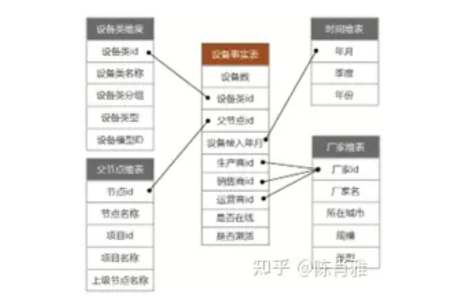

# 问题记录

# 待归档区

## 介绍

数据库建模有两种目的：面向事务，面向分析，对应的数据处理方式有两种OLTP（联机事务处理：On-Line Transaction Processing）、OLAP（联机分析处理：On-Line Analysis Processing）两种。

关系型数据库存储业务数据，支持日常事务运行，支持客户端的增删改查操作，这种对业务数据处理的应用称为OLTP。

如果需要从海量数据中的提取对企业分析决策有用的信息，需要将多个OLTP数据库的各类数据进行集成，再加工成方便决策分析的格式，这就是需要数据仓库的联机分析技术（OLAP），OLAP库中保存的数据就是我们常说的数仓。

数据分析的数据处理流程：

将业务库的原数据源进行**ETL开发**，转化成面向分析的数据（此过程称为**数据建模**，面向分析格式的数据叫做数据模型）。

ETL：Extract-Transform-Load。用来描述数据从来源端进行抽取（Extract）、转换（Transform）、加载（Load）至目标端的过程。ETL一词多见于数据

**数据分析**是数据模型中灵活选择度量、维度、通过聚合计算形成**分析指标**。这些指标可以通过表格、柱图、线图、饼图、地图等可视化组件将数据展示出来

## 数据模型

数据模型是用来为数据分析准备需要的维度、度量。它有以下几个方面的特点。

1.一般包含多个分析度量和维度。

2.分析度量之间的颗粒度是一致的。

3.可以通过不同度量与维度之间的排列组合，聚合形成多个分析指标。

4.除了分析要用的维度、度量字段。一般会去掉其他不相关的字段

数据模型通常有多维表、大宽表两种格式。

1.多维模型：

多维表一般是星型结构（雪花型暂不介绍），由一张事实表跟多张维表组成。

事实表包括一个或多个要分析的度量(计数情况可以不需要度量字段)，以及可以跟维表关联的外键；

每个维表中是一组表示这个度量维度的字段。维表的作用是，可以从多个角度全方面的对度量进行统计分析；

维表中的数据比较稳定，有些是码表或者数据字典，比如：时间、地理信息、性别、行业代码等。一张维表可在多张事实表中复用；

事实表一般源自于跟业务相关的表，会随着时间增量更新；

下图为设备数统计多维模型结构案例：

- 设备事实表中表示度量的字段是“设备数”，事实表中除了设备数外，其它都是表示维度的字段；
- 其中“设备类id”、“父节点id”、“设备接入年月”三个外键分别可跟“设备类维表”、“父节点维表”、“时间维表”建立关联； 
- 而“生产商id”、“销售商id”、“运营商id”可以都跟“厂家维表”关联；
- 是否在线”、“是否激活”两个维度因为没有其它层级维度，不需要专门建立一个维表，称为退化维；

2.大宽表

上述多维表是由多张表组成的，大宽表指的是将事实表跟维表关联后存为一张表。

跟多维表相比，大宽表具有以下特点：

- 因为维度跟度量存在一张表中，不需要跨表查询，所以会提高分析时的访问速度；
- 存在大量的数据冗余，不满足数据库3范式建模规范，属于以空间换时间的做法；

3.非标准模式

上面说的多维表、大宽表都是分析用数据模型的标准格式。但一些特殊情况下，一些轻量级的分析需求，不想建数仓，想直接连接业务库就能做快捷分析。

## 聚合计算

数据分析包括描述统计跟高级计算，描述统计指从各个维度出发对指标进行度量描述，比如不同时间。不同类别的XX个数统计、不同类别的XX个数统计、XX平均值统计。高级统计需要更深入的挖掘数量之间的关系规则，包括诊断性分析，预测性分析。暂时先关注描述统计。

> 高级统计如何做的？包含诊断性分析，预测性分析的产品的计数实现

描述统计中最核心的方法是**聚合计算**，聚合计算可以使表格**度量**的颗粒度变大。比如原有表格是一张订单明细表，每次订单发生便有**订单金额这一度量值**。但我们常用的分析需求是统计每天、每月或者每季度订单总金额。这就需要从时间的维度对度量进行聚合计算。比如统计每天的订单总额。需要对同一天的指标进行求和计算。

常见的聚合统计方式有：求和、求平均、计数、最小值

## 衍生度量

有些度量不能直接做聚合计算，需要通过其他度量聚合后再计算得到，我们将这些度量称为衍生度量。常见的衍生度量有平均值、转化率、占比等等。往往是其他指标聚合后再做除法得到。

## 概念定义

度量：指表格中表示数值的字段，比如：发生次数、金额、人数等等，一般表示度量的字段是数值型的。但也有字符串类型的，字符串型的度量只可以做”计数“聚合计算。

粒度：是指数据集市的数据单位中保存数据的详细程度和级别。需要查询的数据越详细，粒度需要划分越小，级别也就越低。查询数据的综合度也就越高，粒度划分越大，级别也就越高。

维度：维度是指用表格中用来对度量进行聚合分组的字段。比如时间、区域、类别等维度。维度决定了度量统计的单位的粒度，比如可以统计每天/每时的人流数，也可以是每个路口/园区的人数。维度字段一般是离散型的（字符串或粗粒度的时间型），表示维度的数值去重数一般不会很多。

指标：这里的指标是指带多个维度与度量的表格，可以选择部分度量、维度进行图标展示。这里的度量是指在模型的基础上做了聚合计算的字段。

数据模型：这里特质准备合适表结构为数据可视化做数据准备

可视化：将指标用图标的形式展示出来。

# 大数据技术栈

https://mp.weixin.qq.com/s?__biz=MjM5NTk0NjMwOQ==&mid=2651159826&idx=1&sn=0e08fbae9aa09cee63be8a28c6045dc3&chksm=bd0117388a769e2ec10ba51488fbf0fab82e394bff1687f3bf26dd5c080c4bc0857792c3c135&scene=27

https://baijiahao.baidu.com/s?id=1771303920574757324&wfr=spider&for=pc
