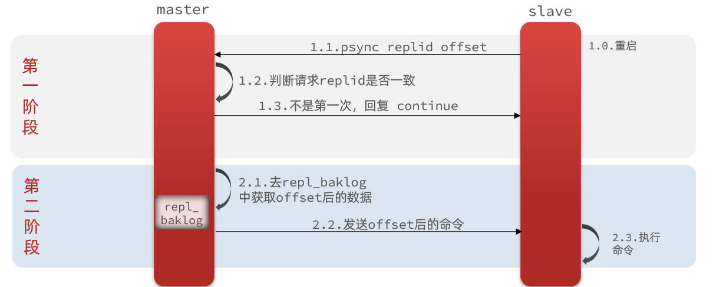
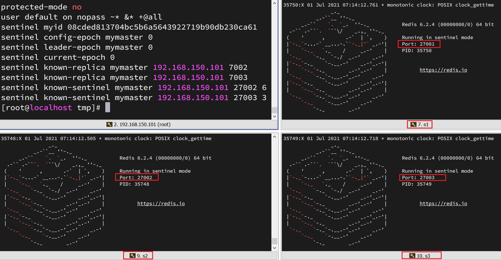
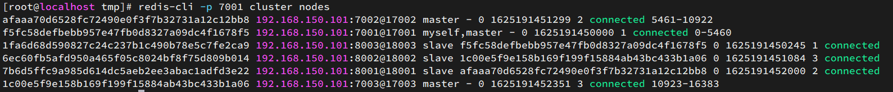
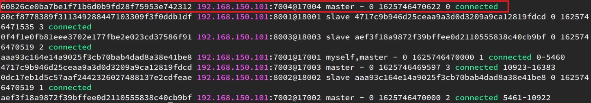
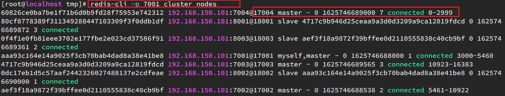

# 问题记录

1.1<font color='blue'>其他非关系型数据库总结</font>

1.2.历史版本整理，着重点：最新的几个版本，网络模型的转换

2.2配置参数

<font color='blue'>redis如何用作消息队列？？？？</font>

# 待归档区


# 1-概述

## 1.1-简介

Redis是一种非关系型数据（NoSQL=>Not Only SQL）不仅仅是SQL，关系型数据：如MySQL数据库【数据库中数据都保存在二维表中，表与表之间可以存在关联关系】，。

<font color='blue'>其他非关系型数据库总结</font>

Redis是一个基于内存的key-value结构的数据库，特点如下：

- 基于内存存储，读写性能高
- 适合存储热点数据（热点商品、咨询、新闻）
- 企业应用广泛

> 默认端口号：6379

> 图形化操作界面
>
> 外国：RedisDesktopManager工具 国内：AnotherRedisDesktopManager

## 1.2-历史版本

使用Redis是否比较容易升版本？项目中的Redis的版本是否容易切换？

大的版本更新统计？

https://baijiahao.baidu.com/s?id=1769542277677019166&wfr=spider&for=pc


## 1.3-业务规范

Redis key一定要设置过期时间，根据业务场景设置合理的过期时间

1. 可以在写入Key时追加过期时间
2. 对于某些业务确实需要长期有效的Key时，可以判断在即将到期时，从新设置有效期，避免引起热点key问题

redis有数据丢失的风险，程序在处理数据时，应该考虑丢失后的重新加载过程

1.4-键值设计规约

## 1.4-Redis键值设计规约

### 1.4.1-key的命名风格

建议使用的：

以英文字母开头，命名中只能出现小写字母、数字、和英文半角冒号`:`，可以用使用短横线`-`和或者下划线`_`或者句号`.`【<font color='blue'>存疑，不建议使用</font>】作为英文单词之间的分隔

禁止使用的：

空格、单引号`''`、双引号`""`：redis中的key通常被当做字符串进行处理和存储，而空格和引号在字符串中有特殊含义，可能导致解析和处理上的困惑或错误。

斜杠`/`反斜杠`\`：左斜杠可能会在某些情况下与redis命令或操作的用途相冲突。当使用Redis的一些高级功能如分片`sharding`或者集群`cluster`时，左斜杠可能被用作分隔符或特殊的约定。反斜杠`\`在许多编程语言中，或者shell命令中有特殊的转义含义，可能会导致在处理命令或编程代码时出问题。

半角逗号`,`：逗号在与其它工具或者系统进行交互时，某些应用程序、编程语言、工具可能会对逗号进行特殊处理，**如将逗号作为集合元素的分隔符**。

存疑的：

半角句号`.`：【<font color='blue'>存疑，一说可以用，用于结构化命名空间，功能与下划线类似。一说不能用，因为Redis命令中有的会用到，但是查询测试没有遇到这种情况。有案例时记得总结进来</font>】Redis的命令（HSET,HGET,<font color='blue'>HMSET</font>）用于操作哈希表时，其中键的字段之间使用`.`作为分隔，如果key中包含句号，可能会导致命令解析上的起义或错误。

### 1.4.1-key的命名规范

**业务模块名:业务逻辑含义:其它:value类型**

同一业务逻辑含义段的单词之间使用英文半角`.`，短横线`-`，下划线`_`分隔，用来表示完整语义

命名以key所代表的value类型结尾，提高可读性

```
user:basic.info:{userid}:string #此处示例使用.作为英文单词的分隔
```

### 1.4.1-Value设计规范

#### 拒绝bigkey

防止网卡流量被占用，慢查询

BigKey（大键）：指存储大量数据的键，一个键的值非常大，大键可能会对Redis数据库的性能和资源消耗产生一些负面影响。String类型控制在10KB之内，Hash、List、Set、ZSet元素不要超过5000【<font color='blue'>存疑，Redis的能力不只这么点吧？</font>】

#### ①常见的BigKey情况

1.存储大字符串，字符串大小大于几十M。

2.存储大列表和集合：当某个键的值是一个包含大量元素（如列表或者集合）的数据结构时。也可能会导致bigkey。通常发生在一次性将大量数据写入到一个Redis数据结构中。

#### ①BigKey解决方案

##### I-通用解决方案

1. 压缩数据（通用）：在用SpringDataRedis操作Redis时，选用效率最好的`Serializer`【<font color='blue'>总结对比，然后测试，对比大小，给出百分比，产出结论</font>】；
2. 更换中间件：ES或者MongoDB<font color='blue'>【总结业务场景】</font>

##### II-String类型

1. 转换结构：根据数据的特点和访问模式，可以将大键存储为其它的Redis数据结构，
2. 切分大键：将大键切分成小键，将大型数据切块成大小适当的数据块，使用多个String类型存储，使用`my_data:part1`，`my_data:part2`的键名存储。
3. 外部存储（超大内容），对于超过Redis存储能力的大型数据，考虑存储在外部存储系统中，如文件系统或分布式系统（<font color='blue'>Hadoop HDFS【了解，且去了解其竞品】</font>）Redis中只存储数据的引用或索引。

##### III-其它类型

1. 分页读取（List、Hash、SortedSet）：一次只读取部分数据，不是一次性读取整个bigkey。减少传输负担。

##### IV-需要存储大型的数据或文件

1. 切分为多个小型 String 类型值：将大型数据切分为适当大小的小块数据，并使用多个 String 类型值存储。例如，可以使用类似于 `my_data:part1`、`my_data:part2` 的键名来存储不同的部分。
2. 使用其他 Redis 数据类型：根据数据的特点和访问模式，考虑使用其他适当的 Redis 数据类型，如 Hash、List、Set 或 Sorted Set，来存储大型数据。这样可以更好地利用 Redis 的数据结构和功能。
3. 外部存储或分布式文件系统：对于超过 Redis 存储能力的大型数据，可以考虑存储在外部存储系统中，如文件系统或分布式文件系统（如 Hadoop HDFS）。然后，在 Redis 中只存储数据的引用或索引。

总结起来，尽量避免超过几十兆字节的大型 String 类型值的存储，可以考虑切分为多个小型值，使用其他 Redis 数据类型，或使用外部存储系统。根据实际需求权衡利弊，选择合适的方案来处理大型数据。


## 1.5-Redis的注意事项

1.一定要有KEY的过期时间，并且合理

2.避免大KEY，key的命名要保证可读性的同时尽可能的短。

3.有意识的控制Key数量，合理使用Redis提供的数结构

4.Redis虽然快，

keys命令，save命令生产环境不要用，多进程的，scan，或者rdb持久化时的bgsave命令，fork一个进行进行进行，来进行数据持久化。

删除大KEY时，不要用del方法，使用unlink方法（）

# 2-安装与配置


## 2.1-Linux安装

首先需要安装Redis所需要的依赖：

```sh
yum install -y gcc tcl
```

获取安装包，本文中采用的是`redis-6.2.4`安装包

上传到虚拟机的任意目录：

例如，放到了/tmp目录：

解压缩：

```sh
tar -xvf redis-6.2.4.tar.gz
```

解压后，进入redis目录：

```sh
cd redis-6.2.4
```

运行编译命令：

```sh
make && make install
```

如果没有出错，就安装成功了。

然后修改redis.conf文件中的一些配置：

```properties
# 绑定地址，默认是127.0.0.1，会导致只能在本地访问。修改为0.0.0.0则可以在任意IP访问
bind 0.0.0.0
# 数据库数量，设置为1
databases 1
```

启动Redis：

```sh
redis-server redis.conf
```

停止redis服务：

```sh
redis-cli shutdown
```

## 2.2-redis.conf配置参数

```properties
#侦听环回IPv4和IPv6
bind 0.0.0.0 -::1 
#配置Redis占用的端口，默认是6379。
port 6379
#TCP连接保活策略，可以通过tcp-keepalive配置项来进行设置，单位为秒，假如设置为60秒，则server端会每60秒向连接空闲的客户端发起一次ACK请求，以检查客户端是否已经挂掉，对于无响应的客户端则会关闭其连接。如果设置为0，则不会进行保活检测。
tcp-keepalive 60
```

哨兵模型配置

```properties
#端口
port 26379
#目录
dir /tmp
#日志文件
logfile /var/log/redis/redis-sentinel.log
#是否在后台执行，yes：后台运行；no：不是后台运行
daemonize yes
#是否开启保护模式，默认开启。开启后，只能根据配置的bind地址和密码进行访问。
protected-mode no
#以上两项通常用在NAT环境中明确指定哨兵的ip和端口，当提供明确的announce-ip时，sentinel会在HELLO消息里发布出来，而不是像通常那样自动检测本地ip，当提供明确的非零announce-port时，sentinel也会发布出来（以上两项不需要同时指定，如果只指定ip，则会发布指定的ip和由port项配置的端口，如果只指定port，则会发布指定的port和自动检测的ip）；
sentinel announce-ip <ip>
sentinel announce-port <port>
#主节点信息，格式：sentinel <master-name> <ip> <redis-port> <quorum>；
#<master-name> 自定义主节点名称；
#<ip> <redis-port> 主节点的ip和端口；
#<quorum> 多少个主节点检测到主节点有问题就进行故障转移
sentinel monitor mymaster 127.0.0.1 6379 2
#sentinel与master的心跳时间（毫秒），默认30秒。#修改为3S
sentinel down-after-milliseconds mymaster 30000
#故障转移时，最多可以有多少个slave同时对新的master进行数据同步，该值越小，完成故障转移的时间越长，但可用slave数量越多，该值越大，越多slave因为replication而不可用。建议设置为1。
sentinel parallel-syncs mymaster 1
#故障转移超时时间（毫秒），默认180秒。
sentinel failover-timeout mymaster 180000
#master和slaves密码。
#sentinel auth-pass mymaster password
#当sentinel有警告级别的事件发生时执行（也有的资料说failover时触发）的脚本。
sentinel notification-script <master-name> <script-path>

#故障转移之后执行的脚本，并传递7个参数：<master-name> <role> <state> <from-ip> <from-port> <to-ip> <to-port>。
#<master-name> 表示 master名字
#<role> 表示的是 每个redis实力的角色，如leader、observer
#<state> 表示状态
#<from-ip> 原来的redis master
#<from-port> 
#<to-ip> 故障迁移后的redis master
#<to-port>
sentinel client-reconfig-script <master-name> <script-path>
```

分片模式配置

```properties
port 6379
# 开启集群功能
cluster-enabled yes
# 集群的配置文件名称，不需要我们创建，由redis自己维护
cluster-config-file /tmp/6379/nodes.conf
# 节点心跳失败的超时时间
cluster-node-timeout 5000
# 持久化文件存放目录
dir /tmp/6379
# 绑定地址
bind 0.0.0.0
# 让redis后台运行
daemonize yes
# 注册的实例ip
replica-announce-ip 192.168.150.101
# 保护模式
protected-mode no
# 数据库数量
databases 1
# 日志
logfile /tmp/6379/run.log
```

## 2.3-springboot配置redis

https://blog.csdn.net/m0_63300795/article/details/131353320

在项目配置文件中配置redis的连接信息，IP、端口号、密码、使用数据库编号，<font color='blue'>lettuce??</font>

> SpringBoot2.x后RedisTemplate采用lettuce[ ˈletɪs]（基于Netty采用异步非阻塞式IO）进行通信，高并发环境下比jedis效率更高
>
> <font color='blue'>如何预热较好的预热？预热规则怎么设置符合业务场景？？？</font>

```yml
spring:
  redis:
    # Redis数据库索引（默认为0）
    database: 10
    # Redis服务器地址
    host: 127.0.0.1
    # Redis服务器连接端口
    port: 6379
    # 密码（默认为空）
    password: 1234
    # 连接超时时间 单位 ms（毫秒）
    timeout: 6000
    # 过期时间是30分钟30*60
    expire-time: 1800
    lettuce:
      pool:
        # 连接池最大连接数（使用负值表示没有限制） 默认 8，建议设置为CPU核数的两倍
        max-active: 8 #？？这个需要修改吧？？
        # 连接池最大阻塞等待时间（使用负值表示没有限制） 默认 -1
        max-wait: -1
        # 连接池中的最大空闲连接 默认 8，建议设置为CPU核数的两倍
        max-idle: 8
        # 连接池中的最小空闲连接 默认 0
        min-idle: 0
```

哨兵模型的选择节点

```yml
spring:
  redis:
    sentinel:
      master: mymaster
      nodes:
        - 192.168.150.101:27001
        - 192.168.150.101:27002
        - 192.168.150.101:27003
```

分片模式选择节点

```yml
spring:
  redis:
    cluster:
      nodes:
        - 192.168.150.101:7001
        - 192.168.150.101:7002
        - 192.168.150.101:7003
        - 192.168.150.101:8001
        - 192.168.150.101:8002
        - 192.168.150.101:8003
```

## 2.4-Redis的子库使用

<font color='blue'>redis的16个子库的设计原因，为什么不把桶的建立的权限交给开发者</font>

桶与桶之间是隔离的，订单和菜品放到不同的桶

默认操作是0号桶，通过SELECT选择桶

# 3-基础数据类型

## 3.1-String类型

### 3.1.1-类型简介

> 系统调用（用户态和内核态的转换）耗时，线程的上下文切换。

简单的KV类型，Value使用SDS（SimpleDynamicString）简单动态字符串这种抽象类型实现，

> SDS还是AOF模块中AOF缓冲区，集群中客户端状态的输入缓冲区。，网络传输中只会发送实际大小，而非Redis所适用的内部形式大小。

SDS的优势：Redis作为缓存中间件，用于速度要求严苛，数据被频繁修改的场合，数据被频繁修改则意味着频繁的内存重分配，系统调用，频繁的用户态到内核态的切换势必影响性能（redis的单线程模型的设计也有这方面的原型）【痛点：内存重分配关系到系统调用】

SDS的设计思想包含两个方面，内存预分配和惰性释放

SDS结构中是这样定义的：记录使用空间（len）和未使用空间（free）和真正存储字符数据的存储空间，buf字节数组

SDS实现了内存预分配。小于1MB时，如果此次修改字符串大小没有超过len+free，则使用预留空间，如果超过了len+free，计算新的内存占用作为len，预分配的空间free，整体扩容1倍，大于1MB时，都是1M的扩容。设计的初衷：减少执行字符串增长操作时内存重分配的次数。

惰性释放，如果SDS变小了，释放的多余空间记录到free，预留到将来使用，

SDS的设计思想：因数据被频繁修改，以内存空间为代价换取尽可能少的系统调用；

SDS的内存空间被真正释放，由Redis的内存管理器的垃圾收集机制完成的。

> Strlen：返回key所存储的字符串的长度

> 鉴于SDS的设计，Strlen返回字符串的时间复杂度是O(1)，但是谁没事用这个命令啊

### 3.1.2-操作命令

**set**：用于设置给定key的值，如果存在则覆盖旧值，<font color='blue'>【set key NX EX 有效期秒数】</font>

```
SET 键名 值# =>2.6.12之前，set命令总是返回OK，2.6.12之后，set命令在设置操作成功完成时，才返回OK
```

```
set key NX EX 有效期秒数
```

 **get** ：用于获取指定key的值

```
GET 键名 #=> 如果key不存在，返回Nil,正常则返回value值，如果该key是非String类型的，则返回错误
```

**incr**[increase] ，**decr**[decrease] 将key存储的数据+1或-1

> 搜索线程使用incr命令向同一个key累加1，得到累加后的结果，谁的结果小，谁胜出

```bash
INCR 键名 #=>如果键名不存在，先置该key的value值时为0，然后再执行INCR操作，如果值不能表示为数字，那么则返回一个错误
DECR 键名 #=>同上
#这两个操作都是限制在64位有符号数之内(2^63=9.22E+18),亿=1E+8,所以百亿亿级。
```

**incrBy,decrBy**：功能与上边类似，但是可以设置步长了

```bash
INCRBY 键名 步长
DECRBY 键名 步长
```

**setex**[set expire]：为指定的key设置值以及过期时间。

```bash
SETEX 键名 过期时间 值
```

**setnx**[set if Not exists]：该命令在指定的key不存在时，为key设置指定的值，成功设置则返回为1，否则失败，返回为0

```bash
SETNX 键名 值 =>成功为1，失败为0
```

**strlen**[String Length]：获取指定的key所存储的字符串值的长度

```bash
STRLEN 键名 =>返回字符串长度，Key不存在时，返回0
```

> 因为SDS的设计，所以这个命令的时间复杂度时O(1)

### 3.1.3-使用场景

### 3.1.4-BitMap命令

**setbit**：设置bitmap指定位置上的值

```bash
SET 键名 偏移量 
#设置指定偏移量上的位（偏移量从0开始）
```

**getbit**：获取指定偏移量的值

```bash
GETBIT 键名 偏移量
#得到指定偏移量上的位（bit）即0或1
```

**bitfield**：批量读取bitmap中的数据

```bash
BITFIELD 键名 GET 编码格式 偏移量
#编码格式：u表示无符号整数，i表示有符号整数，u2表示读取2个Bit的数据，u8表示读取8个Bit的数据
```

```bash
bitfield demo git u10 0
#从索引0开始读取10个Bit的数据
```

## 3.2-List类型

### 3.2.1-类型简介

应用场景：发布或者订阅对象

底层：双端链表+（压缩列表或紧凑列表）

3.2版本后，结合双端链表和压缩列表用于列表键底层实现，7.0版本后结合双端链表和紧凑列表用于列表键底层的实现。

双端链表

1. 特性：双端链表这种数据结构所有都具备的特性
2. 双端：listNode节点中带有prev和next指针，
3. 无环：表头节点的prev和表尾节点中next指针都指向Null
4. list结构中`*head`和`*tail`指针记录表头节点和表尾节点，len记录链表长度

> <adlist.h>中含有双端链表的相关声明，也用于其它需要链表的场景，例如保存连接的客户端，慢查询目录。
>
> <adlist.c>中有双端链表数据结构的具体实现
>
> <ziplist.c>压缩列表的实现，7.0后被listpack紧凑列表替代了
>
> <listpack.c>紧凑链表的实现

### 3.2.3-操作命令

**lpush,rpush**：左入，右入

```bash
LPUSH 键名 值1...值N 【空格作为分隔】 值N是第一个元素
RPUSH 键名 值1...值N 【空格作为分隔】 值1是第一个元素
#如果键名不存在则创建，如果键名存在但不是列表类型，则返回一个错误
```

**lpop,rpop**：左出，右出

```bash
LPOP 键名 =>移除并返回列表中第一个元素，当列表不存在时，则返回Nil
RPOP 键名 =>移除并返回列表中最后一个元素，当列表不存在时，则返回Nil
```

**llen**：返回列表的长度

```bash
LLEN 键名 
#键名不存在则创建，存在但类型不是列表类型，则返回一个错误
```

**lrange**：获取列表中指定范围内的元素

```bash
LRANGE 键名 开始索引 结束索引
#0表示列表中第一个元素，1表示第二个元素，以此类推
#-1表示列表中最后一个元素，-2表示列表中倒数第二个元素，以此类推
```

### 3.2.3-使用场景

<font color='blue'>作为队列使用？？？</font>

## 3.3-Hash类型

### 3.3.1-类型简介

特别适合存储对象

字典结构，每个字典结构带有两个Hash表，一个平时适用，一个rehash时使用

<font color='blue'>哈希算法，rehash</font>

### 3.3.2-操作命令

**hset**：用于给哈希表中的字段赋值

```bash
HSET 键名 字段名 值
#如果此字段是哈希表中的一个新建字段，并设置成功，则返回1
#如果哈希表中域字段已经存在，则旧值被新值覆盖，操作成功则返回0
```

**hget**：用于返回哈希表中指定字段的值

```bash
HGET 键名 字段名
#如果给定的字段或者Key不存在，则返回null
```

**hexists**：用于检查哈希表中指定字段是否存在

```bash
HEXISTS 键名 字段名
#存在则返回1，不存在则返回0
```

**hmset**：[multiple]用于同时将一个或多个（field-value）对设置进哈希表

```bash
HMEST 键名 字段1 值1 ...字段N 值N
#值不需要加双引号
```

**hmget**：用于返回一个或多个给定字段的值

```bash
HGET 键名 字段1 ... 字段N
#返回结果中，如果指定字段不存在则返回null，值的排列顺序和指定的字段顺序是一致的
```

**hgetall**：用户返回哈希表中，指定键名所有的字段和值

```bash
HGETALL 键名
#返回结果样式：字段1 值1 字段n 值n
```

**hkeys**：用于获取哈希表中所有的字段名

```bash
HKEYS 键名 
#返回所有字段名
```

**hvals**：用于获取哈希表中所有字段的值

```bash
HVALS 键名
#返回所有字段的值
```

### 3.3.3-使用场景


## 3.4-Set类型

### 3.4.1-类型简介


### 3.4.2-操作命令

**sadd**：用于将一个或者多个成员元素放入集合，已经存在的成员元素将被忽略

```bash
SADD 键名 成员1 ... 成员n
#返回被成功添加进集合的新元素数量
```

**srem**：移除集合中一个或多个成员元素，不存在的成员元素会被忽略

```bash
SREM 键名 成员1 ...成员n
```

**spop**：用于移除并返回集合中一个或多个元素

```bash
SPOP 键名 [弹出数量，默认为1]
返回被移除的随机元素
```

**scard**：返回集合中元素的数量

```bash
SCARD 键名
#返回集合中成员的数量
```

**smembers**：返回集合中所有的成员

```bash
SMEMBERS 键名 
#返回集合中所有成员
```

**sismember**：判断成员元素是否是集合的成员

```bash
SISMEMBER 键名 值
#如果是集合的成员，则返回1，如果不是集合的成员，或者key不存在，则返回0
```

**sunion**：返回给定集合的并集元素列表

```bash
SUNION 键名1 键名2...键名n
#返回取并集后的所有元素
```

**sunionstore**：[set union store]将给定集合求并集后放入指定集合destination，如果destination已经存在，则将其覆盖。

```bash
SUNIONSTORE 目标键名 源键名1 [源键名n ...]
#返回取并集后结果集中的元素数量
```

**sinter**：返回给定集合的取交集后的元素列表，如果给定集合中包含一个空集，结果必定为空

```bash
SINTER 键名1 键名2...键名n
#返回取交集后的所有元素
```

**sinterstore**：[set inter store]将给定集合求交集后放入指定集合destination，如果destination已经存在，则将其覆盖。

```bash
SINTERSTORE 目标键名 源键名1 [... 源键名n]
#返回取交集后结果集中的元素数量
```

**sdiff**：[different]返回第一个集合与其它集合的差异，也可以认为第一个集合中特有的元素，不存在的key被认为空集

```bash
SDIFF 键名1 ...键名n
#返回键名1中所特有的元素
key1 = {a,b,c,d}
key2 = {c}
key3 = {a,c,e}
SDIFF key1 key2 key3 = {b,d}
```

**sdiffstore**：将给定集合之间取差集后放入指定集合destination，如果destination已经存在，则将其覆盖。

```bash
SDIFFSTORE 目标键名 源键名1 [... 源键名n]
#返回结果集中的元素数量
```

### 3.4.3-使用场景


## 3.5-Zset类型

### 3.5.1-类型简介

使用了跳跃表+字典结构实现，保留两种数据结构的优点

跳表（skiplist）：一处用于实现有序集合键，一处被用于集群节点中用作内部数据结构。

> <zskiplist>：
>
> len：节点数量（表头节点不计算在内）
>
> level：记录目前跳跃表中，层数最大的节点的层数。（表头节点不计算在内）
>
> header：表头节点指针
>
> tail：表尾节点指针
>
> <zskiplistNode>

### 3.5.2-操作命令

**zadd**：将一个或多个成员元素以及分值加入有序集合当中【注意分数在前】

```bash
ZADD 键名 分数1 成员1 ... 分数n 成员n
#如果某个成员已经是有序集合的成员，那么更新这个成员的分值，并通过重新插入这个成员元素，来保证他在正确的位置上
```

**zrem**：移除成员，可批量

```bash
ZREM 键名 成员1 ...成员n
#返回被成功移除的成员的数量，不包括被忽略的成员
```

**zcard**：查看有序集合中元素的数量

```bash
ZCARD 键名
#返回有序集合中成员有多少个
```

**zscore**：查看指定成员的分值

```bash
ZSCORE 键名 成员
#返回成员的分值
```

**zincrby**：给指定成员增加分值

```bash
ZINCRBY 键名 增量 成员
#给指定成员增加指定分值
```

<font color='red'>默认序，分值从小到大，小====>大，排名以0为底，与数组索引一样。最小的排名=0</font>

**zrank**：返回有序集合中指定成员的排名（由小到大）

```bash
ZRANK 键名 成员
#返回指定成员的排名，最小的排名为0
```

**zrange**：返回有序集合中，指定区间内的成员，成员分值由小到大

```bash
ZRANGE 键名 开始索引 结束索引 [WITHSCORES]
#0代表第一个成员，1代表第二个成员
#-1代表倒数第一个成员，-2代表倒数第二个成员以此类推
```

```bash
ZRANGE salary 0 200000 WITHSCORES         # 测试 end 下标超出最大下标时的情况
1) "jack"
2) "3500"
3) "tom"
4) "5000"
5) "boss"
6) "10086"
```

**zrangebyscore**：返回指定分数区间的成员列表，默认使用闭区间    

```bash
ZRANGEBYSCORE 键名 分数1 分数2  
#返回符合条件【分数1】<=score<=【分数2】的成员
```

```bash
ZRANGEBYSCORE 键名 (分数1 (分数2    
#返回符合条件【分数1】<score<【分数2】的成员
```

**zrevrank，revrange，zrevrangebyscore与之相似，排序反转**

### 3.5.3-使用场景

排行榜

# 4-进阶数据类型

## 4.1-概率过滤器

布隆过滤器与布谷鸟过滤器

概率过滤器是一种快速的、节省空间的数据结构，是一种常见的数据结构，就是否存在的问题，检索一个元素是否在一个集合中”称为“集合隶属测试”；存在假阳性率的“集合隶属测试”称为“近似集合隶属测试”。

而在概率过滤器中比较优秀的两个实现一个是布隆过滤器，另一个是布谷鸟过滤器。

### 4.1.1-布隆过滤器与布谷鸟过滤器对比

> 布谷过滤器用于交易防重复

从添加、查询、删除、空间大小几个方面阐述为什么基于布谷鸟过滤器实现交易过滤器。

**添加**

布谷鸟随着接近负载因子容量，效率会曲线下降，而布隆过滤器效率是恒定的，这点布隆过滤器优于布谷鸟过滤器，但是我们在实际使用中使我们要**存的项的数量控制在负载因子**以下即可减少假阳性的概率。

**查询**

交易防重主要依赖查询方法来检查过滤器中项是否存在；布谷鸟过滤器的时间复杂度是O(1)，而布隆过滤器是O(k)，k = 布隆过滤器的哈希数量，布谷鸟过滤器查询方法的时间复杂度优于布隆过滤器。

**删除**

布谷鸟过滤器中支持删除操作，而布隆过滤器不支持。

**空间大小**

在实际测试中200w的项的数量实测相比布隆过滤器空间占用减少24%。

**总结**

基于如下表格对比，布谷鸟过滤器作为交易防重组件的基础实现。

|          | Cuckoo Filter                                       | StandardBloom Filter |
| -------- | --------------------------------------------------- | -------------------- |
| 添加     | 添加效率为O(1) 随着接近负载因子容量，效率会不断降低 | 固定效率 O(k)        |
| 查询     | O(1) 固定检查两个桶                                 | O(k)                 |
| 删除     | O(1) 最多检查两个桶                                 | 不支持               |
| 空间大小 | 论文提到空间大小相比布隆过滤器减少40%，实测24%左右  | 1                    |


### 4.1.2-布隆过滤器详解

布隆过滤器(*Bloom Filter* )大概的思路就是，当你请求的信息来的时候，先检查一下查询的数据我这有没有，有的话将请求压给数据库，没有的话直接返回，是如何做到的呢?


如图，一个bitmap用于记录，bitmap原始数值全都是0，当一个数据存进来的时候，用三个Hash函数分别计算三次Hash值，并且将bitmap对应的位置设置为1，上图中，bitmap 的1，3，6位置被标记为1，这时候如果一个数据请求过来，依然用之前的三个Hash函数计算Hash值，如果是同一个数据的话，势必依旧是映射到1，3，6位，那么就可以判断这个数据之前存储过，如果新的数据映射的三个位置，有一个匹配不上，假如映射到1，3，7位，由于7位是0，也就是这个数据之前并没有加入进数据库，所以直接返回。

布隆过滤器存在一些问题：

**1.误判**


**2.不支持删除**

### 4.1.3-布谷鸟哈希

最简单的布谷鸟哈希结构是一维数组结构，会有两个 hash 算法将新来的元素映射到数组的两个位置。如果两个位置中有一个位置为空，那么就可以将元素直接放进去。但是如果这两个位置都满了，它就不得不「鸠占鹊巢」，随机踢走一个，然后自己霸占了这个位置。

**1. 保存元素 （位置都没有被占）**

新来的元素a经过hash会落在（A2，B1）的位置，由于A2还没有元素，a直接落入A2


**2. 保存元素 （其中一个位置被占）**

新插入元素b的hash会落在(A2,B3),由于A2已经被a占了，所以b会落在b3


**3. 保存元素 （两个位置都被占）**

新来元素c的hash为(A2,B3), 由于两个位置都已经被占，它会随机将一个元素挤走，这里挤走了a 


**4. 被挤掉的元素重新找位置**

a会重新进行hash，找到还未被占的B1位置


从上面可以看出，布谷鸟哈希算法会帮这些受害者（被挤走的蛋）寻找其它的窝。因为每一个元素都可以放在两个位置，只要任意一个有空位置，就可以塞进去。所以这个伤心的被挤走的蛋会看看自己的另一个位置有没有空，如果空了，自己挪过去也就皆大欢喜了。但是如果这个位置也被别人占了呢？好，那么它也会再来一次「鸠占鹊巢」，把别人赶走。然后这个新的受害者还会重复这个过程直到所有的蛋都找到了自己的巢为止。

**问题**

如果数组太拥挤了，连续踢来踢去几百次还没有停下来，这时候会严重影响插入效率。这时候布谷鸟哈希会设置一个阈值，当连续占巢行为超出了某个阈值，就认为这个数组已经几乎满了。这时候就需要对它进行扩容，重新放置所有元素。

还会有另一个问题，那就是可能会存在挤兑循环。比如两个不同的元素，hash 之后的两个位置正好相同，这时候它们一人一个位置没有问题。但是这时候来了第三个元素，它 hash 之后的位置也和它们一样，很明显，这时候会出现挤兑的循环。不过让三个不同的元素经过两次 hash 后位置还一样，这样的概率并不是很高，除非你的 hash 算法太挫了。

出现挤兑循环时，布谷鸟过滤器认为数组太拥挤了，会进行扩容，重新计算每个指纹的位置。

### 4.1.4-布谷鸟过滤器

**原理简介**

布谷鸟过滤器由一个数组组成，**数组中每个元素大小为4个字节**【一个指纹一个字节】，可以存储4个指纹，每个指纹占一个字节(2^8 = 256种)。这样有以下两个好处：

- 避免出现hash后的位置一致而导致的循环挤兑的情况。
  - 这样即使两个元素被 hash 在了同一个位置，也不必立即「鸠占鹊巢」，因为这里有4个座位，你可以随意坐一个。除非这多个座位都被占了，才需要进行挤兑。这会显著降低挤兑次数。
- 同一个位置上的多个座位在内存空间上是连续的，可以有效利用 CPU 高速缓存。

**原理详述**

> 数组4字节，每个字节存一个指纹，如果冲突，能够提供独特hash运算，根据指纹信息和原位置去计算得到新位置

布谷鸟过滤器和布谷鸟哈希结构一样，它也是一维数组，但是不同于布谷鸟哈希的是，布谷鸟哈希会存储整个元素，而布谷鸟过滤器中只会存储元素的指纹信息（几个bit，类似于布隆过滤器），过滤器牺牲了数据的精确性换取了空间效率。

布谷鸟过滤器还是只会选用两个 hash 函数，但是每个位置可以放置多个座位。这两个 hash 函数选择的比较特殊，因为过滤器中只能存储指纹信息。当这个位置上的指纹被挤兑之后，它需要计算出另一个对偶位置，计算这个对偶位置是需要元素本身的。

**哈希位置计算公式：**

```
fp = fingerprint(x)
p1 = hash1(x) % l
p2 = hash2(x) % l
```

 知道了 p1 和 x 的指纹，原则上是没办法直接计算出 p2 的。

布谷鸟过滤器有一个**独特的 hash 函数**，可以根据 p1 和 元素指纹 直接计算出 p2，而不需要完整的 x 元素。

> 这个hash函数可以非常有效的寻找对偶的位置

```
fp = fingerprint(x)
p1 = hash(x)
p2 = p1 ^ hash(fp)  // 异或
```

从上面的公式中可以看出，知道 fp 和 p1，可以算出 p2。同样如果我们知道 p2 和 fp，也可以直接算出 p1 —— **对偶性**。 

```
p1 = p2 ^ hash(fp)
```

所以不需要知道当前的位置是 p1 还是 p2，只需要将当前的位置和 hash(fp) 进行异或计算就可以得到对偶位置。只需要确保 hash(fp) != 0 就可以确保 p1 != p2，就不会出现自己踢自己导致死循环的问题。

为什么这里的 hash 函数不需要对数组的长度取模呢？实际上是需要的，但是布谷鸟过滤器强制数组的长度必须是 2 的指数，所以对数组的长度取模等价于取 hash 值的最后 n 位。在进行异或运算时，忽略掉低 n 位 之外的其它位就行。将计算出来的位置 p 保留低 n 位就是最终的对偶位置。

**插入**

初始化一个给定容量的过滤器Filter，这个容量数为**2的n次方**【便于后续找寻对偶的位置】，如果不为2的n次方，内部会通将其转化为2的n次方。

先进行一次hash，得出应当插入位置和应当插入的值。如果这个这个位置（bucket内的4个位置均被占用）插入失败，会进行第二次hash，查看第二个位置能否插入。若第二个位置插入失败，则会随机在两个位置挑选一个将其中的一个值标记为旧值，用新值覆盖旧值，旧值会在重复上面的步骤进行插入。

会对插入的值进行校验，只有当未插入过该值时才会插入成功，若过滤器中已经存在该值，会插入失败返回false。

**扩容**

如果数组过小，会发生循环挤兑的情况，如果超过最大挤兑次数，进行扩容，重新计算每个指纹的位置。

**查找**

用两个hash函数计算，将计算结果与两个元素中的8个位置的指纹进行对比，如果对比成功则表示数据存在。先进行一次hash查询数据，若没有该值会进行第二次hash进行查询，若还是没有会返回false。

**删除**

通过两次hash找到索引位置，若有该数据，将该位置数据删除。因为每个对象的指纹会存储到一个位置中，所以可以通过删除这个指纹来删除数据。

删除功能无法使用的情况：如果相同对象存储超过8个，就无法使用删除功能；如果俩数据的哈希值和指纹相同时，会出现误删除情况。

**代码实现**

Redis布谷鸟过滤器：https://github.com/kristoff-it/redis-cuckoofilter

Redis通过插件支持sql及布谷鸟过滤器：https://github.com/RedBeardLab/rediSQL

### 4.1.5-布谷过滤器实战

> 特性以及使用场景，量超大【省存储空间】，要求超快查重，循环淘汰
>
> 即数据更新巨快的场景
>
> ## 新闻推荐去重
>
> ## 邮件黑名单&网站黑名单
>
> ## 网页爬虫URL去重

布谷鸟交易过滤器是基于布谷鸟过滤器添加**时间规则、分片**、快照等功能完美符合长安链的交易防重场景。

**纳秒级交易查重**

通过时间ID规则，交易过滤器中只保留了最近一批交易，排除时间范围之外的交易，范围内的交易也可以通过分组时间区间快速路由到某个布谷鸟中查重。

**优化到极致的内存占用**

基于布谷哈希一亿笔交易占用550M空间，如果直接保存一亿交易ID约需要6G空间，存储效率提升89%。

**分片加速并行处理能力**

每个分片包含多组布谷鸟过滤器，通过分片算法将交易均匀并且快速的分配到每一组，让每组布谷鸟交易过滤器都可以同时处理交易。

**数据安全不丢失**

根据区块高度间隔或者时间间隔保存当前交易过滤器快照功能让节点随停随起不丢数据。

交易过滤器预热，如果节点有历史数据，但是没有快照，交易过滤器初始化时预热节点区块数据，保证交易过滤器中的交易和节点已有数据一致。

**LRU循环淘汰策略**

交易过滤器中一组交易过滤器内部会利用LRU循环淘汰策略将最旧的布谷鸟过滤器淘汰调并创建一个新的布谷鸟过滤器，让交易过滤器中永远保存最近一批交易。

## Hyperloglog

- Hyperloglog是一种用来估计基数的算法，它可以用少量的内存来统计大量不重复元素的个数，适用于诸如UV统计、在线用户数等场景

## GEO

- GEO是一种用来存储地理坐标和计算距离的数据类型，它可以用来实现附近的人、地点等功能

## Bitmap

- Bitmap是一种用一个bit位来表示某个元素对应的值或状态的数据类型，它可以用来实现用户在线状态、签到功能等

## Bitfield

- Bitfield是一种用来对字符串中的位进行操作的命令，它可以用来实现计数器、布隆过滤器等功能

<font color='blue'>计数器，布隆过滤器</font>

# 5-通用命令详解

## 5.1-通用命令

**EXISTS KEY** =>判断指定名称KEY是否存在，返回：存在1，不存在0

```bash
EXISTS USER_INFO_HASH #结果：1
EXISTS USER_INFO_HASH1 #结果：0
```

**TYPE KYE** =>判断指定KEY对应的VALUE的数据类型，如果没有，返回null/nil

```bash
TYPE USER_INFO_HASH #结果：hash
TYPE STUDENT #结果：zset
```

**KEY PATTERN** =>基于匹配模板匹配所有的KEY名称并返回所有满足要求的KEY，

> **SCAN PATTERN**
>
> <font color='blue'>scan的工作原理</font>

```bash
KEYS USER* #结果：USER_INFO_HASH USERNAME USER_AGE_LIST 三个结果
```

> KEY的命名按规则命名

<font color='red'>KEYS *别乱用，redis是单线程的，所有操作都由一个线程完成，如果KEY很多，会阻塞其他的操作</font>

与之类似的有SMEMBERS=>SSCAN<font color='blue'>这个取出来会重复吗</font>

**EXPIRE KEY** 设置过期时间

**DEL KEY** =>删除指定的KEY和对应的VALUE <font color='red'>直接删除</font>

> **UNLINK KEY**

<font color='blue'>UNLINK的工作原理</font>

```bash
DEL QQ_55_FRIEND #结果：0 因为这个KEY不存在
DEL QQ_5555_FRIEND #结果：1
```

**save** 

<font color='blue'>bgsave</font>

## 5.2-命令中转义符

1.如果存入的值包含空格，使用双引号，单引号进行包裹

2.如果要存储字符串 `My"w'ord`，你可以使用双引号或单引号来包裹字符串：

使用双引号包裹字符串：

```
SET mykey "My\"w'ord"
```

使用单引号包裹字符串：

```
SET mykey 'My"w\'ord'
```

以上两种方式都可以将包含单引号和双引号的字符串存储在 Redis 中。如果在双引号内部使用双引号，你需要使用转义字符 `\"` 来表示双引号的字面量。同样地，在单引号内部使用单引号，你需要使用转义字符 `\'` 来表示单引号的字面量。

# 6-Spring Data Redis

## 6.1-Java客户端简介

Redis常用命令，是操作Redis的基础，在Java程序中操作Redis，需要使用Redis的客户端，如同使用JDBC操作MySQL数据库一样。

Redis的Java客户端

- jedis java for redis 里边的方法和Redis的命令一样的（redis官方推荐的）
- lettuce（<font color='blue'>这貌似是一个工厂？？？</font>）

- spring Data Redis 基于jedis又做了一层封装，spring官方推出的一个操作redis的

## 6.2-Spring Data Redis简介

Spring Data Redis是Spring的一部分，提供了在应用中通过简单的配置就可以访问Redis服务，对Redis底层开发包进行了高度封装。在Spring项目中，可以使用SpringDataRedis来简化Redis操作。

网址：https://spring.io/projects/spring-data-redis

1.SpringDataRedis中提供了一个高度封装的类**RedisTemplate**，对Redis的相关Api进行了归类封装，将同一类型操作封装为operation接口，具体分类如下：

- ValueOperations：String数据类型操作

- SetOperations：set类型数据操作

- ZSetOperations：zset类型操作；

- HashOperations：hash类型的数据操作

- ListOperations：list类型的数据操作

2.SpringBoot2.x后RedisTemplate采用lettuce（基于Netty采用异步非阻塞式IO）进行通信，高并发环境下比jedis效率更高，。

3.RedisTemplate模板使用序列化器操作Redis数据。

| **序列化器**                       | **说明**                                                     | 评价                                                   |
| ---------------------------------- | ------------------------------------------------------------ | ------------------------------------------------------ |
| JdkSerializationRedisSerializer    | POJO对象的存取场景，使用JDK本身序列化机制，将pojo类通过ObjectInputstream/ObjectOutputstream进行序列化操作，最终redis-server中将存储字节序列。是默认的序列化策略。 | 生成16进制字符不易阅读，线上通过KEY去查询VALUE不方便， |
| stringRedisSerializer              | Key或者value为字符串的场景，根据指定的charset对数据的字节序列编码成string,是"new String(bytes,charset)"和 “string.getBytes(charset)"的直接封装。是最轻量级和高效的策略。 | 建议使用                                               |
| GenericJackson2JsonRedisSerializer | jackson-json工具提供了javabean与json之间的转换能力，可以将pojo实例序列化成json格式存储在redis中，也可以将json格式的数据转换成pojo实例。【在json中有一个@class属性】 | 带有@class属性的Json字符串占用变大，实际项目中一般不用 |
| OxmSerializer                      | 使用 Spring OXM 实现将对象和 String 的转换，从而 String 和二进制数组的转换 | 一般不用                                               |

4.提供了对key的“bound”(绑定)便捷化操作API，可以通过bound封装指定的key，然后进行一系列的操作而无须“显式”的再次指定Key，即BoundKeyOperations：

- BoundValueOperations
- BoundSetOperations
- BoundListOperations
- BoundSetOperations
- BoundHashOperations

5.对事务操作封装，有容器控制

## 6.3-使用过程

### 6.3.1导入依赖

```xml
<dependency>
     <groupId>org.springframework.boot</groupId>
     <artifactId>spring-boot-starter-data-redis</artifactId>
</dependency>
```

### 6.3.2-配置redis数据源

```yml
spring:
  redis:
    host: 
    port: 
    password:
    database: 
```

### 6.3.3-配置redisTemplate

​	依据配置文件，会自动根据配置文件中的内容创建RedisConnectionFactory并且注入到容器中，

```java
@Configuration
@Slf4j
public class RedisConfiguration {

    @Bean
    public RedisTemplate redisTemplate(RedisConnectionFactory redisConnectionFactory){
        log.info("开始创建redis模板对象...");
        RedisTemplate redisTemplate = new RedisTemplate();
        //设置redis的连接工厂对象
        redisTemplate.setConnectionFactory(redisConnectionFactory);
        //设置redis key的序列化器
        redisTemplate.setKeySerializer(new StringRedisSerializer());
        return redisTemplate;
    }
}
```

### 6.2.4-使用RedisTemplate

```java
@Resource
private RedisTemplate redisTemplate;
```

 默认的序列化器有前提要求。不能用字符串来操作，<font color='blue'>默认序列化器会对key进行修改，测试</font>

存字符串的功能，是valueOpreation的功能进行转码的，

# 7-Spring Cache

## 7.1-Spring Cache介绍

Spring Cache 是一个框架，实现了基于注解的缓存功能，只需要简单地加一个注解，就能实现缓存功能。

Spring Cache 提供了一层抽象，底层可以切换不同的缓存实现，例如：

- EHCache<font color='blue'>？？？</font>
- Caffeine【java自带的】
- Redis(常用)

**起步依赖：**

```xml
<dependency>
	<groupId>org.springframework.boot</groupId>
	<artifactId>spring-boot-starter-cache</artifactId>  		            		       	 <version>2.7.3</version> 
</dependency>
```

## 7.2-常用注解

在SpringCache中提供了很多缓存操作的注解，常见的是以下的几个：

| **注解**       | **说明**                                                     |
| -------------- | ------------------------------------------------------------ |
| @EnableCaching | 开启缓存注解功能，通常加在启动类上                           |
| @Cacheable     | 在方法执行前先查询缓存中是否有数据，如果有数据，则直接返回缓存数据；如果没有缓存数据，调用方法并将方法返回值放到缓存中 |
| @CachePut      | 将方法的返回值放到缓存中                                     |
| @CacheEvict    | 将一条或多条数据从缓存中删除                                 |

在spring boot项目中，使用缓存技术只需在项目中导入相关缓存技术的依赖包，并在启动类上使用@EnableCaching开启缓存支持即可。

例如，使用Redis作为缓存技术，只需要导入Spring data Redis的maven坐标即可。

## 7.3-快速入门

### 7.3.1-@EnableCaching

```java
import lombok.extern.slf4j.Slf4j;
import org.springframework.boot.SpringApplication;
import org.springframework.boot.autoconfigure.SpringBootApplication;
import org.springframework.cache.annotation.EnableCaching;

@Slf4j
@SpringBootApplication
@EnableCaching//开启缓存注解功能
public class CacheDemoApplication {
    public static void main(String[] args) {
        SpringApplication.run(CacheDemoApplication.class,args);
        log.info("项目启动成功...");
    }
}
```

### 7.3.2-@CachePut注解

​	作用: 将方法返回值，放入缓存

​	value: 缓存的名称, 每个缓存名称下面可以有很多key

​	key: 缓存的key  ----------> 支持Spring的表达式语言SPEL语法

**在save方法上加注解@CachePut**

当前UserController的save方法是用来保存用户信息的，我们希望在该用户信息保存到数据库的同时，也往缓存中缓存一份数据，我们可以在save方法上加上注解 @CachePut，用法如下：

```java
/**
	* CachePut：将方法返回值放入缓存
	* value：缓存的名称，每个缓存名称下面可以有多个key
	* key：缓存的key
	*/
@PostMapping
@CachePut(value = "userCache", key = "#user.id")//key的生成：userCache::1
public User save(@RequestBody User user){
    userMapper.insert(user);
    return user;
}
```

**说明：**key的写法如下

#user.id : #user指的是方法形参的名称, id指的是user的id属性 , 也就是使用user的id属性作为key ;

#result.id : #result代表方法返回值，该表达式 代表以返回对象的id属性作为key ；

#p0.id：#p0指的是方法中的第一个参数，id指的是第一个参数的id属性,也就是使用第一个参数的id属性作为key ;

#a0.id：#a0指的是方法中的第一个参数，id指的是第一个参数的id属性,也就是使用第一个参数的id属性作为key ;

#root.args[0].id:#root.args[0]指的是方法中的第一个参数，id指的是第一个参数的id属性,也就是使用第一个参数

的id属性作为key ;

### 7.3.3-@Cacheable注解

​	作用: 在方法执行前，spring先查看缓存中是否有数据，如果有数据，则直接返回缓存数据；若没有数据，调用方法并将方法返回值放到缓存中

​	value: 缓存的名称，每个缓存名称下面可以有多个key

​	key: 缓存的key  ----------> 支持Spring的表达式语言SPEL语法

 **在getById上加注解@Cacheable**

```java
	/**
	* Cacheable：在方法执行前spring先查看缓存中是否有数据，如果有数据，则直接返回缓存数据；若没有数据，	  *调用方法并将方法返回值放到缓存中
	* value：缓存的名称，每个缓存名称下面可以有多个key
	* key：缓存的key
	*/
	@GetMapping
    @Cacheable(cacheNames = "userCache",key="#id")
    public User getById(Long id){
        User user = userMapper.getById(id);
        return user;
    }
```


**4). @CacheEvict注解**

**@CacheEvict 说明：** 

​	作用: 清理指定缓存

​	value: 缓存的名称，每个缓存名称下面可以有多个key

​	key: 缓存的key  ----------> 支持Spring的表达式语言SPEL语法

### 7.3.4-@CacheEvict

```java
	@DeleteMapping
    @CacheEvict(cacheNames = "userCache",key = "#id")//删除某个key对应的缓存数据
    public void deleteById(Long id){
        userMapper.deleteById(id);
    }

	@DeleteMapping("/delAll")
    @CacheEvict(cacheNames = "userCache",allEntries = true)//删除userCache下所有的缓存数据
    public void deleteAll(){
        userMapper.deleteAll();
    }
```

## 7.4-使用过程

1). 导入Spring Cache和Redis相关maven坐标

2). 在启动类上加入@EnableCaching注解，开启缓存注解功能

3). 在用户端接口SetmealController的 list 方法上加入@Cacheable注解

4). 在管理端接口SetmealController的 save、delete、update、startOrStop等方法上加入CacheEvict注解

# 8-持久化

Redis有两种持久化方案：

- RDB持久化
- AOF持久化
- 方案选择：RDB+AOF每秒刷盘

## 8.1-RDB持久化

RDB全称**Redis Database Backup file**（Redis数据备份文件），也被叫做Redis数据快照。简单来说就是把内存中的所有数据都记录到磁盘中。当Redis实例故障重启后，从磁盘读取快照文件，恢复数据。快照文件称为RDB文件，默认是保存在当前运行目录。

RDB的缺点

- RDB执行间隔时间长，两次RDB之间写入数据有丢失的风险
- fork子进程、压缩、写出RDB文件都比较耗时

### 8.1.1-执行时机

RDB持久化在四种情况下会执行：

- 执行save命令
- 执行bgsave命令
- Redis停机时
- 触发RDB条件时
- 执行flushall命令时【清除数据库所有数据】
- 执行复制时【设置主从模式，redis会在复制初始化时自动快照】

#### ①-save命令

执行下面的命令，可以立即执行一次RDB：


save命令会导致主进程执行RDB，这个过程中其它所有命令都会被阻塞。只有在数据迁移时可能用到。

#### ②-bgsave命令

下面的命令可以异步执行RDB：


这个命令执行后会开启独立进程完成RDB，主进程可以持续处理用户请求，不受影响。

> 执行`bgsave`后，redis会立刻返回OK表示执行快照操作，如果想知道快照是否完成，可以通过`lastsave`命令获取最近一次成功执行快照的时间，返回一个Unix时间戳。

> `BGSAVE`命令会导致停顿，真实硬件、VMware虚拟机或者KVM虚拟机，Redis每占用一个GB内存，创建该进程的子进程就要增加10-20毫秒；对于Xen虚拟机来说，Redis进程每占用一个GB内存，创建该进程的子进程所需时间就要增加200-300毫秒。
>
> Redis占用内存20G为例，标准硬件之上，BGSAVE会停顿200-400毫秒，Xen虚拟机上会停顿4-6秒
>
> Redis进程占用50G，Xen虚拟机上，BGSAVE创建子进程15秒以上，生成快照需要花费15-20分钟，使用SAVE命令仅需3-5分钟，所以可以在某个时间（业务空闲期）使用SAVE命令

#### ③-停机时

Redis通过`SHUTDOWN`命令接收到关闭服务器的请求，或者接收到标准`TERM`信号时，会执行一个`SAVE`命令，阻塞所有客户端，不再执行客户端发送的任何命令。并再`SAVE`命令执行完毕之后关闭服务器。

#### ④-触发RDB条件

Redis内部有触发RDB的机制，可以在redis.conf文件中找到，格式如下：

```properties
# 900秒内，如果至少有1个key被修改，则执行bgsave ， 如果是save "" 则表示禁用RDB
save 900 1  
save 300 10  
save 60 10000 
```

### 8.1.2-RDB原理（写时复制）

bgsave开始时会fork主进程得到子进程，子进程共享主进程的内存数据。完成fork后读取内存数据并写入 RDB 文件。

fork采用的是**copy-on-write**技术：

- 当父进程执行读操作时，访问共享内存；
- 当父进程更改某片数据（如执行写命名），OS会将该片数据复制一份以保子进程数据不受影响。


RDB快照期间不会修改RDB文件，只有在快照结束后才会将旧的文件替换成新的，也就是说RDB文件在任何时候都是完整的。

### 8.1.3-RDB配置

```properties
# 900秒内，如果至少有1个key被修改，则执行bgsave ， 如果是save "" 则表示禁用RDB
save 900 1  
save 300 10  
save 60 10000
# 是否压缩 ,建议不开启，压缩也会消耗cpu，磁盘的话不值钱
rdbcompression yes
# RDB文件名称
dbfilename dump.rdb  
# 文件保存的路径目录（AOF和RDB共同配置）
dir ./ 
```

> Redis会默认将快照文件存储在Redis当前进程的工作目录中的dump.rdb文件中。可以由配置文件中的`dir`和`dbfilename`配置

## 8.2.AOF持久化

当Redis存储非临时数据时，一般需要打开AOF持久化来降低数据丢失的风险

### 8.2.1.AOF原理

AOF全称为Append Only File（仅追加文件）。Redis处理的每一个写命令都会记录在AOF文件，可以看做是命令日志文件。


### 8.2.2.AOF配置

AOF默认是关闭的，需要修改redis.conf配置文件来开启AOF：

```properties
# 是否开启AOF功能，默认是no
appendonly yes
# AOF文件的名称
appendfilename "appendonly.aof"
```

AOF的命令记录的频率也可以通过redis.conf文件来配：

```properties
# 表示每执行一次写命令，立即记录到AOF文件
appendfsync always 
# 写命令执行完先放入AOF缓冲区，然后表示每隔1秒将缓冲区数据写到AOF文件，是默认方案
appendfsync everysec 
# 写命令执行完先放入AOF缓冲区，由操作系统决定何时将缓冲区内容写回磁盘
appendfsync no
```

三种策略对比：


> appendfsync always ：谨慎使用，SSD盘不断的写入少量数据的做法可能会引发写入放大现象，减低SSD寿命。

### 8.2.3.AOF文件重写

因为是记录命令，AOF文件会比RDB文件大的多。而且AOF会记录对同一个key的多次写操作，但只有最后一次写操作才有意义。通过执行bgrewriteaof命令，可以让AOF文件执行重写功能，用最少的命令达到相同效果。


如图，AOF原本有三个命令，但是`set num 123 和 set num 666`都是对num的操作，第二次会覆盖第一次的值，因此第一个命令记录下来没有意义。

所以重写命令后，AOF文件内容就是：`mset name jack num 666`


Redis也会在触发阈值时自动去重写AOF文件。阈值也可以在redis.conf中配置：

```properties
# AOF文件比上次文件 增长超过多少百分比则触发重写
auto-aof-rewrite-percentage 100
# AOF文件体积最小多大以上才触发重写 
auto-aof-rewrite-min-size 64mb 
```


RDB和AOF各有自己的优缺点，如果对数据安全性要求较高，在实际开发中往往会**结合**两者来使用。


## 8.3-AOF与RDB的混合模式

### 8.3.1-混合模式介绍


在实际应用中，并不一定要二选一，也可以同时使用AOF和RDB两种持久化方式。这样可以利用AOF来保证数据不丢失，作为数据恢复的第一选择；用RDB做不同程度的冷备份，当AOF备份文件丢失或损坏不可用时，可以使用RDB快照文件快速地恢复数据。

综上所述，混合模式兼并了RDB重启后的快速恢复能力和AOF丢失数据风险低的能力，具体操作流程如下：

1. 子进程会通过`BGSAVE` 写入RDB中
2. 触发`BGREWRITEAOF`后，会将AOF写入到文件
3. 将含有RDB和AOF的数据覆盖旧的AOF文件（这时AOF文件一半为RDB，一半为AOF）

混合模式的AOF文件：

```
REDIS0008?redis-ver4.0.1?redis-bits繞?ctime聮~`?used-mem?? ?aof-preamble??repl-id(6c3378899b63bc4ebeaafaa09c27902d514eeb1f?repl-offset??? list1?77   /   appleorangegrape?e k1v1彝髖S[zb*2
$6
SELECT
$1
0
*3
$4
sadd
$8
gamedisk
$4
nioh
*3
$4
sadd
$8
gamedisk
$4
tombS
```

### 8.3.2-混合模式配置

如果想要开启混合模式，在redis.conf中配置：

```properties
aof-use-rdb-preamble yes
```


同时使用AOF和RDB两种持久化方式也需要注意一些问题：

- AOF重写和RDB持久化可能会同时发生冲突，导致内存、CPU和磁盘的消耗增加。为了解决这个问题，Redis采用了一些策略来协调两者之间的关系。
- AOF文件可能会变得很大，导致磁盘空间不足或者恢复时间过长。为了解决这个问题，Redis提供了AOF重写机制来压缩AOF文件。
- AOF文件可能会被损坏或者丢失，导致数据无法恢复。为了解决这个问题，Redis提供了AOF校验机制来检测AOF文件是否完整。

### 8.3.3-AOF重写和RDB持久化的冲突

在Redis中，AOF重写和RDB持久化可能会同时发生，这会导致一些冲突和问题。例如：

- AOF重写和RDB持久化都需要fork子进程，如果两个子进程同时存在，会增加内存的消耗和系统的负载。
- AOF重写和RDB持久化都需要写入磁盘，如果两个文件同时写入，会增加磁盘的压力和IO的开销。
- AOF重写和RDB持久化都需要在完成后通知主进程，如果两个信号同时到达，可能会造成信号丢失或者处理错误。

为了解决这些冲突和问题，Redis采用了以下策略：


如果AOF重写和RDB持久化同时被触发，那么只有一个子进程会被创建，优先执行RDB持久化，然后再执行AOF重写。这样可以避免同时存在两个子进程的情况。

如果AOF重写正在进行，而此时又收到了RDB持久化的请求，那么RDB持久化会被延迟到AOF重写完成后再执行。这样可以避免同时写入两个文件的情况。

如果AOF重写和RDB持久化都完成了，那么主进程会先处理RDB持久化的信号，然后再处理AOF重写的信号。这样可以避免信号丢失或者处理错误的情况。

总之，Redis通过优先级、延迟和顺序等方式来协调AOF重写和RDB持久化的冲突和问题。

| 场景                         | 策略    |
| ---------------------------- | ------- |
| AOF重写与RDB持久化同时被触发 | 优先RDB |
| AOF重写正在进行              | 优先AOF |
| AOF重写和RDB持久化都完成     | 优先RDB |

### 8.3.4-AOF校验机制

AOF校验机制是指在Redis启动时，对AOF文件进行检查，判断文件是否完整，是否有损坏或者丢失的数据。如果发现AOF文件有问题，Redis会拒绝启动，并给出相应的错误信息

AOF校验机制的原理是使用一个64位的校验和（checksum）来对AOF文件进行验证。校验和是一个数字，它是根据AOF文件的内容计算出来的，如果AOF文件的内容发生了任何改变，那么校验和也会发生变化。因此，通过比较计算出来的校验和和保存在AOF文件末尾的校验和，就可以判断AOF文件是否完整。

具体来说，AOF校验机制的过程如下：

- 当Redis执行AOF重写时，它会在新的AOF文件末尾写入一个特殊的命令：`*1\r\n$6\r\nCHECKSUM\r\n`，这个命令表示接下来要写入一个校验和
- Redis会使用CRC64算法，对新的AOF文件中除了最后一行之外的所有内容进行计算，得到一个64位的数字作为校验和，并将这个数字以16进制的形式写入到新的AOF文件末尾。
- Redis会将新的AOF文件替换旧的AOF文件，并将校验和保存在内存中
- 当Redis重启时，它会读取AOF文件，并使用同样的CRC64算法，对除了最后一行之外的所有内容进行计算，得到一个64位的数字作为校验和，并将这个数字与内存中保存的校验和进行比较
- 如果两个校验和相同，说明AOF文件没有损坏或者丢失数据，Redis会继续启动并加载AOF文件中的数据
- 如果两个校验和不同，说明AOF文件有问题，Redis会拒绝启动，并给出类似于`Bad file format reading the append only file: checksum mismatch`这样的错误信息

通过这种方式，Redis可以保证在启动时检测到AOF文件是否完整，从而避免加载错误或者不完整的数据。当然，这种机制也有一些局限性：

- AOF校验机制只能在Redis启动时执行，如果在运行过程中AOF文件被修改或者损坏，Redis无法及时发现。
- AOF校验机制只能检测到AOF文件是否完整，但不能检测到AOF文件是否正确。比如说，如果有人恶意地修改了AOF文件中的某些命令或者参数，导致数据逻辑上出现错误，那么Redis无法识别出这种情况。
- AOF校验机制会增加Redis启动时的时间开销，因为需要对整个AOF文件进行计算。如果AOF文件很大，那么这个过程可能会很慢。

总之，AOF校验机制是一种简单而有效的方法，可以保证在Redis启动时检测到AOF文件是否完整。但是它也有一些局限性和代价，需要在实际应用中权衡利弊。

## 8.4-三种模式的选择建议

具体的选择建议如下：

- 如果对数据完整性要求不高，可以只使用RDB，或者将AOF的同步频率设置为每秒一次
- 如果想让数据尽可能不丢失，可以只使用AOF，并将AOF的同步频率设置为每次写入操作都同步
- **如果对数据完整性和性能都有要求，可以同时使用AOF和RDB，并将AOF的同步频率设置为每秒一次。这样既可以保证数据的安全性，又可以利用RDB进行快速的数据恢复**

AOF和RDB两种持久化方式各有优缺点，需要根据具体的场景和需求来进行选择和配置。在选择时，需要考虑以下几个因素：

- 数据完整性：即数据丢失的风险和可接受的范围
- 数据恢复速度：即从持久化文件恢复到内存中所需的时间
- 磁盘空间占用：即持久化文件所占用的磁盘空间大小
- 写入性能：即持久化操作对Redis服务端的写入性能的影响

> 注意:
> AOF策略设置为 always 或 everysec，并且BGSAVE 或BGREWRITEAOF正在对磁盘执行大量 I/O 时，Redis 刷盘可能会阻塞
> 可以设置no-appendfsync-on-rewrite yes，来缓解这个问题。这样的话，当另一个子进程正在保存的时候，Redis 的持久性与appendfsync no相同。实际上，最严重的情况是丢失30秒的日志

# 9-集群

## 9.1-Redis主从集群

### 9.1.1-搭建主从架构

单节点Redis的并发能力是有上限的，要进一步提高Redis的并发能力，就需要搭建主从集群，实现读写分离。

#### ①集群结构

我们搭建的主从集群结构如图：


共包含三个节点，一个主节点，两个从节点。

这里我们会在同一台虚拟机中开启3个redis实例，模拟主从集群，信息如下：

|       IP        | PORT |  角色  |
| :-------------: | :--: | :----: |
| 192.168.150.101 | 7001 | master |
| 192.168.150.101 | 7002 | slave  |
| 192.168.150.101 | 7003 | slave  |

#### ②准备实例和配置

要在同一台虚拟机开启3个实例，必须准备三份不同的配置文件和目录，配置文件所在目录也就是工作目录。

1）创建目录

我们创建三个文件夹，名字分别叫7001、7002、7003：

```sh
# 进入/tmp目录
cd /tmp
# 创建目录
mkdir 7001 7002 7003
```

如图：


2）恢复原始配置

修改redis-6.2.4/redis.conf文件，将其中的持久化模式改为默认的RDB模式，AOF保持关闭状态。

```properties
# 开启RDB
# save ""
save 3600 1
save 300 100
save 60 10000

# 关闭AOF
appendonly no
```

3）拷贝配置文件到每个实例目录

然后将redis-6.2.4/redis.conf文件拷贝到三个目录中（在/tmp目录执行下列命令）：

```sh
# 方式一：管道组合命令，一键拷贝
echo 7001 7002 7003 | xargs -t -n 1 cp redis-6.2.4/redis.conf

---------------------------------------------

# 方式二：逐个拷贝
cp redis-6.2.4/redis.conf 7001
cp redis-6.2.4/redis.conf 7002
cp redis-6.2.4/redis.conf 7003
```

4）修改每个实例的端口、工作目录

修改每个文件夹内的配置文件，将端口分别修改为7001、7002、7003，将rdb文件保存位置都修改为自己所在目录（在/tmp目录执行下列命令）：

```sh
sed -i -e 's/6379/7001/g' -e 's/dir .\//dir \/tmp\/7001\//g' 7001/redis.conf
sed -i -e 's/6379/7002/g' -e 's/dir .\//dir \/tmp\/7002\//g' 7002/redis.conf
sed -i -e 's/6379/7003/g' -e 's/dir .\//dir \/tmp\/7003\//g' 7003/redis.conf
```

5）修改每个实例的声明IP

虚拟机本身有多个IP，为了避免将来混乱，我们需要在redis.conf文件中指定每一个实例的绑定ip信息，格式如下：

```properties
# redis实例的声明 IP
replica-announce-ip 192.168.150.101
```

每个目录都要改，我们一键完成修改（在/tmp目录执行下列命令）：

```sh
# 一键修改
printf '%s\n' 7001 7002 7003 | xargs -I{} -t sed -i '1a replica-announce-ip 192.168.150.101' {}/redis.conf

------------------------------------------

# 逐一执行
sed -i '1a replica-announce-ip 192.168.150.101' 7001/redis.conf
sed -i '1a replica-announce-ip 192.168.150.101' 7002/redis.conf
sed -i '1a replica-announce-ip 192.168.150.101' 7003/redis.conf
```

#### ③启动

为了方便查看日志，我们打开3个ssh窗口，分别启动3个redis实例，启动命令：

```sh
# 进入temp目录 cd /tmp
cd /tmp
# 第1个
redis-server 7001/redis.conf
# 第2个
redis-server 7002/redis.conf
# 第3个
redis-server 7003/redis.conf
```


启动后：


如果要一键停止，可以运行下面命令：

```sh
printf '%s\n' 7001 7002 7003 | xargs -I{} -t redis-cli -p {} shutdown
```

#### ④开启主从关系

现在三个实例还没有任何关系，要配置主从可以使用replicaof 或者slaveof（5.0以前）命令。

有临时和永久两种模式：

- 修改配置文件（永久生效）

  - 在redis.conf中添加一行配置：```slaveof <masterip> <masterport>```

- 使用redis-cli客户端连接到redis服务，执行slaveof命令（重启后失效）：

  ```sh
  slaveof <masterip> <masterport>
  ```

<strong><font color='red'>注意</font></strong>：在5.0以后新增命令replicaof，与salveof效果一致。

这里我们为了演示方便，使用方式二。

通过redis-cli命令连接7002，执行下面命令：

```sh
# 连接 7002
redis-cli -p 7002
# 执行slaveof
slaveof 192.168.188.128 7001
# 退出当前客户端
exit
```

通过redis-cli命令连接7003，执行下面命令：

```sh
# 连接 7003
redis-cli -p 7003
# 执行slaveof
slaveof 192.168.188.128 7001
# 退出当前客户端
exit
```

然后连接 7001节点，查看集群状态：

```sh
# 连接 7001
redis-cli -p 7001
# 查看状态
info replication
```

结果：【可以看到主节点的子节点】


#### ⑤测试

执行下列操作以测试：

- 利用redis-cli连接7001，执行```set num 123```

- 利用redis-cli连接7002，执行```get num```，再执行```set num 666```

- 利用redis-cli连接7003，执行```get num```，再执行```set num 888```

可以发现，只有在7001这个master节点上可以执行写操作，7002和7003这两个slave节点只能执行读操作。 

### 9.1.2-主从数据同步原理

#### ①-全量同步

主从第一次建立连接时，会执行**全量同步**，将master节点的所有数据都拷贝给slave节点，流程：


这里有一个问题，master如何得知salve是第一次来连接呢？？

有几个概念，可以作为判断依据：

- **Replication Id**：简称replid，是数据集的标记，id一致则说明是同一数据集。每一个master都有唯一的replid，slave则会继承master节点的replid，

> Replication Id不会改变

- **offset**：偏移量，随着记录在repl_baklog中的数据增多而逐渐增大。slave完成同步时也会记录当前同步的offset。如果slave的offset小于master的offset，说明slave数据落后于master，需要更新。

因此slave做数据同步，必须向master声明自己的replication id 和offset，master才可以判断到底需要同步哪些数据。

因为slave原本也是一个master，有自己的replid和offset，当第一次变成slave，与master建立连接时，发送的replid和offset是自己的replid和offset。

master判断发现slave发送来的replid与自己的不一致，说明这是一个全新的slave，就知道要做全量同步了。

master会将自己的replid和offset都发送给这个slave，slave保存这些信息。以后slave的replid就与master一致了。

因此，**master判断一个节点是否是第一次同步的依据，就是看replid是否一致**。

**完整流程描述：**

- slave节点请求增量同步
- master节点判断replid，发现不一致，拒绝增量同步
- master将完整内存数据生成RDB，发送RDB到slave
- slave清空本地数据，加载master的RDB
- master将RDB期间的命令记录在repl_baklog，并持续将log中的命令发送给slave
- slave执行接收到的命令，保持与master之间的同步

#### ②-增量同步

全量同步需要先做RDB，然后将RDB文件通过网络传输个slave，成本太高了。因此除了第一次做全量同步，其它大多数时候slave与master都是做**增量同步**。

什么是增量同步？就是只更新slave与master存在差异的部分数据。如图：



**完整流程描述：**

- slave节点请求增量同步，发送repid和offset
- master节点判断replid，发现一致，且offset在repl_backlog之中，开始增量同步
- master去查询**repl_backlog**中的offset偏移量，发送offset后的命令

#### ③-repl_backlog原理

> 环状数组，角标到达数组末尾后，会再次从0开始读写。

master怎么知道slave与自己的数据差异在哪里呢?

这就要说到全量同步时的repl_baklog文件了。

这个文件是一个固定大小的数组，只不过数组是环形，也就是说**角标到达数组末尾后，会再次从0开始读写**，这样数组头部的数据就会被覆盖。

repl_baklog中会记录Redis处理过的命令日志及offset，包括master当前的offset，和slave已经拷贝到的offset：

 

slave与master的offset之间的差异，就是salve需要增量拷贝的数据了。

随着不断有数据写入，master的offset逐渐变大，slave也不断的拷贝，追赶master的offset：

 


直到数组被填满：

 

此时，如果有新的数据写入，就会覆盖数组中的旧数据。不过，旧的数据只要是绿色的，说明是已经被同步到slave的数据，即便被覆盖了也没什么影响。因为未同步的仅仅是红色部分。

但是，如果slave出现网络阻塞，导致master的offset远远超过了slave的offset： 

 

如果master继续写入新数据，其offset就会覆盖旧的数据，直到将slave现在的offset也覆盖：

 


棕色框中的红色部分，就是尚未同步，但是却已经被覆盖的数据。此时如果slave恢复，需要同步，却发现自己的offset都没有了，无法完成增量同步了。只能做全量同步。


### 9.1.3主从同步优化

主从同步可以保证主从数据的一致性，非常重要。

可以从以下几个方面来优化Redis主从就集群：

- 在master中配置repl-diskless-sync yes启用无磁盘复制，避免全量同步时的磁盘IO。
- Redis单节点上的内存占用不要太大，减少RDB导致的过多磁盘IO
- 适当提高repl_baklog的大小，发现slave宕机时尽快实现故障恢复，尽可能避免全量同步
- 限制一个master上的slave节点数量，如果实在是太多slave，则可以采用**主-从-从链式结构**，减少master压力

主从从架构图：


### 9.1.4-小结

简述全量同步和增量同步区别？

- 全量同步：master将完整内存数据生成RDB，发送RDB到slave。后续命令则记录在repl_baklog，逐个发送给slave。
- 增量同步：slave提交自己的offset到master，master获取repl_baklog中从offset之后的命令给slave

什么时候执行全量同步？

- slave节点第一次连接master节点时
- slave节点断开时间太久，repl_baklog中的offset已经被覆盖时

什么时候执行增量同步？

- slave节点断开又恢复，并且在repl_baklog中能找到offset时


## 9.2-Redis哨兵集群

哨兵：监控，故障恢复，通知

心跳检测（默认30，<font color='blue'>多少秒？</font>）

redis配置文件中需要配哨兵的节点


### 9.2.1-哨兵原理

#### ①-集群结构和作用

哨兵的结构如图：


哨兵的作用如下：

- **监控**：Sentinel 会不断检查您的master和slave是否按预期工作
- **自动故障恢复**：如果master故障，Sentinel会将一个slave提升为master。当故障实例恢复后也以新的master为主
- **通知**：Sentinel充当Redis客户端的服务发现来源，当集群发生故障转移时，会将最新信息推送给Redis的客户端

#### ②-集群监控原理

Sentinel基于心跳机制监测服务状态，每隔1秒向集群的每个实例发送ping命令：

•主观下线：如果某sentinel节点发现某实例未在规定时间响应，则认为该实例**主观下线**。

•客观下线：若超过指定数量（quorum）的sentinel都认为该实例主观下线，则该实例**客观下线**。quorum值最好超过Sentinel实例数量的一半。


#### ③集群故障恢复原理

一旦发现master故障，sentinel需要在salve中选择一个作为新的master，选择依据是这样的：

- 首先会判断slave节点与master节点断开时间长短，如果超过指定值（down-after-milliseconds * 10）则会排除该slave节点
- 然后判断slave节点的slave-priority值，越小优先级越高，如果是0则永不参与选举
- 如果slave-prority一样，则判断slave节点的offset值，越大说明数据越新，优先级越高
- 最后是判断slave节点的运行id大小，越小优先级越高。

当选出一个新的master后，该如何实现切换呢？

流程如下：

- sentinel给备选的slave1节点发送slaveof no one命令，让该节点成为master
- sentinel给所有其它slave发送slaveof 192.168.150.101 7002 命令，让这些slave成为新master的从节点，开始从新的master上同步数据。
- 最后，sentinel将故障节点标记为slave，当故障节点恢复后会自动成为新的master的slave节点


#### ④小结

Sentinel的三个作用是什么？

- 监控
- 故障转移
- 通知

Sentinel如何判断一个redis实例是否健康？

- 每隔1秒发送一次ping命令，如果超过一定时间没有相向则认为是主观下线
- 如果大多数sentinel都认为实例主观下线，则判定服务下线

故障转移步骤有哪些？

- 首先选定一个slave作为新的master，执行slaveof no one
- 然后让所有节点都执行slaveof 新master
- 修改故障节点配置，添加slaveof 新master


### 9.2.2-搭建哨兵集群

#### ①-集群结构

这里我们搭建一个三节点形成的Sentinel集群，来监管之前的Redis主从集群。如图：


三个sentinel实例信息如下：

| 节点 |       IP        | PORT  |
| ---- | :-------------: | :---: |
| s1   | 192.168.150.101 | 27001 |
| s2   | 192.168.150.101 | 27002 |
| s3   | 192.168.150.101 | 27003 |

#### ②-准备实例和配置

要在同一台虚拟机开启3个实例，必须准备三份不同的配置文件和目录，配置文件所在目录也就是工作目录。

我们创建三个文件夹，名字分别叫s1、s2、s3：

```sh
# 进入/tmp目录
cd /tmp
# 创建目录
mkdir s1 s2 s3
```

如图：


然后我们在s1目录创建一个sentinel.conf文件，添加下面的内容：

```ini
port 27001
sentinel announce-ip 192.168.150.101
sentinel monitor mymaster 192.168.150.101 7001 2
sentinel down-after-milliseconds mymaster 5000
sentinel failover-timeout mymaster 60000
dir "/tmp/s1"
```

解读：

- `port 27001`：是当前sentinel实例的端口
- `sentinel monitor mymaster 192.168.150.101 7001 2`：指定主节点信息
  - `mymaster`：主节点名称，自定义，任意写
  - `192.168.150.101 7001`：主节点的ip和端口
  - `2`：选举master时的quorum值
  - `down-after-milliseconds mymaster` : slave与master的断开时间，一个master才会被这个sentinel主观地认为是不可用的。 单位是毫秒
  - `sentinel failover-timeout mymaster`: 在规定时间内没有完成故障转移操作，则视为转移失败。单位毫秒。


然后将s1/sentinel.conf文件拷贝到s2、s3两个目录中（在/tmp目录执行下列命令）：

```sh
# 方式一：管道组合命令，一键拷贝
echo s2 s3 | xargs -t -n 1 cp s1/sentinel.conf

----------------------------------------

# 方式二：逐个拷贝
cp s1/sentinel.conf s2
cp s1/sentinel.conf s3
```


修改s2、s3两个文件夹内的配置文件，将端口分别修改为27002、27003：

```sh
sed -i -e 's/27001/27002/g' -e 's/s1/s2/g' s2/sentinel.conf
sed -i -e 's/27001/27003/g' -e 's/s1/s3/g' s3/sentinel.conf
```

#### ③-启动

为了方便查看日志，我们打开3个ssh窗口，分别启动3个redis实例，启动命令：

```sh
# 进入/tmp目录
cd /tmp
# 第1个
redis-sentinel s1/sentinel.conf
# 第2个
redis-sentinel s2/sentinel.conf
# 第3个
redis-sentinel s3/sentinel.conf
```

```yml
redis-cli --cluster create --cluster-replicas 1 192.168.3.135:8001 192.168.3.135:8002 192.168.3.135:8003 192.168.3.135:9001 192.168.3.135:9002 192.168.3.135:9003
```

启动后：




#### ④-测试

尝试让master节点7001宕机，查看sentinel日志：


查看7003的日志：


查看7002的日志：


### 9.2.3-哨兵模式配置

```properties
#端口
port 26379
#目录
dir /tmp
#日志文件
logfile /var/log/redis/redis-sentinel.log
#是否在后台执行，yes：后台运行；no：不是后台运行
daemonize yes
#是否开启保护模式，默认开启。开启后，只能根据配置的bind地址和密码进行访问。
protected-mode no
#以上两项通常用在NAT环境中明确指定哨兵的ip和端口，当提供明确的announce-ip时，sentinel会在HELLO消息里发布出来，而不是像通常那样自动检测本地ip，当提供明确的非零announce-port时，sentinel也会发布出来（以上两项不需要同时指定，如果只指定ip，则会发布指定的ip和由port项配置的端口，如果只指定port，则会发布指定的port和自动检测的ip）；
sentinel announce-ip <ip>
sentinel announce-port <port>
#主节点信息，格式：sentinel <master-name> <ip> <redis-port> <quorum>；
#<master-name> 自定义主节点名称；
#<ip> <redis-port> 主节点的ip和端口；
#<quorum> 多少个主节点检测到主节点有问题就进行故障转移
sentinel monitor mymaster 127.0.0.1 6379 2
#sentinel与master的心跳时间（毫秒），默认30秒。#修改为3S
sentinel down-after-milliseconds mymaster 30000
#故障转移时，最多可以有多少个slave同时对新的master进行数据同步，该值越小，完成故障转移的时间越长，但可用slave数量越多，该值越大，越多slave因为replication而不可用。建议设置为1。
sentinel parallel-syncs mymaster 1
#故障转移超时时间（毫秒），默认180秒。
sentinel failover-timeout mymaster 180000
#master和slaves密码。
#sentinel auth-pass mymaster password
#当sentinel有警告级别的事件发生时执行（也有的资料说failover时触发）的脚本。
sentinel notification-script <master-name> <script-path>

#故障转移之后执行的脚本，并传递7个参数：<master-name> <role> <state> <from-ip> <from-port> <to-ip> <to-port>。
#<master-name> 表示 master名字
#<role> 表示的是 每个redis实力的角色，如leader、observer
#<state> 表示状态
#<from-ip> 原来的redis master
#<from-port> 
#<to-ip> 故障迁移后的redis master
#<to-port>
sentinel client-reconfig-script <master-name> <script-path>
```


### 9.2.3-RedisTemplate

在Sentinel集群监管下的Redis主从集群，其节点会因为自动故障转移而发生变化，Redis的客户端必须感知这种变化，及时更新连接信息。Spring的RedisTemplate底层利用lettuce实现了节点的感知和自动切换。

下面，我们通过一个测试来实现RedisTemplate集成哨兵机制。

#### ①-导入Demo工程

首先，提供的Demo工程：

#### ②-引入依赖

在项目的pom文件中引入依赖：

```xml
<dependency>
    <groupId>org.springframework.boot</groupId>
    <artifactId>spring-boot-starter-data-redis</artifactId>
</dependency>
```

#### ③-配置Redis地址

然后在配置文件application.yml中指定redis的sentinel相关信息：

```java
spring:
  redis:
    sentinel:
      master: mymaster
      nodes:
        - 192.168.150.101:27001
        - 192.168.150.101:27002
        - 192.168.150.101:27003
```

#### ④-配置读写分离

在项目的启动类中，添加一个新的bean：

```java
@Bean
public LettuceClientConfigurationBuilderCustomizer clientConfigurationBuilderCustomizer(){
    return clientConfigurationBuilder -> clientConfigurationBuilder.readFrom(ReadFrom.REPLICA_PREFERRED);
}
```

这个bean中配置的就是读写策略，包括四种：

- MASTER：从主节点读取
- MASTER_PREFERRED：优先从master节点读取，master不可用才读取replica
- REPLICA：从slave（replica）节点读取
- REPLICA _PREFERRED：优先从slave（replica）节点读取，所有的slave都不可用才读取master

## 9.3-Redis分片集群

### 9.3.1-搭建分片集群

主从和哨兵可以解决高可用、高并发读的问题。但是依然有两个问题没有解决：

- 海量数据存储问题

- 高并发写的问题

使用分片集群可以解决上述问题，如图:


分片集群特征：

- 集群中有多个master，每个master保存不同数据

- 每个master都可以有多个slave节点

- master之间通过ping监测彼此健康状态

- 客户端请求可以访问集群任意节点，最终都会被转发到正确节点

####  ①-集群结构

分片集群需要的节点数量较多，这里我们搭建一个最小的分片集群，包含3个master节点，每个master包含一个slave节点，结构如下：


这里我们会在同一台虚拟机中开启6个redis实例，模拟分片集群，信息如下：

|       IP        | PORT |  角色  |
| :-------------: | :--: | :----: |
| 192.168.150.101 | 7001 | master |
| 192.168.150.101 | 7002 | master |
| 192.168.150.101 | 7003 | master |
| 192.168.150.101 | 8001 | slave  |
| 192.168.150.101 | 8002 | slave  |
| 192.168.150.101 | 8003 | slave  |

#### ②-准备实例和配置

删除之前的7001、7002、7003这几个目录，重新创建出7001、7002、7003、8001、8002、8003目录：

```sh
# 进入/tmp目录
cd /tmp
# 删除旧的，避免配置干扰
rm -rf 7001 7002 7003
# 创建目录
mkdir 7001 7002 7003 8001 8002 8003
```

在/tmp下准备一个新的redis.conf文件，内容如下：

```ini
port 6379
# 开启集群功能
cluster-enabled yes
# 集群的配置文件名称，不需要我们创建，由redis自己维护
cluster-config-file /tmp/6379/nodes.conf
# 节点心跳失败的超时时间
cluster-node-timeout 5000
# 持久化文件存放目录
dir /tmp/6379
# 绑定地址
bind 0.0.0.0
# 让redis后台运行
daemonize yes
# 注册的实例ip
replica-announce-ip 192.168.150.101
# 保护模式
protected-mode no
# 数据库数量
databases 1
# 日志
logfile /tmp/6379/run.log
```

将这个文件拷贝到每个目录下：

```sh
# 进入/tmp目录
cd /tmp
# 执行拷贝
echo 7001 7002 7003 8001 8002 8003 | xargs -t -n 1 cp redis.conf
```


修改每个目录下的redis.conf，将其中的6379修改为与所在目录一致：

```sh
# 进入/tmp目录
cd /tmp
# 修改配置文件
printf '%s\n' 7001 7002 7003 8001 8002 8003 | xargs -I{} -t sed -i 's/6379/{}/g' {}/redis.conf
```

#### ③-启动

因为已经配置了后台启动模式，所以可以直接启动服务：

```sh
# 进入/tmp目录
cd /tmp
# 一键启动所有服务
printf '%s\n' 8001 8002 8003 9001 9002 9003 | xargs -I{} -t redis-server {}/redis.conf
```

通过ps查看状态：

```sh
ps -ef | grep redis
```

发现服务都已经正常启动：


#### ④-创建集群

虽然服务启动了，但是目前每个服务之间都是独立的，没有任何关联。

我们需要执行命令来创建集群，在Redis5.0之前创建集群比较麻烦，5.0之后集群管理命令都集成到了redis-cli中。

1）Redis5.0以后

我们使用的是Redis6.2.4版本，集群管理以及集成到了redis-cli中，格式如下：

```sh
redis-cli --cluster create --cluster-replicas 1 192.168.150.101:7001 192.168.150.101:7002 192.168.150.101:7003 192.168.150.101:8001 192.168.150.101:8002 192.168.150.101:8003
```

```sh
redis-cli --cluster create --cluster-replicas 1 192.168.3.135:8001 192.168.3.135:8002 192.168.3.135:8003 192.168.3.135:9001 192.168.3.135:9002 192.168.3.135:9003
```

命令说明：

- `redis-cli --cluster`或者`./redis-trib.rb`：代表集群操作命令
- `create`：代表是创建集群
- `--replicas 1`或者`--cluster-replicas 1` ：指定集群中每个master的副本个数为1，此时`节点总数 ÷ (replicas + 1)` 得到的就是master的数量。因此节点列表中的前n个就是master，其它节点都是slave节点，随机分配到不同master


运行后的样子：


这里输入yes，则集群开始创建：


通过命令可以查看集群状态：

```sh
redis-cli -p 7001 cluster nodes
```




#### ⑤-测试

尝试连接7001节点，存储一个数据：

```sh
# 连接
# 集群操作时，需要给redis-cli加上-c参数才可以：代表cluster集群模式连接
redis-cli -c -p 7001
# 存储数据
set num 123
# 读取数据
get num
# 再次存储
set a 1
```


### 9.3.2-散列插槽

#### ①-插槽原理

Redis会把每一个master节点映射到0~16383共16384个插槽（hash slot）上，查看集群信息时就能看到：


数据key不是与节点绑定，而是与插槽绑定。redis会根据key的有效部分计算插槽值，分两种情况：

- key中包含"{}"，且“{}”中至少包含1个字符，“{}”中的部分是有效部分
- key中不包含“{}”，整个key都是有效部分

例如：key是num，那么就根据num计算，如果是{itcast}num，则根据itcast计算。计算方式是利用CRC16算法得到一个hash值，然后对16384取余，得到的结果就是slot值。

 

如图，在7001这个节点执行set a 1时，对a做hash运算，对16384取余，得到的结果是15495，因此要存储到103节点。

到了7003后，执行`get num`时，对num做hash运算，对16384取余，得到的结果是2765，因此需要切换到7001节点


#### ②小结

Redis如何判断某个key应该在哪个实例？

- 将16384个插槽分配到不同的实例
- 根据key的有效部分计算哈希值，对16384取余
- 余数作为插槽，寻找插槽所在实例即可

如何将同一类数据固定的保存在同一个Redis实例？

- 这一类数据使用相同的有效部分，例如key都以{typeId}为前缀


### 9.3.3-集群伸缩

redis-cli --cluster提供了很多操作集群的命令，可以通过下面方式查看：


比如，添加节点的命令：


#### ①-需求分析

需求：向集群中添加一个新的master节点，并向其中存储 num = 10

- 启动一个新的redis实例，端口为7004
- 添加7004到之前的集群，并作为一个master节点
- 给7004节点分配插槽，使得num这个key可以存储到7004实例


这里需要两个新的功能：

- 添加一个节点到集群中
- 将部分插槽分配到新插槽

#### ②-创建新的redis实例

创建一个文件夹：

```sh
mkdir 7004
```

拷贝配置文件：

```sh
cp redis.conf /7004
```

修改配置文件：

```sh
sed /s/6379/7004/g 7004/redis.conf
```

启动

```sh
redis-server 7004/redis.conf
```


#### ③-添加新节点到redis

添加节点的语法如下：


执行命令：

```sh
redis-cli --cluster add-node  192.168.150.101:7004 192.168.150.101:7001
```

通过命令查看集群状态：

```sh
redis-cli -p 7001 cluster nodes
```

如图，7004加入了集群，并且默认是一个master节点：



但是，可以看到7004节点的插槽数量为0，因此没有任何数据可以存储到7004上


#### ④-转移插槽

我们要将num存储到7004节点，因此需要先看看num的插槽是多少：


如上图所示，num的插槽为2765.


我们可以将0~3000的插槽从7001转移到7004，命令格式如下：


具体命令如下：

建立连接：


得到下面的反馈：


询问要移动多少个插槽，我们计划是3000个：

新的问题来了：


那个node来接收这些插槽？？

显然是7004，那么7004节点的id是多少呢？


复制这个id，然后拷贝到刚才的控制台后：


这里询问，你的插槽是从哪里移动过来的？

- all：代表全部，也就是三个节点各转移一部分
- 具体的id：目标节点的id
- done：没有了


这里我们要从7001获取，因此填写7001的id：


填完后，点击done，这样插槽转移就准备好了：


确认要转移吗？输入yes：

然后，通过命令查看结果：

 

可以看到： 



目的达成。


### 9.3.4-故障转移

集群初识状态是这样的：


其中7001、7002、7003都是master，我们计划让7002宕机

#### ①-自动故障转移

当集群中有一个master宕机会发生什么呢？

直接停止一个redis实例，例如7002：

```sh
redis-cli -p 7002 shutdown
```


1）首先是该实例与其它实例失去连接

2）然后是疑似宕机：


3）最后是确定下线，自动提升一个slave为新的master：


4）当7002再次启动，就会变为一个slave节点了：


#### ②-手动故障转移

利用cluster failover命令可以手动让集群中的某个master宕机，切换到执行cluster failover命令的这个slave节点，实现无感知的数据迁移。其流程如下：


这种failover命令可以指定三种模式：

- 缺省：默认的流程，如图1~6歩
- force：省略了对offset的一致性校验
- takeover：直接执行第5歩，忽略数据一致性、忽略master状态和其它master的意见


**案例需求**：在7002这个slave节点执行手动故障转移，重新夺回master地位

步骤如下：

1）利用redis-cli连接7002这个节点

2）执行cluster failover命令

如图：


效果：


### 9.4.5-RedisTemplate访问分片集群

RedisTemplate底层同样基于lettuce实现了分片集群的支持，而使用的步骤与哨兵模式基本一致：

1）引入redis的starter依赖

2）配置分片集群地址

3）配置读写分离

与哨兵模式相比，其中只有分片集群的配置方式略有差异，如下：

```yaml
spring:
  redis:
    cluster:
      nodes:
        - 192.168.150.101:7001
        - 192.168.150.101:7002
        - 192.168.150.101:7003
        - 192.168.150.101:8001
        - 192.168.150.101:8002
        - 192.168.150.101:8003
```


# 10-Lua脚本


# 11-Redission


# 11-原理实现

## 11.1-数据类型


## 11.2-线程模型


# 12-实践


# 13-Redis分布式锁

## 13.1 简单分布式锁的问题

基于Redis的SetNX指令虽然实现了简单的分布式锁，但是存在一些小问题

### 13.1.1 锁误删的问题

#### 误删问题说明

使用SETNX	简易分布式锁，在多线程并发时可能存在锁误删的问题，导致锁失效。

一种锁误删的可能，执行过程如下：

| 线程1                                                        | 线程2                                                     |
| ------------------------------------------------------------ | --------------------------------------------------------- |
| <font color="green">获取锁 `lock:coupon:uid:2`，成功</font>  |                                                           |
| 处理业务中，假如阻塞了……                                     |                                                           |
| <font color="green">锁超时，自动释放  `lock:coupon:uid:2`</font> | <font color="blue">获取锁`lock:coupon:uid:2`，成功</font> |
| 业务完成                                                     | 处理业务中……                                              |
| <font color="blue">释放锁 `lock:coupon:uid:2`</font>         | <font color="red">锁被删除，没有锁了……</font>             |

问题的原因是：每个锁都不知道属于哪个线程的，只要锁的key一致，就可以删除

#### 给锁加线程标记

解决的方法是：给锁设置所属的线程标记

* 加锁时存储所属的线程：`SET key 线程标记 NX EX 10`

* 释放锁时要判断是否自己的锁，

  先根据key获取value值，是锁所属的线程标记

  如果值是当前线程，就可以释放；否则不能释放

综上，分布式锁的实现逻辑就变化了：


#### 仍然存在的误删问题

加上锁标记的判断逻辑后，可以避免大多数情况下的锁误删问题，但释放锁其实包含了两步操作：

* 判断锁是否属于自己的
* 删除key释放锁

在极端情况存在误删可能：

| 线程1                                    | 线程2                               |
| ---------------------------------------- | ----------------------------------- |
| 判断锁确实属于自己。准备释放             |                                     |
| 阻塞了……                                 |                                     |
| 锁超时释放                               | <font color="blue">获取锁</font>    |
|                                          | 处理业务中                          |
| 恢复了，<font color="blue">释放锁</font> | <font color="red">又没锁了……</font> |

### 13.2.2 简单锁的根本问题

总结一下，锁误删的原因归根结底是因为什么？

- **超时释放**
- 判断锁标示、删除锁两个动作不是**原子操作**

超时释放不能不做，因为要避免服务宕机导致的死锁，必须加超时时间。但是加了超时时间又出现了误删问题。怎么办？操作锁的多行命令又该如何确保原子性？

除了上述问题以外，分布式锁还会碰到一些其它问题：

- 锁的重入问题：同一个线程多次获取锁的场景，目前不支持，可能出现死锁
- 锁失败的重试问题：获取锁失败后要不要重试？目前是直接失败，不支持重试
- Redis主从的一致性问题：由于主从同步存在延迟，当线程在主节点获取锁后，从节点可能未同步锁信息。如果此时主宕机，会出现锁失效情况。此时会有其它线程也获取锁成功。从而出现并发安全问题。
- ...

### 13.3.3 分布式锁问题的解决思路

当然，上述问题并非无法解决，只不过会比较麻烦。例如：

- **原子性**问题：可以利用Redis的LUA脚本来编写锁操作，确保原子性
- **锁重入**问题：可以模拟synchronized原理，放弃setnx，而是利用Redis的Hash结构来记录锁的**持有者**以及**重入次数**，获取锁时重入次数+1，释放锁是重入次数-1，次数为0则锁删除
- **锁重试**问题：可以利用Redis的发布订阅机制，释放锁时发布消息。然后监听并等待锁释放，直到超时或者获取到锁为止
- **超时**问题：利用WatchDog（看门狗）机制，获取锁成功时开启一个定时任务，在锁到期前自动续期，避免超时释放。而当服务宕机后，WatchDog跟着停止运行，不会导致死锁。
- 主从**一致性**问题：可以利用Redis官网推荐的RedLock算法来解决

这些解决方案实现起来比较复杂，因此我们通常会使用一些开源框架来实现分布式锁，而不是自己来编码实现。目前对这些解决方案实现的比较完善的一个第三方组件：**Redisson**


# MISC-杂项


# N附录

