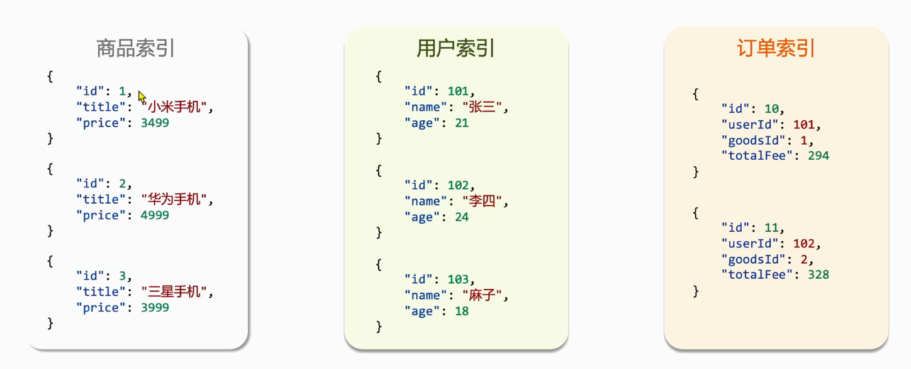

# 问题记录


# 待归档区


# 1-Elasticsearch概述


## 1.1-ES概览

一个现代的搜索引擎，可以返回相关的搜索结果，返回统计信息，还可以的完好的存储数据，甚至可以将直接作为带搜索功能的NoSQL数据存储使用。

完美的封装的lucene库，设计了友好的Restful-API，开发者无需过多关注底层机制，直接开箱即用。分片和副本机制，直接解决了集群下性能和高可用问题。

## 1.2-ES功能

> 解决搜索功能

### 1.2.1-提供快速查询

采用Lucene作为底层，Lucene是个高性能的搜索引擎包，采用的使用的倒排索引<font color='blue'>倒排索引的实现</font>。

搜索相关性，可以在查找时快速获取到相关文档的总数，得知离相关文档有多远

### 1.2.2-确认结果的相关性

默认情况下，计算文档的相关性得到时TF-IDF（Trem Frequency-Inverse Document Frequency），词频-逆文档频率

> 词频：所查找的单词在文档中出现的次数越多，得分越高
>
> 逆文档词频：如果某个单词在所有文档中比较少见，那么该词的权重越高，得分也会越高

可以使用内置功能来计算相关性得分，<font color='blue'>总结有哪些</font>

### 1.2.3-模糊匹配

#### ①拼写错误

模糊查询与相关性

#### ②支持变体

分析模块可以，匹配单词加粗，高亮

#### ③使用统计信息

聚合统计数据，

#### ④给予自动提示

自动提示技术预测要输入的内容，使用建议器。

## 1.3-ES使用场景

> 传统意义上，搜索引擎在完善的数据存储的基础之上部署。但是传统搜索引擎没有持久化以及类似统计的其他常用功能。
>
> ES定位为分布式的搜索分析型数据库，经过实际业务验证，可以很好的支持下列场景
>
> - 全文搜索：
> - 日志实时分析：
> - 时序数据分析：
> - 其他：ES用于OLAP分析<font color='blue'>适用吗？当下更主流的解决方案是什么？</font>，文档数据库等等

> 


### 1.3.1-作为唯一存储源

ES作为现代搜索引擎，提供了持久化存储，统计和很多其他数据存储的特性。如果启动新项目，考虑使用ES作为唯一的数据存储。

> 在生产使用elasticsearch作为唯一存储源https://blog.csdn.net/qq_29231037/article/details/120286289


### 1.3.2-集成进现有系统

重点：数据同步机制

### 1.3.3-日志分析框架

ELK平台：ES+logStash+Kibana

EKK平台，使用Amazon Kinesis替代LogStash。https://zhuanlan.zhihu.com/p/115483435

Logstash的竞品：Rsyslog、Apache Flume等等

Kibana的替代方案：Grafana、Splunk、Knowi，https://zhuanlan.zhihu.com/p/419176227

<font color='blue'>Kinaba的使用</font>

## 1.4-ES版本史


# ES概览

CloudDay6Elasticsearch

# 问题记录

<font color='blue'>ES的存储数据结构</font>

<font color='blue'>ES批量导入数据。RESTful是不是太慢了点</font>

<font color='blue'>这个被废弃了JAVA Client测试</font>


<font color='blue'>学习一手DEBUG（快捷键操作）</font>

<font color='blue'>数据库的EXpalin怎么在项目运行时加入？？？数据库调优</font>

<font color='blue'>ES的存储结构？</font>

# 学习重点


# 1初始ES

mysql性能有问题，在硬盘。。

redis快，但是复杂查询不好用做

早期solr


## 1.1了解ES

可以帮助我们从海量数据中快速找到需要的内容【千万级别开始】

MySQL不能千万级别的数据

京东淘宝首页的商品搜索。


ES结合kibana,Logstsh，Beats，也就是Elastic stack（**ELK**）。被广泛应用在**日志数据分析**。**实时监控**等领域

实时监控：内存占用，CPU占用，也可以通过ELK来做。

ES是ELK的核心，负责存储、搜索、分析数据。


ES的底层Lucene

Lucene：优点

易拓展，

高性能

缺点：

只限于Java语言开发

学习曲线陡峭

<font color='blue'>不支持水平拓展？完全不能做？还是不好用？</font>


基于Luence开发了ES

可以水平拓展

提供Rsetful风格，可以被任何语言调用


<font color='blue'>搜索引擎排名</font>

## 1.2倒排索引

正向索引与倒排索引


不能命中索引，必须全表扫描，因为不能确定后边是否还有符合要求的数据，

倒排索引：

文档：每条数据数据就是一个文档

词条：文档按照语义分成的词语。


<font color='red'>词条是唯一的</font>

查了两次，在MySQL中二级索引中的回表，命中索引，但是索引未能包含要求的全部数据


<font color='blue'>倒排索引的构建过程应该比较慢啊</font>

<font color='blue'>分词器？？</font>


## 1.3ES的一些概念 

ES面向文档存储，如一条商品数据，一个订单信息

文档数据会被序列化成JSON格式化后存储到ES中

索引：相同类型的文档的集合（等价于MySQL中的表）

映射：索引中文档的字段约束信息。如字段类型约束，类似数据库的表结构（Schema）



概念对比（mysql与ES）


架构：

MySQL擅长事务类型的操作，可以保证数据的安全和一致性（MQSQL写操作）

ES：擅长海量数据的搜索、分析、计算。（读操作，查询）

<font color='blue'>面试题：MySQL与ES的数据同步</font>


## 1.4安装ES，kibana

Ik的两种分词方式，一般用占用大，硬件相对便宜


扩展词典，<font color='blue'>dic格式</font>

敏感词汇【】

# 2索引库操作（Index）

ES中通过Restful请求操作索引库、文档。请求内容用DSL语句来表示。创建索引库和mapping的DSL语法。

## 2.1Mapping映射属性

Mapping是对索引库中文档的约束，常见的mapping属性包括

- type：字段数据类型，常见的简单类型有
  - 字符串：text（可分词的文本）、keyword（精确值【不可分词】，例如：品牌、国家、ip地址）
  - 数值：long、integer、short、byte、double、float
  - 布尔：boolean
  - 对象：object
- index：是否创建索引，默认为true
- analyzer：使用哪种分词器
- properties：该字段的子字段

## 2.2索引库的CRUD

创建索引库：PUT/索引库名

查询索引库：GET/索引库名

删除索引库：DELETE/索引库名

修改索引库：【添加字段】PUT/索引库名/_mapping


### 2.2.1创建索引库和映射

语法：

请求方式：PUT

请求路径： /索引库名称

请求参数：mapping映射

```
PUT /heima
{
	
}#@#
```

### 2.2.2查看索引

```
GET /heima
```

### 2.2.3删除索引

```
DELETE /索引库名
```

### 2.2.4修改索引库

索引库和mapping一旦创建无法修改，但是可以添加新的字段，（不可以修改字段）

```
PUT /heima/_mapping
{

}
```

# 3文档操作


## 3.1新增文档

```
POST
```


新增文档时没有该字段会自动生成这个字段（类型由系统指定）

<font color='blue'>响应乐观锁的实现，分布式的version怎么处理</font>


## 3.2查看文档


```
GET 
```


## 3.3删除文档


## 3.4修改文档

全量修改（POST）与部分修改（PUT）

# 3RestApi

<font color='blue'>官方文档网站地址</font>

CloudDay7ES2、

# 问题记录


# 学习重点


TF IDF算法

BF25算法（当前ES算法）

<font color='blue'>研究一下</font>

<font color='blue'>DSL</font>

# 1DSL查询文档

## 1.1DSL查询分类

ES提供基于JSON的DSL（Domain Specific Language）来定义。常见的查询类型包括

- **查询所有**：查询所有数据，一般测试用，例如：match_all
- **全文（full text）检索查询**：利用分词器对用户输入内容分词，然后去倒排索引库中匹配
  - match_query
  - multi_match_query
- **精确查询**：根据精确词条值查找数据，一般是查找keyword、数值、日期、boolean等类型字段。
  - ids
  - range
  - term
- **地理（geo）查询**：根据经纬度查询。
  - geo_distance
  - geo_bounding_box
- **复合（compound）查询**：复合查询可以将上述各种查询条件组合起来，合并查询条件
  - boolean Query
  - function_score

```json
GET /indexName/_search
{
	"query":{
		"查询类型":"{
			"查询条件":"条件值"
		}
	}
}
```

查询所有

```json
GET /indexName/_search
{
	"query":{
		"match_all":{
		}
	}
}
```

## 1.2全文检索查询


## 1.3精准查询


## 1.4地理坐标查询


## 1.5相关性算分


### 1.5.1相关性算分

### 1.5.2算分查询


符合查询


复合查询，boolean查询，不参与算分可以节省性能


算分函数，在指定排序后就不算分了

# 2查询结果处理

## 2.1排序


### 2.1.1普通字段排序


### 2.1.2地理坐标排序


## 2.2分页


### 2.2.1基本的分页


### 2.2.2深度分页问题


### 2.2.3小结


## 2.3高亮


### 2.3.1高亮原理


### 2.3.2实现原理


## 2.4总结

<font color='blue'>深度分页问题</font>

解决方式是不解决，限定翻页的页数

一定要解决的方案

官方方案不能往前翻页

<font color='red'>瀑布流【手机】不支持随机分页</font>

## 高亮


# 3RestClient查询文档


