# 问题记录


# 待归档区


# 问题记录


# 待归档区


<font color='blue'>查询耗时像MySQL那样随着join表数量线性甚至指数增长的。</font>

##  索引

> Oracle支持位图索引（用于索引只有1/0的值）

**Q：了解过索引吗？（什么是索引）**

- 索引（index）是帮助MySQL高效获取数据的数据结构（使用B+树，存储地址用来定位数据存储的位置）
- 提高数据检索的效率=>降低数据库的IO成本（高效定位就不需要全表扫面了）
- 通过索引列对数据进行排序，降低数据排序的成本，间接降低了CPU的消耗，因为在创建索引时，就进行了排序，使用索引组织的数据就是有序的，便于查找的。

<font color='blue'>插入删除数据后，索引怎么自己更新的呢</font>

**Q:索引的底层数据结构了解过吗？**

MySQL的InnoDB引擎采用的B+树的数据结构来存储索引

它的特点是阶数更多，路径更短，符合外存储设备的读取特点

外存储设备磁盘的读写代价更低，非叶子节点只存储指针（数据页地址），叶子节点存储数据。

B+树便于扫库和区间查询，因为叶子节点连起来是一个双向链表，每一个叶子节点存储上一个节点和下一个节点的指针（<font color='blue'>硬盘地址不叫指针吧？</font>）

<font color='blue'>硬盘寻址方式，以及32位和64位寻址空间做下笔记</font>

<font color='blue'>B+树单论数据结构，不包括连接叶子节点这个东西吧？</font>


> InnoDB存储引擎的B+树适合外存储设备的原因有以下几点：
>
> 1. 顺序访问：B+树是一种有序索引结构，数据按照键值的顺序存储在磁盘上。在外存储设备上，磁盘IO的时间成本相对较高<font color='blue'>【总结下网卡、内存、磁盘的读取速度，结合起来讲一讲】</font>，顺序访问可以最大程度地减少随机IO的数量。B+树的叶子节点通常会形成一个链表，这样对于范围查询或者遍历查询结果来说，可以通过顺序扫描叶子节点来获取顺序存储的数据块，减少磁盘IO次数，提高查询效率。
> 2. 块IO：<font color='blue'>【结合磁头+Linux的块IO的设计实现，结合起来讲一讲】</font>外存储设备的读写操作是以块为单位的，每次IO操作往往涉及一组相邻的数据块。B+树的非叶子节点存储了指向其子节点的指针，在同一个数据块中可以存储更多的指针，从而提高内存与磁盘之间的传输效率，减少IO次数。
> 3. 范围查询：B+树的结构使得范围查询变得更加高效。通过定位到范围查询的起始位置，然后通过顺序扫描叶子节点来获取连续的数据块，从而减少了磁盘IO的次数和数据的复制操作。
> 4. 写性能：B+树对于插入和删除操作的性能也相对较好。由于B+树数据的有序存储，插入和删除操作只需要调整少量的指针和节点即可，而不需要进行数据的大量移动。
>
> 综上所述，InnoDB引擎的B+树适合外存储设备，可以最大程度地减少随机IO的数量，提高顺序访问效率，并且具有较好的范围查询、写性能等特点，适合处理大规模数据和高并发访问的场景。


> Q：了解过索引吗

索引（index）是帮助MySQL高效查找数据、获取数据的数据结构，数据库系统在存储的数据之外，还维护着满足特定查找算法的数据结构（MySQL的InnoDB引擎使用的索引就是B+树），这些数据结构以某种方式引用（指向，即存储其硬盘位置，<font color='blue'>展开讲就是硬盘的寻址</font>）数据，可以在这些数据结构之上实现高级查找算法，这种数据结构就是索引。

> 数据库使用B+树的两个主要考量，1硬盘寻址与读取数据，按块读取，2.B+树深度低，效率高

> Q：索引的底层数据结构了解过？

MySQL使用的数据结构是B+树。 

与二叉树、红黑树（节点可以保持平衡，红黑树的再平衡算法 ）、B树（多叉路平衡查找树）进行对比，B+树在B树的基础上进行优化，使其更适合<font color='blue'>外存储</font>索引结构（数据页16KB），InnoDB存储引擎就是使用B+Tree实现索引结构的

> B+树对比B树的的优点：
>
> 1.磁盘读写代价更低：因为B+树非叶子节点只存储指针，不存储数据，优点：在查询时候的不会加载路径上非目标节点的数据。（如查询12，不会加载38，16的数据）
>
> 查询效率更稳定：因为所有数据都在叶子节点上，都是从根节点出发，一层一层的对比，直到查询定位到叶子节点上。
>
> <font color='blue'>便于扫库和区间查询</font>：叶子节点之间使用双向指针进行连接的，如查询6-34区间数据，不要再回到叶子节点进行查找。


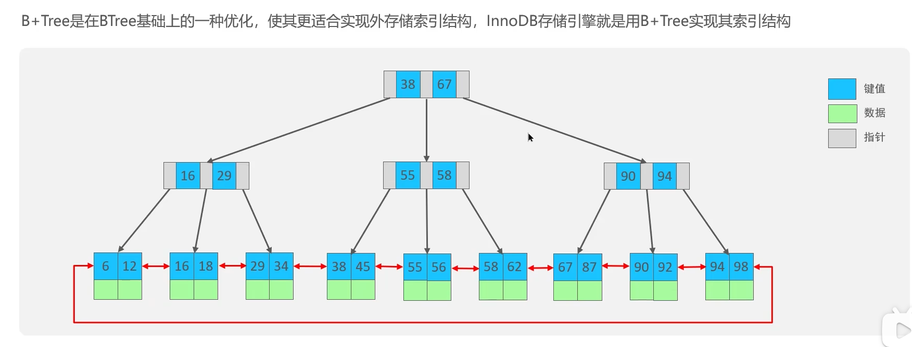

> 在 MySQL5.1 以及之前的版本，默认的存储引擎是 MyISAM ，但是目前已经不再更新，且它有几个比较关键的缺点：
> 不支持事务。
> 使用表级锁，如果数据量大，一个插入操作锁定表后，其他请求都将阻塞。


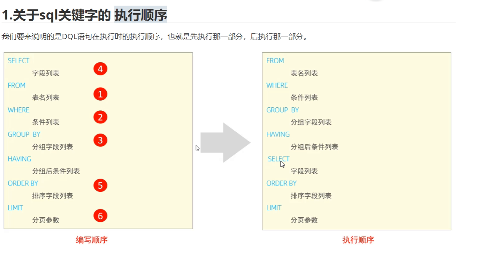

SELECT*一定会回表

哪个项目中用了事务？


不可重复读问题和幻读问题的区别在于，不可重复读的问题是在这条数据之前已存在。


用过shkywalking 链路追踪

springmvc的执行流程

hashmap的相关的

数据库的相关的。


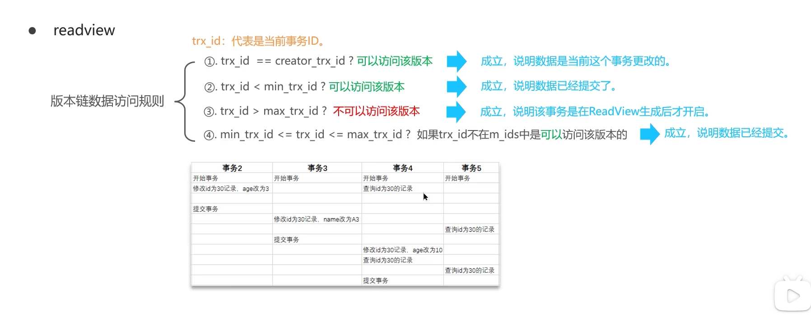


表建立主键就默认建立了聚簇索引。

如果没有主键，用唯一索引当聚簇索引，都没有则是隐式的主键。


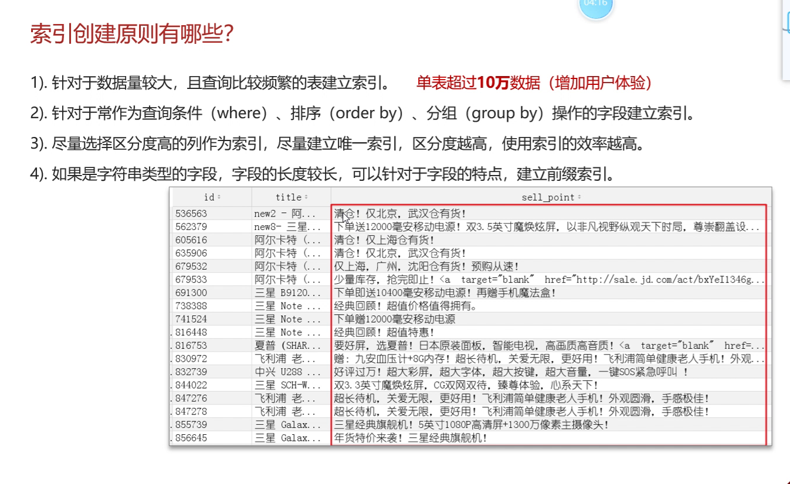

大几万就开始创建索引·


```
CREATE INDEX 索引名 ON 表名 (字段1，字段2);
CREATE INDEX sell_idx ON sell (name,status,address(10))；
实际上创建了三个索引表，name，name+status,name+status+address
```

数据类型不匹配也会造成失效，

mycat中间件（屏蔽了分表）


## MySQL发展历史

MySQL现在分为社区版和企业版

<font color='blue'>Java的驱动在哪个版本之后直接换了名字</font>


MySQL5.6版本后，innoDB从1.2.x版本后开始支持全文索引，全文索引通常使用倒排索引来实现的

5.7之后通过使用ngram插件开始支持中文全文索引


MySQL5.5版本后，InnoDB成为MySQL的默认引擎

```bash
# 查看MySQL默认的存储引擎
SHOW VARIABLES LIKE 'storage_engine';
```


MySQL8.0更新内容

InnoDB存储数据字典，意为myISAM可以完全从MySQL数据库中剥离

重构BLOB的实现

https://www.sohu.com/a/114228700_487483

<font color='blue'>MySQL是怎么支持JSON类型的数据的？</font>


## 存储引擎

存储引擎定义了数据库在物理层面上如何组织和储存数据（设计数据结构和存储方式），以及如何只执行读取、写入和查询（设计并提供API）等操作。

几种常见的存储引擎

innoDB：MySQL默认的，支持事务，并发性能好，行锁，<font color='blue'>崩溃恢复？</font>外键约束

MyISAM：MySQL停更的引擎，读取速度不错，表级锁，不支持事务

Redis：Redis是一个高性能的内存数据库，用于存储键值对。它的存储引擎是内存引擎（<font color='blue'>内存引擎？引擎这个概念包含哪些方面？设计数据结构及存储方式？设计并提供API？</font>），支持持久化到磁盘和数据复制等功能

MongoDB：MongoDB是一个面向文档的NoSQL数据库，使用BSON（二进制JSON）格式来存储数据。它的默认存储引擎是<font color='blue'>WiredTiger</font>，提供了高效的读写性能和复杂的查询功能。

Oracle：Oracle数据库支持多种存储引擎，其中最常用的是OLTP引擎（如ACID）和OLAP引擎（用于数据仓库和分析）。

PostgreSQL：PostgreSQL支持多种存储引擎，其中最常用的是默认的关系型存储引擎（也称为heap存储）和扩展对象关系型存储引擎（也称为表空间存储）。PostgreSQL还支持其他可插拔的存储引擎，如Citus用于分布式数据处理。

MariaDB：MySQL的开源分支，引擎XtraDB，也支持InnoDB引擎


## 索引


## 索引的实现原理

### 哈希索引

只有memory（内存）存储引擎支持hash索引，hash索引使用索引列的值，并计算该值的hashCode，然后在hashCode相对应的位置存该值所在行数据的物理位置。<font color='blue'>（hash冲突怎么解决？）</font>，因为使用散列算法，所以访问速度非常的快，但是一个值只能对应一个hashCode（<font color='blue'>这不对啊</font>），而且是散列的存储方式，因为哈希索引不支持范围查找和排序的功能。


<font color='blue'>常见的Hash算法：MD5，SHA1，CRC32</font>


可以使用写入内存表，然后再批量写入InnoDB的表，速度很快的原因

<font color='blue'>DBA做数据迁移是怎么做的？</font>

> insert into select from【要求目标表存在】与 select into from 【要求目标表不存在】
>
> 在MySQL中，复制不同引擎的表可以比较快的原因是因为MySQL的复制机制是基于二进制日志（binlog）的。
>
> 当启用了二进制日志复制时，MySQL会将所有的数据更改操作（如插入、更新、删除）以二进制格式记录在二进制日志中。这些二进制日志文件会被从主服务器上传输到从服务器，并在从服务器上重新执行以实现数据的复制。
>
> 而对于复制不同引擎的表，MySQL在复制的过程中并不会直接复制底层存储引擎中的数据文件，而是复制二进制日志中的数据更改操作。这样，无论表使用哪种存储引擎，复制的过程只涉及到二进制日志的传输和再执行，而不需要对底层存储引擎的文件进行复制操作。
>
> 相对于直接复制底层存储引擎中的数据文件，复制二进制日志的方式更加高效。这是因为二进制日志是一系列的增量日志，它只记录了数据更改操作，相对较小；同时，在数据传输和再执行的过程中，可以针对不同引擎的表采取一些优化措施，如并行执行、批量执行等，从而提高复制的效率。
>
> 需要注意的是，复制不同引擎的表时，由于不同引擎的表可能具有不同的特性和行为（如事务支持、锁机制等），因此在进行复制时需要特别留意相关的配置和注意事项，以确保复制的正确性和一致性


```
从以上基本架构可以看出，MySQL 的大致结构。下面我们对其中几个比较常见的模块进行分析。

SQL Parser 模块

SQL Parser 模块是 MySQL 的解析器，主要负责解析用户输入的 SQL 语句，并将其转化为可执行的命令。在 MySQL 中，SQL 语句可以分为不同的类别，包括 DDL（数据定义语言）、DML（数据操作语言）等。而 SQL Parser 模块也是根据这些语句的特性来进行分类处理的。例如，通过该模块可以将 ALTER TABLE 语句解析为添加、删除或更改某个表的列，从而对数据表进行修改。

Optimizer 模块

Optimizer 模块是 MySQL 的优化器，主要负责对 SQL 执行计划进行优化。在优化器中，MySQL 会对查询语句进行分析，并根据其特征进行相应的优化。例如，MySQL 可以通过索引来加速查询，或通过查询优化器重新组织查询语句，以获得更高的效率。

Storage Engines 模块

Storage Engines 模块是 MySQL 的存储引擎，主要负责数据的存储和读取。在 MySQL 中，可以通过多种存储引擎来存储数据，包括 InnoDB、MyISAM 等。不同的存储引擎之间具有不同的优缺点，因此在选择存储引擎时需要综合考虑需求、性能等方面的因素。

MySQL 的源代码解析未尝不是一个艰巨的任务，但努力掌握其核心模块，会使数据库的使用更得心应手，对数据库领域的学习也更为深入。
```


# 1-概述


# 2-数据库基本操作


# 3-数据类型


# 4-数据表的基本操作


# 5-操作表中数据


# 6-引擎


# 7-索引


# 8-日志文件

## 8.1-redo log

主要用于崩溃恢复，缓冲池的脏页数据刷入磁盘发生错误时，使用redolog日志进行恢复。

> 保障数据的持久性

MySQLbao引擎中的概念

缓冲池（buffer pool）：主内存中的一个区域，里面可以缓存磁盘上经常操作的真实数据，在执行增删改查的时候，先操作缓冲池中的数据（如果缓冲池没有数据，则磁盘中加载并缓存），以一定频率的刷新到磁盘，从而减少磁盘IO，加快处理速度。

数据页（page）：是InnoDB存储引擎磁盘管理的最小单元，每个页的大小默认为16KB，页中存储的是行数据。

> 表中数据由多个页组成的

 操作的时候首先操作的是缓冲池，<font color='blue'>对于这个commit存疑</font>，操作完成后按照一定的频率把数据同步到磁盘中。<font color='blue'>脏页的概念？？是不是commit的时候才刷盘</font>

为了保证事务的持久性。引入了redolog日志

redolog：重做日志，记录的是事务提交时数据也的物理修改，是用来实现事务的持久性。

该日志文件是由两部分组成的，当事务提交之后会把所有修改信息都存储到该日志文件中，用于刷新脏页到磁盘发生错误时，进行数据恢复使用。

重做日志缓冲（redo log buffer）：内存中

重做日志文件（redo log file）：磁盘中

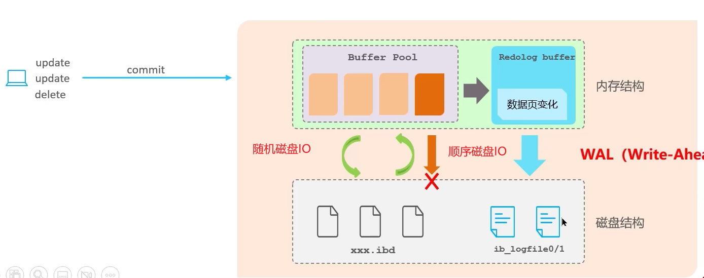

<font color='blue'>随机磁盘IO与顺序磁盘IO访问效率不一样：</font>

因为日志文件都是追加的，所以是顺序磁盘IO操作。

这种技术被成为WAL（Write-Ahead Logging），先写日志文件

每隔一段时间，都会把redolog日志定期清理，磁盘空间中有两份，<font color='blue'>循环写？？</font>

## 8.2-undo log

回滚日志，用于记录数据被修改前的信息，作用包含两个：**提供回滚**和**MVCC**（多版本并发控制），它是**逻辑日志**

- 可以认为当delete一条记录，undo log中会记录一条对应的Insert记录，反之亦然。
- 当update一条记录时，它记录一条相反的update记录，当执行rollback时，就可以从undo log中的逻辑记录读取到响应的内容并且回滚


## 8.3-binlog


# 9-事务

<font color='blue'>MySQL InnoDB行锁的具体实现</font>

> SQL server使用表锁，页锁【2-16KB】，行锁，某些情况下会发生锁升级
>
> oracle只有行锁

## 8.1-MVCC

> Multi-Version Concurrency Control 多版本并发控制，指维护数据的多个版本，使读写操作没有冲突

使用MVCC来支持高并发

MVCC的具体实现，主要依赖于数据库记录中的**隐式字段**，**undo log日志**，**readView**。

### 隐藏字段：

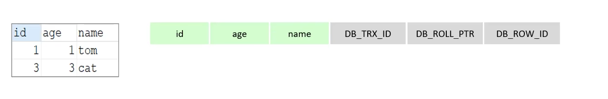

DB_TRX_ID：最近修改事务ID，记录插入这条记录或最后一次修改该记录的事务ID

DB_ROLL_PTR：回滚指针，指向这条记录的上一个版本，用于配合undo log，指向上一版本

> roll_pointer

DB_ROW_ID：隐藏主键，如果表结构没有指定主键，将会生成该隐藏字段。

### undo log日志

回滚日志，在insert、update、delete的时候产生的便于数据回滚的日志。

当insert的时候，产生的undo log日志只在回滚时需要，在事务提交后，可被立即删除<font color='blue'>怎么理解</font>

而update、detele的时候，产生的undo log日志不仅在回滚时需要，mvcc版本访问时也需要，不会被立刻删除。

**undo log版本链**

不同事务或相同事务对同一条记录进行修改，会导致该记录的undolog生成一条记录版本链表，链表头部是最新的旧纪录，链表尾部是最早的旧纪录。

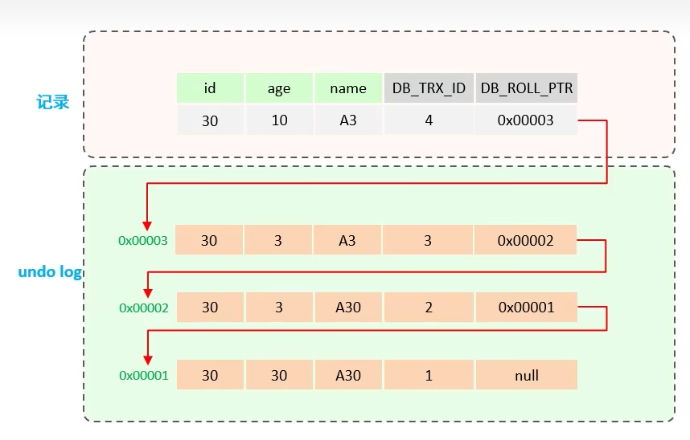

### readView

ReadView（读视图）是快照读，SQL执行时MVCC提取数据的依据，记录并维护系统当前活跃的事务（未提交的）Id

**当前读**：

读取的是记录的最新版本，读取时还要保证其它并发事务不能修改当前记录，会对读取的记录进行加锁。

如：

select...lock in share mode（共享锁），select ... for update、update、insert、delete（排他锁）都是一种当前读。**当前读无关隔离级别，读到的都是最新的？**<font color='blue'>所以在读未提交级别下，也可以加锁进行读取？？？</font>

> <font color='blue'>快照读无关隔离级别？？</font>，当前读读到的都是最新的？？<font color='blue'>阻塞吗？？？</font>

**快照读**：

简单的select（不加锁）就是快照读，快照读，读取的是记录数据的可见版本，有可能是历史数据，不加锁，是非阻塞读

读已提交：每次select，都生成一个快照都

可重复读：开启事务后第一个select语句才是快照读的地方。

<font color='blue'>上述存疑？？</font>

ReadView这个是什么东西？记录在哪里？？它又哪里来的字段？？

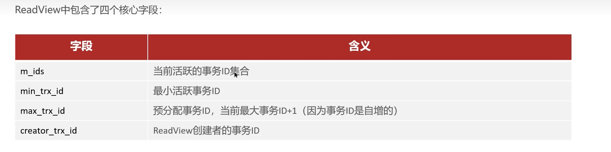

<font color='blue'>最小事务ID？事务ID的生成机制？？？事务ID是自增的？？？</font>


readview的版本访问规则


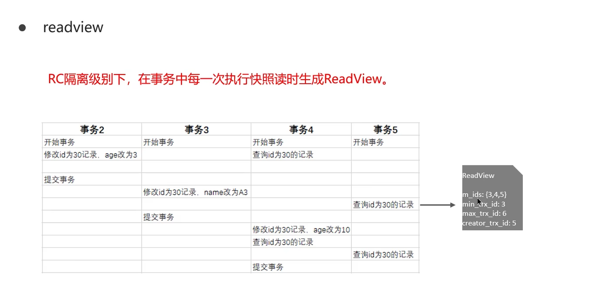

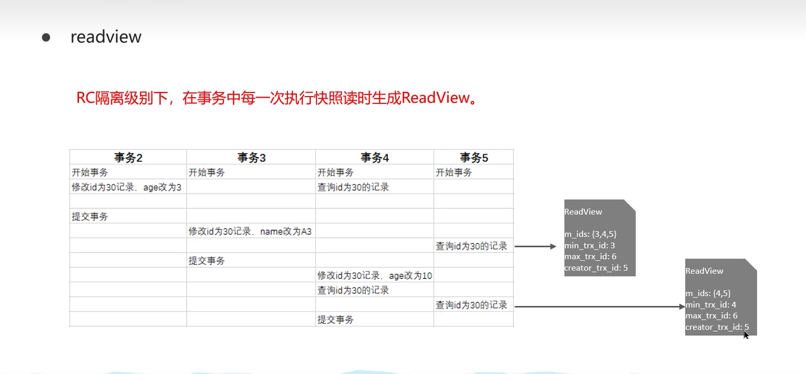


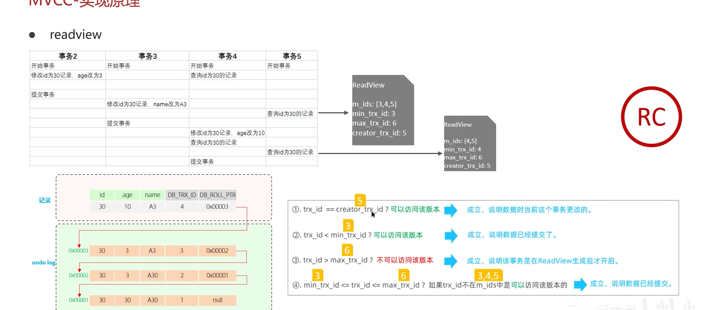


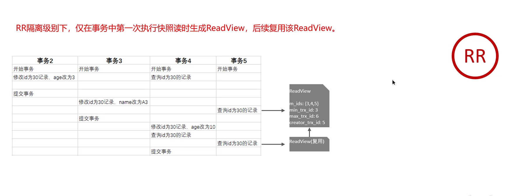

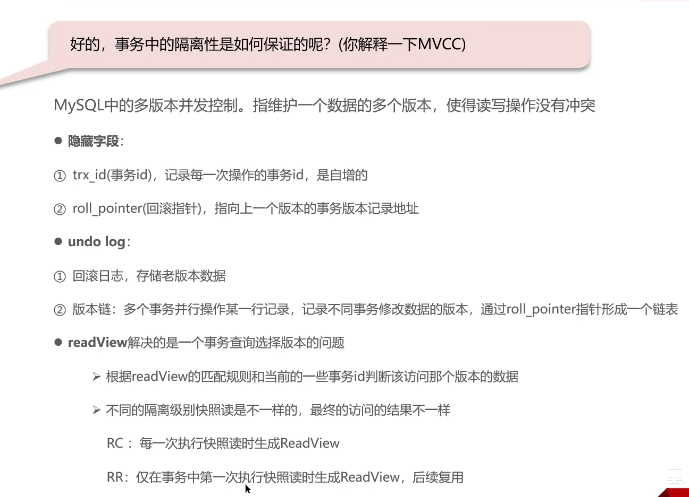


# 10-视图


# 11-约束


# 12-元数据


# 13-SQL优化

## 13.1-慢查询日志应用

### 13.1.1-慢查询日志

#### （1）什么是慢查询日志

慢查询日志是用于记录SQL执行时间超过某个临界值的SQL日志文件，可用于快速定位慢查询，为我们的SQL优化做参考。

具体指运行时间超过`long_query_time`值的SQL，则会被记录到慢查询日志中。`long_query_time`的默认值为10，意思是运行10秒以上的SQL语句，认为是超出了我们的最大忍耐时间值。

它的主要作用是帮助我们发现那些执行时间特别长的SQL查询，并且有针对性地进行优化，从而提高系统的整体效率。当我们的数据库服务器发生阻塞、运行变慢的时候，检查一下慢查询日志，找到那些慢查询，对解决问题有帮助。

默认情况下，MySQL数据库没有开启慢查询日志，需要我们手动来设置这个参数。如果不是调优需要的话，**一般不建议启动该参数，因为开启慢查询日志会或多或少带来一定的性能影响**。

#### （2）慢查询日志命令

**查看是否开启**

```sql
show variables like '%slow_query_log%'
# 本文这里结果如下
slow_query_log	ON
slow_query_log_file	DESKTOP-KIHKQLG-slow.log
```

`slow_query_log_file`指的是慢查询日志文件。如果`slow_query_log` 状态值为`OFF`，可以使用`set GLOBAL slow_query_log = on`来开启，如果想永久生效，那么在MySQL的配置文件中进行配置。

```sql
[mysqld]
slow_query_log=ON  # 开启慢查询日志
slow_query_log_file=/var/data/mysql-slow.log  # 慢查询日志的文件信息
#如果不指定日志文件，那么系统会默认一个hostnam-slow.log
long_query_time=3 #设置慢查询的阈值为3秒，超过此设定值的SQL即被记录到慢查询日志
log_output=FILE
```

**查看时间阈值**

默认值是10秒，可以根据需求自行调整

```sql
show variables like 'long_query_time';
# 临时设置为1 秒，重启失效
set GLOBAL long_query_time= 1
#针对当前会话级别设置
set  long_query_time= 1
```

**查询当前慢查询SQL条数**

```sql
# 查询当前系统中有多少条慢查询记录
show global status like '%Slow_queries%'
```

#### （3）慢查询日志格式

> <font color='blue'>看一看具体的慢查询日志</font>

需要注意的是，慢查询日志文件里面不止有查询语句，只要执行时间大于我们设置的阈值都会进入。

如下所示是一个慢查询实例，其load了21W条数据。

```sql
# Time: 2022-09-14T05:43:57.174825Z
# User@Host: root[root] @ localhost [127.0.0.1]  Id:  2497
# Query_time: 1.697595  Lock_time: 0.000226 Rows_sent: 210001  Rows_examined: 210001
SET timestamp=1663134237;
/* ApplicationName=DBeaver 7.3.0 - SQLEditor <Script-236.sql> */ select * from tb_sys_user tsu limit 210001;
```

#### （4）min_examined_row_limit

除了上述变量外，控制慢查询日志的还有一个系统变量：min_examined_row_limit 。这个变量的意思是，查询扫描过得最少记录数。这个变量和查询执行时间，共同组成了判别一个查询是否是慢查询的条件。如果查询扫描过得记录数大于等于这个变量的值，并且查询执行时间超过 long_query_time 的值，那么这个查询就被记录到慢查询日志中，反之则不被记录到慢查询日志中。

```sql
# 默认值 0
show variables like 'min_examined_row_limit';
```

这个值默认是0。 与`long_query_time`结合在一起，表示只要查询的执行时间超过10秒钟，哪怕一个记录也没有扫描过，都要被记录到慢查询日志中。

#### （5）关闭慢查询日志

**永久性关闭**

修改my.cnf或者my.ini文件，把`slow_query_log`设置为OFF，然后重启MySQL服务。

```xml
[mysqld]
slow_query_log=OFF
```

**临时性关闭**

```xml
set global slow_query_log=off
```

#### （6）删除慢查询日志

可以通过查到慢查询日志文件位置，手动删除日志文件。

```sql
show variables like 'slow_query_log_file'
```

使用命令 mysqladmin flush-logs 来重新生成慢查询日志文件，执行完毕会在数据目录下重新生成慢查询日志文件。

```sql
mysqladmin -uroot -p flush-logs slow
```

通常慢查询日志都是使用mysqladmin flush-logs命令来删除重建的。使用时一定要注意，一旦执行了这个命令，慢查询日志都只存在新的日志文件中，如果需要旧的查询日志，就必须事先备份。

#### （7）慢查询日志场景应用

慢查询的优化首先要搞明白慢的原因是什么， 是查询条件没有命中索引？是 load了不需要的数据列？还是数据量太大？所以优化也是针对这三个方向来的。

`首先分析语句，看看是否load了额外的数据`，可能是查询了多余的行并且抛弃掉了，可能是加载了许多结果中并不需要的列，对语句进行分析以及重写。

`分析语句的执行计划，然后获得其使用索引的情况`，之后修改语句或者修改索引，使得语句可以尽可能的命中索引。

`如果对语句的优化已经无法进行，可以考虑表中的数据量是否太大`，如果是的话可以进行横向或者纵向的分表。

### 13.1.2-mysqldumpslow

> 慢查询日志分析工具，mysql提供了日志分析工具mysqldumpslow来帮助我们快速定位问题。

```shell
# 查看mysqldumpslow 的帮助信息
[root@VM-24-14-centos ~]# mysqldumpslow --help
Usage: mysqldumpslow [ OPTS... ] [ LOGS... ]
Parse and summarize the MySQL slow query log. Options are
  --verbose    verbose
  --debug      debug
  --help       write this text to standard output

  -v           verbose
  -d           debug
  -s ORDER     what to sort by (al, at, ar, c, l, r, t), 'at' is default
                al: average lock time
                ar: average rows sent
                at: average query time
                 c: count
                 l: lock time
                 r: rows sent
                 t: query time
  -r           reverse the sort order (largest last instead of first)
  -t NUM       just show the top n queries
  -a           don't abstract all numbers to N and strings to 'S'
  -n NUM       abstract numbers with at least n digits within names
  -g PATTERN   grep: only consider stmts that include this string
  -h HOSTNAME  hostname of db server for *-slow.log filename (can be wildcard),
               default is '*', i.e. match all
  -i NAME      name of server instance (if using mysql.server startup script)
  -l           don't subtract lock time from total time
```

得到返回记录集最多的10个SQL

```sql
mysqldumpslow -s r -t 10 /var/data/mysql-slow.log
```

得到访问次数最多的10个SQL

```sql
mysqldumpslow -s c -t 10 /var/data/mysql-slow.log
```

得到按照时间排序的前10条SQL中包含左连接的语句

```sql
mysqldumpslow -s t -t 10 -g "left join" /var/data/mysql-slow.log
```

### 13.1.3-全局查询日志

其同样可以帮助我们定位SQL问题，通常不建议在生产环境开启。可以在配置文件my.cnf下进行启用：

```sql
# 开启
general_log=1
#记录日志文件的路径
general_log_file=/var/data/mysql_general_log
#输出格式
log_output=FILE
```

或者临时开启：

```sql
set global general_log=1;
set global log_output='TABLE'
```

此时SQL语句将会记录到MySQL库的`mysql.general_log`表中。

## 13.2-EXPLAIN执行计划详解

### 13.2.1-简介

使用explain关键字可以模拟优化器执行SQL查询语句，从而知道MySQL是如何处理你的SQL语句的，分析你的查询语句或是表结构的性能瓶颈。

### 13.2.2-包含信息


（1）


# 14-分库分区分表

## 14.1-分区分库分表概述

一般来说，在系统设计阶段就应该根据业务耦合松紧来确定垂直分库，垂直分表方案，在数据量及访问压力不是特别大的情况，首先考虑**缓存、读写分离、索引技术**等方案。若数据量极大，且持续增长，再考虑**水平分库水平分表**方案。

> https://blog.csdn.net/vivo_tech/article/details/120948968

## 14.2-


# 14-其它优化（OS和硬件优化）


# 15-应用层优化


# 16-集群高可用


# 17-备份


# 18-MySQL工具


# MISC-杂项


# N-附录

# 


