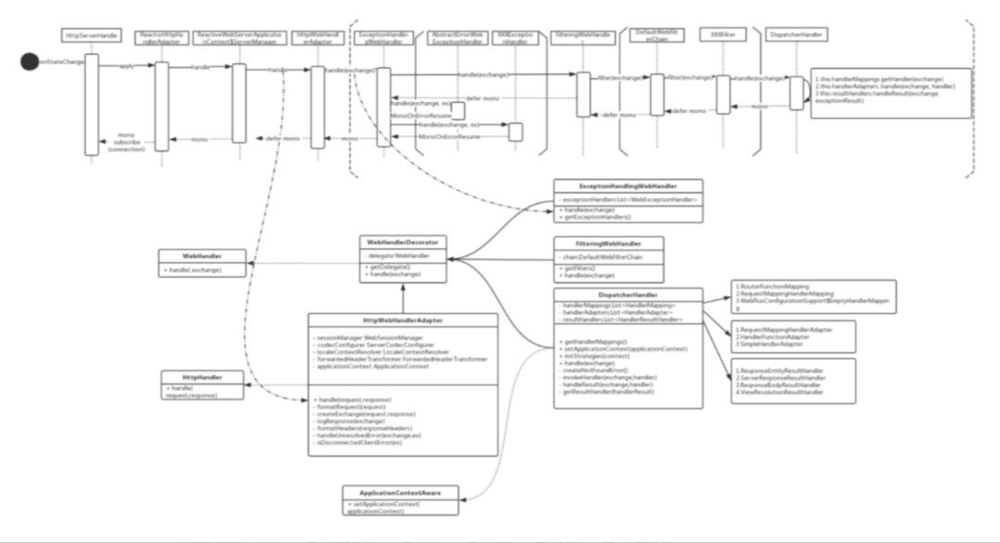

# 问题记录

<font color='blue'>Reactive、Reactor和webflux</font>

https://blog.csdn.net/lbjfish/article/details/109187435

# 待归档区


# W-springWebflux

## W.1-Webflux简介

**结论性内容**

```
基于netty，配合r2dbc可以拥有更高吞吐量，低并发情况下springmvc+jdbc表现更好，
```


WebFlux 是 Spring Framework5.0 中引入的一种新的反应式Web框架。通过Reactor项目实现Reactive Streams规范，完全异步和非阻塞框架。本身不会加快程序执行速度，但在高并发情况下借助异步IO能够以少量而稳定的线程处理更高的吞吐，规避文件IO/网络IO阻塞带来的线程堆积。

### W.1.1 WebFlux 的特性

WebFlux 具有以下特性：

- **Reactor异步非阻塞** 相对于 Spring MVC 是同步阻塞IO模型，Spring WebFlux是基于Reactor模型的。
- **响应式函数编程** - 相对于Java8 Stream 同步、阻塞的Pull模式，Spring Flux 采用Reactor Stream 异步、非阻塞Push模式。书写采用 Java lambda 方式,接近自然语言形式且容易理解。
- **不拘束于Servlet** - 可以运行在传统的Servlet 容器（3.1+版本），还能运行在Netty、Undertow等NIO容器中。

### W.1.2-WebFlux 的设计目标

- 适用高并发
- 高吞吐量
- 可伸缩性

### W.1.3-SpringMVC与SpringWebFlux


Spring WebFlux 是一个异步非阻塞式 IO 模型，通过少量的容器线程就可以支撑大量的并发访问。底层使用的是 Netty 容器，这点也和传统的 SpringMVC 不一样，SpringMVC 是基于 Servlet 的。

它们都可以用注解式编程模型，都可以运行在tomcat，jetty，undertow等servlet容器当中。但是SpringMVC采用命令式编程方式，代码一句一句的执行，这样更有利于理解与调试，而**WebFlux则是基于异步响应式编程**，对于这两种框架官方给出的建议是：

- 如果原先使用用SpringMVC好好的话，则没必要迁移。因为命令式编程是编写、理解和调试代码的最简单方法。因为老项目的类库与代码都是基于阻塞式的。
- 如果你的团队打算使用非阻塞式web框架，WebFlux确实是一个可考虑的技术路线，而且它支持类似于SpringMvc的Annotation的方式实现编程模式，也可以在微服务架构中让WebMvc与WebFlux共用Controller，切换使用的成本相当小。

**WebFlux在有限的资源下提高系统的伸缩性**，在非常熟练的情况下并将其应用于新的系统中，还是值得考虑的，否则还是老老实实的使用WebMVC。

### W.1.4SpringWebFlux基准测试

关于Spring MVC 和Spring WebFlux的基准测试，引用来自：《[Spring: Blocking vs non-blocking: R2DBC vs JDBC and WebFlux vs Web MVC](https://link.zhihu.com/?target=https%3A//technology.amis.nl/software-development/performance-and-tuning/spring-blocking-vs-non-blocking-r2dbc-vs-jdbc-and-webflux-vs-web-mvc/)》。

> R2DBC 是 Reactive Relational Database Connectivity （关系型数据库的响应式连接） 的缩写，最近在项目中尝试 Webflux，被迫，使用 R2DBC 进行数据库操作（我还是更喜欢关系型数据库而不是文档型）

#### ①-测试准备

- Spring Web MVC + JDBC 数据库驱动程序
- Spring Web MVC + R2DBC 数据库驱动程序
- Spring WebFlux + JDBC 数据库驱动程序
- Spring WebFlux + R2DBC 数据库驱动程序

**基本依赖**

```xml
<dependency> 
    <groupId>org.springframework.boot</groupId> 
    <artifactId>spring-boot-starter-data-r2dbc</artifactId> 
</dependency> 
<!-- r2dbc 连接池 --> 
<dependency> 
    <groupId >io.r2dbc</groupId> 
    <artifactId>r2dbc-pool</artifactId> 
</dependency> 
<!--r2dbc mysql 库--> 
<dependency> 
    <groupId>dev.miku</groupId> 
    <artifactId>r2dbc- mysql</artifactId> 
</dependency> 
<!--自动配置需要引入一个嵌入式数据库类型对象--> 
<dependency> 
    <groupId>org.springframework.boot</groupId> 
    <artifactId>spring-boot-starter-data-jdbc</artifactId> 
</dependency>
<!-- 反应方程式 web 框架 webflux--> 
<dependency> 
    <groupId>org.springframework.boot</groupId> 
    <artifactId>spring-boot-starter-webflux</artifactId> 
</dependency>
```

**测试环境基础参数**、

核心数：4

数据库连接池参数：100

并发数从50递进500，步长4

测试用机内存：32GB

#### ②响应时间


很明显，在更高的并发性下，Spring Web MVC + JDBC可能不是你的最佳选择。R2DBC显然在更高的并发性下提供了更好的响应时间。Spring WebFlux也比使用Spring Web MVC的类似实现做得更好。

#### ③吞吐量（请求数）


与响应时间类似，带有JDBC的Spring Web MVC在更高的并发性下开始表现得更糟。同样，R2DBC显然做得最好。如果你的后端仍然是JDBC，那么从Spring Web MVC迁移到Spring WebFlux不是一个好主意。在低并发性下，Spring Web MVC + JDBC 做得最好。

#### ④CPU使用率


CPU 测量为整个运行期间的 CPU 时间，即进程用户和内核时间的总和。

带有JDBC的Web MVC在高并发下使用了大多数CPU。带有JDBC的WebFlux使用最少，但吞吐量也最低。当您查看每个处理的请求使用的 CPU 时，您可以获得效率度量：


带有JDBC的Web MVC在高并发时会变得更糟，然而，在低并发的情况下，Web MVC + JDBC可以最有效地利用可用的CPU。

#### ⑤内存使用情况

内存在运行结束时作为进程专用内存进行测量。内存使用情况取决于垃圾回收。G1GC 在 JDK 11.0.6 上使用。Xms 是 0.5 Gb（默认为可用内存的1/64）。Xmx 是 8 Gb（默认为1/4）。

> Xms，Xmx参数怎么配置？<font color='blue'>1/64是1/4是虚拟机默认的吗？可以按照比例进行设置吗？？</font>


与Web MVC相比，WebFlux的内存使用更稳定，Web MVC在更高的并发性下具有更高的内存使用率。使用 WebFlux 时，同时使用 R2DBC 可在高并发下提供最少的内存使用量。在低并发性下，Web MVC + JDBC 效果最好，但在高并发性下，WebFlux + R2DBC 每个已处理请求使用的内存最少。


#### ⑥结论

低并发的情况下，springMVC+JDBC架构方式，**吞吐量随QPS增长而下跌**，其它架构比较稳定。**webFlux+JDBC吞吐量一直都很低**。

CPU使用，WebFlux+JDBC使用做少。其它相对一样。

内存使用，WebFlux+R2DBC使用最少。


## W.2-Spring WebFlux 组件介绍

### W.2.1-HttpHandler

一个简单的处理请求和响应的抽象，用来适配不同HTTP服务容器的API。

| Server name | BeanName                   |
| :---------- | :------------------------- |
| Netty       | ReactorHttpHandlerAdapter  |
| Undertow    | UndertowHttpHandlerAdapter |
| Tomcat      | TomcatHttpHandlerAdapter   |
| Jetty       | JettyHttpHandlerAdapter    |

### W.2.2-WebHandler

一个用于处理业务请求抽象接口，定义了一系列处理行为。相关核心实现类如下；

> <font color='blue'>WebHandler和HttpHandler的关系是什么？？</font>


| Bean name                   | Explanation                                            |
| --------------------------- | ------------------------------------------------------ |
| DispatcherHandler           | 请求的总控制器，类似于WebMVC中的DispatcherServlet      |
| FilteringWebHandler         | 通过WebFilter进行过滤处理的类，类似于Servlet中的Filter |
| ExceptionHandlingWebHandler | 针对于异常的处理类                                     |
| ResourceWebHandler          | 用于静态资源请求的处理类                               |

### W.2.3-DispatcherHandler

请求处理的总控制器，实际工作是由多个可配置的组件来处理。

| Bean type            | Explanation                                                  |
| -------------------- | ------------------------------------------------------------ |
| HandlerMapping       | 将请求映射到对应处理器。 主要实现有: <br>1) 用于@RequestMapping注解方法的RequestMappingHandlerMapping <br>2) 用于功能端点路由的RouterFunctionMapping <br>3) 用于URI路径模式和WebHandler实例的显式注册的SimpleUrlHandlerMapping |
| HandlerAdapter       | 帮助DispatcherHandler调用映射到请求的处理程序，而不管实际如何调用该处理程序。 例如，调用带注解的控制器需要解析注解。 HandlerAdapter 主要目的是用来解释编排排处理行为，具体处理交给对应处理器处理。 |
| HandlerResultHandler | 处理来自处理程序调用的结果，并最终确定响应。根据注解和返回来类型选择处理器。例如: 使用了@ResponseBody 注解的ResponseBodvResultHandler |

WebFlux是兼容Spring MVC 基于@Controller，@RequestMapping等注解的编程开发方式的，可以做到平滑切换。

### W.2.4-Functional Endpoints

这是一个轻量级函数编程模型。是基于@Controller，@RequestMapping等注解的编程模型的替代方案，提供一套函数式API 用于创建Router,Handler和Filter。调用处理组件如下：

| HandlerMapping        | HandlerAdapter         | 说明               |
| --------------------- | ---------------------- | ------------------ |
| RouterFunctionMapping | HandlerFunctionAdapter | 支持RouterFunction |

简单的RouterFuntion 路由注册和业务处理过程：

```java
@Bean
public RouterFunction<ServerResponse> initRouterFunction() {
    return RouterFunctions.route()
        .GET("/hello/{name}", serverRequest -> {
            String name = serverRequest.pathVariable("name");
            return ServerResponse.ok().bodyValue(name);
        }).build();
}
```

请求转发处理过程：


### W.2.5-Reactive Stream

这是一个重要的组件，WebFlux 就是利用Reactor 来重写了传统Spring MVC 逻辑。其中Flux和Mono 是Reactor中两个关键概念。掌握了这两个概念才能理解WebFlux工作方式。

Flux和Mono 都实现了Reactor的Publisher接口,属于时间发布者，对消费者提供订阅接口，当有事件发生的时候，Flux或者Mono会通过回调消费者的相应的方法来通知消费者相应的事件。这就是所谓的响应式编程模型。

**Mono工作流程图**


只会在发送出单个结果后完成。

**Flux工作流程图**


发送出零个或者多个，可能无限个结果后才完成。

```
对于流式媒体类型：application/stream+json 或者 text/event-stream ，可以让调用端获得服务器滚动结果。
对于非流类型：application/json  WebFlux 默认JSON编码器会将序列化的JSON 一次性刷新到网络，这并不意味着阻塞，因为结果Flux<?> 是以反应式方式写入网络的，没有任何障碍。
```

## W.3-WebFlux 工作原理

> 详细文章
>
> https://zhuanlan.zhihu.com/p/420464470

### W.3.1-组件装配过程


### W.3.2-完整请求处理流程



该图给出了一个HTTP请求处理的调用链路。是采用Reactor Stream 方式书写，只有最终调用 subscirbe 才真正执行业务逻辑。基于WebFlux 开发时要避免controller 中存在阻塞逻辑。列举下面例子可以看到Spring MVC 和Spring Webflux 之间的请求处理区别。


## W.4-存储技术

一旦控制层使用了 Spring Webflux 则安全认证层、数据访问层都必须使用 Reactive API 才真正实现异步非阻塞。

> 测试结果，参见上述的基准测试
>
> R2DBC：响应式关系数据库连接，Reactive Relational Database Connectivity
>
> <font color='blue'>推测：也是Reactor模型</font>

**NOSQL Database**

- **MongoDB** (org.springframework.boot:spring-boot-starter-data-mongodb-reactive)。
- **Redis**(org.springframework.boot:spring-boot-starter-data-redis-reactive)。

**Relational Database**

- **H2** (io.r2dbc:r2dbc-h2)
- **MariaDB** (org.mariadb:r2dbc-mariadb)
- **Microsoft SQL Server** (io.r2dbc:r2dbc-mssql)
- **MySQL** (dev.miku:r2dbc-mysql)
- **jasync-sql MySQL** (com.github.jasync-sql:jasync-r2dbc-mysql)
- **Postgres** (io.r2dbc:r2dbc-postgresql)
- **Oracle** (com.oracle.database.r2dbc:oracle-r2dbc)


## W-快速入门

快速入门连接

https://zhuanlan.zhihu.com/p/55539755