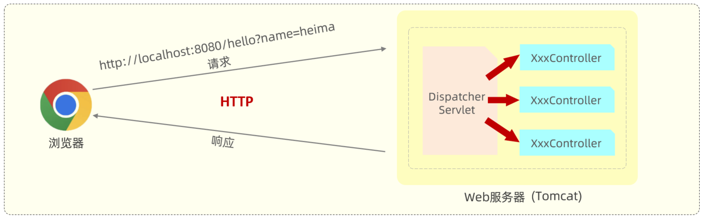
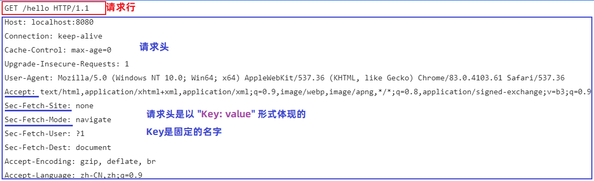
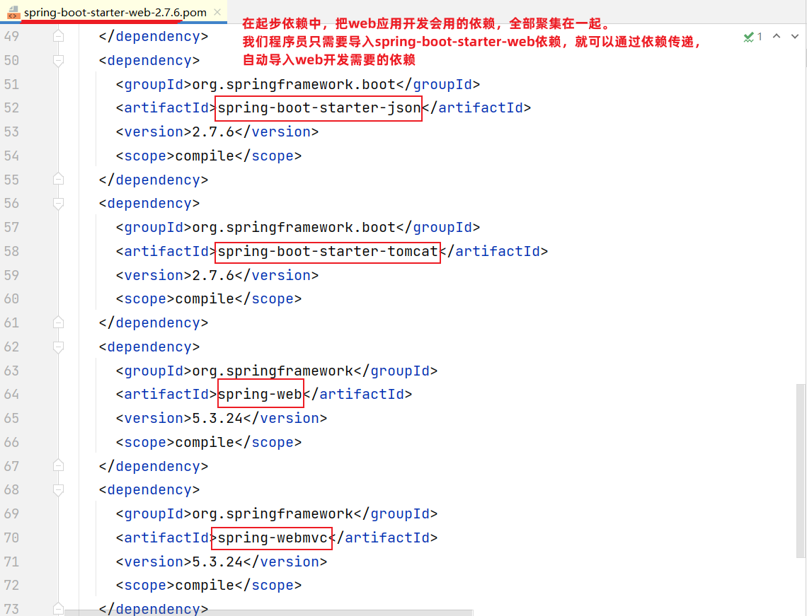
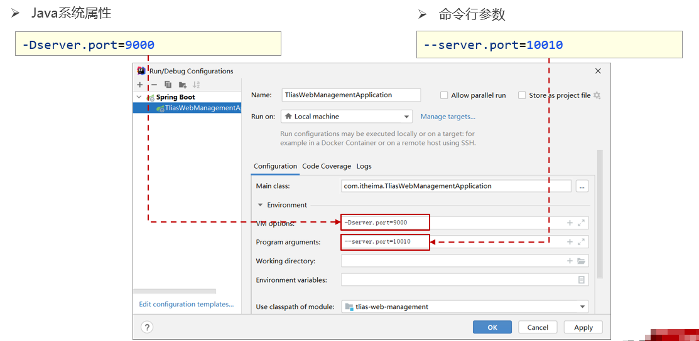

# 问题记录

案例中的跨域问题？

entity包的位置？与service平级吗，一般都是的，

案例中控制器类 return Result.sucess。用的静态方法，什么时候用静态方法？工具类

Interage.ValueOf与Interage.parseInt的区别？

@RestController注解一定要记得标注

404错误优先排查是不是注解@RestController、@RequestMapping没有标注

<font color='blue'>get请求是不是请求参数的VALUE是不是都是String类型的？？修改GET请求的参数类型地址栏没有改变，get请求的VALUE是不是根本没有类型？</font>

SpringBoot中Controller中使用POJO接收请求时，POJO属性名与请求参数名称不一致有没有解决方案？

在实体类上添加@JsonProperty注解使用方法类似于@RequestParam

<font color='blue'>接口测试时，GET请求只接收query即路径中的参数，POST请求为什么name会拼接了？？</font>

听课，同一路径名可以同时接收GET，POST请求，是吗？？？是的，都是为了收到参数

@RequestMapping中为什么要写成路径名的形式啊？？？

路径名大小写敏感吗？？路径名字不敏感，但是@RequestMapping（“/...”）中的路径（<font color='blue'>这个不是路径吧？？？</font>）敏感

为什么老师说json数据不在请求体内？在一块特殊的空间？？？

为什么APIPOST03-[0,3]压测结果会不同？？有的完全失败，有的可以成功，有的则没反应

<font color='blue'>@RequestHeader</font>

<font color='blue'>@CookieValue</font>

# 学习目标

都是重点

总结学习到注解，看源码，且汇总其使用方式，作用范围，作用效果

测试不同接口会产生哪种错误，用来积累经验

# 前言

在SpringBoot快速入门项目中，浏览器发送/hello请求后，给浏览器返回字符串”Hello World“。

我们在浏览器发起请求，请求了部署到本地的后端web服务器（内置的Tomcat）。在开发web程序时，定义了一个控制器类XxxController，请求会被部署在Tomcat中的Controller接受，然后Controller再给浏览器一个响应，响应一个字符"Hello World"。而在请求响应的过程中时遵循HTTP协议的。

但是，在Tomcat这类服务器中，是不能识别我们自己定义的Controller的，Tomcat是一个Servlet容器，是支持Servlet规范的`JavaEE规范`，Tomcat是可以识别Servlet程序，那么我们所编写的XxxController是如何处理请求的，又与Servlet之间有什么练习呢？？

在使用SpringBoot进行Web程序开发时，SpringBoot内置了一个核心的Servlet程序**DispatcherServlet**，称之为**核心控制器**（符合Servlet规范）。DispatcherServlet负责接收页面发送的请求，然后根据执行的规则，将请求再转发给后面的请求处理器Controller，请求处理器处理完请求后，最后再由DispatcherServlet给浏览器响应数据。

<font color='blue'>这个DispatcherServlet在处理大量请求时如何工作？是如何设计的？</font>



浏览器发送请求，会携带请求数据，包括：请求行、请求头；请求到达Tomcat之后，tomcat会负责解析这些请求数据，然后将解析后的数据传递给Servlet程序的HttpServletRequest对象，那也就意味着HttpServletRequest对象可以获取到请求数据。在Tomcat中，还给Servlet程序传递了一个参数HttpServletResponse，通过这个对象，我们就可以给浏览器设置响应数据。


<font color='blue'>这是个什么代码，Tomcat是如何实现的？什么语言编写的</font>

# .SpringBoot入门

SpringBoot是一个能够快速帮助我们构筑Java项目的框架！

配置简单，开发方便

框架编写的初衷，希望让开发这更加的方便，

遵守框架里规定的开发方式，依据框架描述，你想完成某个功能，只需第一步，第二不....

学习框架就是学习框架的使用套路（按照规定好的的方式进行代码编写，）


## 2.1Spring与SpringBoot对比


## 2.2SpringBootWeb快速入门

1.空项目准备（new project）

2.修改默认的脚手架（快速创建项目工具）的服务地址


3.编写模块的初始化信息GA


4.在核心包下创建contrller包，编写控制器（接收前台发送请求的组件）

```java
package com.itheima.controller;

import org.springframework.web.bind.annotation.RequestMapping;
import org.springframework.web.bind.annotation.RestController;
/*
Controller:控制器（可以收到前台发送的请求）
 */
@RestController//通过该注解标记内容（让SrpingBoot知道被标记的类是一个控制器类）
public class HelloController {
    /*
        当控制器接收到请求并且明确请求的路径是"/hello"是ResquestMapping声明的值一样的时候，就执行标记的方法
    */
    /**
     * @return HelloWorld字符串
     */
    @RequestMapping("/hello")
    public String sayHi(){
        System.out.println("Hello world");
        return "hello world";
    }
}
```

5.运行核心类的主方法（自动将当前工程部署到服务器中运行，提供服务）该类有SpringBoot自动生成

```java
@SpringBootApplication
public class Chatper182SpringQuickStartApplication {

    public static void main(String[] args) {
        SpringApplication.run(Chatper182SpringQuickStartApplication.class, args);
    }
}
```

6.基于浏览器发送请求


# 4.HTTP协议


## 4.1HTTP协议概述

### 4.1.2HTTP介绍

HTTP（Hyper Text Tranfer Protocol），超文本传输协议，<font color='red'>规定浏览器和服务器之间数据传输规则</font>

http是互联网上应用最为广泛的一种网络协议

http协议要求：浏览器在向服务器发送请求数据时，或者服务器在向浏览器发送响应数据时，都必须按照固定的格式进行数据传输。

如果想知道http协议的数据传输格式有哪些，可以打开浏览器，点击`F12`打开开发者工具，点击`Network`来查看

右键控制台，排序选项勾选可以查看协议版本，

筛选Fetch/XHR代表请求与响应

<font color='blue'>瀑布？是什么</font>


浏览器向服务器进行请求时：

- 服务器按照固定的格式进行解析



服务器向浏览器进行响应时：

- 浏览器按照固定的格式进行解析


### 4.1.2特点

1. 基于TCP协议：面向连接，安全
   - TCP是一种面向连接的（建立连接之前都是需要经过三次握手）、可靠的、基于字节流的传输层通信协议，在输出传输方面更安全。
2. 基于请求-响应模型的：一次请求对应一次响应（先请求后响应）
   - 请求和响应是一一对应关系，没有请求，就没有响应
3. HTTP协议是无状态的协议：对于事务处理没有记忆能力，每次请求-响应都是独立的
   - 无状态指的是客户端发送HTTP请求给服务端后，服务器根据请求响应数据，响应完后，不会记录任何信息。
     - 缺点：多次请求间不能共享数据。
     - 优点：速度快
   - 请求之间无法共享数据会引发的问题
     - 如：京东购物，加入购物车和去购物车结算是两次请求
     - 由于无状态的特性，加入购物车请求响应结束后，并未记录加入购物车是什么商品
     - 发起去购物车结算的请求后，因为无法获取哪些商品加入了购物车，会导致此请求无法正确展示数据
   - java使用会话技术（Cookie、Session）来解决这个问题。

<font color='blue'>购物车的商品采用什么方式记录？？</font>

## 4.2HTTP-请求协议

- HTTP协议的请求数据格式

  1. 请求行=>请求方式 请求的资源路径 遵守的信息

     ```
      GET  /user?username=zhangergou http/1.1
     ```

  2. 请求头=>（KEY:VALUE数据，KEY都是固定值）是浏览器封装的一些当前的实际额外信息，方便服务器可以更好的接收本次请求，并根据请求头中的相关信息进行回复。

  3. 请求空行=>只有POST请求有，用于让服务器分清请求头和请求体的内容

  4. 请求体=>只有POST有，用与保存本次提交的数据

- 一个完全遵守Http协议的请求地址：

```
http://Ip地址:端口/请求资源
```

在HTTP1.1版本中，浏览器访问服务器的几种方式：GET、POST常用

| 请求方式 | 请求说明                                                     | 安全性 | 幂等性 |
| -------- | ------------------------------------------------------------ | ------ | ------ |
| **GET**  | 获取资源<br/>向特定的资源发出请求。例如：http://www.baidu.com/s?wd=itheima |        |        |
| **POST** | 传输实体主体<br/>向指定资源提交数据进行处理请求（如上传文件），数据被包含在请求体中 |        |        |
| OPTIONS  |                                                              |        |        |
| HEAD     |                                                              |        |        |
| PUT      |                                                              |        |        |
| DELETE   |                                                              |        |        |
| TRACE    |                                                              |        |        |
| CONNECT  |                                                              |        |        |


### 4.2.1GET方式的请求协议


- 请求行：HTTP请求中的第一行数据。由`请求方式`、`资源路径`、`协议/版本`组成（之间用空格分隔）
  - 请求方式：GET
  - 资源路径：/brand/findAll?name=OPPO&status=1
    - 请求路径：/brand/findAl
    - 请求参数：name=OPPO&status=1
      - 请求参数以key=value形式出现
      - 多个请求参数之间`&`连接
    - 请求路径和请求参数之间用`?`连接
  - 协议/版本：HTTP/1.1
- 请求头：第二行开始，格式为key:value形式
  - http是个无状态的协议，所以在请求头设置浏览器的一些自身信息和想要响应的形式，这样服务器在收到信息后，就可以知道是谁，想干什么了
  - <font color='blue'>一般而言作为开发者不需要主动干预，但是不代表我们不能干预，什么时候需要干预？</font>

常见的HTTP请求头有：

```
Host:表示请求的主机名
User-Agent:浏览器版本。例如：Chrome浏览器的标识类似Mozilla/5.0 ...Chrome/79 ，IE浏览器的标识类似Mozilla/5.0 (Windows NT ...)like Gecko
Accept:表示浏览器能接收的资源类型，如text/*，image/*或者*/*表示所有类型都可以接收
Accepte-Language:表示浏览器偏好的语言，服务器可以根据此数据返回不同语言的网页
Accepte-Encoding:表示浏览器可以支持支持的压缩类型，例如gzip，deflate等。
Content-Type:请求数据主体的数据类型
Content-Length:请求数据主体的大小
```

服务端可以根据请求头中的内容来获取客户端的相关信息，有了这些信息服务端就可以处理不同的业务需求，

例如：

不同浏览器解析HTML和CSS标签的效果会有不一致，所以就会导致相同的代码在不同浏览器会出现不同的效果

服务端根据客户端请求头中的数据获取到客户端的浏览器类型，就可以根据不同的浏览器设置不同的代码来达到一直的效果（这就是浏览器兼容问题）


<font color='blue'>这不是前端的问题吗？？这种get请求通常发到前端？</font>

<font color='blue'>http2的市场接受度如何?</font>

<font color='blue'>账号登录是不是都是post操作?</font>

### 4.2.2POST方式的请求协议


- 请求行（以上红色部分）包含请求方式。资源路径、版本协议
  - 请求方式：POST
  - 资源路径：/brand
  - 协议/版本：HTTP/1.1
- 请求头（以上黄色部分）
- 请求体（以上绿色部分）：存储请求参数
  - 请求体与请求头之间是有一个空行隔开（作用：用于标记请求头结束）

### 4.2.3GET与POST方式的区别

| 区别方式     | GET                                         | POST                 |
| ------------ | ------------------------------------------- | -------------------- |
| 请求参数     | 在请求行中                                  | 在请求体中           |
| 请求参数长度 | 请求参数长度有限制（不同浏览器限制也不同）  | 请求参数长度没有限制 |
| 请求体       | 无                                          | 有                   |
| 请求空行     | 无                                          | 有                   |
| 安全性       | 安全性低 原因：请求参数暴漏在浏览器地址栏中 | 安全性相对高         |

## 4.3HTTP-响应协议


### 4.3.1响应协议格式

与HTTP的请求一样，HTTP响应的数据也分为3部分：**响应行、响应头、响应体**

- 响应行（以上红色部分）：响应数据的第一行，响应行由`协议/版本`、`响应状态码`、`状态码描述`组成

  - 协议/版本：HTTP/1.1
  - 响应状态码：200
  - 状态码描述：OK

- 响应头（以上黄色部分）：响应数据的第二行开始，格式key:value，key值是一个固定值

  - 服务器自动封装，开发这也可以进行响应头的添加，方便浏览器更好的解析本次的响应内容
  - HTTP是无状态协议，所以可以在请求头和响应头中设置一些信息和想要执行的动作，这样，对方在收到信息后，就知道你是谁，想要干什么
  - 常见的 HTTP响应头有：

  ```
  Content-Type:表示该响应内容的类型，例如text/html,image/jpeg
  Content-Length:表示该响应内容的长度（字节数）
  Content-Encoding:表示响应压缩算法，例如gzip
  Cache-Control:指示客户端如何缓存，例如max-age表示可以最多缓存300秒
  Set-Cookie:告诉浏览器在为当前页面所在的域设置cookie
  ```

  - 响应内容类型格式：大类型/小类型（text/html）

- 响应体（以上绿色部分）：响应数据的最后一部分，<font color='red'>真正存储响应的数据的</font>

  - 响应体和响应头之间有一个空行隔开（作用：用于标记响应头结束）

<font color='blue'>所在域指什么？</font>

### 4.3.2响应状态码

| 状态码分类 | 说明                                                         |
| ---------- | ------------------------------------------------------------ |
| 1xx        | **响应中**---临时状态码，表示请求已经接收，告诉客户端应该继续请求或者如果已经完成则忽略 |
| 2xx        | **成功**---表示请求已经被成功接收，处理已完成                |
| 3xx        | **重定向**---重定向到其他地方，让客户端再发起一个请求以完成整个处理 |
| 4xx        | **客户端错误**---处理发生错误，责任在客户端，如：客户端的请求一个不存在的资源；客户端未被授权；禁止访问等等 |
| 5xx        | **服务端错误**---处理繁盛错误，责任在服务端，如服务端抛出异常，路由出错，HTTP版本不支持等等 |

常见状态码

| 状态码 | 描述                  | 说明                     |
| ------ | --------------------- | ------------------------ |
| 200    | OK                    | 客户端请求成功           |
| 404    | Not Found             | 请求资源不存在           |
| 500    | Internal Server Error | 服务端发生不可预期的错误 |

## 4.4HTTP-协议解析

尝试运行代码示例

# 5.Web服务器Tomcat

## 5.1web服务器简介

服务器软件（web服务器）：

- 服务器软件本质上是一个运行在服务器因该你设备上的应用程序
- 能够接收客户端请求，并根据请求给客户端响应数据


<font color='blue'>动态资源指什么？</font>

## 5.3Tomcat简介

Tomcat服务器：一个web服务器，对HTTP协议的操作进行封装，使程序员不必直接对协议进行操作（不需要程序员自己写代码去解析http协议规则），让web开发更为便捷。主要功能是“提供网上信息浏览服务”。由Apache、Sun和其他一些公司及个人共同开发而成。

Tomcat只支持Servelt/JSP少量JavaEE规范，所以定位是一个轻量级的Web服务器。

> JavaEE规范：   JavaEE => Java Enterprise Edition(Java企业版)
>
> avaEE规范就是指Java企业级开发的技术规范总和。包含13项技术规范：JDBC、JNDI、EJB、RMI、JSP、Servlet、XML、JMS、Java IDL、JTS、JTA、JavaMail、JAF

<font color='blue'>JNDI?</font>

竞品：

Jetty：JBOSS出品，轻量级服务器，效率较低

WebLogic：oracle出品，重量，完全支持JavaEE开发规范

WebSphere：IBM出品，重量，完全支持JavaEE开发规范

undertow：RedHat出品

glassfish：玻璃鱼

学习了使用web服务器后更加专注于<font color='red'>接收到请求后的逻辑处理，与要响应什么</font>

## 5.2基本使用

下载后解压,双击bin目录startup.bat即可启动。【环境变量中必须有JAVA_HOME】

启动完成之后,可以基于浏览器访问localhost:8080来查看Tomcat的主页。

关闭：

- 强制关闭：直接X掉Tomcat窗口（不建议）
- 正常关闭：bin\shutdown.bat
- 正常关闭：在Tomcat启动窗口中按下 Ctrl+C

  - 说明：如果按下Ctrl+C没有反映，可以多按几次

如果窗口有乱码,修改conf目录中的logging.properties里面的51行将UTF-8修改为GBK。

## 5.3入门程序解析

#### 5.3.1 起步依赖

在我们之前讲解的SpringBoot快速入门案例中，同样也引用了：web依赖和test依赖


**spring-boot-starter-web**和**spring-boot-starter-test**，在SpringBoot中又称为：**起步依赖**

而在SpringBoot的项目中，有很多的起步依赖，他们有一个共同的特征：就是以`spring-boot-starter-`作为开头。在以后大家遇到spring-boot-starter-xxx这类的依赖，都为起步依赖。

起步依赖有什么特殊之处呢，这里我们以入门案例中引入的起步依赖做为讲解：

- spring-boot-starter-web：包含了web应用开发所需要的常见依赖
- spring-boot-starter-test：包含了单元测试所需要的常见依赖

> **spring-boot-starter-web**内部把关于Web开发所有的依赖都已经导入并且指定了版本，只需引入 `spring-boot-starter-web` 依赖就可以实现Web开发的需要的功能
>
> 

Spring的官方提供了很多现成的starter(起步依赖)，我们在开发相关应用时，只需要引入对应的starter即可。

官方地址：https://docs.spring.io/spring-boot/docs/2.7.2/reference/htmlsingle/#using.build-systems.starters


每一个起步依赖，都用于开发一个特定的功能。

> 举例：当我们开发中需要使用redis数据库时，只需要在SpringBoot项目中，引入：spring-boot-starter-redis ，即可导入redis开发所需要的依赖。

#### 5.3.2 SpringBoot父工程

在我们之前开发的SpringBoot入门案例中，我们通过maven引入的依赖，是没有指定具体的依赖版本号的。


为什么没有指定<version>版本号，可以正常使用呢？

- 因为每一个SpringBoot工程，都有一个父工程。依赖的版本号，在父工程中统一管理。


<font color='blue'>为什么我的pom.xml没有找到父工程？</font>

#### 5.3.3 内嵌Tomcat

问题：为什么我们之前书写的SpringBoot入门程序中，并没有把程序部署到Tomcat的webapps目录下，也可以运行呢？

原因呢，是因为在我们的SpringBoot中，引入了web运行环境(也就是引入spring-boot-starter-web起步依赖)，其内部已经集成了内置的Tomcat服务器。

我们可以通过IDEA开发工具右侧的maven面板中，就可以看到当前工程引入的依赖。其中已经将Tomcat的相关依赖传递下来了，也就是说在SpringBoot中可以直接使用Tomcat服务器。

 

当我们运行SpringBoot的引导类时(运行main方法)，就会看到命令行输出的日志，其中占用8080端口的就是Tomcat。


 和**spring-boot-starter-test**，在SpringBoot中又称为：起步依赖

而在SpringBoot的项目中，有很多的起步依赖，他们有一个共同的特征：就是以`spring-boot-starter-`作为开头。在以后大家遇到spring-boot-starter-xxx这类的依赖，都为起步依赖。

起步依赖有什么特殊之处呢，这里我们以入门案例中引入的起步依赖做为讲解：

- spring-boot-starter-web：包含了web应用开发所需要的常见依赖
- spring-boot-starter-test：包含了单元测试所需要的常见依赖

> **spring-boot-starter-web**内部把关于Web开发所有的依赖都已经导入并且指定了版本，只需引入 `spring-boot-starter-web` 依赖就可以实现Web开发的需要的功能
>
> 

Spring的官方提供了很多现成的starter(起步依赖)，我们在开发相关应用时，只需要引入对应的starter即可。

官方地址：https://docs.spring.io/spring-boot/docs/2.7.2/reference/htmlsingle/#using.build-systems.starters


每一个起步依赖，都用于开发一个特定的功能。

> 举例：当我们开发中需要使用redis数据库时，只需要在SpringBoot项目中，引入：spring-boot-starter-redis ，即可导入redis开发所需要的依赖。


# 1请求

## 1.1SpringBoot工程请求与响应的过程

### 1.1.1Servlet是什么？

Servlet是一个接口，是一个JavaEE规范中的接口，本质上我们编写的控制器类并不是Servlet规范的实现类。<font color='blue'>jdk中关于servlet这些类与接口的继承实现树状图，自己尝试写一个原生servlet实现功能</font>

<font color='red'>不是随便一个类就可以接收Http请求并且发回响应的，如果一个类想要具备接收请求发回响应的功能，类需要去实现Servlet接口</font>

TomCat本质上就是保存/运行多个Servlet的容器

### 1.1.2SpringBoot工程接收请求与响应的流程

1. 我们编写的Controller，Tomcat是否可以识别？不可以=>Tomcat是一个Servlet容器。
2. SpringBoot中提供了一个DispatcherServlet（前端核心控制器）类，Tomcat会将接收到的请求发送给DispatcherServlet执行，DispatchServlet会根据请求的路径将请求再度分发调度给Controller。
3. <font color='red'>DispatcherServlet接收到了请求之后，默认将本次请求所携带的所有数据（请求头/行/体）封装为一个HttpServletRequest。</font>
4. <font color='red'>当Controller中的方法响应数据的时候，DispatcherServlet也会默认将响应的数据（响应头/行/体）封装为HttpServletResponse</font>

## 1.2接口测试软件

前后端分离开发模式


在此模式下，前端人员基于接口文档，开发前端程序；后端人员基于接口文档，开发后端程序。

由于前后端分离，对于后端人员来讲，在开发过程中是没有前端页面的，怎么测试自己开发的程序呢？

方式1：使用浏览器地址栏，直接输入地址发起请i去，弊端：不能解决测试POST请求，需要自己编写程序。

方式2：使用专业的接口测试工具（Postman）

<font color='blue'>Postman的竞品</font>

apipost（学习使用），apifox

### 1.2.1Postman

Postman是一款功能强大的网页调试与发送网页HTTP请求的Chrome插件，现常用于接口测试

> Postman原是Chrome浏览器插件，可以模拟浏览器向后端服务器发起任何形式（如：get,post）的HTTP请求
>
> 使用Postman还可以在发起请求时，携带一些请求参数，请求头信息。

### 1.2.2ApiPost

ApiPost的使用

网页版ApiPost不能访问本地的

## 1.3简单参数

简单参数适用场景：在向服务器发起请求时，向服务器传递的是一些普通的请求数据，

前端发送简单数据，无论是POST还是GET发送，都可以使用姓名形参的方式进行接收

GET请求不建议使用中文，过时浏览器会报错。

默认情况下声明了形参用于接收数据，但是请求中没有对应的内容则该形参为默认值（String=>null）

<font color='blue'>不同类型的默认值，包装类如Integer类，基本类型如int？</font>

### 1.3.1原始方式

在原始的web程序中，需要Servlet提供的API：HttpServletRequest（请求对象），来获取请求的相关信息。比如获取请求参数

> Tomcat接收到Http请求时：把请求的相关信息封装到HttpServletRequest对象中

在Controller中，我们要获取Request对象，可以直接在方法的形参中声明HttpServletRequest对象，然后就可以通过该对象来获取请求信息：

```java
//根据指定参数名获取请求参数的数据值
String request.getParameter("参数名")
```

<font color='blue'>自己写一个不需要SpringBoot的原始方式</font>

```java
/**
 * 1.基于原始方式接收请求的简单参数-原始方式
 * 原始方式：
 * ①将HttpServletRequest即请求对象作为方法的参数，
 * ②在方法中通过参数对象调用getParameter("KEY")接收对应值
 * 最原始的方式不是应该使用Java原生的Servlet吗？？？？
 * @param servletRequest 本次请求由DispatcherServlet封装好的请求对象
 * @return
 */
@RequestMapping("/parameter1")
public String parameter1 (HttpServletRequest servletRequest){
    String name =servletRequest.getParameter("name");
    //接收到的参数都是String类型的，需要进行类型转换
    String ageStr =servletRequest.getParameter("age");
    int age = Integer.valueOf(ageStr);
    System.out.println("本次请求服务端接收到的数据是:"+name+"---"+age);
    return "本次请求服务端接收到的数据是:"+name+"---"+age;
}
```

> 以上方式开发中不会使用，仅作了解

### 1.3.2SpringBoot方式

在SpringBoot的环境中，对原始API进行封装，接收参数形式更为简单方便，如果是简单参数，<font color='red'>请求参数名与形参变量名相同</font>，定义同名的形参即可接收简单参数

```java
/**
 * 2.基于SpringBoot接收请求的简单参数-声明形参
 * ①只需要将需要接收的参数声明为方法的形参即可，★形参名必须和请求参数名称一致
 * ②形参类型选择预期接收的类型，
 * 需要在请求端就指定类型吗？get请求是不是请求参数的VALUE是不是都是String类型的？？
 * 修改GET请求的参数类型地址栏没有改变，get请求的VALUE是不是根本没有类型???
 * GET请求不建议发中文，老的浏览器不支持
 * 接收简单参数，GET请求和POST请求服务器一样都能接收到
 * @param name 用户名
 * @param age  用户年龄
 * @return
 */
@RequestMapping("/parameter2")
public String parameter2(String name,Integer age){
    System.out.println("本次请求服务端接收到的数据是:"+name+"---"+age);
    return "本次请求服务端接收到的数据是:"+name+"---"+age;
}
```

<font color='blue'>get请求是不是请求参数的VALUE是不是都是String类型的？？修改GET请求的参数类型地址栏没有改变，get请求的VALUE是不是根本没有类型？</font>

报错场景：

### 1.3.3参数名不一致

如果方法形参名称与请求参数名称不一致，使用@RequestParam通过value属性指定请求参数名，完成映射

```java
/**
 * 3.基于SpringBoot接收请求的简单参数-声明形参-形参名称与请求参数不一致
 * 如果请求参数参数名称与形参名称不一致，可以通过@RequestParam注解进行手动映射
 * @param name
 * @param age
 * @return
 */
@RequestMapping("/parameter3")
public String parameter3(@RequestParam("username")String name , Integer age){
    System.out.println("本次请求服务端接收到的数据是:"+name+"---"+age);
    return "本次请求服务端接收到的数据是:"+name+"---"+age;
}
```

注意事项：

@RequestParam的required属性默认为true（默认值也是true），代表该请求参数必须传递，如果不传递将会报错，如果该参数是可选的则需要将requird属性设置为false。

问题：

<font color='blue'>接口测试时，GET请求只接收query即路径中的参数，POST请求为什么name会拼接了？？</font>

报错场景：

## 1.4实体参数POJO

在使用简单参数作为数据传递方式时，前端传递了多少个请求参数，后端Controller方法中形参就要书写多少个，如果请求的参数比较多，通过上述方式一个一个参数的接收，会比较繁琐

此时，可以考虑将请求参数封装到一个实体类对象中，想要完成数据封装，需要遵守以下规则：**请求参数名称与实体类的属性名称相同**<font color='blue'>如果不同是否有解决方案？</font><font color='red'>有</font>

POJO:JavaBean<font color='blue'>完全等同吗</font>

<font color='red'>当本次提交的数据与系统中已经存在的一个类的属性一一对应，直接将该类声明为方法的形参，SpringBoot会自动将请求参数与类中的属性完成封装</font>

### 1.4.1简单实体对象

```java
/**4.基于SpringBoot接收请求的JavaBean数据-简单对象
 *前提：当本次提交的数据与系统中已经存在的一个类的属性一一对应，直接将该类声明为方法的形参
 * SpringBoot会自动将请求参数与类中的属性完成封装
 * @param user
 * @return
 */
@RequestMapping("/parameter4")
public String parameter4(User user){
    System.out.println("本次请求服务端接收到的数据是:"+user);
    return "本次请求服务端接收到的数据是:"+user;
}
```

报错场景：

### 1.4.2复杂实体对象

复杂实体对象指的是，在实体类中有一个或者多个属性，也是实体类对象类型的。

复杂对象的封装规则：请求参数名称与形参属性名称相同，按照对象层次结构关系即可接收嵌套实体类属性参数

```java
/**5.基于SpringBoot接收请求的JavaBean数据-复杂对象
 *前提：本次提交的数据与系统中已经存在的一个类的属性一一对应，并且提交的数据也是按照类的属性层级一一封装的时候，
 * 也可以声明该类作为方法参数，由SpringBoot自动完成封装，自动封装的底层实现？？？
 * @param student 接收到的数据封装的Student对象
 * @return
 */
@RequestMapping("/parameter5")
public String parameter5(Student student){
    System.out.println("本次请求服务端接收到的数据是:"+student);
    return "本次请求服务端接收到的数据是:"+student;
}
```


注意事项：

报错场景：

问题：

<font color='blue'>SpringBoot自动封装时如何实现的？</font>

## 1.5数组集合参数

数组、集合参数的使用场景：在HTML表单中，有一个表单项是支持多选的（复选框），可以提交选择的多个值

多个值也是一个一个提交的，后端程序接收上述多个值的方式有两种：数组或者集合

前端请求时有两种传递形式：

xxxxxxxxxx?hobby=game&hobby=java

xxxxxxxxxxxxx?hobby=game,java

<font color='blue'>POST提交是否可以写成这种？可以，DELETE也可以写成这种</font>

### 1.5.1数组

数组形参：请求参数名称与形参数组名称相同，且请求参数为多个，定义数组类型形参即可接收参数

```java
/**
 *6.基于SpringBoot接收请求的多个参数（KEY一样，VALUE不一样，比如来自复选框的数据）数组接收
 * 前提：当接收的参数由多个，并且Key相同，Value不一样，直接声明一个对应类型的数组保存所有的值
 * 要求：数组的名称必须和key的名称一样，不一样时需要@RequestParam("hobby")可以映射,
 * /@RequestParam中应该是接收的key的名称
 * @param hobby
 * @return
 */
@RequestMapping("/parameter6")
public String parameter6( String[] hobby){
    System.out.println("本次请求服务端接收到的数据是:"+ Arrays.toString(hobby));
    return "本次请求服务端接收到的数据是:"+Arrays.toString(hobby);
}
```

报错场景：

### 1.5.2集合

集合形参：请求参数名称与形参集合名称相同且参数为多个，使用集合接收（推荐使用接口【多态】来声明形参）

<font color='red'>必须在集合前边添加@RequestParam注解才可以接收，否则会做成一个JavaBean尝试接收，没有意义</font>

```java
/**
 * 7.基于SpringBoot接收请求的多个参数（KEY一样，VALUE不一样，比如来自复选框的数据）集合接收
 * 前提：当接收的参数由多个，并且Key相同，Value不一样，直接声明一个对应类型的集合保存所有的值
 * 形参前需要使用@RequestParam进行映射
 * @param hobby1
 * @return
 */
@RequestMapping("/parameter7")
public String parameter7(@RequestParam("hobby") List<String> hobby1){
    System.out.println("本次请求服务端接收到的数据是:"+hobby1);
    System.out.println("本次请求服务端接收到的数据类型是:"+hobby1.getClass());
    return "本次请求服务端接收到的数据是:"+hobby1;
}
```

注意事项：

报错场景：

问题：

## 1.6日期参数

某些需求可能涉及到日期类型数据的封装，

因为日期格式多样性（如：2022-12-12 10:55:55、2022/11/11 10:22:22），所以需要同@DateTimeFormat注解，以及@DateTimeFormat注解中的属性pattern属性来设置日期格式。后端Controller方法中，需要使用LoacaDate类型或者LocalDateTime来封装数据。

```java
/**
 * 8.基于SpringBoot接收日期参数的请求
 * 声明LocalDate/LocalDateTime/LocalTime形参接收，
 * 保持形参名称与请求参数名称一致，（不一致会接收到null值，但不报错）在形参前添加@DateTimeFormat注解（pattern属性）
 * 给pattern赋值（解析的字符串模板）如果模板不对应则会报错，
 * 优先使用请求URL路径带有的参数？？？
 * @param date
 * @param dateTime1
 * @param dateTime2
 * @return
 */
@RequestMapping("/parameter8")
public String parameter8(
    @DateTimeFormat(pattern = "yyyy-MM-dd") LocalDate date,
    @DateTimeFormat(pattern = "yyyy-MM-dd HH:mm:ss") LocalDateTime dateTime1,
    @DateTimeFormat(pattern = "yyyy年MM月dd日HH点mm分ss秒") LocalDateTime dateTime2
    {
    System.out.println("本次请求服务端接收到的数据是:"+date+"   "+dateTime1+"   "+dateTime2);
    return "本次请求服务端接收到的数据是:"+date+"   "+dateTime1+"   "+dateTime2;
     }
```

注意事项：

错误场景：

- 形参名称与请求参数名称不一致，不一致会接收到null值，但不报错

- 请求与pattern中的模板不对应则会报错，

问题：

- 优先使用请求URL带有的路径参数？？？

## 1.7JSON参数★

在前后端进行交互时，如果时比较复杂的参数，前后端会使用JSON格式的数据进行传输（JSON是开发中最常用的前后端数据交互方式）<font color='red'>VUE与SpringBoot</font>

<font color='blue'>JSON不在请求体里？？？在哪？</font>

如果前端提交的是Json格式的字符串，字符串表示的对象内容和Java中的POJO类有一一关系，可以直接将该类声明为方法参数！

如果直接将该POJO类声明为形参，默认会从请求体中获取数据来封装，前端发送的JSON数据（不在请求体内），必须标记@RequestBody（将请求中的JSON数据转换为对象）

@RequestBody注解：将JSON数据映射到形参的实体类对象中，前提：JSON中的KEY与实体类中的属性名保持一致，不一致是否有解决方案？<font color='blue'>使用@JsonProperty注解？</font>

```java
/**
 * 9.如果前台提交的数据是JSON格式的字符串，字符串表示的对象内容和Java中的类有一一对象关系，可以将该类声明为方法参数
 * 如果直接将该类声明为方法参数，默认会从请求体中获取数据来封装，前台发送的JSON数据（不在请求体内？？？不是在吗？不在请求体内，那是在哪？？）
 * 必须使用@RequestBody（作用：将请求中的JSON数据转换为对象）
 * @param student
 * @return
 */
@RequestMapping("/parameter9")
public String parameter9(@RequestBody Student student){
    System.out.println("本次请求服务端接收到的数据是:"+"Json转为Student对象后是:"+student);
    return "本次请求服务端接收到的数据是:"+"Json转为Student对象后是："+student;
}
```

注意事项：

报错场景：

问题：

## 1.8路径参数★

<font color='blue'>（使用很多的？？）被用来快速的拼接请求？？使用场景</font>

前端：使用URL直接传递参数

后端：使用{id}来表示路径参数，使用@PathVariable获取路径参数

@PathVariable注解：

1. 获取到路径参数{id}
2. 把路径参数绑定到形参变量id

```java
/**
 * 10.接收路径参数
 * 如果前台提交的数据不在请求行?后边封装（？问号后边这里理解为封装？）也不在请求体中保存，就在路径上体现
 * ①@RequestMapping中要通过{}来定位可变的路径参数（理解为占位符是不是更好）
 * ②在方法的参数也要声明对应类型的形参，形参名称(如id)与{id}中的定位名称相同，并且前边标记@PathVariable，从路径参数进行封装
 * 路径中有中文会报错，不符合形参格式也会报错（字符串用Integer接收），GET与POST都能提交
 * @param username
 * @param age
 * @return
 */
@RequestMapping("/parameter10/{username}/{age}")
public String parameter10(@PathVariable String username, @PathVariable Integer age){
    System.out.println("本次请求服务端从路径接收到的数据是"+"   "+username+"   "+age);
    return "本次请求服务端从路径接收到的数据是"+"   "+username+"   "+age;
}
```

注意事项：

报错场景：

- 路径中有中文会报错
- 不符合形参格式也会报错（字符串用Integer接收）
- 请求参数少于预期形参会报错，请求参数多于预期形参也会报错

问题：


# 2响应

## 2.1@ResponseBody

@ResponseBody标记到类上，方法上功能：<font color='red'>如果返回值是一个String类型，直接响应，如果是Java对象、集合，会先将对象、集合变为JSON字符串后再响应</font>。（<font color='blue'>底层实现</font>）

优势：转换成JSON字符串前端好解析，后台也好响应。

<font color='red'>组合注解：@RestController=@ResponseBody+@Controller</font>

@RestController源码

```java
@Target({ElementType.TYPE})   //元注解（修饰注解的注解）
@Retention(RetentionPolicy.RUNTIME)  //元注解
@Documented    //元注解
@Controller   
@ResponseBody 
public @interface RestController {
    @AliasFor(
        annotation = Controller.class
    )
    String value() default "";
}
```

## 2.2统一响应结果

虽然基于@ResponseBody可以响应数据，但是不同类型的注解响应前台，前台不方便处理（格式不统一）

声明全局统一响应结果

```java
public class Result {
    private Integer code;//状态码
    private String message;//提示信息
    private Object date;//data用于保存本次响应的数据（有就封装，没有就不封装）
	//省略JavaBean的通用方法
}
```

状态码常量类

```java
public class CommonCodeConstant {
    public final static Integer SUCCESS_CODE=0;
    public final static Integer FAIL_CODE=1;
}
```

响应信息常量类

```java
public class CommonMessageConstant {
    public final static String SUCCESS_MSG="success";
    public final static String FAIL_MSG="fail";
}
```

响应

```java
package com.itheima.controller;

import com.itheima.constant.CommonCodeConstant;
import com.itheima.constant.CommonMessageConstant;
import com.itheima.entity.Phone;
import com.itheima.entity.Result;
import com.itheima.entity.Student;
import org.springframework.web.bind.annotation.RequestMapping;
import org.springframework.web.bind.annotation.RestController;
import java.util.ArrayList;
import java.util.Collections;
/**
 * 相当于@Controller(让SpringBoot认识这个是控制器)+@ResponseBody(让SpringBoot自动转换响应结果)
 * @ResponseBody标记在类上，相当于该类所有方法都标记了这个注解，
 * 作用：将方法的返回值直接响应，如果返回值的类型是 实体对象/集合，将会转换成JSON格式响应
 */
@RestController
public class ResponseController {
    @RequestMapping("/r1")
    public Result r1Method(){
        return new Result(CommonCodeConstant.SUCCESS_CODE, CommonMessageConstant.SUCCESS_MSG,"hello,world");
    }
    //返回值是一个JavaBean并非String 默认转换为JSON格式的字符串再放到响应体中
    @RequestMapping("/r2")
    public Result r2Method(){
        return new Result(CommonCodeConstant.SUCCESS_CODE, CommonMessageConstant.SUCCESS_MSG,new Student("张二狗",24,new Phone("小米",55.55)));
    }

    @RequestMapping("/r3")
    public Result r3Method(){
        ArrayList<Phone> phoneList =new ArrayList<>();
        Collections.addAll(phoneList,new Phone("华为",4000.1),new Phone("苹果",2000.0));
        return new Result(CommonCodeConstant.SUCCESS_CODE, CommonMessageConstant.SUCCESS_MSG,phoneList);
    }
    //返回值是一个集合并非String 默认转换为JSON格式的字符串再放到响应体中
    @RequestMapping("/r4")
    public ArrayList<Phone> r4Method(){
        ArrayList<Phone> phoneList =new ArrayList<>();
        Collections.addAll(phoneList,new Phone("华为",4000.1),new Phone("苹果",2000.0));
        return phoneList;
    }
}
```

## 2.3本节注解功能汇总

| 注解 | 功能 | 标注范围 |
| ---- | ---- | -------- |
|      |      |          |
|      |      |          |
|      |      |          |


# 3分层解耦


## 3.1三层架构


### 3.1.1介绍


### 3.1.2代码拆分


## 3.2分层解耦


### 3.2.1耦合问题


### 3.2.2解耦思路


## 3.3Ioc&DI


### 3.3.1Ioc&DI入门


### 3.3.2Ioc详解


#### 3.3.2.1bean的声明


#### 3.3.2.2组件扫描


### 3.3.2DI详解

# 4综合案例

# 5问题回答补充

## 5.1POJO


405请求方式错误，如应该用GET方式请求，用了POST

学习使用存储过程

总结今日笔记

总结动态SQL笔记（只有老师讲的）

完成几种配置方式，了解注解功能

Day24是自己写的，properties文件配置，大量数据的优化问题未使用PageHelper，自己写的OSS工具类，

Day25是老师的标准，使用yml配置，使用pageHelper，老师的OSS工具类

# 问题记录

在最后一个配置时，引入的依赖的功能

总结几种配置方式的区别

PageHelper的深入学习了解=>搜索资料，查看源码，然后总结产出

阅读Oss的帮助文档，了解更进一步的应用。

上传操作比较慢，是否耽误了整个页面的加载，异步加载页面（部分操作可能因为网络状态延迟略高）的解决方案，前端是如何解决的，是否需要后端代码的参与。案例？？？

自定义工具类的编写规范=>查看工具类的源码，总结经验，慢慢来

全局异常处理方案，与阿里开发规范中的在Service中处理异常是否冲突。

尝试SQL语句直接封装复杂对象，是否可以封装LIST进复杂对象，我可以不用，但是我要会

总结本次新注解的使用

# 学习重点

# 1-RESTFUL风格交互的规范方式

前后交互分为RESTFUL风格和传统风格

# 2-LOMBOK的日志使用

LOMBOK可以给实体类标记@Data、@Builer、@AllArgsConstructor、@NoArgsConstructor。

LOMBOK可以让需要try...catch处理的方法异常强制抛出去。@SneakyThrows将编译器异常转换成运行期异常。

LOMBOK还携带了日志组件！想要在哪个类中记录日志就子啊哪个类上标记注解@Slf4j

```java
@Slf4j
@RequestMapping("/depts")
@RestController
public class DeptController {}
```

# 3-前端项目环境Nginx

解压资料中的nginx-1.22.2-tilas到非中文目录下

开启：该文件目录地址栏输入cmd=>输入命令nginx.exe

关闭：该文件目录地址栏输入cmd=>输入命令nginx -s quit

<font color='blue'>老师怎么修改的nginx的配置文件</font>

默认部署在90端口=>localhost:90即可访问静态web工程，<font color='blue'>抓包看反向代理</font>


<font color='blue'>Nginx反向代理</font>

# 4-案例汇总


## 4.0-开发流程与开发技能架构分析，自己做图，


## 4.1-增加


## 4.2-删除


## 4.3-修改


## 4.4-ID查询


## 4.5-全部查询


## 4.6-条件查询


## 4.7PageHelper使用与分析


# 


# 5-文件上传与Oss


# 6-配置文件

配置文件格式

名字application或bootstrap


文件类型：properties/yml/yaml

properties优先级最高 

## 6.1参数化配置

@Value可以一个一个注入

```properties
#自定义的阿里云OSS配置信息
#除了SpringBoot或者引入的第三方资源预先定义的配置项之外，也可以自己声明当前项目中使用的一些KEY和VALUE
aliyun.oss.endpoint=https://oss-cn-beijing.aliyuncs.com
aliyun.oss.bucketName=spring-boot-web-case
aliyun.oss.accessKeyId=LTAI5tDAAen1WHLZGpNVknrc
aliyun.oss.accessKeySecret=o3vXmzvfVjn9SqzpVFnrXERmXyVTqV
```

```java
package com.itheima.util;

import com.aliyun.oss.OSS;
import com.aliyun.oss.OSSClientBuilder;
import lombok.extern.slf4j.Slf4j;
import org.springframework.beans.factory.annotation.Value;
import org.springframework.stereotype.Component;
import org.springframework.web.multipart.MultipartFile;

import java.io.IOException;
import java.io.InputStream;
import java.util.UUID;

@Slf4j
@Component //将这个类交给spring管理（spring会自动创建工具类）
public final class MyOssUtils {
    //@Value("${配置文件的KEY}")=>将配置文件中指定名称的KEY对应的VALU注入给标记的成员变量
	//如果是@Value("123")会直接注入123给成员变量
    @Value("${aliyun.oss.endpoint}")
    private String endpoint;
    @Value("${aliyun.oss.bucketName}")
    private String bucketName;
    @Value("${aliyun.oss.accessKeyId}")
    private String accessKeyId;
    @Value("${aliyun.oss.accessKeySecret}")
    private String accessKeySecret;

    public  String getFileOssURL (MultipartFile file) throws IOException {}
}
```

配置文件先被读取，扫描到@Component注解标注的时候，发现此类中四个成员变量需要通过@Value给他注入信息，${}表示从配置文件中读入这些信息。

## 6.2yml配置文件

<font color='blue'>yml配置文件的特殊之处，哪些需要加双引号，目前已知字符串（带空格的）</font>


## 6.3@ConfigurationProperties（配置属性类）

# Q问题回答


# N附录：

## N1-分层准备


## N2-application.properties配置文件准备

```properties
spring.datasource.driver-class-name=com.mysql.cj.jdbc.Driver
spring.datasource.url=jdbc:mysql://127.0.0.1:3306/cp_410_web_case?useSSL=false
spring.datasource.username=root
spring.datasource.password=root
mybatis.configuration.log-impl=org.apache.ibatis.logging.stdout.StdOutImpl
# 批量管理XML映射文件(文件夹路径)
mybatis.mapper-locations=classpath:mappers/*.xml
# 开启驼峰映射
mybatis.configuration.map-underscore-to-camel-case=true
```

# N3导入模块

1复制待导入模块文件夹至要导入的项目文件夹下然后修改pom.xml文件中\<artifactId>和\<name>与模块文件夹名字一致，


2对pom.xml选中AS a Maven Project


# 问题记录：

<font color='red'>断点调试，今天完成，分别查看有无AOP被注入的对象的名称，名词解释那一节视频</font>

<font color='blue'>测试方法加上注解Transactional，怎么手动ROLLBACKE？怎么达到（数据库相关的单元测试，可以设定自动回滚机制）的目标？</font>

@Transactional一般是不是都标记在service层，持久层的只让其完成基本的功能（单条SQL）？

<font color='blue'>@Transactional一般用在Service层还是持久层，？猜测：只标记到服务层，持久层的代码能更好的复用，参阅别人代码，事务的统一控制？怎么控制最合理方便高效安全</font>

<font color='blue'>@Transactional(propagation=Propagation.MANDATORY)标记于持久层的每一个类上，强制检查所有事务，这个方案如何？那个日志单开事务的还是指定为Propagation.REQUIRES_NEW</font>不建议，因为其实spring自动提交也是事务。

整理异常继承关系图  

不明确分层的都作为@Compoent??Configuration是不是也是同级的存在，同级的有哪些？

!非不是连接符号，&& || ！ <font color='blue'>非 要这样写&&！</font>

AOP代理链的执行方式

<font color='blue'>两种动态代理的验证</font>


# 学习重点：

事务管理：明确SpringBoot管理事务的注解@Transactional以及如何使用这个注解

> 事务=>一组不可分隔的SQL语句，要么一起成功，要么一起失败

AOP：明确SpringBootAOP的编写方式【对应步骤】

# 1-SpringBoot事务管理

Spring事务采用注解生成代理对象，把默认的自动开启事务变为手动开启，这样多条SQL语句都执行完后，才提交事务，<font color='blue'>基于AOP实现的？</font>

## 1.1-事务回顾

事务：数据库中的一种机制。一组SQL语句（要么全部执行成功，要么全部执行失败）

什么时候需要用到事务：当需要执行多条SQL完成一个功能时，就需要使用事务

MySQL的事务提交方式：

自动提交事务（默认）

MySQL会自动将要执行的每一条SQL语句都作为一个完整的事务，在执行前自动开始事务，执行后自动根据情况提交或回滚。<font color='blue'>所以在底层，自动提交和手动提交都是一样的？自动提交在什么情况下会触发回滚？</font>

手动提交事务（手动开启）<font color='blue'>DML语句会触发隐式提交吗</font>

<font color='blue'>怎么理解记录数据库当前状态？？？听课</font>

```sql
BEGIN; -- 手动开启事务（从这条语句开始所有的SQL都会自动组成一个完成的事务）记录数据库当前状态？？？

SQL;
SQL;
SQL;

COMMIT;   -- 提交

ROLLBACK; -- 回滚
```

当需要调用多次持久层（执行多条SQL）来完成一个功能的时候，如何在Java程序中让多条SQL组成一个事务？

> 数据库的诸多设计，如账号，权限，约束，触发器，都是为C/S结构设计的，是以C端不可信为假设前提的的，但是B/S架构中安全边界前移至web服务层，应用与数据库之间是可信的，使用应用完成更加灵活。

<font color='blue'>有无专为web服务开发的关系型数据库，其特点应为更加轻量，更易拓展，效率更高</font>

> 互联网行业应用不适合使用外键，用户量大，并发度高，数据库服务器很容易成为性能瓶颈，尤其受IO能力限制，不能轻易水平拓展，将保证数据一致性的控制放到事务中，也就是让应用服务器承受此部分压力，应用服务器很轻松可以做到水平伸缩

<font color='blue'>数据库的IO瓶颈，水平拓展的概念图解案例</font>

## 1.2-SpringBoot事务管理

当发现某个方法需要调用多次持久层才能完成方法功能的时候，就可以加上@Transactional注解来控制事务

功能：自动在执行前开启事务记录数据库装填，方法中所拥有的持久层的SQL自动组成一个事务，如果执行过程中没有出现异常，则自动提交，如果执行过程中出现了<font color='red'>运行期异常（RuntimeException）或者错误（Error）【默认】</font>，则自动回滚

```java
@Transactional//开启手动提交事务，默认运行期异常回滚，编译期异常不会滚
@Override
public void deleteDept(Integer deptId) throws Exception {
    try {
        deptMapper.deleteDept(deptId);
        //模拟运行期异常
        Integer i =10/0;       
        empService.deleteEmpByDeptId(deptId);
    } finally {
        DeptLog deptLog = DeptLog
                .builder()
                .createTime(LocalDateTime.now())
                .description("解散部门操作ID是" + deptId)
                .build();
        deptLogService.insert(deptLog);
    }
}
```

@Transactional的标记位置（类，方法）对应的功能

## 1.3-事务进阶

事务执行过程日志输出

将事务的相关日志打印到控制台显示（application.yml）配置

```yaml
logging:
  level:
    org.springframework.jdbc.support.JdbcTransactionManager: debug
```

### 1.3.1-异常回滚

@Transactional标记的方法只有出现了<font color='red'><font color='red'>运行期异常（RuntimeException）或者错误（Error）</font></font>才会回滚，而出现<font color='red'>编译期异常</font>不会回滚，正常提交（执行完哪些就提交哪些）=>原子性被破坏了，一致性也可能被破坏了。

<font color='red'>可以通过指定@Transactional的rollbackFor属性值，rollbackFor=Exception.class表示任何异常均会回滚！</font>

> rollbackFor = Exception.class 指定出现的异常是Exception或Exception的子类才回滚【推荐配置】

```java
@Transactional(rollbackFor = Exception.class)//开启手动提交事务，默认运行期异常回滚，编译期异常不会滚
//rollbackFor = Exception.class 指定出现的异常是Exception或Exception的子类才回滚，
@Override
public void deleteDept(Integer deptId) throws Exception {
    try {
        //使用部门持久层删除部门信息
        deptMapper.deleteDept(deptId);
        //模拟运行期异常
        //Integer i =10/0;
        //模拟编译期异常
        //if(true){throw new Exception("抛出编译期异常");}
        //使用员工服务层删除部门信息
        empService.deleteEmpByDeptId(deptId);
    } finally {
        DeptLog deptLog = DeptLog
                .builder()
                .createTime(LocalDateTime.now())
                .description("解散部门操作ID是" + deptId)
                .build();
        deptLogService.insert(deptLog);
    }
}
```

### 1.3.2-传播级别★

事务的传播行为：指的是当一个事务方法被另一个事务方法调用时，这个事务方法应该如何进行控制。

> 通过@Transactional标记一个方法，方法中所拥有的SQL语句自动组成一个事务，但是一些操作和事务没有必然关系【如日志记录】，不管事务是否成功，某些操作必须执行，此时使用事务的传播级别来定义

事务管理员：调用者

事务协调员：被调用者

传播级别：事务协调员对事务管理员本身所携带事务的态度，不同的级别，会造成不同的后果

可以在记录日志的方法【事务协调员】上标记<font color='red'>@Transactional(propagation=Propagation.REQUIRES_NEW)</font>

<font color='blue'>可否将日志服务作为主事务，增删操作作为子事务来实现这个功能</font>

```java
@Transactional(propagation = Propagation.REQUIRES_NEW)
//@事务控制是不是一般都在服务层进行控制？？如果服务层和mapper都写了会怎么样？影响效率吗
@Override
public void insert(DeptLog deptLog) {
    deptLogMapper.insert(deptLog);
}
```

TransactionDefinition【接口】定义中包括了以下几个表示传播行为的常量值【<font color='blue'>为什么又要用Propagation枚举类包装下？接口不能声明值吗？这是一种设计模式吗？枚举安全</font>】

- TransactionDefinition.PROPAGATION_<font color='red'>REQUIRED</font>：如果当前存在事务，则加入该事务；如果当前没有事务，则创建一个新的事务，这个是**默认值**。
- TransactionDefinition.PROPAGATION_<font color='red'>REQUIRES_NEW</font>：创建一个新的事务，如果当前存在事务，则把当前事务挂起
- TransactionDefinition.PROPAGATION_SUPPORTS：如果当前存在事务，则加入该事务；如果当前没有事务，则以非事务的方式继续运行
- TransactionDefinition.PROPAGATION_NOT_SUPPORTED：以非事务方式运行，如果存在事务，则把当前事务挂起。
- TransactionDefinition.PROPAGATION_NEVER：以非事务方式运行，如果当前存在事务，则排除异常。
- TransactionDefinition.PROPAGATION_<font color='red'>MANDATORY</font>：如果当前存在事务，则加入该事务；如果没有事务，则抛出异常`有可能用到`
- TransactionDefinition.PROPAGATION_NESTED：如果当前存在事务，则创建一个事务作为当前事务的嵌套事务来运行；如果当前没有事务，则该取值等价于TransactionDefinition.PROPAGATION_<font color='red'>REQUIRED</font>


### 1.3.3-隔离级别

TransactionDefinition接口定义了五个表示隔离级别的常量，默认值是底层数据库的默认隔离级别

## 1.4@Transactional详解

| 属性          | 类型                               | 描述                                   |
| ------------- | ---------------------------------- | -------------------------------------- |
| value         | String                             | 可选的限定描述符，指定使用的事务管理器 |
| propagation   | enum:Propagation                   | 可选的事务传播行为设置                 |
| isolation     | enum:Isolation                     | 可选的事务隔离级别设置                 |
| readOnly      | boolean                            | 读写或只读事务，默认读写               |
| timeout       | in(in seconds granularity)         | 事务超时时间设置                       |
| rollbackFor   | Class对象数组，必须继承自Throwable | 导致事务回滚的异常类数组               |
| noRollbackFor | Class对象数组，必须继承自Throwable | 不会导致事务回滚的异常类数组           |

**注意事项**

@Transactional可以作用于接口，接口方法，类，类方法上。当作用于类上，该类的所有public方法都具有该类型的事务属性，同时也可以在方法上标注来覆盖类级别的定义

<font color='blue'>Spring建议不要在接口或者接口方法上使用该注解，因为这只有在使用基于接口的代理时他才会生效（自己进行测试）</font>直接在方法上标记

@Transactional注解只被应用到public方法上，<font color='blue'>这是由于SpringAOP本质决定的</font>，如果在proteced、private或者默认可见性的方法上使用@Transactional，将被忽略。也不会抛出任何异常。

默认情况下，只**有来自外部的方法调用才会被AOP代理捕获**，也就时**类内部方法调用本类内部的其他方法并不会引起事务行为**，即使调用方法使用@Transactional注解修饰（<font color='blue'>自己进行测试</font>）


# 2-AOP基础

AOP使用场景：记录操作日志，<font color='blue'>权限控制</font>，事务管理

## 2.1-AOP概述

Spring的AOP（Aspect Oriented Programming）面向切面编程=>可以理解为面向特定方法编程

AOP面向切面编程和OOP面向对象编程一样，都仅仅是一种编程思想，**动态代理技术**是这种思想最主流的实现方式，SpringAOP是Spring框架的高级技术，旨在管理bean对象的过程中底层使用动态代理机制，对特定的方法进行编程（功能增强）

> AOP优势：减少重复代码，提高开发效率，维护方便

## 2.2-AOP快速入门

不要开发者去完成代理类，代理对象的创建（Spring提供固定的步骤，完成增强的逻辑以及匹配到要增强的方法）

（1）引入依赖

```xml
<!--引入AOP依赖-->
<dependency>
    <groupId>org.springframework.boot</groupId>
    <artifactId>spring-boot-starter-aop</artifactId>
</dependency>
```

（2）标记@Aspect=>声明当前类为切面类

（3） 声明通知类型，并且写出切点表达式`@Around("execution(* com.itheima.service.*.*(..))")`

（4）编写增强逻辑（编写切面类：增强的具体逻辑）

```java
package com.itheima.aspect;
import lombok.extern.slf4j.Slf4j;
import org.apache.ibatis.annotations.Select;
import org.aspectj.lang.ProceedingJoinPoint;
import org.aspectj.lang.annotation.Around;
import org.aspectj.lang.annotation.Aspect;
import org.springframework.stereotype.Component;
@Slf4j
@Component
@Aspect//声明当前类为切面类
public class RuntimeRecordAspect {
    //切点表达式，声明要切入哪些方法中
    @Around("execution(* com.itheima.service.*.*(..))")
    //ProceedingJoinPoint 被切入的对象
    public Object RuntimeRecordAspect(ProceedingJoinPoint proceedingJoinPoint) throws Throwable {
        //记录方法开始时间
        long begin = System.currentTimeMillis();
        //执行被切入对象原始方法,这个的底层应该是动态代理，invoke实现的
        Object proceed = proceedingJoinPoint.proceed();
        //记录方法结束时间
        long end = System.currentTimeMillis();
        //计算并打印方法耗时
        //proceedingJoinPoint.getSignature()应该指的是被切入对象的全限定名
        log.info(proceedingJoinPoint.getSignature()+"执行耗时:{}毫秒",end-begin);
        //返回被切入对象，猜测是固定的使用逻辑
        return proceed;
    }
}
```

# 3-AOP核心概念

## 3.1-名字解释

（<font color='blue'>最好做一个图解</font>）了解概念即可，重在使用

**（1）连接点：可以被增强的方法（但是不一定被增强）**

如果该点（方法）被匹配上了，要进行增强【JoinPoint类表示原始方法】

**★（2）通知：增强的代码逻辑**

有不同的的通知类型，对应五个注解，（在连接点方法执行前执行某些内容）（在连接点方法执行后执行某些内容）

**★（3）切点表达式：用于匹配哪些连接点被增强的<font color='red'>式子</font>【<font color='red'>拥有指定的格式</font>】**

**（4）织入：将切点表达式匹配到的方法<font color='red'>按照指定通知进行增强</font>的<font color='red'>过程</font>就是织入**

**（5）切面：通过切点表达式匹配到方法，通过通知声明增强的逻辑=>形成切面Aspect。<font color='red'>切面所在的类得是一个切面类（被@Aspect注解标注的类）</font>。**

**（6）目标对象：虽然要对方法进行增强，但是原始方法是需要被对象调用才可以执行的方法.**

## 3.2-通知类型

### 3.2.1-@Before/@AfterAfter/@Returning/@AfterThrowing

**@Before：**前置通知

**@After：**后置通知

**@AfterReturning：**返回后通知（早于后置通知）

**@AfterThrowing：**异常后通知

> 都不用手动调用原始方法

<font color='blue'>JoinPoint参数的作用，可以声明参数JoinPoint（好像也可以不声明？可以不声明，所以JoinPoint的作用到底是什么？）</font>

<font color='blue'>@AfterReturning@AfterThrowing可以有JoinPoint参数吗</font>

```java
//@Before注解标记的方法会在匹配到的方法执行前执行
//前置通知：不声明返回值（原始方法还没有执行）
//可以声明参数JoinPoint（好像也可以不声明？）
// 特点：只需要编写在匹配方法执行前要执行什么即可，不需要手动去待用原始方法
@Before("pointcut()")
public void beforeMethod(JoinPoint joinPoint){
    log.warn("@Before注解标记的方法（前置通知）执行了...");
}
//@After注解标记的方法会在匹配到的方法执行后执行
//后置通知：不声明返回值
//可以声明参数JoinPoint（好像也可以不声明？）
// 特点：只需要编写在匹配方法执行后要执行什么即可，不需要手动去待用原始方法
@After("pointcut()")
public void afterMethod(JoinPoint joinPoint){
    log.warn("@After注解标记的方法（后置通知）执行了...");
}
//@AfterReturning注解标记的方法会在原始方法返回内容后执行（早于后置通知）
//返回后通知：不声明返回值
//默认在方法执行后执行（前体：执行过程中没有出现异常）
@AfterReturning("pointcut()")
public void afterReturningMethod(){
    log.warn("@AfterReturn注解标记的方法（返回后通知）执行了...");
}
//@AfterThrowing注解标记的方法会在原始方法出现异常结束后执行
//异常后通知：不需要声明返回值
//默认在方法执行过程中出现异常结束后才会执行（如果方法没有出现异常，则不会执行该通知）
@AfterThrowing("pointcut()")
public void afterThrowingMethod(){
    log.warn("@AfterThrowing注解标记的方法（异常后通知）执行了...");
}
```

### 3.2.2-@Around

在环绕通知中，spring将原始方法的调用权力交给了开发者

必须在环绕通知标记的方法中声明参数**ProceedingJoinPoint**=>表示原始方法=>因为spring不知道通知的逻辑与原方法的执行时序（原始方法只能调用一次）

1. 在原始方法调用之前的代码（都可以作为前置通知的内容）@Before

2. ```java
   result= proceedingJoinPoint.proceed();
   ```

3. `try`原始方法调用完成之后编写的代码（都可以作为返回后通知的内容）@AfterReturning

4. `catch`原始方法调用完成之后编写的代码（都可以作为返回后通知的内容）@AfterReturning

5. `finally`原始方法调用完毕无论是否出现异常（都可以作为后置通知的内容）@After

<font color='blue'>通知@Around等的属性值有哪些？</font>

<font color='blue'>ProceedingJoinPoint有哪些方法总结下</font>

```java
package com.itheima.aspect;

import lombok.extern.slf4j.Slf4j;
import org.aspectj.lang.ProceedingJoinPoint;
import org.aspectj.lang.annotation.Around;
import org.aspectj.lang.annotation.Aspect;
import org.springframework.stereotype.Component;

@Aspect
@Component
@Slf4j
public class Advice2Aspect {
    //环绕通知测试
    //在环绕通知中，spring将原始方法的调用权力交给了开发者
    //必须在环绕通知标记的方法中声明参数ProceedingJoinPoint=>表示原始方法
    //因为spring不知道通知的逻辑与原方法的执行时序
    @Around(value = "execution(* com.itheima.service.impl.EmpServiceImpl.*(..))")
    //原始方法只能调用一次
    public Object aroundMethod(ProceedingJoinPoint proceedingJoinPoint) throws Throwable {
        //在原始方法调用之前的代码（都可以作为前置通知的内容）@Before
        log.info("@Around注解标记的aroundMetod执行了【原始方法还未执行...】");
        Object result =null;
        try {
            //可以基于ProceedingJoinPoint调用process作为原始方法的调用作为返回值，
            //猜测：底层一定是invoke
            result= proceedingJoinPoint.proceed();
            //原始方法调用完成之后编写的代码（都可以作为返回后通知的内容）@AfterReturning
            log.info("@Around注解标记的aroundMetod执行了【原始方法已执行(未出现异常)...】");
        } catch (Exception exception) {
            //原始方法调用过程中出现异常并且被捕获到（都可以作为异常后通知的内容）@AfterThrowing
            log.info("@Around注解标记的aroundMetod执行了【原始方法已执行(出现异常)...】");
            exception.printStackTrace();
        }
        finally {
            //原始方法调用完毕无论是否出现异常（都可以作为后置通知的内容）@After
            log.info("@Around注解标记的aroundMetod执行了【原始方法已执行(后置通知)...】");
        }
        return result;
    }
}
```

### 3.3.3-通知执行顺序

在项目开发中，定义了多个切面类，而多个切面类中多个切入点都匹配到了同一个目标方法，此时当目标方法在运行的时候，这多个切面类的当中的这些通知方法都会运行。.

**@Order（数字）【类注解】**

- 默认顺序

  目标方法前的通知方法：字母序靠前的先执行

  目前方法后的通知方法：与上边相反【切面逻辑是嵌套一组一组的执行】

- @Order(数字)可以在切面类上标注@Order注解通过传递数组声明

  目标方法前的通知方法：数字越小的先执行

  目前方法后的通知方法：与上边相反【切面逻辑是嵌套一组一组的执行】

## 3.3-切点表达式

<font color='blue'>within/args/this/target/@within有无使用场景</font>

切入点表达式

- 描述切入点方法的一种表达式
- 作用：主要用于决定项目中哪些方法需要加入通知
- 常见形式：execution和@annotation


**<font color='red'>如果切入点表达式是方法，则获取的是切入点方法的信息。如果切入点表达式是注解则获取的是使用了切入点注解的方法的信息</font>**

> SpringAOP仅支持在方法上使用自定义注解

### 3.3.1-方法签名execution

execution主要根据方法的返回值、包名、类型、方法名、方法参数等信息来匹配，其语法为

```
execution(访问修饰符? 返回值 包名.类名.?方法名（方法参数） throws 异常?)
```

> 其中带有`?`的表示可以省略

1. 权限修饰符和throws异常默认省略，包名.类名可以省略【不建议省略】
2. `*`=>任意的的单个内容【单级包/单级类/任意方法】，`..`=>表示任意的多个内容【多级包/任意参数】
3. 根据业务需要可以使用且（&&）、或（||）、非（！）来组合比较复杂的切入点表达式

```
execution(* com.itheima.service.DeptService.list*(..))||execution(* com.itheima.service.DeptService.get*(..))
```

**推荐写法**

- 命名规范

- 描述切入点通常基于接口描述，而不是直接描述实现类，增强拓展性

  ```
  execution(* com.itheima.service.DeptService.list*(..))
  ```

- 满足业务的前提下，尽量缩小切入点的范围，如包名匹配尽量不使用`..`，使用*匹配单个包

  ```
  execution(* com.itheima.*.DeptService.get*(..))
  ```

- lombok可以提示匹配到的方法


### 3.3.2-注解签名@annotation

（1）编写自定义注解类

```java
@Retention(RetentionPolicy.RUNTIME)
@Target(ElementType.METHOD)
public @interface MyAnno {
}
```

（2）给切面类通知注解的属性赋值=>这一步可以抽取Pointcut，<font color='red'>注意格式</font>

`@Point("@annotation(全限定类名)")`   `@Around("point()")`

```java
@Slf4j
@Component
@Aspect
public class Advice3Apsect {
    //仅标注了部门增加的service层方法
    @Pointcut("@annotation(com.itheima.annotation.MyAnno)")
    public void pointcut(){}

    @Around("pointcut()")
    //Around类型通知必须声明ProceedingJoinPoint参数且调用
    public Object myAnnotationPointcut(ProceedingJoinPoint proceedingJoinPoint) throws Throwable {
        Object result = proceedingJoinPoint.proceed();
        log.warn("注解签名匹配方法成功了。。。。。。。");
        return result;
    }
}
```

（3）给业务**<font color='red'>实现</font>**类作为连接点的方法上添加自定义注解

```java
/**
 * 新增部门信息
 * @param dept 封装部门信息的JavaBean
 */
@Override
@MyAnno
public void insertDept(Dept dept) {
    dept.setCreateTime(LocalDateTime.now());
    dept.setUpdateTime(LocalDateTime.now());
    deptMapper.insertDept(dept);
}
```

**方法签名与注解签名对比：**

|      | 方法签名                                 | 注解签名                               |
| ---- | ---------------------------------------- | -------------------------------------- |
| 优势 | 不是开发者编写的类都可以通过方法签名匹配 | 匹配的时候想匹配哪个方法就匹配哪个方法 |
| 弊端 | 编写复杂（需要注意编码风格）             | 不能标记别人编写的类，标多了容易混乱   |


### 3.3.3-抽取切点表达式

当通知的切点表达式重复度过高可以将切点表达式单独抽取出来

（1）声明一个方法 没有参数/没有返回值，可以公有也可以私有

（2）在方法上标注@Pointcut,并且将要抽取的切点表达式声明为注解的参数

（3）哪个通知需要使用抽取的切点表达式的内容=>格式`@通知名称("方法名称()")`

```java
//当通知的切点表达式重复度过高可以将切点表达式单独抽取出来
//（1）声明一个方法 没有参数/没有返回值，可以公有也可以私有
//（2）在方法上标注@Pointcut,并且将要抽取的切点表达式声明为注解的参数
@Pointcut("execution(* com.itheima.service.impl.DeptServiceImpl.*(..))")
public void pointcut(){}
//哪个通知需要使用抽取的切点表达式的内容=>格式`@通知名称("方法名称()")`
@Before("pointcut()")
    public void beforeMethod(JoinPoint joinPoint){
        log.warn("@Before注解标记的方法（前置通知）执行了...");
    }
```

## 3.4-连接点

连接点简单理解为可以被AOP控制的方法，在SpringAOP中，连接点又特指方法的执行

在Spring中用JoinPoint抽象了连接，用它可以获取方法执行时的相关信息，如目标类名、方法名、方法参数等等。

- 对于@Around通知，获取连接点信息只能使用ProceedingJoinPoint类型`Proceeding翻译理解为进行中的`
- 对于其他的四种通知，获取连接点信息只能使用JoinPoint类型【ProceedingJoinPoint的父类型】

<font color='blue'>Signature是个什么样的对象，包含哪些信息，方法的FQN是什么？连接点类型又是什么</font>

JoinPoint接口的方法汇总<font color='blue'>自己敲一遍，看看效果，看看源码</font>

| 方法                             | 说明                                               |
| -------------------------------- | -------------------------------------------------- |
| String toString()                | 连接点所在位置的相关信息                           |
| String toShortString             | 连接点所在位置的简短相关信息                       |
| String toLongString              | 连接点所在位置的全部相关西南西                     |
| Object getThis                   | 返回AOP代理对象，也就是com.sun.proxy.$Proxy18      |
| Object getTarget                 | 返回目标对象，                                     |
| Object getArags                  | 返回被通知方法的参数列表                           |
| Signature getSignature           | 返回当前连接点签名，其getName（）返回方法方法的FQN |
| SourceLocation getSourceLocation | 返回连接点方法方法类文件中的位置                   |
| String getKind                   | 连接点类型                                         |
| getStaticPart                    | 返回连接点静态部分（如被通知方法签名，连接点类型） |

环绕通知注解标记的方法参数ProceedingJoinPoint执行proceed方法的作用是让目标方法执行，这也是环绕通知和其他通知方法的最大区别

ProceedingJoinPoint继承了JoinPoint。是在JoinPoint的基础上暴露出proceed这个方法。proceed很重要，这个是<font color='blue'>AOP代理链</font>执行的方法。能决定是否走代理链还是走自己切面中的逻辑，建议看下<font color='blue'>JdkDynamicAopProxy</font>的Invoke方法，了解以下代理链的执行逻辑。

# 4-AOP案例

## 4.1思路

（1）发现AOP的重要性，有哪些类需要实现共同的逻辑


（2）编写切点表达式

## 4.2案例代码

```java
package com.itheima.aspect;

import com.alibaba.fastjson.JSON;
import com.itheima.entity.OperateLog;
import com.itheima.mapper.OperateLogMapper;
import com.itheima.util.JwtUtils;
import io.jsonwebtoken.Claims;
import lombok.extern.slf4j.Slf4j;
import org.aspectj.lang.ProceedingJoinPoint;
import org.aspectj.lang.Signature;
import org.aspectj.lang.annotation.Around;
import org.aspectj.lang.annotation.Aspect;
import org.aspectj.lang.annotation.Pointcut;
import org.springframework.stereotype.Component;

import javax.annotation.Resource;
import javax.servlet.http.HttpServletRequest;
import java.time.LocalDateTime;

@Slf4j
@Component
@Aspect
public class RecordOperationAspect {
    @Resource
    private OperateLogMapper operateLogMapper;
    //ruquest对象被封装进线程变量里了，spring管理了开发者未定义的对象。
    @Resource
    private HttpServletRequest request;
    @Pointcut("@annotation(com.itheima.annotation.RecordOperation)")
    public void pointcut(){}
    @Around("pointcut()")
    //@Around("!execution(* com.itheima.service.DeptLogService.insert*(..))&&(execution(* com.itheima.service.*.insert*(..))||execution(* com.itheima.service.*.update*(..))||execution(* com.itheima.service.*.delete*(..)))")
    public Object recordOperationMethod(ProceedingJoinPoint proceedingJoinPoint) throws Throwable {
        //从request对象中获取请求头，取出token的值。得到部分2
        Claims token = JwtUtils.parseJWT(request.getHeader("token"));
        //根据解析出来的Claims对象取出id的值
        Integer operateUser = (Integer) token.get("id");
        //获取当前时间
        LocalDateTime operationTime=LocalDateTime.now();
        //getTarget获取目前对象=>得到类对象=>得到目标对象类字
        String className=proceedingJoinPoint.getTarget().getClass().getName();
        //getSignature获取目前方法签名=>根据方法获得方法名字
        String methodName = proceedingJoinPoint.getSignature().getName();
        //getArgs得到目标方法的参数
        String methodParams = JSON.toJSONString(proceedingJoinPoint.getArgs());
        //方法执行，获取方法开始前后的时间（毫秒值）
        Long begin =System.currentTimeMillis();
        //调用原始方法，
        Object result = proceedingJoinPoint.proceed();
        Long end =System.currentTimeMillis();
        Long costTime=end-begin;
        //将可能为Null的结果处理成JSON字符串
        String returnValue = JSON.toJSONString(result);
        //封装OperateLog对象，并调用持久层方法写入表中
        OperateLog operateLog = new OperateLog(null,operateUser,operationTime,className,methodName,methodParams,returnValue,costTime);
        operateLogMapper.insert(operateLog);
        //将原始方法的返回值直接返回
        return result;
    }
}
```


# N-附录

## N.1事务案例数据准备

> 事务数据准备，数据库中新建dept_log表，DeptLog（部门）的实体类，以及操作实体类的mapper层和service层代码

SQL语句

```sql
USE cp_410_web_case;
create table dept_log(
   	id int auto_increment comment '主键ID' primary key,
    create_time datetime null comment '操作时间',
    description varchar(300) null comment '操作描述'
)comment '部门操作日志表';
```

实体类

```java
package com.itheima.pojo;

import lombok.AllArgsConstructor;
import lombok.Data;
import lombok.NoArgsConstructor;

import java.time.LocalDateTime;

@Data
@NoArgsConstructor
@AllArgsConstructor
public class DeptLog {
    private Integer id;
    private LocalDateTime createTime;
    private String description;
}
```

service层接口以及实现类

```java
package com.itheima.service;

import com.itheima.pojo.DeptLog;

public interface DeptLogService {

    void insert(DeptLog deptLog);
}
```

```java
package com.itheima.service.impl;

import com.itheima.mapper.DeptLogMapper;
import com.itheima.pojo.DeptLog;
import com.itheima.service.DeptLogService;
import org.springframework.beans.factory.annotation.Autowired;
import org.springframework.stereotype.Service;
import org.springframework.transaction.annotation.Propagation;
import org.springframework.transaction.annotation.Transactional;

@Service
public class DeptLogServiceImpl implements DeptLogService {

    @Autowired
    private DeptLogMapper deptLogMapper;

    @Transactional//(propagation = Propagation.REQUIRES_NEW)
    @Override
    public void insert(DeptLog deptLog) {
        deptLogMapper.insert(deptLog);
    }
}
```

mapper层

```java
package com.itheima.mapper;

import com.itheima.pojo.DeptLog;
import org.apache.ibatis.annotations.Insert;
import org.apache.ibatis.annotations.Mapper;

@Mapper
public interface DeptLogMapper {

    @Insert("insert into dept_log(create_time,description) values(#{createTime},#{description})")
    void insert(DeptLog log);

}
```

## N.2AOP案例准备数据

数据库准备SQL

```sql
-- 操作日志表
create table operate_log(
    id int unsigned primary key auto_increment comment 'ID',
    operate_user int unsigned comment '操作人ID',
    operate_time datetime comment '操作时间',
    class_name varchar(100) comment '操作的类名',
    method_name varchar(100) comment '操作的方法名',
    method_params varchar(1000) comment '方法参数',
    return_value varchar(2000) comment '返回值',
    cost_time bigint comment '方法执行耗时, 单位:ms'
) comment '操作日志表';
```

Mapper层

```java
package com.itheima.mapper;

import com.itheima.pojo.OperateLog;
import org.apache.ibatis.annotations.Insert;
import org.apache.ibatis.annotations.Mapper;

@Mapper
public interface OperateLogMapper {
    //插入日志数据
    @Insert("insert into operate_log (operate_user, operate_time, class_name, method_name, method_params, return_value, cost_time) " +
            "values (#{operateUser}, #{operateTime}, #{className}, #{methodName}, #{methodParams}, #{returnValue}, #{costTime});")
    public void insert(OperateLog log);
}
```

POJO类

```java
package com.itheima.pojo;

import lombok.AllArgsConstructor;
import lombok.Data;
import lombok.NoArgsConstructor;

import java.time.LocalDateTime;
@Data
@NoArgsConstructor
@AllArgsConstructor
public class OperateLog {
    private Integer id; //ID
    private Integer operateUser; //操作人ID
    private LocalDateTime operateTime; //操作时间
    private String className; //操作类名
    private String methodName; //操作方法名
    private String methodParams; //操作方法参数
    private String returnValue; //操作方法返回值
    private Long costTime; //操作耗时
}
```

Day29SpringBoot

# 问题记录

今天前两节课重听

查看actuator是否能看到关于bean更多的信息，有没有办法搞个能看bean的更多信息

老师视频里怎么查看bean，下午讲解第一种方式第三方bean加载进IOC

感觉我自己可以写个有注解的框架，实现小功能

单元测试的要求是什么？每个类的每个方法都要写测试吗？？如果这样的话，是否可以直接生成对应的测试方法=>自动实现测试的规范命名，加上@Test方法，加上TODO


# 学习重点

本日注解总结@Scope@Lazy@Bean@Import@Configuration@ComponentScan@Import

要熟练使用SpringBoot，汲取思想=》基于使用，拿捏面试高频题目

总结自动装配原理，整理话术

# TODO

1.3命令行参数/属性参数

3.4自定义starter的实现

1.4配置优先级总览

注解总结

# 注解总结

|      |      |
| ---- | ---- |
|      |      |
|      |      |
|      |      |

# 1配置优先级

## 1.1文件配置优先级

SpringBoot项目支持三类配置问价

- application.properties
- application.yml
- application.yaml

<font color='red'>优先级顺序：properties（官方默认配置文件）>yml（主流使用）>yaml</font>

> 多个配置文件，内容一样，遵循以上优先级，配置内容不一样，同时生效

yml文件特殊字符，或者包含空格需要加双引号

<font color='blue'>yml文件的注意事项，特殊字符，书写语法</font>

> yml层次清晰，以数据为中心

## 1.2配置不能识别解决方案：

配置文件不能识别，或者找不到的解决方案=>识别到的配置文件输入会有配置项提示


## 1.3命令行参数/属性参数

SpringBoot 除了支持配置文件属性配置，还支持Java系统属性和命令行参数的方式进行属性配置

Java系统属性

```
-Dserver.port=9000
```

命令行参数

```
--server.port=10010
```



示例

1.执行maven打包指令package


2.执行java指令，运行jar包


> Springboot项目进行打包时，需要引入插件 spring-boot-maven-plugin ，基于官网脚手架创建项目，会自动添加该插件

## 1.4配置优先级总览

- 命令行参数（--xxx=xxx）
- java系统属性（-Dxxx=xxx）
- application.properties
- application.yml
- application.yaml（忽略）

# 2Bean管理

## 2.1图形化查看Bean的方式

1.利用IDEA的dubug模式，（信息丰富）

<font color='red'>在debugger=>beans.factory=>this=>benanDefinitionMap</font>


2.SpringBootAdmin（运行时可查）

3Actuator的/beans

## 2.1获取Bean

默认情况下，SpringBoot项目在启动的时候就会自动的创建IOC容器（也称为Spring容器），并且在启动的过程种会自动的将Bean创建完毕，存放在IOC容器中，运行过程种，需要什么bean对象，直接进行依赖注入。

如果DeptServiceImpl加了切面（如计算每个方法的执行时间）=>Spring会默认生成DeptServiceImpl的代理对象（<font color='blue'>原对象还有吗</font>）。

控制反转（Ioc）：@Component/@Service/@Controller/@RestController/@Mapper/@Repository

依赖注入（DI）：基于Spring

Spring容器（ApplicationContext）提供的了一些方法，可以主动从IOC容器中获取到Bean对象。

（<font color='blue'>ApplicationContext详解！！系统学习Spring原理的时候再学吧！！</font>）

**1.基于容器中的Bean名称获取（实现类名字）**

【<font color='red'>只能使用实现类的名字</font>】当一个类注入到IOC容器的时候，如果没有在注解上声明Bean在容器中的名称，（默认名称：类名的小驼峰形式<font color='blue'>用什么注解起别名？什么时候会用到起别名？</font>）

```java
Object deptService2 = applicationContext.getBean("DeptServiceImpl");
```

**2.基于容器中的Bean类型获取（实现类的类对象/接口的类对象）**

传递实现类的类对象（.class）/接口的类对象（.class）都可以满足要求

```java
 Object deptService3 = applicationContext.getBean(DeptService.class);
 Object deptService4 = applicationContext.getBean(DeptServiceImpl.class);
```

**3.基于容器中的Bean的类型/名称获取。**

```java
log.warn("基于-{}-的方式在容器中获取到Bean--{}","类对象+名字--实现类",deptService6);
```

测试类

```java
//将IOC容器（ApplicationContext）作为依赖进行注入
@Resource
private ApplicationContext applicationContext;
//测试获取bean的方法，三种，名字，类对象，名字+类对象
@Test
public void testGetBean(){
    //根据名字进行获取Bean对象
    //Object deptService1 = applicationContext.getBean("DeptService");失败
    //log.warn("基于-{}-的方式在容器中获取到Bean--{}","容器中名字--接口",deptService1);
    Object deptService2 = applicationContext.getBean("DeptServiceImpl");
    log.warn("基于-{}-的方式在容器中获取到Bean--{}","容器中名字--实现类",deptService2);
    //根据类对象获取Bean对象
    DeptService deptService3 = applicationContext.getBean(DeptService.class);
    log.warn("基于-{}-的方式在容器中获取到Bean--{}","类对象--接口",deptService3);
    DeptService deptService4 = applicationContext.getBean(DeptServiceImpl.class);
    log.warn("基于-{}-的方式在容器中获取到Bean--{}","类对象--实现类",deptService4);
    //根据类对象和名字进行获取Bean对象
    //Object deptService5 = applicationContext.getBean("DeptService",DeptService.class);
    //log.warn("基于-{}-的方式在容器中获取到Bean--{}","类对象+名字--接口",deptService5);失败
    DeptService deptService6 = applicationContext.getBean("DeptServiceImpl", DeptServiceImpl.class);
    log.warn("基于-{}-的方式在容器中获取到Bean--{}","类对象+名字--实现类",deptService6);
}
```

## 2.2Bean管理

### 2.2.1Bean的作用域

在Ioc容器中，默认Bean对象是单例模式（只有一个实例对象），通过**@Scope**注解配置作用域

Spring中支持五种作用域，后三种在Web环境才会生效。

| 作用域                           | 说明                                            |
| -------------------------------- | ----------------------------------------------- |
| singleton                        | 容器内同名称的bean只有一个实例【默认】          |
| prototype`[proʊtətaɪp|原型雏形]` | 每次使用该bean时会创建新的示例【非单例】        |
| request                          | 每个请求范围内会创建新的实例【web环境中，了解】 |
| session                          | 每个会话范围内会创建新的实例【web环境中，了解】 |
| application                      | 每个应用范围内会创建新的实例【web环境中，了解】 |

<font color='blue'>singleton，不同名称但是一个类型呢？？？</font>

<font color='blue'>prototype的应用场景呢</font>

代码

```java
@Slf4j
@Service
@Scope("prototype")
public class DeptServiceImpl implements DeptService {
    public DeptServiceImpl(){
        log.warn("这是DeptServiceImpl的无参构造");
    }
    public void listDept(){
    }
}
```

测试代码

```java
//修改Scope作用域，观察无参构造被调用此/打印的地址观察拿到的是一个对象还是多个对象
@Test
public void testScope(){
    for (int i=0;i<10;i++){
        DeptService deptService =applicationContext.getBean(DeptService.class);
        log.warn("获取到Bean--{}",deptService);
    }
}
```

### 2.2.2延迟加载

单例对象在加载Spring配置文件的额时候就创建出来了，非单例对象在每一次使用的时候通过getBean创建。

**@Lazy可以实现单例模式的Bean的延迟加载=>在第一次调用时完成创建**

<font color='blue'>Bean的创建过程=>学习Spring原理</font>

```java
@Slf4j
@Service
@Lazy
public class DeptServiceImpl implements DeptService {
    public DeptServiceImpl(){
        log.warn("这是DeptServiceImpl的无参构造");
    }
    public void listDept(){
    }
}
```

测试代码

```java
//修改@Lazy观察DeptServiceImpl无参构造的调用时机，确认懒加载生效
@Test
public void testLazy() throws InterruptedException {
    Thread.sleep(10000);
    DeptServiceImpl bean = applicationContext.getBean(DeptServiceImpl.class);
    log.warn("线程休眠结束");
}
```

## 2.3第三方Bean

自己编写的类，只需要在类上加上@Component或者其衍生注解（@Controller/@Service/@Mapper等等），就可以交给Spring管理了。但是项目开发中，如何获取到第三方依赖提供的bean。

以dom4j中的SAXReader为例

```xml
<dependency>
    <groupId>org.dom4j</groupId>
    <artifactId>dom4j</artifactId>
    <version>2.1.4</version>
</dependency>
```

### 2.3.1启动类实现

（1）编写方法，将目标对象（如：SAXReader）作为方法的返回值。

（2）方法上使用@Bean注解进行标记，当Spring扫描到该注解标记的方法，会自动将该方法的返回值注入到Ioc容器中。

（3）如何取出，getBean=>Spring容器中该Bean的名字就是方法的名字，或者类型名字。

> 通过@Bean注解的name或者value属性可以声明bean的名称，如果不指定，默认bean的名称就是方法名

> 如果第三方的bean需要依赖其他bean对象，直接在bean定义方法中设置形参即可，容器会根据类型自动装配。

```java
@SpringBootApplication
public class Chapter292BeanApplication {

    public static void main(String[] args) {
        SpringApplication.run(Chapter292BeanApplication.class, args);
    }
    @Bean
    //将当前方法的返回值对象交给Ioc容器管理，称为Ioc容器的bean,
    // 如果不交给Ioc容器，则不能实现依赖注入，也就是必须使用new
    public SAXReader saxReader(){
        log.warn("@Bean标记的方法执行saxReader()，返回值交给Spring管理");
        return new SAXReader();
    }

}
```

测试代码

```java
//测试第三方的bean不交Spring管理（未标记@Resource），尝试使用依赖注入=>NullPointerException
//DeptService.listDept方法调用了saxReader.getDocumentFactory()
@Test
public void testThirdBean1(){
   deptService.listDept();
}
//测试直接在启动类中返回第三方对象的方法上标记@Bean
//取消@Bean注解=>NoSuchBeanDefinitionException
@Test
public void testThirdBean2(){
    SAXReader saxReader = applicationContext.getBean(SAXReader.class);
    log.warn("启动器内方法的方式拿到了第三方的SAXReaderBean--{}",saxReader);
}
```

> 上述方法项目中不建议使用，保持启动类功能的纯粹

### **NullPointerException与NoSuchBeanDefinitionException的区别和排查思路**

**NullPointerException（NPE）**是java原生错误。原因：对象在未被初始化的情况下，被调用了，指向了空引用

```java
private SAXReader saxReader ;//只是声明了一个名为saxReader的对象，但不包含原始值，它只包含了一个指针，但是没有说明指向，Java将它设为null，意思是我什么都没指向，
saxReader=new SAXReader();//new用于实例化（创建）对象，并指针saxReader指向此对象。
```

排查思路（利用spring开发时）

1. 【**依赖注入没有成功**】NPE可以去检查是否标记了@Resource=>我们本意是该对象要交给spring管理，进行依赖注入的(SpringBootAdmian可以检查不同bean的依赖类型)

**NoSuchBeanDefinitionException**是spring根据指定方式找不到符合要求的bean对象

- 原因：（1）要么指定方式有问题，如`applicationContext.getBean()`中类型指定错误，名称指定错误，类型+名称指定错误。（2）指定没问题，但是这个类型的对象并没有在spring容器中有相应的bean存在。
- 原理：<font color='blue'>学完spring原理再来总结</font>
- 排查思路：【**控制反转没有成功**】检查该类是否被成功注入【**问题出在Ioc容器没有这个Bean对象**】，比如该标记引入第三方Bean，应该标记@Bean，

<font size =5 color='red'>控制反转（Spring容器拿进来）依赖注入（谁需要Spring容器就给出去）</font>

<font color='blue'>非单例作用域的bean的生命周期</font>

**Java类中成员变量的赋值方法**

1. 在类体中定义成员变量时，直接对成员变量赋初值
2. 通过构造方法赋值
3. 使用setter方法赋值

### 2.3.2配置类实现

（1）单独创建一个配置类（如：ThirdBeanConfiguration）

（2）编写方法，将目标对象（如：SAXReader）作为方法的返回值。

（3）方法上使用**@Bean**注解进行标记，当Spring扫描到该注解标记的方法，会自动将该方法的返回值注入到Ioc容器中（目前还没有通知Spring去扫描）。

（4）**两种方式：**

- 导入式：启动类上标记**@Import**（配置类名.class）导入式，主动告知Spring去扫描指定的类，将类中@Bean标记的方法的返回值放入容器中管理
- 配置式：在配置类上标记**@Configuration**注解，声明这是一个配置类，当Spring扫描到该注解时，会自动扫描类中的方法

（5）如何取出，getBean=>Spring容器中该Bean的名字就是方法的名字，或者类型名字。

> 启动类中写方法标记@Bean也能实现的原因：@SpringBootApplication具备@Configuration的功能
>
> @SpringBootApplication=>@SpringBootConfiguration=>@Configuration

配置类

```java
@Configuration
@Slf4j
public class ThirdBeanConfiguration {
    @Bean
    //将当前方法的返回值对象交给Ioc容器管理，称为Ioc容器的bean,
    // 如果不交给Ioc容器，则不能实现依赖注入，也就是必须使用new
    public SAXReader saxReader(){
        log.warn("@Bean标记的方法执行saxReader()，返回值交给Spring管理");
        return new SAXReader();
    }
}
```

启动类

```java
//@Import(ThirdBeanConfiguration.class)
@Slf4j
@SpringBootApplication
public class Chapter292BeanApplication {
    public static void main(String[] args) {
        SpringApplication.run(Chapter292BeanApplication.class, args);
    }
}
```

测试方法

```java
//测试配置类的方式拿到第三方的bean
@Test
public void testThirdBean3(){
    SAXReader saxReader = applicationContext.getBean(SAXReader.class);
    log.warn("配置类的方式拿到了第三方的SAXReaderBean--{}",saxReader);
}
```

# 3SpringBoot原理

## 3.1起步依赖

单纯使用SpringBoot框架，需要引入很多依赖，繁琐且容易出错。

根据各种应用场景，SpringBoot提供了起步依赖，方便且版本稳定

**SpringBoot的依赖命名方式：**

- 官方起步依赖命名规范：**spring-boot-starter-技术集**
- 第三方起步依赖命名规范：**技术集-spring-boot-starter**

**起步依赖的原理就是依赖传递**

<font color='blue'>起步依赖在父工程作为强制依赖会报错的原因</font>

<font color='blue'>如何封装自己的起步依赖，依赖传递原则</font>


## 3.2自动配置（注入第三方bean的方案）

AOP综合案例中的部分代码

```java
@Resource
private HttpServletRequest request;
```

问题：并没有声明HttpServletRequest对象，这个bean对象是怎么自动注入进来的。

答案：SpringBoot项目在启动时通过自动配置完成了bean对象的创建

### 3.2.1主动扫描式@ComponentScan【手动装配】

当引入的依赖中有标记了@Component的类，有可能其包名和启动类不是同一个名称，导致无法扫描

可以主动在启动类上标记**@ComponentScan（{“包名1”,"包名2"}）**

> 启动类上@Application的会默认扫描其所在包下的所有子级包=>本次扫描的是com.itheima包以及子包，将@Component注解以及其衍生注解都纳入Spring容器中


启动类：<font color='red'>标记@ComponentScan（要扫描包名的字符串数组）</font>

```java
@Slf4j
@SpringBootApplication
@ComponentScan({"com.itheima","com.example"})//主动式扫描
public class Chapter292BeanApplication {
    public static void main(String[] args) {
        SpringApplication.run(Chapter292BeanApplication.class, args);
    }
}
```

测试类

```java
//测试@ComponentScan主动添加扫描和默认扫描的效果
// 不开启@ComponentScan注解导致NoSuchBeanDefinitionException
@Test
public void testComponentScan(){
    TokenParser tokenParser = applicationContext.getBean(TokenParser.class);
    log.warn("主动式扫描开始--{}--带有@Component注解的类【包名不同】",tokenParser);
}
```

@ComponentScan部分源码

```java
@Retention(RetentionPolicy.RUNTIME)
@Target(ElementType.TYPE)
@Documented
@Repeatable(ComponentScans.class)
public @interface ComponentScan {
   @AliasFor("basePackages")
   String[] value() default {};
}
```

启动需要扫描过多的包，数量内容繁琐且启动类臃肿，大面积扫描性能也会比较低。（不建议）

总结：此种方式需要被第三方的类上有@Component,且在待开发项目的启动类标记@ComponentScan来扫描

### 3.2.2主动导入式@Import【手动装配】

#### **3.2.2.1.导入普通类**

视频中有拿到bean对象的操作吗？？=>没有，不需要，因为类上标记@Component

方案步骤：在启动类标记@Import（待导入类.class），不需要普通类标记@Component

启动类：（<font color='red'>标记@Import(HeaderParser.class)</font>）

```java
@Slf4j
@SpringBootApplication
//@ComponentScan({"com.itheima","com.example"})//1主动式扫描
@Import(HeaderParser.class)//2.1主动导入普通类
public class Chapter293Application {
    public static void main(String[] args) {
        SpringApplication.run(Chapter293Application.class, args);
    }
}
```

普通类：（<font color='red'>无需@Component注解</font>）

```java
public class HeaderParser {
    public void parse(){
        System.out.println("HeaderParser ... parse ...");
    }
}
```

测试方法

```java
//测试@Import导入普通类=>成功
@Test
public void testImportOrdinaryClass(){
    HeaderParser headerParser = applicationContext.getBean(HeaderParser.class);
    log.warn("导入式【普通类】--{}",headerParser);
}
```

@Import源码

```java
@Target(ElementType.TYPE)
@Retention(RetentionPolicy.RUNTIME)
@Documented
public @interface Import {
	Class<?>[] value();
}
```

此种方案不建议，过多的类仍会导致启动类@Import注解内部属性过多，启动类臃肿

#### **3.2.2.2.导入配置类**

启动类（<font color='red'>标记@Import（配置类.class）</font>）

```java
@Slf4j
@SpringBootApplication
//@ComponentScan({"com.itheima","com.example"})//1主动式扫描
//@Import(HeaderParser.class)//2.1主动导入普通类
@Import(HeaderConfig.class)//2.2主动导入配置类
public class Chapter293Application {
    public static void main(String[] args) {
        SpringApplication.run(Chapter293Application.class, args);
    }
}
```

配置类（<font color='red'>标记@Configuration，在返回待导入类型的方法上标记@Bean或者类上标注@Import（待导入类名）</font>）

1.当前是通过@Bean标记方法来导入，

2.也可以通过配置上标记@Import（普通类名）=>测试成功

<font color='red'>下述两种配置类都可以达到一样效果</font>

<font color='red'>如果同时使用会导致`NoUniqueBeanDefinitionException`</font>

> 和上边导入第三方bean方法配置实现方法一样

```java
@Configuration
public class HeaderConfig {
    @Bean
    public HeaderParser headerParser(){
        return new HeaderParser();
    }
    @Bean
    public HeaderGenerator headerGenerator(){
        return new HeaderGenerator();
    }
}
```

```java
@Configuration
@Import({HeaderParser.class,HeaderGenerator.class})
public class HeaderConfig {
}
```

配置类中配置的普通类（<font color='red'>不需要@Component</font>）

```java
public class HeaderParser {
    public void parse(){
        System.out.println("HeaderParser ... parse ...");
    }
}
```

```java
public class HeaderGenerator {
    public void generate(){
        System.out.println("HeaderGenerator ... generate ...");
    }
}
```

测试方法

```java
//测试@Import导入配置类=>成功
@Test
public void testImportConfigClass(){
    HeaderParser headerParser = applicationContext.getBean(HeaderParser.class);
    log.warn("导入式【配置类】--{}",headerParser);
    HeaderGenerator headerGenerator = applicationContext.getBean(HeaderGenerator.class);
    log.warn("导入式【配置类】--{}",headerGenerator);
}
```

#### 3.2.2.3导入导入选择器类

<font color='blue'>接口`ImportSelector`如何实现导入功能？看一眼源码</font>，在配置类基础上做了一层封装，感觉用处不大，还不如配置类，
1.当前做法是在导入选择器类中导入配置类，配置中写@Bean，来导入需要导入的Bean

2.也可以在配置类中@Import导入导入选择器类，导入选择器返回各个需要导入的Bean的类型名字=>测试成功（<font color='blue'>我认为这个方案不好，@Import是个不可重复注解，通过导入选择器导入配置类更合适</font>）

启动类

```java
@Slf4j
@SpringBootApplication
//@ComponentScan({"com.itheima","com.example"})//1主动式扫描
//@Import(HeaderParser.class)//2.1主动导入普通类
//@Import(HeaderConfig.class)//2.2主动导入配置类
@Import(MyImportSelector.class)//2.3主动导入导入选择器类
public class Chapter293Application {
    public static void main(String[] args) {
        SpringApplication.run(Chapter293Application.class, args);
    }
}
```

导入选择器接口实现类`接口名字 ImportSelector`

实现<font color='red'>selectImports</font>方法

```java
public class MyImportSelector implements ImportSelector {
    @Override
    public String[] selectImports(AnnotationMetadata importingClassMetadata) {
        return new String[]{"com.example.HeaderConfig"};
    }
}
```

接口实现类返回的类（就是个配置类，然后再加载配置类中声明的类）

```java
@Configuration
public class HeaderConfig {
    @Bean
    public HeaderParser headerParser(){
        return new HeaderParser();
    }
    @Bean
    public HeaderGenerator headerGenerator(){
        return new HeaderGenerator();
    }
}
```

测试方法

```java
//测试@Import导入选择器=>成功
@Test
public void testImportImportSelectorClass(){
    HeaderParser headerParser = applicationContext.getBean(HeaderParser.class);
    log.warn("导入式【导入选择器接口实现类】--{}",headerParser);
    HeaderGenerator headerGenerator = applicationContext.getBean(HeaderGenerator.class);
    log.warn("导入式【导入选择器接口实现类】--{}",headerGenerator);
}
```

#### 3.2.2.4分析与思考

以上方式的核心是在配置类中使用@Configuration和@Bean手动将第三方的bean交给spring管理，工作是由开发者完成的。


- 如果基于以上方式，当在引入第三方依赖的时候，开发者还需要知道第三方依赖中有哪些Bean对象，或者是有哪些配置类=>对开发者来说，不友好，且繁琐。
- 如果要使用第三方依赖，谁最清楚依赖中有哪些bean和配置类=>第三方依赖自身最清楚

**结论**：我们不需要自己指定导入哪些bean对象，该工作交给第三方依赖自己来指定

**常见解决方案：**第三方依赖提供一个注解，通常格式@Enable开头，注解中封装的是@Import注解（可以是配置或者导入选择器类）

**总结：**导入配置类=>导入导入选择器类=>注解导入式，一层一层的进行封装


### 3.2.3注解导入式

@Enablexxxx  对上一个方案的进一步封装（开发者提供注解，使用者方便）

<font color='blue'>猜测是后边实现的基础，完全理清楚这个实现的逻辑，可以搞个流程</font>

启动类

```java
@Slf4j
@SpringBootApplication
//@ComponentScan({"com.itheima","com.example"})//1主动式扫描
//@Import(HeaderParser.class)//2.1主动导入普通类
//@Import(HeaderConfig.class)//2.2主动导入配置类
//@Import(MyImportSelector.class)//2.3主动导入导入选择器类
@EnableHeaderConfig//3注解导入式
public class Chapter293Application {
    public static void main(String[] args) {
        SpringApplication.run(Chapter293Application.class, args);
    }
}
```

EnableXxx类

```java
@Retention(RetentionPolicy.RUNTIME)
@Target(ElementType.TYPE)
@Import(MyImportSelector.class)//指定要导入哪些bean对象或者配置类或者导入选择器实现类
public @interface EnableHeaderConfig {
}
```

导入选择器接口实现类`接口名字 ImportSelector`（）<font color='blue'>我认为这步非常冗余，观察第三方的@EnableXxx注解上的@Import是直接导入配置类，还是导入导入选择器类=>观察源码，两种方式都有，以后进一步了解，两种方式的适用情况</font>

```java
public class MyImportSelector implements ImportSelector {
    @Override
    public String[] selectImports(AnnotationMetadata importingClassMetadata) {
        return new String[]{"com.example.HeaderConfig"};
    }
}
```

接口实现类返回的类（就是个配置类，然后再加载配置类中声明的类）

```java
@Configuration
public class HeaderConfig {
    @Bean
    public HeaderParser headerParser(){
        return new HeaderParser();
    }
    @Bean
    public HeaderGenerator headerGenerator(){
        return new HeaderGenerator();
    }
}
```

测试方法

```java
//测试@EnableXxx导入第三方Bin=>成功
@Test
public void testEnableHeaderConfig(){
    HeaderParser headerParser = applicationContext.getBean(HeaderParser.class);
    log.warn("导入式【注解导入式】--{}",headerParser);
    HeaderGenerator headerGenerator = applicationContext.getBean(HeaderGenerator.class);
    log.warn("导入式【注解导入式】--{}",headerGenerator);
}
```

# <font color='red'>★3.3自动配置的原理★</font>

核心的点，标记在引导类/核心类@SpringBootAppication标记了三个注解，自动装配最主要的功能是

<font color='blue'>SpringBootApplication作图</font>

### 3.3.1@SpringBootApplication源码追溯

#### 3.3.1.1思维导图


#### 3.3.1.2@SpringBootApplication源码

```java
@Target(ElementType.TYPE)
@Retention(RetentionPolicy.RUNTIME)
@Documented
@Inherited
@SpringBootConfiguration
@EnableAutoConfiguration//【@EnableAutoConfiguration源码】
@ComponentScan(excludeFilters = { @Filter(type = FilterType.CUSTOM, classes = TypeExcludeFilter.class),
      @Filter(type = FilterType.CUSTOM, classes = AutoConfigurationExcludeFilter.class) })
public @interface SpringBootApplication {...}
```

#### 3.1.1.3@EnableAutoConfiguration源码

<font color='blue'>@AutoConfigurationPackage这个注解的功能？</font>

```java
@Target(ElementType.TYPE)
@Retention(RetentionPolicy.RUNTIME)
@Documented
@Inherited
@AutoConfigurationPackage//这个注解的功能？
//导入自动装配选择器类=>使标记了这个注解的类具备自动装配的能力
@Import(AutoConfigurationImportSelector.class)//【AutoConfigurationImportSelector源码】
public @interface EnableAutoConfiguration {
	//环境属性，可用于在启用自动配置时进行重写
    //`EnableAutoConfiguration.ENABLED_OVERRIDE_PROPERTY`常量说明
	String ENABLED_OVERRIDE_PROPERTY = "spring.boot.enableautoconfiguration";
    //排除特定的自动配置类，以便永远不会应用它们
	Class<?>[] exclude() default {};
	//排除特定的自动配置类名，以便永远不会应用它们。
	String[] excludeName() default {};
}
```

#### 3.3.1.4@Import源码

```java
public @interface Import {
   //@Configuration、 ImportSelector、 ImportBeanDefinitionRegistrar或要导入的常规组件类。
   Class<?>[] value();
}
```

<font color='blue'>标记@Import就能导入是怎么实现的，Ioc容器控制反转详解</font>

#### 3.3.1.5AutoConfigurationImportSelector源码

<font color='blue'>selectImports方法返回了待自动装配的bean全限定类名的String数组，怎么实现导入Spring容器的？？</font>

```java
public class AutoConfigurationImportSelector implements DeferredImportSelector,其他接口 {
	@Override
    //实现DeferredImportSelector接口实现了ImportSelector方法
    //返回待自动装配的bean的String数组即AutoConfigurationEntry对象的configurations属性
	public String[] selectImports(AnnotationMetadata annotationMetadata) {
        //1.检查自动配置开关【isEnabled方法源码】
		if (!isEnabled(annotationMetadata)) {
			return NO_IMPORTS;
		}
        //2.getAutoConfigurationEntry方法返回内部静态类AutoConfigurationEntry
        //【getAutoConfigurationEntry源码】
		AutoConfigurationEntry autoConfigurationEntry 
            = getAutoConfigurationEntry(annotationMetadata);
        //3.返回AutoConfigurationEntry的configurations属性
		return StringUtils.toStringArray(autoConfigurationEntry.getConfigurations());
	} 
}
```

`DeferredImportSelector`继承自`ImportSelector`

```java
public interface DeferredImportSelector extends ImportSelector
```

实现`ImportSelector`需要实现`selectImports`方法

```java
public interface ImportSelector {
	String[] selectImports(AnnotationMetadata importingClassMetadata);
	@Nullable
	default Predicate<String> getExclusionFilter() {
		return null;
	}
}
```

##### 3.3.1.5.1`isEnabled`方法源码（检查自动装配的开关）

```java
//检查自动装配的开关
//主要用途，查看配置文件中的值，不配则返回ture
//false表示不能自动装配，true表示可以自动装配
protected boolean isEnabled(AnnotationMetadata metadata) {
   	//判断当前实例的class
    if (getClass() == AutoConfigurationImportSelector.class) {
      //spring.boot.enableautoconfiguration可以在配置文件中配置，不配则null
      //返回spring.boot.enableautoconfiguration的值,如果为null，返回true
      return getEnvironment().getProperty(
          //【EnableAutoConfiguration.ENABLED_OVERRIDE_PROPERTY常量说明】
          EnableAutoConfiguration.ENABLED_OVERRIDE_PROPERTY, 
          Boolean.class, 
          true);
   }
   return true;
}
```

##### 3.3.1.5.2`getAutoConfigurationEntry`源码

<font color='blue'>获取EnableAutoConfiguration中的参数，exclude()/excludeName---调用链太复杂，没找到</font>

<font color='blue'>过滤候选配置项，剔除掉不满足spring-autoconfigure-metadata.properties 所写条件的配置类 </font>

<font color='blue'>fireAutoConfigurationImportEvents(configurations, exclusions);监听器impot事件回调？？这是事件回调是`ImportSelector`实现功能的核心原因吧？</font>

```java
//得到包含成员属性configurations的内部静态类AutoConfigurationEntry，
protected AutoConfigurationEntry getAutoConfigurationEntry(AnnotationMetadata annotationMetadata) {
    //检查自动装配的开关
    if (!isEnabled(annotationMetadata)) {
        return EMPTY_ENTRY;
    }
    //获取EnableAutoConfiguration中的参数，exclude()/excludeName
    //【getAttributes源码】
    AnnotationAttributes attributes = getAttributes(annotationMetadata);
    //获取需要自动装配的所有配置类，读取META-INF/spring.factories---（核心方法）
    List<String> configurations = getCandidateConfigurations(annotationMetadata, attributes);
    //候选配置项去重,List转Set再转List
    configurations = removeDuplicates(configurations);
    //加载排除项
    Set<String> exclusions = getExclusions(annotationMetadata, attributes);
    //核对排除项是否在候选项中，不然报错
    checkExcludedClasses(configurations, exclusions);
    //候选配置项中移除排除项
    configurations.removeAll(exclusions);
    //过滤候选配置项，剔除掉不满足spring-autoconfigure-metadata.properties 所写条件的配置类 
    //【内部静态类AutoConfigurationEntry源码】
    configurations = getConfigurationClassFilter().filter(configurations);
	//监听器impot事件回调★这个事件回调？？
    fireAutoConfigurationImportEvents(configurations, exclusions);
    //返回初始化完成的AutoConfigurationEntry对象
    //【内部静态类AutoConfigurationEntry源码】
    return new AutoConfigurationEntry(configurations, exclusions);
    }
```

**这个方法主要功能是以下三点**

- 获取`META-INF/spring.factories`中`@EnableAutoConfiguration`所对应的`Configuration`类列表=>就是<font color='red'>` getCandidateConfigurations(annotationMetadata, attributes)`</font>方法
- 由`@EnableAutoConfiguration`注解中的exclude/excludeName参数筛选一遍
- 再由内部私有类`ConfigurationClassFilter`筛选一遍，即不满足<font color='blue'>`@Conditional`</font>的配置类`getConfigurationClassFilter`返回内部私有类`ConfigurationClassFilter`

<font color='blue'>ConfigurationClassFilter.filter过滤@conditonal的实现</font>

##### 3.3.1.5.3内部静态类`AutoConfigurationEntry`源码

```java
//内部静态类AutoConfigurationEntry，成员属性configurations就是待自动装配的bean的String数组
protected static class AutoConfigurationEntry {
	private final List<String> configurations;
	private final Set<String> exclusions;
    private AutoConfigurationEntry() {
		this.configurations = Collections.emptyList();
		this.exclusions = Collections.emptySet();
	}
    AutoConfigurationEntry(Collection<String> configurations, Collection<String> exclusions) {
		this.configurations = new ArrayList<>(configurations);
		this.exclusions = new HashSet<>(exclusions);
	}
}
```

##### 3.3.1.5.4`getAttributes`源码

```java
protected AnnotationAttributes getAttributes(AnnotationMetadata metadata) {
   String name = getAnnotationClass().getName();
   //返回注解的属性
   AnnotationAttributes attributes = AnnotationAttributes
       .fromMap(metadata.getAnnotationAttributes(name, true));
   //Spring的断言语句
   Assert.notNull(attributes,
                  () -> "No auto-configuration attributes found. Is "
                  + metadata.getClassName()
                  + " annotated with " 
                  + ClassUtils.getShortName(name) 
                  + "?");
   return attributes;
}
```

##### 3.3.1.5.5`getCandidateConfigurations`源码

```java
//通过Spring工厂加载配置文件返回需要自动装配的类，加载失败的错误信息显示从哪里加载（至于加载的机制，等等以后再来了解）
protected List<String> getCandidateConfigurations(AnnotationMetadata metadata, AnnotationAttributes attributes) {
    List<String> configurations = 
        new ArrayList<>(
        SpringFactoriesLoader.loadFactoryNames(getSpringFactoriesLoaderFactoryClass(),
 		getBeanClassLoader()));
    ImportCandidates.load(
        AutoConfiguration.class, 
        getBeanClassLoader()).forEach(configurations::add);
    Assert.notEmpty(configurations,
            "No auto configuration classes found in META-INF/spring.factories nor in META-INF/spring/org.springframework.boot.autoconfigure.AutoConfiguration.imports. If you "+ "are using a custom packaging, make sure that file is correct.");
    return configurations;
}
```

- v2.7.5之前META-INF/spring.factories文件
- v2.7.5之后META-INF/spring/org.springframework.boot.autoconfigure.AutoConfiguration.imports文件

这两个文件就是第三方依赖需要让Spring进行管理的Bean的全限定类名（普通类/配置类）

SpringBoot就会一次将每一行的类进行注入/扫描

当读到是一个配置类`@Configuration`，就会将该类`@Bean`注解标记的方法的返回值以及`@Import`声明导入的类注入容器中。但是不一点全部注入，依赖中也可以基于`@Conditional`注解的衍生注解来进行是否注入的条件判断

> https://blog.csdn.net/weixin_43934607/article/details/114241476 AutoConfigurationImportSelector 的 selectImports的源码追踪

<font color='blue'>过滤@Conditional的实现</font>

### 3.3.2@Conditional衍生注解

@Conditional本身是一个父注解，派生了大量的注解


常用@Conditional衍生注解

| 注解                          | 描述                                                       |
| ----------------------------- | ---------------------------------------------------------- |
| @ConditionalOnClass           | 判断环境中是否有指定的类，有才注册到Ioc容器                |
| @ConditionalOnMissingBean     | 判断环境中没有对应的bean（类型或名称）才注册bean到Ioc容器  |
| @ConditionalOnProperty        | 判断配置文件中有对应属性和值，才注册bean到Ioc容器          |
| @ConditionalOnSingleCandidate | 判断单个候选Bean时才注入到容器（比如一个接口的两个实现类） |

**@ConditionalOnClass**

```java
@Configuration
public class HeaderConfig {
    @Bean
    @ConditionalOnClass(name ="io.jsonwebtoken.Jwts")
    public HeaderParser headerParser(){
        return new HeaderParser();
    }  
}
```

```java
//测试@ConditionalOnClass=>成功
@Test
public void testConditionalOnClass(){
    HeaderParser headerParser = applicationContext.getBean(HeaderParser.class);
    log.warn("ConditionalOnClass【注解导入式】--{}",headerParser);
}
```

**@ConditionalOnMissingBean**

```java
@Configuration
//@Import({HeaderParser.class,HeaderGenerator.class})
//与@Bean一起使用会NoUniqueBeanDefinitionException
public class HeaderConfig {
    @Bean
    @ConditionalOnMissingBean
    public HeaderParser headerParser(){
        return new HeaderParser();
    }
}
```

```java
//测试@ConditionalOnMissingBean=>成功
//测试办法:类上标注@Import导入，然后测试使用ConditionalOnMissingBean打开关闭
//打开=>通过，关闭：=>错误NoUniqueBeanDefinitionException
@Test
public void testConditionalOnMissingBean(){
    HeaderParser headerParser = applicationContext.getBean(HeaderParser.class);
    log.warn("testConditionalOnMissingBean【注解导入式】--{}",headerParser);
}
```

**@ConditionalOnProperty**

```java
@Configuration
public class HeaderConfig {
    @Bean
    @ConditionalOnProperty(name = "name",havingValue = "zhangergou")
    public HeaderParser headerParser(){
        return new HeaderParser();
    }

}
```

```java
//测试@ConditionalOnProperty=>通过
//但是曾经遇到必须配置文件加前缀，ConditionalOnProperty指定prefix才能通过测试
@Test
public void testConditionalOnProperty(){
    HeaderParser headerParser = applicationContext.getBean(HeaderParser.class);
    log.warn("ConditionalOnproperty【注解导入式】--{}",headerParser);
}
```

```yml
name: zhangergou
```

### ★3.3.3Spring自动装配的原理（话术总结）

背一背，复述后再总结

## 3.4自定义starter的实现


