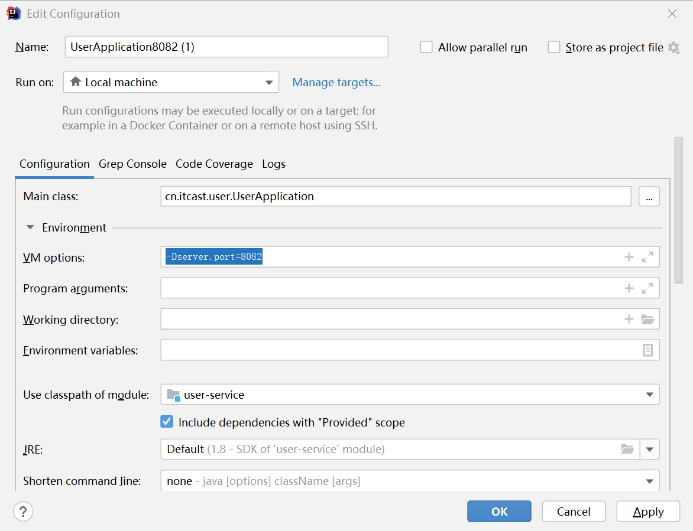
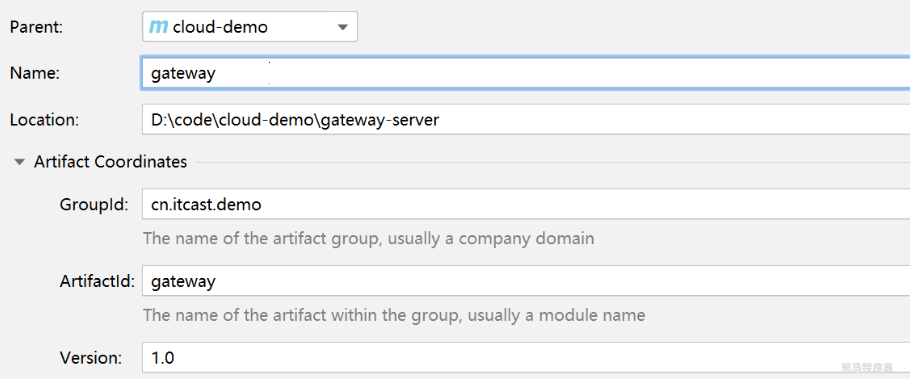
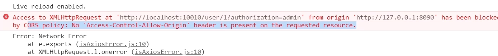

# 问题记录

常见的注册中心的：Eureka，zookeeper，nacos


# 学习重点


# 待归档区


# 1-认识微服务

## 1.1-微服务特性

- **高内聚、低耦合**: 微服务架构倡导将系统拆分为小型、独立的服务单元，每个服务单元都专注于特定的业务功能。通过合理的拆分和设计，可以实现高内聚、低耦合的服务单元，提高代码的可维护性和可复用性。
- **服务自治性:** 微服务是独立的、自治的服务单元，每个微服务都有自己的代码和数据存储。拆分微服务时，需要确保每个服务可以独立开发、测试、部署和进行扩展，避免服务之间的强依赖和影响。
- **异步通信和事件驱动**: 微服务通常通过异步消息队列等方式实现服务之间的解耦和异步通信。通过采用事件驱动的方式，微服务可以更好地响应和处理不同服务之间的消息和事件，提高系统的可伸缩性和可靠性。
- **平级服务**，消息队列，（异步，如学习服务调积分服务），上级调下级服务，远程调用（同步）如：学习服务调用用户服务，
- **容错和故障隔离**：微服务架构鼓励使用容错机制和故障隔离策略，以保障整个系统的稳定性和可用性。通过引入容错设计、限流、熔断等机制，可以防止单个服务的故障对整个系统造成影响。

## 1.2微服务知识体系

### 1.2.1知识体系概述

**微服务是一个概念，不是一门技术，SpringCloud是一种微服务技术的落地。不等价于微服务**

微服务是分布式架构演变来的架构，比分布式架构的拆分颗粒度更细。


- 服务集群：多台服务器共同对外提供服务，外界看起来就好像一台服务器，后台的这些服务器称为服务集群
- 注册中心：解决服务与服务之间的调用关系【拉取或注册服务信息】
- 配置中心：解决统一配置的问题【拉取配置信息 】
- 服务网关：解决用户统一访问问题【请求路由，负载均衡】 
- 分布式缓存：减轻数据库压力，<font color='blue'>微服务体系中最薄弱的环节，就是数据库</font>
- 分布式搜索：优化分布式搜索ES
- 分布式日志服务：<font color='blue'>有哪些成熟的框架</font>
- 系统监控：链路追踪
- 自动化上部署：Jenkeins【运维向】
- 容器化技术：docker【隔离功能】
- 容器编排技术：k8s，rancher（<font color='blue'>这是什么技术？</font>）

### 1.2.2学习路径

#### 1.2.2.1微服务治理

注册发现

远程调用

配置管理

网关路由

#### 1.2.2.2Docker技术

Docker使用

Dockerfile

DockerCompose

#### 1.2.2.3异步通信

MQ消息队列

SrpingAMQO

消息堆积问题

数据持久化

#### 1.2.2.4分布式缓存

Redis数据结构

SpringDataRedis

缓存穿透，雪崩

#### 1.2.2.5分布式搜索

DSL语句

RestAPI

ES集群状态

#### 1.2.2.6微服务保护

流量控制

系统保护

熔断降级

服务授权

#### 1.2.2.7分布式事务

分布式事务

TCC模型

AT模型

Seata

#### 1.2.2.8多级缓存

OpenResty

多级缓存

缓存数据同步

Nginx本地缓存

#### 1.2.2.9Redis集群

数据持久化

Redis主从复制

Lua脚本

Redis集群

#### 1.2.2.10可靠消息服务

消息可靠性

镜像集群

延迟队列

消息幂等性

## 1.3分布式架构

### 1.3.1单体与分布式

单体应用的优缺点


分布式架构的优缺点

- 优点：
  - 降低服务耦合
  - 有利于服务升级和拓展
- 缺点：
  - 服务调用关系错综复杂

### 1.3.2服务治理

分布式架构在拆分服务时需要考虑的问题

- 服务拆分粒度如何
- 服务集群机制如何维护
- 服务之间如何远程调用
- 服务健康状态如何感知

<font color='blue'>超时等待服务造成服务雪崩的问题</font>

## 1.4微服务

- 单一职责：微服务拆分粒度更小，每一个服务都对应唯一的业务能力，做到单一职责。
- 面向服务：微服务对外暴露业务接口（controller），服务提供统一接口，与语言技术无关

- 自治：团队独立，技术独立，数据独立，部署独立

- 隔离性强：服务调用做好隔离，容错，降级，避免出现级联问题。<font color='blue'>什么叫级联问题</font>

微服务的特性其实是在给分布式架构指定一个标准，进一步降低服务之间的耦合度，提供服务的独立性和灵活性，做到高内聚，低耦合。

**微服务**是一种经过良好架构设计的**分布式架构方案**

全球互联网公司都在尝试自己的微服务落地方案，Java领域最引人注目的就是SpringCloud提供的方案

## 1.5SpringCloud

> 官网地址：https://spring.io/projects/spring-cloud

SpringCloud集成了各种微服务功能组件，并且基于SpringBoot实现了这些组件的自动装配，从而提供了良好的开箱即用体验。

<font color='red'>注意：SpringCloud与SpringBoot版本兼容关系</font>


### 1.5.1SpringCloud常见组件


### 1.5.2现有微服务技术对比

#### ①SpringCloud+Feign

> 当前项目使用

- 使用SpringCloud技术栈
- 服务接口采用Restful风格
- 服务调用采用Feign方式

#### ②SpringCloudAlibaba+Feign

- 使用SpringCloudAlibaba技术栈
- 服务接口采用Restful风格服务
- 调用采用Feign方式

#### ③SpringCloudAlibaba+Dubbo

- 使用SpringCloudAlibaba技术栈
- 服务接口采用Dubbo协议标准
- 服务调用采用Dubbo方式

#### ④Dubbo原始模式

- 基于Dubbo老日技术体系
- 服务接口采用Dubbo协议标准
- 服务调用采用Dubbo方式


## 1.6-微服务版本史

**当前项目使用的版本号**

```
spring-boot:2.7.2
spring-cloud:2021.0.3
spring-cloud-alibaba:2021.0.1.0
jdk:11
mysql:8.0.23
```


# 2服务拆分与远程调用

## 2.1服务拆分原则

- 不同微服务，不要重复开发相同业务
- 微服务数据独立，不要访问其他微服务的数据库
- 微服务可以将自己的业务暴露成接口，供其他微服务调用

## 2.2入门案例

### 2.2.1引入项目

**项目概述**


cloud-demo：父工程，管理依赖

- order-service：订单微服务，负责订单相关业务
- user-service：用户微服务，负责用户相关业务

要求

- 订单微服务和用户微服务都必须要有各自的数据库，相互独立
- 订单微服务和用户服务都对外暴露Restful的接口
- 订单服务如果需要查询用户信息，只能调用用户的Restful接口，不能查询用户数据库

> 项目启动，分别访问接口测试功能正常

### 2.2.2注册RestTemplate

在order-service中注入RestTemplate实例

```java
package cn.itcast.order;

import com.netflix.loadbalancer.IRule;
import com.netflix.loadbalancer.RandomRule;
import org.mybatis.spring.annotation.MapperScan;
import org.springframework.boot.SpringApplication;
import org.springframework.boot.autoconfigure.SpringBootApplication;
import org.springframework.cloud.client.loadbalancer.LoadBalanced;
import org.springframework.context.annotation.Bean;
import org.springframework.web.client.RestTemplate;

@MapperScan("cn.itcast.order.mapper")
@SpringBootApplication
public class OrderApplication {

    public static void main(String[] args) {
        SpringApplication.run(OrderApplication.class, args);
    }
    @Bean
    public RestTemplate restTemplate(){
        return new RestTemplate();
    }
}
```

### 2.2.3实现远程调用

远程调用实现：

​	注入RestTempalte，发起RestFul风格进行远程调用

> tempalate一般是工具类

在order-service的service中利用RestTemplate调用user-service中的查询用户接口

```java
public Order queryOrderById(Long orderId) {
    // 1.查询订单
    Order order = orderMapper.findById(orderId);
    String url = "http://localhost:8081/user/"+order.getUserId();
    User user = restTemplate.getForObject(url, User.class);
    order.setUser(user);
    // 4.返回
    return order;
}
```

> 测试功能，访问order的接口，查看返回JSON是否包括user信息

### 2.2.4RestTemplate详解

- 使用RestTemplate.getForObject()进行远程调用

- <font color='blue'>RestTemplate时Spring提供的工具类，阅读其常见方法，理解User.class的作用，详细解释其原理</font>
- RestTemplate并不是只在微服务中使用，是一个发起http请求的工具类

用于执行HTTP请求，通过底层HTTP客户端库（如JDK HttpURLConnection Apache HttpComponents等）公开简单的模板方法API。

RestTemplate通过HTTP方法提供常见方案的模板，以及支持不太常见情况的通用exchange和execute方法。

注意：从<font color='red'>Spring5.0</font>开始，此类处于维护模式`maintenance mode`，考虑使用`org.springframework.web.reactive.client.WebClient`具有更现代的API并支持同步、异步和流式处理方案

<font color='blue'>WebClient的功能？在后续的学习的新内容是否使用WebClient还是延续使用RestTemplate？？？</font>

#### JDK版本、SpringBoot版本、Spring版本

SpringBoot3.x版本要求JDK17，如果是JDK1.8就会报错。JDK1.8使用SpringBoot2.7.8版本

查看spring各个版本之间的对应关系。https://start.spring.io/actuator/info

spring5.x：2018年至今，2017年发布的Spring5.0版本

<font color='red'>springCloud对依赖的版本要求很严</font>

#### RestTempalte.getForObject方法

```java
@Override
@Nullable
public <T> T getForObject(String url, Class<T> responseType, Object... uriVariables) throws RestClientException {
    RequestCallback requestCallback = acceptHeaderRequestCallback(responseType);
    HttpMessageConverterExtractor<T> responseExtractor =
            new HttpMessageConverterExtractor<>(responseType, getMessageConverters(), logger);
    //RestTempalte.execute=>RestTempalte.doExecute=>ClientHttpResponse.execute
    return execute(url, HttpMethod.GET, requestCallback, responseExtractor, uriVariables);
}
```

ClientHttpRequest对象：用来表示客户端HTTP请求，通过ClientHttpRequestFactory创建。

### 2.2.5提供者与消费者

在服务调用关系，会有两个不同的角色

**服务提供者（provider）：**一次业务中，被其它微服务调用的服务（提供接口给其他服务）

**服务消费者（consumer）：**一次业务中，调用其他微服务的服务。（调用其它微服务提供接口）


# 3-Eureka

## 3.1远程调用中存在的问题

- order-service在发起远程调用的时候，该如何得知uer-service实例的ip地址和端口
- 有多个user-service实例地址，order-service调用时该如何选择
- order-service如何得知某个user-service实例是否健康，是不是已经宕机了

## 3.2Eureka的作用与结构

<font color='blue'>Eureka注册信息如何进行存储的数据结构，服务提供者实现注册的具体实现，消费者拉取配置信息的具体实现</font>

<font color='blue'>消费者多久去拉取最新的提供者信息？？</font>

<font color='blue'>心跳间隔过长，此段时间内服务宕机了，如何解决？CAP定理</font>


Eureka架构中，微服务角色有两类：

- EurekaServer：服务端，注册中心
  - 记录服务信息
  - 心跳监控
- EurakeClient：客户端
  - Provider：服务提供者，例如案例中user-service
    - 注册自己的信息到EurekaServer
    - 每隔30秒向EurekaServer发送心跳（一个http请求）
  - Consumer：服务消费，例如案例中order-service
    - 根据服务名称从EurekaServer拉取服务列表
    - 基于服务列表做负载均衡，选中一个微服务后发起远程调用

## 3.3eureka注册中心【服务端】

### 3.3.1创建项目，引入依赖

```xml
<dependencies>
    <!--SpringBootWeb的起步依赖-->
    <dependency>
        <groupId>org.springframework.boot</groupId>
        <artifactId>spring-boot-starter-web</artifactId>
    </dependency>
    <!--Eureka服务端的起步依赖-->
    <dependency>
        <groupId>org.springframework.cloud</groupId>
        <artifactId>spring-cloud-starter-netflix-eureka-server</artifactId>
    </dependency>
</dependencies>
```

### 3.3.2编写启动类，添加注解

在eureka-server模块中编写启动类，添加@EnableEurekaServer注解，开启Eureka的注册中心功能

```java
package cn.itcast.eurakeservice;

import org.springframework.boot.SpringApplication;
import org.springframework.boot.autoconfigure.SpringBootApplication;
import org.springframework.cloud.netflix.eureka.server.EnableEurekaServer;

@SpringBootApplication
//添加@EnableEurekaServer注解，开启Eureka的注册中心功能
@EnableEurekaServer
public class EurekaApplication {
    public static void main(String[] args){
        SpringApplication.run(EurekaApplication.class,args);
    }
}
```

### 3.3.3添加配置文件yml

<font color='red'>spring.application.name在微服务项目中很重要！</font>

```yml
server:
  port: 10086
spring:
  application:
    name: eurakeserver #在微服务项目中名字很重要
eureka:
  client:
    service-url:
      defaultZone: http://127.0.0.1:10086/eureka
```

> `eureka.client.service-url`配置文件要求是一个`Map`类型，配置defaultZone时没有提示

### 3.3.4启动服务

> 访问eureka服务地址：http://127.0.0.1:10086/eureka


通过浏览器查看eureka的管理控制台

## 3.4服务注册

将user-service【服务提供者】注册到eureka-service中

### 3.4.1引入依赖

引入eurek-client依赖

```xml
<dependency>
    <groupId>org.springframework.cloud</groupId>
    <artifactId>spring-cloud-starter-netflix-eureka-client</artifactId>
</dependency>
```

### 3.4.2修改配置

修改配置文件，添加服务名称，eureka服务端地址

```yml
spring:
  application:
    name: userservice
eureka:
  client:
    service-url:
      defaultZone: http://127.0.0.1:10086/eureka
```

### 3.4.5启动多个实例

在Edit Configuration=>Environment=>VM options中指定虚拟参数

```
-Dserver.port=8082
```



## 3.5服务发现

在order-service中逻辑修改，向eureka-server拉取user-service信息，实现服务发现

### 3.5.1引入依赖

```xml
<dependency>
    <groupId>org.springframework.cloud</groupId>
    <artifactId>spring-cloud-starter-netflix-eureka-client</artifactId>
</dependency>
```

### 3.5.2配置文件

```yml
spring:
  application:
    name: userservice
eureka:
  client:
    service-url:
      defaultZone: http://127.0.0.1:10086/eureka
```

### 3.5.3服务拉取和负载均衡

需要去eureka-server中拉取user-service服务的实例列表，并且实现负载均衡，使用注解实现

<font color='red'>给RestTemplate这个Bean添加一个@LoadBalanced注解</font>

```java
package cn.itcast.order;

import com.netflix.loadbalancer.IRule;
import com.netflix.loadbalancer.RandomRule;
import org.mybatis.spring.annotation.MapperScan;
import org.springframework.boot.SpringApplication;
import org.springframework.boot.autoconfigure.SpringBootApplication;
import org.springframework.cloud.client.loadbalancer.LoadBalanced;
import org.springframework.context.annotation.Bean;
import org.springframework.web.bind.annotation.RestController;
import org.springframework.web.client.RestTemplate;

@MapperScan("cn.itcast.order.mapper")
@SpringBootApplication
public class OrderApplication {

    public static void main(String[] args) {
        SpringApplication.run(OrderApplication.class, args);
    }
    @Bean
    @LoadBalanced
    public RestTemplate restTemplate(){
        return new RestTemplate();
    }

}
```

# 4-Ribbon负载均衡


### Ribbon组件


### 源码追溯

<font color='blue'>自己怎么debug调用查看ribbon流程</font>

<font color='blue'>IDEA怎么快捷键DEBUG</font>

<font color='blue'>老师打断点的思路，断点达到哪里</font>


追溯源码，做一个流程图，附上源码，

<font color='blue'>修改负载均衡策略在消费者处修改？？为什么？追溯下源码，或者问老师</font>

修改负载均衡策略的两种方式


Ribbon的除了轮询以外的策略，追溯源码

<font color='blue'>Nginx的原理？？</font>

手写负载均衡拦截器？能行吗


Ribbon的懒加载

​	修改配置，将默认的懒加载改为饥饿加载，指饥饿加载的服务（数组，多个服务。）

​	-yml中写一个集合。。<font color='blue'>猜测可以修改数组格式</font>

# 5-Nacos


## 5.1-Nacos简介

Nacos是阿里巴巴的产品，现在是SpringCloud的一个组件

nacos默认集群启动


## 5.2-NacosQuickStart


## 5.3-Nacos注册中心

Nacos服务分级存储模型


服务跨集群调用的问题


配置文件中配置服务所属集群

​	查看注册成功，查看集群配置，<font color='blue'>查看NacosRule的负载均衡策略的具体实现，源码实现</font>

配置提供者所属不同集群，进行测试

​	需要配置负载均衡的规则，<font color='blue'>为什么要在消费者配置负载均衡？？？</font>

Nacos的权重配置0-1之间

​	nacos可以配置文件配置权重吗

CAP定理

AP可用性，分区容错性，

CP实时性，分区容错性

Eureka支持AP，Nacos支持AP，CP

## Nacos的临时实例，与非临时实例的配置实现，

<font color='blue'>非临时实例心跳不正常不被剔除？？？然后怎么处理？？？</font>


<font color='blue'>@ConfigurationProperties怎么使用？？这个写配置类岂不是更好？？之前怎么写的，其他框架都是怎么写的</font>


<font color='blue'>druid数据连接池也是懒加载的？？？</font>


## 5.4-Nacos配置管理

Nacos除了可以做注册中心，同样可以做配置中心来管理配置

### 1.1统一配置管理

当微服务部署的实例越来越多，达到数十、数百个时。逐个修改工作量巨大，且容易出错，因此需要一种统一配置管理方案，可以集中管理所有实例的配置。

**Nacos的配置中心**


<font color='blue'>配置变更通知如何实现？？微服务实例拉取配置如何实现？？具体的工作流程，方法</font>

<font color='red'>Nacos一方面可以将配置集中管理，另一方面可以配置变更时，及时通知微服务，实现配置的热更新</font>

### 1.1.1Nacos中添加配置文件


**注意：**项目的核心配置且需要的热更新的配置才有放到nacos管理的必要。基本不会变更的配置还是保存到微服务本地比较好。

### 1.1.2项目本地配置

微服务需要拉取nacos中管理的配置，并且与本地的application.yml配置合并，才能完成项目启动。

但是项目启动需要nacos的配置文件，获取nacos地址又需要项目启动加载配置文件。=>相互依赖

spring引入了一种新的配置文件，bootstrap.yaml，会在application之前读取。流程如下


**操作过程**

（1）引入依赖

```xml
<!--nacos配置管理依赖-->
<dependency>
    <groupId>com.alibaba.cloud</groupId>
    <artifactId>spring-cloud-starter-alibaba-nacos-config</artifactId>
</dependency>
```

（2）添加bootstrap.yaml文件

在user-service中添加bootstrap.yaml文件

```yml
spring:
  application:
    name: userservice #服务名称
  profiles:
    active: dev #dev开发环境
  cloud:
    nacos:
      server-addr: localhost:8848 #Nacos服务地址
      config:
        file-extension: yaml #文件后缀名
```

bootstrp.yaml优先级最高，<font color='red'>bootstrap.yaml与依赖nacos.config配合使用，如果加了依赖，没有bootstrap.yml会启动失败。</font>

### 1.1.3拉取配置流程分析

（1）依据`bootstrap.yaml`中的`spring.cloud.nacos.server-addr`来获取nacos来获取nacos地址

（2）依据${spring.application.name}-${spring.profiles.active}.${spring.cloud.nacos.config.file-extension}

拼装出文件id，读取远程配置。=>示例中读取Nacos配置列表中`userservice-dev.yaml`配置文件

**测试：**测试nacos配置信息是否加载成功

nacos配置列表中`userservice-dev.yaml`文件

```yml
pattern:
  dateformat: 开发环境
```

> 利用@Value（"${配置文件的key}"）来读取配置信息

```java
@Slf4j
@RestController
@RequestMapping("/user")
@RefreshScope //加注解
public class UserController {

    @Value("${pattern.dateformat}")
    private String dateformat;
 
    @GetMapping("/format")
    public String test (){
        return dateformat;
    }
}
```


### 1.2配置热更新

目的：服务不重启，也可以让配置生效。

<font color='blue'>热更新的具体实现</font>

实现配置热更新的两种方式

### 1.3.1方式一【@Value+@RefreshScope】

@RefreshScope+@Value注解进行实现

在@Value注入的变量所在类上添加注解@RefreshScope

```java
@Slf4j
@RestController
@RequestMapping("/user")
@RefreshScope //热刷新注解
public class UserController {

    @Value("${pattern.dateformat}")
    private String dateformat;
   return userService.queryById(id);
    }
    @GetMapping("/format")
    public String test (){    
        return dateformat;
    }
}
```

<font color='blue'>@RefreshScope的原理</font>

### 1.3.2方式二【@ConfigurarionProperties】

@ConfigurarionProperties（prefix= " 前缀名"）注解【无需@RefreshScope】

**配置属性类**

```java
package cn.itcast.user.config;

import lombok.Data;
import org.springframework.boot.context.properties.ConfigurationProperties;
import org.springframework.stereotype.Component;

@Data
@Component
@ConfigurationProperties(prefix = "pattern")
public class PatternProperties {
    private String dateformat;
}
```

**userservice的控制层**

```java
@Slf4j
@RestController
@RequestMapping("/user")
//@RefreshScope //热刷新注解
public class UserController {
    @Resource
    private PatternProperties patternProperties;
    @GetMapping("/format")
    public String test (){
        return patternProperties.getDateformat();
    }
}
```

<font color='blue'>@ConfigurarionProperties热刷新的原理</font>

<font color='blue'>c.a.n.client.config.impl.ClientWorker，c.a.nacos.client.config.impl.CacheData，追踪日志，尝试复原工作流程</font>


### 1.3配置共享

在nacos中添加配置userservice.yaml


### 1.4配置优先级

<font color='blue'>补充虚拟参数优先级问题</font>

### 1.5nacos集群配置


# 6-Feign【http远程调用组件】

feign属不属于RPC比较有争议

dubbo没有争议属于RPC调用

RestTemplate远程调用的代码，不符合现有风格，编程风格不统一，硬编码

<font color='blue'>折叠大段注释</font>

<font color='blue'>打断点查看调用过程，看看接口生成了什么实现</font>

<font color='blue'>ClientsDefault不支持连接池，看看其他的具体实现</font>

## 2.1Feign替代Template

### 2.1.1操作过程

**1引入依赖**

```xml
<!--feign的依赖-->
<dependency>
    <groupId>org.springframework.cloud</groupId>
    <artifactId>spring-cloud-starter-openfeign</artifactId>
</dependency>
```

**2启动类添加注解@EnableFeignClients**

```java
@MapperScan("cn.itcast.order.mapper")
@SpringBootApplication
@EnableFeignClients //开启FeignClient客户端
public class OrderApplication {

    public static void main(String[] args) {
        SpringApplication.run(OrderApplication.class, args);
    }
}
```

**3编写Feign的客户端**

> 注意是接口
>
> 标记@FeignClient（”服务提供者名字“)
>
> 要在这个接口根据请求地址、请求方式、参数、响应值完成接口的定义

```java
/**
 *  Feign风格的调用userservice的客户端
 */
@FeignClient("userservice")
public interface UserClient {
    //调用的userservice的方法-路径-user/{id}
    @GetMapping("/user/{id}")
    public User queryById(@PathVariable("id") Long id);
}
```

**4修改order-service中的服务层**

>  通过依赖注入的方式注入定义好的接口，User user = userClient.queryById(order.getUserId());=>优雅的调用服务

```java
@Service
public class OrderService {
    @Autowired
    private OrderMapper orderMapper;
    @Resource
    private UserClient userClient;
    public Order queryOrderById(Long orderId) {
        Order order = orderMapper.findById(orderId);
        //使用Feign风格的UserClient
        User user = userClient.queryById(order.getUserId());
        order.setUser(user);
        return order;
    }
}
```

### 2.1.2@FeignClient详解

推测标记了这个注解的接口，怎么生成的代理对象。

### 2.1.3@EnableFeignClients详解


## 2.2自定义配置

Feign可以支持很多的自定义配置，如下表所示

| 类型                   | 作用             | 说明                                                   |
| ---------------------- | ---------------- | ------------------------------------------------------ |
| **feign.Logger.Level** | 修改日志级别     | 包含四种不同的级别：NONE，BASIC、HEADERS、FULL         |
| feign.codec.Decoder    | 响应结果的解析器 | http远程调用的结果做解析，例如解析json字符串为java对象 |
| feign.coderc.Encoder   | 请求参数编码     | 将请求编码，便于通过http请求发送                       |
| feign.Contarct         | 支持的注解格式   | 默认是SpringMVC的注解                                  |
| feign.Retryer          | 失败重试机制     | 请求失败的重试机制，默认没有，不过会使用Ribbon的重试   |

一般情况下，默认值就能满足我们使用，如果要自定义时，只需要创建自定义的@Bean覆盖默认Bean即可。

<font color='blue'>日志过多影响性能？？？</font>

### 2.2.1日志配置【配置文件方式】

日志的四种级别

- NONE：不记录任何日志信息，这是默认值
- BASIC：仅记录请求的方法，URL以及响应状态码和执行时间
- HEADERS：在BASIC的基础上，额外记录了请求和响应的信息
- FULL：记录所有请求和响应的明细，包括头信息，请求体，元数据。

<font color='blue'>元数据</font>

### 2.2.3日志配置【Java代码方式】


## 2.3性能优化

日志最好设置为BASIC

默认的客户端修改为支持连接池的客户端

<font color='blue'>做一个简单的压力测试</font>

## 2.4最佳实践

在项目中更好的使用Feign

### 方式1：继承

统一接口，面向契约的编程思想

服务紧耦合

@PathVariable不会被继承


### 方式2：抽取


# 7-Gateway

## 7.1-Gateway简介

### 7.1.1-网关简介

Gateway网关是我们服务的守门神，所有微服务的统一入口。


网关的**核心功能特性**：

**权限控制**：网关作为微服务入口，需要校验用户是是否有请求资格，如果没有则进行拦截。可以过滤器中。

**路由和负载均衡**：一切请求都必须先经过gateway，但网关不处理业务，而是根据某种规则，把请求转发到某个微服务，这个过程叫做路由。当然路由的目标服务有多个时，还需要做负载均衡。

**限流**：当请求流量过高时，在网关中按照下流的微服务能够接受的速度来放行请求，避免服务压力过大。

### 7.1.2-API网关选型


在SpringCloud中网关的实现包括两种：

- gateway
- zuul

Zuul是基于Servlet的实现，属于阻塞式编程。而SpringCloudGateway则是基于Spring5中提供的WebFlux，属于响应式编程的实现，具备更好的性能

> # WebFlux 简介
>
> WebFlux 是 Spring Framework5.0 中引入的一种新的反应式Web框架。通过Reactor项目实现Reactive Streams规范，完全异步和非阻塞框架。本身不会加快程序执行速度，但在高并发情况下借助异步IO能够以少量而稳定的线程处理更高的吞吐，规避文件IO/网络IO阻塞带来的线程堆积。
>
> # WebFlux 的特性
>
> - **异步非阻塞** - 可以举一个上传例子。相对于 Spring MVC 是同步阻塞IO模型，Spring WebFlux这样处理：线程发现文件数据没传输好，就先做其他事情，当文件准备好时通知线程来处理（这里就是输入非阻塞方式），当接收完并写入磁盘（该步骤也可以采用异步非阻塞方式）完毕后再通知线程来处理响应（这里就是输出非阻塞方式）。
> - **响应式函数编程** - 相对于Java8 Stream 同步、阻塞的Pull模式，Spring Flux 采用Reactor Stream 异步、非阻塞Push模式。书写采用 Java lambda 方式,接近自然语言形式且容易理解。
> - **不拘束于Servlet** - 可以运行在传统的Servlet 容器（3.1+版本），还能运行在Netty、Undertow等NIO容器中。
>
> 详情见于spring中的spring WebFlux


## 7.2-Gateway快速入门

### 1）创建gateway服务，引入依赖

创建服务：



引入依赖：

```xml
<!--网关-->
<dependency>
    <groupId>org.springframework.cloud</groupId>
    <artifactId>spring-cloud-starter-gateway</artifactId>
</dependency>
<!--nacos服务发现依赖-->
<dependency>
    <groupId>com.alibaba.cloud</groupId>
    <artifactId>spring-cloud-starter-alibaba-nacos-discovery</artifactId>
</dependency>
```


### 2）编写启动类

```java
package cn.itcast.gateway;

import org.springframework.boot.SpringApplication;
import org.springframework.boot.autoconfigure.SpringBootApplication;

@SpringBootApplication
public class GatewayApplication {

	public static void main(String[] args) {
		SpringApplication.run(GatewayApplication.class, args);
	}
}
```


### 3）编写基础配置和路由规则

创建application.yml文件，内容如下：

```yaml
server:
  port: 10010 # 网关端口
spring:
  application:
    name: gateway # 服务名称
  cloud:
    nacos:
      server-addr: localhost:8848 # nacos地址
    gateway:
      routes: # 网关路由配置
        - id: user-service # 路由id，自定义，只要唯一即可
          # uri: http://127.0.0.1:8081 # 路由的目标地址 http就是固定地址
          uri: lb://userservice # 路由的目标地址 lb就是负载均衡，后面跟服务名称
          predicates: # 路由断言，也就是判断请求是否符合路由规则的条件
            - Path=/user/** # 这个是按照路径匹配，只要以/user/开头就符合要求
```


我们将符合`Path` 规则的一切请求，都代理到 `uri`参数指定的地址。

本例中，我们将 `/user/**`开头的请求，代理到`lb://userservice`，lb是负载均衡，根据服务名拉取服务列表，实现负载均衡。


### 4）重启测试

重启网关，访问http://localhost:10010/user/1时，符合`/user/**`规则，请求转发到uri：http://userservice/user/1，得到了结果：


### 5）网关路由的流程图

整个访问的流程如下：


总结：

网关搭建步骤：

1. 创建项目，引入nacos服务发现和gateway依赖

2. 配置application.yml，包括服务基本信息、nacos地址、路由

路由配置包括：

1. 路由id：路由的唯一标示

2. 路由目标（uri）：路由的目标地址，http代表固定地址，lb代表根据服务名负载均衡

3. 路由断言（predicates）：判断路由的规则，

4. 路由过滤器（filters）：对请求或响应做处理


接下来，就重点来学习路由断言和路由过滤器的详细知识

## 7.3-断言工厂

> 十几个路由断言？？？

我们在配置文件中写的断言规则只是字符串，这些字符串会被Predicate Factory读取并处理，转变为路由判断的条件

例如Path=/user/**是按照路径匹配，这个规则是由

`org.springframework.cloud.gateway.handler.predicate.PathRoutePredicateFactory`类来

处理的，像这样的断言工厂在SpringCloudGateway还有十几个:

| **名称**   | **说明**                       | **示例**                                                     |
| ---------- | ------------------------------ | ------------------------------------------------------------ |
| After      | 是某个时间点后的请求           | -  After=2037-01-20T17:42:47.789-07:00[America/Denver]       |
| Before     | 是某个时间点之前的请求         | -  Before=2031-04-13T15:14:47.433+08:00[Asia/Shanghai]       |
| Between    | 是某两个时间点之前的请求       | -  Between=2037-01-20T17:42:47.789-07:00[America/Denver],  2037-01-21T17:42:47.789-07:00[America/Denver] |
| Cookie     | 请求必须包含某些cookie         | - Cookie=chocolate, ch.p                                     |
| Header     | 请求必须包含某些header         | - Header=X-Request-Id, \d+                                   |
| Host       | 请求必须是访问某个host（域名） | -  Host=**.somehost.org,**.anotherhost.org                   |
| Method     | 请求方式必须是指定方式         | - Method=GET,POST                                            |
| Path       | 请求路径必须符合指定规则       | - Path=/red/{segment},/blue/**                               |
| Query      | 请求参数必须包含指定参数       | - Query=name, Jack或者-  Query=name                          |
| RemoteAddr | 请求者的ip必须是指定范围       | - RemoteAddr=192.168.1.1/24                                  |
| Weight     | 权重处理                       |                                                              |

> Java8中的断言函数，Spring Cloud Gateway中的断言函数输入类型是 Spring5.0框架中的ServerWebExchange。Spring Cloud Gateway中的断言函数允许开发者去定义匹配 来自http Request中的任何信息，比如请求头和参数等

我们只需要掌握Path这种路由工程就可以了。

## 7.4-过滤器工厂

GatewayFilter是网关中提供的一种过滤器，可以对进入网关的请求和微服务返回的响应做处理：


### 3.4.1.路由过滤器的种类

Spring提供了31种不同的路由过滤器工厂。例如：

| **名称**             | **说明**                     |
| -------------------- | ---------------------------- |
| AddRequestHeader     | 给当前请求添加一个请求头     |
| RemoveRequestHeader  | 移除请求中的一个请求头       |
| AddResponseHeader    | 给响应结果中添加一个响应头   |
| RemoveResponseHeader | 从响应结果中移除有一个响应头 |
| RequestRateLimiter   | 限制请求的流量               |


### 3.4.2.请求头过滤器

下面我们以AddRequestHeader 为例来讲解。

> **需求**：给所有进入userservice的请求添加一个请求头：Truth=itcast is freaking awesome!


只需要修改gateway服务的application.yml文件，添加路由过滤即可：

```yaml
spring:
  cloud:
    gateway:
      routes:
      - id: user-service 
        uri: lb://userservice 
        predicates: 
        - Path=/user/** 
        filters: # 过滤器
        - AddRequestHeader=Truth, Itcast is freaking awesome! # 添加请求头
```

当前过滤器写在userservice路由下，因此仅仅对访问userservice的请求有效。


### 3.4.3.默认过滤器

如果要对所有的路由都生效，则可以将过滤器工厂写到default下。格式如下：

```yaml
spring:
  cloud:
    gateway:
      routes:
      - id: user-service 
        uri: lb://userservice 
        predicates: 
        - Path=/user/**
      default-filters: # 默认过滤项
      - AddRequestHeader=Truth, Itcast is freaking awesome! 
```


### 3.4.4.总结

过滤器的作用是什么？

① 对路由的请求或响应做加工处理，比如添加请求头

② 配置在路由下的过滤器只对当前路由的请求生效

defaultFilters的作用是什么？

① 对所有路由都生效的过滤器

## 7.5-全局过滤器

上一节学习的过滤器，网关提供了31种，但每一种过滤器的作用都是固定的。如果我们希望拦截请求，做自己的业务逻辑则没办法实现。

### 3.5.1.全局过滤器作用

> 利用@Order（）或接口Ordered实现指定顺序时，不要糊弄，

全局过滤器的作用也是处理一切进入网关的请求和微服务响应，与GatewayFilter的作用一样。区别在于GatewayFilter通过配置定义，处理逻辑是固定的；而GlobalFilter的逻辑需要自己写代码实现。

定义方式是实现GlobalFilter接口。

```java
public interface GlobalFilter {
    /**
     *  处理当前请求，有必要的话通过{@link GatewayFilterChain}将请求交给下一个过滤器处理
     *
     * @param exchange 请求上下文，里面可以获取Request、Response等信息
     * @param chain 用来把请求委托给下一个过滤器 
     * @return {@code Mono<Void>} 返回标示当前过滤器业务结束
     */
    Mono<Void> filter(ServerWebExchange exchange, GatewayFilterChain chain);
}
```


在filter中编写自定义逻辑，可以实现下列功能：

- 登录状态判断
- 权限校验
- 请求限流等


### 3.5.2.自定义全局过滤器

需求：定义全局过滤器，拦截请求，判断请求的参数是否满足下面条件：

- 参数中是否有authorization，

- authorization参数值是否为admin

如果同时满足则放行，否则拦截


实现：

在gateway中定义一个过滤器：

```java
package cn.itcast.gateway.filters;

import org.springframework.cloud.gateway.filter.GatewayFilterChain;
import org.springframework.cloud.gateway.filter.GlobalFilter;
import org.springframework.core.annotation.Order;
import org.springframework.http.HttpStatus;
import org.springframework.stereotype.Component;
import org.springframework.web.server.ServerWebExchange;
import reactor.core.publisher.Mono;

@Order(-1)
@Component
public class AuthorizeFilter implements GlobalFilter {
    @Override
    public Mono<Void> filter(ServerWebExchange exchange, GatewayFilterChain chain) {
        // 1.获取请求参数
        MultiValueMap<String, String> params = exchange.getRequest().getQueryParams();
        // 2.获取authorization参数
        String auth = params.getFirst("authorization");
        // 3.校验
        if ("admin".equals(auth)) {
            // 放行
            return chain.filter(exchange);
        }
        // 4.拦截
        // 4.1.禁止访问，设置状态码
        exchange.getResponse().setStatusCode(HttpStatus.FORBIDDEN);
        // 4.2.结束处理
        return exchange.getResponse().setComplete();
    }
}
```


### 3.5.3.过滤器执行顺序

请求进入网关会碰到三类过滤器：当前路由的过滤器、DefaultFilter、GlobalFilter

请求路由后，会将当前路由过滤器和DefaultFilter、GlobalFilter，合并到一个过滤器链（集合）中，排序后依次执行每个过滤器：


排序的规则是什么呢？

- 每一个过滤器都必须指定一个int类型的order值，**order值越小，优先级越高，执行顺序越靠前**。
- GlobalFilter通过实现Ordered接口，或者添加@Order注解来指定order值，由我们自己指定
- 路由过滤器和defaultFilter的order由Spring指定，默认是按照声明顺序从1递增。
- 当过滤器的order值一样时，会按照 defaultFilter > 路由过滤器 > GlobalFilter的顺序执行。


详细内容，可以查看源码：

`org.springframework.cloud.gateway.route.RouteDefinitionRouteLocator#getFilters()`方法是先加载defaultFilters，然后再加载某个route的filters，然后合并。


`org.springframework.cloud.gateway.handler.FilteringWebHandler#handle()`方法会加载全局过滤器，与前面的过滤器合并后根据order排序，组织过滤器链


## 7.6-跨域问题

> <font color='blue'>浏览器怎么写代码</font>
>
> 跨域问题，超过有效期，什么时候再次发请求（）
>
> 跨域问题只是在浏览器中，
>
> <font color='blue'>前端也能解决跨域问题？？？？</font>
>
> 多补充些其他的跨域解决方案
>
> 跨域问题的根本原因所在？？？

### 3.6.1.什么是跨域问题

跨域：域名不一致就是跨域，主要包括：

- 域名不同： www.taobao.com 和 www.taobao.org 和 www.jd.com 和 miaosha.jd.com

- 域名相同，端口不同：localhost:8080和localhost8081

跨域问题：浏览器禁止请求的发起者与服务端发生跨域ajax请求，请求被浏览器拦截的问题


解决方案：CORS，这个以前应该学习过，这里不再赘述了。不知道的小伙伴可以查看https://www.ruanyifeng.com/blog/2016/04/cors.html


### 3.6.2.模拟跨域问题

找到课前资料的页面文件：


放入tomcat或者nginx这样的web服务器中，启动并访问。

可以在浏览器控制台看到下面的错误：




从localhost:8090访问localhost:10010，端口不同，显然是跨域的请求。


### 3.6.3.解决跨域问题

在gateway服务的application.yml文件中，添加下面的配置：

```yaml
spring:
  cloud:
    gateway:
      # 。。。
      globalcors: # 全局的跨域处理
        add-to-simple-url-handler-mapping: true # 解决options请求被拦截问题
        corsConfigurations:
          '[/**]':
            allowedOrigins: # 允许哪些网站的跨域请求
              - "http://localhost:8090"
            allowedMethods: # 允许的跨域ajax的请求方式
              - "GET"
              - "POST"
              - "DELETE"
              - "PUT"
              - "OPTIONS"
            allowedHeaders: "*" # 允许在请求中携带的头信息
            allowCredentials: true # 是否允许携带cookie
            maxAge: 360000 # 这次跨域检测的有效期(秒)
```


# N附录

## N1-数据库准备

order-service使用数据库

```sql
/*
 Navicat Premium Data Transfer

 Source Server         : local
 Source Server Type    : MySQL
 Source Server Version : 50622
 Source Host           : localhost:3306
 Source Schema         : heima

 Target Server Type    : MySQL
 Target Server Version : 50622
 File Encoding         : 65001

 Date: 01/04/2021 14:57:18
*/

SET NAMES utf8mb4;
SET FOREIGN_KEY_CHECKS = 0;

-- ----------------------------
-- Table structure for tb_order
-- ----------------------------
DROP TABLE IF EXISTS `tb_order`;
CREATE TABLE `tb_order`  (
  `id` bigint(20) NOT NULL AUTO_INCREMENT COMMENT '订单id',
  `user_id` bigint(20) NOT NULL COMMENT '用户id',
  `name` varchar(100) CHARACTER SET utf8 COLLATE utf8_general_ci NULL DEFAULT NULL COMMENT '商品名称',
  `price` bigint(20) NOT NULL COMMENT '商品价格',
  `num` int(10) NULL DEFAULT 0 COMMENT '商品数量',
  PRIMARY KEY (`id`) USING BTREE,
  UNIQUE INDEX `username`(`name`) USING BTREE
) ENGINE = InnoDB AUTO_INCREMENT = 109 CHARACTER SET = utf8 COLLATE = utf8_general_ci ROW_FORMAT = Compact;

-- ----------------------------
-- Records of tb_order
-- ----------------------------
INSERT INTO `tb_order` VALUES (101, 1, 'Apple 苹果 iPhone 12 ', 699900, 1);
INSERT INTO `tb_order` VALUES (102, 2, '雅迪 yadea 新国标电动车', 209900, 1);
INSERT INTO `tb_order` VALUES (103, 3, '骆驼（CAMEL）休闲运动鞋女', 43900, 1);
INSERT INTO `tb_order` VALUES (104, 4, '小米10 双模5G 骁龙865', 359900, 1);
INSERT INTO `tb_order` VALUES (105, 5, 'OPPO Reno3 Pro 双模5G 视频双防抖', 299900, 1);
INSERT INTO `tb_order` VALUES (106, 6, '美的（Midea) 新能效 冷静星II ', 544900, 1);
INSERT INTO `tb_order` VALUES (107, 2, '西昊/SIHOO 人体工学电脑椅子', 79900, 1);
INSERT INTO `tb_order` VALUES (108, 3, '梵班（FAMDBANN）休闲男鞋', 31900, 1);

SET FOREIGN_KEY_CHECKS = 1;

```

user-service使用数据库

```sql
/*
 Navicat Premium Data Transfer

 Source Server         : local
 Source Server Type    : MySQL
 Source Server Version : 50622
 Source Host           : localhost:3306
 Source Schema         : heima

 Target Server Type    : MySQL
 Target Server Version : 50622
 File Encoding         : 65001

 Date: 01/04/2021 14:57:18
*/

SET NAMES utf8mb4;
SET FOREIGN_KEY_CHECKS = 0;

-- ----------------------------
-- Table structure for tb_user
-- ----------------------------
DROP TABLE IF EXISTS `tb_user`;
CREATE TABLE `tb_user`  (
  `id` bigint(20) NOT NULL AUTO_INCREMENT,
  `username` varchar(100) CHARACTER SET utf8 COLLATE utf8_general_ci NULL DEFAULT NULL COMMENT '收件人',
  `address` varchar(255) CHARACTER SET utf8 COLLATE utf8_general_ci NULL DEFAULT NULL COMMENT '地址',
  PRIMARY KEY (`id`) USING BTREE,
  UNIQUE INDEX `username`(`username`) USING BTREE
) ENGINE = InnoDB AUTO_INCREMENT = 109 CHARACTER SET = utf8 COLLATE = utf8_general_ci ROW_FORMAT = Compact;

-- ----------------------------
-- Records of tb_user
-- ----------------------------
INSERT INTO `tb_user` VALUES (1, '柳岩', '湖南省衡阳市');
INSERT INTO `tb_user` VALUES (2, '文二狗', '陕西省西安市');
INSERT INTO `tb_user` VALUES (3, '华沉鱼', '湖北省十堰市');
INSERT INTO `tb_user` VALUES (4, '张必沉', '天津市');
INSERT INTO `tb_user` VALUES (5, '郑爽爽', '辽宁省沈阳市大东区');
INSERT INTO `tb_user` VALUES (6, '范兵兵', '山东省青岛市');

SET FOREIGN_KEY_CHECKS = 1;

```

## N2-cloud-demo项目重点代码

User的Controller【对外提供服务的接口】

```java
package cn.itcast.user.web;

import cn.itcast.user.pojo.User;
import cn.itcast.user.service.UserService;
import lombok.extern.slf4j.Slf4j;
import org.springframework.beans.factory.annotation.Autowired;
import org.springframework.web.bind.annotation.*;

@Slf4j
@RestController
@RequestMapping("/user")
public class UserController {

    @Autowired
    private UserService userService;

    /**
     * 路径： /user/110
     *
     * @param id 用户id
     * @return 用户
     */
    @GetMapping("/{id}")
    public User queryById(@PathVariable("id") Long id) {
        return userService.queryById(id);
    }
}
```

```yml
server:
  port: 8081
spring:
  datasource:
    url: jdbc:mysql://localhost:3306/cloud_user?useSSL=false
    username: root
    password: 123
    driver-class-name: com.mysql.jdbc.Driver
mybatis:
  type-aliases-package: cn.itcast.user.pojo
  configuration:
    map-underscore-to-camel-case: true
logging:
  level:
    cn.itcast: debug
  pattern:
    dateformat: MM-dd HH:mm:ss:SSS
```

order-service的服务层

```java
package cn.itcast.order.service;

import cn.itcast.order.mapper.OrderMapper;
import cn.itcast.order.pojo.Order;
import org.springframework.beans.factory.annotation.Autowired;
import org.springframework.stereotype.Service;

@Service
public class OrderService {

    @Autowired
    private OrderMapper orderMapper;

    public Order queryOrderById(Long orderId) {
        // 1.查询订单
        Order order = orderMapper.findById(orderId);
        // 4.返回
        return order;
    }
}
```

配置文件

```yml
server:
  port: 8080
spring:
  datasource:
    url: jdbc:mysql://localhost:3306/cloud_order?useSSL=false
    username: root
    password: 123
    driver-class-name: com.mysql.jdbc.Driver
mybatis:
  type-aliases-package: cn.itcast.user.pojo
  configuration:
    map-underscore-to-camel-case: true
logging:
  level:
    cn.itcast: debug
  pattern:
    dateformat: MM-dd HH:mm:ss:SSS
```


