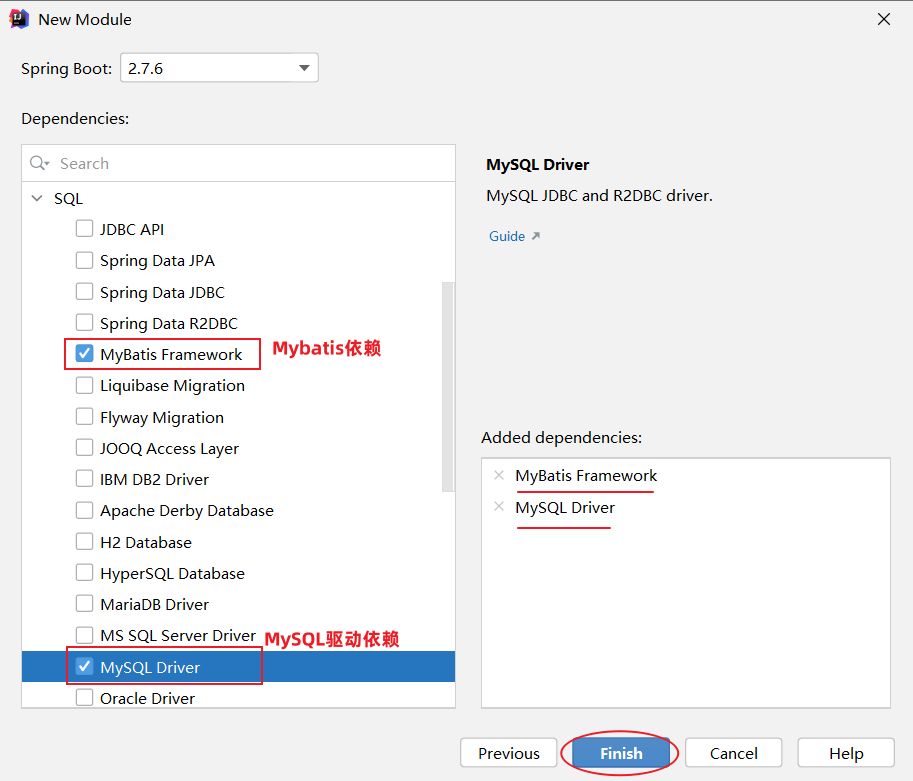
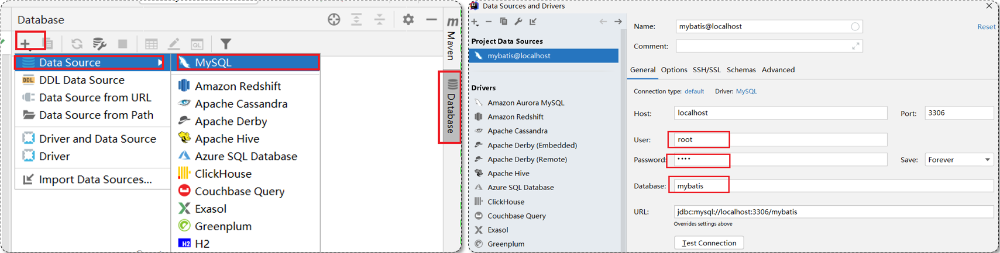

# 问题记录


# 待归档区

# MyBatis快速入门

什么是MyBtis?？

MyBatis是一款优秀的持久层框架，用于简化JDBC开发。

MyBatis本是Apache的一个开源项目iBatis，2010年这个项目由apache迁移到geogle code，并且更名w为MyBatis。2013年11月迁移到Github，

## 4.1开发过程

- 实体类User

```java
package com.itheima.entry;
public class User {
    private Integer id;
    private String name;
    private Integer age;
    private Integer gender;
    private String phone;
    //省略通用方法
}
```

- 持久层接口

```java
package com.itheima.dao;
import com.itheima.entry.User;
import org.apache.ibatis.annotations.Mapper;
import org.apache.ibatis.annotations.Select;
import java.util.List;
@Mapper
public interface UserMapper {
    @Select("SELECT * FROM user")
    public List<User> selectUser();
}
```

- application.properties配置文件

```properties
spring.datasource.driver-class-name=com.mysql.cj.jdbc.Driver
spring.datasource.url=jdbc:mysql://127.0.0.1:3306/cp_410_mybatis?useSSL=false
spring.datasource.username=root
spring.datasource.password=root
```

## 4.2单元测试

- 测试类

```java
package com.itheima;
import org.junit.jupiter.api.Test;
import org.springframework.beans.factory.annotation.Autowired;
import org.springframework.boot.test.context.SpringBootTest;
import java.util.List;
@SpringBootTest
public class UserMapperTest {
    @Autowired
    private UserMapper userMapper;
    @Test
    public void test(){
        List<User> userList = userMapper.selectUser();
        userList.forEach(System.out::println);
    }
}
```

- 测试结果


## 4.3总结


# 5JDBC介绍

JDBC的实践等到反射学完再写

JDBC：Java DataBase Connectivity，是Java提供的一套操作关系型数据库的接口，是JavaEE的13个规范之一

各大数据厂商


# 6数据库连接池

MyBatis的使用了数据库连接池技术，避免频繁的创建连接，销毁连接而连接带来的资源浪费。

## 6.1介绍


没有使用数据库连接池：

客户端执行SQL语句：要先创建一个新的连接对象，然后执行SQL语句，SQL语句执行后，又需要关闭连接对象从而释放资源，每次执行SQL时都需要创建连接，销毁连接，消耗计算机资源


数据库连接池是个容器，负责分配、管理数据库连接（Connection）

- 程序启动时，会在数据库连接池（容器）中，创建一定数量的Connection对象

允许应用程序重复使用一个现有的数据库连接，而不是再重新建立一个

- 客户端在执行SQL时，先从连接池中获取一个Connetion对象，然后执行SQL语句，SQL语句执行完之后，释放Connection时会把Connection对象归还给连接词（Connection对象可以复用）

释放空闲时间超过最大空闲时间的连接，来避免因为没有释放连接而引起的数据库连接泄露

- 客户端获取到Connection对象了，但是Connection对象并没有去访问数据库（处于空闲），数据库连接池发现Connection对象的空闲时间>连接池中预设的最大空闲时间，此时数据库连接池就会自动释放掉这个连接对象。

数据库连接池的优势：

- 资源重用

- 提升系统响应速度

- 避免数据库连接遗漏


## 6.2产品

官方（sun）提供了数据库连接池标准（javax.sql.DataSource接口）（<font color='blue'>这不是普通数据库连接接口吗</font>）

功能：获取连接

```java
public Connection getConnection() throws SQLException
```

常见的数据库连接池

- C3P0
- DBCP
- Druid：德鲁伊，阿里巴巴开源项目，功能强大，性能优秀，java最好的连接池之一，<font color='blue'>监控功能好？</font>
- Hikari：[Spring默认]追光者

引入Druid

1.pom.xml文件引入依赖（**Druid的起步依赖**）

```xml
<dependency>
    <!-- Druid连接池依赖 -->
    <groupId>com.alibaba</groupId>
    <artifactId>druid-spring-boot-starter</artifactId>
    <version>1.2.8</version>
</dependency>
```

2.修改application.properties文件

```properties
spring.datasource.druid.driver-class-name=com.mysql.cj.jdbc.Driver
spring.datasource.druid.url=jdbc:mysql://localhost:3306/mybatis
spring.datasource.druid.username=root
spring.datasource.druid.password=root
```

# 7lombok

## 7.1介绍

Lombok是一个使用的java类库，可以通过简单的注解简化和消除一些POJO类的必须有但很显臃肿的代码。

| 注解                | 作用                                                         |
| ------------------- | ------------------------------------------------------------ |
| @Getter/@Setter     | 为所有属性提供get/set方法                                    |
| @ToString           | 会给类自动生成**易阅读**的toString方法<font color='blue'>？？？</font> |
| @EqualsAndHashCode  | 根据类所拥有的非静态字段自动重写equals方法和hashCode方法     |
| @Data               | 提供更综合的生成代码的功能（@Getter/@Setter+@ToString+@EqualsAndHashCode） |
| @NoArgsConstructor  | 为实体类生成无参的构造器方法                                 |
| @AllArgsConstructor | 为实体类生成除了static修饰的字段之外带有个参数的构造器方法   |
| @Builder            | 为实体类生成相对复杂的构造器API，使实体类可以被以建造者模式构造 |

为什么不包括静态字段？静态字段在类中的作用

<font color='blue'>@Builder会成一个满参的构造函数，但是加上@NoArgsConstructor注解会失效，还需，加上@AllArgsConstructor才能保证正常的满参和无参构造【第二次遇到，遇到提示如下考虑】</font>


<font color='blue'>@Builder的内部实现</font>

## 7.2使用

1.在pom.xml文件中引入依赖

```xml
<!-- 在springboot的父工程中，已经集成了lombok并指定了版本号，故当前引入依赖时不需要指定version -->
<dependency>
    <groupId>org.projectlombok</groupId>
    <artifactId>lombok</artifactId>
</dependency>
```

<font color='blue'>父工程的概念，功能？？</font>

2.在实体类上添加了@Data注解，那么这个类在编译时期，就会生成getter/setter/equals/hashcod/toString等方法，通常还有加上无参注解和全参注解和@Builder。

```

```

# Q问题回答

## Q1.JDBC的不同版本的发布时间，功能


# N附录

## N.1.多表查询准备数据库

```sql
CREATE DATABASE IF NOT EXISTS cp_410_multi_table_query;
USE cp_410_multi_table_query;
-- 部门管理
create table tb_dept(
    id int unsigned primary key auto_increment comment '主键ID',
    name varchar(10) not null unique comment '部门名称',
    create_time datetime not null comment '创建时间',
    update_time datetime not null comment '修改时间'
) comment '部门表';
insert into tb_dept (id, name, create_time, update_time) values(1,'学工部',now(),now()),(2,'教研部',now(),now()),(3,'咨询部',now(),now()), (4,'就业部',now(),now()),(5,'人事部',now(),now());
-- 员工管理
create table tb_emp (
  id int unsigned primary key auto_increment comment 'ID',
  username varchar(20) not null unique comment '用户名',
  password varchar(32) default '123456' comment '密码',
  name varchar(10) not null comment '姓名',
  gender tinyint unsigned not null comment '性别, 说明: 1 男, 2 女',
  image varchar(300) comment '图像',
  job tinyint unsigned comment '职位, 说明: 1 班主任,2 讲师, 3 学工主管, 4 教研主管, 5 咨询师',
  entrydate date comment '入职时间',
  dept_id int unsigned comment '部门ID',
  create_time datetime not null comment '创建时间',
  update_time datetime not null comment '修改时间'
) comment '员工表';
INSERT INTO tb_emp
	(id, username, password, name, gender, image, job, entrydate,dept_id, create_time, update_time) VALUES
	(1,'jinyong','123456','金庸',1,'1.jpg',4,'2000-01-01',2,now(),now()),
	(2,'zhangwuji','123456','张无忌',1,'2.jpg',2,'2015-01-01',2,now(),now()),
	(3,'yangxiao','123456','杨逍',1,'3.jpg',2,'2008-05-01',2,now(),now()),
	(4,'weiyixiao','123456','韦一笑',1,'4.jpg',2,'2007-01-01',2,now(),now()),
	(5,'changyuchun','123456','常遇春',1,'5.jpg',2,'2012-12-05',2,now(),now()),
	(6,'xiaozhao','123456','小昭',2,'6.jpg',3,'2013-09-05',1,now(),now()),
	(7,'jixiaofu','123456','纪晓芙',2,'7.jpg',1,'2005-08-01',1,now(),now()),
	(8,'zhouzhiruo','123456','周芷若',2,'8.jpg',1,'2014-11-09',1,now(),now()),
	(9,'dingminjun','123456','丁敏君',2,'9.jpg',1,'2011-03-11',1,now(),now()),
	(10,'zhaomin','123456','赵敏',2,'10.jpg',1,'2013-09-05',1,now(),now()),
	(11,'luzhangke','123456','鹿杖客',1,'11.jpg',5,'2007-02-01',3,now(),now()),
	(12,'hebiweng','123456','鹤笔翁',1,'12.jpg',5,'2008-08-18',3,now(),now()),
	(13,'fangdongbai','123456','方东白',1,'13.jpg',5,'2012-11-01',3,now(),now()),
	(14,'zhangsanfeng','123456','张三丰',1,'14.jpg',2,'2002-08-01',2,now(),now()),
	(15,'yulianzhou','123456','俞莲舟',1,'15.jpg',2,'2011-05-01',2,now(),now()),
	(16,'songyuanqiao','123456','宋远桥',1,'16.jpg',2,'2007-01-01',2,now(),now()),
	(17,'chenyouliang','123456','陈友谅',1,'17.jpg',NULL,'2015-03-21',NULL,now(),now());
```

## N.2.索引练习数据准备

```

```

## N.3.Mybatis的前期配置，数据准备

### N.3.1创建SpringBoot工程

创建springboot工程，并导入 mybatis的起步依赖、mysql的驱动包。




> 项目工程创建完成后，自动在pom.xml文件中，导入Mybatis依赖和MySQL驱动依赖

~~~xml
<!-- 仅供参考：只粘贴了pom.xml中部分内容 -->
<dependencies>
        <!-- mybatis起步依赖 -->
        <dependency>
            <groupId>org.mybatis.spring.boot</groupId>
            <artifactId>mybatis-spring-boot-starter</artifactId>
            <version>2.3.0</version>
        </dependency>

        <!-- mysql驱动包依赖 -->
        <dependency>
            <groupId>com.mysql</groupId>
            <artifactId>mysql-connector-j</artifactId>
            <scope>runtime</scope>
        </dependency>
        
        <!-- spring单元测试 (集成了junit) -->
        <dependency>
            <groupId>org.springframework.boot</groupId>
            <artifactId>spring-boot-starter-test</artifactId>
            <scope>test</scope>
        </dependency>
</dependencies>
~~~

### N.3.2准备数据

```sql
-- 用户表
create table user(
    id int unsigned primary key auto_increment comment 'ID',
    name varchar(100) comment '姓名',
    age tinyint unsigned comment '年龄',
    gender tinyint unsigned comment '性别, 1:男, 2:女',
    phone varchar(11) comment '手机号'
) comment '用户表';

-- 测试数据
insert into user(id, name, age, gender, phone) VALUES (null,'白眉鹰王',55,'1','18800000000');
insert into user(id, name, age, gender, phone) VALUES (null,'金毛狮王',45,'1','18800000001');
insert into user(id, name, age, gender, phone) VALUES (null,'青翼蝠王',38,'1','18800000002');
insert into user(id, name, age, gender, phone) VALUES (null,'紫衫龙王',42,'2','18800000003');
insert into user(id, name, age, gender, phone) VALUES (null,'光明左使',37,'1','18800000004');
insert into user(id, name, age, gender, phone) VALUES (null,'光明右使',48,'1','18800000005');
```

###  N.3.3配置Mybatis连接数据库

> 在之前使用图形化客户端工具，连接MySQL数据库时，需要配置：
>
> 
>
> 连接数据库的四大参数：
>
> - MySQL驱动类 
> - 登录名
> - 密码
> - 数据库连接字符串

基于上述分析，在Mybatis中要连接数据库，同样也需要以上4个参数配置。

在springboot项目中，可以编写application.properties文件，配置数据库连接信息。我们要连接数据库，就需要配置数据库连接的基本信息，包括：driver-class-name、url 、username，password。

> 在入门程序中，大家可以直接这么配置，后面会介绍什么是驱动。

### N.3.4解决SQL警告与提示

默认我们在UserMapper接口上加的@Select注解中编写SQL语句是没有提示的。 如果想让idea给我们提示对应的SQL语句，我们需要在IDEA中配置与MySQL数据库的链接。 

默认我们在UserMapper接口上的@Select注解中编写SQL语句是没有提示的。如果想让idea给出提示，可以做如下配置：


配置完成之后，发现SQL语句中的关键字有提示了，但还存在不识别表名(列名)的情况：


> 产生原因：Idea和数据库没有建立连接，不识别表信息
>
> 解决方案：在Idea中配置MySQL数据库连接

 

> 在配置的时候指定连接那个数据库，如上图所示连接的就是mybatis数据库。

当部分SQL正常，部分不能识别到时，单独查看SQL解析作用域，修改路径


### N.3.5XML文件中SQL语言不提示的解决办法

在未提示处 alt+enter呼出选项，选择 change dialect to [dialect ：方言]

或者去settings=>Languages&Frameworks=>SQL dialect进行方言配置


# 问题记录：

主键自增实际应用是在java种实现，还是数据库中实现？

与数据库相关的单元测试，怎么设定自动回滚机制

今日的注解功能总结

jdbcType的作用？为什么写的时间戳？写进去自动转成DateTime格式？

阿帕奇类型jdbcType枚举中压根没有DATATIME类型

option注解的实现方式。返回值自增的主键的值，是重新查一遍吗

<font color='blue'>查询操作返回为null怎么处理，为什么我的总是空指针异常</font>

数据量大的分页查询的优化方案

JDBC的预编译SQL的详解

utf8mb4兼容utf8吗

JDBC SQL预编译的实现MySQL中预编译的功能，预编译的SQL存到的哪，能存多少条？？

前端响应，需要json中key的命名方式（蛇形与大小驼峰）和java中一样


# 学习重点：

都很重要，但不难

Mybatis基础操作，准备删除，插入，更新

MyBatis实现批量添加

XML映射文件

Mybatis动态SQL

完成六功能，（增删改查ID/查全部）分页查


代码中写分页逻辑时，若count为0应直接返回，避免执行后面的分页语句

# 1-MyBatis基于SpringBoot的环境搭建

## 1.1-准备工作流程

1. 准备数据库，表，数据
2. 创建SpringBoot工程，引入需要的起步依赖（MyBatis，MySQL驱动，Lombok）
3. application.properties配置文件
4. 建立对应的实体类
5. 准备持久层Mapper接口EmpMapper

## 1.2-引入起步依赖

> 引入依赖后在Maven选项卡中查看引入的依赖


## 1.3-application.properties配置详解

```properties
#驱动类名称
spring.datasource.driver-class-name=com.mysql.cj.jdbc.Driver
#数据库连接的URL，禁用安全连接
spring.datasource.druid.url=jdbc:mysql://127.0.0.1:3306/cp_410_mybatis?useSSL=false
#连接数据库的用户名
spring.datasource.druid.username=root
#连接数据库的密码
spring.datasource.druid.password=root
#指定MyBatis输出日志的位置=>输出控制台
mybatis.configuration.log-impl=org.apache.ibatis.logging.stdout.StdOutImpl
#开启蛇形命令与驼峰命名映射
mybatis.configuration.map-underscore-to-camel-case=true
```

> 使用Druid连接池，只需引入Druid依赖后，在datasource.后加上druid

<font color='blue'>useSSL不禁用可能会带来什么？数据库安全学习</font>

<font color='blue'>输出日志的位置怎么指定文件夹？</font>

<font color='blue'>为什么MySQL在6之后更换了驱动的名称？？后版本的驱动向前兼容多少驱动？MySQL的常用版本有哪些？</font>

## 1.3-实体类Emp

```java
package com.itheima.entity;

import lombok.AllArgsConstructor;
import lombok.Builder;
import lombok.Data;
import lombok.NoArgsConstructor;
import java.time.LocalDate;
import java.time.LocalDateTime;
@Data
@NoArgsConstructor
@AllArgsConstructor
@Builder//生成当类的构造者模式
public class Emp {
    private Integer id;
    private String username;
    private String password;
    private String name;
    //在数据库是tinyint类型，也可以使用Integer接收，因为Short类型运算时也会转换成Integer类型
    private Integer gender;
    private String image;
    //在数据库是tinyint类型
    private Integer job;
    private LocalDate entryDate;
    private Integer deptId;
    private LocalDateTime createTime;
    private LocalDateTime updateTime;
}
```

<font color='blue'>Short类型运算时也会转换成Integer类型？</font>

## 1.4-持久层Mapper接口EmpMapper

```java
package com.itheima.mapper;

import com.itheima.dto.EmpQueryDTO;
import com.itheima.entity.Emp;
import org.apache.ibatis.annotations.*;
import java.util.List;
@Mapper//当SpringBoot扫描到该注解的时候会自动为该接口生成一个代理对象（就是该接口的实现类）
public interface EmpMapper {}
```

<font color='red'>@Mapper：</font>MyBatis中注解，当SpringBoot扫描到该注解时会自动为接口生成一个代理对象（就是该接口的实现类）<font color='blue'>去尝试看源码，分析清楚@Mapper动态代理的实现，目标：能口述原理</font>

# 2-MyBatis的基于注解的增删改查

**Service/DAO层方法命名规范**

1. 获取单个对象的方法用<font color='red'>get</font>做前缀
2. 获取多个对象的方法用<font color='red'>list</font>做前缀，<font color='red'>复数</font>结尾，如：listObjects<font color='blue'>如：listObjectsByCondition</font>
3. 获取统计值的方法用<font color='red'>count</font>做前缀
4. 插入的方法用<font color='red'>insert</font>/save做前缀
5. 删除的方法用<font color='red'>delete</font>/remove做前缀
6. 修改的方法用<font color='red'>update</font>做前缀


## 2.1-删除@Delete

### 2.1.1-DELETE功能实现

- 一般选择<font color='red'>主键列/唯一索引列</font>（作为条件），因为这样数据的影响范围最小，且可以精准的定位要删除的数据。
- 方法上标记对应的注解（要执行一条什么样子的SQL），删除操作@Delete，并且将要执行的SQL作为注解的值声明。
- 如果在SQL中需要从方法的形参获取数据进行SQL的生成，SQL语句使用<font color='red'>#{参数名称,jdbcType=参数的预期类型}</font>来标注参数，进行占位，不耽误SQL语句的预编译。

关键词：<font color='red'>jdbcType=参数的预期类型、@Param（"参数名称"）</font>

> #{参数名称}是MyBatis SQL使用预编译参数的一种方式

EmpMapper代码：

```java
/**
 * 删除的思路：一般而言，删除都需要基于主键列/唯一索引的数据进行删除
 * 分析:当接口的方法执行的时候，需要将数据传递到方法种，方法种要声明形参接收数据，
 * ---需要根据什么删除就声明什么参数
 * SQL：DELETE FROM emp WHERE id=?(不确定的数据要在方法种使用形参进行声明)
 * jbbcType：列对应的数据库类型，JDBC需要对插入，更新，删除操作可能为空的列进行处理，
 * ---是JDBC jdbcType的需要，不是MyBatis的需要。
 * 当方法执行的时候要执行的SQL语句需要在方法上通过注解的方式进行标记声明，
 * ---执行DELETE语句就标记@Delete注解，注解的值就是要执行的SQL语句
 * 当在SQL语句中获取参数的时候，获取方式（1）#{参数名}，（2）${参数名}
 * ★重要：参数无论是简单参数（数字/字符串/日期）还是复杂参数（对象），都可以在形参前加注解@Param【MyBatis的注解】
 * 记住：持久层接口里面的方法声明了形参，先标记@Param()给参数起名称；一招鲜吃遍天
 */
@Delete("DELETE FROM emp WHERE id=#{id,jdbcType=INTEGER}")
void deleteById(@Param("id") Integer id);
```

### 2.1.2-预编译SQL

预编译SQL的两个优势：

1. 性能更高：预编译SQL，编译一次之后会将编译后的SQL语句缓存起来，后边再次执行这条语句时，不会再次编译。（只是输入的参数不同）
2. 更安全（防止SQL注入）


### 2.1.3-防止SQL注入

SQL注入是一种通过拼接SQL语句达到破坏原有SQL语句，以达到对服务器攻击的目的。

MyBatis中获取DAO层方法中形式参数的方式（1）#{参数名称}=><font color='red'>防止SQL注入【建议使用】</font>

MyBatis中获取DAO层方法中形式参数的方式（3）${参数名称}=><font color='red'>可能产生SQL注入</font>

```java
/**
 *#是预编译SQL $是拼接
 * @param username
 * @param password
 */
@Select("SELECT COUNT(*)FROM emp WHERE username='${username}' AND password='${password}'")
Integer countLogin1(@Param("username") String username, @Param("password") String password);
@Select("SELECT COUNT(*) FROM emp WHERE username=#{username}   AND password=#{password,jdbcType=VARCHAR}")
Integer countLogin2(@Param("username") String username, @Param("password") String password);
```

```java
//${参数名称}方式不能防止SQL注入
@Test
public void selectCountLogin1Test(){
    Integer count1 = empMapper.countLogin1("jinyong", "'or'1=1");
    System.out.println(count1);//result:16
}
//#{参数名称}方式可以防止SQL注入
@Test
public void selectCountLogin2Test(){
    Integer count2=empMapper.countLogin2("jinyong","'or'1=1");
    System.out.println(count2);//result:0
}
```

**${参数名称}与#{参数名称}的区别 面试题**

- ${参数名称}更加灵活，可以拼接参数，还可以拼接表名/列名或聚合函数名。#{参数名称}只能用于参数传递。<font color='blue'>${参数名称}如果对表名、列名进行动态设置时使用，找个具体的使用场景</font>
- ${参数名称}效率低【执行一次就要检验一次】，#{参数名称}【只需要检验一次格式，后续的SQL给？赋值即可】
- 使用${参数名称}传递参数，如果是字符串/日期，前后都要加'，但是#{参数名称}传递参数不需要加任何符号

### 2.1.4-jdbcType/javaType详解

**jdbcType：**[`引自MyBatis从入门到精通P26`]列对应的数据库类型，JDBC类型需要对插入、更新、删除操作可能为空的列进行处理。这是JDBC jdbcType的需要，而不是MyBatis的需要<font color='blue'>怎么处理？防止什么情况的发生，不写导致的后果测试，查询操作就不需要这个参数吗</font>

- MyBatis中jdbcType属性底层对应的是一个jdbcType枚举类，所以jdbcType属性的值对应都是大写。
- jdbcType属性不是任何时候都需要设置的，一般情况下在值可能为空时设置，确认值不为空，可以不设置
- 在MyBatis源码中，jdbcType枚举类的每一个值都有对应的处理类，如ARRAY对应的处理类为ARRAYTypeHandler。所有的处理类都在org.apache.ibatis.type包下

**javaType：**[`引自MyBatis从入门到精通P26`]一个Java类的完全限定名，或一个类型别名（通过typeAlias配置或者默认的类型）。如果映射到一个JavaBean，MyBatis通常可以自动判断属性的类型。如果映射HashMap，则需要明确的指定JavaType类属性。

<font color='blue'>typeAlias的使用，jdbc所有类型与javaType的对应关系</font>

### 2.1.5-传递参数的三种方式

> MyBatis的基本类型：Java的基本类型+基本类型包装类+String

1.基本类型传递：方法中基本类型形参标记@Param（"参数名称"），注解方式或者XML方式通过#{参数名称}使用

2.POJO对象传递：方法中POJO形参标记@Param（"参数名称"），注解方式或者XML方式通过#{参数名称.参数属性名称}使用POJO的属性值

<font color='blue'>3.使用Map\<String,Object>进行传递</font>，使用场景：没有合适的POJO进行封装，参数且不多，可以使用map封装，<font color='blue'>具体的使用案例</font>

### 2.1.6-parameterType和@Param

parameterType：用来声明DAO层方法的形参类型，<font color='red'>按类型匹配</font>。一个参数的时候没必要写parameterType，多个参数使用也不便

@Param：用来给DAO层方法中的形参命名，<font color='red'>按名字匹配</font>。<font color='blue'>底层实现是个map？</font>

> 用了@Param就不需要使用parameterType了

## 2.2-新增@Insert

### 2.2.1-INSERT功能实现

- 新增数据时使用POJO作为DAO层方法的形参来传递数据，比一个一个声明简单类型的形参要方便
- 取值的时候按照#{参数名称.参数属性名称}取值
- @Options(keyColumn = "id",keyProperty ="id",useGeneratedKeys = true)。keyColumn：声明表中哪一列是主键列。keyProperty：将主键数据赋值给形参对象的哪一个属性。useGeneratedKeys：查询自增主键
- <font color='blue'>这个会执行几次查询？还是说Insert语句执行后本来就可返回自增的主键</font>

```java
/**
 * 添加的套路：当在持久层要添加一个对象数据到表中的时候，可以一个一个的声明形式参数接收取值，
 * ---最好的方式是声明一个该类的对象作为方法的形式参数
 * 添加语句使用@Insert注解声明
 * 注意：取值的时候按照#{参数名称.参数属性名称}取值
 * @Options(keyColumn = "id",keyProperty ="id",useGeneratedKeys = true)
 * keyColumn：声明表中哪一列是主键列。keyProperty：将主键数据赋值给形参对象的哪一个属性。
 * ---useGeneratedKeys：查询自增主键
 * 这个会再执行一次查询吗？还是说Insert语句执行后本来就可返回自增的主键
 * @param emp
 */
@Options(keyColumn = "id",keyProperty ="id",useGeneratedKeys = true)
@Insert("INSERT INTO emp VALUE(NULL,#{emp.username,jdbcType =VARCHAR},#{emp.password,jdbcType=VARCHAR}," +
        "#{emp.name,jdbcType=VARCHAR},#{emp.gender,jdbcType=INTEGER},#{emp.image,jdbcType=VARCHAR}," +
        "#{emp.job,jdbcType=INTEGER},#{emp.entryDate,jdbcType=DATE},#{emp.deptId,jdbcType=INTEGER}," +
        "#{emp.createTime,jdbcType=TIMESTAMP},#{emp.updateTime,jdbcType=TIMESTAMP})")
void insert(@Param("emp") Emp emp);
```

XML文件自增主键的写法

```xml
<insert id="insertDish" useGeneratedKeys="true" keyProperty="dish.id">
```

```java
@Test
public void testInsert(){
    Emp emp = Emp.builder().username("DDDDD").password("123456").name("张二狗")
            .gender(1).image("sss.img").job(1).entryDate(LocalDate.now()).deptId(1)
            .createTime(LocalDateTime.now()).updateTime(LocalDateTime.now()).build();
    empMapper.insert(emp);
    System.out.println(emp.getId());//返回插入后自增的id值
}

```

### 2.2.2-@Options注解的使用

<font color='blue'>注解中的属性以抽象方法的形式定义？</font>

1.要插入的表中有一个自增长的主键，插入数据后获取到主键值，标记于插入**INSERT**方法

@Options的三个属性：

- keyColumn：声明表中哪一列是主键列。
- keyProperty：将主键数据赋值给形参对象的哪一个属性。
- useGeneratedKeys：查询自增主键，设置为true

2.缓存查询数据，标记于查询**SELECT**方法，<font color='blue'>也可以用于增删改语句？这个刷新的是整个的缓存？</font>

@Options的三个属性：

- useCache=true表示将会缓存本次查询结果，以提高下次查询结果
- flushCache=Options.FlushCachePolicy.FALSE表示查询不刷新缓存
- timeout=10000 表示查询结果缓存10000秒

@Options部分源码

```java
enum FlushCachePolicy {
/** <code>false</code> for select statement; <code>true</code> for insert/update/delete statement. */
//默认设置时增删改刷新缓存，查询不刷新缓存    
DEFAULT,
/** Flushes cache regardless of the statement type. */
TRUE,
/** Does not flush cache regardless of the statement type. */
FALSE
}
```

## 2.3-更新@Update

### 2.3.1-UPDATE功能实现

 当在持久层要更新一个对象的数据到表中的时候，最好的方式是声明一个该类的对象作为方法的形式参数

对象保存的就是要更新的数据（★无论什么更新，更新什么字段，都有一个基准条件：Id不能变，基于Id更新）

使用注解来做更新，SQL语句写死了，复用性低。

```java
/**
 * 更新的套路：
 * 当在持久层要更新一个对象的数据到表中的时候，最好的方式是声明一个该类的对象作为方法的形式参数
 * 对象保存的就是要更新的数据（★无论什么更新，更新什么字段，都有一个基准条件：Id不能变，基于Id更新）
 * 使用注解来做更新，SQL语句写死了，复用性低。
 * jdbcType枚举类型中没有的DATATIME类型，但有Date，TIMESTAMP可以转型成DATE
 * @param emp
 */
@Update("UPDATE emp SET username=#{emp.username,jdbcType=VARCHAR}," +
        "password=#{emp.password,jdbcType=VARCHAR}," +
        "emp.name=#{emp.name,jdbcType=VARCHAR}," +
        "emp.gender=#{emp.gender,jdbcType=INTEGER}," +
        "emp.image=#{emp.image,jdbcType=VARCHAR}," +
        "emp.job=#{emp.job,jdbcType=INTEGER}," +
        "emp.entrydate=#{emp.entryDate,jdbcType=DATE}," +
        "emp.dept_id=#{emp.deptId,jdbcType=INTEGER}," +
        "emp.update_time=#{emp.updateTime,jdbcType=TIMESTAMP} " +
        "WHERE id = #{emp.id,jdbcType=INTEGER}")
Integer update(@Param("emp") Emp emp);
```

```java
/**
 * update也可以接收返回值，表示更新了几行
 */
@Test
public void testUpdate(){
    Emp emp = Emp.builder().id(25).username("HAHAHA").password("123456").name("张二狗")
            .gender(1).image("sss.img").job(1).entryDate(LocalDate.now()).deptId(1)
            .updateTime(LocalDateTime.now()).build();
    Integer i =empMapper.update(emp);
    Emp newEmp=empMapper.getById(emp.getId());
    System.out.println(newEmp);
    System.out.println("更新了"+i+"行");//更新了1行
}
```

<font color='blue'>insert/delete也会有返回值吗？返回什么</font>


## 2.4-查询@Select

MyBatis查询到的数据是封装为一个对象还是封装为一个集合（集合中包含对象）

<font color='red'>=>MyBatis会根据方法的返回值的类型自动操作</font>

### 2.4.1-根据ID查询

返回值类型声明的是一个类 

> Emp getById(@Param("id") Integer id);

- 查询到单条数据=>正常封装
- 查询到多条数据=>封装第一条为Emp对象
- 查询到0条数据=>结果为<font color='red'>NULL</font>
- **<font color='red' size =4>判断查询单条数据是否成功可以使用Object.isNull（结果）</font>**</font>

```java
/**
 *基于Id查询员工信息
 * @param id
 * @return MyBatis根据查询到的伪表结果映射成一个Emp对象（保存数据）多种应
 */
//给查询到的伪表起别名使其能够映射成一个Emp对象
@Select("SELECT id,username,password,name,gender,job,entrydate,dept_id AS deptId,create_time AS createTime,update_time AS updateTime FROM emp WHERE id=#{id,jdbcType=INTEGER} ")
//利用@Results和@Result注解手动指定伪表字段与返回对象属性的映射关系
//@Results({@Result(column = "dept_id",property = "deptId"), @Result(column = "create_time",property = "createTime"), @Result(column = "update_time",property = "updateTime")})
@Select("SELECT * FROM emp WHERE emp.id=#{id,jdbcType=INTEGER}")
Emp getById(@Param("id") Integer id);
```

```java
@Test
public void testGetById(){
    Integer id= 10;
    Emp emp = empMapper.getById(id);
    System.out.println(emp);
}
```

### 2.4.2-查询全部数据

通过多个条件查询要满足的数据，一般是先将这多个条件的值用一个DTO表示。<font color='blue'>还是用Query？或者用map？</font>

返回值类型类型声明的是一个结合，集合的泛型是每条数据要封装的类型。

> List<Emp> listByCondition(@Param("empQueryDTO") EmpQueryDTO empQueryDTO);

- 查询到单条数据=>封装一个Emp对象保存到集合并返回，
- 查询到多条数据=>将每一条数据都封装为泛型类的对象保存到集合并返回
- 查询到0条数据=><font color='red'>结果不是NULL</font>，但是集合的长度是0，里边没有数据。
- <font color='red'>**<font color='red' size =4>判断查询多条数据是否查询成功可以使用集合.isEmpty（）</font>**</font>

```java
/**
 * 根据指定条件查询员工信息
 */
@Select("SELECT * FROM emp WHERE name LIKE CONCAT('%',#{empQueryDTO.name,jdbcType=VARCHAR},'%') " +
        "AND gender = #{empQueryDTO.gender,jdbcType=INTEGER} " +
        "AND entrydate BETWEEN #{empQueryDTO.beginEntryDate,jdbcType=VARCHAR} " +
        "AND #{empQueryDTO.endEntryDate,jdbcType=VARCHAR}")
List<Emp> listByCondition(@Param("empQueryDTO") EmpQueryDTO empQueryDTO);
```

```java
@Test
public void testListByCondition(){
    EmpQueryDTO empQueryDTO = EmpQueryDTO.builder()
            .name("张")
            .gender(1)
            .beginEntryDate(LocalDate.of(2010,1,1))
            .endEntryDate(LocalDate.of(2020,1,1))
            .build();
    empMapper.listByCondition(empQueryDTO).forEach(System.out::println);
}
```

### 2.4.3-数据库字段与POJO属性名不一致的解决方案

1.起别名【了解即可】

```java
@Select("SELECT id,username,password,name,gender,job,entrydate,dept_id AS deptId,create_time AS createTime,update_time AS updateTime FROM emp WHERE id=#{id,jdbcType=INTEGER} ")
Emp getById(@Param("id") Integer id);
```

2.修改配置文件application.properties自动完成驼峰映射

```properties
#开启蛇形命令与驼峰命名映射
mybatis.configuration.map-underscore-to-camel-case=true
```

3.利用@Results和@Result注解手动指定伪表字段与返回对象属性的映射关系、

```java
@Results({@Result(column = "dept_id",property = "deptId"), @Result(column = "create_time",property = "createTime"), @Result(column = "update_time",property = "updateTime")})
Emp getById(@Param("id") Integer id);
```

<font color='blue'>4.XML方式动指定伪表字段与返回对象属性的映射关系</font>

```

```

## 2.5-SQL查询语句结果直接映射成复杂对象

<font color='blue'>待解决</font>

# 3-MyBatis的XML配置文件

当进行简单的增删改查的时候，使用注解直接声明要执行的SQL语句非常方便，但是失去了灵活性！

对于复杂SQL语句编写时，推荐使用另一种方案，<font color='red'>XML映射文件</font>

★编写XML文件的步骤

（1）创建XML映射文件

在工程的resource目录下创建映射文件，为了方便管理，将所有的XML映射文件都放在一个文件夹里进行管理！

<font color='red'>注意XML文件的文职，XML文件在resource一级目录下不行</font>


XML映射文件标准文件头

```xml
<?xml version="1.0" encoding="UTF-8" ?>
<!DOCTYPE mapper
        PUBLIC "-//mybatis.org//DTD Mapper 3.0//EN"
        "https://mybatis.org/dtd/mybatis-3-mapper.dtd">
<mapper>

</mapper>
```

EmpMapper.xml就是用于声明当EmpMapper接口中的方法执行的时候要执行的SQL语句

<font color='red'>EmpMapper.xml一般和Mapper层接口名一致</font>

（2）让SpringBoot和MyBatis能够找到SQL映射文件=>配置<font color='red'>application.properties</font>

```properties
#将resource目录下所有.xml结尾的XML映射文件进行管理（必须管理了之后才可以执行对应的代码）
mybatis.mapper-locations=classpath:mappers/*.xml
```

（3）配置XML映射文件和接口的关联关系

- <font color='red'>映射文件的根标签的namespace写要绑定的接口的全限定类名</font>

```xml
<?xml version="1.0" encoding="UTF-8" ?>
<!DOCTYPE mapper
        PUBLIC "-//mybatis.org //DTD Mapper 3.0//EN"
        "https://mybatis.org/dtd/mybatis-3-mapper.dtd">
<!--namespace：用于指定该映射文件绑定哪个接口（接口的全限定类名）-->
<mapper namespace="com.itheima.mapper.EmpMapper">
</mapper>
```

- 接口中方法的声明要与映射文件中的标签绑定在一起（分析方法要执行一条SQL选择对应的标签），在select/update/delete/insert标签的<font color='red'>id属性</font>中声明<font color='red'>要绑定的方法名字</font>，如果有返回值，还需指定<font color='red'>resultType属性</font>（可以利用IDEA自动生成）用于声明返回值要解析哪个类的对象。尽量不要使用<font color='red'>parameterType属性</font>

```xml
/**
 * 查找全部员工信息
 * @return
 */
List<Emp> listEmps ();
<!--查询所有员工的全部信息-->
<select id="listEmps" resultType="com.itheima.entity.Emp">
    SELECT * FROM emp
</select>
```

<font color='blue'>select/update/delete/insert标签还有哪些属性？？</font>

# 4-MyBatis动态SQL

## 4.1-if


## 4.2-where


## 4.3-foreach


## 4.4-sql


## 4.5-choose

# Q问题回答

## Q1-insert/uodate/delete不是也有返回值吗？为什么select不接收会报错?

是的，也可以接收，可以不接收，但是select必须要接收，不然会报错，报错信息【org.mybatis.spring.MyBatisSystemException: nested exception is org.apache.ibatis.executor.ExecutorException: No constructor found in void matching [java.lang.Long]】

# N附录

## N1-数据库准备

> 本天Day23使用数据库：cp_410_mybatis

```sql
-- 部门管理
create table dept
(
    id          int unsigned primary key auto_increment comment '主键ID',
    name        varchar(10) not null unique comment '部门名称',
    create_time datetime    not null comment '创建时间',
    update_time datetime    not null comment '修改时间'
) comment '部门表';
-- 部门表测试数据
insert into dept (id, name, create_time, update_time)
values (1, '学工部', now(), now()),
       (2, '教研部', now(), now()),
       (3, '咨询部', now(), now()),
       (4, '就业部', now(), now()),
       (5, '人事部', now(), now());


-- 员工管理
create table emp
(
    id          int unsigned primary key auto_increment comment 'ID',
    username    varchar(20)      not null unique comment '用户名',
    password    varchar(32) default '123456' comment '密码',
    name        varchar(10)      not null comment '姓名',
    gender      tinyint unsigned not null comment '性别, 说明: 1 男, 2 女',
    image       varchar(300) comment '图像',
    job         tinyint unsigned comment '职位, 说明: 1 班主任,2 讲师, 3 学工主管, 4 教研主管, 5 咨询师',
    entrydate   date comment '入职时间',
    dept_id     int unsigned comment '部门ID',
    create_time datetime         not null comment '创建时间',
    update_time datetime         not null comment '修改时间'
) comment '员工表';
-- 员工表测试数据
INSERT INTO emp (id, username, password, name, gender, image, job, entrydate, dept_id, create_time, update_time)
VALUES 
(1, 'jinyong', '123456', '金庸', 1, '1.jpg', 4, '2000-01-01', 2, now(), now()),
(2, 'zhangwuji', '123456', '张无忌', 1, '2.jpg', 2, '2015-01-01', 2, now(), now()),
(3, 'yangxiao', '123456', '杨逍', 1, '3.jpg', 2, '2008-05-01', 2, now(), now()),
(4, 'weiyixiao', '123456', '韦一笑', 1, '4.jpg', 2, '2007-01-01', 2, now(), now()),
(5, 'changyuchun', '123456', '常遇春', 1, '5.jpg', 2, '2012-12-05', 2, now(), now()),
(6, 'xiaozhao', '123456', '小昭', 2, '6.jpg', 3, '2013-09-05', 1, now(), now()),
(7, 'jixiaofu', '123456', '纪晓芙', 2, '7.jpg', 1, '2005-08-01', 1, now(), now()),
(8, 'zhouzhiruo', '123456', '周芷若', 2, '8.jpg', 1, '2014-11-09', 1, now(), now()),
(9, 'dingminjun', '123456', '丁敏君', 2, '9.jpg', 1, '2011-03-11', 1, now(), now()),
(10, 'zhaomin', '123456', '赵敏', 2, '10.jpg', 1, '2013-09-05', 1, now(), now()),
(11, 'luzhangke', '123456', '鹿杖客', 1, '11.jpg', 5, '2007-02-01', 3, now(), now()),
(12, 'hebiweng', '123456', '鹤笔翁', 1, '12.jpg', 5, '2008-08-18', 3, now(), now()),
(13, 'fangdongbai', '123456', '方东白', 1, '13.jpg', 5, '2012-11-01', 3, now(), now()),
(14, 'zhangsanfeng', '123456', '张三丰', 1, '14.jpg', 2, '2002-08-01', 2, now(), now()),
(15, 'yulianzhou', '123456', '俞莲舟', 1, '15.jpg', 2, '2011-05-01', 2, now(), now()),
(16, 'songyuanqiao', '123456', '宋远桥', 1, '16.jpg', 2, '2010-01-01', 2, now(), now()),
(17, 'chenyouliang', '123456', '陈友谅', 1, '17.jpg', NULL, '2015-03-21', NULL, now(), now());
```


