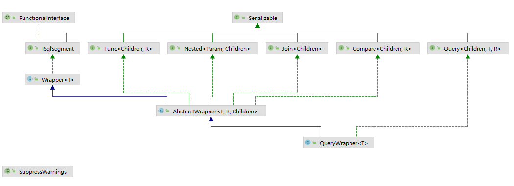
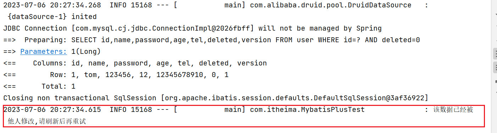

# 问题记录

<font color='blue' size = 5>不同并发量的解决方案（涉及多个维度，分布式锁，编码层面，数据库层面，还有自己没有考虑到的层面）</font>

<font color='blue' size = 5>**并发大一统解决方案**</font>

<font color='blue'>乐观锁</font>

<font color='blue'>雪花算法？？？</font>

Maven下载失败的解决方案

<font color='blue'>springboot3.0与2.0差异很大，差异点</font>

<font color='blue'>瀑布流解决图片加载过慢的问题，上云？？？</font>

<font color='blue'>多租户，数据隔离，</font>

方法引用是1.8的特性。

SAAS=>难点：增加功能，如何在不影响其他用户的情况将项目上线，频繁变更需求如何进行项目管理

OA=>难点：工作流，有相应的框架


医疗！！HIS系统

装修类的项目，卖东西。

相亲=>与黑马头条重合度很高

ERP，

点餐，平台写了论坛，

优惠券的类型，优惠券的类型，怎么实现！！！优惠券的数据库设计


找什么样的项目？？？我们学到了什么？？？找什么样的项目取决于想去哪个公司？

自我介绍，要有条理性

<font color='blue'>数据库与缓存的双写问题！！！！</font>

# 学习重点

初版简历

话术介绍（完整版）

面试题背诵

# 1MybatisPlus简介

## 1.1MyBatis简述

- MP是基于mybatis框架基础上开发的增强型工具

- 简化开发，提高效率

- 减少重复代码的编写，封装了很多常用方法


- 无侵入：只做增强不做改变，不会对现有工程产生影响
- CRUD操作：通过内置<font color='red'>Mapper</font>，少量配置即可实现单表CRUD操作
- 支持lambda：编写查询条件无需担心字段写错，<font color='blue'>具体的使用</font>
- 支持主键自动生成，内置分页插件，逻辑删除，自动填充，代码生成，<font color='blue'>主键自增策略的分类，常用哪种主键自增策略，雪花算法的具体实现</font>
- 逆向生成pojo


## 1.2入门案例

### 1.2.1导入依赖、配置数据源

> MyBatis-Plus的起步依赖和Druid的依赖

```
<dependency>
    <groupId>com.baomidou</groupId>
    <artifactId>mybatis-plus-boot-starter</artifactId>
    <version>3.4.1</version>
</dependency>
<dependency>
    <groupId>com.alibaba</groupId>
    <artifactId>druid</artifactId>
    <version>1.1.16</version>
</dependency>
```

### 1.2.2创建表结构和编写实体类

```sql
create database if not exists mybatisplus_db character set utf8mb4;
use mybatisplus_db;
CREATE TABLE user (
                      id bigint(20) primary key auto_increment,
                      name varchar(32) not null,
                      password  varchar(32) not null,
                      age int(3) not null ,
                      tel varchar(32) not null
);
insert into user values(null,'tom','123456',12,'12345678910');
insert into user values(null,'jack','123456',8,'12345678910');
insert into user values(null,'jerry','123456',15,'12345678910');
insert into user values(null,'tom','123456',9,'12345678910');
insert into user values(null,'snake','123456',28,'12345678910');
insert into user values(null,'张益达','123456',22,'12345678910');
insert into user values(null,'张大炮','123456',16,'12345678910');
```

```java
@Data
public class User {
    private Long id;
    private String name;
    private String password;
    private Integer age;
    private String tel;
}
```

**补充：**character set utf8mb4=>四字节存储的字符集（emoji或者不常用的汉字都是4字节的字符）

MySQL的字符集优先级

> 优先级顺序：数据库字符集<表字符集<列字符集
>
> 上边三个级别的字符集不一致的时候，以更小范围的配置为主


### 1.2.3编写mapper层，继承BaseMappper

```
@Mapper
public interface UserMapper extends BaseMapper<User> {
}
```

### 1.2.4编写service层方法，编写接口和实现类

```java
public interface UserService extends IService<User> {
}
```

```java
@Service
public class UserServiceImpl extends ServiceImpl<UserMapper, User> implements UserService {  
}
```


BaseMapper有什么默认方法？？？

# 2标准数据层开发

## 2.1mapper层CRUD功能（BaseMapper提供的方法）

mp的id默认生成规则是雪花算法

| 方法                                                         | 方法介绍                       |
| ------------------------------------------------------------ | ------------------------------ |
| int insert(T entity);                                        | 插入一条记录                   |
| int deleteById(Serializable id);                             | 根据ID删除                     |
| int deleteBatchIds(Collection<? extends Serializable> idList); | 根据ID列表批量删除             |
| int updateById(T entity);                                    | 根据ID修改                     |
| T selectById(Serializable id);                               | 根据ID查询                     |
| List<T> selectBatchIds(Collection<? extends Serializable> idList); | 根据ID列表查询                 |
| List<T> selectList(Wrapper<T> queryWrapper);                 | 根据查询条件查询全部           |
| <E extends IPage<T>> E selectPage(E page,Wrapper<T> queryWrapper); | 根据分页参数，查询条件分页查询 |

```java
//示例
List<T> selectList(@Param(Constants.WRAPPER) Wrapper<T> queryWrapper);】
```


## 2.2Service层的CRUD功能（IService提供的方法）

|      |      |      |
| ---- | ---- | ---- |
|      |      |      |
|      |      |      |
|      |      |      |


## 2.3分页功能

### 2.3.1注册分页拦截器

```java
package com.itheima.config;

import com.baomidou.mybatisplus.extension.plugins.MybatisPlusInterceptor;
import com.baomidou.mybatisplus.extension.plugins.inner.PaginationInnerInterceptor;
import org.springframework.context.annotation.Bean;
import org.springframework.context.annotation.Configuration;

@Configuration
public class MyBatisPlusConfiguration {
    @Bean
    public MybatisPlusInterceptor mybatisPlusInterceptor(){
        MybatisPlusInterceptor mybatisPlusInterceptor = new MybatisPlusInterceptor();
        mybatisPlusInterceptor.addInnerInterceptor(new PaginationInnerInterceptor());
        return mybatisPlusInterceptor;
    }
}
```

### 2.3.2执行分页查询

```java
//分页查询
@Test
void testSelectPage(){
    	//1 创建IPage分页对象,设置分页参数
    	//IPage<User> page=new Page<>(1,3);
        IPage<User> page = new Page<>();
        // 页码
        page.setCurrent(1);
        // 条数
        page.setSize(2);
        IPage<User> users = dao.selectPage(page, null);
        log.info("分页数据users.getRecords());
        log.info("分页总页数 ===> {}", users.getPages());
        log.info("总行数 ===> {}", users.getTotal());
}
```

### 2.3.3开启MybatisPlus分页日志

```yml
# 开启mp的日志（输出到控制台）
mybatis-plus:
  configuration:
    log-impl: org.apache.ibatis.logging.stdout.StdOutImpl
```

# 3DQL编程控制

核心在条件查询器

## 3.1条件查询方式Wrapper

> MybatisPlus将书写复杂的SQL查询条件进行了封装，使用标称的形式完成查询条件的组合
>
> MybatisPlus不支持不赞成在RPC调用中把Wrapper进行传输

<font color='blue'>RPC调用中传输的对象一般多大？？？多大的合适？？传输对象大小对性能影响如何？？？</font>


### 3.1.1Wrapper继承关系图


### 3.1.2 ISqlSegment接口

> 用来定义SQL片段接口

```java
/**
 * SQL 片段接口
 *
 * @author hubin miemie HCL
 * @since 2018-05-28
 */
@FunctionalInterface
public interface ISqlSegment extends Serializable {
    /**
     * SQL 片段
     */
    String getSqlSegment();
}
```

### 3.1.3函数式接口与@FunctionalInterface注解

**函数式接口（Functional Interface）**=><font color='blue'>关联于Lambda表达式，找时间详细了解下Lambda表达式</font>

所谓函数式接口，首先是一个接口，然后就是这个接口里面只能有一个抽象方法。

这种类型的接口也成为SAM接口，即Single Abstract Method Interfaces（单一抽象方法接口）

**函数式接口的用途**

主要用在Lambda表达式和方法引用（<font color='blue'>实际上也可以认为式Lambda表达式</font>）上

例如：定义一个函数式接口如下

```java
@FunctionalInterface
public interface Person {
        void sayHello(String msg);
}
```

使用Lambda表达式来表示该接口的一个实现（<font color='blue'>注：Java8之前一般采用匿名类实现</font>）

```java
Person person = msg -> System.out.println("Helle"+msg)；
```

**@FunctionalInterface详解**

Java8为函数式接口引入一个注解@FunctionalInterface，主要用于编译级错误检查，加上改注解，当你写的接口不符合函数式接口定义的时候，编译器就会报错

@FunctionalInterface仅对**抽象方法**检查

- 该注解只能标记在“有且仅有一个抽象方法”的接口上
- JDK8接口中的静态方法和默认方法，都不算是抽象方法。
- 接口默认继承java.lang.Object，所以如果接口显示声明覆盖了Object中的方法，那不算是抽象方法

### 3.1.4@SuppressWarnings

@SuppressWarnings是JDK5提供的注解，作用告知编译器屏蔽一些无关紧要的警告

```java
//使用方式
@SuppressWarnings(“”)
@SuppressWarnings({})
@SuppressWarnings(value={})
```

开发常用

```java
@SuppressWarnings("unchecked")//执行了未检查的转换时的警告，例如当使用集合时没有用泛型 (Generics) 来指定集合保存的类型。

@SuppressWarnings("unused")  //未使用的变量

@SuppressWarnings("resource")  //有泛型未指定类型

@SuppressWarnings("path")  //在类路径、源文件路径等中有不存在的路径时的警告

@SuppressWarnings("deprecation")  //使用了不赞成使用的类或方法时的警告

@SuppressWarnings("fallthrough") //当 Switch 程序块直接通往下一种情况而没有 break; 时的警告

@SuppressWarnings("serial")//某类实现Serializable(序列化)， 但没有定义 serialVersionUID 时的警告

@SuppressWarnings("rawtypes") //没有传递带有泛型的参数

@SuppressWarnings("finally") //任何 finally 子句不能正常完成时的警告。

@SuppressWarnings("try") // 没有catch时的警告

@SuppressWarnings("all") //所有类型的警告

// 以下是源码引用中见到的，但实际很少用到的

@SuppressWarnings("FragmentNotInstantiable")

@SuppressWarnings("ReferenceEquality")

@SuppressWarnings("WeakerAccess")

@SuppressWarnings("UnusedParameters")

@SuppressWarnings("NullableProblems")

@SuppressWarnings("SameParameterValue")

@SuppressWarnings("PointlessBitwiseExpression")

```

## 3.2条件构造器

### 3.2.1按条件查询

```java
/**
 *  按条件查询1-QueryWrapper-普通格式进行
 */
@Test
public void selectByCondition1(){
    QueryWrapper<User> queryWrapper = new QueryWrapper<>();
    queryWrapper.lt("age",18);
    List<User> users = userMapper.selectList(queryWrapper);
    log.info(users.toString());
}
```

### 3.2.2Lambda格式按条件查询

```java
/**
 * 按条件查询2-LambdaQueryWrapper-Lambda格式进行
 */
@Test
public void selectByCondition2(){
    QueryWrapper<User> queryWrapper = new QueryWrapper<>();
    queryWrapper.lambda().lt(User::getAge,30);
    List<User> users = userMapper.selectList(queryWrapper);
    log.info(users.toString());
}
```

### 3.2.3Lambda格式按条件查询【推荐】

```java
/**
 * 按条件查询3-LambdaQueryWrapper-Lamdba格式
 */
@Test
public void selectByCondition3(){
    LambdaQueryWrapper<User> lambdaQueryWrapper = new LambdaQueryWrapper<>();
    lambdaQueryWrapper.lt(User::getAge,30);
    List<User> users = userMapper.selectList(lambdaQueryWrapper);
    log.info(users.toString());
}
```

> 使用Lambda条件构造器，Lambda条件构造器指定列名是通过Lambda表达式指定，如：User::getAge，可以有效防止误写

### 3.2.4MybatisPlus推荐的获取条件构造器方式

```java
LambdaQueryWrapper<User> lambdaQueryWrapper = Wrappers.lambdaQuery(new User());
```

源码建议使用` Wrappers.lambdaQuery`，<font color='blue'>lambdaQuery可以屏蔽底层的具体实现</font>，未来有变化上层代码无需调整

<font color='blue'>存疑。。。</font>

### 3.2.5两种条件构造器UML图

LambdaQueryWrapper的UML图


QueryWrapper的UML图



## 3.3组合条件

### 3.3.1并且关系（and）

```java
/**
 * 组合条件查询(and)
 */
@Test
public void selectByCondition4(){
    LambdaQueryWrapper<User> lambdaQueryWrapper = new LambdaQueryWrapper<>();
    lambdaQueryWrapper.lt(User::getAge,30).gt(User::getAge,10);
    List<User> users = userMapper.selectList(lambdaQueryWrapper);
    log.info(users.toString());
}
```

### 3.3.2或者关系（or）

```java
/**
 * 组合条件查询(or)
 */
@Test
public void selectByCondition5(){
    LambdaQueryWrapper<User> lambdaQueryWrapper = new LambdaQueryWrapper<>();
    lambdaQueryWrapper.lt(User::getAge,30).or().gt(User::getAge,10);
    List<User> users = userMapper.selectList(lambdaQueryWrapper);
    log.info(users.toString());
}
```

### 3.3.3last(最后拼接的sql)

```java
/**
 * 无视优化规则直接拼接到 sql 的最后(有sql注入的风险,请谨慎使用)
 * <p>例: last("limit 1")</p>
 * <p>注意只能调用一次,多次调用以最后一次为准</p>
 *
 * @param condition 执行条件
 * @param lastSql   sql语句
 * @return children
 */
Children last(boolean condition, String lastSql);
```

## 3.4查询条件

### 3.4.1大于小于等于

| 方法 | 作用     |
| ---- | -------- |
| eq   | 等于     |
| gt   | 大于     |
| lt   | 小于     |
| ge   | 大于等于 |
| le   | 小于等于 |

示例：

```java
/**
 * 查询条件-大于小于
 */
@Test
public void selectByCondition8(){
    LambdaQueryWrapper<User> lambdaQueryWrapper = new LambdaQueryWrapper<>();
    lambdaQueryWrapper.gt(User::getAge,18);
    List<User> users = userMapper.selectList(lambdaQueryWrapper);
    log.info(users.toString());
}
```

### 3.4.2在什么..之间between

```java
/**
 * 查询条件-介于...之间
 */
@Test
public void selectByCondition9(){
    LambdaQueryWrapper<User> lambdaQueryWrapper = new LambdaQueryWrapper<>();
    lambdaQueryWrapper.between(User::getAge,10,20);
    List<User> users = userMapper.selectList(lambdaQueryWrapper);
    log.info(users.toString());
}
```

### 3.4.3模糊匹配like

<font color='red'>此方法涉及最左匹配原则</font>

| 方法                                               | 作用            |
| -------------------------------------------------- | --------------- |
| like(boolean condition, R column, Object val)      | LIKE ‘%值%’     |
| notLike(boolean condition, R column, Object val)   | NOT LIKE '%值%' |
| likeLeft(boolean condition, R column, Object val)  | LIKE '%值'      |
| likeRight(boolean condition, R column, Object val) | LIKE '值%'      |

```java
/**
 * 查询条件-模糊匹配【有关于能否覆盖索引的问题】
 */
@Test
public void selectByCondition10(){
    LambdaQueryWrapper<User> lambdaQueryWrapper = new LambdaQueryWrapper<>();
    //lambdaQueryWrapper.like(User::getName,"张");
    //此方式能覆盖索引
    lambdaQueryWrapper.likeLeft(User::getName,"张");
    List<User> users = userMapper.selectList(lambdaQueryWrapper);
    log.info(users.toString());
}
```

### 3.4.4包含性匹配(in)

```java
/**
 * 查询条件-in
 */
@Test
public void selectByCondition11(){
    LambdaQueryWrapper<User> lambdaQueryWrapper = new LambdaQueryWrapper<>();
    //lambdaQueryWrapper.in(User::getAge,20,21,22);
    lambdaQueryWrapper.in(User::getAge, Arrays.asList(18,19,20,21,22));
    List<User> users = userMapper.selectList(lambdaQueryWrapper);
    log.info(users.toString());
}
```

### 3.4.5分组（groupBy,having）

```java
/**
 * 查询条件-groupBy
 */
@Test
public void selectByCondition12(){
    LambdaQueryWrapper<User> lambdaQueryWrapper = new LambdaQueryWrapper<>();
    //理论上只能查询被查询字段
    lambdaQueryWrapper.select(User::getPassword);
    lambdaQueryWrapper.groupBy(User::getPassword);
    List<Map<String, Object>> maps = userMapper.selectMaps(lambdaQueryWrapper);
    log.info(maps.toString());
}
```

### 3.4.6排序（orderBy）

> LambdaQueryWrapper.orderBy第二个参数是isAsc【是否升序】

```java
/**
 * 查询条件-排序
 */
@Test
public void selectByCondition13(){
    LambdaQueryWrapper<User> lambdaQueryWrapper = new LambdaQueryWrapper<>();
    //升序
    //lambdaQueryWrapper.orderBy(true,true,User::getAge);
    //降序
    lambdaQueryWrapper.orderBy(true,false,User::getAge);
    List<User> users = userMapper.selectList(lambdaQueryWrapper);
    log.info(users.toString());
}
```


## 3.5查询投影

### 3.5.1查询结果包含模型中部分属性

```java
/**
 *  查询投影-模型类中部分属性
 */
@Test
public void selectByCondition6(){
    LambdaQueryWrapper<User> lambdaQueryWrapper = new LambdaQueryWrapper<>();
    lambdaQueryWrapper.select(User::getId,User::getName);
    List<User> users = userMapper.selectList(lambdaQueryWrapper);
    log.info(users.toString());
}
```

### 3.5.2查询结果包含未定义属性（聚合函数）

只能用QueryWrapper，不能用LambdaQueryWrapper

```java
/**
 * 查询投影-结果中包含模型类中未定义的属性
 */
@Test
public void selectByCondition7(){
    QueryWrapper<User> queryWrapper = new QueryWrapper<>();
    queryWrapper.select("count(*) as count");
    List<Map<String, Object>> maps = userMapper.selectMaps(queryWrapper);
    log.info(maps.toString());
}
```

## 3.6字段映射和表名映射

### 3.6.1表字段与DO属性不同步【@TableFieled(value=“ ”)】

在模型类属性上方，使用**@TableField**属性注解，通过==**value**==属性，设置当前属性对应的数据库表中的字段关系。


### 3.6.2DO中含有表中未定义属性【@TableFieled(exist=" ")】

在模型类属性上方，使用**@TableField**注解，通过**==exist==**属性，设置属性在数据库表字段中是否存在，默认为true。


### 3.6.3管理字段查询权限【@TableFieled(select=" ")】

在模型类属性上方，使用**@TableField**注解，通过**==select==**属性：设置该属性是否参与查询。此属性与select()映射配置不冲突。


### 3.6.4表名与DO类名不同步【@TableName(value=" ")】

在<u>**模型类**</u>上方，使用**@TableName**注解，通过**==value==**属性，设置当前类对应的数据库表名称。


# 4DML编程控制

## 4.1主键ID生成策略（@TableId(type="")）


**全局配置：**【全局配置不需要一个一个类的去加注解了】

```yml
mybatis-plus:
  global-config:
    db-config:
      id-type: assign_id
      table-prefix: tbl_
```

id生成策略全局配置


表名前缀全局配置


<font color='blue'>雪花算法的优势</font>
雪花算法是Twitter公司发明的一种算法，主要目的是解决在分布式环境下，ID怎样生成的问题

1，分布式ID生成规则硬性要求：全局唯一：不能出现重复的ID号，既然是唯一标识，这是最基本的要求。趋势递增：MySQL中InnoDB引擎使用的是聚集索引。多数RDBMS使用Btree的数据结构来存储索引数据，在主键的选择上尽量选择有序的主键保证写入性能。单调递增：保证下一个ID号一定大于上一个。

2，分布式ID生成可用性要求：高可用：发布一个获取分布式ID的请求，服务器就要保证99.999%的情况下给创建一个全局唯一的分布式ID。低延迟：发布一个获取分布式ID的请求，要快，急速。高QPS：假如并发一口气10万个创建分布式ID请求同时杀过来，服务器要顶得住并且成功创建10万个分布式ID。

## 4.2逻辑删除

**逻辑删除本质：逻辑删除的本质其实是修改操作。如果加了逻辑删除字段，查询数据时也会自动带上逻辑删除字段。**

### 4.2.1表中添加逻辑删除标记字段


### 4.2.2实体类添加字段，并使用@TableLogic标记

```java
@Data
public class User {
    @TableId(type = IdType.ASSIGN_ID)
    private Long id;
    private String name;
    private String password;
    private Integer age;
    private String tel;
    @TableLogic //逻辑删除字段，默认没有删除是0，已删除为1
    private Integer deleted;
}
```

**添加之后删除语句变为更新语句**


**添加之后的查询语句（自动添加了逻辑删除字段）**


### 4.2.3逻辑删除全局配置

逻辑删除注解与全局配置任选其一

```yml
mybatis-plus:
  global-config:
    db-config:
      table-prefix: tbl_
      # 逻辑删除字段名
      logic-delete-field: deleted
      # 逻辑删除字面值：未删除为0
      logic-not-delete-value: 0
      # 逻辑删除字面值：删除为1
      logic-delete-value: 1
```

## 4.3MP乐观锁（Update）

<font color='blue'>MP乐观锁的失败重试机制</font>

### 4.3.1悲观锁与乐观锁

<font color='blue'>悲观锁和乐观锁在不同并发量下的表现</font>

悲观锁：

​	只允许一个操作，串行

乐观锁：

1. 取出记录时，获取当前version
2. 更新时，带上这个version
3. 执行更新时，set version = newVersion where version = oldVersion
4. 如果version发生变化，则更新失败

### 4.3.2数据库表中添加锁标记字段


### 4.3.3实体类中添加字段，并使用@Version标记

```java
@Data
public class User {
    @TableId(type = IdType.ASSIGN_ID)
    private Long id;
    private String name;
    private String password;
    private Integer age;
    private String tel;
    @TableLogic
    private Integer deleted;
    @Version //版本号
    private Integer version;
}
```

4.3.4配置乐观锁拦截器实现乐观锁机制

<font color='blue'>实质是动态SQL的拼装？？？搞清楚这几个MP拦截器的工作原理</font>

```java
@Configuration
public class MyBatisPlusConfiguration {
    @Bean
    public MybatisPlusInterceptor mybatisPlusInterceptor(){
        MybatisPlusInterceptor mybatisPlusInterceptor = new MybatisPlusInterceptor();
        //分页拦截器
        mybatisPlusInterceptor.addInnerInterceptor(new PaginationInnerInterceptor());
        //乐观锁拦截器
        mybatisPlusInterceptor.addInnerInterceptor(new OptimisticLockerInnerInterceptor());
        return mybatisPlusInterceptor;
    }
}
```

### 4.3.5测试乐观锁效果

<font color='blue'>找王旭的代码</font>

```java
/**
 * 测试乐观锁
 */
@Test
void testLock() {
    // 1. 接收前端传入的数据,使用这个数据
    // 2. 在数据库中取出与之对应的数据.
    // 3. 对比前端传入的数据和db中的数据
    // 4. 校验通过的话,更新数据.

    // 前端的数据
    User query = new User();
    query.setId(1L);
    query.setName("张三李四");
    query.setVersion(0);
    // db中的数据
    User user = userMapper.selectById(1L);
    if (!(query.getVersion().equals(user.getVersion()))) {
        log.info("该数据已经被他人修改,请刷新后再重试");
        return;
    }
    //更新操作与if语句之间，数据可能被其它线程所有修改。
    user.setName(query.getName());
    userMapper.updateById(user);
}
```

**运行效果**



# 5雪花算法详解

## 5.1分布式唯一ID要求


- 全局唯一性【必须】：

  不同节点或者服务不能生成重复的ID，大数量导致分库分表的产生，对于水平分表就需要保证表中ID的全局唯一性，全局唯一的ID可以用于分布式系统中的数据分片和数据合并。避免出现ID冲突的问题

- 高性能【必须】：

  生成ID的速度要求，不能称为系统的瓶颈

- 单调递增【应该】：

  因为MySQL的索引类型，所以单调递增的主键更适合于MySQL，避免了索引更新。UUID不适合作为主键

- 安全（无规律可循）【应该】：

  Redis生成ID容易被人猜到数据量，竞争对手根据ID推算业务量

## 5.2分布式唯一ID方案


### 5.2.1数据库自增

自增ID在设计表时，将ID字段的值设置自增的形式，分布式的自增可以设置步长。

优点：主键自动增长，占用空间小，检索有利，有顺序，不会重复。

缺点：并发性能不高，受限于数据库性能，不太适合重构的系统，涉及旧数据迁移容易ID冲突，还有外键要考虑，新旧系统上线同时运行，数据涉及双写容易ID冲突。

<font color='blue'>数据库与缓存的双写问题的解决方案综合低并发和高并发分离！！！！</font>

场景：


### 5.2.2UUID生成Id

UUID是通用唯一标识码的缩写，集群全局唯一不会重复，UUID是基于当前时间、计数器、机器的mac地址等数据计算生成。

优点：本地生成，没有网络IO成本，性能号，全局唯一不重复，使用简单不用引入中间件

缺点：UUID占用16个字符，空间占用较多，不是递增的而是无序、随机写入索引性能下降。

场景：对表空间没有太多限制、重构类系统、UUID不作为查询字段的非高并发系统、集群部署的中间唯一ID。

### 5.2.3Redis生成ID

Redis计数器，原子性自增，调用incr，incrBy方法

<font color='blue'>Redis怎么实现原子性自增的？？</font>

优点：并发性能高，有顺序，生成的ID可以自定义格式，例如前缀+yyyyMMdd+5位自增

缺点：使用场景优先、因为自增，数据量容易被猜到<font color='blue'>（猜到有什么坏处？）</font>，不安全，引入中间件，Redis集群部署需要保证高可用成本高。

场景：生成ID要求自增，高性能，适合运营管理后台唯一ID生成，例如活动编号。

### 5.2.4雪花算法生成ID

Twitter开源的分布式ID生成算法，主要是由64bit的long型生成的全局ID，引入时间戳和ID保持自增的属性。

优点：

1. 不依赖外部组件（如：redis，DB），
2. 秒级别生成百万ID，性能好，
3. 生成的ID是趋势递增的，有利于提升MySQL数据库的插入效率。

缺点：

1. 机房和机器设置不合适高并发下可能会重复（应用启动机房ID、机房ID作为启动参数传递保证唯一），

2. 1024节点数不一定够用

3. 强依赖时间，时钟回拨会导致生成重复ID

   > 时钟回拨是与硬件时钟和ntp（Network Time Protocol）服务相关的。硬件时钟可能会因为各种原因发生不准的情况，网络中提供了ntp服务来做时间校准，做校准的时候就会发生时钟的跳跃或者回拨的问题

4. 机器ID分配后无法自动回收，重新使用

场景：互联网高并发系统

### 5.2.5百度UidGenerator算法

UidGenerator是Java实现的, 基于Snowflake算法的唯一ID生成器。 UidGenerator以组件形式工作在应用项目中, 支持自定义workerId位数和初始化策略, 从而<font color='blue'>适用于k8s环境下实例自动重启、IP漂移</font>等场景。 在实现上, UidGenerator通过借用未来时间来解决sequence天然存在的并发限制; 采用<font color='blue'>RingBuffer</font>来缓存已生成的Uid, 并行化Uid的生产和消费, 同时对CacheLine补齐， 避免RingBuffer带来的伪共享问题. 最终单机QPS可达600万。

场景：互联网高并发系统


### 5.2.6美团Leaf算法

全局唯一，绝对不会出现重复的ID，且ID整体趋势递增。 高可用，服务完全基于分布式架构，即使MySQL宕机，也能容忍一段时间的数据库不可用。 高并发低延时，在CentOS 4C8G的虚拟机上，远程调用QPS可达5W+，TP99在1ms内。 接入简单，直接通过公司RPC服务或者HTTP调用即可接入。 支持号段模式和雪花算法: 号段模式依赖于数据库，但是区别于数据库主键自增的模式。假设100为一个号段100，200，300，每取一次可以获得100个Id ，性能显著提高。

场景：互联网高并发系统

### 5.2.7★实现方案

#### 非高并发场景

提供单独的ID生成restful服务，该服务正常情况下不会经常改变，基本做到不发版，保证ID生成底层服务稳定，SLA达到4个9。【SLA：service-level agreement 服务等级协议】

<font color='blue'>发版的流程，伪装正常的工作经验</font>

> 90%（1个9的正常运行时间）：这意味着10%的停机时间，也就是说在过去的30天里停机了3天。
>
> 99%（2个9的正常运行时间）：意味着在过去30天中有1%，或者说7.2小时的停机时间。 
>
> 99.9%（3个9的正常运行时间）：意味着0.1%，或者说43.2分钟的停机时间。 
>
> 99.95%（3.5个9的正常运行时间）：意味着0.05%，或者说21.6分钟的停机时间。
>
> 99.99%（4个9的正常运行时间）：意味着0.01%，或者说4.32分钟的停机时间。
>
> 99.999%（5个9的正常运行时间）：意味着0.001%，或者说26秒的停机时间

#### 高并发场景

提供一个封装好ID生成的SDK。业务应用集成SDK，调用SDK提供的ID生成方法。

保证高可用的设计方案

业务应用启动批量从ID生成的restful服务拉取指定疏朗的ID列表到内存的阻塞队列中（具体的数量根据应用的内存和并发量决定，比如默认为5000）。业务应用获取ID直接从阻塞队列中获取，提高性能。SDK中封装定时任务，如没5分钟检查一次，如果阻塞队列的ID数量小于5000*90%=4500，则重新通过远程服务接口拉取一批，保证队列存储的SDK足够满足业务应用的需求。

<font color='blue'>java阻塞队列的操作方法，</font>

## 5.2雪花算法的原理

雪花算法的原理：生成一个64位的long类型的唯一ID。

可以将雪花算法作为一个单独的服务进行部署，然后需要全局唯一ID的业务应用请求雪花算法服务获取ID即可。


> 雪花算法使用一个64位的整数来表示一个唯一ID
>
> 这64bits如图被分成了5个部分:
>
> - 1bit 作为符号位，总是为0
> - 41bits 用来存储毫秒时间戳，计算后可知约可用69年
> - 5bits 用来存储数据中心ID，最多可以表示32个数据中心
> - 5bits 用来存储工作机器ID，最多可以表示32台工作机器
> - 12bits 用来在同节点时间相同时作为自增ID标识唯一性，同1ms可以表示最多4096个ID，所以理论上1s内可以生成约409W个ID
>
> 注意：数据中心ID+工作机器ID可以唯一确定一个节点，最多可以表示1024个节点

定制雪花算法

> 雪花算法并不是一成不变的，业务可以根据自身需求，对雪花算法进行变种开发，进而定制出符合自身业务需求的雪花算法。
>
> 比如：`5bits`
> 数据中心ID， `5bits`
> 工作机器ID，你可以拆分成 `3bits`
> 数据中心ID， `7bits`
> 工作机器ID，这样机器ID就可以多一些，数据中心ID就会少一些。
>
> 再比如：你觉得 `41bits`
> 的太多了，可能你们用不了那么些年，就可以分几bits出来用来干别的事情。

## 5.3SpringBoot中使用雪花算法

### 5.3.1引入雪花算法依赖

```xml
<dependency>
    <groupId>com.github.beyondfengyu</groupId>
    <artifactId>snowflake-spring-boot-starter</artifactId>
    <version>1.0.0</version>
</dependency>
```

### 5.3.2配置雪花算法参数

```yml
snowflake:data-center-id: 1 # 数据中心ID，可以使用机器IP地址最后一段数字，范围为0-31machine-id: 1 # 机器ID，可以使用服务器编号，范围为0-31
```

### 5.3.3注入雪花算法对象

```java
@Service
public class UserService {
    @Autowiredprivate SnowflakeIdWorker snowflakeIdWorker;
    public Long generateUserId() {
        return snowflakeIdWorker.nextId();
    }
}
```

snowflakeIdWorker.nextId();即可获取生成的雪花ID

## 5.3拓展框架

百度的UIDGenerator：https://github.com/baidu/uid-generator

美团的Leaf：https://github.com/Meituan-Dianping/Leaf

由于时间回拨导致的生产重复的ID的问题，百度和美团都有自己的解决方案，

### 5.3.1百度的UIDGenerator

UidGenerator是Java实现的, 基于Snowflake算法的唯一ID生成器。UidGenerator以组件形式工作在应用项目中, 支持自定义workerId位数和初始化策略, 从而适用于docker等虚拟化环境下实例自动重启、漂移等场景。 在实现上, UidGenerator通过借用未来时间来解决sequence天然存在的并发限制; 采用RingBuffer来缓存已生成的UID, 并行化UID的生产和消费, 同时对CacheLine补齐，避免了由RingBuffer带来的硬件级「伪共享」问题. 最终单机QPS可达600万。

### 5.3.2美团的Leaf

**1.leaf-segment 方案**

优化：双buffer + 预分配

容灾：Mysql DB 一主两从，异地机房，半同步方式

缺点：如果用segment号段式方案：id是递增，可计算的，不适用于订单ID生成场景，比如竞对在两天中午12点分别下单，通过订单id号相减就能大致计算出公司一天的订单量，这个是不能忍受的。

**2.leaf-snowflake方案**

使用Zookeeper持久顺序节点的特性自动对snowflake节点配置workerID

1.启动Leaf-snowflake服务，连接Zookeeper，在leaf_forever父节点下检查自己是否已经注册过（是否有该顺序子节点）。

2.如果有注册过直接取回自己的workerID（zk顺序节点生成的int类型ID号），启动服务。

3.如果没有注册过，就在该父节点下面创建一个持久顺序节点，创建成功后取回顺序号当做自己的workerID号，启动服务。
缓存workerID，减少第三方组件的依赖

由于强依赖时钟，对时间的要求比较敏感，在机器工作时NTP同步也会造成秒级别的回退，建议可以直接关闭NTP同步。要么在时钟回拨的时候直接不提供服务直接返回ERROR_CODE，等时钟追上即可。或者做一层重试，然后上报报警系统，更或者是发现有时钟回拨之后自动摘除本身节点并报警。

# 7乐观锁、悲观锁以及CAS乐观锁实现机制原理

在并发访问情况下，可能出现脏读，不可重复读或者幻读<font color='blue'>（详细背下来这几种现象的区别）</font>等现象，为了应对这些问题，主流数据库都提供了锁机制，并且引入了事务隔离级别的概念。<font color='blue'>（不同隔离级别的实现）</font>数据库管理系统（DBMS）中的**并发控制的任务是确保在多个事务同时存取数据时不破坏事务的隔离性和统一性以及数据库的统一性**。

乐观并发控制（乐观锁）和悲观并发控制（悲观锁）是并发控制主要采用的技术手段，无论是悲观锁还是乐观锁，都是人们提出的概念，可以认为这是一种思想。其实不仅仅是关系型数据库有乐观锁和悲观锁的概念。像memcache、hibernate、tair等都有类似的概念。

## 7.1数据库的锁

当并发事务同时访问一个资源时，有可能导致数据不一致，因为需要一种机制来将数据访问属虚华，以保证数据库数据的一致性。锁就是其中一种机制。

在计算机科学中，锁是在执行多线程时用于强行限制资源访问的同步机制，即用于在并发控制中保证对互斥要求的满足。

锁的分类

一、按照操作划分，可以分为DML锁，DDL锁

二、按锁的粒度划分，可分为表级锁、行级锁、页级锁（MySQL）

三、按所级别划分，可分为共享锁、排他锁

四、按加锁方式划分，可分为自动锁、显式锁

五、按使用方式划分，可分为乐观锁、悲观锁

DML锁（data locks，数据锁）：用于保护数据的完整性，其中包括`行级锁【Row Locks（TX锁）】`，`表级锁【table lock（TM锁）】`

DDL锁（dictionary locks，数据字典锁）：用于保护数据库对象的结构，如表，索引等的结构定义。其中包括：`排他DDL锁（Exclusive DDL lock）`、`共享DDL锁（share DDL lock）`、`可中断解析锁（Breakable parse locks）`

### 7.1.1锁机制

常见的锁机制分为两种

**悲观锁：**假定会发生并发冲突`[悲观]`，屏蔽一切可能违法数据完整性的操作，悲观锁的实现，往往依靠底层提供的锁机制；悲观锁会导致其他所有需要锁的线程挂起，等待持有锁的线程释放锁。

**乐观锁：**假定不会发生并发冲突`[乐观]`，每次不加锁而是假设没有冲突去完成某项操作，只有提交操作时检查是否违反数据完整性。如果因为冲突失败就重试<font color='blue'>（是否需要考虑重试的成本？？）</font>，直到成功为止。**乐观锁大多时基于数据版本记录机制实现，为数据添加一个版本表示<font color='blue'>（mvcc详解）</font>**。

如基于数据库表的版本解决方案中，一般时通过为数据库表增加一个“version”字段来实现，读取数据时，将此版本号一同读出，之后更新时，对此版本号+1，此时，将提交数据的版本数据与数据库表对应记录的版本信息进行比对，如果提交的数据版本号大于数据表当前版本号，则予以更新，否则认为是过期数据。

> 乐观锁的问题是不能解决部分脏读的问题。如：ABA问题

在实际生产环境里，如果并发量不大且不允许脏读，可以使用悲观锁解决并发问题；如果系统的并发非常大的话，悲观锁会带来非常大的性能问题，所以我们就要选择乐观锁的方法

> MP乐观锁是针对于小型企业的解决方案，因为数据库本身的性能就是个瓶颈，如果对其并发量超过2000以上的就需要考虑其他的解决方案了。

<font color='blue'>更高的并发问题怎么解决？？？</font>

## 7.2乐观锁与悲观锁详解

### 7.2.1悲观锁（PCC）

在数据库管理系统里，悲观并发控制（Pressimistic Concurrency Control）是一种并发控制的方法，如果一个事务对某行数据用了锁，那只有当这个事务把锁释放，其他事务才能执行与该锁冲突的操作。

悲观并发控制主要用于数据争用激烈的环境，以及发生并发冲突事使用锁保护数据的成本要低于回滚事务的成本的环境中。

悲观锁，它指得事数据被外界修改持悲观态度，因此在整个数据处理过程中，将数据处于锁定状态，悲观锁的实现，往往依靠数据库提供的锁机制（也只有数据库提供的锁机制才能真正的保护数据访问的排他性，否则即使在本系统中实现了加锁机制，也无法保证外部系统不会修改数据）

在数据库中，悲观锁的流程如下：

> 在对任意记录进行修改前，先尝试为该记录加上排他锁（Exclusive locking）
>
> 如果加锁失败，说明该记录正在被修改，那么当前查询可能要等待或者抛出异常。具体响应方式由开发者根据实际需求决定
>
> 如果成功加锁，那么就可以对记录做修改，事务完成后就会解锁。
>
> 期间：如果有其他对该记录做修改或者加排他锁的操作，都会等待我们解锁或直接抛出异常

MySQL InnoDB中使用悲观锁

要使用悲观锁，必须关闭MySQL数据库的自动提交属性，因为MySQL默认使用了autocommit模式，也就是说，当执行更新操作时，MySQL会立刻将结果进行提交。<font color='blue'>怎么修改MySQL的事务提交方式 set autocommit= 0 ?</font>

```sql
//0.开始事务 (三者选一就可以)
begin;
begin work;
start transaction;
//1.查询出商品信息
select status from t_goods where id=1 for update;
//2.根据商品信息生成订单
insert into t_orders (id,goods_id) values (null,1);
//3.修改商品status为2
update t_goods set status=2;
//4.提交事务
commit;/commit work;
```

<font color='blue'>为什么喜欢在表前边加`t_`，`tb_`这种前缀？？？</font>

上述的查询语句中，由于使用select... for update 的方式，这样就可以开启排他锁的方式实现悲观锁，此时在t_goods表中，id为1的数据就被锁定了，其他事务必须等本次事务提交之后才能执行，这样可以保证当前的数据不会被其它的事务修改。

<font color='red'>上述查询语句中，select ... for update会把数据锁住，不过需要注意锁的几倍，MySQL的InnoDB默认是行级锁，行级锁都是基于索引的，如果一条SQL语句用不到索引是不会使用行级锁的，会使用表级锁把整张表锁住，这是需要非常注意的</font>


<font color='blue'>查询索引覆盖范围的语句，这些信息都是都是记录待到哪张表里？这张表除此之外还有哪些可用的信息？？？</font>

<font color='blue'>索引详解，为什么行级锁是基于索引的？？？</font>

**优点与不足**

悲观并发控制实际上是“先取锁再访问”的保守策略，为数据处理的安全提供了保证。但是在效率方面，处理加锁的机制会让数据库产生额外的开销，还有增加产生死锁的机会；另外，只读型事务处理由于不会产生冲突，也没有必要使用锁，这样做只能增加系统负载；还会降低并行性，一个事务如果锁定了某行数据，其他事务就必须等待该事务处理完才可以处理被锁住的数据。

### 7.2.2乐观锁（OCC）

在关系数据库管理系统里，乐观并发控制（Optimistic Concurrency Control）也是一种并发控制的方法。它假设多用户并发的事务在处理时不会批次互相影响，各事务能够在不产生锁的情况下处理各自影响的那部分数据。在提交数据更新之前，每个事务都会先检查在该事务读取数据后，有没有其他事务又修改了该数据，如果其他事务有更新的话，正在提交的事务会进行回滚，乐观事务控制最早由孔祥重（H.T.Kung）教授提出。

乐观锁（Optimistic Locking）相对悲观锁而言，乐观锁假设认为数据一般情况下不会造成冲突，所以在数据进行提交更新的时候，才会对数据的冲突与否进行检测，如果发现冲突了，则返回用户错误信息，让用户决定如何去做。

<font color='blue'>MVCC详解</font>

**相对于悲观锁，在对数据库进行处理的时候，乐观锁并不会使用数据库提供的锁机制，一般的实现乐观锁的方式就是记录数据版本**

数据版本：是为数据增加的一个版本标识，当读取数据时，将版本标识的值一同读出，数据每更新一次，同时对版本标识进行更新。当我们提交更新的时候，判断数据库表中对应记录的当前版本信息，与第一次取出来的版本标识进行比对，如果数据库表当前版本号与第一次取出来的版本号标识相等，则予以更新，否则更新失败<font color='blue'>重试机制</font>。

**实现数据数据版本有两种方式，第一种使用版本号，第二种使用时间戳**

**使用版本号实现乐观锁**

使用版本号时，可以在数据库初始化时指定一个版本号，每次对数据的更新操作都是对版本号+1操作，并判断当前版本号是不是该数据的最新版本号。

```sql
1.查询出商品信息
select (status,status,version) from t_goods where id=#{id}
2.根据商品信息生成订单
3.修改商品status为2
update t_goods 
set status=2,version=version+1
where id=#{id} and version=#{version};
```

**优点与不足**

乐观并发控制相信事务之间的数据竞争（data race）的概率时比较小的，因此尽可能直接做下去，直到提交的时候才去锁定，所以不会产生任何锁和死锁，但如果直接简单这么做，有可产生ABA问题。

## 7.3CAS详解

讲CAS之前，我们不得不提一下Java的线程安全问题。

> 众所周知，Java是多线程的，但是Java对多线程的支持其实是一把双刃剑，一旦涉及多个线程操作共享资源的情况，处理不好就可能产生线程安全问题，线程安全性可能是非常复杂的，在没有充足的同步的情况下，多个线程中的操作顺序是不可预测。
>
> Java里面进行多线程通信的主要方式就是共享内存的方式，共享内存主要的关注点有两个：可见性和有序性，加上复合操作的原子性。Java线程安全性问题主要关注点：可见性，有序性，原子性。

Java内存模型（JMM）解决了可见性和有序性的问题，而锁解决了原子性的问题。

### 7.3.1锁存在的问题

JDK1.5之前都是靠synchronized关键字保证同步的，这种通过使用一直的锁定协议来协调对共享状态的访问，可以确保无论哪个线程持有共享变量的锁，都采用独占的方式来访问这些变量。独占锁其实就是一种悲观锁，所以说synchronized是悲观锁。

悲观锁机制存在以下问题

1. 在多线程竞争下，加锁，释放锁会导致比较多的上下文切换和调度延迟，引起性能问题。
2. 一个线程持有锁会导致其它所有需要此锁的线程挂起。

另一个更有效的锁就是乐观锁。

乐观锁的具体实现细节主要就是两个步骤：冲突检测和数据更新

其实现方式有一种比较典型的就是Compare and Swap（CAS）

### 7.3.2CAS

CAS是项乐观锁计数，当多个线程尝试使用CAS同时更新同一个变量时，只有其中一个线程能更新变量的值，而其它线程都失败，失败的线程并不会被挂起，而是被告知这次竞争中失败，并可以再次尝试。

CAS操作包含三个操作数：内存位置（V），预期原值（A）和新值（B）。如果内存位置的值和预期原值相匹配，那么处理器会自动将该位置值更新为新值。否则，处理器不做任何操作。无论哪种情况，它都会在CAS指令之前返回该位置的值。（在CAS的一些特殊情况下仅返回CAS是否成功，而不是提取当前值。）

> CAS有效地说明了”我认为位置V应该包含A；如果包含该值，则将B放到这个位置；否则不要更改该位置，只告诉我这个位置现在的值即可。“

**乐观锁是一种思想，CAS是这种思想的一种实现方式**

### 7.3.3Java对CAS的支持（J.U.C）

<font color='blue'>JUC提供了哪些工具类（原子类，ReentrantLock，很多线程安全的数据结构，=>详细了解下）</font>

JDK1.5之前Java语言是靠synchronized关键字保证同步的，这是一种独占锁，也是悲观锁。JDK1.5中新增`java.util.concurrent(J.U.C)`就是建立在CAS之上的，相对于synchronized这种阻塞算法，CAS是非阻塞算法的一个常见实现，所以J.U.C在性能上有了很大的提升。

现在的CPU提供了特殊的指令，允许算法执行读-修改-写操作，而无需害怕其它线程同时修改变量，因为如果其它线程修改变量，那么CAS会检测它（并失败），算法可以对该操作重新计算。而compareAndSet（）就用这些代替了锁定。

`java.util.concurrent`中的`AtomicInteger`为例，看没有锁的情况下如何保证线程安全的，如`getAndIncement`方法，该方法的作用相当于++i操作。

```java
public class AtomicInteger extends Number implements java.io.Serializable {
    
    private volatile int value;
    
    public final int get() {
        return value;
    }
    //伪代码，现在JDK代码
    public final int getAndIncrement() {
        for (;;) {
            int current = get();
            int next = current + 1;
            if (compareAndSet(current, next))
                return current;
        }
    }
    //当前真实代码
    public final int getAndIncrement() {
        return unsafe.getAndAddInt(this, valueOffset, 1);
    }
    
    public final boolean compareAndSet(int expect, int update) {
        return unsafe.compareAndSwapInt(this, valueOffset, expect, update);
    }
```

字段value需要借助volatile原语，保证线程间的数据是可见的（共享的）。这样在获取变量的值的时候才能直接读取。采用了CAS操作，每次从内存中读取数据然后将此数据和+1后的结果进行CAS操作，如果成功就返回结果，否则重试直到成功为止。而CompareAndSet利用JNI来完成CPU指令操作。

JUC利用CPU的CAS指令，同时借助JNI来完成Java的非阻塞算法，其它原子操作都是利用类似的特性完成的。

<font color='blue'>整个JUC都是建立在CAS之上的（存疑？？）</font>，因为相对于synchronized阻塞算法，JUC在性能上有了很大的提升。

### 7.3.4CAS会导致"ABA问题"

**ABA问题：**
ABA实际上是乐观锁无法解决脏数据读取的一种体现。CAS算法实现一个重要前提需要取出内存中某时刻的数据，而在下时刻比较并替换，那么在这个时间差类会导致数据的变化。<font color='blue'>我不太认可这种说法</font>
比如说一个`线程1`从内存位置V中取出A，这时候另一个`线程1`也从内存中取出A，并且`线程2`进行了一些操作变成了B，然后`线程2`又将V位置的数据变成A，这时候`线程1`进行CAS操作发现内存中仍然是A，然后`线程1`操作成功。尽管`线程1`的CAS操作成功，但是不代表这个过程就是没有问题的。

部分乐观锁的实现是通过版本号（version）的方式来解决ABA问题，乐观锁每次在执行数据的修改操作时，都会带上一个版本号，一旦版本号和数据的版本号一致就可以执行修改操作并对版本号执行+1操作，否则就执行失败。因为每次操作的版本号都会随之增加，所以不会出现ABA问题，因为版本号只会增加不会减少。

<font color='blue'>使用版本号方法，在比较交换的那一步要注意操作的原子性吧？？？</font>

<font color='blue'>待整理</font>


# 6快速开发-代码生成器


# N附录

## N1Maven报错的问题


