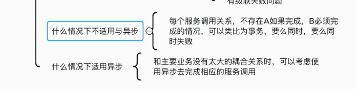
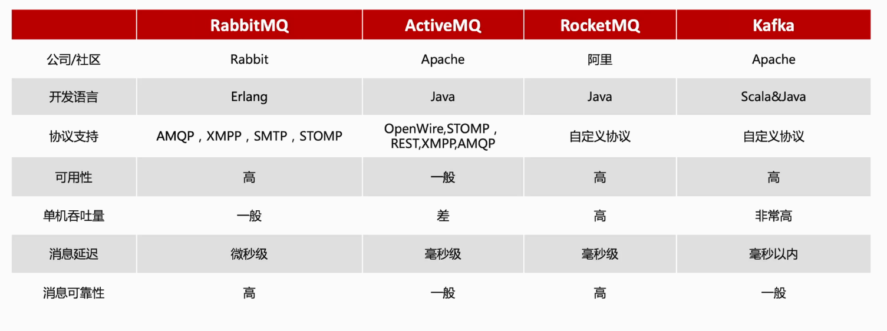
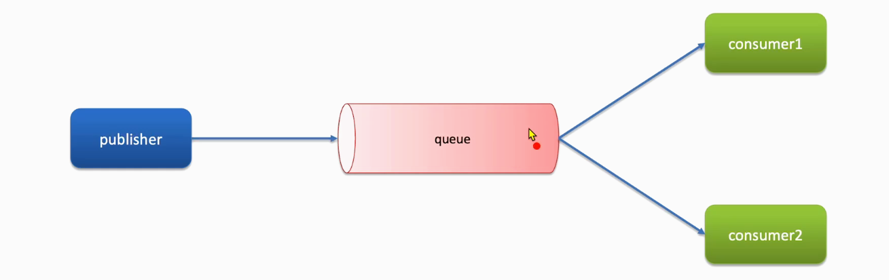
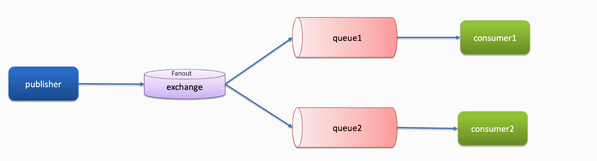
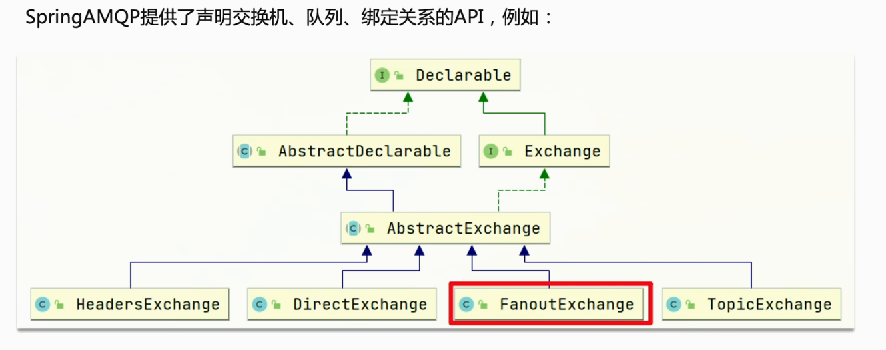
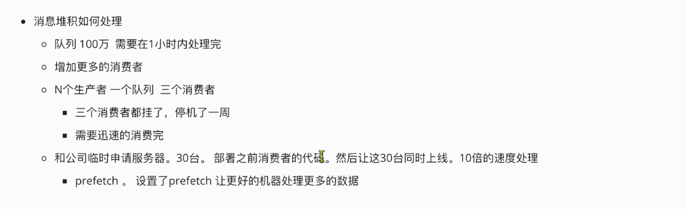
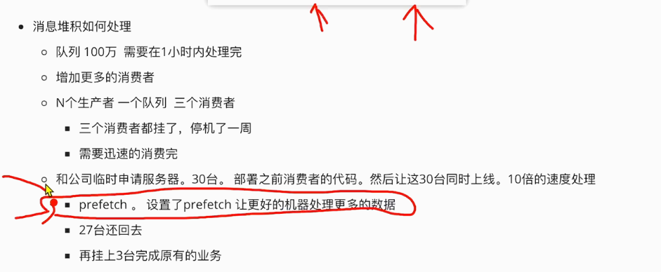
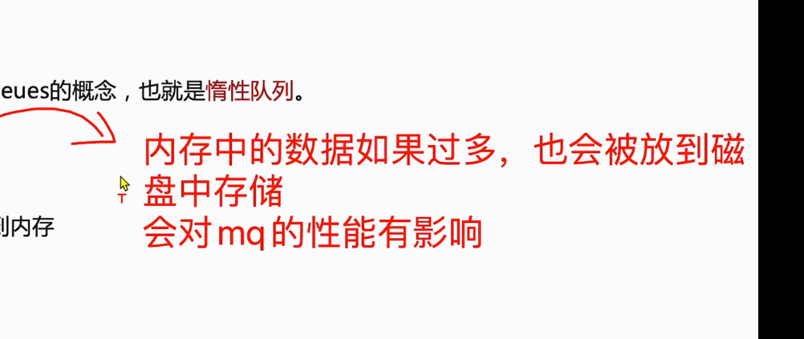

# 问题记录

<font color='blue'>服务雪崩？</font>

RabbitMQ/activeMQ/RoketMQ/Kafka

对比是为了技术选型


<font color='blue'>事件模型，响应模型</font>

# 学习重点

spring AMQP【基于AMQP协议】

<font color='blue'>消息服务的适用场景</font>

适合用通知？？


# 1初识MQ

<font color='blue'>能支持哪几种通信模型？？</font>

## 1.1同步和异步通信

微服务之间有同步和异步两种方式，<font color='blue'>常见的同步异步通信模型？？？</font>

### 1.1.1同步通讯【阻塞】

之前学习Feign调用就属于同步方式，虽然调用可以实时得到结果，

优点：

- 时效性较强，可以立即得到结果

缺点：

- 耦合度高

- 等待响应，才能执行下一步，导致性能变差
- 性能和吞吐能力下降
- 不能释放请求占用的资源，高并发的情况下极度浪费系统资源。
- 有级联失败的问题

### 1.1.2异步通讯【非阻塞】

异步调用常见的实现是事件驱动模型【】<font color='blue'>还有哪些？？？</font>


<font color='blue'>Broker</font>


在事件模型中吗，支付服务是事件发布者（publisher），在支付完成后只需要发布一个支付成功的事件（event），事件中带上订单id。订单服务和物流服务是事件订阅者（consumer），订阅支付成功的事件，监听到事件后完成自己的业务即可

为了接触事件发布者与订阅者之间的耦合，两者不是直接通信，而是有一个中间人（Broker），发布者发布事件到Broker，不关心谁来订阅事件，订阅者从Broker订阅事件，不关系谁发来的消息。

解决的问题，解除耦合，提醒性能，故障隔离，流量削峰

优缺点

优点：

- 耦合度低
- 吞吐量提升
- 故障隔离
- 流浪削峰

缺点

依赖于broker的可靠性，安全性，吞吐能力

结构复杂，业务没有明显的流程线，不好追踪管理。




## 1.2技术对比

MQ，中文就是消息队列（MessageQueue），管理存放消息的队列，也是事件驱动模型的Borker，

比较常见的MQ实现：

- ActiveMQ
- RabbitMQ
- RocketMQ
- Kafka

社区活跃度

<font color='blue'>消息队列涉及的协议类型</font>

<font color='blue'>RocketMQ与Kafka的技术选型？详细准备</font>

集群与可用性？？？



|            | RabbitMQ              | ActiveMQ                      | RocketMQ   | Kafka      |
| ---------- | --------------------- | ----------------------------- | ---------- | ---------- |
| 公司/社区  | Rabbit                | Apache                        | 阿里       | Apache     |
| 开发语言   | Erlang                | Java                          | Java       | Scala&Java |
| 协议支持   | AMQP,XMPP,SMTP，STOMP | OpenWire,STOMP,REST,XMPP,AMQP | 自定义协议 | 自定义协议 |
| 可用性     | 高                    | 一般                          | 高         | 高         |
| 单机吞吐量 | 一般                  | 差                            | 高         | 非常高     |
| 消息延迟   | 微秒级                | 毫秒级                        | 毫秒级     | 毫秒以内   |
| 消息可靠性 | 高                    | 一般                          | 高         | 一般       |

<font color='blue'>AMQP是什么协议？？？这几个协议查一查？？？</font>

追求可用性：Kafka、RocketMQ、RabbitMQ

追求可靠性：RabbitMQ、RocketMQ

追求吞吐能力：RocketMQ、Kafka

追求消息低延迟：RabbitMQ、Kafka

# 2快速入门

使用最基础的消息模型

## 

## 2.1RabbitMQ消息队列模型


RabbitMQ中的一些角色

- publisher：生产者

- consumer：消费者

- exchange：交换机，负责 消息的路由

- queue：队列，存储消息

- virtualHost：虚拟主机，隔离不同租户的exchanger、queue、消息的隔离


**五种消息模型**

不带交换机

- 基本消息队列（BasicQueue）：一个队列挂载一个消费者
- 工作消息队列（WorkQueue）：一个队列挂载两个消费者

带交换机（Publish/Subscribe）

- Fanout Exchange：广播
- Direct Exchange：路由
- Topic Exchange：主题

## 2.2入门案例

简单队列模式的模型图


最基础的消息队列模型，三个角色

publisher：消息发布者，将消息发送到队列queue

queue：消息队列，负责接收并缓存消息

consumer：订阅队列，处理队列中的消息

### 2.2.1publisher实现

- 建立连接
- 创建channel
- 声明队列
- 发送消息
- 关闭连接和channel

```java
public class PublisherTest {
    @Test
    public void testSendMessage() throws IOException, TimeoutException {
        // 1.建立连接
        ConnectionFactory factory = new ConnectionFactory();
        // 1.1.设置连接参数，分别是：主机名、端口号、vhost、用户名、密码
        factory.setHost("192.168.3.130");
        factory.setPort(5672);
        factory.setVirtualHost("/");
        factory.setUsername("itcast");
        factory.setPassword("123321");
        // 1.2.建立连接
        Connection connection = factory.newConnection();
        // 2.创建通道Channel
        Channel channel = connection.createChannel();
        // 3.创建队列
        String queueName = "simple.queue";
        channel.queueDeclare(queueName, false, false, false, null);
        // 4.发送消息
        String message = "hello, rabbitmq123!";
        channel.basicPublish("", queueName, null, message.getBytes());
        System.out.println("发送消息成功：【" + message + "】");
        // 5.关闭通道和连接
        channel.close();
        connection.close();
    }
}
```

### 2.2.2consumer实现

```

```


# 3SpringAMQP

Advanced Message Queuing Protocol：用于在应用程序之间传递业务消息的开放标准，该协议与语言和平台无关，更符合微服务中独立性的要求。

基于AMQP协议定义的API规范，提供了模板来发送和接收消息，包含两部分，其中Spring-amqp是基础抽象，Spring-amqp是底层的默认实现。

<font color='blue'>示意流程图</font>

## 3.1BasicQueue【简单队列模型】


```xml
<!--AMQP依赖，包含RabbitMQ-->
<dependency>
    <groupId>org.springframework.boot</groupId>
    <artifactId>spring-boot-starter-amqp</artifactId>
</dependency>
```


## 3.2WorkQueue【工作队列模型】

挂载多个消费者就是工作队列模型，

<font color='blue'>差异在于消费者有几个？？</font>



思路

## 3.3发布/订阅

带有交换

上边两种，消息是阅后即焚的。。

发布订阅模式与之前的案例区别允许同一消息发送给多个消费者，实现方式加入交换机


## 3.4Fanout【广播】



FanoutExchange会将接收到的消息广播到每一个与其绑定的queue。



<font color='blue'>消息在交换机里的生命周期？？一直存在？？？</font>

### 总结

交换机的作用：

接收publisher发送的消息

将消息按规则路由到与之绑定的队列

不能缓存消息，路由失败则消息丢失

FanoutExchange会将消息路由到每个绑定的队列


声明队列、交换机、绑定关系的Bean`Binding`=>BindingBuilder.bind（队列）.to（交换机）


## 3.5Direct【路由】

DirectExchange会将接收到的消息根据规则路由到指定的Queue，因此称为路由模式（routes-）

另一种绑定交换机与队列的方式。


精准匹配

## 3.6Topic【主题】


## 3.7消息转换器【序列化与反序列化】


生产者与消费者需要使用一样的序列化方式


# N附录

## N1安装RabbitMQ并启动

### 加载镜像

```shell
docker load -i mq.tar
```

### 启动MQ

```shell
docker run \
 -e RABBITMQ_DEFAULT_USER=itcast \
 -e RABBITMQ_DEFAULT_PASS=123321 \
 -v mq-plugins:/plugins \
 --name mq \
 --hostname mq \
 -p 15672:15672 \
 -p 5672:5672 \
 -d \
 rabbitmq:3.8-management
```

<font color='blue'>进去容器查看rabbitmq的配置文件</font>

### RabbitMQ的管理界面详解


# 延迟消息实现


# 惰性队列

消费者开线程池=》设置线程池









<font color='blue'>正则表达式</font>

