# 问题记录

# 学习重点

事务的ACID原则

# 1.分布式事务问题

## 1.1本地事务

## 1.2分布式事务

## 1.3分布式事务问题

# 2理论基础

解决分布式事务问题的理论基础。需要分布式系统的基础知识作为理论指导。

## 2.1CAP定理

1998年，加州大学的计算机科学家Eric Brewer

C（Consistency）：一致性

A（Availablity）：可用性

P（Partition tolerance）分区容错性

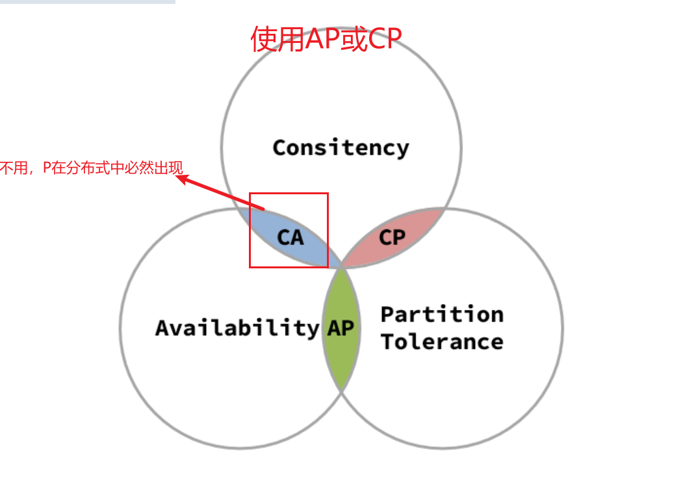

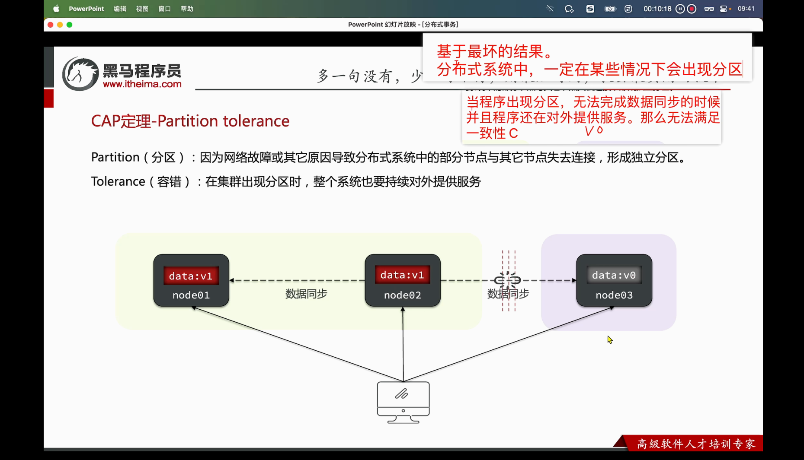

Partition（分区）：因为网络故障或其他原因导致分区分布式系统中的部分节点与其他节点失去连接，形成独立分区（一定会出现分区）

Tolerance（容错）：在集群出现分区时，整个系统也要向外提供服务

满足了程序一致性。减少了程序的可用性。（CP和AP不能同时存在）

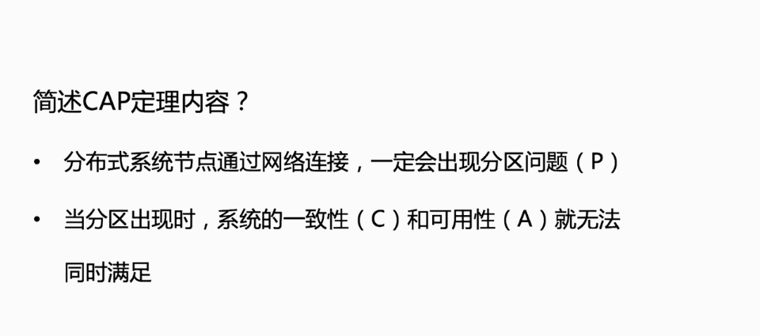

### 2.1.1一致性

### 2.1.2可用性

### 2.1.3分区容错

### 2.1.4矛盾

## BASE理论

BASE理论时对CAP的一种解决思路，包含三个思想：

Basically Available（基本可用）：分布式系统在出现故障时，允许损失部分可用性，即保证核心可用。

Soft State（软状态）：（有一段时间不可用，心跳的29秒不可用）在一定的时间内，允许出现中间状态，比如临时的不一致状态。

Eventually Consistent（最终一致性）：虽然无法保证强一致性，但是在软状态结束后，最终数据一致

分布式事务的最大大问题，是各个子事务的一致性问题，可以借鉴CAP定理和BASE理论

AP模式：各个事务分别执行和提交 最终一致

CP模式：同时执行，同时提交。强一致性。

## 分布式事务模型

解决分布式事务，各个子系统之间必须能感知到彼此的事务，才能保证状态一致，因此需要一个事务协调者来协调每一个事务的参与者（子系统事务）

MySQL怎么直接接入XA模式

......................

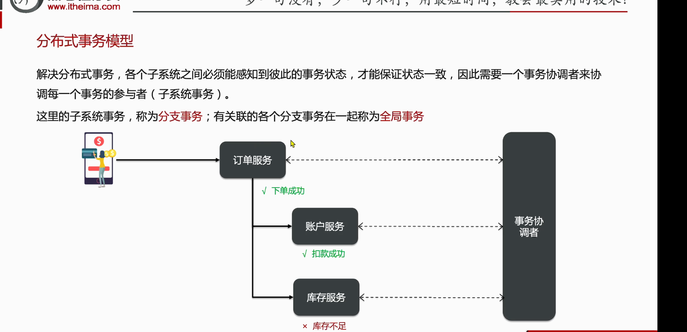

# 初始Seata

Seata事务管理中有三个重要的角色

- TC-事务协调者
- TM（Transaction Manager）-事务管理器
- RM-资源管理器

四种不同的模式

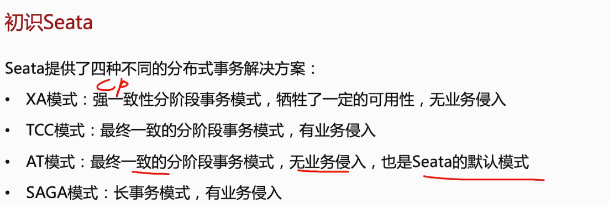

# 四种事务模型

## XA模式

XA模式的两阶段提交

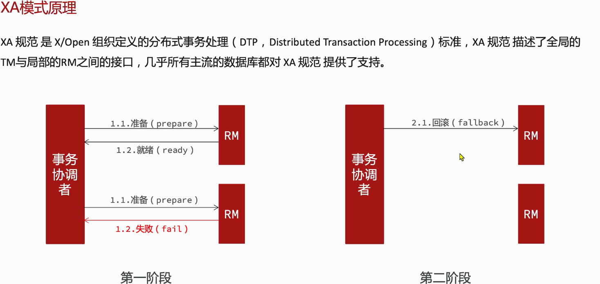

seata的提交模型

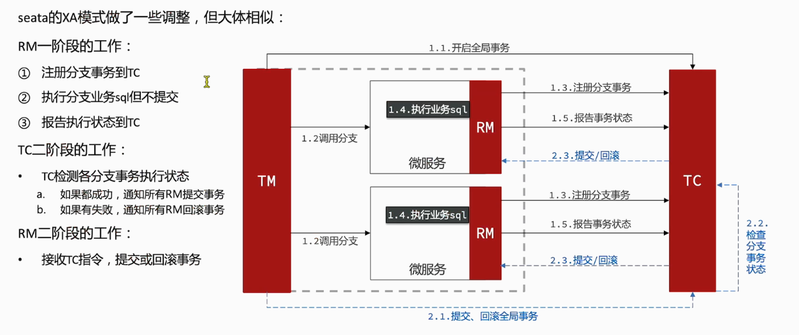

强一致性。影响性能，分支事务一直处于挂起状态，应该是行锁

如果不同微服务的配置模式不一样怎么处理？？？

@Transcationalhe@GlobaTranscational背后的工作源码

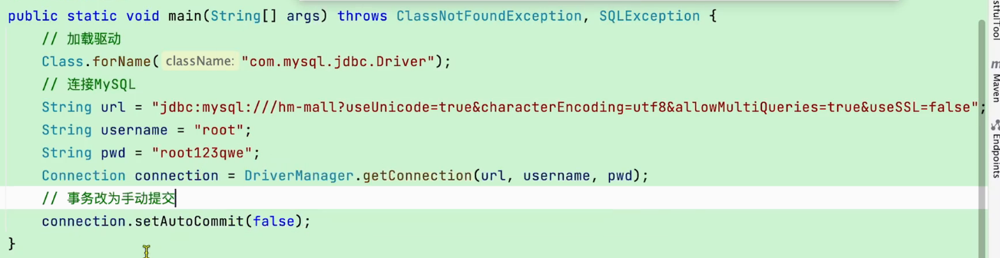

## AT模式

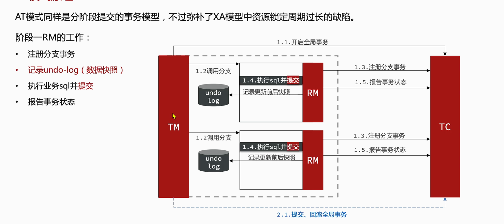

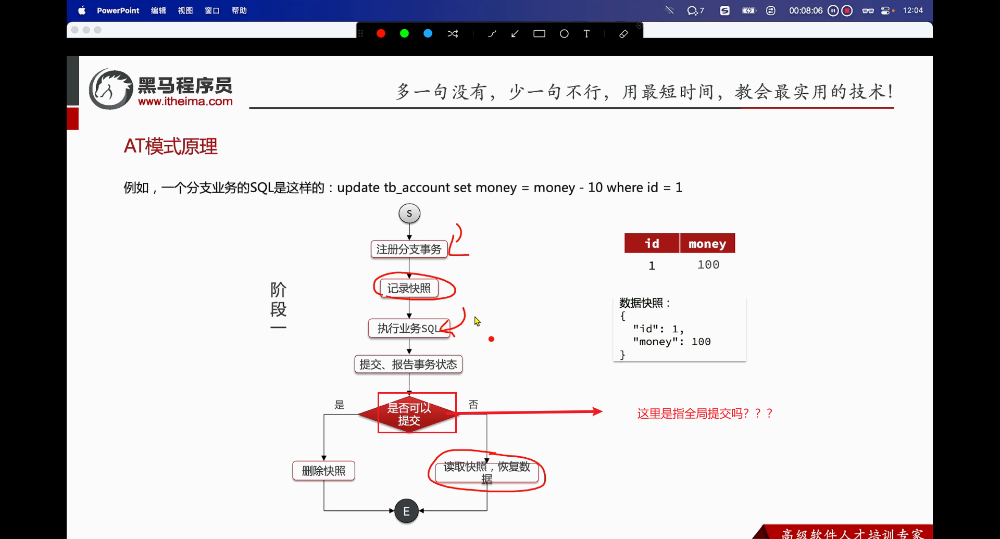

？？？？？？这里是指两阶段提交吗？

第二阶段提交是seata做的

数据库快照的实现方式

## XA和AT的区别

**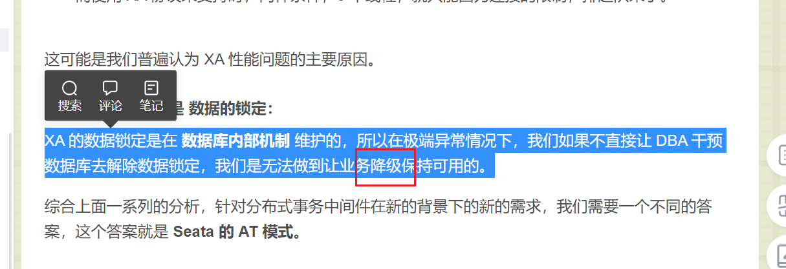**

## AT模式的脏写的问题

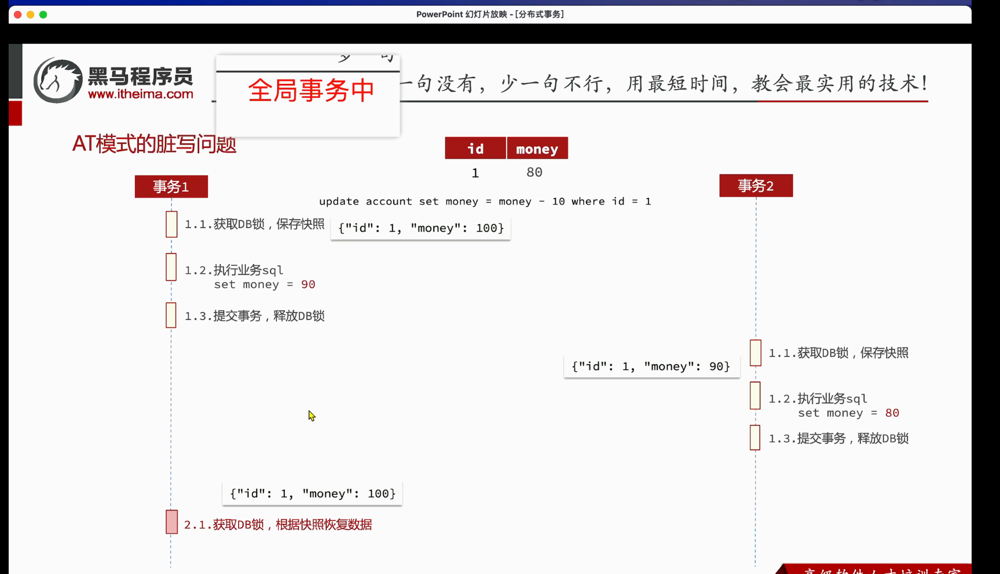

一个全局事务中，不是可以按执行顺序回滚吗？？

这不是两个全局事务才会出现的问题吗？？？？？

## AT模式的写隔离

这个隔离指的是全局事务吧？？？？

如果没有一个分布式事务中的线程来操作数据。

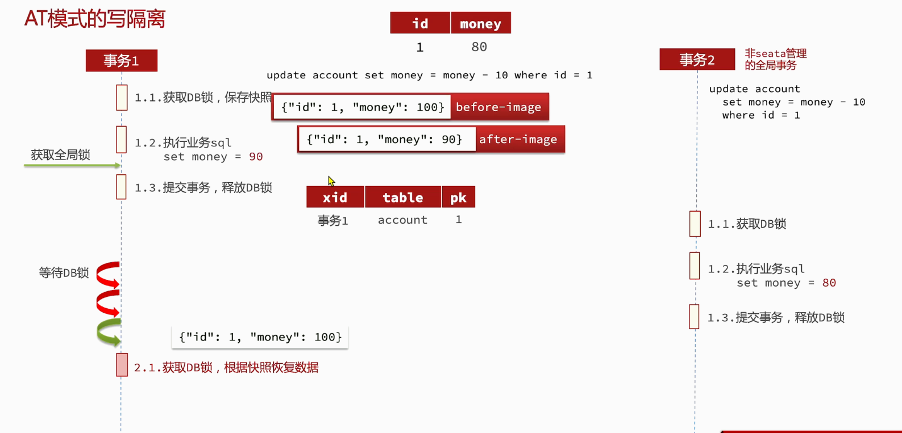

全局锁（同一全局事务，操作同一行数据，进行测试，看看能不能拿到锁）

## TCC模式

TCC模式与AT模式非常相似，每阶段都是独立事务，不同的是TCC通过人工编码来实现数据恢复，

- Try：资源检查和预留
- Confirm：业务执行和提交
- Cancel：预留资源的释放

可以用于Redis或者mongoDB

TCC的代码尝试

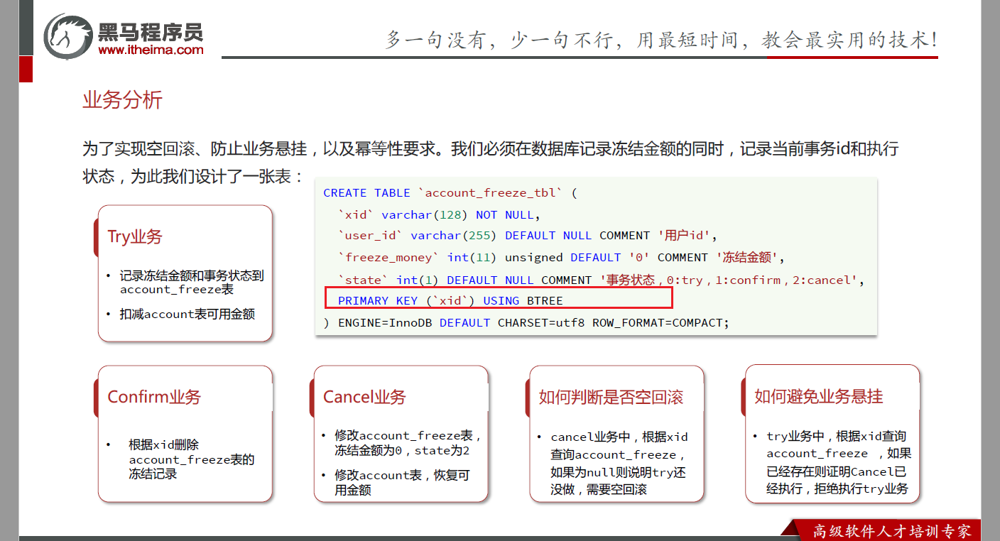

为什么要用BTREE树

断点应该也能实现TCC的测试

设计系统的时候，尽量减少使用分布式事务。

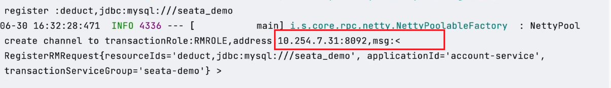

为什么会出现这个情况

网卡选择怎么处理

