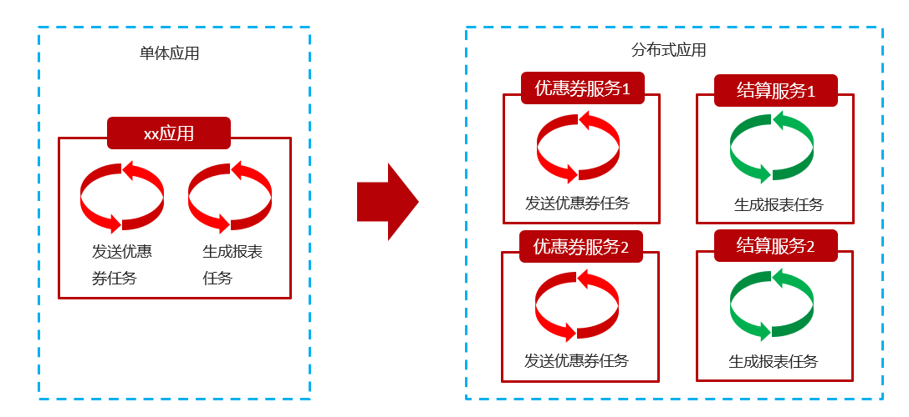

# 问题记录


<font color='blue'>这几个参数没有学过</font>

<font color='blue'>fixedRate，fixedDelay</font>

springtask有无失败重试的机制，有无日志记录

<font color='blue'>国外的分布式事务调度框架</font>

xxl-job的项目原理（功能逻辑图，代码实现）

分片广播，如何配置任务。（分治策略，普通轮询或者怎么处理？？


日志的重定向符号？？（Windows和Linux的区别）

# 学习重点

xxl-job的功能

xxl-job使用入门的步骤

xxl-job的路由策略


# 1xxl-job简介

## 1.1传统定时任务的问题

springTask(@Scheduled)实现定时任务在微服务，分布式的环境下会有问题，处理以下问题比较麻烦

- 硬编码问题：把一些配置参数在程序中写死了，硬编码问题的解决方法=>写入配置文件，或者通过框架客户端进行管理
- 失败重试问题：springtask每次执行失败，没有任何重试，也没有日志记录？？<font color='blue'>有吧？？</font>没有重试机制，可能造成严重的问题。
- 处理能力问题：如果每次任务执行时都非常的重，可能要花费很长时间，而单机服务器的处理能力有限，所以分布式任务是必然的选择

## 1.2分布式任务简介

### 1.2.1分布式任务概念

在分布式架构下，使用多个实例来运行业务，在这种分布式系统环境下运行任务调度。称为**分布式任务调度**



### 1.2.2分布式任务调用的优势

将任务调用程序分布式构建，这样就可以具有分布式系统的特点，并且提高任务的调度处理能力

- 分布式的并行任务调度

  任务调度程序分布式部署，部署成集群，可以让多条计算机共同去完成任务调用，**任务分片**，由不同的实例并行执行，提高任务调度的处理效率

- 高可用

  若某一个实例宕机，不影响其他实例来执行任务

- 弹性扩容

  当集群种增加实例可以及时提高任务的处理效率

- 任务管理与检测

  对系统中存在的所有定时任务进行统一管理及监测，让开发人员及运维人员能够时刻了解任务执行的情况，从而做出快速的应急处理响应

### 1.2.3分布式任务的问题

任务的重复执行问题，当任务调度以集群的方式部署，同一个任务执行多次（不符合预期）

如：电商系统定期发放优惠券，有可能重复发放，对公司造成所示。信用卡还款提醒重复执行多次，给用户造成困扰。

常见的解决方案：

- 分布式锁：多个实例在任务执行前获取锁。
  - redis的setnx命令，实现分布式锁
  - redission框架提供了分布式锁的实现，使用该框架解决分布式锁问题
- zookeeper选举：利用Zookeeper对Leader实例执行定时任务，执行定时任务的时候判断自己是否是Leader，如果不是则不执行，如果是则执行业务逻辑，这样也能达到目的。

## 1.3分布式任务框架对比

- TBSchedule【凉】

  淘宝推出，多年未更新，文档缺失严重，缺少维护。

- XXL-Job

  大众点评的许雪里，是一个轻量级分布式任务调度平台, 其核心设计目标是开发迅速、学习简单、轻量级、易扩展。现已开放源代码并接入多家公司线上产品线，开箱即用。

- Elastic-job【凉】

  当当网借鉴TBSchedule并基于quartz 二次开发的弹性分布式任务调度系统，功能丰富强大，采用zookeeper实现分布式协调，具有任务高可用以及分片功能。

- Saturn【凉】

  唯品会开源的一个分布式任务调度平台，基于Elastic-job，可以全域统一配置，统一监控，具有任务高可用以及分片功能。 

## 1.4xxl-job简介

XXL-JOB是一个分布式任务调度平台，其核心设计目标是开发迅速、学习简单、轻量级、易扩展。

现已开放源代码并接入多家公司线上产品线，开箱即用。

* 源码地址：https://gitee.com/xuxueli0323/xxl-job

* 文档地址：https://www.xuxueli.com/xxl-job/

xxl-job特性：

- 简单灵活

  提供Web页面对任务进行管理，管理系统支持用户管理、权限控制；

  支持容器部署；

  支持通过通用HTTP提供跨平台任务调度；

- 丰富的任务管理功能

  支持页面对任务CRUD操作；

  支持在页面编写脚本任务、命令行任务、Java代码任务并执行；

  支持任务级联编排，父任务执行结束后触发子任务执行；

  支持设置指定任务执行节点路由策略，包括轮询、随机、广播、故障转移、忙碌转移等；

  支持Cron方式、任务依赖、调度中心API接口方式触发任务执行

- 高性能

  任务调度流程全异步化设计实现，如异步调度、异步运行、异步回调等，有效对密集调度进行流量削峰；

- 高可用

  任务调度中心、任务执行节点均 集群部署，支持动态扩展、故障转移

  支持任务配置路由故障转移策略，执行器节点不可用是自动转移到其他节点执行

  支持任务超时控制、失败重试配置

  支持任务处理阻塞策略：调度当任务执行节点忙碌时来不及执行任务的处理策略, 包括:串行、抛弃、覆盖策略

- 易于监控运维

  支持设置任务失败邮件告警，预留接口支持短信、钉钉告警；

  支持实时查看任务执行运行数据统计图表、任务进度监控数据、任务完整执行日志；

# 2安装xxl-job

## 2.1环境要求

* Maven3+
* JDK1.8+
* MySQL5.7+

## 2.2本地安装

### 2.2.1SQL脚本

执行SQL脚本并且修改配置文件为本地数据库

### 2.2.2启动

> java -jar jar包名 

windows后台启动

> start /min javaw -jar xxl-job-admin-2.3.0.jar

<font color='blue'>后台启动命令，log.txt日志不管用</font>


### 2.2.3控制台

打开浏览器，输入地址 http://localhost:8080/xxl-job-admin

输入帐号：admin，密码：123456


## 2.3docker安装

<font color='blue'>待实现</font>

## 2.4集群部署

<font color='blue'>待实现</font>

# 3xxl-job入门

## 3.1概念模型

任务：要定时执行的业务，每个定时功能就是一个任务【如：定时发放优惠券，定时计算利息】

调度中心：指`xxl-job-admin`，统一管理任务，统一触发调度执行。

执行器：负责接收"调度中心"的调度并执行；可以直接部署执行器，也可以将执行器继承到现有业务项目中


## 3.2快速入门


### 3.2.1创建执行器


* AppName: 是每个执行器集群的唯一标示AppName,

  执行器会周期性以AppName为对象进行自动注册。可通过该配置自动发现注册成功的执行器, 供任务调度时使用;

* 名称: 执行器的名称,

  因为AppName限制字母数字等组成,可读性不强, 名称为了提高执行器的可读性;

* 注册方式：调度中心获取执行器地址的方式

  * 自动注册：执行器自动进行执行器注册，调度中心通过底层注册表可以动态发现执行器机器地址；
  * 手动录入：人工手动录入执行器的地址信息，多地址逗号分隔，供调度中心使用；

* 机器地址："注册方式"为"手动录入"时有效，支持人工维护执行器的地址信息；多个地址以英文逗号隔开

### 3.2.2创建任务


### 3.2.3SpringBoot整合xxl-job

#### 3.2.3.1添加依赖

```xml
<parent>
    <groupId>org.springframework.boot</groupId>
    <artifactId>spring-boot-starter-parent</artifactId>
    <version>2.3.9.RELEASE</version>
</parent>
<dependencies>
    <dependency>
        <groupId>com.xuxueli</groupId>
        <artifactId>xxl-job-core</artifactId>
        <version>2.3.0</version>
    </dependency>
    <dependency>
        <groupId>org.springframework.boot</groupId>
        <artifactId>spring-boot-starter-web</artifactId>
    </dependency>
</dependencies>
```

#### 3.2.3.2配置参数

在application.yaml中配置xxl-job相关的参数

```yml
server:
  port: 8881
#xxl开头全是自定义参数
xxl:       
  job:
    admin:
      addresses: http://localhost:8080/xxl-job-admin #调度中心的地址
    executor:
      appname: xxl-job-executor-sample #执行器的appname，在xxl-job-admin里查找这个appname
      port: 9999 #执行器回调本地端口，选填，默认9999，小于等于0则自动获取
```

#### 3.2.3.3注入Xxl执行器

创建配置类，读取配置文件中的参数，注入`XxlJobSpringExecutor`对象

**appname与执行器AppName要完全一致**

```java
package com.itheima.config;
import com.xxl.job.core.executor.impl.XxlJobSpringExecutor;
import lombok.extern.slf4j.Slf4j;
import org.springframework.beans.factory.annotation.Value;
import org.springframework.context.annotation.Bean;
import org.springframework.context.annotation.Configuration;
@Slf4j
@Configuration
public class XxlConfig {

    @Value("${xxl.job.admin.addresses}")
    private String adminAddresses;

    @Value("${xxl.job.executor.appname}")
    private String appname;

    @Value("${xxl.job.executor.port}")
    private int port;

    @Bean
    public XxlJobSpringExecutor xxlJobSpringExecutor(){
        log.info(">>>>>config-job config init.");
        XxlJobSpringExecutor executor = new XxlJobSpringExecutor();
        //xxl调度中心地址：
        executor.setAdminAddresses(adminAddresses);
        //执行器名称：使用哪一个执行器，就要写哪个执行器的名称
        executor.setAppname(appname);
        //执行器端口：执行器回调本地的端口
        executor.setPort(port);
        return executor;
    }
}
```

### 3.2.4定时任务

**@XxlJob("demoHandler")注解中值要与任务的JobHandler完全一致**

```java
package com.example.job;

import com.xxl.job.core.handler.annotation.XxlJob;
import org.springframework.stereotype.Component;

import java.time.LocalDateTime;

@Component
public class DemoJob {
  	@XxlJob("demoHandler")
    public void demoHandler(){
        System.out.println("定时任务>>>>>>"+ LocalDateTime.now());
    }
}
```

### 3.2.5测试

1. 运行引导类，启动项目
2. 打开任务调度中心，在“任务管理”界面中找到刚刚创建的任务，点击“启动”


## 3.3任务配置详解

### 3.3.1基础配置


1. 执行器：任务的绑定的执行器

   任务触发调度时将会自动发现注册成功的执行器, 实现任务自动发现功能; 

   另一方面也可以方便的进行任务分组。

   每个任务必须绑定一个执行器, 可在 "执行器管理" 进行设置;

2. 任务描述：任务的描述信息，便于任务管理；

3. 负责人：任务的负责人；

4. 报警邮件：任务调度失败时邮件通知的邮箱地址

   支持配置多邮箱地址，配置多个邮箱地址时用英文逗号分隔；

   注意：需要修改xxl-job的配置文件，配置发件人的帐号密码等信息才可以发送

### 3.3.2调度配置


调度类型：

* 无：该类型不会主动触发调度；
* CRON：该类型将会通过CRON，触发任务调度；
* 固定速度：该类型将会以固定速度，触发任务调度；按照固定的间隔时间，周期性触发；单位是秒
* 单独部署xxl-job

### 3.3.3任务配置


* 运行模式：
  *  BEAN模式：任务以JobHandler方式维护在执行器端；需要结合 "JobHandler" 属性匹配执行器中任务；
  *  GLUE模式：直接在这里配置任务的业务代码，略

* JobHandler：运行模式为 "BEAN模式" 时生效，对应执行器中新开发的JobHandler类“@XxlJob”注解自定义的value值；

* 执行参数：任务执行所需的参数

### 3.3.4高级配置


* 路由策略：当执行器集群部署时，提供丰富的路由策略，包括；
  * FIRST（第一个）：固定选择第一个机器；
  * LAST（最后一个）：固定选择最后一个机器；

  * ROUND（轮询）：轮流选择每个机器
  * RANDOM（随机）：随机选择在线的机器；
  * CONSISTENT_HASH（一致性HASH）：每个任务按照Hash算法固定选择某一台机器，且所有任务均匀散列在不同机器上。
  * LEAST_FREQUENTLY_USED（最不经常使用）：使用频率最低的机器优先被选举；
  * LEAST_RECENTLY_USED（最近最久未使用）：最久未使用的机器优先被选举；
  * FAILOVER（故障转移）：按照顺序依次进行心跳检测，第一个心跳检测成功的机器选定为目标执行器并发起调度；
  * BUSYOVER（忙碌转移）：按照顺序依次进行空闲检测，第一个空闲检测成功的机器选定为目标执行器并发起调度；
  * <font color='red'>SHARDING_BROADCAST(分片广播)：广播触发对应集群中所有机器执行一次任务，同时系统自动传递分片参数；可根据分片参数开发分片任务；</font>
* 子任务：每个任务都拥有一个唯一的任务ID(任务ID可以从任务列表获取)，当本任务执行结束并且执行成功时，将会触发子任务ID所对应的任务的一次主动调度。
* 调度过期策略：
  * 忽略：调度过期后，忽略过期的任务，从当前时间开始重新计算下次触发时间；
  * 立即执行一次：调度过期后，立即执行一次，并从当前时间开始重新计算下次触发时间；
* 阻塞处理策略：调度过于密集执行器来不及处理时的处理策略；
  * 单机串行（默认）：调度请求进入单机执行器后，调度请求进入FIFO队列并以串行方式运行；
  * 丢弃后续调度：调度请求进入单机执行器后，发现执行器存在运行的调度任务，本次请求将会被丢弃并标记为失败；
  * 覆盖之前调度：调度请求进入单机执行器后，发现执行器存在运行的调度任务，将会终止运行中的调度任务并清空队列，然后运行本地调度任务；
* 任务超时时间：支持自定义任务超时时间，任务运行超时将会主动中断任务；
* 失败重试次数；支持自定义任务失败重试次数，当任务失败时将会按照预设的失败重试次数主动进行重试；

# 4分片广播

## 4.1分片逻辑

xxl的调度中心在调度执行时，会把所有节点进行分片，每个节点都有自己的分片索引，节点每次都会执行自己分配到的分片任务


分片广播的使用场景：

* 计算银行存款的利息
  * 每天凌晨00:00:00要给所有用户的银行帐号计算利息。
  * 假如银行的帐户数量1000万，如果触发时间一到，只能一个执行器来处理的话，会花费非常多的时间
* 解决方案：使用集群的方式执行任务，比如有10个执行器节点
  * 触发时间一到，10个执行器共同开始计算利息
  * 每个执行器处理100万个帐号
* 具体方法：在每个执行器里：
  * 获取执行器的分片索引shardIndex：
  * 如果  帐号id%分片数量 == 分片索引：就处理这个帐号
* 相关API：
  * 获取当前执行器的分片索引：`XxlJobHelper.getShardIndex()`
  * 获取所有分片的数量：`XxlJobHelper.getShardTotal()`

## 4.2 调度中心设置

### 4.2.1创建分片执行器


### 4.2.2创建分片任务


## 4.3 定时任务代码

### 4.3.1配置参数

```yaml
server:
  port: 8881
xxl:
  job:
    admin:
      addresses: http://localhost:8080/xxl-job-admin
    executor:
      appname: xxl-job-executor-sharding #使用我们刚刚创建的分片执行器appname
      port: -8888
```

### 4.3.2分片任务代码★

```java
package com.itheima.job;

import com.xxl.job.core.context.XxlJobHelper;
import com.xxl.job.core.handler.annotation.XxlJob;
import org.springframework.stereotype.Component;

import java.util.ArrayList;
import java.util.Arrays;
import java.util.List;

@Component
public class DemoJob {


    @XxlJob("shardJobHandler")
    public void shardJobHandler(){
        //获取当前分片索引
        int shardIndex = XxlJobHelper.getShardIndex();
        //获取分片总数
        int shardTotal = XxlJobHelper.getShardTotal();
        //获取所有要处理的数据
        List<Integer> list = getList();
        for (int i = 0; i < list.size(); i++) {
            //只处理符合条件的数据
            if (i % shardTotal == shardIndex) {
                System.out.println("处理数据：" + i);
                Thread.sleep(1000);
            }
        }
    }

    private List<Integer> getList(){
        List<Integer> list = new ArrayList<>();
        for (int i = 0; i < 100; i++) {
            list.add(i);
        }
        return list;
    }
}
```

## 4.4测试分片广播

启动`XxlApplication8881`

启动`XxlApplication8882`

在调度中心启动任务


# N课程复习


SpringBoot约定优于配置的文件在哪里。

<font color='blue'>原Spring的需要配置哪些东西，然后现在SpringBoot完全不需要配置哪些东西（SpringBoot现在不可见）</font>

<font color='blue'>SpringCloud的五个组件？？</font>


NGINX能支撑5W并发，NGINX也可以做集群。别说并发量太高，然后讲压测的并发量

<font color='blue'>LVS</font>（）

<font color='blue'>nacos的分级存储模型=>cluster</font>

feign优化可以使用http连接池