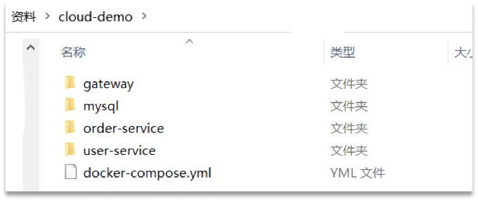

# 问题记录

<font color='blue'>DockerSwarm与K8S区别</font>，

<font color='blue'>Docker微服务的网络管理哪个工具来做的</font>

# 待归档区

```

```


# 1-Docker概述

## 1.0-摘要

- 容器化技术
- 基于GO语言开发

## 1.1.什么是Docker

微服务虽然具备各种各样的优势，但服务的拆分通用给部署带来了很大的麻烦。

- 分布式系统中，依赖的组件非常多，不同组件之间部署时往往会产生一些冲突。
- 在数百上千台服务中重复部署，环境不一定一致，会遇到各种问题

### 1.1.1.应用部署的环境问题

大型项目组件较多，运行环境也较为复杂，部署时会碰到一些问题：

- 依赖关系复杂，容易出现兼容性问题

- 开发、测试、生产环境有差异


例如一个项目中，部署时需要依赖于node.js、Redis、RabbitMQ、MySQL等，这些服务部署时所需要的函数库、依赖项各不相同，甚至会有冲突。给部署带来了极大的困难。

### 1.1.2.Docker解决依赖兼容问题

而Docker确巧妙的解决了这些问题，Docker是如何实现的呢？

Docker为了解决依赖的兼容问题的，采用了两个手段：

- 将应用的Libs（函数库）、Deps（依赖）、配置与应用一起打包

- 将每个应用放到一个隔离**容器**去运行，避免互相干扰


这样打包好的应用包中，既包含应用本身，也保护应用所需要的Libs、Deps，无需再操作系统上安装这些，自然就不存在不同应用之间的兼容问题了。


虽然解决了不同应用的兼容问题，但是开发、测试等环境会存在差异，操作系统版本也会有差异，怎么解决这些问题呢？


### 1.1.3.Docker解决操作系统环境差异

要解决不同操作系统环境差异问题，必须先了解操作系统结构。以一个Ubuntu操作系统为例，结构如下：


结构包括：

- 计算机硬件：例如CPU、内存、磁盘等
- 系统内核：所有Linux发行版的内核都是Linux，例如CentOS、Ubuntu、Fedora等。内核可以与计算机硬件交互，对外提供**内核指令**，用于操作计算机硬件。
- 系统应用：操作系统本身提供的应用、函数库。这些函数库是对内核指令的封装，使用更加方便。

应用于计算机交互的流程如下：

- 应用调用操作系统应用（函数库），实现各种功能

- 系统函数库是对内核指令集的封装，会调用内核指令
- 内核指令操作计算机硬件

Ubuntu和CentOS都是基于Linux内核，无非是系统应用不同，提供的函数库有差异：


此时，如果将一个Ubuntu版本的MySQL应用安装到CentOS系统，MySQL在调用Ubuntu函数库时，会发现找不到或者不匹配，就会报错了：


Docker如何解决不同系统环境的问题？

- Docker将用户程序与所需要调用的系统(比如Ubuntu)函数库一起打包
- Docker运行到不同操作系统时，直接基于打包的函数库，借助于操作系统的Linux内核来运行

如图：


### 1.1.4.小结

Docker如何解决大型项目依赖关系复杂，不同组件依赖的兼容性问题？

- Docker允许开发中将应用、依赖、函数库、配置一起**打包**，形成可移植镜像
- Docker应用运行在容器中，使用沙箱机制，相互**隔离**

Docker如何解决开发、测试、生产环境有差异的问题？

- Docker镜像中包含完整运行环境，包括系统函数库，仅依赖系统的Linux内核，因此可以在任意Linux操作系统上运行

Docker是一个快速交付应用、运行应用的技术，具备下列优势：

- 可以将程序及其依赖、运行环境一起打包为一个镜像，可以迁移到任意Linux操作系统
- 运行时利用沙箱机制形成隔离容器，各个应用互不干扰
- 启动、移除都可以通过一行命令完成，方便快捷

## 1.2.Docker和虚拟机的区别

Docker可以让一个应用在任何操作系统中非常方便的运行。而以前我们接触的虚拟机，也能在一个操作系统中，运行另外一个操作系统，保护系统中的任何应用。

两者有什么差异呢？

**虚拟机**（virtual machine）是在操作系统中**模拟**硬件设备，然后运行另一个操作系统，比如在 Windows 系统里面运行 Ubuntu 系统，这样就可以运行任意的Ubuntu应用了。

**Docker**仅仅是封装函数库，并没有模拟完整的操作系统，如图：


对比来看：


小结：

Docker和虚拟机的差异：

- docker是一个系统进程；虚拟机是在操作系统中的操作系统

- docker体积小、启动速度快、性能好；虚拟机体积大、启动速度慢、性能一般

## 1.3.Docker架构

### 1.3.1.镜像和容器

Docker中有几个重要的概念：

**镜像（Image）**：Docker将应用程序及其所需的依赖、函数库、环境、配置等文件打包在一起，称为镜像。

**容器（Container）**：镜像中的应用程序运行后形成的进程就是**容器**，只是Docker会给容器进程做隔离，对外不可见。

一切应用最终都是代码组成，都是硬盘中的一个个的字节形成的**文件**。只有运行时，才会加载到内存，形成进程。

而**镜像**，就是把一个应用在硬盘上的文件、及其运行环境、部分系统函数库文件一起打包形成的文件包。这个文件包是只读的。

**容器**呢，就是将这些文件中编写的程序、函数加载到内存中允许，形成进程，只不过要隔离起来。因此一个镜像可以启动多次，形成多个容器进程。


例如你下载了一个QQ，如果我们将QQ在磁盘上的运行**文件**及其运行的操作系统依赖打包，形成QQ镜像。然后你可以启动多次，双开、甚至三开QQ，跟多个妹子聊天。

### 1.3.2.DockerHub

开源应用程序非常多，打包这些应用往往是重复的劳动。为了避免这些重复劳动，人们就会将自己打包的应用镜像，例如Redis、MySQL镜像放到网络上，共享使用，就像GitHub的代码共享一样。

- DockerHub：DockerHub是一个官方的Docker镜像的托管平台。这样的平台称为Docker Registry。

- 国内也有类似于DockerHub 的公开服务，比如 [网易云镜像服务](https://c.163yun.com/hub)、[阿里云镜像库](https://cr.console.aliyun.com/)等。


我们一方面可以将自己的镜像共享到DockerHub，另一方面也可以从DockerHub拉取镜像：


### 1.3.3.Docker架构

我们要使用Docker来操作镜像、容器，就必须要安装Docker。

Docker是一个CS架构的程序，由两部分组成：

- 服务端(server)：Docker守护进程，负责处理Docker指令，管理镜像、容器等

- 客户端(client)：通过命令或RestAPI向Docker服务端发送指令。可以在本地或远程向服务端发送指令。

如图：


### 1.3.4.小结

镜像：

- 将应用程序及其依赖、环境、配置打包在一起

容器：

- 镜像运行起来就是容器，一个镜像可以运行多个容器

Docker结构：

- 服务端：接收命令或远程请求，操作镜像或容器

- 客户端：发送命令或者请求到Docker服务端

DockerHub：

- 一个镜像托管的服务器，类似的还有阿里云镜像服务，统称为DockerRegistry

## 1.4-OCI

> 开放容器技术（The Open Container Initiative）简称OCI

CoreOS公司的产品

## 1.5-容器化技术的历史与发展

- OpenStack：公认的云计算IaaS平台，其管理的核心目标对象是机器（虚拟机或物理机），当然也可以管理存储和网络，但那些也大都是围绕着机器所提供的配套资源。近年来容器技术火了之后，OpenStack也开始通过各种方式增加对容器的支持，但目前OpenStack还不被视为管理容器的主流平台。
- Docker：这里我假定你指的是Docker engine（也叫做Docker daemon，或最新的名字：Moby），它是一种容器运行时（container runtime）的实现，而且是最主流的实现，几乎就是容器业界的事实标准。Docker是用来创建和管理容器的，它和容器的关系就好比Hypervisor（比如：KVM）和虚拟机之间的关系。当然，Docker公司对Docker engine本身的定位和期望不仅仅在于在单机上管理容器，所以近年来一直在向Docker engine中加入各种各样的高级功能，比如：组建多节点的Docker集群、容器编排、服务发现，等等。
- Kubernetes（K8s）：搭建容器集群和进行容器编排的主流开源项目（亲爹是Google），适合搭建PaaS平台。容器是Kubernetes管理的核心目标对象，它和容器的关系就好比OpenStack和虚拟机之间的关系，而它和Docker的关系就好比OpenStack和Hypervisor之间的关系。一般来说，Kubernetes是和Docker配合使用的，Kubernetes调用每个节点上的Docker去创建和管理容器，所以，你可以认为Kubernetes是大脑，而Docker是四肢。
- Mesos：哈，终于说到我目前正在做的啦！Mesos是一个通用资源管理平台，它所管理的核心目标对象既不是虚拟机/物理机，也不是容器，而是各种各样的计算资源（CPU、memory、disk、port、GPU等等）。Mesos会收集各个节点上的计算资源然后提供给运行在它之上的应用框架（比如：Spark、Marathon、甚至是Kubernetes）来使用，应用框架可以将收到的计算资源以自己喜欢的任何方式创建成计算任务来完成特定工作（比如：创建一个大数据任务计算个π什么的）。由于容器技术近年来的火热，Mesos也对容器进行非常深层次的支持，它内部完整地实现了一个容器运行时（类似于Docker），所以，上层的应用框架可以方便地把自己的计算任务以容器的方式在Mesos管理的计算集群中运行起来。使用Mesos的门槛相对较高（需要应用框架编写代码调用Mesos的API和其集成），但一旦用起来之后灵活性和可扩展性更高，因为Mesos并不限制应用框架如何使用计算资源（可以以容器的方式使用，也可以是其它方式，比如：传统的进程），主动权完全在应用框架自己手中。作为对比，Kubernetes只能管理容器，所有任务都必须以容器的方式来运行。为了解决门槛较高的问题（当然也是为了赚钱），Mesosphere（Mesos这个开源项目背后的商业公司）推出了DC/OS，其核心就是Mesos加一个内置的应用框架Marathon（可以用做容器编排），能够达到开箱即用的效果，安装好之后立刻就可以创建和管理容器和非容器类的任务了。

# 2-Docker安装

##  2.1-Docker版本

Docker 分为 CE 和 EE 两大版本。CE 即社区版（免费，支持周期 7 个月），EE 即企业版，强调安全，付费使用，支持周期 24 个月。

Docker CE 分为 `stable` `test` 和 `nightly` 三个更新频道。

## 2.2-CentOS安装Docker

Docker CE 支持 64 位版本 CentOS 7，并且要求内核版本不低于 3.10， CentOS 7 满足最低内核的要求，所以我们在CentOS 7安装Docker。

### 2.2.1-卸载（可选）

如果之前安装过旧版本的Docker，可以使用下面命令卸载：

```
yum remove docker \
                  docker-client \
                  docker-client-latest \
                  docker-common \
                  docker-latest \
                  docker-latest-logrotate \
                  docker-logrotate \
                  docker-selinux \
                  docker-engine-selinux \
                  docker-engine \
                  docker-ce
```

### 2.2.2-安装docker

首先需要大家虚拟机联网，安装yum工具

```sh
yum install -y yum-utils \
           device-mapper-persistent-data \
           lvm2 --skip-broken
```

然后更新本地镜像源：

```shell
# 设置docker镜像源
yum-config-manager \
    --add-repo \
    https://mirrors.aliyun.com/docker-ce/linux/centos/docker-ce.repo
    
sed -i 's/download.docker.com/mirrors.aliyun.com\/docker-ce/g' /etc/yum.repos.d/docker-ce.repo

yum makecache fast
```

然后输入命令：

```shell
yum install -y docker-ce
```

docker-ce为社区免费版本。稍等片刻，docker即可安装成功。

### 2.2.3-启动docker

Docker应用需要用到各种端口，逐一去修改防火墙设置。非常麻烦，因此建议大家直接关闭防火墙！

**启动docker前，一定要关闭防火墙后！！**

> 云服务器，配置端口放行

关闭本地防火墙

```sh
# 关闭
systemctl stop firewalld
# 禁止开机启动防火墙
systemctl disable firewalld
```

启停docke命令r：

```sh
systemctl start docker  # 启动docker服务

systemctl stop docker  # 停止docker服务

systemctl restart docker  # 重启docker服务
```

查看docker版本：

```
docker -v
```

如图：

 


### 2.2.4-配置镜像加速

docker官方镜像仓库网速较差，我们需要设置国内镜像服务：

参考阿里云的镜像加速文档：https://cr.console.aliyun.com/cn-hangzhou/instances/mirrors

```sh
mkdir -p /etc/docker

tee /usr/local/tj/docker/daemon.json <<-'EOF'
{
 "registry-mirrors":["https://n0dwemtq.mirror.aliyuncs.com"]
}
EOF

systemctl daemon-reload
systemctl restart docker
```


# 3-Docker镜像

## 3.1-镜像简介

镜像由多个层组成，每层叠加之后，从外部看来就如一个独立的对象。镜像内部是一个精简的操作系统（OS），同时还包含应用运行所必须的文件和依赖包。

镜像可以理解为一种构建时（build-time）结构，而容器可以理解为一种运行时（run-time）结构。

一旦容器从镜像启动后，二者就会变成互相依赖的卦象你，并且在镜像上启动的容器全部停止之前，镜像时无法删除的。

> -f 参数能强制删除

## 3.2-镜像命名

首先来看下镜像的名称组成：

- 镜名称一般分两部分组成：[repository]:[tag]。

如图：


这里的mysql就是repository，5.7就是tag，合一起就是镜像名称，代表5.7版本的MySQL镜像。

如果没有在仓库名称后指定具体的镜像标签，则Docker会默认拉取标签为latest的镜像，但是latest不能完全保证这是仓库中最新的镜像

> Alpine仓库镜像最新的标签的是edge


## 3.3-镜像命令图解

常见的镜像操作命令如图：


## 3.4-image ls

> 查看本地镜像，等价命令 docker images

命令格式

```
docker image ls
```

案例

```sh
[root@hecs-352343 ~]# docker image ls
REPOSITORY              TAG                 IMAGE ID       CREATED         SIZE
tj-auth                 latest              25efdac9cbd5   24 hours ago    373MB
tj-promotion            latest              14151ea4a700   4 weeks ago     386MB
tj-learning             latest              e4f868bc1134   4 weeks ago     386MB
```

`--digests`参数可以查看本地镜像摘要（Image Digest），用来确保拉取的是想要的镜像

可以使用`--filter`参数来进行过滤<font color='blue'>待尝试</font>


## 3.5-image rm

> 删除本地镜像，等价于docker rmi

```sh
docker image rm <repository>:<tag>
docker rmi <repository>:<tag>
```

## 3.6-image history

> 显示构建历史

案例

```sh
[root@hecs-352343 ~]# docker image history redis
IMAGE          CREATED       CREATED BY                                       SIZE    
7e89539dd8bd   5 weeks ago   /bin/sh -c #(nop)  CMD ["redis-server"]          0B       
<missing>      5 weeks ago   /bin/sh -c #(nop)  EXPOSE 6379                   0B       
<missing>      5 weeks ago   /bin/sh -c #(nop)  ENTRYPOINT ["docker-entry…   0B       
<missing>      5 weeks ago   /bin/sh -c #(nop) COPY file:e873a0e3c13001b5…   661B     
<missing>      5 weeks ago   /bin/sh -c #(nop) WORKDIR /data                  0B       
<missing>      5 weeks ago   /bin/sh -c #(nop)  VOLUME [/data]                0B       
<missing>      5 weeks ago   /bin/sh -c mkdir /data && chown redis:redis …   0B       
<missing>      5 weeks ago   /bin/sh -c set -eux;   savedAptMark="$(apt-m…   51.1MB   
<missing>      5 weeks ago   /bin/sh -c #(nop)  ENV REDIS_DOWNLOAD_SHA=9d…   0B       
<missing>      5 weeks ago   /bin/sh -c #(nop)  ENV REDIS_DOWNLOAD_URL=ht…   0B       
<missing>      5 weeks ago   /bin/sh -c #(nop)  ENV REDIS_VERSION=7.0.12      0B       
<missing>      6 weeks ago   /bin/sh -c set -eux;  savedAptMark="$(apt-ma…   4.12MB   
<missing>      6 weeks ago   /bin/sh -c #(nop)  ENV GOSU_VERSION=1.16         0B       
<missing>      6 weeks ago   /bin/sh -c groupadd -r -g 999 redis && usera…   4.3kB     
<missing>      6 weeks ago   /bin/sh -c #(nop)  CMD ["bash"]                  0B       
<missing>      6 weeks ago   /bin/sh -c #(nop) ADD file:bd80a4461150784e5…   74.8MB   

```

## 3.7-image inspect

> 查看镜像细节，展示镜像层数据和元数据


> 显示该镜像由6个分层组成

## 3.8-image pull

> 拉取镜像，等价于docker pull

首先去镜像仓库搜索nginx镜像，比如[DockerHub](https://hub.docker.com/):

命令格式

```sh
docker pull <repository>:<tag>
docker image pull<repository>:<tag>
```

## 3.9-image push

> 向镜像仓库推送镜像

<font color='blue'>应该是需要权限的，尝试镜像私服后总结</font>

## 3.9-image save

> 将镜像导出为文件

命令格式：

```shell
docker save -o [保存的目标文件名称] [镜像名称]
```

使用docker save导出镜像到磁盘 

```sh
docker save -o nginx.tar nginx:latest
```

结果如图：


## 3.10-image load

> 将文件加载为镜像

命令格式

```sh
docker load -i [源文件名]
```

然后运行命令，加载本地文件：

```sh
docker load -i nginx.tar
```

结果：


## 3.11-image build

> 构建镜像

<font color='blue'>待尝试，要被废弃了？？</font>


# 4-Docker容器

## 4.1容器简介

容器与虚拟的最大区别就是容器更快和更轻量，容器会共享其所在的主机的操作系统和内核。

## 4.2-容器VS虚拟机

<font color='blue'>容于于虚拟机的架构图谱</font>

## 4.3-容器生命周期

创建，运行，休眠，销毁

容器操作的命令如图：


容器保护三个状态：

- 运行：进程正常运行
- 暂停：进程暂停，CPU不再运行，并不释放内存
- 停止：进程终止，回收进程占用的内存、CPU等资源

其中：

- docker run：创建并运行一个容器，处于运行状态
- docker pause：让一个运行的容器暂停
- docker unpause：让一个容器从暂停状态恢复运行
- docker stop：停止一个运行的容器
- docker start：让一个停止的容器再次运行

- docker rm：删除一个容器

## 4.4-★container run★

> 创建并运行一个容器，处于运行状态

常用参数

`-d`:` --detach=false`， 指定容器运行于前台还是后台，默认为false（后台启动）

```sh
docker run --name containerName -p 80:80 -d nginx
```

`--name=""`：指定容器名字，后续可以通过名字进行容器管理，links特性需要使用名字

```sh
docker run --name containerName -p 80:80 -d nginx
```

`-e`：`--env=[]`， 指定环境变量，容器中可以使用该环境变量，（如指定JVM虚拟机参数）

```sh
#指定虚拟参数
-e JAVA_OPTS="-Xms300m -Xmx300m" 
```

`-p`：--publish=[]， 指定容器暴露的端口（左边宿主机端口，右边容器端口）

```sh
#nginx端口配置
-p 80:80 -p 443:443 -p 18081:18081 -p 18082:18082
```

`-v`： --volume=[]， 给容器挂载存储卷，挂载到容器的某个目录（左边宿主机目录或数据卷，右边容器内目录）

```sh
 -v /usr/local/src/nginx/conf/nginx.conf:/etc/nginx/nginx.conf 
 -v /usr/local/src/nginx/html:/etc/nginx/html
```

`--restart`：设置重启策略，通常使用`always`

- always：当daemon重启的时候，停止的容器也会被重启
- no：容器退出时不重启
- unless-stopped：<font color='blue'>？？？</font>
- on-failure：容器故障退出（返回值非零）时重启，就算容器处于stopped状态，只要daemon重启，容器也会被重启。

```sh
--restart=always
```

`-m`：`--memory=""`， 指定容器的内存上限

```sh
--memory 300m #设置容器内存上线300M
--memory-swap -1 #不限制容器能使用的 swap 分区大小
```

`--net="bridge"`： 容器网络设置

```sh
#设置加入tjxt的网络
--network tjxt
```

`-c`：`--cpu-shares=0`， 设置容器CPU权重，在CPU共享场景使用

`--link=[]`： 指定容器间的关联，使用其他容器的IP、env等信息

`--env-file=[]`：指定环境变量文件，文件格式为每行一个环境变量


<font color='blue'>待补充，总结</font>

## 4.5-container ps

> 包含所有容器的详细信息（默认只展示运行中）
>
> - CONTAINER ID： 容器的唯一标识符。
> - IMAGE：容器基于的映像。
> - COMMAND：容器启动时执行的命令。
> - CREATED：容器的创建时间。
> - STATUS： 容器的当前状态（正在运行或已停止）。
> - PORTS：容器正在使用的端口。
> - NAMES：容器的名称。

`-a`：返回所有容器的详细信息，包含未运行的

> 可以使用管道符筛选

## 4.6-container inspect

> 查看容器详细信息
>
> 容器如果启动不成功，可以查看容器详情，OOMkilled=true，代表内存溢出

命令格式

```sh
dockers container inspect 容器名
```


## 4.7-container exec

> 进入容器内部

```sh
docker container exec -it 容器名 bash
```

- docker exec ：进入容器内部，执行一个命令

- -it : 给当前进入的容器创建一个标准输入、输出终端，允许我们与容器交互

- mn ：要进入的容器的名称

- bash：进入容器后执行的命令，bash是一个linux终端交互命令

## 4.8-container logs

> 查看容器日志

```sh
docker container logs  -f 容器名
```

`-f`：持续打印日志

`--tail 50 `：打印日志末尾50行

## 4.9-container stop

> 停止容器

```sh
docker container stop 容器名或容器ID
```

## 4.10-container start

> 启动容器

```sh
docker container start 容器名或容器ID
```

## 4.11-container rm

> 删除容器

```sh
docker container rm 容器名或容器ID
```

`-f`：删除运行中的容器

## 4.12-container pause

> 暂停容器

```sh
docker container pause 容器名或容器ID
```

## 4.13-container unpause

> 从暂停状态恢复回来
>

```sh
docker container unpause 容器名或容器ID
```

# 5-Docker数据卷

## 5.1-数据卷简介

对于微服务设计模式来说，容器是个不错的选择，微服务是无状态的、临时的工作负载。同时容器即服务。

每个Docker容器都有自己的非持久化存储，非持久化存储自动创建，从属于容器，生命周期与容器相同，意味着删除容器也会删除全部非持久化数据。

如果希望自己的容器数据保留下来（持久化），则需要将数据存储在卷上，卷与容器是解耦的。

**数据卷（volume）**是一个虚拟目录，指向宿主机文件系统中的某个目录。


一旦完成数据卷挂载，对容器的一切操作都会作用在数据卷对应的宿主机目录了。

这样，我们操作宿主机的/var/lib/docker/volumes/html目录，就等于操作容器内的/usr/share/nginx/html目录了

**数据卷位置：宿主机的/var/lib/docker/volumes**

容器不仅仅可以挂载数据卷，也可以直接挂载到宿主机目录上。关联关系如下：

- 带数据卷模式：宿主机目录 --> 数据卷 ---> 容器内目录
- 直接挂载模式：宿主机目录 ---> 容器内目录

如图：


## 5.2-数据卷挂载

**语法**：

目录挂载与数据卷挂载的语法是类似的：

- -v volume名称:容器内目录

- -v [宿主机目录]:[容器内目录]
- -v [宿主机文件]:[容器内文件]

我们在创建容器时，可以通过 -v 参数来挂载一个数据卷到某个容器内目录，命令格式如下：

```sh
docker run \
  --name mn \
  -v html:/root/html \
  -p 8080:80
  nginx \
```

> 这里的-v就是挂载数据卷的命令

数据卷挂载与目录直接挂载的

- 数据卷挂载耦合度低，由docker来管理目录，但是目录较深，不好找
- 目录挂载耦合度高，需要我们自己管理目录，不过目录容易寻找查看

## 5.3-volume create

> 创建数据卷，新卷默认使用loacl驱动
>
> 在使用run启动容器时，如果数据卷存在，则使用该卷，如果指定的卷不存在，则新建卷

```sh
 docker volume inspect 数据卷名
```

`-d`：指定不同驱动

## 5.4-volume ls

> 查看所有数据卷

## 5.5-volume inspect

> 查看数据卷详细信息，包括关联的宿主机目录位置

## 5.6-volume prune

> 删除所有未使用的数据卷

## 5.7-volume rm

> 删除指定数据卷

docker不允许删除正在被容器使用的卷

## 5.8-数据卷驱动

默认情况Docker新建卷时采用内置的loacl驱动，恰如其名，本地卷只能被所在节点的容器的节点使用

<font color='blue'>Docker支持不同的驱动，探索其应用场景再来总结</font>


# ❔6-Docker网络

## 6.1-网络概述


## 6.2-单机桥接网络

> 小型项目还可以用

## 6.3-多机覆盖网络

> <font color='blue'>这个是最常用的对吗</font>

# 7-DockerFile

## 7.1-概述

常见的镜像在DockerHub就能找到，但是我们自己写的项目就必须自己构建镜像了。

而要自定义镜像，就必须先了解镜像的结构才行。

### 7.1.1-镜像结构

镜像是将应用程序及其需要的系统函数库、环境、配置、依赖打包而成。

我们以MySQL为例，来看看镜像的组成结构：


简单来说，镜像就是在系统函数库、运行环境基础上，添加应用程序文件、配置文件、依赖文件等组合，然后编写好启动脚本打包在一起形成的文件。

我们要构建镜像，其实就是实现上述打包的过程。

构建自定义的镜像时，并不需要一个个文件去拷贝，打包。

我们只需要告诉Docker，我们的镜像的组成，需要哪些BaseImage、需要拷贝什么文件、需要安装什么依赖、启动脚本是什么，将来Docker会帮助我们构建镜像。

而描述上述信息的文件就是Dockerfile文件。

### 7.1.2-指令语法

**Dockerfile**就是一个文本文件，其中包含一个个的**指令(Instruction)**，用指令来说明要执行什么操作来构建镜像。每一个指令都会形成一层Layer。

```
FROM			指定基础镜像
MAINTAINER		指定作者
RUN				执行参数中定义的命令，构建镜像时需要的命令
EXPOSE			向容器外部公开的端口号
WORKDIR			设置容器内默认工作目录
USER			指定用户
ENTROYPOINT		指定一个容器启动时运行的命令
ENV				设置环境变量
ADD|COPY		复制文件到镜像中
VOLUME			容器数据卷，向镜像创建的容器添加卷
CMD				容器启动时要运行的命令，可以有多个，但只有最后一个生效
```


更新详细语法说明，请参考官网文档： https://docs.docker.com/engine/reference/builder

## 7.2-构建Java项目

### 7.2.1-基于Ubuntu构建Java项目

需求：基于Ubuntu镜像构建一个新镜像，运行一个java项目

- 步骤1：新建一个空文件夹docker-demo

  

- 步骤2：拷贝课前资料中的docker-demo.jar文件到docker-demo这个目录

  

- 步骤3：拷贝课前资料中的jdk8.tar.gz文件到docker-demo这个目录

  

- 步骤4：拷贝课前资料提供的Dockerfile到docker-demo这个目录

  

  其中的内容如下：

  ```dockerfile
  # 指定基础镜像
  FROM ubuntu:16.04
  # 配置环境变量，JDK的安装目录
  ENV JAVA_DIR=/usr/local
  
  # 拷贝jdk和java项目的包
  COPY ./jdk8.tar.gz $JAVA_DIR/
  COPY ./docker-demo.jar /tmp/app.jar
  
  # 安装JDK
  RUN cd $JAVA_DIR \
   && tar -xf ./jdk8.tar.gz \
   && mv ./jdk1.8.0_144 ./java8
  
  # 配置环境变量
  ENV JAVA_HOME=$JAVA_DIR/java8
  ENV PATH=$PATH:$JAVA_HOME/bin
  
  # 暴露端口
  EXPOSE 8090
  # 入口，java项目的启动命令
  ENTRYPOINT java -jar /tmp/app.jar
  ```

  

- 步骤5：进入docker-demo

  将准备好的docker-demo上传到虚拟机任意目录，然后进入docker-demo目录下

- 步骤6：运行命令：

  ```sh
  docker build -t javaweb:1.0 .
  ```

  

最后访问 http://192.168.150.101:8090/hello/count，其中的ip改成你的虚拟机ip


### 7.2.2-基于java8构建Java项目

虽然我们可以基于Ubuntu基础镜像，添加任意自己需要的安装包，构建镜像，但是却比较麻烦。所以大多数情况下，我们都可以在一些安装了部分软件的基础镜像上做改造。

例如，构建java项目的镜像，可以在已经准备了JDK的基础镜像基础上构建。


需求：基于openjdk:8镜像，将一个Java项目构建为镜像

实现思路如下：

- ① 新建一个空的目录，然后在目录中新建一个文件，命名为Dockerfile

- ② 拷贝课前资料提供的docker-demo.jar到这个目录中

- ③ 编写Dockerfile文件：

  - a ）基于openjdk:8作为基础镜像

  - b ）将app.jar拷贝到镜像中

  - c ）暴露端口

  - d ）编写入口ENTRYPOINT

    内容如下：

    ```dockerfile
    FROM openjdk:8
    COPY ./app.jar /tmp/app.jar
    EXPOSE 8090
    ENTRYPOINT java -jar /tmp/app.jar
    ```

    

- ④ 使用docker build命令构建镜像

- ⑤ 使用docker run创建容器并运行


## 7.3-天机学堂示例

<font color='blue'>没有发现Maven指令在什么时候起的作用</font>

天机学堂-统一的DockerFile

```dockerfile
FROM openjdk:11.0-jre-buster
LABEL maintainer="研究院研发组 <research-maint@itcast.cn>"
ENV JAVA_OPTS=""
# 设定时区
ENV TZ=Asia/Shanghai
RUN ln -snf /usr/share/zoneinfo/$TZ /etc/localtime && echo $TZ > /etc/timezone

WORKDIR /app
ADD app.jar /app/app.jar

ENTRYPOINT ["sh","-c","java  -jar $JAVA_OPTS /app/app.jar"]
```

天机学堂-Jenkins的流水线配置

```sh
pipeline {
    agent any
    environment { 
        S_NAME = 'tj-auth'
        S_PORT = '8081'
    }
    stages {
        stage('Build') {
            steps {
                sh "cp ../tjxt-dev-build/${S_NAME}/${S_NAME}-service/target/${S_NAME}-service.jar ./app.jar"
                sh "cp ../tjxt-dev-build/Dockerfile ./Dockerfile"
                sh '[ -n "`docker ps -a | grep ${S_NAME}`" ] && docker rm -f ${S_NAME} || echo 1'
                sh '[ -n "`docker images | grep ${S_NAME}`" ] && docker rmi ${S_NAME} || echo 1'
                sh 'docker build -t ${S_NAME} --build-arg JAVA_OPTS="-Xms300m -Xmx300m" .'
            }
        }
        stage('deploy') {
            steps {
                sh 'docker run --name ${S_NAME} -e JAVA_OPTS="-Xms300m -Xmx300m" --memory 500m --memory-swap -1 --network tjxt -p ${S_PORT}:${S_PORT} -d ${S_NAME}'
            }
        }
    }
}
```

天机学堂-输出结果

> <font color='blue'>什么时候打成的jar包啊</font>

```sh
Started by user huge
[Pipeline] Start of Pipeline
[Pipeline] node
Running on Jenkins in /var/jenkins_home/workspace/tj-auth
[Pipeline] {
[Pipeline] withEnv
[Pipeline] {
[Pipeline] stage
[Pipeline] { (Build)
[Pipeline] sh
+ cp ../tjxt-dev-build/tj-auth/tj-auth-service/target/tj-auth-service.jar ./app.jar
[Pipeline] sh
+ cp ../tjxt-dev-build/Dockerfile ./Dockerfile
[Pipeline] sh
+ docker ps -a
+ grep tj-auth
+ [ -n 067664e386c6   tj-auth                             "sh -c 'java  -jar $…"   4 weeks ago   Up 4 weeks               0.0.0.0:8081->8081/tcp, :::8081->8081/tcp                                                                                                             tj-auth ]
+ docker rm -f tj-auth
tj-auth
[Pipeline] sh
+ docker images
+ grep tj-auth
+ [ -n tj-auth                 latest              520f5903a021   4 weeks ago     373MB ]
+ docker rmi tj-auth
Untagged: tj-auth:latest
Deleted: sha256:520f5903a0212f2f34329abe4e311f7b540c70ca87072b9befa55e405d994202
Deleted: sha256:0caade3cb22bc71d893fd54ac6d9e3815728cbfd9c4592eb1c655854579b0182
Deleted: sha256:5e6a06acd17f96c40fefe06f4f7587fb1b60c5f11746d78622113d76bbb6bd24
[Pipeline] sh
+ docker build -t tj-auth --build-arg JAVA_OPTS=-Xms300m -Xmx300m .
DEPRECATED: The legacy builder is deprecated and will be removed in a future release.
            Install the buildx component to build images with BuildKit:
            https://docs.docker.com/go/buildx/

Sending build context to Docker daemon  76.42MB

Step 1/8 : FROM openjdk:11.0-jre-buster
 ---> 0b489110c503
Step 2/8 : LABEL maintainer="研究院研发组 <research-maint@itcast.cn>"
 ---> Using cache
 ---> 4c74278a1aaf
Step 3/8 : ENV JAVA_OPTS=""
 ---> Using cache
 ---> c727e6e020b0
Step 4/8 : ENV TZ=Asia/Shanghai
 ---> Using cache
 ---> 9b2c5675b65b
Step 5/8 : RUN ln -snf /usr/share/zoneinfo/$TZ /etc/localtime && echo $TZ > /etc/timezone
 ---> Using cache
 ---> b124e21be5aa
Step 6/8 : WORKDIR /app
 ---> Using cache
 ---> 4e2135b6cc16
Step 7/8 : ADD app.jar /app/app.jar
 ---> 2ef1047d32ff
Step 8/8 : ENTRYPOINT ["sh","-c","java  -jar $JAVA_OPTS /app/app.jar"]
 ---> Running in 01ae0eacfb29
Removing intermediate container 01ae0eacfb29
 ---> 25efdac9cbd5
[Warning] One or more build-args [JAVA_OPTS] were not consumed
Successfully built 25efdac9cbd5
Successfully tagged tj-auth:latest
[Pipeline] }
[Pipeline] // stage
[Pipeline] stage
[Pipeline] { (deploy)
[Pipeline] sh
+ docker run --name tj-auth -e JAVA_OPTS=-Xms300m -Xmx300m --memory 500m --memory-swap -1 --network tjxt -p 8081:8081 -d tj-auth
3375c602f416a844bbaa56ab9e9270102226bb59feb0e53009c8a5c654cdec59
[Pipeline] }
[Pipeline] // stage
[Pipeline] }
[Pipeline] // withEnv
[Pipeline] }
[Pipeline] // node
[Pipeline] End of Pipeline
Finished: SUCCESS
```


# 8-DockerCompose

Docker Compose可以基于Compose文件帮我们快速的部署分布式应用，而无需手动一个个创建和运行容器！


## 8.1.初识DockerCompose

Compose文件是一个文本文件，通过指令定义集群中的每个容器如何运行。格式如下：

```json
version: "3.8"
 services:
  mysql:
    image: mysql:8.0.33
    environment:
     MYSQL_ROOT_PASSWORD: 123 
    volumes:
     - "/tmp/mysql/data:/var/lib/mysql"
     - "/tmp/mysql/conf/hmy.cnf:/etc/mysql/conf.d/hmy.cnf"
  web:
    build: .
    ports:
     - "8090:8090"

```

上面的Compose文件就描述一个项目，其中包含两个容器：

- mysql：一个基于`mysql:8.0.33`镜像构建的容器，并且挂载了两个目录
- web：一个基于`docker build`临时构建的镜像容器，映射端口时8090


DockerCompose的详细语法参考官网：https://docs.docker.com/compose/compose-file/


其实DockerCompose文件可以看做是将多个docker run命令写到一个文件，只是语法稍有差异。


## 8.2.安装DockerCompose

### 8.2.1-下载

Linux下需要通过命令下载：

```sh
# 安装
curl -L https://github.com/docker/compose/releases/download/1.23.1/docker-compose-`uname -s`-`uname -m` > /usr/local/bin/docker-compose
```

如果下载速度较慢，或者下载失败，可以使用课前资料提供的docker-compose文件：


上传到`/usr/local/bin/`目录。


### 8.2.2-修改文件权限

修改文件权限：

```sh
# 修改权限
chmod +x /usr/local/bin/docker-compose
```


### 8.2.3-Base自动补全命令：

```sh
# 补全命令
curl -L https://raw.githubusercontent.com/docker/compose/1.29.1/contrib/completion/bash/docker-compose > /etc/bash_completion.d/docker-compose
```

如果这里出现错误，需要修改自己的hosts文件：

```sh
echo "199.232.68.133 raw.githubusercontent.com" >> /etc/hosts
```


## 8.3-部署微服务集群

**需求**：将之前学习的cloud-demo微服务集群利用DockerCompose部署


**实现思路**：

① 查看课前资料提供的cloud-demo文件夹，里面已经编写好了docker-compose文件

② 修改自己的cloud-demo项目，将数据库、nacos地址都命名为docker-compose中的服务名

③ 使用maven打包工具，将项目中的每个微服务都打包为app.jar

④ 将打包好的app.jar拷贝到cloud-demo中的每一个对应的子目录中

⑤ 将cloud-demo上传至虚拟机，利用 docker-compose up -d 来部署


### 8.3.1-compose文件

查看课前资料提供的cloud-demo文件夹，里面已经编写好了docker-compose文件，而且每个微服务都准备了一个独立的目录：



内容如下：

```yaml
version: "3.2"

services:
  nacos:
    image: nacos/nacos-server:v2.2.0-slim
    environment:
      MODE: standalone
    ports:
      - "8848:8848"
  mysql:
    image: mysql:8.0.33
    environment:
      MYSQL_ROOT_PASSWORD: 123
    volumes:
      - "$PWD/mysql/data:/var/lib/mysql"
      - "$PWD/mysql/conf:/etc/mysql/conf.d/"
    ports:
      - "3306:3306"
  userservice:
    build: ./user-service
  orderservice:
    build: ./order-service
  gateway:
    build: ./gateway
    ports:
      - "10010:10010"
```

可以看到，其中包含5个service服务：

- `nacos`：作为注册中心和配置中心
  - `image: nacos/nacos-server`： 基于nacos/nacos-server镜像构建
  - `environment`：环境变量
    - `MODE: standalone`：单点模式启动
  - `ports`：端口映射，这里暴露了8848端口
- `mysql`：数据库
  - `image: mysql:8.0.33`：镜像版本是mysql:8.0.33
  - `environment`：环境变量
    - `MYSQL_ROOT_PASSWORD: 123`：设置数据库root账户的密码为123
  - `volumes`：数据卷挂载，这里挂载了mysql的data、conf目录，其中有我提前准备好的数据
- `userservice`、`orderservice`、`gateway`：都是基于Dockerfile临时构建的


查看mysql目录，可以看到其中已经准备好了cloud_order、cloud_user表：


查看微服务目录，可以看到都包含Dockerfile文件：


内容如下：

```dockerfile
FROM openjdk:8
COPY ./app.jar /tmp/app.jar
ENTRYPOINT java -jar /tmp/app.jar
```


### 8.3.2.修改微服务配置

因为微服务将来要部署为docker容器，而容器之间互联不是通过IP地址，而是通过容器名。这里我们将order-service、user-service、gateway服务的mysql、nacos地址都修改为基于容器名的访问。

如下所示：

```yaml
spring:
  datasource:
    url: jdbc:mysql://mysql:3306/cloud_order?useSSL=false
    username: root
    password: 123
    driver-class-name: com.mysql.jdbc.Driver
  application:
    name: orderservice
  cloud:
    nacos:
      server-addr: nacos:8848 # nacos服务地址
```


### 8.3.3.打包

接下来需要将我们的每个微服务都打包。因为之前查看到Dockerfile中的jar包名称都是app.jar，因此我们的每个微服务都需要用这个名称。

可以通过修改pom.xml中的打包名称来实现，每个微服务都需要修改：

```xml
<build>
  <!-- 服务打包的最终名称 -->
  <finalName>app</finalName>
  <plugins>
    <plugin>
      <groupId>org.springframework.boot</groupId>
      <artifactId>spring-boot-maven-plugin</artifactId>
    </plugin>
  </plugins>
</build>
```

打包后：


### 8.3.4.拷贝jar包到部署目录

编译打包好的app.jar文件，需要放到Dockerfile的同级目录中。注意：每个微服务的app.jar放到与服务名称对应的目录，别搞错了。

user-service：


order-service：


gateway：


### 8.3.5.部署

最后，我们需要将文件整个cloud-demo文件夹上传到虚拟机中，理由DockerCompose部署。

上传到任意目录：


部署：

进入cloud-demo目录，然后运行下面的命令：

```sh
docker-compose up -d
```

参考指令:

```shell
# 重启指定服务
docker-compose restart gateway userservice orderservice
# 停止服务&删除容器
docker-compose down
# 停止服务
docker-compose stop orderservice
# 启动服务
docker-compose start orderservice
# 重新构建镜像，(注意：并不会重新构建容器)
docker-compose build
```


# 9-Docker引擎

涉及存储驱动的选择，

引擎的选择

Docker deamon


# 10-Docker镜像仓库

搭建镜像仓库可以基于Docker官方提供的DockerRegistry来实现。

官网地址：https://hub.docker.com/_/registry


## 10.1.简化版镜像仓库

Docker官方的Docker Registry是一个基础版本的Docker镜像仓库，具备仓库管理的完整功能，但是没有图形化界面。

搭建方式比较简单，命令如下：

```sh
docker run -d \
    --restart=always \
    --name registry	\
    -p 5000:5000 \
    -v registry-data:/var/lib/registry \
    registry
```


命令中挂载了一个数据卷registry-data到容器内的/var/lib/registry 目录，这是私有镜像库存放数据的目录。

访问http://YourIp:5000/v2/_catalog 可以查看当前私有镜像服务中包含的镜像


## 10.2.带有图形化界面版本

使用DockerCompose部署带有图象界面的DockerRegistry，命令如下：

```yaml
version: '3.0'
services:
  registry:
    image: registry
    volumes:
      - ./registry-data:/var/lib/registry
  ui:
    image: joxit/docker-registry-ui:static
    ports:
      - 8080:80
    environment:
      - REGISTRY_TITLE=传智教育私有仓库
      - REGISTRY_URL=http://registry:5000
    depends_on:
      - registry
```


## 10.3.配置Docker信任地址

我们的私服采用的是http协议，默认不被Docker信任，所以需要做一个配置：

```sh
# 打开要修改的文件
vi /etc/docker/daemon.json
# 添加内容：
"insecure-registries":["http://192.168.188.142:8080"]
# 重加载
systemctl daemon-reload
# 重启docker
systemctl restart docker
```


# 11-DockerSwarm


# 12-DockerStack


# 13-Docker安全技术


# 14-Docker企业级