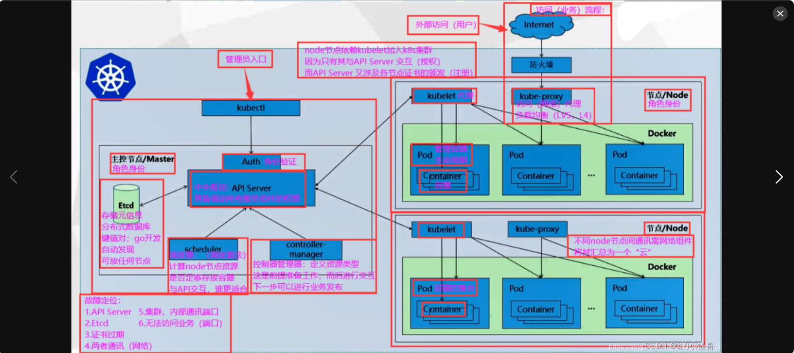
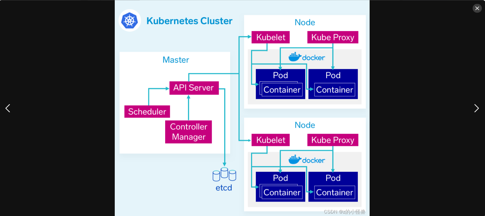
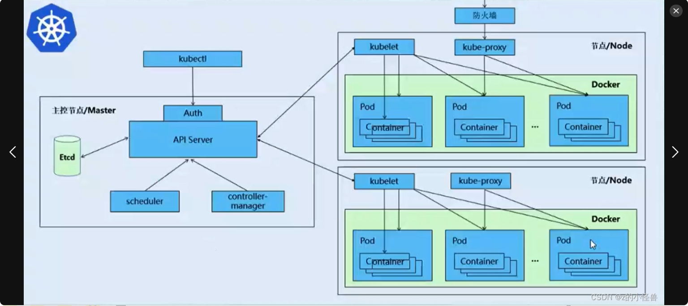
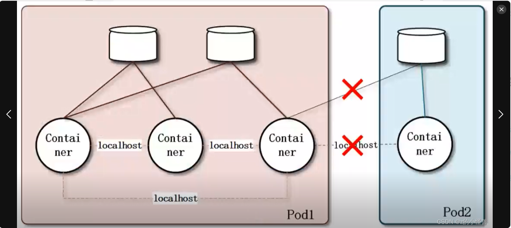
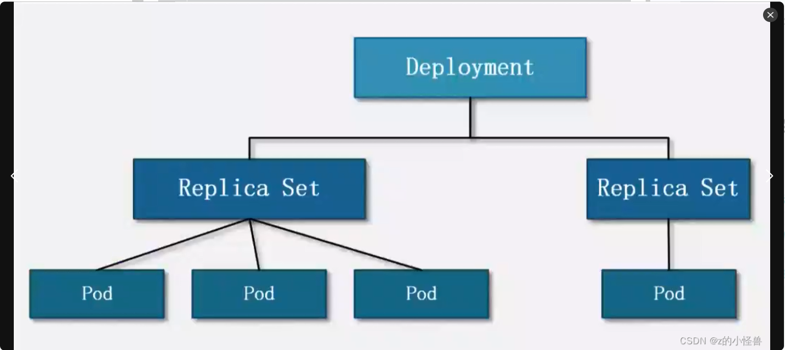
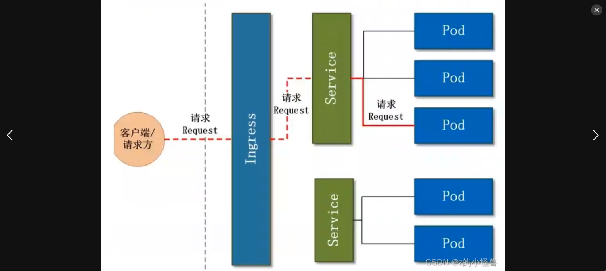
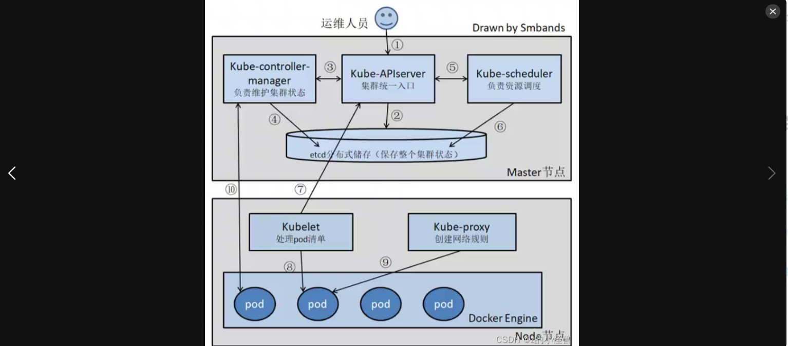

# 问题记录


# 待归档区


# 1-简介

容器编排技术，可以自动化运维管理容器化程序。

k8s是什么

```
   Kubernetes，是一种可自动实施 Linux 容器操作的开源平台。它可以帮助用户省去应用容器化过程的许多手动部署和扩展操作。也就是说，您可以将运行 Linux 容器的多组主机聚集在一起，由 Kubernetes 帮助您轻松高效地管理这些集群。而且，这些集群可跨公共云、私有云或混合云部署主机。因此，对于要求快速扩展的云原生应用而言（例如借助 Apache Kafka 进行的实时数据流处理），Kubernetes 是理想的托管平台。
  Kubernetes 最初由 Google 的工程师开发和设计。Google 是最早研发Linux容器技术的企业之一（组建了 cgroups），曾公开分享介绍 Google 如何将一切都运行于容器之中（这是 Google 云服务背后的技术）。Google 每周会启用超过 20 亿个容器 —— 全都由内部平台 Borg 支撑。Borg 是 Kubernetes 的前身，多年来开发 Borg 的经验教训成了影响 Kubernetes 中许多技术的主要因素。

Kubernetes 目前已成为容器管理应用的业界标准，各大云平台均有对应的服务支持：

1.AWS: Elastic Kubernetes Service（EKS）
2.Azure: Azure Kubernetes Service（AKS）
3.Google：Google Kubernetes Engine（GKE）
4.阿里：Container Service for Kubernetes（ACK）
```

作用：

```
   用于自动部署、扩展和管理 “容器化（containerized）应用程序” 的开源系统。可以理解成 K8S 是负责自动化运维管理多个容器化程序（比如 Docker）的集群，是一个生态极其丰富的容器编排框架工具。
  试想下传统的后端部署办法：把程序包（包括可执行二进制文件、配置文件等）放到服务器上，接着运行启动脚本把程序跑起来，同时启动守护脚本定期检查程序运行状态、必要的话重新拉起程序。设想一下，如果服务的请求量上来，已部署的服务响应不过来怎么办？传统的做法往往是，如果请求量、内存、CPU 超过阈值做了告警，运维人员马上再加几台服务器，部署好服务之后，接入负载均衡来分担已有服务的压力。
  这样问题就出现了：从监控告警到部署服务，中间需要人力介入！那么，能不能案发自动完成服务的部署、更新、卸载和扩容、缩容呢？而这就是 K8S 要做的事情，自动化运维管理容器化程序。
K8S 的目标是让部署容器化应用简单高效
```

解决的问题

```
K8S 解决了裸跑 Docker 的若干痛点：
1、单机使用，无法有效集群
2、随着容器数量的上升，管理成本攀升
3、没有有效的容灾、自愈机制
4、没有预设编排模板，无法实现快速、大规模容器调度
5、没有统一的配置管理中心工具
6、没有容器生命周期的管理工具
7、没有图形化运维管理工具
K8S 提供了容器编排，资源调度，弹性伸缩，部署管理，服务发现等一系列功能。
```

K8s的特性

```
1、弹性伸缩
  使用命令、UI 或者基于 CPU 使用情况自动快速扩容和缩容应用程序实例，保证应用业务高峰并发时的高可用性；业务低峰时回收资源，以最小成本运行服务。
2、自我修复
  在节点故障时重新启动失败的容器，替换和重新部署，保证预期的副本数量；杀死健康检查失败的容器，并且在未准备好之前不会处理客户端请求，确保线上服务不中断。
3、自动发布（默认滚动发布模式）和回滚
  K8S 采用滚动更新策略更新应用，一次更新一个 Pod，而不是同时删除所有 Pod，如果更新过程中出现问题，将回滚更改，确保升级不影响业务。
4、集中化配置管理和密钥管理
  管理机密数据和应用程序配置，而不需要把敏感数据暴露在镜像里，提高敏感数据安全性。并可以将一些常用的配置存储在 K8S 中，方便应用程序使用。
5、存储编排，支持外挂存储并对外挂存储资源进行编排
  挂载外部存储系统，无论是来自本地存储，公有云（如 AWS），还是网络存储（如 NFS、GlusterFS、Ceph）都作为集群资源的一部分使用，极大提高存储使用灵活性。
6、任务批处理运行
  提供一次性任务，定时任务；满足批量数据处理和分析的场景。
```

# 2-Kubernetes 集群架构与组件



K8S 是属于主从设备模型（Master-Slave 架构），即有 Master 节点负责集群的调度、管理和运维，Slave 节点是集群中的运算工作负载节点。
主节点一般被称为 Master 节点，而从节点则被称为 Worker Node 节点，当某个 Node 宕机时，其上的工作负载会被 Master 自动转移到其他节点上去。



## 2.1-Master 组件

### 2.1.1-Kube-apiserver

```
  用于暴露 kubernetes API，任何资源请求或调用操作都是通过 kube-apiserver 提供的接口进行。以 HTTP Restful API 提供接口服务，所有对象资源的增删改查和监听操作都交给 API Server 处理后再提交给 Etcd 存储。
  可以理解成 API Server 是 K8S 的请求入口服务。API Server 负责接收 K8S 所有请求（来自 UI 界面或者 CLI 命令行工具），然后根据用户的具体请求，去通知其他组件干活。可以说 API Server 是 K8S 集群架构的大脑。
```

> <font color='blue'>Etcd是什么？这是一种独立开发的数据库？？？</font>
>
> 用于存储元信息，采用分布式数据库，存储键值对结构，自动发现，可以存放任何节点

### 2.1.2 Kube-controller-manager

```
运行管理控制，是 K8S 集群中处理常规任务的后台线程，是 K8S 集群里所有资源对象的自动化控制中心。
  在 K8S 集群中，一个资源对应一个控制器，而 Controller manager 就是负责管理这些控制器的。由一系列控制器组成，通过 API Server 监控整个集群的状态，并确保集群处于预期的工作状态，比如当某个 Node 意外宕机时，Controller Manager 会及时发现并执行自动化修复流程，确保集群始终处于预期的工作状态。
```


| **控制器**                                                  | **说明**                                                     |
| ----------------------------------------------------------- | ------------------------------------------------------------ |
| Node Controller（节点控制器）                               | 负责在节点出现故障时发现和响应                               |
| Replication Controller（副本控制器）                        | 负责保证集群中一个RC（资源对象Replication Controller）所关联的Pod副本数始终保持预设值。可以理解成确保集群中有且仅有N个Pod实例，N是RC中定义的Pod副本数量 |
| Endpoints Controller（端点控制器）                          | 填充端点对象（即连接Services和Pods），负责监听Service和对应的Pod副本的变化。可以理解端点是一个服务暴露出来的访问点，如果需要访问一个服务暴露出来的访问点，如果需要访问一个服务，则必须知道它的endpoint |
| Service Account & Token Controllers（服务账户和令牌控制器） | 为新的命名空间创建默认账户和API访问令牌                      |
| ResourceQuota Controller（资源配额控制器）                  | 确保指定的资源对象在任何时候都不会超量占用系统物理资源       |
| Namespace Controller（命名空间控制器）                      | 管理namespace的声明周期                                      |
| Service Controller（服务控制器）                            | 属于K8S集群与外部的云平台之间的一个接口控制器                |

> 命名空间这个通用概念一般用于做逻辑隔离。

### 2.1.3-kube-scheduler

```
是负责资源调度的进程，根据调度算法为新创建的 Pod 选择一份合适的 Node 节点。可以理解成 K8S 所有 Node 节点的调度器。当用于要部署服务时，Scheduler 会根据调度算法选择最合适的 Node 节点来部署 Pod。
-预算策略（predicate）
-优选策略（priorities）
API Server 接收到请求创建一批 Pod，API Server 会让 Controller-manager 按照所预设的模板去创建 Pod，Controller-manager 会通过 API Server 去找 Scheduler 为新创建的 Pod 选择最适合的 Node 节点。比如运行这个 Pod 需要 2C4G 的资源，Schedular 会通过预算策略在所有 Node 节点中挑选最优的。Node 节点中还剩多少资源是通过汇报给 API Server 存储在 etcd 里，API Server 会调用一个方法找到 etcd 里所有 Node 节点的剩余资源，再对比 Pod 所需要的资源，在所有 Node 节点中查找哪些 Node 节点符合要求。如果都符合，预算策略就交给优选策略处理，优选策略再通过 CPU 的负载、内存的剩余量等因素选择最合适的 Node 节点，并把 Pod 调度到这个 Node 节点上运行。
```

> <font color='blue'>怎么理解Pod概念</font>

### 2.1.4-配置存储中心

```
etcd
  K8S 的存储服务。etcd 分布式键值存储系统，存储了 K8S 的关键配置和用户配置，K8S 中仅 API Server 才具备读写权限，其他组件必须通过 API Server 的接口才能读写数据。
```

## 2.2-Node组件

### 2.2.1-Kubelet

```
	Node 节点的监视器，以及与 Master 节点的通讯器。Kubelet 是 Master 节点安插在 Node 节点上的 “眼线”，它会定时向 API Server 汇报自己 Node 节点上运行的服务的状态，并接受来自 Master 节点的指示采取调整措施。
  从 Master 节点获取自己节点上 Pod 的期望状态（比如运行什么容器、运行的副本数量、网络或者存储如何配置等），直接跟容器引擎交互实现容器的生命周期管理，如果自己节点上 Pod 的状态与期望状态不一致，则调用对应的容器平台接口（即 docker 的接口）达到这个状态。管理镜像和容器的清理工作，保证节点上镜像不会占满磁盘空间，退出的容器不会占用太多资源。
```

### 2.2.2-Kube-Proxy

```
在每个 Node 节点上实现 Pod 网络代理，是 Kuberbetes Service 资源的载体，负责维护网络规划和四层负载均衡工作。负责写入规则至 iptables、ipvs 实现服务映射访问的。
Kube-Proxy 本身不是直接给 Pod 提供网络，Pod 的网络是由 Kubelet 提供的，Kube-Proxy 实际上维护的是虚拟的 Pod 集群网络。
Kube-apiserver 通过监控 Kube-Proxy 进行对 Kubernets Service 的更新和端点的维护。
Kube-Proxy 是 K8S 集群内部的负载均衡器。它是一个分布式代理服务器，在 K8S 的每个节点上都会运行一个 Kube-proxy。
6.2.3 docker 或 rocket
容器引擎，运行容器，负责本机的容器创建和管理工作。
```

## 2.3-Kubernetes 核心概念



 Kubernetes 包含多种类型的资源对象：Pod、Lable、Service、Replication Controller 等。所有的资源对象都可以通过 Kubernetes 提供的 Kubectl 工具进行增删改查等操作，并将其保存在 etcd 中持久化存储。Kubernetes 其实是一个高度自动化的资源控制系统，通过跟踪对比 etcd 存储里的资源期望状态与当前环境中的实际资源状态的差异，来实现自动控制和自动纠错等高级功能。

### 2.3.1-Pod



```
1、Pod 是 Kuberntes 创建或部署的最小/最简单的基本单位，一个 Pod 代表集群上正在运行的一个进程。可以把 Pod 理解成豌豆荚，而同一 Pod 内的每个容器是一个个豌豆。
2、一个 Pod 由一个或多个容器组成，Pod 中容器共享网络、存储和计算资源，在同一台 Docker 主机上运行。
3、一个 Pod 里可以运行多个容器，又叫边车（SideCara）模式。而在生产环境中一般都是单个容器或者具有强关联互补的多个容器组成一个 Pod。
4、同一个 Pod 之间的容器可以通过 localhost 互相访问，并且可以挂载 Pod 内的所有的数据卷；但是不同的 Pod 之间的容器不能用 localhost 访问，也不能挂载其他 Pod 的数据卷。
```

### 2.3.2-Pod 控制器

> Pod 控制器是 Pod 启动的一种模板，用来保证在 K8S 里启动的 Pod 应始终按照用户的预期运行（副本数、生命周期、健康状态检查等）。K8S 内提供了众多的 Pod 控制器，常用的有以下几种：



```
1、Deployment：无状态应用部署。Deployment 的作用就是管理和控制 Pod 和 ReplicaSet，管控它们运行在用户期望的状态中。
2、Replicaset：确保预期的 Pod 副本数量。ReplicaSet 的作用就是管理和控制 Pod，管控他们好好干活。但是 ReplicaSet 受控于 Deployment。可以理解成 Deployment 就是总包工头，主要负责监督底下的工人 Pod 干活，确保每时每刻有用户要求数量的 Pod 在工作。如果一旦发现某个工人 Pod 不行了，就赶紧新拉一个 Pod 过来替换它。而 ReplicaSet 就是总包工头手下的小包工头。从 K8S 使用者角度来看，用户会直接操作 Deployment 部署服务，而当 Deployment 被部署的时候，K8S 会自动生成要求的 ReplicaSet 和 Pod。用户只需要关心 Deployment 而不操心 ReplicaSet。资源对象 Replication Controller 是 ReplicaSet 的前身，官方推荐用 Deployment 取代 Replication Controller 来部署服务。
3、Daemonset：确保所有节点运行同一类 Pod，保证每个节点上都有一个此类 Pod 运行，通常用于实现系统级后台任务。
4、Statefulset：有状态应用部署。
5、Job：一次性任务。根据用户的设置，Job 管理的 Pod 把任务成功完成就自动退出了。
6、Cronjob：周期性计划性任务。
7、Ingress：管理 L7 层的网络模式（http/https 流量）
8、ingress 包含：nginx、Haproxy、traffic、 istio、kong
```

### 2.3.3-Label

```
1、标签，是 K8S 特色的管理方式，便于分类管理资源对象。Label 可以附加到各种资源对象上，例如 Node、Pod、Service、RC 等，用于关联对象、查询和筛选。
2、一个 Label 是一个 key-value 的键值对，其中 key 与 value 由用户自己制定。
3、一个资源对象可以定义任意数量的 Label，同一个 Label 也可以被添加到任意数量的资源对象中，也可以在对象创建后动态添加或者删除。
4、可以通过给指定的资源对象捆绑一个或多个不同的 Label，来实现多维度的资源分组管理功能。
5、与 Label 类似的，还有 Annotation（注释）。区别在于有效的标签值必须为 63 个字符或更少，并且必须为空或以字母数字字符（[a-z0-9A-Z]）开头和结尾，中间可以包含横杠（-）、下划线（_）、点（.）和字母或数字。注释值则没有字符长度限制。
```

### 2.3.4-Label 选择器（Label selector）

```
1、给某个资源对象定义一个 Label，就相当于给它打了一个标签；随后可以通过标签选择器（Label selector）查询和筛选拥有某些 Label 的资源对象。
2、标签选择器目前有两种：基于等值关系（等于、不等于）和基于集合关系（属于、不属于、存在）。
```

### 2.3.5-Service

```
1、在 K8S 的集群里，虽然每个 Pod 会被分配一个单独的 IP 地址，但由于 Pod 是有生命周期的（它们可以被创建，而且销毁之后不会再启动），随时可能会因为业务的变更，导致这个 IP 地址也会随着 Pod 的销毁而消失。Service 就是用来解决这个问题的核心概念。
2、K8S 中的 Service 并不是我们常说的 “服务” 的含义，而更像是网关层，可以看做一组提供相同服务的 Pod 的对外访问的接口、流量均衡器。
3、Service 作用于哪些 Pod 是通过标签选择器来定义的。
4、在 K8S 集群中，Service 可以看做一组提供相同服务的 Pod 的对外访问接口。客户端需要访问的服务就是 Service 对象。每个 Service 都有一个固定的虚拟 IP（这个 IP 也被称为 Cluster IP），自动并且动态地绑定后端的 Pod，所有的网络请求直接访问 Service 的虚拟 IP，Service 会自动向后端做转发。
5、Service 除了提供稳定的对外访问方式之外，还能起到负载均衡（Load Balance）的功能，自动把请求流量分不到后端所有的服务上，Service 可以做到对客户透明地进行水平扩展（scale）。而实现 service 这一功能的关键，就是 kube-proxy。kube-proxy 运行在每个节点上，监听 API Server 中服务对象的变化，可通过以下三种流量调度模式：userspace（废弃）、iptables（濒临废弃）、ipvs（推荐，性能最好）来实现网络的转发。
6、Service 是 K8S 服务的核心，屏蔽了服务细节，统一对外暴露服务接口，真正做到了 “微服务”。比如我们的一个服务 A，部署了 3 个副本，也就是 3 个 Pod；对于用户来说，只需要关注一个 Service 的入口就可以，而不需要操心究竟也应该请求哪一个 Pod。优势非常明显：一方面外部用户不需要感知因为 Pod 上服务的意外崩溃、K8S 重新拉起 Pod 而造成的 IP 变更，外部用户也不需要感知因升级、变更服务带来的 Pod 替换而造成的 IP 变化。
```

### 2.3.6-Ingress



```
1、Service 主要负责 K8S 集群内部的网络拓扑，那么集群外部怎么访问集群内部呢？这个时候就需要 Ingress 了。Ingress 是整个 K8S 集群的接入层，负责集群内外通讯。
2、Ingress 是 K8S 集群里工作在 OSI 网络参考模型下，第 7 层的应用，对外暴露的接口，典型的访问方式是 http/https。/3、Service 只能进行第四层的流量调度，表现形式是 ip+port。Ingress 则可以调度不同业务域、不同 URL 访问路径的业务流量。
比如：客户端请求 http://www.test.com:port --> Ingress --> Service --> Pod
```

### 2.3.7-Name

```
1、由于 K8S 内部，使用 “资源” 来定义每一种逻辑概念（功能），所以每种 “资源”，都应该有自己的 “名称”。
2、“资源” 有 api 版本（apiversion）、类别（kind）、元数据（metadata）、定义清单（spec）、状态（status）等配置信息。
3、“名称” 通常定义在 “资源” 的 “元数据” 信息里。在同一个 namespace 空间中必须是唯一的。
```

### 2.3.8-Namespace

> Namespace：通用概念，一般用作逻辑隔离使用。

```
1、随着项目增多、人员增加、集群规模的扩大，需要一种能够逻辑上隔离 K8S 内各种 “资源” 的方法，这就是 Namespace。
2、Namespace 是为了把一个 K8S 集群划分为若干个资源不可共享的虚拟集群组而诞生的。
3、不同 Namespace 内的 “资源” 名称可以相同，相同 Namespace 内的各种 “资源”，“名称” 不能相同。
4、合理的使用 K8S 的 Namespace，可以使得集群管理员能够更好的对交付到 K8S 里的服务进行分类管理和浏览。
5、K8S 里默认存在的 Namespace 有：default、kube-system、kube-public 等。
6、查询 K8S 里特定 “资源” 要带上相应的 Namespace。
```

# 3-kubernetes 的工作流程



```
1、k8s 有两种模块，master 模块和 worker-node 模块。
2、master 节点包括 apiserver、scheduler、controller-manager 以及 ETCD（可独立部署）；node 节点包括 kubelet、kube-proxy、容器引擎（docker/rocket 等）。
3、用户通过客户端发送请求给集群的唯一入口 API Server。
4、API Server 先将用户的请求信息写入到 etcd 存储中。再去找 Controller manager 创建对应的 pod。
5Controller Manager 通过 API Server 去读取 etcd 里的用户请求信息，根据请求去创建预设的模板（如什么镜像，多少实例，健康检查等），将模板写入到 etcd 中，再根据模板创建 pod。
6、Controller Manager 通过 API Server 去找到 Scheduler 调度 pod，为新创建的 Pod 选择 node 节点。
7、Scheduler 通过 API Server 在 etcd 存储中读取 node 节点的资源信息（信息由 kubelet 发送到 master 的），通过预算策略和优选策略，从 node 节点中挑选最优的，并把 pod 调度到这个节点运行。
-预算策略：将所有 node 节点的剩余资源和 pod 所需的资源对比，找出符合 pod 资源需求的 node 节点。
-优选策略：预算策略筛选后的 node 节点被交给优选策略。通过 cpu 负载，内存剩余等因素，找出最合适的 node 节点。把 pod 调度到这个节点运行。
8、Scheduler 确定了调度的节点后，通过 API Server 去找到对应 node 节点上的 kublet，由 kublet 调动容器引擎创建 pod。
9、kublet 不仅和容器引擎交互，实现容器的生命周期管理。还监控 node 节点上的资源信息，pod 状态等，将这些汇报给 API Server 存储到 etcd 中。
10、kube-proxy 创建网络规则，制定转发规则。创建 service 作为负载均衡的访问入口（cluster-ip、nodeport 等)，把用户的请求通过负载均衡转发到关联的 pod 上，从而发布 pod 里的业务。
```

# 4-快速入门

结合这个链接进行重构知识体系。http://www.rply.cn/news/40767.html

