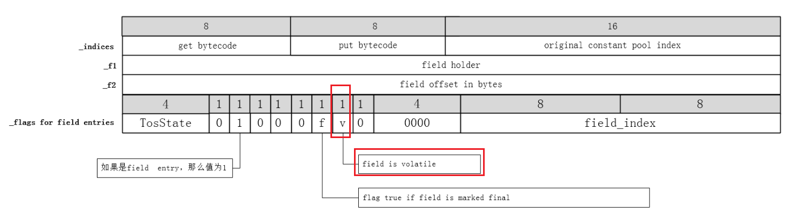
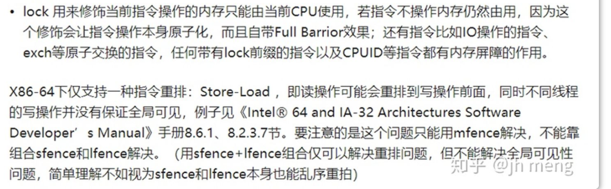

# 问题记录


# 待归档区


# 1-Java内存模型与线程

# 1.1-概述

Amdahl（阿姆达尔）定律通过系统中并行化与串行化的比重来描述多处理器系统能够获取的运算加速能力。

JCP（Java Community Process）是一套指定Java技术规范的机制，通过指定和审定审查JSR（Java Specification Requests）推动Java技术规范的发展。Java EE中的每个API，实际上都是由某个JSR规范所定义的，并且通过了JCP组织的审核，所有JSR都有JCP审核的过程。

`JSR 133: JavaTM Memory Model and Thread Specification Revision`Java内存模型和线程规范修订定义了内存模型和线程模型。[Java Community Process（SM） Program - JSR： Java Specification Requests - detail JSR# 133 (jcp.org)](https://jcp.org/en/jsr/detail?id=133)

TPS：每秒事务处理数，是衡量一个服务性能好坏的重要指标之一。它代表一秒内服务端平均能响应的请求总数，而TPS值与程序的并发能力有着密切的关系

> 系统吞吐量几个重要参数：QPS（TPS）、并发数、响应时间
>
> **QPS（TPS）：**每秒钟request/事务 数量
>
> **并发数：** 系统同时处理的request/事务数
>
> **响应时间：** 一般取平均响应时间
>
> 理解了上面三个要素的意义之后，就能推算出它们之间的关系：
>
> QPS（TPS）= 并发数/平均响应时间
>
> 一个系统吞吐量通常由QPS（TPS）、并发数两个因素决定，每套系统这两个值都有一个相对极限值，在应用场景访问压力下，只要某一项达到系统最高值，系统的吞吐量就上不去了，如果压力继续增大，系统的吞吐量反而会下降，原因是系统超负荷工作，上下文切换、内存等等其它消耗导致系统性能下降。

<font color='red'>各种中间件服务器、各类框架都在封装，力求实现屏蔽实现细节，但是使用过程又需要了解细节，开盒每一套工具的实现过程，增加学习成本，不同的工具重复度很高。过多的工具消耗IT从业的学习精力，也没有达到完</font>全屏蔽实现细节的目的。希望有一个系统的解决方案

## 1.2-硬件和OS的差异与一致性

由于计算机存储设备与处理器的运算速度有几个数量级的查询，所以采用了缓存技术，L1缓存仅需4个时钟周期（1.2-2.1ns），内存访问需要（60ns）相差约50倍。

Java内存模型限制下，在不同的操作系统的编译器编译出来的JVM代码执行顺序不同，底层系统调用不同，以及在不同的执行方式以及JIT编译下，底层执行的代码有进一步的差异。但是都在JMM的限制范围之内。所以不同硬件架构和不同OS之上，处理器的乱序执行（Out-Of-Order Execution）优化，以及即时编译器的指令重排序（Instruction Reorder）优化都是不同的。

****

Java虚拟机规范定义了Java内存模型（Java Memory Model）来屏蔽掉各种硬件和操作系统的内存访问差异，JSR-133（JDK-1.5）后内存模型已经成熟和完善。

内存模型的定义需要足够的严谨。保证并发的内存访问操作不会产生歧义，但是定义又需要足够的宽松，使虚拟机有足够的自由空间去利用不同硬件的各种特性（寄存器，高速缓存`如PowerPC架构Power9的L4缓存`，指令集中的特有指令`如不同架构采用不同的内存屏障指令实现，power6的高速缓存13态一致性协议`）来获取更好的执行速度。

## 1.3-Java内存模型（JMM）

### 1.3.1-指令重排序

为了提升执行速度/性能，计算机在执行程序代码的时候，会对指令进行重排序。

重排序并没有严格的定义。整体上可以分为两种：

- 真·重排序：**编译器、底层硬件（CPU等）出于“优化”的目的** ，按照某种规则将指令重新排序（尽管有时候看起来像乱序）。
- 伪·重排序：由于**缓存同步顺序** 等问题，看起来指令被重排序了。MSEI协议之后，为了异步化指令的执行，引入Store Buffer和Invalidate Queue，却导致了「指令顺序改变」的副作用。

### 1.3.2-JMM内存模型

Java内存模型的主要目标是定义程序中各个变量的访问规则，即在虚拟机中将变量分配合适的内存空间，如实例的字段，静态字段，构成数组对象的元素，但不包括局部变量与方法参数`因为局部变量和方法参数是线程。私有的`。

Java内存模型固定了所有变量都存储在主内存中，每条线程都有自己的工作内存（Cache）中，线程的工作内存中保存了该线程的使用到的变量的主内存副本拷贝。线程对变量的所有操作（读取，赋值）都必须在工作内存中进行。不能直接读写主内存的变量。

> 模型层面：主内存对应于Java堆中对象实例的数据部分（堆+方法区/元空间），而工作内存则对应于虚拟栈的中的部分区域。
>
> 物理层面：主内存对应硬件上的主存，工作内存可能会优先存储在寄存器和高速缓存中。`组相联映射`

### 1.3.3-JMM的内存操作

Java内存模型定义八种操作，unlock，lock，read，load，use，assign，store，write，虚拟机必须保证8种操作必须是原子的，不可再分的。

**Lock：**作用于主内存的变量，它把一个变量标识为线程独占状态

> 如果对一个变量执行lock操作，那将会清空共存内存中，

**Unlock：**作用于主内存的变量，将一个处于锁定状态下的变量释放出来，释放后的变量才可以被其他线程加锁。

**Read：**作用于主内存的变量，将一个变量的值从主内存传输到线程的工作内存。

**Load：**作用于工作内存的变量，将read操作得到的变量的值放入工作内存中的变量副本中

**Use：**作用于工作内存的变量，将工作内存中变量的值传递给执行引擎，当虚拟机需要使用时会执行这个操作。

**Assign**：作用于工作内存的变量，将一个执行引擎接收到的值赋给工作内存中的变量，当虚拟机遇到给变量赋值的字节码时会执行此操作。

**Store：**将工作内存中的一个变量值传送到主内存中

**Write：**作用于主内存的变量，它把store操作从工作内存中得到的变量的值放入主内存的变量中。

### 1.3.4-JMM的内存屏障

**内存屏障的实现涉及硬件技术+操作系统+JVM的三个层面的知识**

> GC机制中的write barrier（写屏障）和JMM中的memory barrier（内存屏障）不是一个概念，也毫无关系。

JMM的内存屏障：4种内存屏障（编译器内存屏障）

> （JMM）内存屏障是硬件之上，OS之下或JVM之下，对并发做出的最后一层的支持。

| 屏障类型            | 指令示例                 | 说明                                                         |
| ------------------- | ------------------------ | ------------------------------------------------------------ |
| LoadLoad Barriers   | Load1;LoadLoad;Load2     | 该屏障确保Load1数据的装载先于Load2及其后所有装载指令的的操作 |
| StoreStore Barriers | Store1;StoreStore;Store2 | 该屏障确保Store1立刻刷新数据到内存(使其对其他处理器可见)的操作先于Store2及其后所有存储指令的操作 |
| LoadStore Barriers  | Load1;LoadStore;Store2   | 确保Load1的数据装载先于Store2及其后所有的存储指令刷新数据到内存的操作 |
| StoreLoad Barriers  | Store1;StoreLoad;Load2   | 该屏障确保Store1立刻刷新数据到内存的操作先于Load2及其后所有装载指令的操作。它会使该屏障之前的所有内存访问指令(存储指令和访问指令)完成之后,才执行该屏障之后的内存访问指令 |

### 1.3.5-hotspot在x86平台的内存屏障（StoreLoad）的实现

参考：https://blog.csdn.net/reliveIT/article/details/121945327

**hotspot x86平台上的内存屏障的实现依赖于lock指令，Intel x86的lock指令的实现依赖于缓存一致性协议（例如MESI）**

**hotspot x86平台上的内存屏障storeload的实现是fence()函数，fence()函数的函数体是AT&T的内联汇编，内联汇编的指令是x86架构CPU提供lock指令前缀。lock前缀指令在x86平台上是具备内存屏障的能力的。**

#### （1）hotspot处理volatile源码

hotspot字节码解释器在处理`putfield/putstatic`的时候，如果要处理的结果是`volatile`修饰的，则在处理完成后还需要调用内存屏障指令`OrderAccess::storeload();`

以32bit机器为例，如果ConstantPoolCacheEntry表示的是字段，那么ConstantPoolCacheEntry的字段信息如下，这里用来判断putfiled/putstatic操作的字段属性是否有volatiole修饰

> ConstantPoolCacheEntry相关https://www.cnblogs.com/mazhimazhi/p/13474577.html



```c
CASE(_putfield):
CASE(_putstatic):
{
  u2 index = Bytes::get_native_u2(pc+1);
  ConstantPoolCacheEntry* cache = cp->entry_at(index);
  if (!cache->is_resolved((Bytecodes::Code)opcode)) {
    CALL_VM(InterpreterRuntime::resolve_from_cache(THREAD, (Bytecodes::Code)opcode),
            handle_exception);
    cache = cp->entry_at(index);
  }
  // 省略一些代码
  //
  // Now store the result，现在去存储结果
  //
  int field_offset = cache->f2_as_index();
  if (cache->is_volatile()) {
    switch (tos_type) {
    // 省略很多代码
    }
    OrderAccess::storeload(); //重点之处
  }
// 省略很多代码
```

> 源码地址：https://github.com/openjdk/jdk/blob/master/src/hotspot/share/interpreter/zero/bytecodeInterpreter.cpp

#### （2）OrderAccess::storeload()的实现

> .hpp：C/C++编写的头文件，通常用来定义数据结构，声明变量，函数，结构，类、

- OrderAccess的.hpp文件

```c++
// We define a "fence" operation, as a bidirectional barrier.
// It guarantees that any memory access preceding the fence is not
// reordered w.r.t. any memory accesses subsequent to the fence in program
// order. This may be used to prevent sequences of loads from floating up
// above sequences of stores.
// 我们将“fence”操作定义为双向屏障。它保证fence之后的任何内存访问不会被重排到fence之前。[翻译存疑]
// The following table shows the implementations on some architectures:
// 下表显示了一些体系结构上的实现：
//                       Constraint     x86          sparc TSO          ppc
// ---------------------------------------------------------------------------
// fence                 LoadStore  |   lock         membar #StoreLoad  sync
//                       StoreStore |   addl 0,(sp)
//                       LoadLoad   |
//                       StoreLoad
```

- OrderAccess的fence函数实现（linux_x86实现）

```c++
inline void OrderAccess::loadload()   { compiler_barrier(); }
inline void OrderAccess::storestore() { compiler_barrier(); }
inline void OrderAccess::loadstore()  { compiler_barrier(); }
inline void OrderAccess::acquire()    { compiler_barrier(); }
inline void OrderAccess::release()    { compiler_barrier(); }
//storeload内存屏障的实现是fence()函数，
inline void OrderAccess::storeload()  { fence();            }

// A compiler barrier, forcing the C++ compiler to invalidate all memory assumptions
static inline void compiler_barrier() {
  __asm__ volatile ("" : : : "memory");
}
//fence函数的的函数体式AT&T内联汇编，内联汇编的指令是lock前缀指令
inline void OrderAccess::fence() {
#ifdef AMD64
  __asm__ volatile ("lock; addl $0,0(%%rsp)" : : : "cc", "memory");
#else
  __asm__ volatile ("lock; addl $0,0(%%esp)" : : : "cc", "memory");
#endif
  compiler_barrier();
}
inline void OrderAccess::cross_modify_fence_impl() {
  if (VM_Version::supports_serialize()) {
    __asm__ volatile (".byte 0x0f, 0x01, 0xe8\n\t" : : :); //serialize
  } else {
    int idx = 0;
#ifdef AMD64
    __asm__ volatile ("cpuid " : "+a" (idx) : : "ebx", "ecx", "edx", "memory");
#else
    // On some x86 systems EBX is a reserved register that cannot be
    // clobbered, so we must protect it around the CPUID.
    __asm__ volatile ("xchg %%esi, %%ebx; cpuid; xchg %%esi, %%ebx " : "+a" (idx) : : "esi", "ecx", "edx", "memory");
#endif
  }
}
#endif // OS_CPU_LINUX_X86_ORDERACCESS_LINUX_X86_HPP
```

> 源码地址：https://github.com/openjdk/jdk/blob/master/src/hotspot/os_cpu/linux_x86/orderAccess_linux_x86.hpp

storeload内存屏障的实现是fence()函数，fence()函数的函数体是AT&T的内联汇编，内联汇编的指令是**lock前缀**指令。

其他内存屏障的实现依赖于C++的编译器屏障，也是一个AT&T的内联汇编，不过这句内联汇编的指令的含义是A compiler barrier, forcing the C++ compiler to invalidate all memory assumptions。

hotspot在X86平台上，是允许storeload重排序的。<font color='blue'>为什么这个允许重排序？</font>

https://www.cnblogs.com/sunddenly/articles/15389917.html




#### （3）x86lock前缀指令说明

lock前缀指令的作用：**turns the instruction into an atomic instruction**

Intel CPU手册中讲解lock前缀指令时明确说了，lock前缀指令会将它修饰的指令变为原子指令，且具备内存屏障功能。

> 在P6处理器以前（即奔腾pro）是锁总线，保持对总线的控制，直到整个指令执行完毕。
>
> 在P6及P6处理器以后，数据缓存在CPU cache中，Lock后的写操作会让其他Core高速缓存中cache line失效，从而从内存加载最新的数据，这是通过缓存一致性协议MESI来锁缓存。【Store buffer与Invalidate Queues】

 Lock前缀能完成类似硬件内存屏障的功能。Lock会对CPU总线或高速缓存加锁，可以理解为CPU指令级的一种锁。

#### （4）硬件层面其它内存屏障

硬件层提供了一系列的内存屏障 memory barrier / memory fence(Intel的提法)来提供一致性的能力。拿X86平台来说，有几种主要的内存屏障

1. lfence，是一种Load Barrier 读屏障。在读指令前插入读屏障，可以让高速缓存中的数据失效，重新从主内存加载数据

2. sfence, 是一种Store Barrier 写屏障。在写指令之后插入写屏障，能让写入缓存的最新数据写回到主内存

3. mfence, 是一种全能型的屏障，具备ifence和sfence的能力

4. Lock前缀，Lock不是一种内存屏障，但是它能完成类似内存屏障的功能。Lock会对CPU总线和高速缓存加锁，可以理解为CPU指令级的一种锁。它后面可以跟ADD, ADC, AND, BTC, BTR, BTS, CMPXCHG, CMPXCH8B, DEC, INC, NEG, NOT, OR, SBB, SUB, XOR, XADD, and XCHG等指令。

## 1.4-volatile实现与特性

> 可见性可以认为是弱的一致性，只保证用户见到的数据是一致的（弱一致），但不保证任意时刻，存储的数据都是一致的（强一致），

volatile变量规则只是一种标准，要求JVM实现保证volatile变量的偏序语义。**结合程序顺序规则、传递性** ，该偏序语义通常表现为两个作用：

- 保持线程之间的可见性
- 禁用重排序（读操作禁止重排序之后的操作，写操作禁止重排序之前的操作）

## 1.5-Java的线程模型


# 2-线程安全与锁优化

