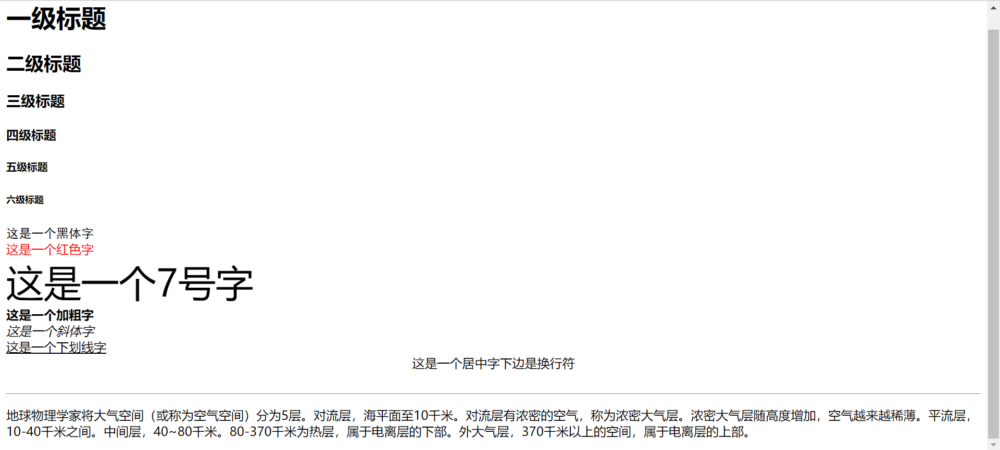
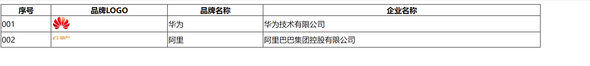
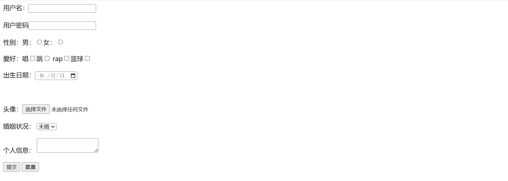
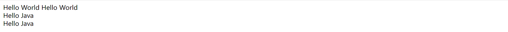
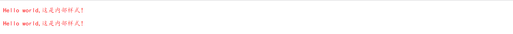
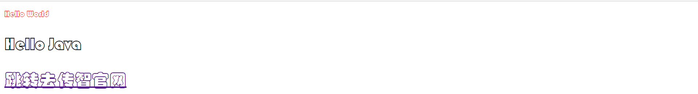
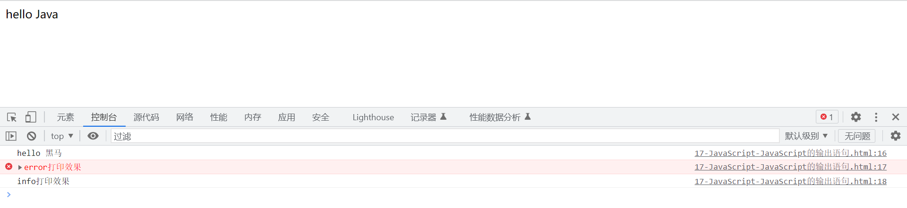
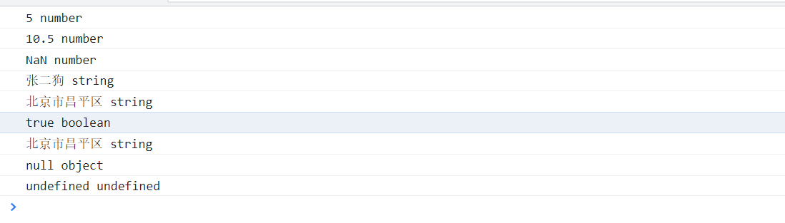
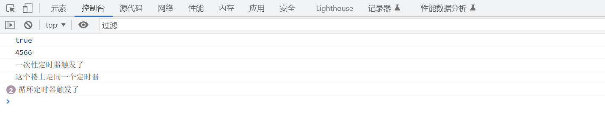

# 问题记录

1. 微信小程序的开发语言：

   wxml、wsxx、Javascript

2. HTML常用标签汇总

   w3school网站www.w3schoolcom.cn

3. <font color='blue'>前端服务器（Nginx？）、前端程序具体是个什么东西？前端代码是否就是HTML+CSS+JS？具体包含了哪些东西？</font>

4. <font color='blue'>浏览器解析的工作流程与底层原理？渲染引擎，HTML解析，Dom树，不同浏览器的解析原理是否一样？</font>

5. <font color='blue'>前端项目开发时的文件结构，比如图片，视频，CSS文件,配置文件，JS脚本、配置文件都应该放在文件中哪些位置，哪些目录下？</font>

6. 引用资源采用什么路径方式？

   使用相对路径是个好习惯，使用了相对路径，网页就不会和当前的基准URL绑定，所有链接在本机（localhost）或者未来的公共域中均可以正常工作。

7. <font color='red'>推荐书：offer来了2，写给JAVA工程师的干货笔记，java编程的逻辑</font>

# 1.Web开发介绍

## 1.1什么是Web开发

- Web：全球广域网，也成为万维网（www:World Wide Web），能够通过浏览器访问的网站。
- Web开发就是开发网站的，如京东淘宝等等。
- 那么我们要学习哪些知识呢？这些知识在整个网站开发过程中占据什么位置？对于这些疑问，必须学习网站的整体的工作流程。

## 1.2网站的工作流程

依据网站的工作流程，构建知识架构体系

1.首先通过**浏览器**访问发布到**前端服务器**中的**前端程序**，这时候**前端程序**会将**前端代码**返回给浏览器。如下图所示


2.浏览器得到前端代码，此时浏览器会对前端代码解析，然后展示在浏览器的窗口中，这就是我们看到的**网站**的**页面**，如下图所示：


3.此时页面没有具体的数据，数据存放在数据库中，浏览器根据**前端代码中指定的后台服务器的地址**向**后台服务器**（java程序）发起**请求**，后台服务器再去**数据库**（or数据库服务器？）中获取数据，然后返回给浏览器。工作流程如下图所示：


4.浏览器拿到后台返回的数据后，然后将数据展示在前端资源也就是网页上，然后我们就能看到如下图所示的完整内容了。


整体流程梳理：

1.浏览器先向前端服务器请求前端资源（前端代码）。

2.浏览器解析前端代码，呈现网页。

3.根据前端代码中的网址向后端服务器发起请求，获取数据。

4.浏览器将后端的数据展示到网页上。形成完整的网页。


## 1.3网站的开发模式

网站的开发模式主要分为两种：前后端分离和混合开发

**前后端分离**：（目前的主流技术）特点如下：

- 前端人员开发前端程序，前端程序单独部署在前端服务器上；
- 后端人员开发后端程序，后端程序单独部署在后端服务器上。

<font color='blue'>大型网站的服务器架构设计，分为多少层，比如CDN-前端服务器-后端服务器-数据库服务器。成熟的架构设计模式有哪些？</font>


混合开发（早期技术）特点是前端人员开发的代码和后端人员开发的代码在同一个项目中，一起打包发布。


<font color='blue'>小型网站通过前后端端口号不一致前后端服务器分别部署，是否也算是实现了前后端分离技术</font>

## 1.4网站的开发技术

学习目标：让页面看起来像个页面


前端web开发：

| 技术       | 描述                                                   |
| ---------- | ------------------------------------------------------ |
| HTML       | 用于构建网站的基础结构（重点一点）                     |
| CSS        | 用于美化页面的，和化妆作用类似（知道干什么的就行）     |
| JavaScript | 用于实现网页和用户的交互（重点一点）                   |
| Vue        | 主要用于将数据填充到Html页面上的（国人                 |
| Element    | 主要提供通了非常美观的插件（饿了么公司出的组件库）     |
| Nginx      | 一款Web服务器软件，可以用于部署前端工程，静态Web服务器 |
| Axios      | <font color='blue'>发送库？</font>                     |
| Ajax       | ？                                                     |
| Yapi       | ？                                                     |

后端Web开发

| 技术       | 描述                                     |
| ---------- | ---------------------------------------- |
| Maven      | 一款java中用于管理项目的软件             |
| Mysql      | 常用的数据库软件之一                     |
| SpringBoot | Spring家族的产品，目前主流的项目开发技术 |
| Mybatis    | 用于操作数据库的框架                     |


## 1.5前端的开发介绍

前端开发，主要开发的是网页，需要使用的技术

万维网联盟（World Wide Web Consortium），创建于1994年10月，主要是对Web进行标准化。

该组织定义了网页开发需要如下3门技术：

- HTML：定义网页的结构
- CSS：定义网页的表现，样式
- JavaScript：网页的交互，定义网页的行为

随着技术的发展，为了更快速的开发，对前端做了封装，衍生了很多前端框架。如：Vue，ElementUI等等。

课程安排如图所示：

## 1.6浏览器F12视图的使用方法

# 2.HTML

## 2.1HTML介绍快速入门

### 2.1.1HTML介绍

HTML（HyperText Markup Language）:超文本**标记语言**，比普通文本功能更强大，除了文字信息，还可以定义图片、音频、视频等内容。

标记语言：由标签构成的语言，HTML中的标签都是预先定好的。之前学习的XML也是标记语言，由一个个标签构成，HTML代码直接在浏览器中运行，HTML标签由浏览器解析。

标签类型

\<a>\</a>主动闭合标签

\<a/>自闭合标签

### 2.1.2快速入门

\<html>是根标签，\<head>和\<body>是子标签，\<head>中的子标签\<title>是用来定义网页的标题的，里面定义的内容会显示在浏览器网页标题位置，\<body>中定义的内容会呈现在浏览器的内容区域

### 2.1.3HTML开发工具

VS Code：前端开发工具，占有率30%，WebStrom占有率更高，JetBrains旗下工具。

## 2.2基础标签

HTML的预定义标签很多，学习基本的常见的HTML标签

标签就是\<>以及标签名组成的，标签中可以编写内容，嵌套其他的标签，也可以声明属性，

功能分类

- 文本标签
- ★图片/音频/视频标签
- ★超链接标签
- ★表格标签
- 定位标签（布局标签）
- ★表单标签
- ★表单项标签

块级标签

1. 总是在新行上开始，占据一整行（标签独占一整行）
2. 高度、行高、外边距、内边距都可控制
3. 宽度始终与浏览器的宽度一样，与内容无关
4. 可以容纳内联元素和其他块元素

行级标签

1. 和其他元素都在同一行上（一行可以有多个标签）
2. 行高、外边距、内边距部分可以改变
3. 宽度和高度只与内容有关
4. 行内元素只能容纳问题或者其他行内元素

### 2.2.1文本标签

文本标签：顾名思义都是用来修饰文本的，包括标题、段落、加粗等等，标签学习以及代表含义如下

| 标签        | 全称                  | 块/行 | 描述                               |
| ----------- | --------------------- | ----- | ---------------------------------- |
| \<h1>~\<h6> | headline              | 块级  | 定义标题，h1最大，h6最小           |
| \<font>     |                       | 行内  | 定义文本的字体、字体大小、字体颜色 |
| \<b>        | blod                  | 行内  | 定义粗体文本                       |
| \<i>        | italic                | 行内  | 定义斜体问题                       |
| \<u>        | underline             | 行内  | 定义文本下划线                     |
| \<center>   |                       | 行内  | 定义文本居中                       |
| \<p>        | paragraph             | 块级  | 定义段落                           |
| \<br>       | break                 |       | 定义换行                           |
| \<hr>       | horizontal break line | 块级  | 定义水平线                         |

| 标签    | 属性  | 描述                                      |
| ------- | ----- | ----------------------------------------- |
| \<font> |       | 字体标签，修饰文本的颜色、大小、样式      |
|         | color | 设置文本的颜色                            |
|         | size  | 设置文本的大小，取值1-7，其中1最小，7最大 |
|         | face  | 用来设置字体，如”楷体“、”宋体“等          |

color属性的三种赋值方法

英文单词：red、green、blue

RGB值（值1，值2，值3）:对应红色绿色蓝色----0-255（不推荐）

#值1值2值3：红色绿色蓝色----（00-FF）如color="#00FF00"----绿色

**注意事项：**

示例：

```html
<body>
    <h1>一级标题</h1>
    <h2>二级标题</h2>
    <h3>三级标题</h3>
    <h4>四级标题</h4>
    <h5>五级标题</h5>
    <h6>六级标题</h6>
    <font size="3" face="黑体">这是一个黑体字</font><br/>
    <font size="3" color ="red">这是一个红色字</font><br/>
    <font size="7" >这是一个7号字</font><br/>
    <b>这是一个加粗字</b><br/>
    <i>这是一个斜体字</i><br/>
    <u>这是一个下划线字</u><br/>
    <center>这是一个居中字下边是水平线</center><br/>
    <hr/>
    <p>
        地球物理学家将大气空间（或称为空气空间）分为5层。对流层，海平面至10千米。对流层有浓密的空气，称为浓密大气层。浓密大气层随高度增加，空气越来越稀薄。平流层，10-40千米之间。中间层，40~80千米。80-370千米为热层，属于电离层的下部。外大气层，370千米以上的空间，属于电离层的上部。
    </p>
</body>
```

效果：



### 2.2.2图片/音频/视频标签

功能：在网页上嵌入图片等元素

图片资源/音频资源/视频资源（统称为资源文件）可以放在本地，也可以放在网络上

元素标签概述

| 标签         | 属性     | 描述                                                         |
| :----------- | -------- | ------------------------------------------------------------ |
| \       |          | 在页面上引入图片的                                           |
| （自闭）     | height   | 用来定义图片的高度<font color='blue'>为什么只需指定高度</font> |
|              | width    | 用来定义图片的宽度                                           |
|              | src      | 规定显示图片的url（统一资源定位符）                          |
| \<audio>     |          | 定义音频（支持mp3、<font color='blue'>mav、ogg</font>）      |
| （主动闭合） | src      | 规定音频文件的url                                            |
|              | controls | 显示播放控件                                                 |
| \<video>     |          | 定义视频（支持mp4、<font color='blue'>webM、ogg</font>）     |
| （主动闭合） | src      | 规定视频文件的url                                            |
|              | controls | 显示播放控件                                                 |
|              | heitght  | 定义视频播放器的高度                                         |
|              | width    | 定义播放器的宽度                                             |
|              | muted    | 规定视频输出应该静音                                         |
|              | loop     | 循环播放                                                     |
|              | autoplay | 如果出现该属性，则视频在就绪后马上播放                       |

<font color='blue'>url详解</font>

**注意事项：**

- 需要填写图片音频视频等资源的路径，建议采用相对路径，一旦路径写错，浏览器上将不会展示相应资源。
- 音频视频资源必须加上controls才可以显示播放组件；
- 浏览器规定想要播放声音，用户必须先和页面发生交互。<font color='blue'>B站怎么解决的？重新定义了播放控件？？</font>
- src指向要展示的图片（本地路径/网络路径）
  - ​	本地路径分为本地绝对路径/相对路径
  - ​	本地路径的写法（./）-(当前文件所在的文件夹下)（../）-（当前文件所在的上一级文件夹下）

示例：

```html
<body>
    </body>
    <audio src="./audio/01.mp3" controls muted autoplay loop></audio>
    <video src="./video/01.mp4" controls muted autoplay loop></video>
</body>
```

效果：


### 2.2.3超链接标签

鼠标点击就跳转，就是超链接的效果

可以实现点击图片跳转的效果，行内元素

超链接标签如下

| 标签 | 属性   | 全称                | 描述                                                      |
| ---- | ------ | ------------------- | --------------------------------------------------------- |
| \<a> |        | anchor 锚点或链接   | 定义超链接，用于链接到另一个资源                          |
|      | href   | Hypertext Reference | 指定需要访问的资源的url                                   |
|      | target |                     | \_self：默认值，在当前页面打开<br>\_blank：在空白页面打开 |

**注意事项：**

**示例：**

```html
<body>
    <a href="https://baike.baidu.com/item/" target="_self">
        
        </img>
    </a>
    <br/>
    <a href="https://baike.baidu.com/item/" target="_blank">
        邓肯
    </a>
</body>
```

**效果**


### 2.2.4表格标签

| 标签     | 属性        | 全称        | 功能                                                         |
| -------- | ----------- | ----------- | ------------------------------------------------------------ |
| \<table> |             |             | 定义表格                                                     |
|          | broder      |             | 规定表格边框的粗细                                           |
|          | width       |             | 规定表格的宽度                                               |
|          | cellspacing |             | 规定单元格之间的空白                                         |
|          | cellpading  |             |                                                              |
| \<tr>    |             | tablerow    | 定义表格的行，可以包裹多个\<th>，\<td>                       |
|          | align       |             | 定义表格行的内容定义方式<font color='blue'>（全称，默认值呢？）</font> |
|          |             |             |                                                              |
| \<th>    |             | tableheader | 定义表头单元格，默认加粗居中                                 |
| \<td>    |             | tabledata   | 定义普通单元格，默认左对齐，不加粗                           |

**注意事项：**

在table中的数据没有列的概念，只有行的概念，一行数据使用tr标签来声明

**示例：**

```html
<body>
    <table border="1px" width="90%" cellspacing ="0px" >
        <tr>
            <th>序号</th>
            <th>品牌LOGO</th>
            <th>品牌名称</th>
            <th>企业名称</th>
        </tr>
        <tr>
            <td>001</td>
            <td></td>
            <td>华为</td>
            <td>华为技术有限公司</td>    
        </tr>
        <tr>
            <td>002</td>
            <td></td>
            <td>阿里</td>
            <td>阿里巴巴集团控股有限公司</td>
        </tr>
    </table>
</body>
```

**效果：**



### 2.2.5表单标签

**<font color='red'>如图所示，这里需要用户填写数据传输到后台程序，然后后台程序将数据保存到数据库中，这是前端和后端交互的手段，非常重要，必须掌握。</font>**

在网页中主要负责数据采集功能，如注册、登录等数据采集

表单项标签与表单表单标签是配个工作的，表单项标签必须书写到表单标签\<form>中，\<form>必须指定两个内容才有功能（action和method）

表单标签概述：

| 标签    | 属性   | 描述                                                         |
| ------- | ------ | ------------------------------------------------------------ |
| \<form> |        | 定义表单的                                                   |
|         | action | 定义表单数据提交的服务器地址（#表示提交至本地）              |
|         | method | 定义表单数据提交的，一般有get和post这2种<font color='blue'>（有无其他的？）</font> |

method：规定发送表单数据的方式

- get：
  - 默认值，如果不设置method属性则默认就是该值
  - 请求参数会拼接在URL后边
  - URL的长度有限制4KB
- post：
  - 浏览器会将数据放到http请求消息题中
  - 请求的参数是无限制的

表单项标签概述：

| 标签        | 属性 | 描述                                                         |
| ----------- | ---- | ------------------------------------------------------------ |
| \<input>    |      | 定义表单项，通过type属性控制输入形式，接受用户的信息         |
|             | type | 定义表单项的表现形式，如：文本框、密码框等等                 |
| \<select>   |      | 定义下拉列表框，select用于声明下拉列表的方位，具体的选项value需要通过option子标签定义，必须定义name |
| \<textarea> |      | 定义文本域                                                   |

### 2.2.6表单项标签

表单项标签概述：

| 标签        | 属性 | 描述                                                 |
| ----------- | ---- | ---------------------------------------------------- |
| \<input>    |      | 定义表单项，通过type属性控制输入形式，接受用户的信息 |
|             | type | 定义表单项的表现形式，如：文本框、密码框等等         |
| \<select>   |      | 定义下拉列表框，其\<option>子标签定义选项            |
| \<textarea> |      | 定义大范围的文本数据收集                             |

type取值及表现形式如下：

| type取值 | 描述                                                         | 形式 |
| -------- | ------------------------------------------------------------ | ---- |
| text     | 默认值，定义单行的输入字段                                   |      |
| password | 定义密码字段                                                 |      |
| radio    | 定义单选按钮----必须定义name(分组)保证互斥/value(提交的真正值) |      |
| checkbox | 定义复选框----必须定义name（分组）/value（提交的真正值）     |      |
| color    | 颜色选择框                                                   |      |
| date     | 日期框                                                       |      |
| file     | 定义文件上传按钮（avator小图片）                             |      |
| hidden   | 隐藏域：不会被渲染，但会在表单中真是存在，【保存一些需要被提交但不需要被输入的信息】必须定义name(名称)/value(提交的真正值) |      |
| submit   | 定义提交按钮，提交按钮会把表单数据发送到服务器端             |      |
| reset    | 定义重置按钮，重置按钮会清楚表单中的所有数据                 |      |
| button   | 定义可点击按钮                                               |      |

**注意事项**：

- 被动收集的都需要value值
- option可以用标签中的值提交，也可以用value指定。

- &nbsp英文空格&emsp中文空格？？<font color='blue'>不能用？？</font>

**代码：**

```html
<body>
    <!--form标签是表单标签（用于声明收集数据的一块区域）-->
    <form action ="#" method="get">
        <!--收集控件:input，重点：指定不同的type才能不同的收集效果，—-->
        <!--重点2：为了可以让提交的数据明确收集到的数据的名称,必须给<input>一个name属性，name属性会随着数据一并提交-->
        <!--文本输入框，必须定义name-->
        用户名：<input type="text" name ="username"/>
        <br/><br/>
        <!--密码输入框，必须定义name-->
        用户密码<input type="password" name ="password"/>
        <br/><br/>
        <!--单选框，必须定义name(分组)保证互斥/value(提交的真正值)-->
        性别：男：<input type="radio" name="gender" value="male"/>女：<input type="radio" name="gender" value="female"/>
        <br/><br/>
        <!--多选框（本体就是可以选择的点击按钮）必须定义name（分组）/value（提交的真正值）-->
        爱好：唱<input type="checkbox" name ="hobby" value="sing"/>跳<input type="checkbox" name ="hobby" value="dance"/>
             rap<input type="checkbox" name ="hobby" value="rap"/>篮球<input type="checkbox" name ="hobby" value="basketball"/>
        <br/><br/>
        <!--日期选择框:必须定义name-->
        出生日期：<input type="date" name="date"/>
        <br/><br/>
        <!--隐藏域：（不会被渲染，但真是存在，用于保存一些需要被提交但不需要被输入的信息，如单号）-->
        <!--必须定义name(名称)/value(提交的真正值)-->
        <input type ="hidden" name="useid" value="iiiii"/>
        <br/><br/>
        <!--文件输入框，必须定义name【一般情况下必须搭配JS才有提交效果】-->
        头像：<input type="file" name="file"/>
        <br/><br/>
        <!--select下拉列表，select用于声明下拉列表的方位，具体的选项value需要通过option定义，必须定义name-->
        婚姻状况：
        <select name="married">
            <option value="1">未婚</option>
            <option value="2">已婚</option>
            <option value="3">离异</option>
            <option value="4">丧偶</option>
        </select>
        <br/><br/>
        <!--文本域：用于声明大范围的文本数据收集，必须定义name-->
        个人信息：
        <textarea name ="info"></textarea>
        <br/><br/>
        <!--提交与重置按钮必须定义value（按钮中显示的内容）-->
        <input type="submit" name="submit" value="提交"/>
        <input type="reset"  name="reset"  value="重置"/>
    </form>
</body>
```

**效果：**



### 2.2.7布局标签

布局：给页面进行的区域的划分，让每一个区域用于展示对应的内容

瀑布流（适用于主站）

头左主/头左主脚/左主脚：适用于后台。

布局标签概览

| 标签                                  | 描述                                                         |
| ------------------------------------- | ------------------------------------------------------------ |
| <font color='blue'>\<div>全称</font>  | 定义HTML文档中的一个区域部分，经常与CSS一起使用，用来布局页面 |
| <font color='blue'>\<span>全称</font> | 用来组合行内元素，一般用来展示文本                           |

代码：

```html
<body>
    <!--span行内布局标签-->
    <span>Hello World</span>
    <span>Hello World</span>
    <!--div块级布局标签-->
    <div>Hello Java</div>
    <div>Hello Java</div>
</body>
```

效果：



# 3.CSS（仅作了解）

## 3.1CSS介绍

CSS（Cascding Style Sheet）：层叠样式表，美化页面的结构，可以控制页面的样式（表现），而能够每户的内容已经全部定义好了！而具体的值不确定。

Css能够美化的内容：Css属性

CSS的编写的基本格式

​	Css属性名：属性值

```css
color:red
```


## 3.2CSS引入方式

三种引入CSS的方式：

| 名称                 | 语法描述                                       | 示例                                                         | 特点                                                         |
| -------------------- | ---------------------------------------------- | ------------------------------------------------------------ | ------------------------------------------------------------ |
| 内联样式（行内样式） | 在标签内使用style属性，属性值是css属性值键值对 | \<div style="color:red;">文本内容\</div>>                    | 内联样式会出现大量的代码冗余，不方便后期维护，不常用         |
| 内部样式             | 定义\<style标签>，在标签内部定义css样式        | \<style><br> div{<br>    color:red;<br>    font-size:40px<br>       }<br>\</style> | 通过定义css选择器，让样式作用在指定的标签上,在head标签内写着 |
| 外部样式             | 定义\<link>标签，通过href属性引入外部css       | \<link rel="stylesheet" href"css/demo.css">                  | HTML与CSS实现了完全的分离，企业开发常用方式                  |

### 3.2.1.行内模式

代码：

```html
    <!--行内样式的美化方式：在要美化的元素的标签中使用style属性，属性值就是"Css属性名：属性值;"-->
    <p style="color: blue;font-family:宋体;">
        Hello World,今天的天气不错！准备出去钓鱼~
    </p>
    <p>
        Hello World,今天的天气不错！准备出去钓鱼~
    </p>
```

效果：


### 3.2.2内部样式

代码：

```html
 <!--在head标签中声明style标签，在style中按照指定的方式编写美化的样式（可以作用于当前页面的元素）-->
    <!--
        选择器{
            Css样式名：样式值；
            Css样式名：样式值；
            Css样式名：样式值
        }
    -->
    <style>
        p{
            color:red;
            font-family:楷体;
        }
        
    </style>
    <p>
        Hello world,这是内部样式！
    </p>
    <p>
        Hello world,这是内部样式！
    </p>
```

效果：



### 3.2.3外部样式

代码

```css
/*css文件预先编写美化的样式*/
p{
    color: red;
    font-family: 华文彩云;
}
```

```html
<!--预先声明美化的样式信息（css文件），哪个页面要使用就在哪个页面引入进来-->
<link href="./css/my.css" rel="stylesheet">
<p>
   这是外部样式！！
</p>
<p>
   这是外部样式！！
</p>
```

效果：


## 3.3选择器与属性

CSS选择器中的属性：顾名思义选择器是选取需要设置样式的元素（标签），但根据业务场景不同，选择的标签的需求也是多种多样的，选择器有很多种，目前只学习最基本的3种。

选择器的通用语法

```css
选择器名{
    css样式名：css样式值
    css样式名：css样式值
}
```

### 3.3.1元素（标签）选择器

选择器的名字必须是标签的名字

作用：选择器中的样式会作用域所有同名的标签上

格式：

```css
元素名称{
	css样式名:css样式值
}
```

### 3.3.2 id选择器

<font color='red'>id选择器的名字前面要加#</font>

作用：选择器中的样式会作用域指定id的标签上，仅作用于此一个标签（元素）

格式：

```css
#id属性值{
	css样式名:css样式值
}
```

### 3.3.3类选择器

选择器名字前要加上<font color='red'>.(这是个点)</font>

作用：选择器的样式会作用域所有class的属性和该名字一样的标签上，可以是多个。

格式：

```css
.class属性值{
	css样式名:css样式值
}
```

代码：

```html
<body>
    <style>
        /*标签名：标签选择器的写法，可以精准的选择到当前页面所有指定标签的元素*/
        #p1{
            color:red;
        }
        /*#id值：Id选择器的写法，可以精准的选择到当前页面中id（唯一的元素，需要指定id值）*/
        p{
            font-family: 华文彩云;
        }
        /*Class值：类选择器的写法，任何一个元素都可以加上一个class属性（类名称）*/
        .cls1{
            font-size: xx-large;
        }
    </style>
        <p id="p1">
            Hello World
        </p>
        <p id="p2" class="cls1">
            Hello Java
        </p>
        <p>
            <a class="cls1" href="http://www.itcast.cn" target="_self">跳转去传智官网</a>
        </p>
</body>
```

效果：



## 3.4常见的Css样式

代码：

```html
<body>
    <style>
        /*基于id选择器选择div_1元素进行美化*/
        #div_1{
            height: 100px;                  /*Css样式：高度*/
            width: 100px;                   /*Css样式：宽度*/    
            border: 1px red solid;        /*Css复合样式：边框宽度 颜色 样式*/ 
            color: brown;                 /*Css样式：文字颜色*/
            background-color: aquamarine; /*Css样式：背景色*/
            font-size:  20px;               /*Css样式：文字大小*/
            font-family: Consolas;          /*Css样式：文字字体*/
        }
    </style>
    <div id="div_1">Hello World</div>
    <div id="div_2">你好世界！</div>
</body>
```

效果：


# 问题记录

<font color='blue'>js脚本的解析过程以及原理，如何改善页面的加载速度</font>

<font color='blue'>浏览器的控制台有什么作用？探索浏览器我不知道的功能</font>

编译语言与脚本语言的详细区别，如：性能？使用场景？

Java的动态编译？

脚本语言，不用编译，直接运行（<font color='blue'>怎么实现的？</font>）

网页崩溃，如STEAM常见的那种，是没有加载CSS文件？

<font color='blue'>\<head> 内\<body>内外 等位置引入有什么区别？？</font>

弱类型语言的效率？

# 学习目标：

JS函数的定义

JS的DOM编程

事件监听

练习事件监听和函数表达式

# 1.JavaScript

HTML完成架子，CSS做了美化，但是网页还是死的，我们需要给他注入灵魂，JavaScript语言会让我们的页面与用户进行交互。

## 1.1JavaScipt介绍

JavaScript是一门跨平台、面向对象的脚本语言，而Java语言也是跨平台、面向对象的语言。但是Java是编译语言，是需要编译字节码文件才能运行；JavaScript是脚本语言，不需要编译，由浏览器直接解析并执行。

JavaScript用来控制网页行为，它能使网页可交互；如：改变页面内容、修改指定元素属性值、对表单进行校验等等。

改变页面内容：<font color='blue'>Demo展示</font>

修改指定元素属性值：<font color='blue'>Demo展示</font>

发展历史： 在 1995 年由 Brendan Eich 发明，并于 1997 年成为一部 ECMA 标准。ECMA 规定了一套标准 就叫 `ECMAScript` ，所有的客户端校验语言必须遵守这个标准，当然 JavaScript 也遵守了这个标准。ECMAScript 6 (简称ES6) 是最新的 JavaScript 版本（发布于 2015 年)，我们的课程就是基于最新的 `ES6` 进行讲解。1.2引入方式

## 1.2JavaScript引入方式

JavaScript引入方式就是HTML和JavaScript的结合方式，有两种引入方式：

- 内部脚本：将JS代码定义在HTML页面中
- 外部脚本：将JS代码定义在外部JS文件中，然后引入到HTML文件中

### 1.2.1内部脚本

内部脚本方式：将JS代码定义在HTML页面中

- JavaScript代码必须位于\<script>\</script>标签中间
- 在HTML文档中，可以在任意地方，放置任意数量的\<script>
- 一般会把脚本至于\<body>元素的底部，可以改善显示速度【因为浏览器加载页面的时候会从上往下进行加载解析，我们应该让用户先看到页面内容，再展示动态的效果。】

### 1.2.2外部脚本

外部脚本方式：将JS代码定义在外部JS文件中，然后引入到HTML页面中

- 外部JS文件中，只包含JS代码，不包含\<script>标签
- \<script>标签是主动闭合标签。
- 不能两个方式在同一标签内使用

示例：

```html
<!DOCTYPE html>
<html lang="en">
<head>
    <meta charset="UTF-8">
    <meta http-equiv="X-UA-Compatible" content="IE=edge">
    <meta name="viewport" content="width=device-width, initial-scale=1.0">
    <title>16-JavaScript-JavaScript的引入方式</title>
    <!-- 外部脚本:通过<script>标签声明,引入外部的js文件 注意:如果标签用于引入内容,则不允许在标签体中写东西!-->
    <script src="./js/my.js"></script>
</head>
<body>  
</body>
<!--内部脚本: 通过 < script> 标签声明, 即可在标签中编写JavaScript代码!-->
<script>
    /* 基于全局静态方法alert输出Hello World */
    alert("Hello World");
</script>
</html>
```

## 1.3基础语法

### 1.3.1书写语法

语法规则

- 区分大小写：与Java一样，变量名、函数名以及其他的一切东西都是区分大小写的
- 每行结束的分号可有可无<font color='blue'>开发规范怎么要求的？</font>
- 大括号表示代码块
- 注释：1.单行//注释内容2.多行/\*注释内容\*/

JS的3种输出语句

| api<font color='blue'>为什么被称为api</font> | 描述                   |
| -------------------------------------------- | ---------------------- |
| window.alert()                               | 警告框                 |
| document.write()                             | 在HTML输出内容         |
| console.log()                                | 写入浏览器的控制台<br> |

代码：

```html
<body> 
    <script>
        /*输出方式1：弹框 window.alert（输出内容）*/
        window.alert("hello world");
        /*输出方式2：追加到页面 document.write(输出内容)；可以将输出内容作为<body></body>的内容*/
        document.write("hello Java");
        /*输出方式3:打印到浏览器控制台 console.log（输出内容）;console.error（输出内容）;console.info(输出内容)*/
        console.log("hello 黑马");
        console.error("error打印效果");
        console.info("info打印效果");
    </script>
</body>
```

效果：




### 1.3.2变量

变量是编程语言中必不可少的，在JS中，变量的声明与Java中还是不同的，主要通过一下三个关键字来生命标量

| 关键字 | 描述                                                         |
| ------ | ------------------------------------------------------------ |
| var    | 早期ECMAScript5中用于声明变量的关键字，作用域：全局变量      |
| let    | ECMAScript6中新增的用于声明变量的关键字，相比较于var，let只会在代码块中生效 |
| const  | ECMAScript6中新增的用于声明常量的关键字，常量一旦声明，不能修改 |

JS中声明变量的注意事项

- JavaScript是一门弱类型语言，变量可以存放不同类型的值，
- 变量名需要遵循以下规则
  - 组成字符可以是任何字符、数字、下划线（_）或者美元符号（$）
  - 数字不能开头
  - 建议使用驼峰命名
- JavaScript是一门弱类型语言，变量空间中的内容没有类型限制，存什么可以，所以在声明的时候没有必要加数据类型

示例：

```javascript
{
    var age = 20;
}
alert(age);  // 在代码块中定义的age 变量，在代码块外边还可以使用
```

### 1.3.3数据类型

虽然JS是弱数据类型的语言，但是JS中也存在数据类型，JS中的数据类型分为<font color='red'>原始类型</font>和<font color='red'>引用类型</font>，原始类型如下

| 原始类型  | 描述                                                         |
| --------- | ------------------------------------------------------------ |
| number    | 数字（整数、小数、NaN(Not a Number)）                        |
| string    | 字符串，用单引号双引号皆可表示（依据团队项目标准，为了后端开发习惯，建议双引） |
| boolean   | 布尔，true/flase                                             |
| null      | 对象为空                                                     |
| undefined | 当声明的变量未初始化时，该变量的默认值是unfined              |

<font color='blue'>undefined不是特别理解</font>：undefined 前提：声明了变量没有赋值

注意事项：

在JS中，0，null，undefined，”“，NaN理解成false，反之理解为true。

基于typeof 变量名可以返回该变量的实际类型

代码：

```html
<body> 
    <script>
        /*基于typeof 变量名可以返回该变量的实际类型*/
        /*原始类型1：number包含所有的数据以及NaN（不是一个具体数字的number类型）*/
        var a=5;
        var b=10.5;
        var c=NaN;
        console.log(a+" "+typeof a);
        console.log(b+" "+typeof b);
        console.log(c+" "+typeof c);
        /*原始类型2：string 字符串，在JavaScript中没有字符的概念*/
        var d ="张二狗";
        var e='北京市昌平区';
        console.log(d+" "+typeof d);
        console.log(e+" "+typeof e);
        /*原始类型3：boolean true/false*/
        var f=true;
        var g=false;
        console.log(f+" "+typeof f);
        console.log(e+" "+typeof e);
        /*原始类型4：null表示没有一个具体的内存引用，typeof一个null值的结果是Object*/
        var h=null;
        console.log(h+" "+typeof h);
        /*原始类型5：undefined 前提：声明了变量没有赋值*/
        var i;
        console.log(i+" "+typeof i);
    </script>
</body>
```

效果：



### 1.3.4运算符

JS中的运算符，JS中运算规则绝大多数和Java中是一致的，<font color='blue'>（有哪几个不一致）</font>具体运算符如下

| 运算符规则 | 运算符                                                       |
| ---------- | ------------------------------------------------------------ |
| 算术运算符 | +，-，*，/，%，++，--                                        |
| 赋值运算符 | =，+=，-=，*=，/=，%=                                        |
| 比较运算符 | >，<，>=，<=，!=，==，=== **注意：==会进行类型转换，===不会进行类型转换** |
| 逻辑运算符 | &&，\|\|，！                                                 |
| 三元运算符 | 条件表达式 ? true_value : falase_value                       |

注意事项：

- ==与===（即比较内容也比较类型，建议使用）
- 为了严谨，建议使用===
- <font color = blue>boolean值底层并不是true字符串</font>

代码：

```html
<body>
    <script>
        ///JavaScript由于原始类型的所有数字都是Number类型【整数/整数不一定整数】
        console.log(10/4);//2.5
        //==:值比较内容（与数据类型无关）===:既比较内容也比较类型
        var a=10;
        console.log(a=="10");//T
        console.log(a==="10");//F
        console.log(a=="10")//T
        //==不能用于boolean的值比较
        //==在于boolean类型比较时，并不会只比较内容，猜测：boolean值底层并不是true字符串
        var b="true";
        console.log(b==true);//F
        console.log(b===true);//F
        //为了严谨尽量使用===
    </script>
</body>
```

### 1.3.5JS中的类型转换

使用`==`运算符时，会进行类型转换，

<font color='blue'>类型转换的目的：</font>

1. 尽量避免一些错误，
2. 在Java中操作字符串一般都会判断字符串是不是null，并且不是空字符串才会做一些其他的操作，JavaScript的自动进行类型转换，可以简化判断操作。

- 其他类型转number
  - String类型转number：按照字符串的字面值，转为数字，如果字面值不是数字则转为NaN，String转为number有两种方式：代买中
    - 使用`+`运算符，<font color='blue'>代码中str1为什么要+=定义才可以转换？=定义不可以转换</font>
    - 使用parseInt（）函数【建议使用parseInt进行转换】
    - boolean类型转为number类型：true转为1，false转为0。
- 其他类型转boolean
  - number类型转为boolean类型：0和NaN转为false，其他数字转为true；
  - String类型转为boolean类型：空字符串转为false，其他数字转为true；
  - null类型和undefined转为boolean类型：都是false。

代码：

```javascript
//在js总为了尽量少的出现错误，里边包含了一些默认的类型转换
        //String类型转number
        var str1= + "20";//这个定义是怎么回事？？？
        var str2="20"
        alert("使用+号类型转换"+(str1+1));//21
        alert("使用parseInt函数"+(parseInt(str2)+5));//25
        var a =10;
        if(a>5){    //if()中应该传递boolead值用于判断
            console.log("a大于5")
        }
        //当使用number类型的数据进行判断时，JavaScript自动转换的逻辑是0和NaN转换成False,其他数字转换成T
        var b=0;
        var c=NaN;
        if(a){
            console.log("判断参数为a时转换成true");
        }//有输出  
        if(b){
            console.log("判断参数为b时转换成true");
        }//无输出
        if(c){
            console.log("判断参数为c时转换成true");
        }//无输出
        //当使用string类型的数据进行判断时，空字符串转换为False，其他的转换成True
        var d ="";
        var e="Hello";
        if(d){
            console.log("判断参数为d时转换成true");
        }//有输出
        if(e){
            console.log("判断参数为e时转换成true");
        }//无输出        
        if(null){
            console.log("判断参数为null时转换成true");
        }//无输出
        if(undefined){
            console.log("判断参数为undefined时转换成true");
        }//无输出
```


### 1.3.6流程控制语句

JavaScript中的流程控制语句，与Java中的流程控制语句基本语法都是完全一致的，如下

* if 
* switch
* for
* while
* dowhile

水仙花数代码：

```javascript
 //打印水仙花数，
        for (let i =100;i<=999;i++){
            let b=Math.floor(i/100%10);
            let s=Math.floor(i/10%10);
            let g=i%10;
            let result=b*b*b+s*s*s+g*g*g;
            //console.log(b+"--"+s+"--"+g+"--")
            if(i===result ){
                console.log("本次水仙花数是["+result+"]~");
            }
        }
```

注意事项：

编写js代码时，要时刻注意与java不完全一样，比如两整数相除，得到结果不一定是整数。

<font color='blue'>Math的方法，Math.floor的作用？</font>

## 1.4JS函数★

### 1.4.1定义格式

介绍：函数（方法）是被设计为指定特定任务的代码块

定义：js函数通过function关键字进行定义，语法为

```javascript
function functionName(参数1,参数2...){}

```

定义方式二 （匿名函数用的比较多）

```javascript
var functionName =function(参数1,参数2){
	//要执行的代码
}		
```

注意事项：

因为JavaScrpt是弱类型语言，所以形式参数定义时不需要写数据类型<font color='blue'>形式参数</font>

```javascript
function add(a, b){
    return a + b;
}
```

相较于Java，返回值也不需要定义类型，可以在函数内部直接使用return返回即可

### 1.4.2函数调用

```javascript
let result = add(10,20);
```

注意事项：

- JavaScript中，函数调用可以传递任意个参数
- 例如`let result =add(1,2,3);`是将1，2分别给了变量a，b，而第三个参数`3`没有变量接收
- 当调用方法传递的参数个数小于实际要求的个数的时候，形参默认是undefined

代码：

```javascript
/*定义一个方法：方法可以返回任意两个数据之间偶数的个数*/
function getEvenNumberCount1(minValue,maxValue){
    console.log("minValue:"+minValue+"maxValue:"+maxValue);
    let count = 0 ;
    for (let i=minValue;i<=maxValue;i++){
            if (i%2==0){
				count++;
            }
        }
    return count;
    }
var evenNumberCount =getEvenNumberCount1(12,21);
console.log("12到21中的偶数有"+evenNumberCount+"个");
/*定义一个匿名方法：方法可以返回任意两个数据之间偶数的个数*/
var getEvenNumberCount2=function(minValue,maxValue){
	console.log("minValue:"+minValue+"maxValue:"+maxValue);
    let count = 0 ;
    for (let i=minValue;i<=maxValue;i++){
        if (i%2 ==0 ){
            	count++;
            }
        }
    return count;
}
var evenNumberCount =getEvenNumberCount2(5,18);
console.log("5到18中的偶数有"+evenNumberCount+"个");
//当调用方法传递的参数小于实际要求的个数的时候
getEvenNumberCount1(10);
//输出结果：minValue:10maxValue:undefined
```


## 1.5JS对象★

### 1.5.1内置对象

（Math Date等常用工具类js中都有）

#### 1.5.1.1Array对象

既具备数组的特性也具有集合的特性

Array对象是用来定义数组的，常见的语法格式有两种：

方式1：

```javascript
var 变量名 = new (元素列表);
var arr   = new (1,2,3,4);
```

方式2：

```javascript
var 变量名 = [元素列表];
var arr   = [1,2,3,4];
```

访问数组的和Java一样，通过索引访问

```
arr[10] = 值;
arr[10] = "Hello";
```

特点：JavaScript中的数组相当于Java中的集合，也具备一些数组的特性。数组的长度是可以变化的，而且JavaScript是弱类型语言，所以数组中可以存储任意数据类型的值。

属性：

| 属性   | 描述                       |
| ------ | -------------------------- |
| length | 设置或返回数组中元素的数量 |

方法：

| 方法        | 描述                                                   |
| ----------- | ------------------------------------------------------ |
| foreach（） | 遍历数组中的每个有值的元素，并调用一次传入的函数？？？ |
| push（）    | 将新元素添加到数组的末尾，并返回新的长度               |
| splice（）  | 从数组中删除元素                                       |

```javascript
//1.定义数组（两种方式）~1[new array传递参数]
var nameArray =new Array ("李狗蛋","张二狗","刘铁柱");
//2.定义数组的（两种方式）~2[元素列表]
var ageArray =[21,22,26];
//JavaScript的Array对象既具备数组的特性（可以通过索引访问元素）也具备集合的特性（调用方法）
//(1)Array的属性length：用于获取数组的元素个数=>遍历数组
console.log("1===========================");
for(let i =0;i<nameArray.length;i++){
    console.log("数组中"+i+"索引的元素是："+nameArray[i]);
}
console.log("2===========================");
//(2)Array的长度可以发生改变，通过push方法可以添加元素到数组中
nameArray.push("王小花");
//(3)调用foreach方法,forEach方法需要传入一个回调函数，传递一个消费元素的逻辑函数进去，第三个参数如果是本数组可以省略
console.log("3===========================");
nameArray.forEach(function(value,index){
    console.log("value"+value+"index"+index);
});
//(4)调用foreach方法，全参
console.log("4===========================");
nameArray.forEach(function(value,index,nameArray){
    console.log("value"+value+"index"+index);
});
//(5)调用forEach使用箭头函数
console.log("5===========================");
nameArray.forEach((value,index) => {
    console.log("value"+value+"index"+index);
});
```

补充：箭头函数（ES6）:

用来简化函数定义语法的。具体形式为`(...)=>{...}`，如果要给箭头函数起名：`var xxx=(...)=>{...}`

#### 1.5.1.2String对象

String字符串对象的创建方式有两种：

方式1：

```javascript
var 变量名 = new String("...");
var str   = new String("Hello World");
```

方式2：

```javascript
var 变量名 = "...";
var str   = "Hello World";
```

特点：

JavaScript中的字符串的创建和Java一样都是由常量池的，所以建议第二种方式进行创建。

同JAVA一样，String都是不可变的，操作内容也要接受结果.

```javascript
var resultPassword =password.substring(0,5);
```

属性：

| 属性   | 描述         |
| ------ | ------------ |
| length | 字符串的长度 |

方法：

| 方法        | 描述                                       |
| ----------- | ------------------------------------------ |
| charAt()    | 返回在指定位置的字符串                     |
| indexOf()   | 检索子字符串第一次在字符串中出现的索引     |
| trim()      | 去掉字符串两边的空格                       |
| substring() | 提取两个指定索引号之间的字符（包头不包尾） |

代码：

```javascript
//String第一种声明方式 new String("") 堆
var username = new String("张二狗");
//String第二种声明方式 = "初始化值" 池
var password ="123456789";
//length:与Java不同的是，JavaScript中的字符穿的长度要通过length属性获取，而不是length方法
console.log("password长度是:"+password.length);
//charAt(index):与Java不同的是，charAt返回的是字符串类型，在Java中返回是字符类型
for(var i=0;i<username.length;i++){
    console.log(username.charAt(i));
}
//indexOf("")判断参数在字符串中第一出现的索引，如果没有则返回-1
var index=password.indexOf("456");
console.log("456第一次在字符串中出现的索引是:"+index);//结果为3
//trim():去掉两边的空格，实际开发使用比较多，如用户不小心多输入了一个空格，（String在JavaScript中也是不可变的，操作内容也要接受结果）
var newPassword=password.trim();
console.log("newPassword的长度是:"+newPassword.length);//结果为9
//subString(start,end)：截取start索引到到end索引之间的内容
var resultPassword =password.substring(0,5);
console.log("resultPassword:"+resultPassword);//结果为12345
```

<font color='blue'>js也有吗？？</font>

#### 1.5.1.3JSON★★

JSON对象（JavaScript Object Notation）：JavaScript对象标记法。是通过JavaScript标记法书写的文本，是以后开发中<font color='red'>前台与后台的进行数据交互的主要的承载载体</font>本质上就是一个具备指定格式的字符串，通过指定格式可以更加小巧，也更加精准的描述数据。

XML格式的劣势：

- 标签需要书写双份，占用带宽，浪费资源
- 解析繁琐

JSON描述简单对象

```json
{"KEY":"VALUE","KEY":"VALUE","KEY":"VALUE"}
```

- **KEY必须使用引号且是双引号标记，value可以是任意数据类型**。
- VALUE支持的类型有 字符串(加"") 数字 布尔值 NULL 对象 数组

JSON描述简单集合

```json
[VALUE,VALUE,VALUE]
```

JSON描述复杂数据

简单对象中嵌套简单对象或者简单集合

JSON字符串转为JavaScript对象

```javascript
var isObject = JSON.parse(userStr);
```

JavaScript对象转为JSON字符

```javascript
var jsonStr = JSON.stringify(jsObject)
```

代码1

```javascript
var jsonstr = '{"name":"Tom", "age":18, "addr":["北京","上海","西安"]}';
alert(jsonstr.name);//结果：undefined。原因：此时只是个JSON字符串
```

```javascript
var obj = JSON.parse(jsonstr);
alert(obj.name);//结果：Tom。可以识别JSON对象
```

```javascript
alert(JSON.stringify(obj));//结果{"name":"Tom", "age":18, "addr":["北京","上海","西安"]}
```

代码2

```javascript
var jsonStudentStr =
    '{"name":"刘铁柱","classroom":"JavaEE410","score":82,"flag":true}';
var jsonStudentObj = JSON.parse(jsonStudentStr);
console.log(jsonStudentObj.name);//结果：刘铁柱
console.log(jsonStudentStr.name);//结果：undefined
```

### 1.5.2自定义对象

JavaScript的自定义对象和JAVA中的自定义对象十分相似，语法格式：

```javascript
var 对象名 = {
	属性名1:属性值1,
	属性名2:属性值2,
	属性名3:属性值3,
	函数名称：function(形参列表){}
}
```

Java中的类在JavaScript中被称为结构体

我们可以通过如下语法调用属性：

~~~js
对象名.属性名
~~~

通过如下语法调用函数：

~~~js
对象名.函数名()
~~~

代码：

```javascript
var student={
    //自定义属性的方式 属性名：属性值,
    //name在JS中是一个比较特殊的变量？特殊在何处？其他的不加this也可以访问，但是name不行。
    name: "张明号",
    classroom : "JavaEE410期",
    score :"80",
    age :"23",
    //自定义对象的行为声明方式，方法名：function（形式参数）{方法题}
    //如果在自定义对象的某个方法体中要访问属性，需要加this来声明访问
    //自定义对象方法没有重载，按最后定义的来
    eat :function (food){
        console.log(this.name+"正在吃"+food);
    },
    study:function(info){
        console.log(this.name+"正在"+this.classroom+"学习"+info);
    },
    sleep : function(){
        console.log(this.name+"正在睡觉休息");
    }
}
//自定义对象的属性名可以通过(对象名.属性名)进行取值与赋值
console.log("学生的姓名是"+student.name);
console.log("学生的班级是"+student.classroom);
console.log("学生的分数是"+student.score);
console.log("学生的年龄是"+student.age);
//自定义对象的方法可以通过(对象名.方法名)进行调用（需要传递实际参数）
student.study();
student.eat();
student.study("web");
student.eat("西红柿炒蛋");
student.sleep();
```

### 1.5.3BOM对象

BOM（Browser Object Model）：浏览器对象模型，JavaScript将浏览器的各个组成部分封装成了对象，要操作浏览器的部分功能，可以通过操作BOM对象的相关属性或者函数完成，例如：想要将浏览器的地址修改为`http://www.baid.com`可以通过BOM中提供的location对象的href属性来完成。

BOM提供了如下五个对象：（<font color='blue'>只有这5个吗</font>）

| 对象名称                                                     | 描述           |
| ------------------------------------------------------------ | -------------- |
| Window                                                       | 浏览器窗口对象 |
| Navigator<br/>（导航，面板，导航器，航行者，航海者，驾驶员，领航员） | 浏览器对象     |
| Screen                                                       | 屏幕对象       |
| History                                                      | 历史记录对象   |
| Location                                                     | 地址栏对象     |

上述对象与浏览器组成的对应关系如下


重点学习：Window对象（没有s），Location对象。

#### 1.5.3.1Window对象

Window对象指的是浏览器串口对象，是JavaScript的顶级对象，所以对于BOM对象，可以直接使用，并且对于Window对象的方法和属性，可以省略window.（点）。例如：alert()函数其实属于window对象的，其完整的代码如下：

~~~
window.alert('hello');
~~~

其可以省略window.  所以可以简写成

~~~
alert('hello')
~~~

所以对于window对象的属性和方法，都是采用简写的方式。window提供了很多的属性和方法。

window对象提供的获取其他BOM对象的属性：

| 属性      | 描述                  |
| --------- | --------------------- |
| history   | 用于获取history对象   |
| location  | 用于获取location对象  |
| navigator | 用于获取navigator对象 |
| screen    | 用于获取screen对象    |

如果要使用location对象，只需通过代码`window.location`或者简写`location`即可使用

window提供的常用函数，

| 函数          | 描述                                             |
| ------------- | ------------------------------------------------ |
| alert()       | 显示带有一段消息和一个确认按钮的警告框           |
| comfirm()     | 显示带有一段消息以及确认按钮和取消按钮的对话框   |
| prompt()      | 显示带有一段信息以及一个信息收集框               |
| setInterval() | 按照指定的周期（以毫秒计）来调用函数或计算表达式 |
| setTimeout()  | 在指定的毫秒数后调用函数或表达式                 |

代码：

```javascript
//警告框
window.alert("警告！此操作无法逆转");
//确认框
let result =window.confirm("您是否确认此操作无误？")
console.log(result);
//信息收起框
let info = window.prompt("请输入验证码");
console.log(info);
//一次性定时器，当页面加载3秒后触发第一个函数执行
window,setTimeout(function(){
    console.log("一次性定时器触发了");
    console.log("这个楼上是同一个定时器");
},3000);
//循环计时器，每隔指定的时间执行一次
window.setInterval(function(){
    console.log("循环定时器触发了");
},3000);
```

效果：



#### 1.5.3.2Location对象

location是指代浏览器的地址栏对象，对于这个对象，我们常用的href属性，用于获取或者设置浏览器的地址信息

```javascript
//location对象在JavaScript中表示地址栏，可以通过修改其href属性实现跳转的目的
location.href="https://www.taobao.com";
```

1.5.3.3BOM综合案例

```javascript
let result =window.confirm("想要玩点刺激点吗？未成年勿点")
if(result){
    window.setTimeout(function(){
    //修改location地址栏信息跳转到新的地址栏
    //写全称，带上协议http：//
    location.href ="https://www.zhihu.com";
    },3000);

}else{
    let other =window.prompt("真老实，带你看点更刺激的东西")
    if(other==="B站"){
        window.alert("准备好，B站来了");
        window.setTimeout(function(){
            location.href="htt://www.bilibili.com";
        },3000)
    }else if(other ==="优酷"){
        window.alert("准备好优酷来了");
        window.setTimeout(function(){
            location.href="https://www.youku.com/";
        },3000)
    }

}
```

### 1.5.4DOM对象

#### 1.5.4.1DOM介绍

DOM：Document Object Model文档对象模型。也就是JavaScript将HTML文档的各个组成部分封装成对象

DOM在学习XML时候接触过（<font color='blue'>是吗？</font>）只不过XML文档中的标签需要我们自己写代码解析，而HTML文档是浏览器解析。封装的对象为

- Document：整个文档对象
- Element：元素对象
- Attribute：属性对象
- Text：文本对象
- Comment：注释对象

HTML解析为DOM树：

DOM技术的作用

- 改变HTML元素的内容
- 改变HTML元素的样式（CSS）
- 对HTML COM事件作出反应
- 添加或者删除HTML元素

达到动态改变页面效果的目的。


#### 1.5.4.2获取DOM对象

DOM的作用是通过修改HTML元素的内容和样式实现页面的各种动态效果，但是操作DOM对象的前提是先获取元素对象，然后才能操作，所以学习DOM，主要的核心点是学习以下两点：

如何获取DOM中的元素对象（Element对象，也就是标签）

如何操作Element对象的属性，也就是标签的属性

HTML中的Element对象可以通过Document对象获取，而Document对象是通过Window对象获取的，document对象提供的用于获取Element元素对象的api如下图所示：

| 函数                              | 描述                                     |
| --------------------------------- | ---------------------------------------- |
| document.getElementById()         | 根据id属性值获取，返回单个Element对象    |
| document.getElementsByTagName()   | 根据标签名称获取，返回Element对象数组    |
| document.getElementsByName()      | 根据name属性值获取，返回Element对象数组  |
| document.getElementsByClassName() | 根据class属性值获取，返回Element对象数组 |

获取Element对象

```html
<body>
    <div id="div_1">Hello World</div>
    <div class="cls">Hello Java</div>
    <p class="cls">
        Hello 黑马
    </p>
    <form action="#" method="get">
        用户名:&emsp;<input type="text" name="username"/>
    </form>
</body>
<script>
    //想要操作页面中的某一个元素，必须先获取表示该元素的Element对象
    //1.基于要获取元素的ID属性值获取，由于ID值在页面是唯一的，该方法获取到的Element对象只有一个
    var divElement=document.getElementById("div_1");
    console.log(divElement);
    //2.基于要获取元素的标签获取，获取所有同类标签对象【数组】
    var divElements =document.getElementsByTagName("div");
    console.log(divElements);
    //3.基于要获取元素的name属性获取，一般情况下没有name属性的（主要是信息收集框input/select/textarea）【数组】
    var usernameElements =document.getElementsByName("username");
    console.log(usernameElements);
    //4.基于要获取元素的的class属性值获取，class属性值在页面不唯一。【数组】
    //class属性的作用？
    var clsElements =document.getElementsByClassName("cls");
    console.log(clsElements);
</script>
```

# Vue的概念

前端框架，简化原生的JS对DOM的操作

# VUE的常用指令

# Ajax的概念

# 原生Ajax


# vue路由

Vue Router 

介绍：Vue Router是Vue的官方路由

组成：

VueRouter：路由器类，根据路由请求在路由试图中冬天

# 打包部署


## 1.6JS事件监听


