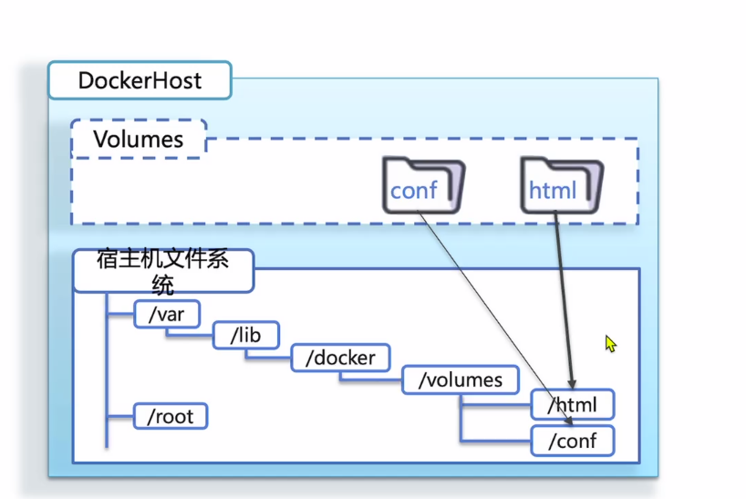

Day43Linux

# 问题记录

怎么写脚本？？？

<font color='blue'>systemctl??</font>

# 学习重点

常用命令必须牢记

磁盘文件/目录操作：创建查看，复制删除，搜索命令，编辑器，压缩与解压缩

# 1操作系统简介

操作系统：用户与硬件之间的一层桥梁，如果让用户直接操作硬件，用户无法操作。

让用户直接对操作系统下达命令，由操作系统对硬件下达命令。

Linux和windows，MacOS一样都是一种操作系统。

Liunx分为内核和系统程序两个部分，内核负责调度CPU以及硬件，系统程序负责调用内核来完成操作。

内核时开源且免费的，任何人任何组织都是可以在获取到内核代码后，基于内核完成开发=>Linux发行版

目前CentOS是红帽系统的免费版本，已经停止更新。

# 2Linux的目录结构说明

Linux操作系统中一切皆文件，不仅仅存储数据的磁盘是文件，其他设备也是文件，操作系统内部的信息也是文件的形式呈现，如CPU信息、内存信息，进程信息也是文件。

有一个专门的文档来介绍Linux的目录结构，这个文档名为文件系统层次标准（Filesystem Hierarchy Standard）简称 FHS。部分Linux的目录结构不在该文档中。

Linux没有盘符的概念，只有根目录，根目录就是`/`

任何内容都在根目录下，目录层级之间使用正斜杠`/`进行分隔

Linux也是可以进行额外磁盘的挂载。

## 2.1Linux文件

### 2.1.1Linux文件类型

Linux下一切皆文件，Linux文件类型分为七种

- `-`：普通文件=>白色，绿色，红色
- `d`：目录文件=>蓝色【目录】
- `p`：管理文件
- `l`：链接文件
- `b`：块设备文件=>黄色
- `c`：字符设备文件=>黄色
- `s`：嵌套字文件

### 2.1.2文件的显示颜色

1.白色：普通文件=>如普通文本

2.蓝色：目录文件

3.浅蓝色：链接文件

5.红色闪烁：表示其链接的文件有问题=><font color='blue'>找到示例补充</font>

4.绿色：可执行文件

5.红色：压缩文件或者档案文件

6.黄色：设备文件

7.桃红色：套接字文件=>`.socket`结尾

8.灰色：其他文件=><font color='blue'>找到示例补充</font>

9.红色背景：特殊权限Set User ID（SUID），占属主的x位，仅对可执行的程序有意义，当其他用户执行带SUID标记的程序时，所有用户具有此程序属主的身份和响应权限。例如：steam用户在此创建文件或目录，属主仍然是root，而不是steam用户。<font color='blue'>应用场景，密码，详细描述下</font>


10.黄色背景：特殊权限Set Group ID（SGID），占属组的x位，对可执行的程序和目录有效，例如：user2组员在此目录（属组是user1组）创建文件或者目录，属组仍然是user1，而不是user2


11.绿色背景：特殊权限Sticky BIt（粘滞位），占其他的（other）的x位，未设置粘滞位时，普通用户可以删除其他人的文档，设置粘滞位后普通用户不能删除其他人的文档只能删除自己的。

<font color='blue'>找个示例</font>

### 2.1.3Linux的特殊权限

<font color='blue'>待整理</font>

## 2.2tree命令

安装tree

```shell
yum install	tree
```

显示当前目录下的一级子菜单

```shell
tree -L 1
```

结果

```shell
.
├── bin -> usr/bin 		#最基础的用户二进制文件
├── boot				#静态启动文件
├── data				#？
├── dev					#设备文件
├── etc					#配置文件
├── home				#主目录
├── lib -> usr/lib		#基础共享库
├── lib64 -> usr/lib64	#？
├── lost+found			#可恢复的文件
├── media				#可插拔的挂载点
├── mnt					#临时挂载点目录
├── opt					#自选软件包
├── proc				#内核信息和进程内部信息
├── root				#root用户主目录
├── run					#应用程序状态文件
├── sbin -> usr/sbin	#系统管理二进制文件
├── srv					#服务数据	
├── sys					#？
├── tmp					#临时文件
├── usr					#用户使用的应用程序二进制文件
└── var					#变量数据文件
```

## 2.3文件目录细解

### `/`-根目录

任何内容都在根目录之下

### `/bin`-用户基础二进制文件

`/bin`时根目录下的一级子目录，包含了最为基础的用户二进制文件，也就是应用程序，类似于Windows下的Programs目录

并非所有的应用程序都存储在这个目录下，有些不是特别基础的应用程序会存储在`/usr/bin`目录下，比如Chrome浏览器，或者用户自己安装的一些程序会在/usr/bin下面。而系统应用程序则通常会在`/bin`，如ls、mkdir、cp等等


### `/boot`-静态启动文件

在目录`/boot`下面包含的文件是用于启动操作系统的文件，如GRUB boot loader文件和操作系统内核等，但是boot loader的配置文件并没有在这里，而是在`/etc`目录中

```shell
[root@VM-24-9-centos boot]# ll
总用量 116480
-rw-r--r--  1 root root   153619 6月  28 2022 config-3.10.0-1160.71.1.el7.x86_64
drwxr-xr-x. 3 root root     4096 3月   7 2019 efi
drwxr-xr-x. 2 root root     4096 3月   7 2019 grub
drwx------. 5 root root     4096 7月  25 2022 grub2
-rw-------  1 root root 62832834 7月  25 2022 initramfs-0-rescue-32784d1e1f77475fa1397a08746a9fe3.img
-rw-------  1 root root 19590743 7月  25 2022 initramfs-3.10.0-1160.71.1.el7.x86_64.img
-rw-------  1 root root 19172632 4月  26 09:46 initramfs-3.10.0-1160.71.1.el7.x86_64kdump.img
-rw-r--r--  1 root root   320652 6月  28 2022 symvers-3.10.0-1160.71.1.el7.x86_64.gz
-rw-------  1 root root  3622036 6月  28 2022 System.map-3.10.0-1160.71.1.el7.x86_64
-rwxr-xr-x  1 root root  6777448 7月  25 2022 vmlinuz-0-rescue-32784d1e1f77475fa1397a08746a9fe3
-rwxr-xr-x  1 root root  6777448 6月  28 2022 vmlinuz-3.10.0-1160.71.1.el7.x86_64
```

### `/dev`-设备文件

在Linux下，设备也是一个文件，比如磁盘，U盘，光盘。包括无线网卡，摄像头和串口等都是一个文件，通常这些文件都会在`/dev`目录下面。除了实体设备外，在该目录下还有很多伪设备，比如`/dev/random`表示产生随机数的设备，`/dev/loop0`则是一个将本地文件映射为磁盘的虚拟设备。这些伪设备有的时候非常有用，经常使用这些设备用于测试。

<font color='blue'>常用的内容汇总</font>

### `/etc-`配置文件

操作系统和应用程序的配置文件通常都同一存储在`/etc`。很多配置文件都是以文本的形式存储在这里，可以通过文本编辑器修改配置选项，比如网络的IP地址、Nginx的配置和系统日志的配置都可以在这里找到。

<font color='blue'>常用的内容汇总</font>

### `/home-`主目录

这个目录称为主目录，Linux中每个用户都有一个自己的目录，该目录在`/home`下，如用户 steam的用户目录为`/home/steam`。

用户的主目录下包含了用户的数据文件和用户相关的配置文件。通常一个用户只能修改其目录下的文件，只有获得授权的情况下才能访问其他文件。
<font color='blue'>常用的内容汇总</font>

### `/lib`-基础共享库

在`/lib`目录中存储的是`/bin`和`/sbin`中的二进制文件（应用程序）需要的库文件，在`/usr/bin`下应用程序依赖的库通常在`/usr/lib`目录下。

<font color='blue'>常用的内容汇总</font>

### `/lost+found-`可恢复文件

如果文件系统崩溃，在系统下一次启动的时候会进行数据检查，在检查的过程中如果发现有数据冲突的文件就会将其放入该目录中，这样可以试着手动回复文件

<font color='blue'>常用的内容汇总</font>

### `/media-`可插拔设备挂载点

在目录`/media`下面包含的子目录都是一些可以插拔的挂载点，当一些可插拔设备插入电脑时。在该目录下会自动创建子目录。并进行挂载

<font color='blue'>常用的内容汇总</font>

### `/mnt`-临时挂载点目录

该目录通常是空的，主要用于临时挂载一些外部文件系统，比如有多个数据磁盘的情况下，会将格式化的磁盘挂载到该目录下面。mnt字符是mount的缩写，也就是挂载的意思。
<font color='blue'>常用的内容汇总</font>

### `/opt`-自选软件包（Optional Package）

自行安装的非常规软件通常会安装在该目录

<font color='blue'>常用的内容汇总</font>

### `/proc`-Kernel&Process Files

该目录是一个虚拟目录，也是就是并不是存储文件数据的目录，这个目录的文件通常用来获取操作系统内核内部信息或者进程内部信息的。

比如每个进程在该目录下都有一个子目录，而字母的名字就是进程ID，通过cat命令对该目录下的文件进行读取，可以获取进程的详细信息，

<font color='blue'>常用的内容汇总</font>

cpuinfo

### `/root`-root用户主目录

目录/root是root用户的主目录，root用户的主目录并不在/home下面，而是在根目录下面。

<font color='blue'>常用的内容汇总</font>

### `/`run-应用程序状态文件

这个目录是比较新的目录，用户应用程序存储经常变化的文件，比如文件锁，进程ID或者套接字等等。

<font color='blue'>常用的内容汇总</font>

### `/`sbin-系统管理二进制文件

该目录与`/bin`目录类似，用户存储二进制文件，与`/bin`目录不同的地方是这个目录存储的是系统管理的二进制文件，比如磁盘格式化（mkfs），磁盘分区（fdisk）和网络配置（ifconfig）等命令

<font color='blue'>常用的内容汇总</font>

### `/srv`-服务数据

该目录存储具体服务提供的数据，通常该目录是空的，这个目录中的数据通常是提供给外部的，比如Web网站存储的用户信息，这里需要注意与`/var`和`/tmp`的区别，前者是提供给外部用户的，而后两者是应用自己使用的，而且`/tmp`中的数据重启后会丢失。

<font color='blue'>常用的内容汇总</font>

### `/tmp`-临时文件

应用程序产生的临时数据通常存储在该目录中。该目录有一个特点，就系统重启后目录中的数据将被清理。

<font color='blue'>常用的内容汇总</font>

### `/usr`-User Binaries & Read-Only Data

与系统使用的应用程序和文件不同，在`/usr`目录下存储的是用户使用的应用程序的文件，如`/bin`下面存储的系统二进制文件，而`/usr/bin`下面则是用户使用的二进制文件。`/lib`下面存储的系统文件，而`/usr/lib`下面存储的是用于应用程序使用的库文件。

<font color='blue'>常用的内容汇总</font>

### `/var`-变量数据文件

`/var`目录是`/usr`对应的可写目录，`/usr`目录中的内容只读的，而`/var`则是可写的，日志文件和正常操作中的一些写入操作通常会写入`/var`目录。如：日志文件通常存储在`/var/log`中

<font color='blue'>常用的内容汇总</font>



# 3Linux命令

## 3.1Linux的命令结构

```
核心命令 [-可选项] [目标参数]
```

核心命令：用于说明该命令的作用

-可选项：一般跟在核心命令后边，用-开头，丰富核心命令具体的细节

目标参数：该命令操作的目标是哪一行

## 3.2Linux的目录命令与路径

### 3.2.1-★ls命令

核心功能：用于展示指定目录下的所有内容

常见可选项：

```shell
ls -l:列式展示非隐藏内容，显示内容的权限，用户，用户组，大小，创建时间
```

```
ls -a:展示所有内容（隐藏内容）
```

可以搭配使用

```
ls -l -a: 列式展示所有内容
ls -al: 同上
ls -la: 同上
```

### 3.2.2-★cd命令

核心功能：进入到某一个目录中

没有可选项

- 绝对路径：以`/`开始的路径

```
cd /user/local
```

- 相对路径：不是以`/`开始的路径，

```
cd user
cd local
```

常用特殊符号

```
cd ./ 本级目录
cd ../ 或 cd .. 回退到上一级
cd ../../ 回退到上上级
cd ~ 回退到用户主目录
cd / 回退到根目录
```

### 3.2.3-pwd命令

核心功能：打印当前所在目录的绝对路径，之后在进行软件的安装，配置的时候需要修改路径，通过pwd进行获取。

## 3.3Linux的磁盘文件/目录操作（创建与查看）

### 3.3.1-mkdir命令

核心功能：创建文件夹（目录）默认在当前所在文件夹下创建

常见可选项：

```shell
mkdir -p 目录路径：可以递归创建路径上所有不存在的目录
```

如果创建单级目录，直接基于mkdir目录名称创建即可，如果创建多级目录，可以加上-p保证所有不存在的目录可以自动创建。

### 3.3.2-★touch命令

核心功能：创建一个文件 默认在当前文件夹下创建

没有常用可选项：

例：创建HelloWorld.java文件

```shell
touch HelloWorld.java
```

### 3.3.3-★cat命令

核心功能：将指定路径文件的所有内容展示在控制台

没有常用可选项

例：展示Member.java的文件

```shell
cat Member.java
```

> 如果文件过大，不建议使用cat展示，如果是小的配置文件，那么建议使用cat

### 3.3.4-more命令

核心功能：将指定路径文件的内容以翻页的形式展示在控制台

没有常用可选项

```shell
more Member.java
```

> 在阅读过程中可以基于空格翻页，不想看了可以通过q键退出

## 3.4Linux的磁盘文件/目录操作（复制剪切与删除）

### 3.4.1-★cp命令

核心功能：复制文件/目录

常用可选项：

```shell
cp -r 源目录路径 目标目录路径	#递归的将源目录的内容拷贝到目标目录中，如果没有-r，则会略过目录。
```

注意：

如果源内容是一个文件，目标是一个不存的内容，那么将源内容赋值到不存在的内容（创建）

```shell
cp A.java B.java	#如果B.java不存在，Linux会认为这是一个不存在的文件，会将B.java文件创建出来并拷贝内容
```

如果源内容是一个文件，目标是一个存在的文件夹，那么会将内容拷贝到文件夹中，文件名不变

```shell
cp A.java test	#test是一个文件夹，将A.java直接拷贝到test文件夹中，文件名不变
cp A.java test/B.java	#test下B.java不存在，会将B.java文件创建出来并拷贝内容
```

如果源内容是一个文件，目标是一个存在的文件，那么询问是否覆盖，输入y表示确定覆盖，不输入直接回车不覆盖

```shell
touch C.java	
cp A.java C.java	#C.java已经存在，进行覆盖复制
cp：是否覆盖"C.java"？ y
```

如果源内容是一个文件夹，目标是一个存在的文件夹，加-r的前提下，会将源文件夹递归的的拷贝到目标文件夹中

```shell
cp  test target2 
cp: 略过目录"test"

cp -r test target1	#将test文件夹完整拷贝到target1文件夹下，不加-r不能拷贝
#效果展示
.
├── A.java
├── B.java
├── C.java
├── target1
│   └── test
│       ├── A.java
│       └── B.java
└── test
    ├── A.java
    └── B.java

```

如果源内容是一个文件夹，目标是一个不存在的文件夹，加-r的前提下，会将源文件的名称修改为目标文件名称后拷贝（少一级目录深度）

```shell
cp  test target2
cp: 略过目录"test"
#效果展示
.
├── A.java
├── B.java
├── C.java
├── target1
│   └── test
│       ├── A.java
│       └── B.java
├── target2
│   ├── A.java
│   └── B.java
└── test
    ├── A.java
    └── B.java
```

如果源文件是一个文件夹，目标是一个存在的文件，无法拷贝

```shell
cp -r test A.java	#无法复制
cp: 无法以目录"test" 来覆盖非目录"A.java"
```

### 3.4.2-★mv命令

核心功能：移动文件/目录，改名

没有常用可选项

```shell
mv 源文件/目录 目标目录
```

```shell
mv C.java test	#将C.java目标文件移动到test文件夹下
#效果展示
└── test
    ├── A.java
    ├── B.java
    └── C.java
 mv target1 test	#将target1目标文件夹移动到test文件夹下
 #效果展示
└── test
    ├── A.java
    ├── B.java
    ├── C.java
    └── target1
        └── test
            ├── A.java
            └── B.java
mv test C.java	#将目标test文件夹移动到C.java文件夹【已存在C.java文件，删除C.java，创建名为C.java文件夹】 
#效果展示
C.java
├── A.java
├── B.java
├── C.java
└── target1
	└── test
		├── A.java
		└── B.java
```

注意：

无论源内容是文件还是文件夹，如果目标目录不存在，则默认为改名操作，

如果目标存在是文件类型则移除后将源文件夹改名，如果是目标文件夹类型，则移入该文件夹

```shell
mv A.java C.java	#将A.java更名为C.java
#效果展示
.
├── B.java
├── C.java
mv target1 target3	#将target1文件夹移入target3文件夹
#效果展示
target3
├── A.java
├── B.java
└── target1
	└── test
		├── A.java
		└── B.java
mv test C.java	#将目标test文件夹移动到C.java文件夹【已存在C.java文件，删除C.java，创建名为C.java文件夹】 
#效果展示
C.java
├── A.java
├── B.java
├── C.java
└── target1
	└── test
		├── A.java
		└── B.java
```

### 3.4.3-★rm命令

核心功能：删除 指定的文件/目录

常见可选项

```shell
rm -rf 待删除的文件或者目录
```

例：

```shell
rm -rf target3		#删除target3文件夹
```

<font color='red'>谨慎使用该命令，rm -rf /=>相当于系统格式化了</font>

**删除的时候可以使用通配符*来匹配内容**

```shell
rm -rf *.java	#删除此文件夹后缀为.java的文件
rm -rf *abc*	#删除名称中包含abc内容的文件
```

## 3.5网络命令

ip addr 查看网卡信息（Ip，MAC地址）

ifconfig 查询网卡信息（部分Linxu发行版已经不支持）

```sh
[root@hecs-352343 ~]# ip addr
1: lo: <LOOPBACK,UP,LOWER_UP> mtu 65536 qdisc noqueue state UNKNOWN group default qlen 1000
    link/loopback 00:00:00:00:00:00 brd 00:00:00:00:00:00
    inet 127.0.0.1/8 scope host lo
       valid_lft forever preferred_lft forever
    inet6 ::1/128 scope host 
       valid_lft forever preferred_lft forever
2: eth0: <BROADCAST,MULTICAST,UP,LOWER_UP> mtu 1500 qdisc pfifo_fast state UP group default qlen 1000
    link/ether fa:16:3e:0e:67:e6 brd ff:ff:ff:ff:ff:ff
    inet 192.168.1.128/20 brd 192.168.15.255 scope global noprefixroute dynamic eth0
       valid_lft 72660sec preferred_lft 72660sec
    inet6 fe80::f816:3eff:fe0e:67e6/64 scope link 
       valid_lft forever preferred_lft forever
3: docker0: <BROADCAST,MULTICAST,UP,LOWER_UP> mtu 1500 qdisc noqueue state UP group default 
    link/ether 02:42:02:3f:8c:44 brd ff:ff:ff:ff:ff:ff
    inet 172.17.0.1/16 brd 172.17.255.255 scope global docker0
       valid_lft forever preferred_lft forever
    inet6 fe80::42:2ff:fe3f:8c44/64 scope link 
       valid_lft forever preferred_lft forever
4: br-b99997bb0068: <BROADCAST,MULTICAST,UP,LOWER_UP> mtu 1500 qdisc noqueue state UP group default 
    link/ether 02:42:42:36:39:24 brd ff:ff:ff:ff:ff:ff
    inet 172.18.0.1/16 brd 172.18.255.255 scope global br-b99997bb0068
       valid_lft forever preferred_lft forever
    inet6 fe80::42:42ff:fe36:3924/64 scope link 
       valid_lft forever preferred_lft forever

```

- 第一段是本地回环网络接口（lo），IP地址为127.0.0.1，子网掩码为8位。
- 第二段是以太网接口（eth0），IP地址为172.17.215.163，子网掩码为20位，广播地址为172.17.223.255，MAC地址为00:16:3e:0e:5b:41。IP地址是动态获取的，有效期为264230007秒。
  - <BROADCAST,MULTICAST,UP,LOWER_UP> - 网络设备状态标识
  - UP：网卡处于启动状态。
  - BROADCAST：网卡可以发广播包。
  - MULTICAST：网卡可以发多播包。
  - LOWER_UP：L1是启动的，L1指的是物理层，即网线是插着的。　　
- 第三段是一个docker0虚拟网络接口，IP地址为172.17.0.1，子网掩码为16位。