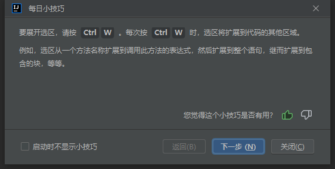
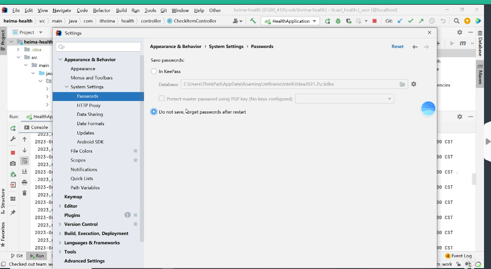
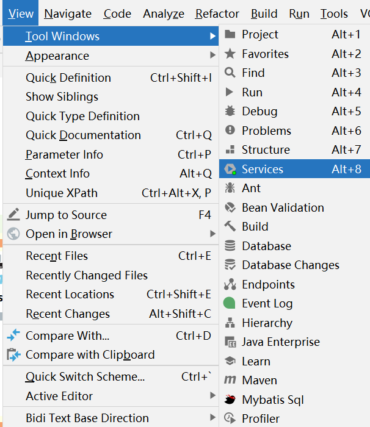

# 问题记录

# 待归档区

# IDEA使用技巧

ctrl+w：每次按ctrl+w时，选取将扩展到代码的其他选区，例如选取从一个方法名称扩展到调用此方法的表达式，然后扩展到整个语句，继而扩展到包含的块，等等。

ALT+7:展示一个类的所有属性和方法

CTRL+P：提示参数类型（jetBrains的通用）

快速注释：

行注释：ctrl+/

块注释：ctrl+shift+/

/**后enter，根据参数返回值生成注释模板

ctrl+shift+"+"展开类的所有方法和注释

ctrl+shift+"-"折叠类的所有方法和注释

ctrl+"+"展开光标所在的作用域

ctrl+“-”折叠光标所在的作用域

ctrl+N 按名字搜索类

同时修改多个文本，按住shift+alt，使用鼠标点击，可以出现多个光标，实现同时修改

ctrl+I：在实现类中生成实现方法

ctrl+alt+u：生成当前类的继承关系图（弹出）

ctrl+alt+L：Idea中格式化SQL

ctrl+shift+[-]：快速折叠方法块

crtl+shit+u：快速转换大小写

显示完整继承树

- ctrl+alt+shift+u（单独窗口）=>一个新页面
- 选中后ctrl+alt+B=>显示关联的类/接口
- ctrl+A全选后回车=>显示继承树

ctrl+alt+F6：关闭覆盖率测试

-Dserver.port=8094，同一项目不同端口启动

git密码输错第二次解决方案，

# Datgrip使用技巧

ctrl+shift+alt+L=>格式化SQL