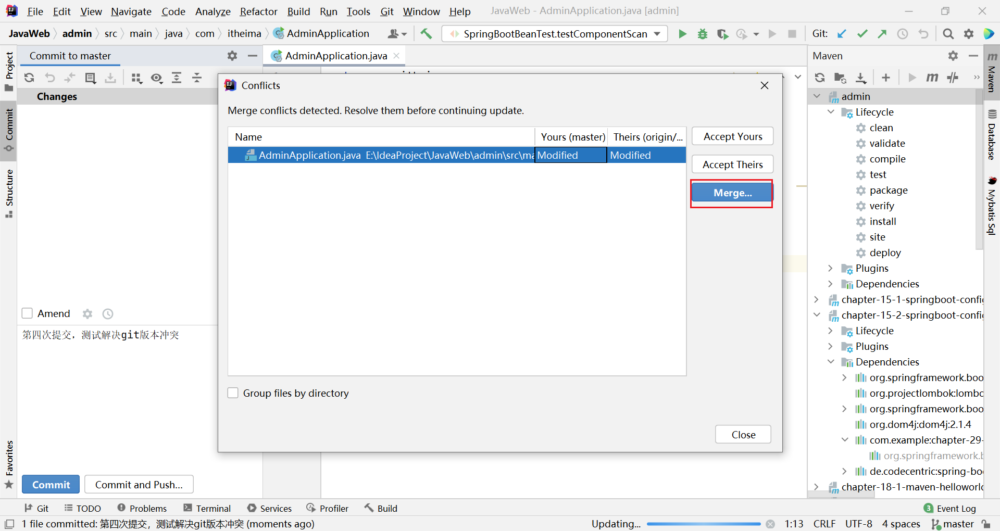

# 问题记录

Pro Git  git官网有免费的网页版

<font color='blue'>文件的不同颜色对应的信息</font>

# 待归档区


# 1-概述

## 1.1-简介


## 1.2-版本历史


## 1.3-竞品分析


# 1-Git概述与安装

开发中，代码备份/版本控制/责任溯源/协同工作都是非常重要的组成部分

开发中常用的版本控制工具有SVN和Git。

> Git使用人数是最多的

SVN：集中式版本控制=>所有的历史版本都在服务器中，个人开发者每次都从服务器拷贝最新数据，完成开发后上传

Git：分布式版本控制=>每一个开发者都有一份完整的代码历史版本，即使服务器挂了，也不影响个人开发，并且个人还可以同步历史记录到新的服务器上

Git实质上和Java，MySQL差不多更像是一个服务，不是一个软件

右键桌面，右键菜单中找到Git Bash Here打开命令提示符（可以识别Git命令）

```bash
git --version
```

# 2Git工作流程以及常用命令

## 2.1-Git工作流程


先有工作目录，让Git对工作目录进行管理

工作目录中的代码可以修改，当代码完成后，先将代码提交到暂存区（可以提交多次）

最后将暂存区中的代码提交带本地历史仓库（进行状态的记录）

## 2.2-Git基础操作

（1）在要管理的文件夹中，使用右键打开Git的命令提示符（注意确认路径是否正确）

> 初始化完成后，会生成`.git`文件夹（保存了所有提交的版本）

```bash
git init
```

（2）每当有文件创建了/修改了，想要本地仓库进行历史状态的保存（<font color='blue'>本地仓库在哪</font>），先加入暂存区，再提交本地仓库

向缓存区中添加文件，可以添加多次

```bash
git add 文件名
```

认为暂存区区中的文件足够保存一次版本，那么就提交暂存区的内容到本地仓库。

暂存区向本地历史添加的时候，一次性全部添加

```bash
git commit -m "本次提交的描述信息"
```

不加`-m '描述信息'`会进入描述信息界面，<font color='blue'>怎么退出</font>

（3）查看提交日志/查看当前工作目录的状态（<font color='blue'>bash脚本的注解是什么</font>）

```bash
git log           查看每次提交的人/邮箱（生成表示此版本的唯一索引）
git status        查看工作目录中哪些文件没有被追踪/没有被添加到缓存去/没有提交
```

（4）提交至本次仓库，要求记录提交人的信息/邮箱

```bash
git config --global user.email "提交人邮箱"
git config --global user.name "提交人名称"
```

## 2.3-Git版本管理

HEAD就是个指针，默认指向最新版本

当提交到本地仓库的时候，本地仓库会给本次提交生成一个唯一索引值（目的：方便版本回滚）

（1）查看所有操作记录

```bash
git reflog
```

（2）回滚版本

```bash
git reset --hard 提交的简化索引
```

## 2.4-Git分支管理

分支开发官方最推荐的方式

> 分支：由每次提交的代码，串成的一条时间线

分支的使用场景：适合并行开发，非常适合多个开发人员开发一个项目

Git中默认的分支是master分支，可以基于主分支某一个状态开辟新的分支（信奉之默认包含了主分支中当前代码）

等到新的分支代码开发完毕，可以和主分支合并再一起，基本上不会操作master分支，都是基于master分支去创建新的分支，master只用于合并

（1）基于当前所在分支创建新分支

```bash
git branch 分支名称
```

> 创建完分支默认不会切过去的

```bash
git branch 显示所有分支，提示当前所在分支
```

（2）切换分支

```bash
git checkout
```

（3）合并分支【无冲突】

合并分支时，当前HEAD指针指向谁，谁就是主要个兵这【基于master主分支进行合并】

master合并分支时，没有进行任何提交，合并时候不会产生冲突。（dev有什么就覆盖什么）

```bash
git merge 分支名称
```

（4）合并分支【有冲突】

如果master分支在创建dev分支操作后进行任何提交，并且在合并分支的产生冲突，则进入解决冲突状态`MERGING`

Git会将产生冲突的文件进行修改，展示产生冲突的地方。

手动修改冲突文件，重新add/commit，脱离MERGING状态，合并才能完成

```
git merge 分支名称=>修改冲突文件=>git add 冲突文件=>git commit -m '描述信息'
```


（5）删除分支

```
git branch -d 分支名  【需要做检查】
git branch -D 分支名  【不做检查】
```

> master分支无法删除，当前所在分支无法删除

## 2.5-分支使用原则和流程

- master（生产）分支

  线上分支，主分支，中小项目作为线上运行的应用对应的分支

- develop（开发）分支

  从master创建的分支，一般作为开发部门的主要开发分支，如果没有其他并行开发不同期上线要求，都可以在此版本进行开发，阶段开发完成后，需要合并到master分支，准备上线

- feature/xxx分支

  从develop创建的分支，一般时同期并行开发，但不同期上线时创建的分支，分支的研发任务完成后，合并到develop分支

- hotfix/xxx分支

  从master派生的分支，一般作为线上bug修复使用

- 其他分支

  如test分支（代码测试），pre分支（预上线分支）等等

# 3-Git远程仓库

远程仓库就是基于代码托管平台免费提供的可以基于公网访问的仓库

## 3.1-远程仓库连接本地

**（1）创建远程仓库**

使用github或者gitee等等

**（2）本地生成SSH公钥和密钥**

```
# 三次回车即可生成
ssh-keygen -t ed25519 -C "邮箱[用全局邮箱]"   
```

在本地C盘当前用户目录下生成一个.ssh的文件夹，分别提供私钥与公钥

**（3）本地拿到公钥** 

```
cat ~/.ssh/id_ed25519.pub
```

**（4）远程仓库添加公钥**

在远程仓库添加密钥

**（5）本地验证**（基于ssh命令校验是否可以与gitee安全通信）

```bash
$ ssh -T git@gitee.com
```

```bash
The authenticity of host 'gitee.com (212.64.63.190)' can't be established.
ED25519 key fingerprint is SHA256:+ULzij2u99B9eWYFTw1Q4ErYG/aepHLbu96PAUCoV88.
This key is not known by any other names.
Are you sure you want to continue connecting (yes/no/[fingerprint])? yes#输入yes
Warning: Permanently added 'gitee.com' (ED25519) to the list of known hosts.
Hi 刘10年! You've successfully authenticated, but GITEE.COM does not provide shell access.
```

## 3.2-GitBash操作远程仓库

**（1）给远程仓库起别名，方便推送**

```bash
git remote add 远程仓库别名 远程仓库URL
git remote add o1 https://gitee.com/wk9721/git-test.git
```

> 每一个.git都是一个独立的本地仓库，如果要用别名，需要单独再起别名

**（2）命令推送指定分支到远程仓库**

```bash
git push -u 远程仓库别名 推送分支名
git push -u o1 master
```

> 第一次操作，过程中可以会弹出窗口，要求登录gitee

**（3）如果本地没有仓库，则第一次要进行远程仓库的克隆**

```bash
git clone 远程仓库URL
git clone https://gitee.com/wk9721/git-test.git
```

> 克隆必须使用URL

**（4）如果有本地仓库，想要拉取远程仓库**

```bash
git pull 远程仓库别名 分支名称
git pull o1 master
```


## 3.3-本地仓库与远程仓库冲突的解决方案

想要推（push），先（pull），无法推送。

谨记：PUSH后被拒绝说明有冲突，选择方式解决冲突，根据弹出中出现的冲突一个一个解决，解决完成后再PUSH




# 4-IDEA与Git整合

参考Jrebrains进行参考

## 4.1-IDEA整合Git


## 4.2-IDEA克隆远程项目到本地


修改Maven


## 4.3-IDEA创建本地仓库

commit需要些写提交信息，不然红色提示


## 4.4-IDEA如何提交代码到本地仓库


## 4.5-IDEA如何提交代码到远程仓库


## 4.6-IDEA如何拉取远程仓库的代码


## 4.7-IDE解决冲突


# 7-Git私服部署


# 8-高级使用


