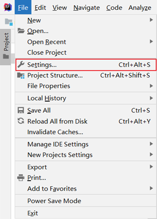
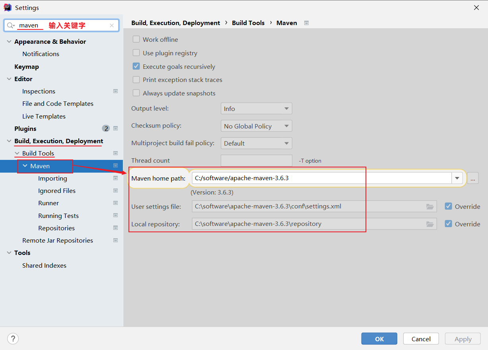
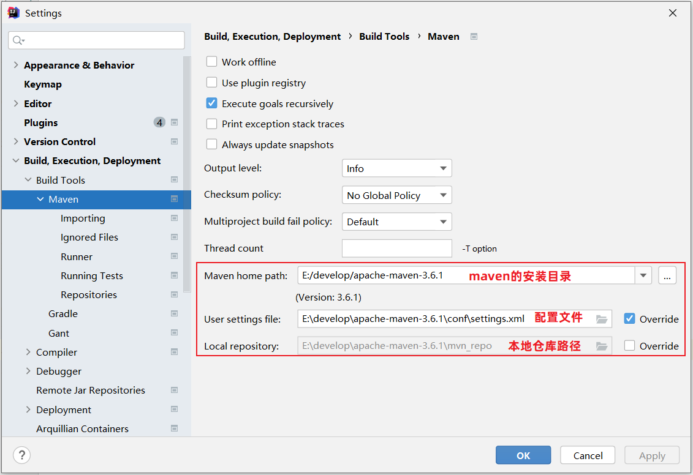
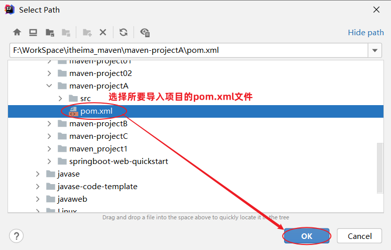

# 问题记录

**多多练习基于Spring Init创建方式创建SpringBoot工程！**

war包、jar包的区别

起步依赖与普通依赖有什么区别

# 学习目标

1. 能够配置好Maven并且和IDEA整合完毕，可以创建基于Maven管理的工程
2. 能够在Maven管理的工程中导入依赖
3. 能够基于Maven与SpringBoot完成Web工程创建并且完成入门案例

# 1.Maven概述

Maven是apache旗下的一个开源项目，是一款用于管理和构建Java项目的工具

<font color='blue'>类似于Maven的工具，Ant等？</font>Gradle

## 1.1Maven介绍

Maven主要的三个作用

### 1.1.1依赖管理

方便快捷的管理项目依赖的资源（jar包），避免版本冲突问题

### 1.1.2统一项目结构

提供标准、统一的项目结构


目录说明： 

- src/main/java: java源代码目录
- src/main/resources:  配置文件信息
- src/test/java: 测试代码
- src/test/resources: 测试配置文件信息


### 1.1.3项目构建

标准跨平台（Linux、Windows、MacOS）的自动化项目构建方式


## 1.2Maven模型

基于项目对象模型（POM）的概念，通过一小段描述信息来管理项目的构建

pom.xml用于保存当前Maven项目的配置信息


## 1.3Maven仓库

仓库：用于存储资源，管理各种jar包。

- 本地仓库：自己计算机上一个目录
- 中央仓库：由Maven团队维护的全球唯一的仓库，目前采用阿里云的仓库
- 远程仓库：公司团队搭建的私有仓库

## 1.4Maven安装

### 1.4.1maven文件目录介绍

* bin目录 ： 存放的是可执行命令。（mvn 命令重点关注）
* conf目录 ：存放Maven的配置文件。（settings.xml配置文件后期需要修改）
* lib目录 ：存放Maven依赖的jar包。（Maven也是使用java开发的，所以它也依赖其他的jar包）
* repo目录：本地仓库，存放jar包

### 1.4.2配置本地仓库和配置阿里云私服

1. 打开conf目录下settings.xml配置文件
2. 修改配置文件内容

```xml
  <localRepository>D:\apache-maven-3.6.3\repo</localRepository>	
```

```xml
  <mirrors>
	 <mirror>
		<id>aliyunmaven</id>
		<mirrorOf>*</mirrorOf>
		<name>阿里云公共仓库</name>
		<url>https://maven.aliyun.com/repository/public</url>
	</mirror>
  </mirrors>
```

### 1.4.3配置环境变量

- 新增系统变量MAVEN_HOME，设置为maven的解压目录文件夹

- 配置在Path中配置，设置为%MAVEN_HOME%\bin

- 注意事项：

  - 能执行，但是不显示信息，查看是否没有System.root环境变量是否存在


# 2.IDEA集成Maven

## 2.1配置Maven环境

### 2.1.1 全局设置 

找到全局的所有配置信息


### 2.1.2当前工程设置

未验证，谨慎操作

1、选择 IDEA中 File  =>  Settings  =>  Build,Execution,Deployment  =>  Build Tools  =>  Maven

 




2、设置IDEA使用本地安装的Maven，并修改配置文件及本地仓库路径



> Maven home path ：指定当前Maven的安装目录
>
> User settings file ：指定当前Maven的settings.xml配置文件的存放路径
>
> Local repository ：指定Maven的本地仓库的路径 (如果指定了settings.xml, 这个目录会自动读取出来, 可以不用手动指定)


3、配置工程的编译版本为11  或者 8  或者 17  

- Maven默认使用的编译版本为5（版本过低）

 

上述配置的maven环境，只是针对于当前工程的，如果我们再创建一个project，又恢复成默认的配置了。 要解决这个问题， 我们就需要配置全局的maven环境。

## 2.2创建Maven项目★

空项目创建完成之后,先点击File-Settings查看全局配置的Maven是否生效! 如果是则继续创建模块,如果不是(选择为自己的Maven)


点击FINISH之后,会默认开始下载一些Maven的依赖与插件(等待即可),下载完毕之后就不报错了!


## 2.3导入Maven项目

未经验证，谨慎操作

- **方式1：使用Maven面板，快速导入项目**

打开IDEA，选择右侧Maven面板，点击 + 号，选中对应项目的pom.xml文件，双击即可


 

> 说明：如果没有Maven面板，选择 View  =>  Appearance  =>  Tool Window Bars
>
>  


- **方式2：使用idea导入模块项目**

File  =>  Project Structure  =>  Modules  =>  +  =>  Import Module


找到要导入工程的pom.xml


## 2.4POM文件详解

POM（project object model）：指项目对象模型，用来描述当前的Maven项目 

- 使用pom.xml文件实现

pom.xml文件

```xml
<?xml version="1.0" encoding="UTF-8"?>
<project xmlns="http://maven.apache.org/POM/4.0.0"
         xmlns:xsi="http://www.w3.org/2001/XMLSchema-instance"
         xsi:schemaLocation="http://maven.apache.org/POM/4.0.0 http://maven.apache.org/xsd/maven-4.0.0.xsd">
    <!-- POM模型版本 -->
    <modelVersion>4.0.0</modelVersion>
    <!-- 当前项目坐标 -->
    <groupId>com.itheima</groupId>
    <artifactId>maven_project1</artifactId>
    <version>1.0-SNAPSHOT</version>    
    <!-- 打包方式 -->
    <packaging>jar</packaging>
    <!--引入依赖-->
    <dependencies>
       <dependency>
          <groupId>org.dom4j</groupId>
          <artifactId>dom4j</artifactId>
          <version>2.1.3</version>
       </dependency>
   	</dependencies>
</project>
```

pom文件详解：

- \<project> ：pom文件的根标签，表示当前maven项目
- \<modelVersion> ：声明项目描述遵循哪一个POM模型版本
  - 虽然模型本身的版本很少改变，但它仍然是必不可少的。目前POM模型版本是4.0.0
- 坐标 ：\<groupId>、\<artifactId>、\<version>
  - 定位项目在本地仓库中的位置，由以上三个标签组成一个坐标
- \<packaging> ：maven项目的打包方式，通常设置为jar或war（默认值：jar）

## 2.5Maven坐标详解

什么是坐标？

* Maven中的坐标是(资源的唯一标识=), 通过该坐标可以唯一定位资源位置
* 使用坐标来定义项目或引入项目中需要的依赖

Maven坐标主要组成

* groupId：定义当前Maven项目隶属组织名称（通常是域名反写，例如：com.itheima）

* artifactId：定义当前Maven项目名称（通常是模块名称，例如 order-service、goods-service）

  <font color='blue'>这就是用maven实现模块之间的联系的方式？</font>

* version：定义当前项目版本号

如下图就是使用坐标表示一个项目：

 

> **注意：**
>
> * 上面所说的资源可以是插件、依赖、当前项目。
> * 我们的项目如果被其他的项目依赖时，也是需要坐标来引入的

## 2.6Maven附录

### 2.6.1更新依赖索引

未验证，谨慎操作

有时候给idea配置完maven仓库信息后，在idea中依然搜索不到仓库中的jar包。这是因为仓库中的jar包索引尚未更新到idea中。这个时候我们就需要更新idea中maven的索引了，具体做法如下：

 打开设置----搜索maven----Repositories----选中本地仓库-----点击Update


### 2.6.2清理maven仓库

未验证，谨慎操作

初始情况下，我们的本地仓库是没有任何jar包的，此时会从私服去下载（如果没有配置，就直接从中央仓库去下载），可能由于网络的原因，jar包下载不完全，这些不完整的jar包都是以lastUpdated结尾。此时，maven不会再重新帮你下载，需要你删除这些以lastUpdated结尾的文件，然后maven才会再次自动下载这些jar包。


如果本地仓库中有很多这样的以lastUpadted结尾的文件，可以定义一个批处理文件，在其中编写如下脚本来删除： 

~~~
set REPOSITORY_PATH=E:\develop\apache-maven-3.6.1\mvn_repo
rem 正在搜索...

del /s /q %REPOSITORY_PATH%\*.lastUpdated

rem 搜索完毕
pause
~~~

操作步骤如下：

1). 定义批处理文件del_lastUpdated.bat  (直接创建一个文本文件，命名为del_lastUpdated，后缀名直接改为bat即可 )

 

2). 在上面的bat文件上**右键---》编辑** 。修改文件：

 

修改完毕后，双击运行即可删除maven仓库中的残留文件。

# 3.依赖管理★

## 3.1依赖配置

- 依赖：指当前项目运行所需要的jar包，一个项目中可以引入多个依赖
- 配置：
  1. 在pom.xml中编写\<dependencies>标签
  2. 在\<dependencies>标签中使用\<denpendency>引入坐标
  3. 定义坐标的group，artifactld，version
  4. 点击<font color='red'>刷新</font>按钮，引入最新坐标
- 注意事项：
  - 如果引入的依赖，在本地仓库不存在，将会连接到远程仓库/中央仓库，然后下载依赖。
  - 如果不知道依赖的坐标信息，可以到[https://mvnrepository.com](https://mvnrepository.com/)中搜索。
  - 国内网站查找依赖的坐标信息https://mvn.coderead.cn/
  - maven search插件，在tools导航条下使用

```xml
    <dependencies>
        <dependency>
            <groupId>org.dom4j</groupId>
            <artifactId>dom4j</artifactId>
            <version>2.1.3</version>
        </dependency>
        <dependency>
            <groupId>commons-io</groupId>
            <artifactId>commons-io</artifactId>
            <version>2.11.0</version>
        </dependency>
        <dependency>
            <groupId>junit</groupId>
            <artifactId>junit</artifactId>
            <version>4.13.2</version>
        </dependency>
    </dependencies>
```

## 3.2依赖传递

依赖具有传递性

直接依赖：在当前项目中通过依赖配置建立的依赖关系

简介依赖：被依赖的资源如果依赖其他资源，当前项目简介依赖其他资源

如图


## 3.3依赖排除

排除依赖指主动断开依赖的资源，被排除的资源无需指定版本，一般只有产生冲突才会排除依赖

A依赖于B，B依赖于C，A将C依赖排除后，仅仅只是A不依赖于C，不影响B依赖于C

代码示例

```xml
<dependency>
    <groupId>com.itheima</groupId>
    <artifactId>maven-projectB</artifactId>
    <version>1.0-SNAPSHOT</version>  
    <!--排除依赖, 主动断开依赖的资源-->
    <exclusions>
    	<exclusion>
            <groupId>junit</groupId>
            <artifactId>junit</artifactId>
        </exclusion>
    </exclusions>
</dependency>
```

## 3.4依赖范围

依赖的jar包，默认情况下，默认值是complie（99%的jar包），可以在任何地方使用。可以通过\<scope>...\</scope>设置其作用范围，会直接在IDE中限制，如@Test在主程序中就会报错。 

scope->范围

作用范围：

- 主程序范围有效(main文件夹范围内)
- 测试范围有效（test文件加范围内）
- 是否参与打包运行（package指令范围内）
- provided主程序和测试程序都参与，但是不参与打包（因为此功能由服务器提供，但是IDE本身没有，所以需要配置与服务器相同或者类似的功能）
- runtime用的非常少，知道就可以

| scope值  | 主程序 | 测试程序 | 打包（运行） | 范例                                  |
| -------- | ------ | -------- | ------------ | ------------------------------------- |
| comlile  | Y      | Y        | Y            | log4j                                 |
| test     | -      | Y        | -            | junit                                 |
| provided | Y      | Y        | -            | <font color='blue'>servlet-api</font> |
| runtime  | -      | Y        | Y            | JDBC驱动                              |

<font color='blue'>JDBC驱动为什么主程序没有？？</font>

代码

```xml
<dependency>
    <groupId>org.springframework.boot</groupId>
    <artifactId>spring-boot-starter-test</artifactId>
    <scope>test</scope>
</dependency>
```

## 3.5生命周期

Maven的声明周期就是为了对所有的maven项目构建过程进行抽象和统一。描述一次项目构建，经历哪些阶段。

在Maven出现前，项目构建的生命周期就已经存在，软件开发人员每天都在对项目进行清理，编译，测试及部署。虽然大家都在不停地做构建工作，但公司和公司间、项目和项目间，往往使用不同的方式做类似的工作。

Maven从大量项目和构建工具中学习和反思，然后总结了一套高度完美的，易扩展的项目构建生命周期。这个生命周期包含了项目的清理，初始化，编译，测试，打包，集成测试，验证，部署和站点生成等几乎所有构建步骤。


Maven项中有三套<font color='red'>相互独立</font>的生命周期

- clean：清理工作（可以基于其提供的时间节点，编写一些代码，成为钩子函数）
- default：核心工作，如：编译、打包，安装，部署等等 
- site：生成报告、发布站点等。

三套生命周期具体包含阶段


Maven的生命周期是抽象的，这意味着生命周期本身不做任何实际工作。**在Maven的设计中，实际任务（如源代码编译）都交由插件来完成。**


生命周期的使用两种方式：

- 在IDEA右侧Maven工具栏中，选择对应生命周期，双击执行
- 在DOS命令中，通过maven命令执行，也可以在IDEA控制台，通过命令执行<font color='blue'>控制台命令打开在项目文件下，怎么快速切换到模块下</font>

<font color='red'>特殊的生命周期（需要关注的）</font>

clean：删掉已经编译的数据target（与src目录同级）

compile：将当前Maven工程的所有内容编译为.class文件并且将编译后的内容保存到target文件夹中

test：默认执行test下所有的测试类（<font color='blue'>演示的没有效果，自己测试也没有效果</font>）

package ：将当前的Maven工程打成一个jar包供别人使用，jar包默认保存在target文件夹下

install：将当前的Maven工程打成一个jar包，而且安装在本地仓库（方便其他的项目冲本地仓库引用当前项目）

# 问题记录

maven协助分析依赖关系

用起步依赖好？还是一个个引的好？分别的适用情况（都做成可选继承，看起来是一个一个的引入好）

子工程的G是不是覆盖父工程的


PPT显示父工程在上一层目录

spring的一组问题

现在SSH的中S代表SpringMVC?

我们现在主要学了MC？，M对应的层？

spring的源码IOC，AOP有没有必要学习？

Maven的pom.xml各个标签的功能

Maven更多的功能

maven显示已存在项目

下午开始前两个小时的视频

排除SpringBoot-json依赖就不能用了，前台没响应

**<font color='blue'>spring框架依赖关系图梳理，以及各个的功能</font>**

学习重点


# 1-分模块设计与开发

为什么需要？不分模块，耦合度太高了，功能复用，模块向外提供功能

拆模块指的就是将成体系的内容，

项目一的拆分方式

sky-common:(自定义异常/工具类)

pojo

评估原版本和目标Java版本的标准Maven方法

```xml
<properties>
    <maven.compiler.source>8</maven.compiler.source>
    <maven.compiler.target>8</maven.compiler.target>
</properties>
```

SpringBoot特性版本

```xml
<properties>
    <java.version>1.8</java.version>
</properties>
```

在`spring-boot-starter-parent pom`中，可以看到`java.version`用于值`maven.compiler.source`和`maven.compiler.target`

其中


# 2Maven的继承

pom=>聚合工程

springboot内嵌了tomcat，和war包一样的部署方式吗？spring呢？


官方脚手架，默认新工程继承自spring-boot-stater-parent官方的父工程

也是单继承，但可以多层继承实现

强制继承与可选依赖

# 3Maven的聚合

聚合和继承是两个东西

Maven

打包后的项目在哪里（找不到可以去看视频）

循环依赖会出错

# 4Maven依赖下载失败解决方案


4.1包没下载下来

4.2.idea的缓存问题

4.3切换mvenHome？？？

4.4pom.xml文件中报错