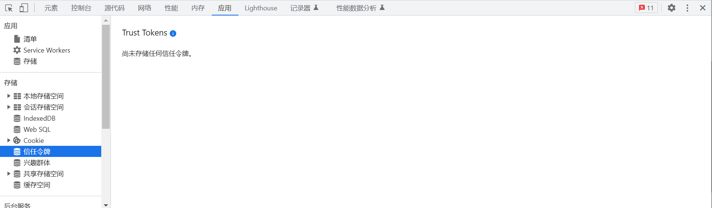
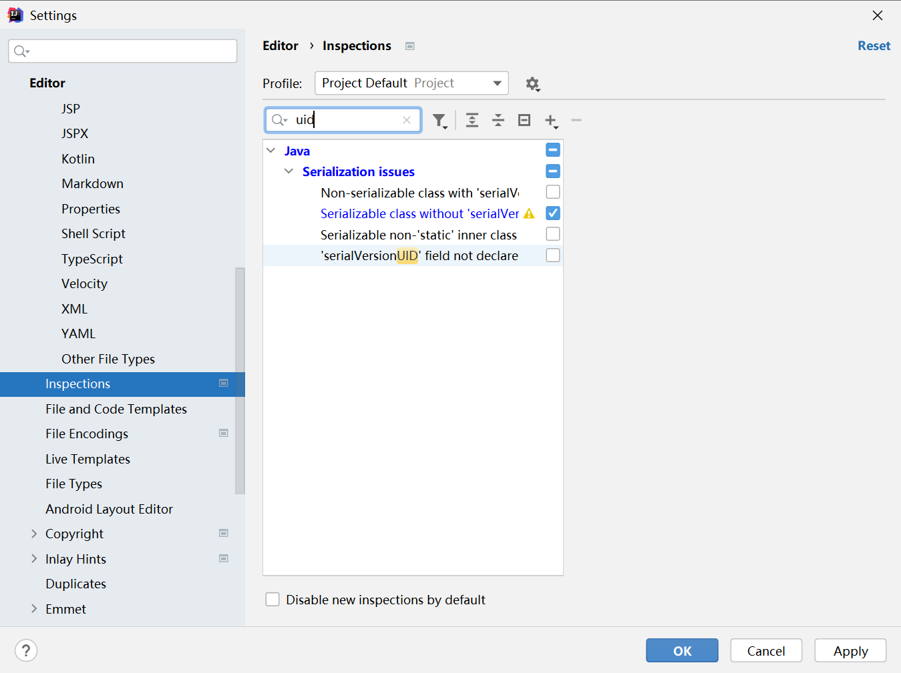
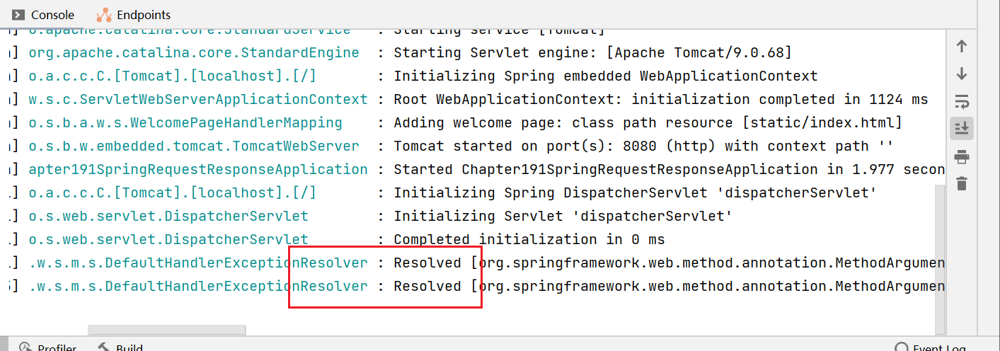
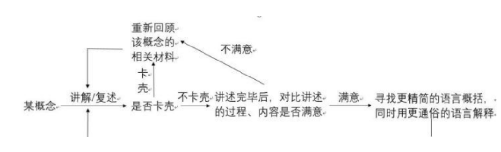
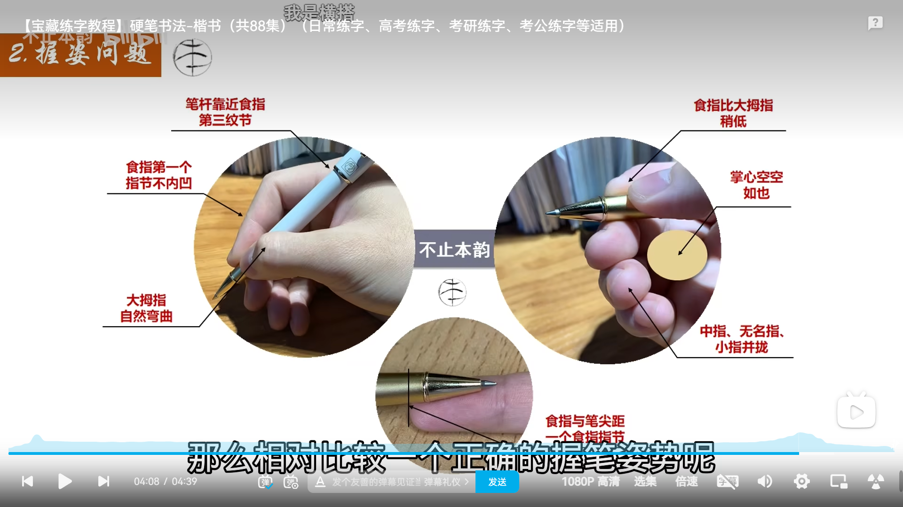
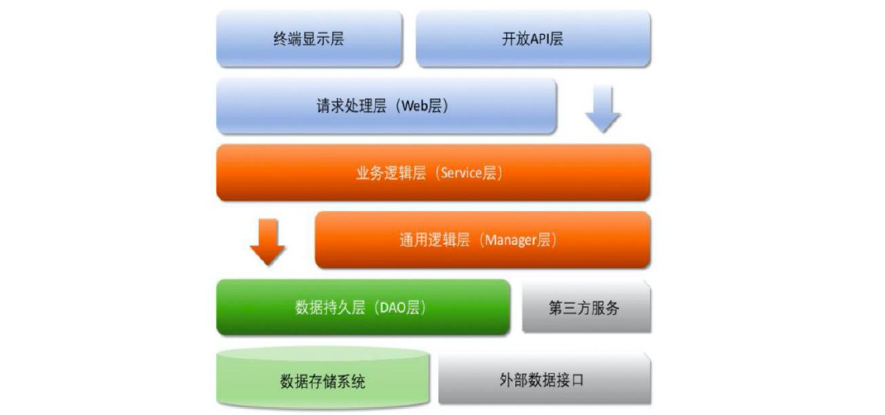

# 问题记录


# 待归档区


# 浏览器F12使用

## 网络选项卡

右键控制台，排序选项勾选可以查看协议版本，

筛选Fetch/XHR代表请求与响应

应用标签栏下




序列化接口UID警告



# 单词本

definition:(尤指词典里的词或短语的)释义，解释；定义；清晰度

Manipulation：操纵，变换，操作处理，操作证券市场，

Resolved：

raw：未经加工的

variable：n：变量；可变情况；可变因素 adj：可变的；多变的；易变的；变化无常的；可更改的

记忆=>vari 变化 + able 能…的 → 易变的

​		

# 笔记总则

1. 听课每日笔记禁止复制未经手打的内容（除安装过程）【提高效率】
2. 知识归档完全不禁止复制，但是复制内容文本口诵一遍，确认理解。
3. 面试话术整理，不禁止复制，难点手打，其它复制，每日背诵
4. 开始收敛，花了时间的要明白，要会，要能口述（内容过多，要有大纲）
5. 常看常新
6. 学习Typora，学习使用快捷键，工具就是生产力
7. 预习笔记很重要
8. 我希望把所有的都能玩出花来
9. 尽量在课间完成笔记整理，注意课间时间
10. 注意使用工具，加快打字速度，
11. 提交预习笔记的优先级，预习笔记做好了，有助于提升课间笔记效率
12. 晚会预习笔记，早上回顾笔记
13. 学习是学习使用工具
14. 上课时候跟随练习能极大的节省笔记时间
15. 以任务为导向做笔记，预估任务完成时间
16. 看看笔记，避免自满
17. 不要过分追求高深的内容，重点要学会熟练使用，减少问题量，熟悉后再搞原理
18. 
19. 计划是很重要的，
20. 日计划，周计划，月计划
21. 尝试丰富面试内容细节
22. 逆水行舟，不进则退，逆流而上
23. 很有压力，压力转动力，
24. 工程能力（需要强化记忆的，不能局限于理解，在于动手）与思维能力（逻辑思考能力，多维度的去解决问题）
25. <font color='blue'>如果咨询经历怎样的业务发展，根据项目经历提前准备些</font>


# 待办事项

在第一个项目期间，调用百度API，上传PDF，翻译成按段落对照的中英双语文档

Day14反射+代理笔记整理（MyBatis进阶开始前）

Day17VUE等全套

项目二

1. security的面试题整理，以面试为导向。寻找不会的知识点，串成待补全的知识体系，
2. 自己寻找资料进行学习security，尝试完成不同过滤器链，验证码接入。
3. Spring全家桶，各个jar包功能整理。（单开笔记）
4. RABC模型，权限管理认证的解决方案，成熟框架，
5. 整理部署中遇到的问题，整理流程，怎么写入的，找寻之前的笔记，整理Linux的命令，完善技能
6. 密码，各种加密方式，总结加密方式，以及最合适的解密工具，汇总，对比【安全，轻量】
7. Redis实现分布式锁，模拟高并发，实现
8. 级联怎么使用？级联更新与级联删除，怎么操作
9. 前端页面完成角色管理，VUE整理笔记
10. 总结部署经验，Java带有参数启动，尝试日志分析工具
11. 使用Jmetter测试并发吸能
12. 大数据量进行写入进行测试。
13. 使用Qurtza框架

nohup，>写入文件，

```
 nohup java -jar health_1.0.jar >health_info.log 2>health_error.log &
```


整理Linux笔记

项目一阶段所有笔记（优先）

1. POI的详细操作，Excel
2. Redis的操作方式汇总（）
3. WebSocket技术
4. HttpClient技术
5. 重做小程序的时序图
6. 订单支付，复制代码。理解逻辑，加上注释。
7. 分析代码，哪些应该打印log。
8. Spel表达式





# 7.24-7.25

整理索引回答，归档索引笔记，晚饭前（8点前）完成。


锁的相关问题整理，并归档，出话术。

1.先暂定JVM与MYSQL


上述任务今日（7.24）完成。（收敛归档内容）


项目追进度，整理业务，做流程图，整理关键点（先做再整理，做的时候可以一边做流程图），

这个项目是要产出话术的。


# 7.1

今天能整理多少整理多少，尽可能快的整理


# 6.29

项目表述提交（必须提交）

MQ高级笔记整理

MQ基础笔记整理

# 6.28

项目表述提交

整理分布式缓存的笔记


# 6.11

整理Linux笔记

汇总项目部署的经验。

spring全家桶，各个jar的功能


# 5.13

今日任务，WEB阶段笔记全部搞定（除VUE）

Day26笔记

Day24,25笔记

Day19Spring的三层设计笔记，三层拆分项目实战，

Day23mybatis的动态SQL

Day28Maven高级

Day22多表查询的案例分析

Day16JavaScript的DOM编程和事件监听

Day22索引相关，mybatis项目的配置，JDBC，作业，资料种50例SQL语句


# 5.7

全局异常处理器的功能实现（上午）

JWT令牌的生成解析方式，自己实现工具类。（上午）

pagehelper使用，

文件上传功能，yml文件配置

修后day25,day26代码。

总结笔记Day26

总结笔记Day24，25

# 5.6

过滤器的功能实现

拦截器的功能实现

全局异常处理器的功能实现

JWT令牌的生成解析方式，自己实现工具类。

pagehelper使用，yml文件配置

修后day25,day26代码。

总结笔记Day26

总结笔记Day24，25


# 4.30

Day16JavaScript的DOM编程完成，事件监听

Day14反射


# 4.29

Day22笔记整理（作业等复习完反射再写，加深对于框架的理解）


# 4.28

Day21外卖数据库设计实战，作业（基本完成）

Day22预习下，笔记目录出来（4.29早上起来弄出来，鼠标没电了）

# 4.27

晚饭前尽量搞定Day19

回来后搞定Day16剩余的部分

VUE什么时候搞啊？？

# 4.26

Day14反射一定要弄了！！！关系到后边学习SpringBoot

Day17全部的VUE一定要弄完，不然后边用到起不到复习的作用

# 4.25

Day16 JavaScript的DOM编程，JavaScript解析

Day20笔记

# 4.24休息日

Day18笔记完善（进度100%）已完成

Day16笔记完成（进度50%）（进度80%）

Day17笔记完成（进度0%）（包含部分VUE）

Day14反射笔记完成（进度30%）！！！！一定要完成||又没有时间了

Day19预习笔记（进度0%）

尽量能Day16的VUE整理完。VUE可以考虑放在五一假期。

# 4.22

Day18预习笔记

Day16笔记整理

Day17笔记整理

# 4.20

Day15笔记整理	

Day16笔记整理

Day17预习笔记

反射笔记整理（4.21必须完成）

工具使用指南笔记整理（写完自己已经会的）

# 4.19

WebDay1预习笔记（完成于4.19）

WebDay1笔记整理（解决笔记记录的问题）

WebDay1作业

WebDay2预习笔记


<font color='blue'>1.NAT技术详解</font>

2.<font color='blue'>大型网站的服务器架构设计，分为多少层，比如CDN-前端服务器-后端服务器-数据库服务器。成熟的架构设计模式有哪些？</font>

​	等到具体项目再进行了解。

3.<font color='blue'>Vue，Nginx技术进行简单了解</font>

​	等待讲课

4.<font color='blue'>数据库服务器是否应该单独存在，什么体量的会分离出数据库服务器？</font>

​	等到学习到或者学习过数据库进行解答

# 5.SpringBoot项目目录结构以及命名规范

```
servicex                 // 项目名
    |- admin-ui          // 管理服务前端代码(一般将UI和SERVICE放到一个工程中，便于管理)
    |- servicex-auth     // 模块1
    |- servicex-common   // 模块2
    |- servicex-gateway  // 模块3
    |- servicex-system   // 模块4
        |- src
            |- main                  // 业务逻辑
                |- assembly          // 基于maven assembly插件的服务化打包方案
                    |- bin           // 模块脚本(启动、停止、重启)
                    |- sbin          // 管理员角色使用的脚本(环境检查、系统检测等等)
                    |- assembly.xml  // 配置文件
                |- java              // 源码
                    |- com
                        |- hadoopx
                            |- servicex
                                |- system
                                    |- annotation     // 注解
                                    |- aspect         // 面向切面编程
                                    |- config         // 配置文件POJO
                                    |- filter         // 过滤器
                                    |- constant       // 存放常量
                                    |- util           // 工具
                                    |- exception      // 异常
                                    |- controller     // 控制层(将请求通过URL匹配，分配到不同的接收器/方法进行处理，然后返回结果)
                                    |- service        // 服务层接口
                                        |- impl       // 服务层实现
                                    |- mapper/repository // 数据访问层，与数据库交互为service提供接口
                                    |- entity/domain     // 实体对象
                                        |- dto // 持久层需要的实体对象(用于服务层与持久层之间的数据传输对象)
                                        |- vo // 视图层需要的实体对象(用于服务层与视图层之间的数据传输对象)
                                    |- *Application.java  // 入口启动类
                |- resources         // 资源
                    |- static        // 静态资源(html、css、js、图片等)
                    |- templates     // 视图模板(jsp、thymeleaf等)
                    |- mapper        // 存放数据访问层对应的XML配置
                        |- *Mapper.xml
                        |- ...
                    |- application.yml        // 公共配置
                    |- application-dev.yml    // 开发环境配置
                    |- application-prod.yml   // 生产环境配置
                    |- banner.txt    
                    |- logback.xml            // 日志配置
            |- test                  // 测试源码
               |- java               
                    |- com
                        |- hadoopx
                            |- servicex
                                |- system
                                    |- 根据具体情况按源码目录结构存放编写的测试用例
        |- target     // 编译打包输出目录(自动生成，不需要创建)
        |- pom.xml    // 该模块的POM文件
    |- sql            // 项目需要的SQL脚本
    |- doc            // 精简版的开发、运维手册
    |- .gitignore     // 哪些文件不用传到版本管控工具中
    |- pom.xml        // 工程总POM文件
    |- README.md      // 注意事项
External Libraries    // 相关JAR包依赖

```

注意事项：

1. mapper/repository：数据访问层，与数据库交互为service层提供接口，MyBatis使用的mapper，JPA使用的repository。

2. entity/domain：数据实体类，MyBatis使用的额entity，JPA使用的repository

   

# 6应用分层



> 箭头关系表示可以直接依赖

- 开放API层：可以直接封装Service接口暴露成<font color='blue'>RPC接口，通过Web层封装成http接口，网关控制层</font>

- Web层（Controller）：主要对访问控制进行转发，各类基本参数校验，或者不复用的业务简单处理等

- Service层：具体的业务逻辑服务层

- Manager层：通用业务处理层

  - 对第三方平台封装的层，预处理返回结果及转化异常信息，适配上层接口
  - 对Service层通用能力的下沉，如缓存方案，中间件通用处理
  - 与Dao层交互，对多个Dao层组合复用

- Dao层

- 第三方服务

- 外部数据接口

  

分层领域模型规约

> 设计层面和具体实现是两个事情，不要局限于

<font color='red'>DTO（Data Transfer Object）：</font>数据传输对象，系统、服务之间传输用或者传输类间数据，Service或者Manager向外传输的对象。`目前DTO用来做用DO不能胜任的功能，比如从Controller=>Service=>dao层的参数传递`

> DTO概念原子于J2EE的设计模式，原来目的是为了EJB的分布式应用提供粗粒度的数据实体，以减少分布式调用的次数，从而提高分布式调用的性能和降低网络负载。

> 看项目编码规约，有的习惯使用DTO来做rest接口参数，或者rpc参数。

<font color='red'>DO（Data Object）：</font>领域对象/数据对象，从现实世界中抽取出来的有形或者无形的业务实体。主要用于定义与数据库对应的属性，实体Bean的DO映射成一张表，通过Dao层向上传输数据源对象。命名格式[<font color='red'>xxxDO,xxxEntity</font>]

> DO与PO绝大多数时候是对应的，但是存在内存中不需要持久化只是DO，不是PO【设计层面概念】

VO（View Object）：视图对象，用于展示层展示，代表展示层要显示的数据。作用是把某个组件/页面需要的数据封装起来。<font color='blue'>这个概念是前后端混合项目的概念吧？Result可以理解VO？</font>

PO（Persistent Object）：持久化对象，跟持久层（通常是关系型数据库）的数据结构形成一一对应关系

BO（Business）：业务对象，封装业务逻辑为一个对象。

Query：<font color='blue'>功能目前被DTO实现了，但是细化设计应该能用上，比如查询和增删改分开</font>


