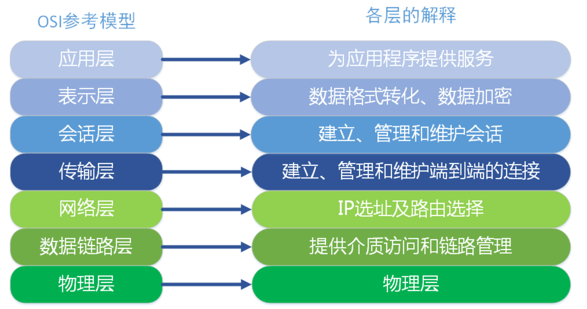
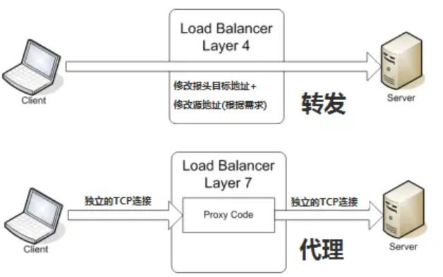
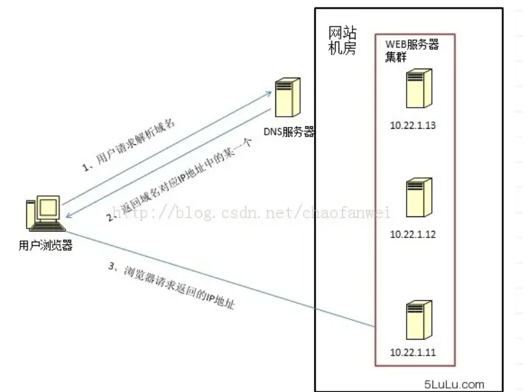
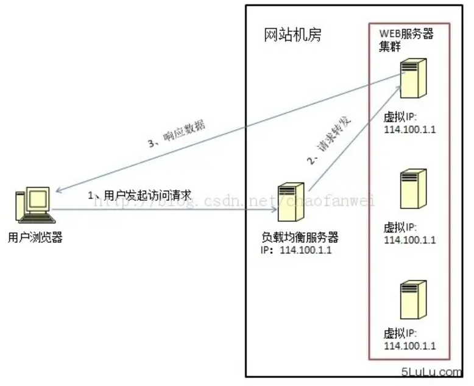
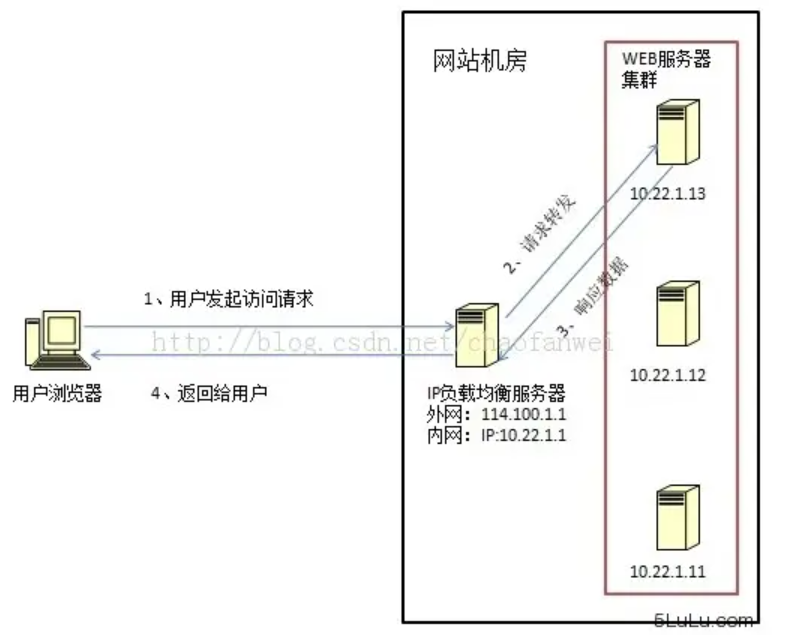
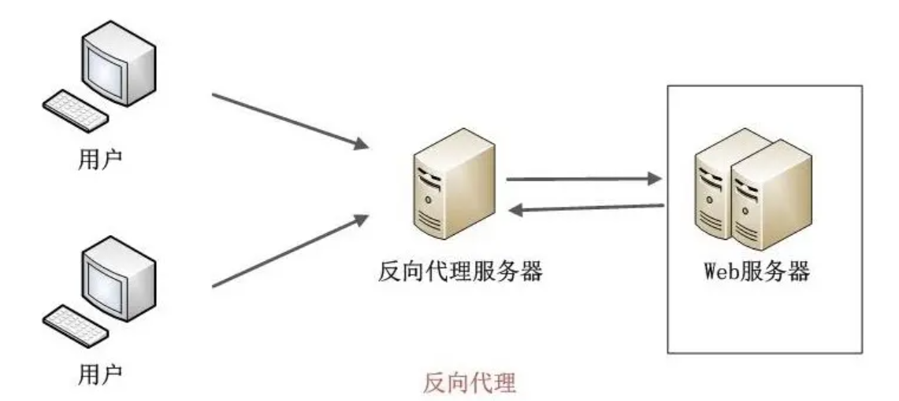
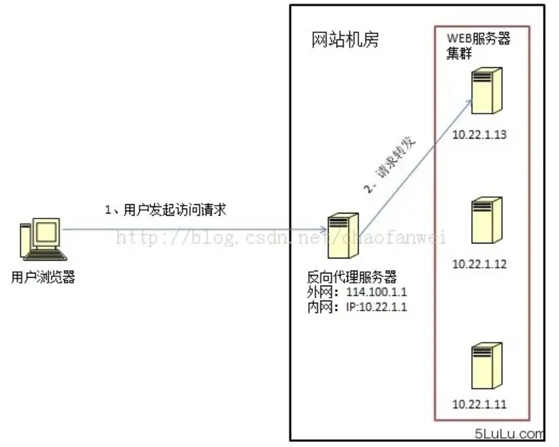
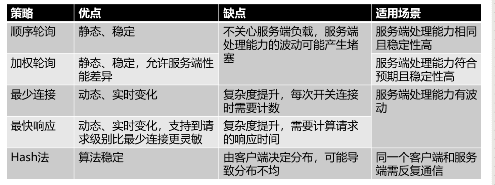

# 问题记录


# 待归档区


# 1负载均衡概述

## 1.1负载均衡简介

负载均衡（Load Balance），意为将负载（工作任务，访问请求）进行平衡，分摊到各个操作单元（服务器，组件）上执行。是解决高性能，单点故障（高可用），扩展性（水平伸缩）的终极解决方案

通过某种负载均衡技术，将外部发送来的请求均匀的分配到对称结构中的某一台服务器上，而接收请求的服务器独立地回应客户的请求，负载均衡能够平均分配客户请求到服务器阵列，解决大量并发访问服务问题，这种集群技术可以**用最少的投资获得接近大型主机的性能**。

## 1.2负均均衡涉及组件

### LVS

Linux Virtual Server的简写，意即Linux虚拟服务器，是一个虚拟的服务器集群系统。由毕业于国防科技大学的章文嵩博士于1998年5月创立，可以实现LINUX平台下的简单负载均衡。了解更多，访问官网：http://zh.linuxvirtualserver.org/。

### HAProxy

　HAProxy提供高可用性、负载均衡以及基于TCP和HTTP应用的代理，支持虚拟主机，它是免费、快速并且可靠的一种解决方案。HAProxy特别适用于那些负载特大的web站点， 这些站点通常又需要会话保持或七层处理。HAProxy运行在当前的硬件上，完全可以支持数以万计的并发连接。并且它的运行模式使得它可以很简单安全的整合进您当前的架构中， 同时可以保护你的web服务器不被暴露到网络上。

### Nginx

2004年，俄罗斯人开发的。一个开放源码的网页服务器，可以在大多数计算机操作系统中运行。由于其多平台和安全性被广泛使用，是最流行的 Web服务器端软件之一。

### Apache

免费开源、轻量级、高性能 Web 服务器，由伊戈尔·赛索耶夫为俄罗斯访问量第二的 Rambler.ru 站点开发。

### Keepalived

​		keepalived是一个组件，可以实现web服务器的高可用(HA high availably)。它可以检测web服务器的工作状态，如果该服务器出现故障被检测到，将其剔除服务器群中，直至正常工作后，keepalive会自动检测到并加入到服务器群里面。实现主备服务器发生故障时ip瞬时无缝交接。它是LVS集群节点健康检测的一个用户空间守护进程，也是**LVS的引导故障转移模块（director failover）**。Keepalived守护进程可以检查LVS池的状态。如果LVS服务器池当中的某一个服务器宕机了。keepalived会通过一 个setsockopt呼叫通知内核将这个节点从LVS拓扑图中移除。

### <font color='blue'>memcached</font>

它是一个高性能分布式内存对象缓存系统。

### <font color='blue'>terracotta</font>

是一款由美国Terracotta公司开发的著名开源Java集群平台。它在JVM与Java应用之间实现了一个专门处理集群功能的抽象层，允许用户在不改变系统代码的情况下实现java应用的集群。支持数据的持久化、session的复制以及高可用(HA)。

# 2负载均衡技术实现    

## 2.1技术实现 （OSI模7型）



其中高层（7，6，5，4层）定义了应用程序的功能，下面三层（3，2，1层）主要面向通过网络的数据流。

> TELNET、HTTP、FTP、NFS、SMTP、DNS等属于第七层应用层的概念。
>
> TCP、UDP、SPX等属于第四层传输层的概念。
>
> IP、IPX等属于第三层网络层的概念。
>
> ATM、FDDI等属于第二层数据链路层的概念。

### **IPX/SPX协议**

​		IPX(Internet work Packet Exchange，互联网络数据包交换)是一个专用的协议簇，它主要由Novell NetWare操作系统使用。IPX是IPX协议簇中的第三层协议。SPX（Sequenced Packet Exchange protocol， 序列分组交换协议）是 Novell 早期传输层协议，为 Novell NetWare 网络提供分组发送服务。在局域网中用得比较多的网络协议是IPX/SPX。

- IPX（Internet work Packet Exchange互联网络数据包交换）：第三层协议，用来对通过互联网络的数据包进行路由选择和转发，它指定一个无连接的数据报，相当于TCP/IP协议簇中的IP协议;
- SPX（Sequenced Packet Exchange，顺序包交换协议）：第四层协议，是IPX协议簇中的面向连接的协议，相当于TCP/IP协议簇中的TCP协议;
- NCP（NetWare Core Protocol，NetWare核心协议）：提供从客户到服务器的连接和应用;
- SAP（Service Advertising Protocol，服务通告协议）：用来在IPX网络上通告网络服务;
- IPX RIP（Routing Information Protocol，Novell路由选择信息协议）：完成路由器之间路由信息的交换并形成路由表

### 负载均衡与网络分层

<font color='blue'>找机会搜集下，看看各层协议的数据包格式</font>

负载均衡设备常被称为”四到七层交换机“

**负载均衡就是在网络传输中做文章的**

常见的实现方式中，主要可以在应用层【7】，传输层【4】，网络层【3】，数据链路层【2】做文章，所以工作在应用层的负载均衡，通常被称为七层负载均衡，工作在传输层的负载均衡，通常被称为四层负载均衡。

### 二层负载均衡

负载均衡服务器对外提供一个VIP（虚IP）,集群中不同的机器采用相同的IP地址，但是机器的MAC地址不一样，当负载均衡服务器接收到请求后，通过改写报文的目标MAC地址的方式将请求转发到目标机器实现负载均衡。

### 三层负载均衡

与二层负载均衡类似，仍然向外提供一个VIP（虚IP），但是集群中不同的机器采用不同的IP地址，当负载均衡服务器接收到请求之后，根据不同的负载均衡算法，通过IP将请求转发至不同的真实服务器。

### 四层负载均衡★

四层负载均衡工作在OSI模型的传输层，主要通过报文中的目标地址和端口，再加上负载均衡设置的服务器选择方式，决定最终选择的内部服务器。

> LVS主要用来做四层负载均衡

以常见的TCP为例，负载均衡设备在接收到第一个来自客户端的SYN请求时，即通过上述方式选择一个最佳的服务器，并且对报文中目标IP地址进行修改（改为后端服务器IP），直接转发给该服务器。TCP的连接建立，即三次握手时客户端和服务器直接建立的，负载均衡设备只是起到一个类似路由器的转发动作。在某些部署情况下，为保证服务器回包可以正确返回给负载均衡设备。在转发报文的同时可能还会对报文原来的源地址进行修改。<font color='blue'>类似于NAT技术？</font>


### 七层负载均衡★

七层负载均衡工作OSI模型的应用层，应用层协议较多，常见如：http，radius，dns等，七层负载就可以基于这些协议来负载，这些应用层协议中包含很多有意义的内容。如：同一个Web服务器的负载均衡，除了根据IP+端口进行负载均衡外，还可以通过七层的URL，浏览器类别，语言来决定是否进行负载均衡。

> HAProxy和Nginx都是七层负载均衡

以常见的TCP为例，负载均衡设备如果要根据真正的应用层内容再选择服务器，只能先代理最终的服务器和客户端建立连接（三次握手）后，才可能接收到客户端发送的真正应用层报文，然后再根据该报文中的特定字段，再加上负载均衡设备设置的服务器选择方式，决定最终选择的内部服务器。负载均衡服务器在这种情况下，更类似于一个代理服务器。负载均衡和前端的客户端以及后端的服务端会分别建立TCP连接。因此可见，七层负载均衡明显对负载均衡设备的要求更高。处理七层的能力也必然低于四层模式的部署方式、

### 四层与七层



如何抉择使用四层负载均衡和七层负载均衡

**应用场景的需求**

智能化：例如访问一个网站的用户流量，可以通过七层的方式，将对图片类的请求转发到特定的图片服务器并可以使用缓存技术；将对文字类的请求可以转发到特定的文字服务器并可以使用压缩技术。<font color='blue'>配置一个练手</font>

安全性：网络中最常见的SYN Flood攻击，从技术原理上也可以看出，四层模式下这些SYN攻击都会被转发到后端的服务器上；而七层模式下这些SYN攻击自然在负载均衡设备上就截止，不会影响后台服务器的正常运营。另外负载均衡设备可以在七层层面设定多种策略，过滤特定报文，例如SQL Injection等应用层面的特定攻击手段，从应用层面进一步提高系统整体安全。

现在的七层负载均衡，主要还是着重于应用广泛的HTTP协议，所以其应用范围主要是众多的网站或者内部信息平台等基于B/S开发的系统。四层负载均衡则对应其他TCP应用，例如基于C/S开发的ERP等系统。

**七层应用需要考虑的问题**

1：是否真的必要，七层应用的确可以提高流量智能化，同时必不可免的带来设备配置复杂，负载均衡压力增高以及故障排查上的复杂性等问题。在设计系统时需要考虑四层七层同时应用的混杂情况。

2：是否真的可以提高安全性。例如SYN Flood攻击，七层模式的确将这些流量从服务器屏蔽，但负载均衡设备本身要有强大的抗DDoS能力，否则即使服务器正常而作为中枢调度的负载均衡设备故障也会导致整个应用的崩溃。

<font color='blue'>netty，websocket这种使用哪种负载均衡</font>

## 2.2技术实现（更广层面）

### 2.2.1DNS域名解析负载均衡（延迟）

> 早年采用过这种负载均衡



利用DNS处理域名解析请求的同时进行负载均衡是一种常用的方案。在DNS服务器中配置多个A记录，

```
www.mysite.com IN A 114.100.80.1、
www.mysite.com IN A 114.100.80.2、
www.mysite.com IN A 114.100.80.3.
```

每次域名解析请求都会根据负载均衡算法计算一个不同的IP地址返回，这样A记录中配置的多个服务器就构成一个集群，并可以实现负载均衡。

DNS域名解析负载均衡的优点是将负载均衡工作交给DNS，省略掉了网络管理的麻烦，缺点就是**DNS可能缓存A记录，不受网站控制**。事实上，大型网站总是部分使用DNS域名解析，作为第一级负载均衡手段，然后再在内部做第二级负载均衡。

**DNS的查询过程**

有dns的地方,就有缓存。浏览器、操作系统、本地DNS、根域名服务器，它们都会对DNS结果做一定程度的缓存。

1. 首先搜索浏览器自身的DNS缓存,如果存在，则域名解析到此完成。

2. 如果浏览器自身的缓存里面没有找到对应的条目，那么会尝试读取操作系统的hosts文件看是否存在对应的映射关系,如果存在，则域名解析到此完成。

3. 如果本地hosts文件不存在映射关系，则查找本地DNS服务器(ISP服务器,或者自己手动设置的DNS服务器),如果存在,域名到此解析完成。

4. 如果本地DNS服务器还没找到的话,它就会向根服务器发出请求,进行递归查询。


### 2.2.1二层负载均衡（LVS的DR模式）



数据链路层负载均衡是指在通信协议的数据链路层修改mac地址进行负载均衡。

- 这种数据传输方式又称作三角传输模式，负载均衡数据分发过程中不修改IP地址，只修改目的的mac地址，通过配置真实物理服务器集群所有机器虚拟IP和负载均衡服务器IP地址一样，从而达到负载均衡，这种负载均衡方式又称为直接路由方式（DR）.
- 在上图中，用户请求到达负载均衡服务器后，负载均衡服务器将请求数据的目的mac地址修改为真是WEB服务器的mac地址，并不修改数据包目标IP地址，因此数据可以正常到达目标WEB服务器，该服务器在处理完数据后可以经过网管服务器而不是负载均衡服务器直接到达用户浏览器。
- 使用三角传输模式的链路层负载均衡是目前大型网站所使用的最广的一种负载均衡手段。在linux平台上最好的链路层负载均衡开源产品是LVS(linux virtual server)

### 2.2.3三层负载均衡（SNAT）



IP负载均衡：即在网络层通过修改请求目标地址进行负载均衡。

- 用户请求数据包到达负载均衡服务器后，负载均衡服务器在操作系统内核进行获取网络数据包，根据负载均衡算法计算得到一台真实的WEB服务器地址，然后将数据包的IP地址修改为真实的WEB服务器地址，不需要通过用户进程处理。真实的WEB服务器处理完毕后，相应数据包回到负载均衡服务器，负载均衡服务器再将数据包源地址修改为自身的IP地址发送给用户浏览器。
- 这里的关键在于真实WEB服务器相应数据包如何返回给负载均衡服务器，一种是负载均衡服务器在修改目的IP地址的同时修改源地址，将数据包源地址改为自身的IP，即源地址转换（SNAT），另一种方案是将负载均衡服务器同时作为真实物理服务器的网关服务器，这样所有的数据都会到达负载均衡服务器。
- IP负载均衡在内核进程完成数据分发，较反向代理均衡有更好的处理性能。但由于所有请求响应的数据包都需要经过负载均衡服务器，**因此负载均衡的网卡带宽成为系统的瓶颈**。

### 2.2.4HTTP重定向负载均衡（少见）


- HTTP重定向服务器是一台普通的应用服务器，其唯一的功能就是根据用户的HTTP请求计算一台真实的服务器地址，并将真实的服务器地址写入HTTP重定向响应中（响应状态吗302）返回给浏览器，然后浏览器再自动请求真实的服务器。
- 这种负载均衡方案的优点是比较简单，缺点是浏览器需要每次请求两次服务器才能拿完成一次访问，性能较差；使用HTTP302响应码重定向，可能是搜索引擎判断为SEO作弊，降低搜索排名。重定向服务器自身的处理能力有可能成为瓶颈。因此这种方案在实际使用中并不见多。

### 2.2.5反向代理负载均衡（Nginx）





传统代理服务器位于浏览器一端，代理浏览器将HTTP请求发送到互联网上。而反向代理服务器则位于网站机房一侧，代理网站web服务器接收http请求。

反向代理的作用是保护网站安全，所有互联网的请求都必须经过代理服务器，相当于在web服务器和可能的网络攻击之间建立了一个屏障。

除此之外，代理服务器也可以配置缓存加速web请求。当用户第一次访问静态内容的时候，静态内存就被缓存在反向代理服务器上，这样当其他用户访问该静态内容时，就可以直接从反向代理服务器返回，加速web请求响应速度，减轻web服务器负载压力。

另外，反向代理服务器也可以实现负载均衡的功能。

由于反向代理服务器转发请求在HTTP协议层面，因此也叫应用层负载均衡。优点是部署简单，缺点是可能成为系统的瓶颈。

# 3负载均衡算法


## 3.1静态算法

- 轮询（Round Robin）：顺序循环将请求一次顺序循环地连接每个服务器。当其中某个服务器发生第二到第7 层的故障，BIG-IP 就把其从顺序循环队列中拿出，不参加下一次的轮询，直到其恢复正常。【<font color='blue'>如果某一个服务器比较弱，有可能造成服务堆积？？</font>】
- 比率（Ratio）：给每个服务器分配一个加权值为比例，根椐这个比例，把用户的请求分配到每个服务器。当其中某个服务器发生第二到第7 层的故障，BIG-IP 就把其从服务器队列中拿出，不参加下一次的用户请求的分配, 直到其恢复正常。
- 优先权（Priority）：给所有服务器分组,给每个组定义优先权，BIG-IP 用户的请求，分配给优先级最高的服务器组（在同一组内，采用轮询或比率算法，分配用户的请求）；当最高优先级中所有服务器出现故障，BIG-IP 才将请求送给次优先级的服务器组。这种方式，实际为用户提供一种热备份的方式。

## 3.2动态算法

- 最少的连接方式（Least Connection）：传递新的连接给那些进行最少连接处理的服务器。当其中某个服务器发生第二到第7 层的故障，BIG-IP 就把其从服务器队列中拿出，不参加下一次的用户请求的分配, 直到其恢复正常。

- 最快模式（Fastest）：传递连接给那些响应最快的服务器。当其中某个服务器发生第二到第7 层的故障，BIG-IP 就把其从服务器队列中拿出，不参加下一次的用户请求的分配，直到其恢复正常。

- 观察模式（Observed）：连接数目和响应时间以这两项的最佳平衡为依据为新的请求选择服务器。当其中某个服务器发生第二到第7 层的故障，BIG-IP就把其从服务器队列中拿出，不参加下一次的用户请求的分配，直到其恢复正常。

- 预测模式（Predictive）：BIG-IP利用收集到的服务器当前的性能指标，进行预测分析，选择一台服务器在下一个时间片内，其性能将达到最佳的服务器相应用户的请求。(被BIG-IP 进行检测)

- 动态性能分配(Dynamic Ratio-APM)：BIG-IP 收集到的应用程序和应用服务器的各项性能参数，动态调整流量分配。

- 动态服务器补充(Dynamic Server Act.)：当主服务器群中因故障导致数量减少时，动态地将备份服务器补充至主服务器群。

- 服务质量(QoS）：按不同的优先级对数据流进行分配。

- 服务类型(ToS)：按不同的服务类型（在Type of Field中标识）负载均衡对数据流进行分配。

- 规则模式：针对不同的数据流设置导向规则，用户可自行。

## 3.3优缺点适用场景



# 4负载均衡实现（硬件）

常见的硬件有比较昂贵的NetScaler、F5、Radware和Array等商用的负载均衡器，或者直接使用云服务器厂商的SLB

## NetScaler


## F5


## Radware


## Array


## SLB


# 5负载均衡实现（软件）

<font color='blue'>最好能够完成实际部署</font>

## 5.1LVS

1. 抗负载能力强，是工作在网络模型传输链路层作分发用，没有流量产生。其工作特点决定它在负载均衡软件中性能最强，对内存和CPU资源消耗也最低
2. 配置性比较低（不支持正则表达式处理，不能做动静分离）这是一个缺点也是一个优点，没有太多可以配置的东西，所以不需要太多接触，减少认为出错的可能性
3. 工作稳定，自身有完整的双机热备方案，如LVS+Keepalived，不过在项目中实施用的最多的还是LVS/DR+Keepalived【<font color='blue'>工作在二层？？LVS/DR？、</font>】
4. 无流量，保证了均衡器IO的性能不会收到大流量的影响。
5. 应用范围广，可以对所有应用做负载均衡
6. LVS需要向IDC多申请一个IP做VIP，需要一定网络知识，所以对操作人要求较高。

## 5.2Nginx

1. 工作在网络模型的应用层，可以针对Http应用做一些分流的策略，比如针对域名，目录结构，它的正则规则比HAProxy更为强大和灵活，这正是Nginx广泛流行的原因。
2. Nginx对网络的依赖非常小，理论上能ping通就能进行负载均衡，这也是Nginx的优势。相反LVS对网络稳定新依赖比较大。
3. Nginx安装和配置比较简单，测试起来比较方便，错误日志打印信息完整。LVS的配置、测试更为繁琐。
4. Nginx可以通过端口检测到服务器内部的故障，比如根据服务器处理网页返回的状态码，超时等等，并且会把返回错误的请求重新提交到另一个节点，不过缺点就是不支持url来检测。
5. Nginx不仅仅是一款优秀的负载均衡器/反向代理软件，它同时也是一个功能强大的Web应用服务器。在高流量的环境中稳定性也很好。
6. Nginx现在作为Web反向加速越来越成熟，速度比传统的Squid服务器更快，可以考虑其作为反向代理服务器。
7. Nginx可作为中层反向代理使用，竞品是lighthttpd。
8. Nginx仅能支持http、https和Email协议，这样就在适用范围上面小些，这个是它的缺点。
9. **对后端服务器的健康检查，只支持通过端口来检测，不支持通过url来检测。**不支持Session的直接保持，但能通过ip_hash来解决。

## 5.3HAProxy

1. HAProxy是工作网络应用层上
2. 能够补充Nginx的一些缺点，如Session的支持，Cookie的引导工作
3. 能够支持url检测后端的服务器
4. 更多的负载均衡策略如：动态加权轮循(Dynamic Round Robin)，加权源地址哈希(Weighted Source Hash)，加权URL哈希和加权参数哈希(Weighted Parameter Hash)
5. 单纯从效率上将HAProxy比Nginx更为出色的负载均衡速度。
6. HAProxy可以对MySQL进行负载均衡，对后端的DB节点进行检测和负载均衡

## 5.4Ribbon


## 5.5keepalived


## 5.6优劣对比


# 6负载均衡技术选型以及演变

<font color='blue'>一个网站技术负载均衡的技术选型，如何量化评价，有哪些量化指标？？？？如何进行整体测试</font>

1. 第一阶段：利用Nginx或HAProxy进行单点的负载均衡，这一阶段服务器规模刚脱离开单服务器、单数据库的模式，需要一定的负载均衡，但是仍然规模较小没有专业的维护团队来进行维护，也没有需要进行大规模的网站部署。这样利用Nginx或HAproxy就是第一选择，此时这些东西上手快， 配置容易，在七层之上利用HTTP协议就可以。这时是第一选择。

2. 第二阶段：随着网络服务进一步扩大，这时单点的Nginx已经不能满足，这时使用LVS或者商用Array就是首要选择，Nginx此时就作为LVS或者Array的节点来使用，具体LVS或Array的是选择是根据公司规模和预算来选择，**Array的应用交付功能非常强大，本人在某项目中使用过，性价比也远高于F5，商用首选！**但是一般来说这阶段相关人才跟不上业务的提升，所以购买商业负载均衡已经成为了必经之路。

3. 第三阶段：这时网络服务已经成为主流产品，此时随着公司知名度也进一步扩展，相关人才的能力以及数量也随之提升，这时无论从开发适合自身产品的定制，以及降低成本来讲开源的LVS，已经成为首选，这时LVS会成为主流。
4. 最终形成比较理想的基本架构为：**Array/LVS — Nginx/Haproxy — Squid/Varnish — AppServer**。

 

